# Real Analysis

A Constructive Approach Through Interval Arithmetic

27/29 228/34H 461174

Mark Bridger

# Real Analysis

A Constructive Approach Through Interval Arithmetic

# Real Analysis

A Constructive Approach Through Interval Arithmetic

Mark Bridger

# EDITORIAL COMMITTEE

Gerald B.Folland (Chair) Steven J.Miller Jamie Pommersheim Serge Tabachnikov

Originally published in 2007 by John Wiley & Sons,Inc.

2010 Mathematics Subject Classification. Primary 03F60, 03F55,97-01, 97Ixx, 26-01,26Axx.

For additional information and updates on this book, visit www.ams.org/bookpages/amstext-38

# Library of Congress Cataloging-in-Publication Data

Names:Bridger,Mark,1942- author.

tle:Real analysis :a constructive approach through interval arithmetic /Mark Bridger.

Description:Providence,Rhode Island ：American Mathematical Society,[20l9]丨Series:AMS pure and applied undergraduate texts ；volume 38丨 Includes bibliographical references and index.

entifiers: LCCN 2019006280|ISBN 9781470451448 (alk.paper)

Subjects: LCSH: Mathematical analysis.丨Continuity.丨Differentiable functions.| Interval analysis (Mathematics)丨AMS: Mathematical logic and foundations-Proof theory and constructive mathematics -Constructive and recursive analysis.msc 丨Mathematical logic and foundations - Proof theory and constructive mathematics- Intuitionistic mathematics.msc丨Mathematics education -Instructional exposition (textbooks,tutorial papers,etc.).msc丨Mathematics education - Analysis - Analysis.msc 丨Real functions - Instructional exposition (textbooks, tutorial papers,etc.). msc |Real functions - Functions of one variable- Functions of one variable.msc

Classification:LCC QA300 .B68925 2019|DDC 515-dc23   
LC record available at https://lccn.loc.gov/2019006280

Copying and reprinting. Individual readers of this publication, and nonprofit libraries acting for them,are permitted to make fair use of the material,such as to copy select pages for use in teaching or research.Permisson is granted to quote brief passages from this publication in reviews,provided the customary acknowledgment of the source is given.

Republication,systematic copying,or multiple reproduction of any material in this publication is permitted only under license from the American Mathematical Society.Requests for permission to reuse portions of AMS publication content are handled by the Copyright Clearance Center. For more information,please visit www.ams.org/publications/pubpermissions.

Send requests for translation rights and licensed reprints to reprint-permission@ams.org.

$\textcircled { \mathrm { c } } 2 0 1 9$ by the author.All rights reserved. Reprinted with corrections.   
Printed in the United States of America.

$\circledpropto$ The paper used in this book is acid-free and falls within the guidelines established to ensure permanence and durability. Visit the AMS home page at https://www.ams.org/

10987654321 24 23 22 2120 19

# Preface vii

# Acknowledgements xi

Introduction xiii

# 0Preliminaries

# 1

0.1The Natural Numbers 1   
0.2The Rationals . 3

# 1 The Real Numbers and Completeness 11

1.0Introduction . 11   
1.1 Interval Arithmetic 12   
1.2 Families of Intersecting Intervals 22   
1.3 Fine Families 32   
1.4 Definition of the Reals 39   
1.5 Real Number Arithmetic . 43   
1.6 Rational Approximations 55   
1.7 Real Intervals and Completeness 58   
1.8Limits and Limiting Families 63   
Appendix: The Goldbach Number and Trichotomy 67

# 2An Inverse Function Theorem and Its Application 69

2.0 Introduction 69   
2.1 Functions and Inverses 70   
2.2 An Inverse Function Theorem 74   
2.3 The Exponential Function . 83   
2.4 Natural Logs and the Euler Number e 94

# 3 Limits, Sequences and Series 99

3.1 Sequences and Convergence 99   
3.2Limits of Functions 108   
3.3Series of Numbers 112   
Appendix I: Some Properties of Exp and Log 131   
Appendix II: Rearrangements of Series .. 134

# 4 Uniform Continuity 139

4.1Definitions and Elementary Properties 139   
4.2 Limits and Extensions 147   
Appendix I: Are There Non-Continuous Functions? 157   
Appendix I: Continuity of Double-Sided Inverses 161

Appendix III: The Goldbach Function 163

# The Riemann Integral

# 165

5.1Definition and Existence . 165   
5.2Elementary Properties 172   
5.3Extensions and Improper Integrals 176

# 6 Differentiation 185

6.1 Definitions and Basic Properties 185   
6.2 The Arithmetic of Differentiability 191   
6.3 Two Important Theorems 196   
6.4 Derivative Tools 204   
6.5 Integral Tools 211

# 7Sequences and Series of Functions 223

7.1 Sequences of Functions 223   
7.2 Integrals and Derivatives of Sequences 233   
7.3 Power Series. 239   
7.4 Taylor Series 253   
7.5 The Periodic Functions 261   
Appendix: Raabe's Test and Binomial Issues 269

# 8The Complex Numbers and Fourier Series 271

8.0 Introduction . 271   
8.1 The Complex Numbers $\mathbb { C }$ 275   
8.2 Complex Functions and Vectors 278   
8.3 Fourier Series Theory 284

# References 295

# Index 297

What is a constructive approach, and why should one take it?

If you look at the table of contents for this book,you'll see mostly familiar topics,but with a slightly different emphasis. There's a long chapter on the real numbers, followed by one on“An Inverse Function Theorem.” The chapter on limits, sequences and series is followed by one on uniform continuity-why not just pointwise continuity? A chapter on the Riemann integral is followed by one on differentiationbut it's actually uniform differentiation.All of these departures from the structure of the usual real analysis text result from a careful reassessment of the role of the course in the technical education of undergraduates.

Not every student in Real Analysis is a math major, and, in many schools, only a small percentage of math majors intend to do graduate work in mathematics. A modern course is populated by a wide range of students. Some are headed for careers in secondary education，while there is often a large contingent from the physical sciences and an even larger group from computer science. These students are in the course because they need or want more than a cookbook calculus course. Some need to know more about computability and calculability of floating-point numbers, hence more about the actual nature of the reals. They also need to know about continuity because they need to know about approximations; some need to know about convergence and improper integrals because they need to know about computing special functions and transforms.

But real analysis is not primarily focused on computing. It is, significantly, a course that shapes the way students think about mathematics. Very often it is a student's introduction to precise reasoning and writing.

So:I begin with a careful construction of the real numbers, the field on which most of analysis is played. The approach here, due to Gabriel Stolzenberg, is via intervals of rational numbers and the arithmetic of such intervals. The many elementary theorems about the properties of this arithmetic later reappear as properties of the real numbers,and verifying them provides a gentle introduction to the art and practice of devising and writing readable and correct proofs. Furthermore, there is a useful metaphor: a rational interval is exactly what is obtained when a scientist uses instruments of limited (but known） accuracy to measure something. Families of rational intervals then correspond to multiple measurements,and the condition on a family that any two of its intervals must meet establishes the consistency of its measurements. Finally,a real number is defined to be a family of rational intervals that is consistent in this sense,and that contains intervals of arbitrarily small length. Interval arithmetic,carried over to families of intervals,now becomes real arithmetic, and conditions on the lengths of intervals become the properties of approximation of reals by rationals.

At this point, the students see that the reals have a far more complex structure than the rationals. One important example is the traditional Law of Trichotomy, namely that precisely one of $x < y$ ， $y < x$ ，or $x = y$ must hold. This property holds for the rationals,since rational arithmetic is basically integer arithmetic. However, reals can, in general, only be approximated by rationals. Modern computer algebra systems allow the user to specify a tolerance,which is expressed as the number of decimal places. This number can be chosen as large as one pleases,but not infinitely large.The corresponding tolerance， say $\epsilon$ , tells us how closely we can distinguish reals using the computer's rational representation. These considerations lead to the formulation of real number comparison that we prove and use throughout the book.

$\epsilon$ Trichotomy Given any tolerance $\epsilon > 0$ , then for any reals $_ { x }$ and $_ y$ ， $x < y$ $y < x$ or $_ { x }$ and $_ y$ are within $\epsilon$ of each other.

Thus,a construction of the reals based on rational measurement and an analysis of what we can actually calculate produces a concordance of theory and practice that students of the sciences easily relate to.

Using the notion of $\epsilon$ -trichotomy as a tool for comparing real numbers enables us to describe a bisection-like algorithm for finding the inverse of a function $f$ , providing $\frac { f ( y ) - f ( x ) } { y - x _ { \ast } }$ This ads $n$

Another hallmark of the constructivist program is its emphasis on uniform vs. pointwise continuity:

· $f$ is pointwise continuous at a if, given any $\epsilon > 0$ we can find a $\delta _ { a } ( \epsilon ) > 0$ such that $| f ( x ) - f ( a ) | < \epsilon$ whenever $| x - a | < \delta _ { a } ( \epsilon )$ · $f$ is uniformly continuous on $s$ if, given any $\epsilon > 0$ we can find a $\delta ( \epsilon ) > 0$ such that $| f ( x ) - f ( y ) | < \epsilon$ whenever $| x - y | < \delta ( \epsilon )$ and $x , y \in S$

Uniform continuity on $\boldsymbol { S }$ implies pointwise continuity at each point of $\boldsymbol { S }$ ，but the converse is not true: there is no general procedure for constructing a single $\delta$ from the infinitely many $\delta _ { a }$ . Not only is uniform continuity a stronger notion,it is the more desirable version of continuity since it is the one most useful in studying convergence and integrability. It turns out that the usual proofs that the basic functions of analysis are pointwise continuous also prove that these functions are uniformly continuous on appropriate intervals. We exploit this fact from the very beginning and only use the stronger and more important uniform version of continuity.

We take a similar approach to differentiability. Instead of talking about the derivative of a function at a point,we talk about the derivative function on an interval.As with uniform continuity,this notion of uniform differentiability is the one that is of most importance in later theory and applications. In fact,it is an approach that generalizes readily to vector-valued functions of several variables.

An important consequence of using uniform notions is that they produce transparent proofs of important theorems such as the existence of the Riemann integral and the Fundamental Theorem of Calculus.

The pointwise versions of continuity and differentiability do lead to a number of classical examples of functions which are or aren't continuous or differentiable on various dense or nowhere dense subsets of intervals. Since we are emphasizing uniform notions, these examples are relegated to discussions in an appendix and a few exercises,which can be covered at the discretion of the instructor.

In summary,then, this is neither a text in numerical analysis nor one intended solely to prepare students to be professional mathematicians. It is a thoroughly rigorous modern account of the theoretical underpinnings of calculus； and,being constructive in nature,every proof of every result is direct and ultimately computationally verifiable (at least in principle). In particular,existence is never established by showing that the assumption of non-existence leads to a contradiction.By looking through the index or table of contents,you'll see that nothing of importance for undergraduates has been left off or compromised by our approach. The payoff of the constructive approach, however, is that it makes sense—not just to math majors, but to students from all branches of the sciences.

About fifteen years ago, Gabe Stolzenberg lent me a copy of notes he had created and used to teach undergraduate seminars and directed studies courses in real analysis. I found Gabe's approach so elegant, and the material so appealing pedagogically, that I signed up to teach the analysis course, which had just become required for our majors. Over the years,with his help and encouragement,I worked this material into a text suited to the particular mix of students who take this course here at Northeastern.Many of the mathematical ideas in the current form of this text were adapted directly from Gabe's notes,especially the following:all of the material on the construction of the reals via rational interval arithmetic, the Inverse Function Theorem and its beautiful proof, the properties of exponential functions,and the creation of the Riemann integral. The use of the uniform notions of continuity and differentiability were also part of the “constructive mindset” that Gabe introduced me to and which I have tried to employ throughout the remainder of the book. As a mathematician specializing in homological algebra, working with this new perspective was like writing a second thesis,with Gabe as advisor and friend.

Because Gabe's creative interests have taken him in other directions,this text could not be a joint authorship. He has continued to refine and expand his exposition of constructive mathematics, some of which can be found on his website.Iam quite indebted to him-many of the good things in this book are due,directly or indirectly, to Gabe,and whatever is not so good is solely my responsibility.

Professor Joseph Alper read the entire manuscript and offered many extremely helpful suggestions and I am most indebted to him for this effort.Professor Robert Seeley very generously clarified a number of mathematical issues for me-especially those relating to Fourier analysis-as did my longtime office-mate Professor John Frampton. My wife,Maxine Bridger, not only proofread a lot of mathematics, she also kept me honest by countering my constructivist mindset with many a healthy platonist riposte.

Susanne Steitz (editor) and Anna Pierrehumbert (copyeditor) of John Wiley & Sons helped prepare the first edition of this book. Professor Stephen Kennedy skillfully shepherded this second edition through the publishing process at the American Mathematical Society.

Finally, this entire manuscript was prepared using Scientifc Workplace, a product of MacKichan Software. The technical support people there were extremely helpful, patient,and generous with their time.

MARK BRIDGER

Formally, Real Analysis-the course—is a presentation of the theoretical underpinnings of calculus. It is about the Big Three: continuity,differentiability, and convergence. Yet it is also,for many,an introduction to reading,writing,and thinking mathematics.I have tried to address all of these issues in this book.

In the first chapter we construct the real numbers,starting with the rationals. This lays the groundwork for the entire book. The basic concept here is that of a family of rational intervals.A real number is a family of rational intervals which satisfies two important conditions: consistency (any two intervals in the family intersect) and fineness (the family contains intervals of arbitrarily small length). These conditions,together with the arithmetic that families inherit from the rationals,lead to all of the familiar algebraic properties of the reals.We establish these properties via quite a few propositions and one main theorem (completeness). Proving these results requires

· knowing simple properties of the arithmetic of rational numbers, ·applying elementary algebra and simple logic,and ·learning to apply new definitions and newly proved results.

Thus,Chapter 1 is critical because it provides not only the mathematical ideas that permeate the rest of the text,but also the introduction to the reasoning and writing skills necessary for doing and communicating mathematics. Nothing is more boring than having to read a seemingly endless theorem-proof sequence, so I have tried to provide just enough sample proofs and hints so that readers can proceed on their own. Many propositions are left as exercises； indeed, the exercises provide a vital part of the whole pedagogical process. I take this chapter at a leisurely pace, allowing students to write,critique,and rewrite their work. It is an investment of time well worth making early in the course.

Chapter 1 ends with what may be the central result of any real analysis course: the completeness of the reals. This is expressed in terms of families of real intervals, but in Chapter 3 it is rephrased in the language of Cauchy sequences.

Chapter 2 uses the Completeness Theorem to prove the useful Inverse Function Theorem． This,in turn, is used to construct nth roots,general exponential functions,and logarithms.A section is devoted to the Euler number $^ e$ and the natural logarithm.

Chapter 3 introduces sequences, limits,and series and derives basic formulas and inequalities for the various functions already constructed.

In Chapter 4 we encounter uniform continuity. Since this version of continuity is the one most used in more advanced courses,we relegate the idea of pointwise continuity to the exercises. Nothing is lost,however, since the usual verifications of pointwise continuity for the basic functions of calculus are used with little modification to establish uniform continuity of these functions on intervals. We also encounter many interesting and important consequences of uniform continuity,among them boundedness and the extension of uniformly continuous functions from dense subsets—for example, extending functions from a punctured interval $\left\lfloor a , b \right\rfloor - \left\{ x _ { 1 } , \ldots , x _ { n } \right\}$ to the closed interval $\lfloor a , b \rfloor$

In Chapter 5,we use the Completeness Theorem again, this time to construct the Riemann integral $\textstyle \int _ { a } ^ { b } f$ for functions uniformly continuous on an interval $\lfloor a , b \rfloor$ The results previously established for limits and extensions of uniformly continuous functions can now be applied to define and calculate improper integrals. It is here that we introduce the important idea of functions defined as integrals. This includes the definition of the arctangent as an integral,an alternate definition of the natural logarithm (previously defined as an inverse function),and the use of improper integrals to construct the Gamma function and Laplace transforms.

Chapter 6 on differentiation emphasizes the derivative as a function rather than a pointwise limit.Al the usual formulas from calculus are derived. In particular, the uniform version of differentiability that we use makes for very short and illuminating proofs of two central results of calculus:

· The Law of Bounded Change, which says that bounds for the derivative (i.e. $A \leq f ^ { \prime } ( x ) \leq B$ ）are bounds for the difference quotient (i.e. $A \leq$ f(y)-f()≤B).(isiseildthMaVluity")

# · The Fundamental Theorem of Calculus.

In this chapter, we also derive some rather more difficult results on differentiating under the integral sign. In the case of improper integrals, we introduce “dominated convergence” assumptions, which we will also use later in studying series of functions.

In Chapter 7, nearly all of the ideas developed in the course are applied to studying the properties of sequences and series of continuous and differentiable functions. The particular case of power series is given special attention. The chapter ends with the definition of the periodic (trigonometric） functions as power series and a derivation of their properties (including a definition of $\pi$ )—all without pictures. My students invariably enjoy this; in fact,with just a few simplifications and detours, it has even worked well for high school students taking AP calculus.

The last chapter of the book is organized around Fourier series,but it also provides an introduction to some of the more advanced ideas in functional analysis: inner products of functions, the Bessel and Cauchy-Schwartz inequalities and their applications, kernels and convolutions,and Abel summability. The early sections also introduce the complex numbers and the properties of complex-valued functions of a real variable.

There is enough material in the eight chapters to give a full-year course,especially if a lot of the more challenging exercises are assigned and discussed in class. Some of the exercises which have several parts and require more extensive work are labeled "projects.”

I have usually given Real Analysis as a one-semester course. I generally get to cover the following.

1. Chapter 1: sections 1.0 through 1.7 (omitting 1.8 and skimming some of the material on absolute value and betweenness).   
2. Chapter 2: in which I skip the more technical results-especially the 1- and 2-sided versions of the Inverse Function Theorem and some of the inequalities relating to the Euler number $^ e$   
3. Chapter 3: just what I need to talk about convergence of series.   
4. Chapter 4: section 4.1 and the beginning of section 4.2 (omitting extensions of continuous functions),some material on limits from Chapter 3.   
5.Chapter 5:sections 5.1 and 5.2.   
6.Chapter 6: sections 6.1 through 6.3.   
7. Chapter 7: just the material on power series.

Having done this for one semester, if there is enough student interest in a second semester,or a student wants to do a reading course, I can cover the more technical topics such as improper integrals， general convergence of sequences of functions, complex numbers,and Fourier series.

After teaching Real Analysis for many years, I'd say that my general experience has been that there is no general experience.Student ability， background,and motivation can vary a lot from year to year,and I think it is a mistake to commit to a strict syllabus before you know your class. What is critical is that students do lots of problems and write lots of proofs. It is also very important that the central definitions and examples be memorized. I give several quizzes devoted exclusively to this.On the other hand, the more diffcult material (proofs) is best tested via problem sets. Students seem to do these best—and enjoy them more-when working with one or two others. (But I do require independent write-ups!)

In terms of submitting mathematical work,most students initially write it out by hand. Since I typically require rewrites,many soon learn to use an equation editor with their word-processor. The software package Scientific Notebook is a good alternative, especially if you can get your school to underwrite its purchase. I have even had a few ambitious students learn to use TEX or ITEX.

It is important to remember that this is an undergraduate course and that most students taking it are probably not intending to go to graduate school in theoretical mathematics. The goal here is to have students understand the mathematics,be able to create some on their own,and come away with happy memories of the experience. There is also plenty of challenging material here, especially in the problems, for the talented and highly motivated student.The approach I have taken in this book has worked well over the years for me and my students. I hope it does for you and yours as well.

# 0.1 The Natural Numbers

You have to begin somewhere. We begin with the whole numbers: O,1, 2,...and assume that we know what they are and that they have all the basic properties we know and love. Here are some of them:

1.(Commutative laws) $m + n = n + m$ ， $m \prime n \prime l = n \prime n \prime n$

2. (Associative laws) $k + ( m + n ) = ( k + m ) + n , k ( m n ) = ( k m ) n$

3. (Distributive law) $k \cdot ( m + n ) = k \cdot m + k \cdot n$

4.(Additive identity) $m + 0 = m$

5. (Multiplicative identity) ${ \boldsymbol { m } } \cdot { \boldsymbol { 1 } } = m$

6. (Cancellation)

(a) If $m + k = n + k$ ，then $m = n$ (b）If $m \cdot k = n \cdot k$ and $k \neq 0$ ,then $m = n$

7. (Inequalities)

(a) $m < n$ if and only if there is a non-zero whole number $k$ with $m + k = n$ (b) $m \leq n$ if and only if $m > n$ is false. (c) For any $k$ ， $m + k < n + k$ if and only if $m < n$ (same for $\leq$ ）. (d) For any $k \neq 0$ ， $m \cdot k < n \cdot k$ if and only if $m < n$ (same for $\leq$ ） (e）（Trichotomy）For any $_ { m }$ ， $_ { n }$ ,either $m < n$ ， $n < m$ ，or $m = n$

There are, of course,many more such properties,but we will not attempt to list them all, nor will we try to prove any of them.Attempts have been made to derive the whole numbers and their properties solely from the“laws of logic” or from certain axioms for set theory, but we will not go down that path. In fact, it is not even clear that such an approach is worthwhile,since the existence and properties of whole numbers is arguably as basic and intuitive as the laws of logic or set theory (perhaps even more so).

We will denote the collection or set of whole numbers (including O) by N, standing for natural numbers.

NOTATION O.1.1 n E N means that n is a natural number.

One of the most useful properties of $\mathbb { N }$ is the following,which we have put in a box because of its importance.

# Principle of Mathematical Induction

Suppose that $S$ is a collection or set of natural numbers with the properties:   
(a) $S$ contains the number O,and   
(b）whenever $S$ contains the number $_ n$ it also contains $n + 1$   
Then $S$ is actually all of $\mathbb { N }$

There are several alternative and equivalent versions of this principle; the version you use depends on the nature of the result you want to prove.

Variation 1: Suppose $S$ contains $k$ ，and whenever $S$ contains $_ { n }$ it also contains $n + 1$ ； then $S$ contains all natural numbers $\geq k$

Variation 2: Suppose $S$ contains $0$ , and whenever $S$ contains all the numbers from $0$ through $_ n$ it also contains $n + 1$ ; then $S = \mathbb { N }$

Mathematical induction is often compared to the behavior of dominos. The dominos are stood up on edge close to each other in a long row. When one is knocked over,it hits the next one (analogous to $_ n$ in $S$ implies $n + 1$ in $S$ ),which in turn hits the next,etc.If then we hit the first ( $0$ in $S$ ),then they will all eventually fall ( $S$ is all of N). In Variation 1 above, we start by knocking over the $k$ th domino, so that it and all subsequent ones eventually fall.

Here is an example of how a proof by induction works.

EXAMPLE 0.1.2 Prove that for any $n \geq 1$ , the sum of the first n odd numbers is $n ^ { 2 }$

Proof. We use Variation 1 above with $k = 1$ .We first verify the claim when $n = 1$ : the first odd number is 1 and the first square is $1 ^ { 2 } = 1$ , so the claim holds in this case. Now we make the so-called “induction assumption” (or “induction hypothesis"),namely that the claim is true for some $n \geq 1$ ; so we have

nth odd number

$$
\begin{array} { r l } { 1 + 3 + 5 + \cdots + } & { { } \overbrace { ( 2 n - 1 ) } ^ { } \quad = n ^ { 2 } . } \end{array}
$$

The idea is to use this to prove that the claim is true for the next number, $n + 1$ .So, starting with this equation, let's add the next odd number, $2 n + 1$ , to both sides:

$$
1 + 3 + 5 + \cdot \cdot \cdot + ( 2 n - 1 ) + ( 2 n + 1 ) = n ^ { 2 } + ( 2 n + 1 ) .
$$

The left-hand side is the sum of the first $n + 1$ odd numbers,while the right-hand side is, of course,equal to $( n + 1 ) ^ { 2 }$ . Thus,whenever the claim is true for a natural number $n \geq 1$ it is also true for $n + 1$ . All the dominos starting from $n = 1$ fall,and our proof is complete.■

WARNING: After stating the induction assumption you might be tempted to write $1 + 3 + 5 + \cdot \cdot \cdot + ( 2 n + 1 ) = ( n + 1 ) ^ { 2 }$ , in an attempt to display what it is that must now be proved. DON'T DO IT! You may be tempted to use it to prove itself. Always proceed from what you know, never from what you want to know. If you must work backwards, do it on scrap paper, but not in the final write-up.

A careful derivation of the arithmetic properties of the the natural numbers N, using induction, was done by G. Peano (1858-1932). It is a lot of fun,but we will not pursue any of it here.

Once we have the natural number $\mathbb { N }$ , it is a relatively easy and straightforward step to conceive of, or construct, the integers $\mathbb { Z }$ by adding on the“negatives” of the naturals. This gives us the collection consisting of $0$ ， $\pm 1 , \pm 2 , . . .$ on which we have to define the laws of addition and multiplication,as well as the inequalities $<$ and $\leq$ . There is a clever way of doing this which avoids dealing with a lot of the special cases that the straightforward approach entails. We sketch this in the exercises at the end of the chapter.

NOTATION 0.1.3 $n \in \mathbb { Z }$ means that n is an integer.

So, we can now turn to the fractions.

# 0.2The Rationals

The natural numbers 1, 2,3... are used for counting discrete objects. In fact, the idea of counting is based on an assumption of discreteness. If a quantity to be measured is not a whole number of the units used to measure it, then the unit is subdivided into smaller units (yards into feet into inches into tenth inches etc.) and combinations of units are used (e.g. 2 feet 10 inches plus 3 tenth-inches).It is unclear when the idea that a single number could represent such a measurement was first thought of,although the Babylonians,with their uniquely advanced positional notation,may have achieved this realization. If one magnitude $M _ { 1 }$ was used to measure another $M _ { 2 }$ and the first didn't go into the second evenly, the school of Euclid referred to the relationship not as a number but as a ratio (this term itself being undefined). If a common unit could be chosen that measured each magnitude evenly, say $M _ { 1 } = a$ units and $M _ { 2 } = b$ units, then the ratio of magnitudes would be equal to a ratio of whole numbers, $M _ { 1 } : M _ { 2 } = a : b$ $M _ { 1 }$ and $M _ { 2 }$ were called commensurable in this case. Thus,a ratio of commensurables was basically an ordered pair of whole numbers,and various laws were given for dealing with them; for example, $a d : b d = a : b$ . From Renaissance times this ordered pair $a : b$ has been denoted with a slash: $a / b$ ,and we now refer to it as a fraction or rational number instead of just a ratio. Historically, these ratios of whole numbers were accepted long before even negative whole numbers were used.

DEFINITION O.2.1 (RATIONAL NUMBERs) A rational number is an ordered pair $a / b$ ， where a and b are integers and $b \neq 0$

1. $a / b = c / d$ means $a d = c b$

In the definition above,we used the term“ordered pair.”This can be defined in the context of set theory, but we will not pursue that formality. Basically， an ordered pair of integers—in this case denoted $a / b$ but sometimes by $( a , b )$ is simply a pair of integers where the order makes a difference.In other words, $a / b$ is not necessarily the same as $b / a$ . In fact,in the definition we make an explicit condition for ordered pairs to be equal, namely $a d = c b$ .This is an example of the power we have when we make a definition of something hitherto undefined. Rationals are added,subtracted,multiplied and divided in the usual way. It is not difficult to show that equal rationals produce equal results under these arithmetic operations; for example, $2 / 4 = 1 / 2$ and $2 / 4 + 3 / 7 = 1 / 2 + 3 / 7$

Here is how the proof goes for addition. Suppose $a / b = a ^ { \prime } / b ^ { \prime }$ and $c / d = c ^ { \prime } / d ^ { \prime }$ ，s0 that $a b ^ { \prime } = a ^ { \prime } b$ and $c d ^ { \prime } = c ^ { \prime } d$ . Now, using the familiar rule for adding fractions (which we take as our defnition of rational number addition): $a / b + c / d = ( a d + b c ) / b d$ and $a ^ { \prime } / b ^ { \prime } + c ^ { \prime } / d ^ { \prime } = ( a ^ { \prime } d ^ { \prime } + b ^ { \prime } c ^ { \prime } ) / b ^ { \prime } d ^ { \prime }$ . Are the right-hand sides of these last two equations equal? Check that $( a d + b c ) b ^ { \prime } d ^ { \prime } = ( a ^ { \prime } d ^ { \prime } + b ^ { \prime } c ^ { \prime } ) b d$ by carefully multiplying out and using $a b ^ { \prime } = a ^ { \prime } b$ and $c d ^ { \prime } = c ^ { \prime } d$

In the exercises we invite you to fill in the gaps in this quick exposition of the rational numbers. It is not essential to go through with all these details,but you might find it an enjoyable diversion, especially if you are not used to giving proofs in a non-geometric setting.

NOTATION 0.2.2 $r \in \mathbb { Q }$ means that $r$ is a rational number.

The integers are located or represented or embedded in the rationals by the association: $a  a / 1$ .When we refer to the rational integer $^ { a }$ ,for example,we will mean $a / 1$

A word about ordering: The integers are discrete in the sense that for any integer $_ n$ there is no integer between $_ { n }$ and $n + 1$ .In other words,every integer has a “next” integer. This is not true of the rationals: for any two rationals $r \ : = \ : a / b$ and $s = c / d$ ，the rational $( r + s ) / 2 = \textstyle { \frac { 1 } { 2 } } ( a d + c b ) / b d$ ，for example, lies strictly between $\boldsymbol { r }$ and $s$ . In fact, there are infinitely many others in between $r$ and $s$ as well. However,even though the rationals are infinitely close together, given two rationals it is always possible to tell exactly which of the conditions $r \ < \ s$ ， $r = s$ or $r \_ s$ holds.This is because an order relation on rationals amounts to verifying an order relation between the integers $^ { a d }$ and $c b$ ，and any two integers can be compared in a finite number of steps. The actual (practical) number of steps depends on how these integers are represented. In our base 10 positional notation, for example, two integers of roughly the same size $_ { n }$ require at most about $\log _ { 1 0 } n$ comparisons of the digits $0 , \ldots , 9$ , starting from the left.We summarize this computational fact in the following important result.

THEOREM 0.2.3（TRICHOTOMY FOR THE RATIONALS） For any twO rational numbers $r$ and $s$ ， exactly one of the following conditions can be determined: $r < s , \ r =$ $s , \ r > s$

Suppose that we can rule out the case $r > s$ . By Trichotomy we must have either $r < s$ or $r = s$ . This defines what we might call the “weak” ordering of $r$ and $s$ ,as opposed to the strong ordering $r < s$

DEFINITION 0.2.4 $r \ \leq \ s$ means that $r \ > \ s$ is false, i.e. $r \ \leq \ s$ means that either $r < s$ or $r = s$ . This is also written $s \geq r$

COROLLARY 0.2.5 $a / b \leq c / d \Longleftrightarrow \left\{ { a d \leq c b \quad i f b d > 0 , } \right.$

Sometimes it is difficult to prove that $r \leq s$ but easier to prove that $r$ is less than or equal to any number bigger than $s$ .That this proves $r \leq s$ is often extremely useful,so we state it for rationals here,and will demonstrate it for real numbers later.We have called it the“Wiggle Lemma” because the presence of the $\epsilon$ gives us some “wiggle room,” or leeway, in establishing the inequality.

LEMMA 0.2.6 （WIGGLE LEMMA FOR RATIONALS） If $r$ and s are rationals, and $r \leq$ $s + \epsilon$ for every rational $\epsilon > 0$ ， then $r \leq s$

Proof. Let us assume $r \leq s + \epsilon$ for all rational $\epsilon > 0$ ； we will show that $r \ > \ s$ is impossible.If $r \ > \ s$ ，let $\epsilon = { \frac { r - s } { 2 } } > 0$ We have $r = { \textstyle \frac { 1 } { 2 } } ( r + r ) > { \textstyle \frac { 1 } { 2 } } ( r + s ) =$ $s + \frac { r - s } { 2 } = s + \epsilon$ , which contradicts our assumption. So $r > s$ is false.■

REMARk O.2.7 Although the proof ends by establishing a contradiction, it is not an indirect proof. The statement $r \leq s$ is defined to mean $^ { \ast } r > s ^ { \prime }$ is false-i.e. produces a contradiction.

The following special case occurs frequently in practice.

COROLLARY 0.2.8 Suppose $r$ and s are rationals and $r < s + \epsilon$ for every rational $\epsilon > 0$ . Then $r \leq s$

Finally,we recall that $| r |$ , the absolute value of $r$ , is defined to be $r$ if $r \geq 0$ and $- r$ otherwise.Absolute value has many interesting properties,many of which we will deal with later when we state them for real numbers. One of the most important is the following.

PROPOSITION O.2.9 （TRIANGLE INEQUALITY FOR RATIONALS) $| a + b | \leq | a | + | b |$ (For a proof, see the exercises.)

# Exercises

1.(Project）Here is an outline for constructing the integers $\mathbb { Z }$ from the natural numbers N. The idea is to let an integer be an ordered pair $\langle m , n \rangle$ of natural numbers $_ { m }$ and $_ { n }$ . This is a “formal”or abstract definition,but intuitively you should think of this as the integer $m - n$ (even though subtraction has not actually been defined for natural numbers).Since this is a definition of a new “object”,we are free to define when these objects are to be equal. Intuitively, if $\langle m , n \rangle$ is $m - n$ ,and $\langle m ^ { \prime } , n ^ { \prime } \rangle$ is $m ^ { \prime } { - } n ^ { \prime }$ , then equality would give $m - n = m ^ { \prime } - n ^ { \prime }$ Since we have to build on just what we know for natural numbers,we write this equation as $m + n ^ { \prime } = m ^ { \prime } + n$ and make our definition:

DEFINITION For integers, $\langle m , n \rangle = \langle m ^ { \prime } , n ^ { \prime } \rangle$ means $m + n ^ { \prime } = m ^ { \prime } + n$

We can similarly define addition of integers: $\langle m , n \rangle + \langle m ^ { \prime } , n ^ { \prime } \rangle = \langle m + m ^ { \prime } , n + n ^ { \prime } \rangle$ (since $m - n ) + ( m ^ { \prime } - n ^ { \prime } ) = ( m + m ^ { \prime } ) - ( n + n ^ { \prime } ) )$ .Multiplication is a little trickier: $\left. m , n \right. \cdot \left. m ^ { \prime } , n ^ { \prime } \right. = \left. m m ^ { \prime } + n n ^ { \prime } , m n ^ { \prime } + m ^ { \prime } n \right.$ (can you see why?). Now, if $a = \langle m , n \rangle$ ,define $- a$ to be $\langle n , m \rangle$ . Here are some things to prove:

(a） The commutative and distributive laws for addition and multiplication. (b)If $a$ ， $b$ and $c$ are integers and $a = b$ ,then $a + c = b + c$   
(c） $a + ( - a ) = 0$   
(d) $( - a ) b = a ( - b ) = - a b$   
(e） If $a + c = b + c$ then $a = b$ (hint:add $- c$ to both sides and use some of the results above).   
(f) $- ( - a ) = a$

You may also want to define the inequalities $\leq$ and $<$ and prove some of the properties for inequalities listed in the text for the natural numbers. If you do this, you can also define $| m |$ and prove that $| m | | n | = | m n |$

Note that the usual natural numbers can be considered integers by representing the natural number $_ { m }$ by the integer $\langle m , 0 \rangle$ ; thus, for example, $^ { 1 }$ is represented by $\langle 1 , 0 \rangle$ (which, incidentally, is equal, as an integer, to $\langle 2 , 1 \rangle$ or $\langle 1 2 , 1 1 \rangle$ ,etc.). Now you can show that $1 \cdot a = a$ , for example,by noting that $\langle 1 , 0 \rangle \cdot \langle m , n \rangle =$ $\langle m , n \rangle$

2.(Project) In the text we have defined rational numbers as ordered pairs $a / b$ of integers ( $b \neq 0$ ）with the equality relationship (for rationals) that $a / b = c / d$ means $a d = b c$ .We also defined $a / b < c / d$ (see 0.2.1).

DEFINITION For rationals $r = a / b$ and $s = c / d$ ：

· $( { \mathrm { S u m s ~ a n d ~ N e g a t i v e s } } ) \ r + s = { \frac { a d + b c } { b d } } , - r = { \frac { - a } { b } } = { \frac { a } { - b } } .$ · (Products and Reciprocals) $r s = { \frac { a c } { b d } }$ ac , and if $r \neq 0$ ，then $1 / r = { \frac { b } { a } }$ · (Differences and Quotients) $r - s = r + ( - s )$ ，and if $s \neq 0$ ，then $r / s =$ $r ( 1 / s )$

Here are some things to prove:

(a) The commutative and distributive laws for addition and multiplication.   
(b）If $r$ ， $s$ ，and $t$ are rationals,and $r = s$ ，then $r t = s t$ . (We proved a similar thing for addition of rationals in the text.)   
(c） $r + ( - r ) = 0$ ,and if $r \neq 0$ then $r \left( 1 / r \right) = 1$   
(d) $( - r ) s = r ( - s ) = - r s$   
(e）If $r + t = s + t$ then $r = s$ .If $r t = s t$ and $t \neq 0$ ，then $r = s$   
(f) $- ( - r ) = r$ ,and if $r \neq 0$ ， $1 / ( 1 / r ) = r$   
(g)If $r > s$ and $t > 0$ ，then $r t > r s$ .If $r < 0$ ,then $r t < r s$   
(h） Define $\leq$ for rationals and discuss its properties.Also,define $| r | =$ $| m / n | = | m | / | n |$ . Prove that $| r s | = | r | | s |$

3.Prove the Triangle Inequality, $| a + b | \leq | a | + | b |$ ， for integers. The simplest way is to separate into the cases $^ { a }$ and $b$ both positive,both negative,and one positive, one negative.(You may assume that $m - n \leq m + n$ for natural numbers.)

4. Prove the Triangle Inequality $\left| { \frac { a } { b } } + { \frac { c } { d } } \right| \leq \left| { \frac { a } { b } } \right| + \left| { \frac { c } { d } } \right|$ for rationals by using the fact that it's true for integers (see previous exercise). You may assume that $| r s | = | r | | s |$ for rationals $r$ and $s$ .Hint:Consider multiplying or dividing through by $| b d |$

# The remaining exercises involve mathematical induction.

5. PROPOSITION If $n > 1$ , then $n ^ { 2 } > n + 1$

Here are two proofs of this proposition; one is a good one and the other is bad form.Explain.

Proof #1. This is clearly true for $n = 2$ . Suppose (induction hypothesis) that it's true for some number $n > 1$ . We want to show $( n + 1 ) ^ { 2 } > ( n + 1 ) + 1$ ：

$$
n ^ { 2 } + 2 n + 1 > n + 2
$$

Now subtract $n + 1$ from both sides:

$$
n ^ { 2 } + n > 1 .
$$

This last statement is clearly true since $_ n$ is at least 2.■

Proof $\# 2$ .This is clearly true for $n = 2$ . Suppose (induction hypothesis) that it's true for some number $n > 1$ .We then have

$$
n ^ { 2 } > n + 1 .
$$

Since we want an $( n + 1 ) ^ { 2 }$ ，add $2 n + 1$ to both sides:

$$
n ^ { 2 } + 2 n + 1 > 3 n + 2 .
$$

Since $n > 0$ ， $2 n > 0$ so,adding $n + 2$ to both sides yields $3 n + 2 > n + 2$ Combining this with the above gives

$$
( n + 1 ) ^ { 2 } = n ^ { 2 } + 2 n + 1 > 3 n + 2 > n + 2 = ( n + 1 ) + 1 .
$$

Thus, the statement is true for $n + 1$ and we are done.■

6. Prove:

(a) $1 ^ { 2 } + 2 ^ { 2 } + 3 ^ { 2 } + \cdot \cdot \cdot + n ^ { 2 } = { \frac { n ( n + 1 ) ( 2 n + 1 ) } { 6 } } { \mathrm { ~ w h e n ~ } } n > 0$   
(b）If $n \geq 4$ ， $n ! > 2 ^ { n }$   
(c） $( 1 + x ) ^ { n } \geq 1 + n x$ . (You must make an assumption about $_ { x }$ . What is it?) (d) For $0 \leq u \leq 1$ and integers $n > 0$ ， $( 1 - u ) ^ { n } \leq 1 - u ^ { n }$ . What about $n = 0$ ？ (e) For $0 \leq u$ and integers $n > 0$ ， $1 - u ^ { n } \leq n ( 1 - u )$   
(f）If $n > 4$ ， $2 ^ { n } > n ^ { 2 }$ . (By the way, will $1 0 0 ^ { n }$ eventually be bigger than $n ^ { 1 0 0 \cdot }$ ？）

7. Prove that $x ^ { \pi } - y ^ { \pi }$ is divisible by $x - y$ (as polynomials） (Hint: When looking at $x ^ { k + 1 } - y ^ { k + 1 }$ , subtract and add $y x ^ { k }$ in the middle.） Prove that $x ^ { \pi } + y ^ { \pi }$ is divisible by $x + y$ when $_ { n }$ is odd.

8. The Fibonacci sequence $f _ { 1 } , f _ { 2 } , f _ { 3 } \ldots$ is defined as follows:

$$
f _ { 1 } = 1 , \quad f _ { 2 } = 1 , \quad f _ { n } = f _ { n - 1 } + f _ { n - 2 } \mathrm { ~ f o r ~ } n \geq 3 .
$$

Prove the amazing formula:

$$
f _ { n } = { \frac { \left( { \frac { 1 + { \sqrt { 5 } } } { 2 } } \right) ^ { n } - \left( { \frac { 1 - { \sqrt { 5 } } } { 2 } } \right) ^ { n } } { \sqrt { 5 } } }
$$

(Hint: Let a = 1+5, $\beta = { \textstyle \frac { 1 - { \sqrt { 5 } } } { 2 } }$ .Then it is helpful to notethat $\alpha + 1 = \alpha ^ { 2 }$ and $\beta + 1 = \beta ^ { 2 }$ . Also,use Variation 2 of mathematical induction; i.e. in the induction step,show that if the claim is true for all numbers less than $_ { n }$ ,it is true for $_ { n }$ as well.)

9.In studying the Mandelbrot set, one looks at a certain sequence of numbers $Z _ { 0 } , Z _ { 1 } , Z _ { 2 } , . . .$ which have the following properties:

$$
\begin{array} { r c l } { { Z _ { 0 } } } & { { = } } & { { 0 } } \\ { { | Z _ { 1 } | } } & { { = } } & { { 2 + \varepsilon \mathrm { ~ f o r ~ a ~ c e r t a i n ~ } \varepsilon > 0 } } \\ { { | Z _ { k + 1 } | } } & { { \geq } } & { { | Z _ { k } | ^ { 2 } - | Z _ { 1 } | \mathrm { ~ f o r ~ a l l ~ } k \geq 0 . } } \end{array}
$$

Prove that, for all $N \geq 0$ ， $| Z _ { N + 1 } | \ge 2 + N \cdot \epsilon$

10.Prove by induction that the product of $_ { n }$ consecutive integers is divisible by n!. (Use“double induction” to prove that $k ( k + 1 ) \dots ( k + n - 1 )$ is divisible by $n !$ by induction on $_ { n }$ and $k$ . This is a tricky problem and you must proceed very carefully!)

11.Let's make the ridiculous claim that any $_ { n }$ things are equal. Here is a proof by induction．When $n = 1$ , then it is clearly true, since any thing is equal to itself. Now suppose that it's true for some $_ { n }$ and consider any $n + 1$ things $x _ { 1 } , x _ { 2 } , . . . x _ { n } , x _ { n + 1 }$ .The first $_ { n }$ of these are equal by induction assumption, and so are the last $_ { n }$ ：

$$
\begin{array} { r } { \overbrace { x _ { 1 } , x _ { 2 } , . . . , x _ { n } } ^ { x _ { 1 } , x _ { 2 } , . . . , x _ { n } } } \\ { \underbrace { x _ { 1 } , x _ { 2 } , . . . , x _ { n } , x _ { n + 1 } } _ { \mathrm { e q u a l ~ b y ~ i n d u c t i o n } } } \end{array}
$$

Because of the overlap on the $n - 1$ things $x _ { 2 } , \ldots x _ { n }$ we have $x _ { 1 } = x _ { 2 } = \cdot \cdot \cdot =$ $x _ { n } = x _ { n + 1 }$ ，S0 $n + 1$ things are always equal as well. What's wrong?

# 1. THE REAL NUMBERS AND COMPLETENESS

# 1.0 Introduction

The real numbers are much more complicated than the integers or the rationals. A popular representation presents them as “infinite”decimals. Those infinite decimals that eventually repeat represent the rationals. Thus, for example, 3787 $\frac { 3 7 8 7 } { 9 9 0 0 }$ is represented as $0 . 3 8 2 5 2 5 2 5 2 5 \ldots = 0 . 3 8 2 5$ ,where the bar over the 25 indicate that it repeats. On the other hand, the infinite decimal representing $\sqrt { 2 }$ ,1.414213562...,. never repeats.Although we can define the collection of reals in this way, there are problems, the biggest one being how to define the arithmetic operations. For example, in order to add two infinite decimals,we have to “start” somewhere—at some decimal place “on the right.”But then we have the problem of carries: some addition of digits to the right of where we start may require a carry that could effect the digits at or to the left of where we start.There is no simple way of dealing with this difficulty: any solution involves more and more complications.Furthermore,we lose the simplicity of rationals since even simple ones such as 3/17 involve complicated, repeating,infinite decimals.

There have been several classical constructions of the reals that avoid these problems,the most famous ones being Dedekind Cuts and Cauchy Sequences, named respectively for the mathematicians Richard Dedekind (1831 - 1916) and Augustine Cauchy (1789 - 1857). We will not discuss these constructions here, but will use a more modern one developed by Gabriel Stolzenberg,based on“interval arithmetic." There are several advantages to this approach. The first is that we deal exclusively with rational numbers and their arithmetic (so we avoid the diffculties inherent in the infinite decimals approach). Secondly, as we discuss below, intervals of rational numbers are very much like scientific measurements,which, because of the fallibility of our instruments,are actually ranges of possible values. Finally, the analogy between interval arithmetic and scientific measurement allows us to apply theoretical results from the former to produce applications to the latter in the study of errors and error propagation.

So we begin with the study of rational intervals: $\lfloor r , s \rfloor$ ，where $r \leq s$ are rational numbers.We define their arithmetic—i.e.how to add, subtract, multiply,and divide them (as well as a few other manipulations).We also define the length of $\lfloor r , s \rfloor$ to be $s - r$ ， providing a measure of the “accuracy” of a measurement represented by this interval. Having done this,we turn to collections or families of rational intervals (representing a sequence or set of measurements). We define similar arithmetic operations on these families and then define two important properties that a family of intervals may have. The first of these, consistency, stipulates that any two intervals in the family intersect. The second, fineness, demands that the family contain intervals of arbitrarily small length. While this is seldom realizable in the real world, such a family can arise mathematically by taking partial sums of approximating series or other convergent numerical procedures. In fact, we will eventually define convergence using this idea.

Our principle definition is that a real number is a fine and consistent family of rational intervals. We will show that such families inherit the standard arithmetic operations (addition,multiplication,absolute value, etc.） from the rationals; indeed, we will prove all the usual properties of real numbers necessary to deal with algebraic equations and inequalities. Finally, we end by proving the central property that distinguishes the reals from the rationals: completeness. This takes the form of proving that any fine and consistent family of real intervals contains a unique real number common to all the intervals. Applications of completeness will be found throughout the following chapters,especially in the constructions of $_ { n }$ th roots,exponential functions and logs, limits of series and functions,and the Riemann integral.

# 1.1 Interval Arithmetic

When a quantity—say a charge or weight, or volume—is measured, the instruments and methods used generally have a known or estimable accuracy. A numerical reading, say 5.647, usually comes with an error estimate, say $\pm 0 . 0 0 5$ . Thus, the quantity being measured lies in the range $5 . 6 4 7 \pm 0 . 0 0 5$ ，so is bounded below by 5.642 and above by 5.652. We can represent this by the interval [5.642,5.652]. Since instruments read out either digitally or by dials and scales, the possible measurements resulting from this experiment are rational numbers lying in this interval. We now make some formal definitions related to this idea.

DEFINITION 1.1.1 $I$ is a rational interval means $I = \lfloor r , s \rfloor$ ,where $\boldsymbol { r }$ and s are rational numbers and $r \leq s$ . The intervals $\lfloor r , s \rfloor$ and $\lfloor u , v \rfloor$ are equal precisely when $r = u$ and $s = v$

DEFINITION 1.1.2 $x \in \left\lfloor r , s \right\rfloor$ means that $_ { x }$ is a rational number and $r \leq x \leq s$

The rational numbers $r$ and $s$ are called the endpoints of the interval $\lfloor r , s \rfloor$ . Please note that these definitions are fairly abstract.An interval is not defined to be a set but simply a symbol $\lfloor r , s \rfloor$ .Unlike set theory,we define the membership relation $\in$ If you don't feel comfortable at this point with this degree of abstraction, that's ok: no harm will result if you think of the interval $\lfloor r , s \rfloor$ as simply the set of rationals bounded by the endpoints $r$ and $s$

EXAMPLE 1.1.3 $\lfloor 2 / 5 , 1 / 2 \rfloor = \lfloor 6 / 1 5 , 2 / 4 \rfloor$ and 7/15 ∈ [2/5,1/2],since $2 / 5 \le 7 / 1 5 \le$ $1 / 2$

We will often use the following notation: $I = \lfloor r , s \rfloor ; J = \lfloor u , v \rfloor$ $K = \left\lfloor p , q \right\rfloor$ where $r \leq s , \ u \leq v$ ,and $p \leq q$ are rational numbers.

DEFINITION 1.1.4（INCLUSION OF INTERVALS） $\left| r , s \right| \subset \left| u , v \right|$ (or $J \supset I$ ）means that $u \leq r$ and $s \leq v$

Note that， since intervals are determined solely in terms of their endpoints, this property has been defined solely in terms of endpoints. It's usually a good idea to draw a picture to see intuitively what some condition means,so here is the picture for inclusion of intervals:

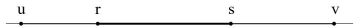

Here is a model for how proofs should go. It is a bit more wordy than it has to be,but that's ok for now.

PROPOSITION 1.1.5 $I \subset J$ and $J \subset K$ implies that $I \subset K$ . (More concisely: $I \subset J$ and $J \subset K \Longrightarrow I \subset K$ ）

Proof. First we write the intervals in term of their endpoints: $I = [ r , s ] , J = [ u , v ]$ ， and $K = \lfloor p , q \rfloor$ .Now we go back to Definition 1.1.4 (and the above diagram） to unravel what our assumptions are saying:

$$
\begin{array} { c c l } { I } & { \subset } & { J \ \mathrm { m e a n s } \ u \leq r \ \mathrm { a n d } \ s \leq v } \\ { J } & { \subset } & { K \ \mathrm { m e a n s } \ p \leq u \ \mathrm { a n d } \ v \leq q . } \end{array}
$$

We must apply the definition now to compare $I$ and $K$ using their endpoints.We can write $p \leq u \leq r$ and $s \leq v \leq q$ . We conclude from these that $p \leq r$ and $s \leq q$ which,according to the definition, means $I \subset K$ . This is what we wanted to prove.

The next two propositions assert that three statements “are equivalent.”This means that when any one of them is true,so are each of the others. Thus,if the three statements are (1),(2),and (3), then we are actually making $s i x$ assertions: $( 1 ) \implies ( 2 )$ ， $( 1 ) \implies ( 3 )$ ， $( 2 ) \implies ( 1 )$ ， $( 2 ) \implies ( 3 )$ ， $( 3 ) \implies ( 1 )$ and (3）= (2). However, you don't have to prove six separate implications, because it sufices to prove only $( 1 ) \Longrightarrow ( 2 )$ ， $( 2 ) \Longrightarrow ( 3 )$ ，and $( 3 ) \Longrightarrow ( 1 )$ . If we know these three, then, for example, $( 2 ) \implies ( 3 ) \implies ( 1 )$ ， so we get $( 2 ) \Longrightarrow$ (1).The full proofs are left as exercises, though we include a piece of one to show what is expected.

PROPOSITiON 1.1.6 The following are equivalent:

1. $I \subset J$   
2. $x \in I \Longrightarrow x \in J$

# 3. J contains the endpoints of $I$

Proof. We will prove just $( 1 ) \implies ( 2 )$ . Suppose, then,that（1） holds,so we are given $I \subset J$ . With our usual notation, this means that $u \leq r$ and $s \leq v$ (see diagram above also). We must use this to prove $x \in I \Longrightarrow x \in J$ ， so assume that $x \in I$ By the definition of $\in$ above,this means that $r \leq x \leq s$ .But,combining this with $u \leq r$ and $s \leq v$ , we can write: $u \leq r \leq x \leq s \leq v$ ，S0 $u \leq x \leq v$ ,which means that $x \in J$

PROPOsITiON 1.1.7 The following are equivalent:

1. $I = J$   
2. $x \in I \Longleftrightarrow x \in J$   
3. $I \subset J$ and $J \subset I$

We now give the definitions of the fundamental arithmetic operations on intervals, also in terms of endpoints. Suppose, then, that $I = \lfloor r , s \rfloor$ and $J = \lfloor u , v \rfloor$

DEFINITION 1.1.8 （ADDITION OF INTERVALS) $I + J$ is the interval $\left[ r + u , s + v \right]$

DEFINITION 1.1.9 （NEGATION OF INTERVALS） $- I$ is the interval $\lfloor - s , - r \rfloor$

DEFINITION 1.1.10 （SUBTRACTION OF INTERVALS） $J - I$ is the interval $\begin{array} { r l } { J + ( - I ) = } \end{array}$ $\left[ u - s , v - r \right]$

NOTATION 1.1.11 （THE O INTERVAL） We will occasionally denote the interval $[ 0 , 0 ]$ simply by 0.

Note that $I - I = [ r , s ] + [ - s , - r ] = [ r - s , s - r ]$ which is not in general equal to the interval O; however,we do have the following result.

PROPOSITION 1.1.12 For all intervals $I$ ， $0 \in I - I$ (Question: for which intervals $I$ is it true that $I - I = [ 0 , 0 ]$ ？)

DEFINITION 1.1.13 （MULTIPLICATION OF INTERVALS） For $I = [ r , s ]$ and $J = \lfloor u , v \rfloor$

$$
\begin{array} { r } { I J = [ \operatorname* { m i n } ( r u , r v , s u , s v ) , \operatorname* { m a x } ( r u , r v , s u , s v ) ] . } \end{array}
$$

When the intervals are “non-negative,” their product is much simpler:

However, with negative endpoints the situation is more complicated. For example,

$$
[ - 3 , 2 ] [ 4 , 5 ] = [ - 1 5 , 1 0 ] .
$$

This definition of the product of two intervals, as you might expect,turns out to be rather difficult to apply when computing successive multiplications of intervals.

Fortunately, there is another way of determining intervals that doesn't depend explicitly on their endpoints,but rather characterizes them in terms of some property $P$ . This kind of definition is very common in abstract mathematics and takes some getting used to.

DEFINITioN 1.1.14 I is the smallest interval having the property $P$ means

1. I has the property $P$ ，and

2.if $J$ also has property $P$ ， then $J \supset I$

What do we mean by a property $P$ ？ $P$ is simply a statement about an interval which may or may not be true. For example, $P$ might be the statement “The interval contains all the rationals between 2 and 3.” This particular statement is true about some intervals—for example, $\lfloor 3 / 2 , 7 / 2 \rfloor$ or [2,3]—and false about others for example, $\lfloor 0 , 1 \rfloor$ (which doesn't contain any rationals between 2 and 3),or $\lfloor 5 / 2 , 9 / 2 \rfloor$ (which doesn't contain all rationals between 2 and 3).

For $I$ to be“smallest” for a property $P$ ， not only does $P$ have to hold for the interval $I$ ,but any interval for which $P$ also holds must contain $I$ .Thus, [2,3] is actually the smallest interval containing all the rationals between 2 and 3; i.e., it's smallest for this particular property. Here's a proof of this fact in somewhat more generality. It shows how this kind of argument works.

PROPOSITION 1.1.15 $\lfloor r , s \rfloor$ is the smallest interval containing all rationals between $r$ and $s$

Proof. We must verify two things: that $\lfloor r , s \rfloor$ actually has this property—i.e. that it contains all rationals between $r$ and $s$ —and that any other interval containing these rationals actually contains $\lfloor r , s \rfloor$

So, let's show that $\lfloor r , s \rfloor$ has the property. Suppose $_ x$ is a rational between $r$ and $s$ ; this means that $r \leq x \leq s$ . By Definition 1.1.2, this means that $x \in \left\lfloor r , s \right\rfloor$ . Thus, $\lfloor r , s \rfloor$ does actually contain all these rationals.

Now, suppose that $K$ is any other interval containing al rationals between $r$ and $s$ .Since both $r$ and $s$ are themselves rationals between $r$ and $s$ , it follows that $K$ contains the endpoints $r$ and $s$ . By Proposition 1.1.6, $I \subset K$ and we are done. □

We should note that， for a given property $P$ , there may not be any rational interval which is smallest for $P$ . (For example, let $P$ be the property “The interval contains all $_ { x }$ with $x ^ { 3 } > 2$ .").However, if there is a smallest,it is unique in the following sense.

PROPOSITION 1.1.16 If $I$ and $J$ are both smallest intervals with the property $P$ ， then $I = J$

(This is left as an exercise. Hint: prove this using Proposition 1.1.7 which characterizes equality of intervals.）

We now apply this “smallest interval” idea to give alternative characterizations for the various operations on rational intervals.

# PROPOSITION 1.1.17

1. $I + J$ is the smallest interval containing all $x + y$ ，with $x \in I$ and $y \in J$

2. $- I$ is the smallest interval containing all $- x$ with $x \in I$

3. IJ is the smallest interval containing all xy with $x \in I$ and $y \in J$

Proof. We will just prove part (3)，which is the trickiest. The property here is “contains all $x y$ with $x \in  { I }$ and $y ~ \in ~ J$ .”We must first show that $I J$ has this property,i.e. that it contains all these $x y$ .Suppose then that $x \in I$ ，S0 $r \leq x \leq s$ Hence, if $y \geq 0$ ,then $r y \le x y \le s y$ and if $y < 0$ ，then $s y \leq x y \leq r y$ . So in either case, $x y$ lies between $r y$ and $s y$ . By the same reasoning,when $u \leq y \leq v$ ，we have that $r y$ must be between $r u$ and $r v$ ,and $s y$ between $s u$ and $s v$

Therefore in all cases $x y$ is between the minimum and the maximum of the four products $r u , r v , s u , s v$ ．By definition, then $x y$ isin $I J$ .This proves the first half of what we need. Now suppose that some other interval (we could call it $K$ ）also contains all of these $x y$ .We must show that $I J \subset K$ .From the definition of the product $I J$ ，we see that both endpoints of $I J$ are of the form $x y$ with $x \in I$ and $y \in J$ （ $_ x$ is either $r$ or $s$ ，and $_ y$ is either $_ u$ or $\boldsymbol { v }$ ).Hence any interval $K$ that contains all such products must contain these endpoints and therefore the entire interval $I J$ (see Proposition 1.1.6).

The two remaining parts of this proposition are left for the exercises at the end of this section.■

Now we turn to the “strict” inequality of intervals.

DEFINITION 1.1.18 （STRICT INEQUALITY FOR INTERVALS) $I < J$ (also written $J >$ $I$ ）means that $s < u$ ：

Here is a simple picture of this.

$$
{ \operatorname { \underbrace { \stackrel { \mathrm { r } } { \longleftrightarrow } \quad \quad } } { \operatorname { \longrightarrow } \quad \quad } } \operatorname { \mathrm { g a p } } _ { \mathrm { ( s < u ) } } ^ { \mathrm { u } } { \frac { \mathrm { v } } { \longleftrightarrow \quad } }
$$

Intuitively, if the intervals represent scientific measurements of quantities $P$ and $Q$ , and if the intervals overlap (so there is no gap),we could not conclude anything about the relative sizes of $P$ and $Q$ .For example, if [1,3] measures a quantity $P$ and [2,5] measures $Q$ ，then $P < Q , Q < P$ and $P = Q$ are all possible.Of course, we haven't yet defined any “objects” other than rationals,nor relations such as $<$ ， $>$ ， or = between anything other than rationals—this is just a suggestion for why we make this definition instead of one based on the length of the intervals or based on the $\subset$ relation.

PROPOSITION 1.1.19 $I < J$ if and only if $0 < J - I$

As long as we keep away from zero, we can define reciprocals, and from them, division.

DEFINITION 1.1.20 （RECIPROCAL） For $I > 0$ or $I < 0$ ， $1 / I$ is the interval $\lfloor 1 / s , 1 / r \rfloor$

Note that this makes sense because if either $0 < r \le s$ ，or $r \leq s < 0$ ，then $1 / s \le 1 / r$ S0 $\lfloor 1 / s , 1 / r \rfloor$ is actually an interval,which it wouldn't be if $\lfloor r , s \rfloor$ contained $0$ (check $\lfloor - 2 / 3 , 1 \rfloor$ for example).

PROPOSITION 1.1.21 For any $I > 0$ or $I < 0$ ， $1 / I$ is the smallest interval containing all $1 / x$ for $x \in I$

If we think of a rational interval as the result of a scientific measurement, then the length of the interval is an indication of how good (accurate) the measurement is.

DEFINITION 1.1.22 (LENGTH) $\ell ( I ) = s - r$ is the length of $\lfloor r , s \rfloor$

PROPOSITION 1.1.23 $\ell ( I + J ) = \ell ( I ) + \ell ( J )$

PROPOSITION 1.1.24 $\ell ( - I ) = \ell ( I )$

There is no very simple formula for the lengths of products or reciprocals of interval in terms of the lengths of the intervals themselves； however,we can get some inequalitites which will be useful later. We deal with reciprocals first. We must keep away from zero!

PROPOSITION 1.1.25 Suppose $I = \lfloor r , s \rfloor$ and $c$ is a any number such that $0 < c \leq r$ ： then $\ell ( 1 / I ) \leq \ell ( I ) / c ^ { 2 }$

Proof. $\ell ( 1 / I ) = 1 / r - 1 / s = ( s - r ) / r s = \ell ( I ) / r s$ . A fraction is biggest when its denominator is smallest,and $c \leq r \leq s$ tells us that $r s$ is never smaller than $c ^ { 2 }$ Therefore $\ell ( 1 / I ) \leq \ell ( I ) / c ^ { 2 }$ ■

When $r \geq c$ and $c > 0$ ，we sometimes say that‘ $_ c$ bounds $I$ away from 0.” A shorthand way of writing the condition is $I \subset \lfloor c , \infty )$ with $c > 0$ . We can also bound an interval away from O in the negative direction and get a similar result (left as an exercise):

PROPOSITION 1.1.26 Suppose $I \subset ( - \infty , d )$ where $d < 0$ . Then $\ell ( 1 / I ) \leq \ell ( I ) / d ^ { 2 }$

Now we turn to multiplication.

PROPOSITION 1.1.27 Let $A$ and $B$ be positive rationals such that $I \subset \lfloor - A , A \rfloor$ and $J \subset [ - B , B ]$ . Then $\ell ( I J ) \leq B \ell ( I ) + A \ell ( J )$

Proof. By definition $I J = \left\lfloor a b , c d \right\rfloor$ where $^ { a }$ and $c$ are endpoints of $I = \lfloor r , s \rfloor$ (in some order）and $b$ and $d$ are endpoints of $J = \lfloor u , v \rfloor$ . Therefore

$$
\begin{array} { l c l } { { \ell ( I J ) } } & { { = } } & { { c d - a b = c d - a d + a d - a b } } \\ { { } } & { { } } & { { } } \\ { { } } & { { = } } & { { d ( c - a ) + a ( d - b ) } } \end{array}
$$

with $\vert d \vert \le B$ ， $| a | \le A$ ， $| c - a | \leq \ell ( I )$ and $| d - b | \leq \ell ( J )$ . Here is our first of many applications of the Triangle Inequality 0.2.9:

$$
\begin{array} { r c l } { \ell ( I J ) } & { = } & { | \ell ( I J ) | \ \mathrm { ( s i n c e ~ t h e y ~ a r e ~ b o t h ~ p o s i t i v e ) } } \\ & { = } & { | d ( c - a ) + a ( d - b ) | } \\ & { \leq } & { | d ( c - a ) | + | a ( d - b ) | \ \mathrm { ( T r i a n g l e ~ I n e q u a l i t y ! ) } } \\ & { = } & { | d | \left| c - a \right| + | a | \left| d - b \right| \ \mathrm { ( p r o p e r t i e s ~ o f ~ o r d i n a r y ~ a b s . ~ v a l . ) } } \\ & { \leq } & { B \ell ( I ) + A \ell ( J ) . } \end{array}
$$

Note that $\lfloor r , s \rfloor \subset \lfloor - A , A \rfloor$ is simply saying that $0 \leq | r | \leq A$ and $0 \leq | s | \leq A$ .The inequality $\ell ( I J ) \leq B \ell ( I ) + A \ell ( J )$ looks a little like the product rule from calculus. In fact,the trick of adding and subtracting the term $^ { a d }$ in the first part of the proof is also used in proving the product rule. You will see this adding and subtracting trick several times later on. (It has already been used in exercise 7 on page 8.)

DEFINITION 1.1.28（ABSOLUTE VALUE FOR INTERVALS） SuppoSe $I = \lfloor r , s \rfloor$ ; then

$$
| I | = \left\{ \begin{array} { c l } { I } & { w h e n ~ r > 0 ~ ( i . e . ~ w h e n ~ I > 0 ) } \\ { - I } & { w h e n ~ s < 0 ~ ( i . e . ~ w h e n ~ I < 0 ) } \\ { { [ 0 , \operatorname* { m a x } ( - r , s ) ] } } & { w h e n ~ r \leq 0 \leq s ~ ( i . e . ~ w h e n ~ 0 \in I ) } \end{array} \right.
$$

PROPOSITION 1.1.29 $\mid I \mid$ is the smallest interval containing all $\left| x \right|$ for $x \in I$

PROPOSITION 1.1.30 $\ell ( | I | ) \leq \ell ( I )$

(Proof: show that for each $I$ ,either $| I | \subset I$ or $| I | \subset - I .$ ）

DEFINITION 1.1.31 (MAX AND MIN FOR INTERVALS)

$$
\begin{array} { r } { \operatorname* { m a x } ( I , J ) = [ \operatorname* { m a x } ( r , u ) , \operatorname* { m a x } ( s , v ) ] } \\ { \operatorname* { m i n } ( I , J ) = [ \operatorname* { m i n } ( r , u ) , \operatorname* { m i n } ( s , v ) ] . } \end{array}
$$

Here is a diagram showing max and min for two intervals $\lfloor r , s \rfloor$ and $\lfloor u , v \rfloor$

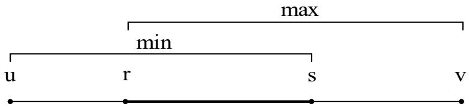

PROPOSITION 1.1.32 $K < \operatorname* { m a x } ( I , J )$ if and only if $K < I$ or $K < J ; K > \operatorname* { m a x } ( I , J )$ if and only if $K > I$ and $K > J$

(A similar result holds for min.)

PROPOSITION 1.1.33 The interval $\operatorname* { m a x } ( I , J )$ is the smallest interval containing all $\operatorname* { m a x } ( x , y )$ for $x \in I$ and $y \in J$ . Also $\operatorname* { m i n } ( I , J )$ is the smallest interval containing all $\operatorname* { m i n } ( x , y )$ for $x \in I$ and $y \in J$

PROPOSITION 1.1.34 $\ell ( \operatorname* { m a x } ( I , J ) ) \leq \operatorname* { m a x } ( \ell ( I ) , \ell ( J ) ) ;$ $\ell ( \operatorname* { m i n } ( I , J ) ) \leq \operatorname* { m a x } ( \ell ( I ) , \ell ( J ) ) .$

If this seems strange,look at $I = [ 0 , 1 0 0 0 ]$ and $J = [ 9 9 9 , 1 0 0 0 ]$ for example.)

More generally, given finitely many intervals $I _ { i } = \lfloor r _ { i } , s _ { i } \rfloor$ ， $i = 1 , \ldots , n$ ， we make similar definitions:

DEFINITION 1.1.35 $\begin{array} { r l } & { \operatorname* { m a x } ( I _ { 1 } , \ldots , I _ { n } ) = [ \operatorname* { m a x } ( r _ { 1 } , \ldots , r _ { n } ) , \operatorname* { m a x } ( s _ { 1 } , \ldots , s _ { n } ) ] ; } \\ & { \operatorname* { m i n } ( I _ { 1 } , \ldots , I _ { n } ) = [ \operatorname* { m i n } ( r _ { 1 } , \ldots , r _ { n } ) , \operatorname* { m i n } ( s _ { 1 } , \ldots , s _ { n } ) ] . } \end{array}$

These can also be phrased “recursively” as follows:

$$
\begin{array} { r } { \operatorname* { m a x } ( I _ { 1 } , \ldots , I _ { n } ) = \operatorname* { m a x } ( \operatorname* { m a x } ( I _ { 1 } , \ldots , I _ { n - 1 } ) , I _ { n } ) } \\ { \operatorname* { m i n } ( I _ { 1 } , \ldots , I _ { n } ) = \operatorname* { m i n } ( \operatorname* { m i n } ( I _ { 1 } , \ldots , I _ { n - 1 } ) , I _ { n } ) . } \end{array}
$$

PROPOSITION 1.1.36 The interval $\operatorname* { m a x } ( I _ { 1 } , \ldots , I _ { n } )$ is the smallest interval that contains all $\operatorname* { m a x } ( x _ { 1 } , \ldots , x _ { n } )$ for $x _ { i } \in I _ { i }$ ， $i = 1 , \ldots , n$ ， $A l s o \operatorname* { m i n } ( I _ { 1 } , \ldots , I _ { n } )$ is the smallest interval that contains all $\operatorname* { m i n } ( x _ { 1 } , \ldots , x _ { n } )$ for $x _ { i } \in I _ { i } , i = 1 , \ldots , n .$

EXAMPLE 1.1.37 Use the definition above to show that an equivalent formulation of the definition of $| I | \ i s \ | \ I | \ = \operatorname* { m a x } ( I , - I , 0 )$

PROPOSITION 1.1.38 $\ell ( \operatorname* { m a x } ( I _ { 1 } , \dots , I _ { n } ) ) \leq \operatorname* { m a x } ( \ell ( I _ { 1 } ) , \dots , \ell ( I _ { n } ) ) ;$ $\ell ( \operatorname* { m i n } ( I _ { 1 } , \dots , I _ { n } ) ) \leq \operatorname* { m a x } ( \ell ( I _ { 1 } ) , \dots , \ell ( I _ { n } ) )$

# Exercises

1. Let $I = \left\lfloor - 2 , 7 \right\rfloor$ ， $J = \left\lfloor - 3 , 8 \right\rfloor$ ， $K = \lfloor 4 , 7 \rfloor$

(a) Compute the following intervals: $I + J$ ， $I - J$ ， $J - K$ ， $I J$ ， $I K$ ， $J K$ ， $1 / K$ ， $J ( 1 / K )$   
(b） Compute $\operatorname* { m a x } ( I , J )$ and $\operatorname* { m i n } ( I , J )$ . Draw a diagram showing $I$ ， $J$ ，and the max and min.   
(c）Is $( I - J ) + ( J - K )$ equal to $I - K$ ？   
(d) Discuss $1 / I$ ， $1 / J$ ， $1 / K$ and $1 / ( - K )$

2. Compare $[ - 4 , - 2 ] ^ { 2 }$ and $[ 2 , 4 ] ^ { 2 }$ . Do you have a generalization?

3. Show by example that $\ell ( I ^ { n } ) = [ \ell ( I ) ] ^ { n }$ does not always hold. Is it ever true?

4. Prove that $I < J$ if and only if $x < y$ for every $x \in I$ and $y \in J$ 5. When the endpoints of an interval are all non-negative,multiplication of the intervals is much simplified.

(a） Suppose $r \geq 0$ and $u \geq 0$ . Prove that $\vert r , s \vert \cdot \vert u , v \vert = \vert r u , s v \vert$   
(b) Again assuming that $r \geq 0$ and $u \geq 0$ ， give a simplified proof that $\left\lfloor r , s \right\rfloor \cdot$ $\left\lfloor u , v \right\rfloor$ is the smallest interval containing all the products $x y$ where $x \in \left\lfloor r , s \right\rfloor$ and $y \in \left\lfloor u , v \right\rfloor$

6.Suppose intervals $I$ and $J$ have an element in common (i.e. there is an $_ { x }$ with $x \in I$ and $x \in J$ ).Is it always true that for any interval $K$ ， $I + K$ and $J + K$ have an element in common? What about $I K$ and $J K$ ？

7. Suppose $I < J$ . Prove that $\operatorname* { m a x } ( I , J ) = J$ . What about $\operatorname* { m i n } ( I , J )$ ？

The next exercises ask you to prove some propositions left unproved in the text.In what follows,we will use O to denote the interval $[ 0 , 0 ]$ its meaning will be clear from context.For example, $[ r , s ] > 0$ will mean $[ r , s ] > [ 0 , 0 ]$ ；i.e. $r > 0$

8. Prove that the following are equivalent:

(a) $I \subset J$   
(b） $x \in I \Longrightarrow x \in J$   
(c） $J$ contains the endpoints of $I$

9. Prove that the following are equivalent:

(a) $I = J$ (b） $x \in I \Longleftrightarrow x \in J$ (c） $I \subset J$ and $J \subset I$

10.Prove that, for all intervals $I$ ， $0 \in I - I$

11.Prove that, if $I$ and $J$ are both smallest intervals with the property $P$ ，then $I = J$

12. Prove:

(a) $I + J$ is the smallest interval containing all $x + y$ ,for $x \in I$ and $y \in J$ (b） $- I$ is the smallest interval containing all $- x$ for $x \in I$ (c) For any $I > 0$ or $I < 0$ ， $1 / I$ is the smallest interval containing all $1 / x$ for $x \in I$

(d) $\mid I \mid$ is the smallest interval containing all $\mid x \mid$ for $x \in I$ . (You must deal with each case of $| \ |$ separately.)

Note that in each case you must prove two things: (1) the interval actually has the property and (2) it is contained in any other interval that has the property.

13. Prove that $I < J$ if and only if $0 < J - I$

14. Prove:

(a)If $I \subset J$ ,then $\ell ( I ) \leq \ell ( J )$   
(b) $\ell ( I + J ) = \ell ( I ) + \ell ( J )$   
（c） $\ell ( - I ) = \ell ( I )$   
(d）For $I \subset ( - \infty , d ]$ with $d < 0$ ， $\ell ( 1 / I ) \leq \ell ( I ) / d ^ { 2 }$ $\mathbf { \chi } ( | r , s | \subset ( - \infty , d ]$ simply means $s < d$   
(e) $\ell ( \left| \textbf { } I \right| ) \leq \ell ( I )$

15.Investigate the inclusion $( \subset )$ relations,if any,among $I$ ， $J$ ， $\operatorname* { m i n } ( I , J )$ and $\operatorname* { m a x } ( I , J )$ .What if $I \subset J$ ？

16.Here are some basic properties of the rational numbers:

(f) $| a b | = | a | | b |$

(g） $a > 0$ if and only if $- a < 0$ (h）If $a > 0$ and $b > 0$ ,then $a + b > 0$ (i)If $a > 0$ and $b > 0$ ,then $a b > 0$ (j） If $a b > 0$ , then either $a > 0$ and $b > 0$ or $a < 0$ and $b < 0$ (k）If $a _ { 1 } + \cdots + a _ { n } > b$ , then,for at least one value of $i , ~ i = 1 , \ldots , n$ ， we have $a _ { i } > b / n$

Verify that all of these properties still hold when we replace the rational numbers $a , b , c , \ a _ { 1 } , \ldots , a _ { n }$ ，by intervals: $I , J , K , I _ { 1 } , \ldots , I _ { n }$ .(Hint: Several of the proofs-notably those involving more than two intervals-will be much easier if you use the “smallest interval” characterization of the various operations on intervals-see Proposition 1.1.14 and subsequent applications.)

(l)Here is another basic property of the rationals (the “distributive law"): $a ( b + c ) = a b + a c$ . Verify that, for intervals $I , J , K$ we always have

$$
I ( J + K ) \subset I J + I K .
$$

However, make up an example for which $I ( J + K ) \neq I J + I K$ . (Note that $I ( J + K ) \subset I J + I K$ is actually an equality when all the intervals are positive—you may want to try to prove this. Thus,your example must involve at least one negative endpoint—nearly any will work!).

# 1.2Families of Intersecting Intervals

Although it many never happen, two experimenters measuring the same quantity might,in fact,obtain the exact same measurement (rational number） for it with their instruments. If their experiments are represented by the rational intervals $I$ and $J$ ,then this common measurement must belong to both of these intervals.We make this formal by the following definition.

DEFINITION 1.2.1 We say the interuals $I$ and $J$ intersect, or meet, if there is $a$ rational number x which belongs to both $I$ and $J$ (i.e. $x \in I$ and $x \in J$ ）

Here is the very important characterization of intersection in terms of endpoints.

PROPOSITION 1.2.2 $I = \lfloor r , s \rfloor$ and $J = \lfloor u , v \rfloor$ intersect $\iff r \leq v$ and $u \leq s$

Proof. ( $\Rightarrow$ ): If $_ { x }$ belongs to both, then $r \leq x \leq s$ and $u \leq x \leq v$ Thus $r \leq x \leq v$ S0 $r \leq v$ . Similarly $u \leq s$

$\Leftarrow$ ): If $r \leq v$ and $u \leq s$ , then $\operatorname* { m a x } ( r , u ) \leq \operatorname* { m i n } ( s , v )$ . We also have $r \leq \operatorname* { m a x } ( r , u )$ ， $u \leq \operatorname* { m a x } ( r , u )$ ; similarly, $\operatorname* { m i n } ( s , v ) \leq s$ and $\operatorname* { m i n } ( s , v ) \leq v$ . Thus,the entire interval $\left| \operatorname* { m a x } ( r , u ) , \operatorname* { m i n } ( s , v ) \right|$ is contained in both $I$ and $J$ $\mid$

NOTATION 1.2.3 If $I$ and $J$ intersect, their intersection is an interval given by

$$
I \cap J = [ \operatorname* { m a x } ( r , u ) , \operatorname* { m i n } ( s , v ) ] .
$$

(The intersection of finitely many intervals can be characterized as a smallest intervalsee the Exercise 9 at the end of this section.)

There are several ways intervals can intersect. It may be that $\left| r , s \right| \subset \left| u , v \right|$ ,in which case the intersection is all of $\lfloor r , s \rfloor$ ：

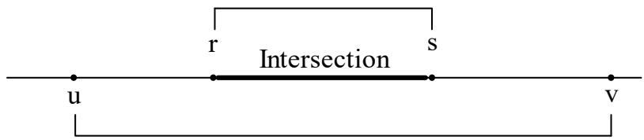

or it may be that only parts of the intervals meet ( $u < r < v < s$ ， making the intersection $\lfloor r , v \rfloor$ )：

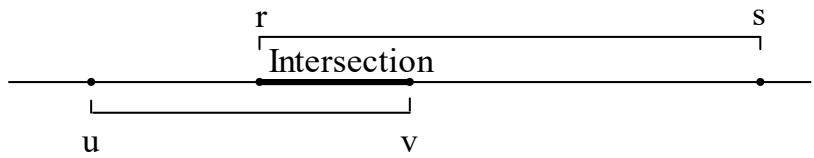

or they may just have an endpoint in common ( $r < s = u < v$ ,making the intersection $\left\lfloor s , s \right\rfloor = \left\lfloor u , u \right\rfloor$ )：

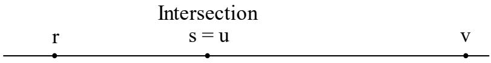

We should point out that the symbol $\cap$ is not a verb!It is a common mistake to read“ $I \cap J ^ { \mathrm { v } }$ as $^ { \circ } I$ intersects $J ^ {  } \colon I \cap J$ is either undefined (when $I$ and $J$ don't meet),or it is an interval (when they do). $I \cap J$ is not a statement or assertion,it is a thing or a noun.

From this it should be clear that $I$ and $J$ intersect if an only if neither lies to the right or left of the other; i.e. $I$ and $J$ intersect $\Longleftrightarrow I < J$ and $J < I$ are both false. (The proof of this is an exercise.)

PROPOSITiON 1.2.4 Given a finite collection of intervals with ${ { I } _ { k } } \mathrm { ~ = ~ } { { \left[ { { r } _ { i } } , { { s } _ { i } } \right] } }$ ， $k =$ $1 , \ldots , n$ , if each pair of them intersect, then all of them do. In fact,any number in $\left| \operatorname* { m a x } ( r _ { 1 } , \ldots , r _ { n } ) , \operatorname* { m i n } ( s _ { 1 } , \ldots , s _ { n } ) \right|$ belongs to all the intervals $I _ { k }$ ·

NOTATION 1.2.5 For interuals $I _ { k } = \lfloor r _ { i } , s _ { i } \rfloor$ that intersect,

$$
\bigcap _ { k = 1 } ^ { n } I _ { i } = [ \operatorname* { m a x } ( r _ { 1 } , \ldots , r _ { n } ) , \operatorname* { m i n } ( s _ { 1 } , \ldots , s _ { n } ) ] .
$$

REMARk 1.2.6 Another way of saying this is that, given a finite number of intervals, their common intersection is equal to the intersection of any one whose left endpoint is farthest to the right with any one whose right endpoint is farthest to the left.

We now move from dealing with individual intervals to dealing with families of intervals. Science advances by considering experiments done by many, and the numerical nature of a quantity emerges from a multiplicity of measurements, expressed as a family of intervals. Now if $I$ and $J$ are intervals resulting from experiments to measure the same quantity,and $I$ lies wholly to the left or wholly to the right of $J$ , then we can be sure that at least one of the experiments is incorrect. Such measurements might be described as inconsistent.

EXAMPLE 1.2.7 In the mid 1990s,astronomers obtained two measurements for the age of the universe. Using data from the Hubble space telescope and the theory of the expanding universe, they came up with the time of creation lying in the interval $\lfloor - 1 6 , - 1 4 \rfloor$ (billion years ago). On the other hand,astronomers studying stellar chemistry and the life-cycle of stars concluded, from the ages of the oldest stars, that this creation occurred in the interval $\lfloor - 1 2 , - 8 \rfloor$ . These intervals don't intersect! Fortunately, errors were detected within a year or so, and new computations produced intersecting intervals.

DEFINITION 1.2.8 $\mathcal { F }$ is a consistent family of intervals means that for every pair of intervals $I$ and $J$ in $\mathcal { F }$ ， $I$ and $J$ intersect.

Thus,in the Hubble example above, the family $\{ \lfloor - 1 6 , - 1 4 \rfloor , \lfloor - 1 2 , - 8 \rfloor \}$ is not consistent. On the other hand, $\{ \vert - 1 , 4 \vert , \vert 1 , 7 \vert , \vert 3 / 2 , 3 \vert \}$ is consistent—any two intervals contain 2, or $5 / 2$ ,or 3,etc., so there are numbers that are common to all of the intervals in this family. Using Proposition 1.2.4 above,we can easily prove the following.

PROPOSITION 1.2.9 If $\mathcal { F }$ is a consistent family having only a finite number of intervals, then there is at least one rational number which is in every one of the intervals of $\mathcal { F }$

You may find it surprising that this fact about finite families is not necessarily true for infinite families. As we shallsee in the next section (see Exercise 10 on page 38), the family

$$
\mathcal { C } 2 = \{ [ a , b ] | a ^ { 3 } \leq 2 \leq b ^ { 3 } \}
$$

is consistent (any two intervals intersect), but there is no rational number common to all of its intervals.

If a valid experiment produces an interval $\lfloor r , s \rfloor$ in measuring a physical quantity $Q$ ,and another such experiment produces $\lfloor u , v \rfloor$ , then we would deduce that the intersection of these intervals, $\left| \operatorname* { m a x } ( r , u ) , \operatorname* { m i n } ( s , t ) \right|$ ,might also be a valid measurement for $Q$ . For example,experiment A may determine a lower bound $r$ for $Q$ only, so $s$ might be an arbitrarily large number. Similarly, experiment B may determine an upper bound $v$ ，so that $^ u$ is arbitrarily small. Then $\left\lfloor r , v \right\rfloor$ could be deduced as a bounding interval for $Q$ .1 The idea of taking intersections of intervals can be applied to any consistant family of intervals,and consistency will be preserved; that is the content of the following proposition.(We will not actually be doing this kind of construction here,so we just state it for the record.)

PROPOSITION 1.2.10 If $\mathcal { F }$ is a consistent family of intervals, so is the family of all finite intersections of members of $\mathcal { F }$ ， and it contains $\mathcal { F }$ as a subfamily.

Just as we defined algebraic operations on rational intervals based on those for rational numbers, we now define algebraic operations on families of rational intervals based on the ones we defined for intervals.

NOTATION 1.2.11 If $\mathcal { F }$ is a family of rational intervals, then $I \in { \mathcal { F } }$ means that $I$ is an interval of $\mathcal { F }$ .

DEFINITION 1.2.12 Given $\mathcal { F }$ and $\mathcal { G }$ families of intervals, $\mathcal { F } + \mathcal { G }$ is the family $\{ I + J \mid I \in { \mathcal { F } } , J \in { \mathcal { G } } \}$ $- \mathcal { F }$ is the family $\{ - I \mid I \in { \mathcal { F } } \}$ $\mathcal { F G }$ is the family $\{ I J \mid I \in { \mathcal { F } } , J \in { \mathcal { G } } \}$ $| \mathcal F |$ is the family $\{ | I | \mid I \in { \mathcal { F } } \}$

If at least one interval of $\mathcal { F }$ doesn't contain O, then $1 / \mathcal { F }$ is the family

$$
\left\{ 1 / I \mid I \in { \mathcal { F } } \ a n d 0 \not \in I \right\} .
$$

$\operatorname* { m a x } ( \mathcal { F } , \mathcal { G } )$ is the family $\{ \operatorname* { m a x } ( I , J ) \mid I \in \mathcal { F } , J \in \mathcal { G } \}$ $\operatorname* { m i n } ( \mathcal { F } , \mathcal { G } )$ is the family $\{ \operatorname* { m i n } ( I , J ) \mid I \in \mathcal { F } , J \in \mathcal { G } \}$ $\mathcal { F } - \mathcal { G }$ is the family $\mathcal { F } + ( - \mathcal { G } )$

PROPOSITION 1.2.13 If both $\mathcal { F }$ and $\mathcal { G }$ are consistent families, so are $\mathcal { F } + \mathcal { G } , \ - \mathcal { F }$ ， FG,1/F, $| \mathcal F |$ ， $\operatorname* { m a x } ( \mathcal { F } , \mathcal { G } )$ ，and $\operatorname* { m i n } ( \mathcal { F } , \mathcal { G } )$

Proof. Since $\mathcal { F }$ and $\mathcal { G }$ are both consistent, given $I , I ^ { \prime } \in { \mathcal { F } }$ and $J , J ^ { \prime } \in \mathcal { G }$ , there is an $x \in I \cap I ^ { \prime }$ and a $y \in J \cap J ^ { \prime }$ . Hence $x + y$ is in both $I + J$ and $I ^ { \prime } + J ^ { \prime }$ ， $- x$ is in both $- I$ and $- I ^ { \prime }$ ， $x y$ is in both $^ { \textit { \textbf { I J } } }$ and $I ^ { \prime } J ^ { \prime }$ ， $| x |$ is in both $| I |$ and $\left| I ^ { \prime } \right|$ ， $\operatorname* { m a x } ( x , y )$ is in both $\operatorname* { m a x } ( I , J )$ and $\operatorname* { m a x } ( I ^ { \prime } , J ^ { \prime } )$ ，and $\operatorname* { m i n } ( x , y )$ is in both $\operatorname* { m i n } ( I , J )$ and $\operatorname* { m i n } ( I ^ { \prime } , J ^ { \prime } )$ So $\mathcal { F } + \mathcal { G } , - \mathcal { F } , \mathcal { F } \mathcal { G } , | \mathcal { F } |$ ， $\operatorname* { m a x } ( \mathcal { F } , \mathcal { G } )$ and $\operatorname* { m i n } ( \mathcal { F } , \mathcal { G } )$ are consistent families of intervals.

Finally, suppose $I$ and $I ^ { \prime }$ are in $\mathcal { F }$ and neither contains O. Since $\mathcal { F }$ is consistent, there is an $_ { x }$ lying in both intervals; of course $_ { x }$ is non-zero．Then $1 / x$ lies in both $1 / I$ and $1 / I ^ { \prime }$ ■

Sometimes two quantities thought to be different are actually the same. One indication that this may be the case is that families of measurements fail to distinguish them; i.e., any measurement of one meets or overlaps any measurement of the other. (Of course,the bigger and more “accurate” the families the more likely it is that the quantities are the same,but we will deal with this idea later.)

DEFINITION 1.2.14 (CONSISTENT FAMILIEs) Given two families of intervals $\mathcal { F }$ and $\mathcal { G }$ ，we say $\mathcal { F }$ is consistent with $\mathcal { G }$ if each interval from the family $\mathcal { F }$ intersects each interval from the family $\mathcal { G }$ . This relation is denoted $\mathcal { F } \sim \mathcal { G }$

EXAMPLE 1.2.15 Let $\mathcal { F } = \{ \vert 1 , 3 \vert , \vert 4 , 9 \vert \}$ ; then $\mathcal { F }$ isn't even consistent with itself ( $\mathcal { F }$ is inconsistent).On the other hand,if $\mathcal { G } = \{ [ 1 . 2 , 1 . 7 ]$ ,[1.3,1.5],[1.4,1.5]} and $\mathcal { H } =$ {[1.25,1.5],[1.4,1.45]}, then it is not difficult to check that $\mathcal { G }$ and $\mathcal { H }$ are consistent: the number 1.4l4, for example, belongs to every interval in these families.

With this definition,a consistent family of intervals is one that is consistent with itself. Thus, $\mathcal { F }$ is consistent if and only if $\mathcal { F } \sim \mathcal { F }$

PROPOSITION 1.2.16 Given $\mathcal { F }$ and $\mathcal { G }$ consistent families of intervals, ${ \mathcal { F } } \sim { \mathcal { G } }$ if and only if ${ \mathcal { F } } \cup { \mathcal { G } }$ is a consistent family (where $\mathcal { F } \cup \mathcal { G }$ consists of all intervals that are in either $\mathcal { F }$ or $\mathcal { G }$ ）

Once again,mathematicians like to see how relations between objects (such as consistency）behave when we perform arithmetic operations on the objects. For example,in number theory we know that if $M \equiv M ^ { \prime } { \bmod { ( } } K )$ （ $M$ is congruent to $M ^ { \prime }$ mod $K$ ）and $N \equiv N ^ { \prime } { \bmod { ( } } K )$ ，then $M + N \equiv M ^ { \prime } + N ^ { \prime } { \bmod { ( } } K )$ (and similarly for subtraction and multiplication). The next result shows that consistency works similarly.

PROPOSITION 1.2.17 Suppose that $\mathcal { F } \sim \mathcal { F } ^ { \prime }$ and $\mathcal { G } \sim \mathcal { G } ^ { \prime }$ . Then we also have:

1. $\mathcal { F } + \mathcal { G } \sim \mathcal { F } ^ { \prime } { + } \mathcal { G } ^ { \prime }$   
2. $- \mathcal { F } \sim - \mathcal { F } ^ { \prime }$   
3. $\mathcal { F } \mathcal { G } \sim \mathcal { F } ^ { \prime } \mathcal { G } ^ { \prime }$   
4 $1 / \mathcal { F } \sim 1 / \mathcal { F } ^ { \prime }$ (when defined)   
5. $| \mathcal { F } | \sim | \mathcal { F } ^ { \prime } |$   
6. $\operatorname* { m a x } ( \mathcal { F } , \mathcal { G } ) \sim \operatorname* { m a x } ( \mathcal { F } ^ { \prime } , \mathcal { G } ^ { \prime } )$   
7. $\operatorname* { m i n } ( \mathcal { F } , \mathcal { G } ) \sim \operatorname* { m i n } ( \mathcal { F } ^ { \prime } , \mathcal { G } ^ { \prime } )$

(A trivial modification of the proof of Proposition 1.2.13 (preservation of consistency) proves this proposition as well; simply take $I \in { \mathcal { F } }$ ， $I ^ { \prime } \in \mathcal { F } ^ { \prime }$ ， $J \in { \mathcal { G } }$ and $J ^ { \prime } \in \mathcal { G } ^ { \prime }$ .）

PROPOSITION 1.2.18 Suppose the families $\mathcal { F }$ ， $\mathcal { G }$ ，and $\mathcal { H }$ are consistent. Then

1. $\mathcal { F } ( \mathcal { G } \mathcal { H } ) \sim ( \mathcal { F } \mathcal { G } ) \mathcal { H }$   
2. $\mathcal { F } ( \mathcal { G } + \mathcal { H } ) \sim \mathcal { F } \mathcal { G } + \mathcal { F } \mathcal { H }$   
3. $\mathcal { F } + ( \mathcal { G } + \mathcal { H } ) \sim ( \mathcal { F } + \mathcal { G } ) + \mathcal { H }$   
4 $| { \mathcal { F G } } | \sim | { \mathcal { F } } | | { \mathcal { G } } |$

Proof. We will just prove (1) since the others work similarly. We must show that every interval of the left-hand family meets every interval of the right-hand family. By definition,a typical interval on the left looks like $I ( J K )$ ,while one on the right looks like $( I ^ { \prime } J ^ { \prime } ) K ^ { \prime }$ ，where $I , I ^ { \prime } \in { \mathcal { F } }$ ， $J , J ^ { \prime } \in \mathcal { G }$ ，and $K , K ^ { \prime } \in \mathcal { H }$ . By consistency, we can find numbers $x \in I \cap I ^ { \prime }$ ， $y \in J \cap J ^ { \prime }$ ，and $z \in K \cap K ^ { \prime }$ . It is now clear that the element $x ( y z ) = ( x y ) z$ lies in both triple products,so that $I ( J K )$ and $( I J ) K$ meet.

Suppose we make measurements of two physical constants, $C$ and $D$ ,and find that $C$ is between 1.88 and 1.92,while $D$ is between 1.85 and 1.90. This shows that $C$ and $D$ do not differ by more than .O7.But it does not reveal whether $C$ and $D$ are distinct or not. However, suppose we make a second set of measurements and find also that $C$ lies between 1.894 and 1.913,and $D$ is between 1.889 and 1.891. This does enable us to conclude that $C$ and $D$ are distinct,because it reveals that $D$ is at least .Oo3 less than $C$ ：

$$
1 . 8 8 9 , \ldots , \overbrace { 1 . 8 9 1 } < \overline { { 1 . 8 9 4 } } , \ldots , 1 . 9 1 3
$$

In this case, the families of measurements for $C$ and $D$ are not consistent: they can distinguish between $C$ and $D$ by telling us explicitly that $D < C$ . In other words, it takes only one valid pair of measurements $\lfloor r , s \rfloor$ and $\lfloor u , v \rfloor$ of the two quantities $D$ and $C$ respectively,with $s < u$ ,to tell us that $D < C$ . This suggests that we make the following definition.

DEFINITION 1.2.19 (STRICT INEQUALITY FOR FAMILIES） GiUen twO families of intervals $\mathcal { F }$ and $\mathcal { G }$ ， $\mathcal { F } < \mathcal { G }$ means that we can find at least one $I$ in $\mathcal { F }$ and one $J$ in $\mathcal { G }$ ， with $I < J$

Could it be that both $\mathcal { F } < \mathcal { G }$ and $\mathcal { G } < \mathcal { F }$ are true? It is not hard to construct a simple example to show that the answer is yes (try it). But the following proposition tells us that this undesirable situation will not happen if both $\mathcal { F }$ and $\mathcal { G }$ are consistent families of intervals.

PROPOSITION 1.2.20 If $\mathcal { F }$ and $\mathcal { G }$ are consistent families with $\mathcal { F } < \mathcal { G }$ ， then $\mathcal { G } \not \prec \mathcal { F }$ (that is, $\mathcal { G } < \mathcal { F }$ is false).

Proof. Note first that for any two intervals $X$ and $Y$ ,if $X < Y$ ,then $x < y$ for all $x \in X$ and $y \in Y$ (prove this for yourself if necessary). We are given that $\mathcal { F } < \mathcal { G }$ ， so we can find $I$ in $\mathcal { F }$ and $J$ in $\mathcal { G }$ with $I \ < \ J$ .We must show that $\mathcal { G } < \mathcal { F }$ leads to a contradiction,so suppose it's true. Then we can find $I ^ { \prime } \in \mathcal { G }$ and $J ^ { \prime } \in { \mathcal { F } }$ with $I ^ { \prime } < J ^ { \prime }$ . Now we use consistency. Choose any $x \in I \cap I ^ { \prime }$ and $y \in J \cap J ^ { \prime }$ . Since $I < J$ ， $x \ < y$ ； since $J ^ { \prime } < I ^ { \prime }$ ， $y < x$ .But $x < y$ and $y < x$ can't both be true:this is our contradiction. It follows that $\mathcal { G } \not \prec \mathcal { F }$ ■

PROPOSITIoN 1.2.21 Given families of intervals $\mathcal { F }$ ， $\mathcal { G }$ and $\mathcal { H }$ ，f $\mathcal { F } < \mathcal { G } < \mathcal { H }$ and $\mathcal { G }$ is consistent, then $\mathcal { F } < \mathcal { H }$

The proof is left as an exercise.

EXERCISE 1.2.22 Give eramples of · A family $\mathcal { F }$ such that $\mathcal { F } < \mathcal { F }$ · Families $\mathcal { F }$ ， $\mathcal { G }$ ,and $\mathcal { H }$ such that $\mathcal { F } < \mathcal { G }$ and $\mathcal { G } < \mathcal { H }$ but $\mathcal { F } \not \prec \mathcal { H }$

The last two propositions show that strong inequality, $<$ ,behaves as we would expect. It is also useful to have a notion of weak inequality,usually denoted $\leq$ . For rational numbers, to say that $r \leq s$ is to say that $\boldsymbol { r }$ does not exceed $s$ ，i.e. $r \not \to s$ .We will adopt this meaning for families as well.

DEFINITION 1.2.23（WEAK INEQUALITY: FAMILIES） $\mathcal { F } \leq \mathcal { G }$ means $\mathcal { F } > \mathcal { G }$ is false; i.e., no interval of $\mathcal { F }$ lies wholly to the right of any interval in $\mathcal { G }$ . This is also written $\mathcal { G } \geq \mathcal { F }$

EXAMPLE 1.2.24 Let $\mathcal { P } = \{  { | 1 , 5 | } ,  { | 3 / 2 } , 2  { | } \}$ and $\mathcal { Q } = \{ \vert 4 , 8 \vert , \vert 2 , 3 \vert \}$ . Then $\mathcal { P } \leq \mathcal { Q }$ since no interval of $\mathcal { Q }$ is strictly less than any interval of $\mathcal { P }$

Please note to say that $\mathcal { F } \leq \mathcal { G }$ is to say that no interval in $\mathcal { F }$ lies to the right of any interval in $\mathcal { G }$ . It does not say that some interval in $\mathcal { F }$ lies to the left of some interval in $\mathcal { G }$ （ $\mathcal { F } < \mathcal { G }$ ） nor that every interval in $\mathcal { F }$ meets every interval in $\mathcal { G }$ （ ${ \mathcal { F } } \sim { \mathcal { G } } .$ ）， nor that the families might be equal. It is not an “or” statement at all. In trying to verify that $\mathcal { F } \leq \mathcal { G }$ ,then,one must show that $J < I$ never happens for any intervals $J \in { \mathcal { G } }$ and $I \in { \mathcal { F } }$

In view of this remark, it is probably best to read “ $\mathcal { F } \leq \mathcal { G }$ ”as“ $\mathcal { F }$ does not exceed $\mathcal { G }$ ”, even though it is hard to avoid saying“less than or equal,” given the use of the symbol $\leq$

Weak inequality can be characterized easily in terms of the endpoints of the intervals in the families. To say that $I = \lfloor r , s \rfloor$ does not lie to the right of $J = \lfloor u , v \rfloor$ is to say that $r \leq v$

DEFINITION 1.2.25 If $\lfloor r , s \rfloor$ is an interval of the family $\mathcal { F }$ ， then $r$ is called a lower bound of $\mathcal { F }$ and $s$ is called an upper bound of $F$

(If you look ahead to Proposition 1.3.12 in the next section, you can see why these are called bounds for $\mathcal { F }$ ）

The following gives a very useful way to characterize inequality and consistency of families in terms of upper and lower bounds; it really makes giving proofs of these relationships much less confusing.

# PROPOSITION 1.2.26

1. $\mathcal { F } < \mathcal { G }$ if and only if some upper bound of $\mathcal { F }$ is less than some lower bound of $\mathcal { G }$   
2. $\mathcal { F } \leq \mathcal { G }$ if and only if every lower bound of $\mathcal { F }$ is less than or equal to every upper bound of $\mathcal { G }$ ·   
3. $\mathcal { F } \sim \mathcal { G }$ if and only if every lower bound of either family is less than or equal to every upper bound of the other.

COROLLARY 1.2.27 Given two families of intervals $\mathcal { F }$ and $\mathcal { G }$ ， $\mathcal { F } \sim \mathcal { G }$ if and only if $\mathcal { F } \leq \mathcal { G }$ and $\mathcal { G } \leq \mathcal { F }$

Proofs of these results are left as exercises.

ExERCIsE 1.2.28 Is it true in general (no assumptions on the families) that $\mathcal { F } \leq \mathcal { G }$ and $\mathcal { G } \leq \mathcal { H }$ implies that $\mathcal { F } \leq \mathcal { H }$ ？

# Writing Proofs

Before proceding to the exercises involving families, it might be a good idea to discuss the general method of finding proofs and writing them up. As an example,we'll develop a proof of the following fact about families of intervals (stated as Corollary 1.2.27 in the text).

PROPOSITION Given two families of intervals $F$ and $G$ ， $F \sim G$ if and only if $G \leq F$ and $F \leq G$

# How to begin finding a proof

First,you must know exactly what each word and phrase in the statement of the proposition means:“ $\mathcal { F } \sim \mathcal { G } ^ { \ast }$ means that every interval in $\mathcal { F }$ intersects every interval in $\mathcal { G }$

For families,the weak inequality $\mathcal { F } \leq \mathcal { G }$ is defined as the negation of the strong inequality $\mathcal { G } < \mathcal { F }$ ： $\mathcal { F } \leq \mathcal { G }$ means that there is no interval of $\mathcal { G }$ that lies wholly to the left of any interval of $\mathcal { F }$ . (Another way to say this is that for any $I \in { \mathcal { F } }$ and $J \in { \mathcal { G } }$ ， it is never true that $J < I$ .）Similarly,the relation $\mathcal { G } \leq \mathcal { F }$ means that there is no interval in $\mathcal { F }$ which lies strictly to the left of an interval in $\mathcal { G }$

Ok. So you know what the terms mean. Now, note that you have to prove an “if and only if” statement. That always means you have two things to do. First, prove that the left-hand side implies the right,and secondly, that the right-hand side implies the left. So let's start from left to right.

You are given that ${ \mathcal { F } } \sim { \mathcal { G } }$ . You must show, first, that no interval in $\mathcal { F }$ is to the left of an interval in $\mathcal { G }$ . So take any interval $I$ in $\mathcal { F }$ and any interval $J$ in $\mathcal { G }$ . You must show that $I$ can't lie to the left of $J$ . What can you use to prove this? You clearly must use the assumption that $\mathcal { F } \sim \mathcal { G }$ .What does this assumption tell us about $I$ and $J$ ? It tells us that they must intersect.

Can one interval lie strictly to the left of another if they intersect? From this picture you can immediately see that the answer is no.

r S u u · No Intersection ·

However,you might want to prove this without having to use a picture； you therefore have to go back to using endpoints and inequalities. $\lfloor r , s \rfloor$ intersects $\left\lfloor u , v \right\rfloor$ is equivalent to $r \leq v$ and $u \leq s$ . On the other hand, $\lfloor r , s \rfloor < \lfloor u , v \rfloor$ means that $s < u$ (this is the definition of $<$ ). If they intersect,then this can't happen since $u \leq s$ .In this way you can prove formally what your picture suggested.

Thus,no interval in $\mathcal { F }$ can lie to the left of an interval in $\mathcal { G }$ and,by a similar argument, no interval in $\mathcal { G }$ can lie to the left of an interval in $\mathcal { F }$ . This completes the proof that the left-hand side implies the right.

Now you must show that the right-hand side implies the left. You are given $\mathcal { F } \leq \mathcal { G }$ and $\mathcal { G } \leq \mathcal { F }$ and you must prove that $\mathcal { F } \sim \mathcal { G }$ . So take any $I$ in $\mathcal { F }$ and any $J$ in $\mathcal { G }$ . You have to show that they intersect —i.e. that $r \leq v$ and $u \leq s$ . But you know that $I$ can't lie to the left of $J$ , nor can $J$ lie to the left of $I$ (why?). Interpreting this in terms of endpoints,you see that it is false that $s < u$ and it is false that $v < r$ Thus, $u \leq s$ and $r \leq v$ ,and you are done.

Most of the proofs you will have to do involve just this sort of argument: knowing the definitions of the terms involved,and using them and some pictures to see how to proceed. Of course,knowing exactly what each item means is one of the most important steps in constructing any proof.

Now it's time to write up the proof. Although pictures are sometimes helpful in understanding or motivating an argument, a formal proof generally doesn't use pictures. Therefore,you'll have to include the proof, using endpoints,of the fact that if two intervals intersect,one can't be to the left of the other. Since this is a helpful fact rather than the main result,it is a good idea to single it out and call it a lemma.

Below is a sample write-up. Note the use of $\mid$ to denote the end of a proof. This is the modern typeset replacement for $Q . E . D .$ ，from classical geometry( $Q . E . D$ stands for Quod Erat Demonstrandum,“that which was to be shown"). You could use the“#” sign in handwritten or typed proofs.

LEMMA If $I$ and $J$ intersect, then $I \not \prec J$ and $J \not \prec I$

Proof. By definition of intervals intersecting,we have $r ~ \leq ~ v$ and $u \ \leq \ s$ But $J < I \iff v < r$ ，and $I < J \iff s < u$ . Thus, if $I$ and $J$ intersect,neither can be to the left of the other.■

PROPOSITION Given two families of intervals $\mathcal { F }$ and $\mathcal { G }$ ， $\mathcal { F } \sim \mathcal { G }$ if and only if $\mathcal { F } \leq \mathcal { G }$ and $\mathcal { G } \leq \mathcal { F }$

Proof. ( $\Rightarrow$ ):Let $I$ be any interval in $\mathcal { F }$ and $J$ be any interval in $\mathcal { G }$ . Since ${ \mathcal { F } } \sim { \mathcal { G } }$ ， $I$ and $J$ intersect.By the Lemma, $I \not \prec J$ and $J \not \prec I$ . By definition of $<$ for families, neither $\mathcal { F } < \mathcal { G }$ nor $\mathcal { G } < \mathcal { F }$ can hold, so $\mathcal { G } \leq \mathcal { F }$ and $\mathcal { F } \leq \mathcal { G }$

$( \Leftarrow )$ ：Let $I = \lfloor r , s \rfloor$ be any interval in $\mathcal { F }$ and $J = \lfloor u , v \rfloor$ any interval in $\mathcal { G }$ . Since ${ \mathcal { F } } \not \prec { \mathcal { G } }$ ， $s < u$ must be false, so $u \leq s$ . Similarly, since $\mathcal { G } \not \prec \mathcal { F }$ ， $v < r$ is false, so $r \leq v$ We know these inequalities mean that $I$ and $J$ intersect.■

(This proof can be further improved by making the lemma itself into an “if and only if’ statement.)

# Exercises

1. Let $A = \{ [ - 2 , 5 ] , [ 1 / 2 , 2 ] \}$ and $B = \{ \vert 1 , 7 \vert , \vert 1 / 4 , 3 \vert \}$ .Calculate the families $A + B$ ， $A - B$ ， $\boldsymbol { A B }$ ， $1 / B$ ， $| { \cal A } |$ and $\operatorname* { m a x } ( A , B )$ .Verify that all families are consistent.

2.Find the interval consisting of all numbers common to the intervals in the family $\{ | - 2 , 7 / 2 | , | - 3 / 2 , 3 | , | - 4 / 3 , 5 / 3 | , | - 5 / 3 , 2 | \}$

3.Find a consistent family $\mathcal { H }$ having at least 3 intervals such that each interval is contained in $\lfloor - 1 , 1 \rfloor$ .Find family of subintervals of $\lfloor - 1 , 1 \rfloor$ which is not consistent.

4. The family $\mathcal { L } = \{ \lfloor - 2 , 0 \rfloor , \lfloor 1 , 3 \rfloor \}$ is not consistent—why? Is it possible to add intervals to $\mathcal { L }$ to make it consistent? Explain.

5.Let $\mathcal { M }$ be the family of all intervals $[ 1 / N ^ { 2 } , 1 / N ]$ ， $N = 1 , 2 , 3 , \ldots$ Show that $\mathcal { M }$ is not consistent.

6.Let $\mathcal { N }$ be the family $\left\lfloor { \frac { N } { N + 1 } } , { \frac { N + 2 } { N + 1 } } \right\rfloor$ $N = 0 , 1 , 2 , \ldots$ Is $\mathcal { N }$ cosistent

7. The family $\mathit { c 2 }$ consists of all the intervals $[ a , b ]$ with the property that $a ^ { 3 } \leq 2$ and $2 \leq b ^ { 3 }$ .Prove that $\mathit { c 2 }$ is a consistent family. (Hint:Suppose $\lfloor a , b \rfloor$ and $\lfloor c , d \rfloor$ are in $\mathit { c 2 }$ but they don't intersect; for example, $[ a , b ] < [ c , d ]$ . Show that this leads to a contradiction.

8.For intervals $I$ and $J$ , prove that either $I < J$ ， $J < I$ ,or $I$ and $J$ intersect (the only three possibilities).

9.Assuming that $I$ and $J$ intersect,prove that $I \cap J$ is the smallest interval which contains all $_ x$ such that $x \in I$ and $x \in J$

10.Find families $\mathcal { F }$ ， $\mathcal { G }$ ，and $\mathcal { H }$ such that $\mathcal { F } < \mathcal { G }$ and $\mathcal { G } < \mathcal { H }$ ，but $\mathcal { F } < \mathcal { H }$ is false (see the next exercise also).

11.Prove that if families $\mathcal { F }$ ， $\mathcal { G }$ ，and $\mathcal { H }$ satisfy $\mathcal { F } < \mathcal { G } < \mathcal { H }$ ,and if $\mathcal { G }$ is consistent, then $\mathcal { F } < \mathcal { H }$

(Outline: By definition, $\mathcal { F } < \mathcal { G }$ means you can find intervals $I$ in $\mathcal { F }$ and $J$ in $\mathcal { G }$ such that $I \ < \ J$ Also, $\mathcal { G } < \mathcal { H }$ gives us intervals $J ^ { \prime }$ and $K$ with $J ^ { \prime } < K$ (Note that you must be careful and not assume that $J = J ^ { \prime }$ .）Write $K = \left\lfloor p , q \right\rfloor$ What must you prove about endpoints to deduce $F < K$ ？ How can you use the consistency of $\mathcal { G }$ ? Write some inequalities with the endpoints of these intervals and an element in an intersection.)

12.Find consistent families $\mathcal { F }$ ， $\mathcal { G }$ ,and $\mathcal { H }$ such that $\mathcal { F } \leq \mathcal { G }$ and $\mathcal { G } < \mathcal { H }$ ,but $\mathcal { F } \not \prec \mathcal { H }$ (Hint: Start with $\mathcal { G } < \mathcal { H }$ and then find $\mathcal { F }$

13. The text has the following proposition, with a proof of only the first statement. Prove the remaining ones.

PROPOSITION 1.2.18 Suppose the families ${ \mathcal { F } } , { \mathcal { G } }$ ,and $\mathcal { H }$ are consistent; then

(a) $\mathcal { F } ( \mathcal { G } \mathcal { H } ) \sim ( \mathcal { F } \mathcal { G } ) \mathcal { H }$ (b) $\mathcal { F } ( \mathcal { G } + \mathcal { H } ) \sim \mathcal { F } \mathcal { G } + \mathcal { F } \mathcal { H }$ (c） $\mathcal { F } + ( \mathcal { G } + \mathcal { H } ) \sim ( \mathcal { F } + \mathcal { G } ) + \mathcal { H }$ (d) $| { \mathcal { F G } } | \sim | { \mathcal { F } } | \ | { \mathcal { G } } |$

14. Show by example that $\mathcal { F } \leq \mathcal { G }$ and $\mathcal { G } \leq \mathcal { H }$ need not imply $\mathcal { F } \leq \mathcal { H }$

15.(Project） Define, for intervals $I$ and $J$ ， the relation $I \ \leq \ J$ to mean either$I < J$ or $I$ and $J$ meet (intersect).

(a） Prove that the following are equivalent.

i. $I \leq J$ ii. The left-hand endpoint of $I$ is $\leq$ the right-hand endpoint of $J$ ii. There exist numbers $x \in I$ ， $y \in J$ such that $x \leq y$

(b） Try to prove results about $\leq$ that are similar to the results proved in the text about $<$ . For example, is it true that $I \leq J$ and $J \le K$ imply $I \leq K$ ？ Is it true that $I \geq 0$ and $J \geq 0$ imply $I J \geq 0$ ？

(c） Prove that for families $\mathcal { F }$ and $\mathcal { G }$ ， $\mathcal { F } \leq \mathcal { G }$ if and only if $I \leq J$ for every pair of intervals $I \in { \mathcal { F } }$ and $J \in { \mathcal { G } }$ . (You may find Proposition 1.2.26 useful.)

# 1.3Fine Families

So far,in discussing consistency,we have been concerned about whether the intervals in a family seem to be measuring the same thing. However,there is another issue: accuracy or fineness of measurement. If an experiment produces an interval of possible values for a quantity, then the length of that interval is a measure of how well the experiment has determined that quantity. Certainly the interval [3.1415,3.1416] is a better estimate of a certain well-known constant than the interval [3.14,3.15].

By the way, the actual size of the endpoints of an interval has nothing to do with the accuracy of the measurement it represents. Thus, the interval [10oo,10o0.01] has length 0.O1, so represents a more accurate measurement than the interval [0.1,0.2].

Of course,in the case of actual physical experiments, there can be limits to the accuracy of a measurement (for example, limits inherent in the laws of quantum mechanics). In the case of mathematics, however, many constructions have no such limits. The calculation of various roots,or of $\boldsymbol { \mathcal { U } }$ , or of values of functions, can result in arbitrarily fine accuracy. We now consider families representing these kinds of measurements or constructions.

DEFINITION 1.3.1 The family $\mathcal { F }$ is fine when, for each positive rational e, there is an interval in $\mathcal { F }$ that has length less than $\epsilon$

Perhaps it would be more accurate to refer to a family as being“arbitrarily” fine, but we have opted for the shorter form,which is easier to say and read. For clarity we will sometimes refer to fine families as families having arbitrarily fine intervals.

Note also that the rationals $\epsilon$ are positive. We don't expect to find intervals of length O, since these would give absolutely accurate estimates. For example, measuring $\sqrt { 2 }$ by an interval of length O would give an estimate $\lfloor r , r \rfloor$ ，which would be saying that $\sqrt { 2 }$ is $r$ ,a rational number. However, it has been known for more than 2000 years that $\sqrt { 2 }$ can not be rational. Thus,for fineness we only demand that intervals can be found of length less than $\epsilon$ for each $\epsilon > 0$

The Greek letter $\epsilon$ , called “epsilon,”has long been used by scientists and mathematicians to denote a small number. It doesn't have to be small, but that's the tradition.

Finally, this definition could be rephrased by substituting the word “any”or “every” for“each.”When mathematicians say they can do something for any positive number, they really mean for each or euery positive number. The words “any,” “every,” and “each” are usually used synonymously in this context. For example, mathematicians say “The number $N$ is square-free if, for any prime $p$ dividing $N$ ， $p ^ { 2 }$ does not divide $N$ .”“Any” means “each” or “every” in this sentence. We chose “each” in the definition of fine family above to avoid giving the impression,upon first reading, that finding an interval of length less than $\epsilon$ for just any (one) value of $\epsilon$ was good enough. Now that this is explained, we will use “any”，“every”,and “each” interchangeably when it is appropriate.

EXAMPLE 1.3.2 Let $\mathcal { F }$ be the family of all intervals $\lfloor 1 / n ^ { 2 } , 3 / n \rfloor , n = 1 , 2 , . . .$ Suppose some (any) $\epsilon > 0$ is given. How can we produce an interval of length less than ∈ ? The length of the nth interval is $3 / n \mathrm { ~ - ~ } 1 / n ^ { 2 } < 3 / n$ . Thus, if we make $3 / n < \epsilon$ ， the length of the interval wil $b e < \epsilon$ as well. All we need then (solving the inequality for $_ { n }$ ） is to have $n > 3 / \epsilon$ . So this tells us that, for any $\epsilon > 0$ ， if we choose n so that $n > 3 / \epsilon$ ， the interval $[ 1 / n ^ { 2 } , 3 / n ]$ ， will have length $< \epsilon$ . As a specifc example, had ∈ actually been，say $1 / 1 5 0 0$ ，we would need $n > 3 / ( 1 / 1 5 0 0 ) = 4 5 0 0$ . Thus,the interval $[ 1 / 4 5 0 1 ^ { 2 } , 3 / 4 5 0 1 ]$ would meet the challenge.

We have seen previously that $\mathcal { F } < \mathcal { G } < \mathcal { H }$ need not imply that $\mathcal { F } < \mathcal { H }$ ; however, when $\mathcal { G }$ is consistent,the implication does hold. The next few results show that similar familiar properties of inequalities,which may be false in general — even for consistent families — are true with a fineness assumption. These propositions also demonstrate how the fineness assumption is used in proofs.

PROPOSITION 1.3.3 Suppose that $\mathcal { F }$ is fine. If $\mathcal { F } \leq \mathcal { G }$ and $\mathcal { G } < \mathcal { H }$ ， then $\mathcal { F } < \mathcal { H }$

Proof. Since $\mathcal { G } < \mathcal { H }$ , we can find intervals $J = \lfloor u , v \rfloor$ in $\mathcal { G }$ and $K = \left\lfloor p , q \right\rfloor$ in $\mathcal { H }$ with $v < p$ Since $\mathcal { G } \not \prec \mathcal { F }$ , for any interval $I = \lfloor r , s \rfloor$ in $\mathcal { F }$ , we must have $v \not \prec r$ ，s0 $r \leq v$ We have the following diagram

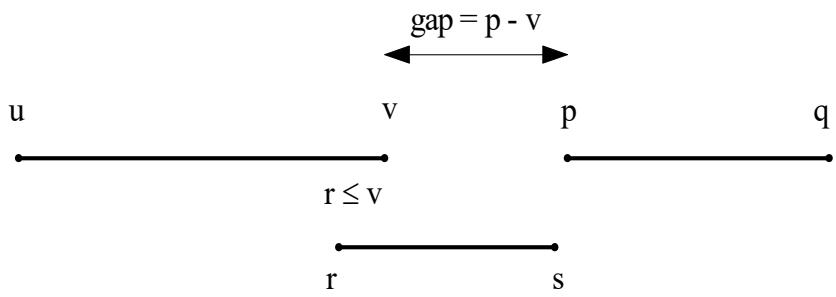

From this picture,we see that we can make sure that $s$ lies to the left of $p$ by making the length of $\lfloor r , s \rfloor$ smaller than the gap,which is $p - v$ .Because $\mathcal { F }$ is fine and $p - v > 0$ ,we can find an interval $I = \lfloor r , s \rfloor$ in $\mathcal { F }$ with $s - r < p - v$ . Adding this inequality to the previous one gives $s < p$ ，s0 $I < K$ ,and hence $\mathcal { F } < \mathcal { H }$ ■

REMARk 1.3.4 You can find a simple example to show that, without the fineness assumption, this result may be false, even for consistent families.

PROPOSITION 1.3.5 Suppose that $\mathcal { F }$ is fine. If ${ \mathcal { F } } \geq { \mathcal { G } }$ and $\mathcal { G } > \mathcal { H }$ ， then $\mathcal { F } > \mathcal { H }$

The proof, similar to that of the previous proposition, is left as an exercise.

The next proposition not only uses fineness,but is our first application of the Wiggle Lemma (0.2.6),which says that if $r < q + \epsilon$ for all $\epsilon > 0$ then we must have $r \leq q$

PROPOSITION 1.3.6 Suppose that $\mathcal { G }$ is fine. If $\mathcal { F } \leq \mathcal { G }$ and $\mathcal { G } \leq \mathcal { H }$ ，then $\mathcal { F } \leq \mathcal { H }$

Proof. Choose any $I = \lfloor r , s \rfloor$ in $\mathcal { F }$ and $K = \left\lfloor p , q \right\rfloor$ in $\mathcal { H }$ . By the characterization of inequalities in terms of upper and lower bounds (1.2.26),we must show that $r \leq q$ Let $\epsilon > 0$ be any rational number; we will show that $r \leq q + \epsilon$ . Since $\mathcal { G }$ is fine, we can choose an interval $J = \lfloor u , v \rfloor$ in $\mathcal { G }$ such that $\ell ( J ) < \epsilon$ . Since $\mathcal { F } \leq \mathcal { G }$ and $\mathcal { G } \leq \mathcal { H }$ the same characterization of weak inequality for families implies that $r \leq v$ and $u \leq q$ We now have $r \leq v = u + ( v - u ) \leq q + ( v - u ) < q + \epsilon$ Since $\epsilon > 0$ was arbitrary, the Wiggle Lemma gives us $r \leq q$ ： $\vartriangle$

REMARK 1.3.7 This proof has some interesting ideas. Does drawing a diagram help understand it? Try closing the book and reproducing the proof on your own.

COROLLARY 1.3.8 Suppose that $\mathcal { G }$ is fine. If $\mathcal { F } \sim \mathcal { G }$ and $\mathcal { G } \sim \mathcal { H }$ ， then $\mathcal { F } \sim \mathcal { H }$

Proof.In Proposition 1.2.27 we proved that if $\mathcal { F } \sim \mathcal { G }$ and $\mathcal { G } \sim \mathcal { H }$ ,then $\mathcal { F } \leq \mathcal { G }$ and $\mathcal { G } \leq \mathcal { H }$ . Therefore,by the previous proposition, $\mathcal { F } \leq \mathcal { H }$ .Using similar reasoning, $\mathcal { H } \leq \mathcal { F }$ because $\mathcal { H } \sim \mathcal { G }$ and $\mathcal { G } \sim \mathcal { F }$ . By combining these two conclusions,a final use of the characterization of $\sim$ in terms of $\leq$ gives the desired result: $\mathcal { F } \sim \mathcal { H }$ ■

COROLLARY 1.3.9 If $\mathcal { F }$ is consistent with a family that is fine, then $\mathcal { F }$ is a consistent family.

Proof. Take $\mathcal { G }$ to be the fine family and let $\mathcal { H } = \mathcal { F }$ in the previous proposition. I

NOTATION 1.3.10 For each rational number $c$ ， we will, if there is no danger of confusion, also use c to denote the family of intervals whose sole member is $\displaystyle { \lfloor c , c \rfloor }$ that is, c will also denote $\{ \vert c , c \vert \}$

REMARK 1.3.11 For each $c$ , the associated family $\{ \vert c , c \vert \}$ is obviously consistent and fine, since it has only the one interval of zero length.

According to the notation just introduced, if $\mathcal { F }$ is any family of intervals,and $c$ and $d$ are rational numbers, then “ $\mathcal { F } < d ^ { \mathfrak { s } }$ is a paraphrase for “there is at least one interval in $\mathcal { F }$ ，say $I = \lfloor r , s \rfloor$ ，with $s < d ^ { \prime }$ ，or equivalently，“ $d$ is bigger than some upper bound of $\mathcal { F }$ ’. Similarly，“ $c < \mathcal { F }$ can be rephrased as“ $_ c$ is smaller than some lower bound of $\mathcal { F }$ .”After similar unravelling, the weak inequality $\mathcal { F } \leq b$ amounts to saying that $b$ is greater than or equal to every lower bound of $\mathcal { F }$ . A somewhat more general case has already been discussed in Proposition 1.2.26.

The next result is very important and will be used many times in what follows.

PROPOSITION 1.3.12 Let $\mathcal { F }$ be any family of intervals, and $\lfloor a , b \rfloor$ a rational interval. Then $a \leq \mathcal { F } \leq b$ if and only if $\lfloor a , b \rfloor$ intersects each interval of $\mathcal { F }$

The proof is left as an exercise in “unravelling” that everyone should do.

Since any interval from a consistent family meets every other interval in that family, we immediately deduce the following consequence.

COROLLARY 1.3.13 If $\mathcal { F }$ is a consistent family of intervals and $I = \lfloor r , s \rfloor$ belongs to $\mathcal { F }$ ，then $r \leq \mathcal { F } \leq s$

This corollary also explains,at least for consistent families,why we call $r$ and $s$ lower and upper bounds of $\mathcal { F }$ when $\lfloor r , s \rfloor$ belongs to $\mathcal { F }$ see Definition 1.2.25.

COROLLARY 1.3.14 If $\mathcal { F }$ is consistent and fine, and $[ a , b ]$ and $\lfloor c , d \rfloor$ both meet every interval of $\mathcal { F }$ ，then $\lfloor a , b \rfloor$ and $\lfloor c , d \rfloor$ meet each other.

Proof. Observe that $\{ | a , a | \} \leq \{ | d , d | \}$ and $\{ | c , c | \} \leq \{ | b , b | \}$ by applying Proposition 1.3.6 as well as 1.3.12.

If a family is not consistent,adding more intervals cannot help. However, if it is consistent and fine, then we can construct a maximal consistent family containing it. The proposition we just proved and its corollaries tell us exactly what this family must be.

DEFINITION 1.3.15 If $\mathcal { F }$ is a fine and consistent family, define ${ \mathcal { F } } ^ { * }$ to be the family of all $[ a , b ]$ that intersect every member of $\mathcal { F }$ (or, equivalently， all $\lfloor a , b \rfloor$ such that $a \leq \mathcal { F } \leq b$ ）

That $\mathcal { F }$ is consistent follows directly from the second corollary above. Note that since ${ \mathcal { F } } ^ { * }$ contains every interval of $\mathcal { F }$ ， ${ \mathcal { F } } ^ { * }$ will be fine since $\mathcal { F }$ is assumed to be. ${ \mathcal { F } } ^ { * }$ is maximal in the sense that if $\kappa$ is consistent and contain all the intervals of $\mathcal { F }$ ， then $\kappa$ is contained in ${ \mathcal { F } } ^ { * }$ .(Verification of this is left as an exercise.） The family ${ \mathcal { F } } ^ { * }$ will be used later to standardize the definitions of certain numbers.Note also that $\mathcal { F } \sim \mathcal { F } ^ { \ast }$ ，and $\mathcal { F } \sim \mathcal { G }$ if and only if $\mathcal { F } ^ { * } { \sim } \mathcal { G } ^ { * }$ .See the exercises for these and other properties of ${ \mathcal { F } } ^ { * }$

ExAMPLE 1.3.16 Let $\mathit { C 2 }$ be the family of all $[ a , b ]$ such that $a ^ { 3 } \leq 2 \leq b ^ { 3 }$ . Then $\mathit { c 2 }$ (which stands for “cube root of ${ \boldsymbol { \mathit { \omega } } } _ { \mathcal { Z } }$ "） is a fine and consistent family. Furthermore, $C 2 = C 2 ^ { \ast }$ . For details, see the exercises for this section.

Next we check how fineness behaves when we do arithemetic on families. We will now see the importance of the computations we made for the lengths of sums, products,etc. of intervals done at the beginning of this chapter.

PROPOSITION 1.3.17 If both $\mathcal { F }$ and $\mathcal { G }$ are fine families of intervals, then so are the families $\mathcal { F } + \mathcal { G }$ ， $- \mathcal { F }$ ， $| \mathcal F |$ ， $\operatorname* { m a x } ( \mathcal { F } , \mathcal { G } ) , a n d \operatorname* { m i n } ( \mathcal { F } , \mathcal { G } )$

Proof. For $- \mathcal { F }$ ， $| \mathcal F |$ ， $\operatorname* { m a x } ( \mathcal { F } , \mathcal { G } )$ ，and $\operatorname* { m i n } ( \mathcal { F } , \mathcal { G } )$ , the result is a direct consequence of the length estimates (for intervals） computed for $- I$ (1.1.24), $\left| I \right|$ (1.1.30),and $\operatorname* { m a x } ( I , J )$ and $\operatorname* { m i n } ( I , J )$ (1.1.34) . It remains to consider $\mathcal { F } + \mathcal { G }$

Let $\epsilon$ be any positive rational, and let $a$ and $b$ be any positive rationals whose sum is 1 (e.g., take both $^ { a }$ and $b$ tobe $1 / 2$ ). Then we have $a \epsilon + b \epsilon = \epsilon$

To get an interval in $\mathcal { F } + \mathcal { G }$ of length $< \epsilon$ , take any $I \in { \mathcal { F } }$ and $J \in { \mathcal { G } }$ such that $\ell ( I ) < a \epsilon$ and $\ell ( J ) < b \epsilon$ . Then,by the length formula for $I + J$ (1.1.23), $I + J$ is an interval in $\mathcal { F } + \mathcal { G }$ whose length is $a \epsilon + b \epsilon = \epsilon$ ■

It is not too difficult to find examples of fine families whose product and reciprocals are not fine (see exercises at the end of this section). In these examples the missing property is consistency. To see this,we first establish the following somewhat technical results.

PROPOSITION 1.3.18 Suppose $\mathcal { F }$ contains arbitrarily small subintervals of a single interval $X$ and $\mathcal { G }$ contains arbitrarily small subinteruals of some interval $Y$ .Then $\mathcal { F } \mathcal { G }$ contains arbitrarily small subintervals of $X Y$

PROPOSITION 1.3.19 Suppose $\mathcal { F }$ contains arbitrarily small subintervals of $X$ ，and either $X > 0$ or $X < 0$ . Then $1 / \mathcal { F }$ contains arbitrarily small subintervals of $1 / X$

Here are the proofs of these propositions.

Proof. We do products first. Take symmetric intervals $\lfloor - S , S \rfloor$ containing $X$ ，and $\lfloor - T , T \rfloor$ containing $Y$ (e.g.， for $X ~ = ~ \lfloor a , b \rfloor$ ，set $S = \operatorname* { m a x } ( b , - a ) )$ .Then take any positive rationals $p$ and $q$ with $p + q = 1$ .For each positive rational $\epsilon$ we then have $p \epsilon + q \epsilon = \epsilon$ . By the length estimate for $I J$ (1.1.27), for any $I \in { \mathcal { F } }$ with $I \subset X$ and any $J \in { \mathcal { G } }$ with $J \subset Y$ ，we have

$$
\ell ( I J ) \leq T \ell ( I ) + S \ell ( J ) .
$$

So if we take such $I$ and $J$ with $\ell ( I ) < p \epsilon / T$ and $\ell ( J ) < q \epsilon / S$ , then $I J$ is a subinterval of $X Y$ that belongs to $\mathcal { F } \mathcal { G }$ and

$$
\ell ( I J ) < T { \frac { p \epsilon } { T } } + S { \frac { q \epsilon } { S } } = \epsilon .
$$

Now we look at reciprocals. Suppose $X = \left\lfloor a , b \right\rfloor > 0$ . By the length estimate for $1 / I$ (1.1.25), if $I$ is contained in $X$ ,then

$$
\ell \left( { \frac { 1 } { I } } \right) \leq { \frac { \ell ( I ) } { a ^ { 2 } } } .
$$

Therefore given any positive rational $\epsilon$ , if we take any $I \in { \mathcal { F } }$ that is a subinterval of $X$ with

$$
\ell ( I ) < a ^ { 2 } \epsilon ,
$$

then $1 / I$ is an interval in $1 / \mathcal { F }$ that is a subinterval of $1 / X$ with $\ell ( 1 / I ) < \epsilon$ .The case where $X < 0$ involves just a simple modification of this argument.

The intervals $X$ and $Y$ required in these propositions can always be found when the families are both fine and consistent,as shown by this lemma.

LEMMA 1.3.20 Let $\mathcal { H }$ be any fine and consistent family. Then, for each $I = \lfloor r , s \rfloor$ in $\mathcal { H }$ and any positive rational $c$ ， the family $\mathcal { H }$ contains arbitrarily small intervals that are subintervals of $Z = \lfloor r - c , s + c \rfloor$ . When $\mathcal { H } > 0$ we can choose $Z > 0$ ; when $\mathcal { H } < 0$ we can choose $Z < 0$

Proof. Because $\mathcal { H }$ is consistent, every $J \in { \mathcal { H } }$ intersects $I$ . Hence, if the length of $J$ is less than $c$ ， $J$ must be contained in $Z$ .（Check this.）■

Combining what we now know, we see that the basic arithmetic operations behave well on families that are both consistent and fine.In summary, then,we state the following.

PROPOSITION 1.3.21 Suppose that both $\mathcal { F }$ and $\mathcal { G }$ are fine and consistent families. Then so are the families $\mathcal { F } + \mathcal { G }$ ， $- \mathcal { F }$ ， $\mathcal { F G }$ ， $| \mathcal F |$ ， $\operatorname* { m a x } ( \mathcal { F } , \mathcal { G } )$ ， $\operatorname* { m i n } ( \mathcal { F } , \mathcal { G } )$ ，and $1 / \mathcal { F }$ (provided either $\mathcal { F } > 0$ or $\mathcal { F } < 0$ ).

# Exercises

1. Let $s$ be the family of all intervals $\begin{array} { r } { \left[ \frac { 1 } { 3 n + 1 } , \frac { 1 } { n + 1 } \right] } \end{array}$ $n = 1 , 2 , \ldots$ Show that $\boldsymbol { S }$ is fine.Is it consistent?

2. Let $\boldsymbol { \mathcal { T } }$ be the familyof alintervals $\textstyle \left[ { \frac { 1 } { n } } , { \frac { n + 2 } { n + 1 } } \right]$ $n = 1 , 2 , \ldots$ Is $\boldsymbol { \tau }$ fine? Consistent?

3.Here are some examples to show that the product and reciprocal of fine families needn't be fine.

(a) Let $\mathcal { M }$ be the family of all intervals $[ N , N + 1 / N ] , N = 1 , 2 , 3 , . . .$ Show that $\mathcal { M }$ is fine but $\mathcal { M } \cdot \mathcal { M }$ is not.Note that $\mathcal { M }$ is not consistent.   
(b）Let $_ { \mathcal { R } }$ be the family of allintervals of the form $\lfloor 1 / N , 2 / N \rfloor$ ， $N = 1 , 2 , 3 , \ldots$ Show that $_ { \mathcal { R } }$ is fine but $1 / \mathcal { R }$ is not. Note that $_ { \mathcal { R } }$ is not consistent.

4. Suppose that the family $\mathcal { W }$ has only a finite number of intervals, each having positive (non-zero） length. Can $\mathcal { W }$ be fine? Explain.

5. (See previous exercise) Suppose $\mathcal { F }$ is a fine family with only finitely many intervals. What can you conclude about $\mathcal { F }$ ？

6.Given families $\mathcal { F }$ ， $\mathcal { G }$ ， $\mathcal { H }$ with ${ \mathcal { F } } \geq { \mathcal { G } }$ ， $\mathcal { G } > \mathcal { H }$ and $\mathcal { F }$ fine,prove that $\mathcal { F } > \mathcal { H }$ (Hint: the proof is exactly the same idea as the proof of Proposition 1.3.3).

7.Recall that when $\mathcal { F }$ is fine and consistent,we define ${ \mathcal { F } } ^ { * }$ to be the family of all intervals which intersect every member of $\mathcal { F }$ , that is ${ \mathcal { F } } ^ { * } = \{ K \vert K $ intersects every $I \in { \mathcal { F } } \}$

(a) Prove that ${ \mathcal { F } } ^ { * }$ is itself fine and consistent.   
(b） Prove that $\mathcal { F } \sim \mathcal { F } ^ { \ast }$   
(c） Prove that $\mathcal { F } \sim \mathcal { G } \Longrightarrow \mathcal { F } ^ { * } \sim \mathcal { G } ^ { * }$   
(d） Show that ${ \mathcal { F } } ^ { * }$ is maximal in the sense that if $\kappa$ is any other consistent family which contains all the intervals of $\mathcal { F }$ , then every interval of $\kappa$ is an interval of ${ \mathcal { F } } ^ { * }$ .

8.The following is an important proposition left unproved in the text; prove it. PROPOSITION． Let $\mathcal { F }$ be any family of intervals,and $\lfloor a , b \rfloor$ a rational interval. Then $a \leq \mathcal { F } \leq b$ if and only if $\lfloor a , b \rfloor$ intersects each interual of $\mathcal { F }$

9.Use the proposition of the previous exercise to show that ${ \mathcal { F } } ^ { * }$ is the family of all $\lfloor a , b \rfloor$ such that $a \leq \mathcal { F } \leq b$ (when $\mathcal { F }$ is fine and consistent).

10.Let $\mathit { c 2 }$ be the family of all $[ a , b ]$ such that $a ^ { 3 } \leq 2 \leq b ^ { 3 }$

(a）Prove that $\mathit { c 2 }$ is consistent.   
(b）Prove that $\mathit { c 2 }$ fine.(Outline: To prove that there are arbitrarily small intervals in $\mathit { C 2 }$ ,first check that [1,2] belongs to $\mathit { c 2 }$ ,and then show that if $\lfloor a , b \rfloor$ isin $\mathit { C 2 }$ and $m = ( a + b ) / 2$ (i.e. $_ { m }$ is the midpoint of $\lfloor a , b \rfloor$ ）， then either $\lfloor a , m \rfloor$ or $\lfloor m , b \rfloor$ also belongs to $\mathit { c 2 }$ . Each of the intervals $\lfloor a , m \rfloor$ and $\lfloor m , b \rfloor$ is half the length of the original interval $\lfloor a , b \rfloor$ . We can repeat this process over and over,getting intervals each having half the length of the previous one. We call this process a bisection method for getting arbitrarily small intervals in the family $\mathit { c 2 }$ .）   
(c) Prove that if $r$ is a rational number which belongs to every interval in $\mathit { c 2 }$ ， then $r ^ { 3 } = 2$ . (Hint:First note that $r ^ { 3 }$ and 2 lie in every interval $[ a ^ { 3 } , b ^ { 3 } ]$ Next, show that $\mathit { c 2 }$ contains intervals $\lfloor a , b \rfloor$ such that $b ^ { 3 } - a ^ { 3 }$ is arbitrarily small, using $b ^ { 3 } - a ^ { 3 } = ( b - a ) ( b ^ { 2 } + a b + a ^ { 2 } )$ ; you may assume $\lfloor a , b \rfloor \subset \lfloor 1 , 2 \rfloor$ Conclude that for any $\epsilon > 0$ ， $r ^ { 3 } \leq 2 + \epsilon$ and $2 \leq r ^ { 3 } + \epsilon$ ）   
(d) In the previous exercise,we proved that 2 lies in every interval $[ a ^ { 3 } , b ^ { 3 } ]$ where $\lfloor a , b \rfloor \in { \mathcal { C } } 2$ .These intervals $[ a ^ { 3 } , b ^ { 3 } ]$ lie in $( { \mathcal { C } } 2 ) ( { \mathcal { C } } 2 ) ( { \mathcal { C } } 2 ) = ( { \mathcal { C } } 2 ) ^ { 3 }$ However,a typical interval in $\left( \mathcal { C } 2 \right) ^ { 3 }$ looks like $I J K$ where $I , J , K$ are intervals in $\mathit { C 2 }$ .Show that 2 lies in all of these as well. (Hint: If these intervals are all $> 0$ then $I J K = \lfloor r u p , s v q \rfloor$ （ $I = \lfloor r , s \rfloor$ etc). Show that $2 \in I J K$ by using $a = \operatorname* { m a x } ( r , u , p )$ and $b = \operatorname* { m i n } ( s , v , q )$ . When $I , J , K$ are not all $> 0$ , use the following: LEMMA.If $I = \lfloor r , s \rfloor$ is in $\mathit { c 2 }$ and $r \leq 0$ ,then $I \supset I ^ { \prime } = \left\lfloor 1 , s \right\rfloor$ and $I ^ { \prime }$ is in C2.)   
(e) Prove that no rational number $r$ can satisfy $r ^ { 3 } = 2$ .(Hint: This is a simple modification of the classical proof that $\sqrt { 2 }$ is irrational; look it up if you haven't seen it.） Deduce that there is no rational number common to all of the intervals in $\mathit { c 2 }$   
(f） Work out some sample intervals. Start with $\lfloor 1 , 2 \rfloor$ and apply bisection several times to find an interval [a,b] ∈C2 with l([a,b]) < 100

11.There is a better method for finding square roots than bisection. There is evidence that this method, called “Divide-and-Average,” was known to the ancient Babylonians.Let $q > 0$ be a rational number.First,we observe $x \ > \ 0$ $x ^ { 2 } \ \leq \ q \ { \mathrm { t h e n } } \Bigl ( { \frac { q } { x } } \Bigr ) ^ { 2 } \ \geq \ q$ $I _ { k } = \left\lfloor x , { \frac { q } { x } } \right\rfloor$ $q / x$ $_ x$ $y = { \frac { 1 } { 2 } } \left( x + { \frac { q } { x } } \right)$ $I _ { k + 1 } = [ \operatorname* { m i n } ( y , q / y ) , \operatorname* { m a x } ( y , q / y ) ] = \left\lfloor x ^ { ' } , { \frac { q } { x ^ { \prime } } } \right\rfloor$ $q$ $_ { x }$ where $x ^ { \prime }$ is either $_ y$ or $q / y$ . Starting with $x = 1$ ， we get a family of rational intervals $D _ { k }$ . This family is consistent and fine. Prove consistency by observing that $x ^ { 2 } \leq q \leq ( q / x ) ^ { 2 }$ . To prove fineness, show that if $L = \ell ( D _ { k } ) = | x - q / x |$ ,then $\ell ( D _ { k + 1 } ) = | y - q / y | \leq \frac { 1 } { 2 } L ^ { 2 }$ . Thus, once these lengths are less than, say $1 / 2$ ， they get small very quickly: they are less than $1 / 2$ ， $1 / 4$ ,1/16,1/256,1/65536, etc. This is sometimes called quadratic convergence.

# 1.4Definition of the Reals

We wish to capture the idea that real numbers are measured by rationals. For any particular real number, these measurements must be consistent (we don't want to be measuring two different things)；also, they must be arbitrarily fine,or we don't have enough information to determine the real number uniquely. But what are we measuring? Since all we have at our disposal are the rational numbers,we must actually create the object of measurement from the measurements themselves. This is captured in the following fundamental definition.

DEFINITION 1.4.1 (REAL NUMBER) A real number is a fine and consistent family of rational intervals. We use the symbol $\mathbb { R }$ to denote the reals， and the expression $A \in \mathbb R$ means that $A$ is a real number.

The fineness assumption in this definition tells us that we have as much accuracy as possible. Then, if two real numbers $A$ and $B$ cannot be distinguished from each other by a pair of measurements $I \ < \ J$ or $J \ < \ I$ (where $I$ and $J$ are intervals in $A$ and $B$ respectively),then they cannot be distinguished.But rejecting these inequalities means saying $A \geq B$ and $B \geq A$ ,i.e. $A \sim B$

DEFINITION 1.4.2（EQUALITY OF REALS） $A = B$ as real numbers means $A \sim B$ as families of intervals.

In order to avoid confusion,for a while we will denote real numbers using capital letters $A$ ， $B$ ， $C$ ,and will continue to employ the notations $A < B$ ， $A > B$ ， $A \le B$ and $B \leq A$ in the way that was defined for families of intervals (these relations for reals are defned to be exactly the same relations for the reals when considered as families of rational intervals). The following properties of equality and order follow directly from propositions in the previous section about the relations $\sim$ ， $<$ ,and $\leq$

PROPOSITION 1.4.3 Suppose $A$ ， $B$ ， $C$ and $D$ are real numbers. Then

1. $A = A$ ("Reflexivity").  
2. $A = B$ if and only if $B = A$ (“Symmetry").  
3.If $A = B$ and $B = C$ ，then $A = C$ ("Transitivity").  
4 $A = B$ if and only if $A \leq B$ and $B \leq A$   
5.If $A < B$ ，then $A \leq B$ (i.e. $A \ne B$ ）  
6.If $A < B < C$ ，then $A < C$   
7.If $A \leq B$ and $B < C$ ，then $A < C$   
8.If $A \geq B$ and $B > C$ ，then $A > C$   
9.If $A \le B$ and $B \leq C$ ，then $A \leq C$ .  
10.If $A = B < C = D$ ，then $A < D$   
11.If $A = B \geq C = D$ ， then $A \geq D$

(Note that the last two parts follow from the preceding parts.)

EXERCIsE 1.4.4 For each of the above properties, state the property for families, already proved, which implies it.

Those reals $A$ for which the reciprocal $1 / A$ exists are those for which $A > 0$ or $A < 0$ (see Definition 1.2.12). We have a special notation for these.

DEFINITION 1.4.5 $A \in \mathbb { R } ^ { * }$ means that $A \in \mathbb R$ and either $A < 0$ or $A > 0$

Just as we were able to consider the integers $\mathbb { Z }$ as part of the rationals $\mathbb { Q }$ by the association $N  N / 1$ ，we can consider the rationals $\mathbb { Q }$ as part of the reals $\mathbb { R }$ To see how,consider the operation that associates to each rational $c$ the simple family consisting of the single interval $\displaystyle \lfloor c , c \rfloor$ .As we have observed, this family is clearly consistent and fine,and the association $c  \{ \vert c , c \vert \}$ enables us to consider the rationals as real numbers. On the other hand,we could also identify $_ c$ with the maximal family $c ^ { * }$ ,which in this case turns out to be simply the family of all rational intervals containing $c$ . It is easy to see, however, that these two identifications, or embeddings,produce equal real numbers since $c \sim c ^ { * }$ .We can also think of these identifications as functions mapping $\mathbb { Q }$ into $\mathbb { R }$

Suppose that $A$ is a real number and that the (rational) interval $\lfloor r , s \rfloor$ belongs to $A$ . Then, since real numbers are consistent families,Proposition 1.3.12 tells us that $r \leq A \leq s$ . Thus,the left-hand endpoints of intervals in the family $A$ are really lower bounds for $A$ ,and the right-hand endpoints are upper bounds. Conversely, suppose that $\lfloor r , s \rfloor$ is a rational interval with endpoints $r$ and $s$ satisfying this inequality. Then $\lfloor r , s \rfloor$ intersects every interval in $A$ by the same proposition. Now $\lfloor r , s \rfloor$ may not belong to $A$ ,but we can enlarge $A$ by adding $\lfloor r , s \rfloor$ ,without changing $A$ as a real number (since the new family will be consistent with $A$ ); that is,the new family will be a real number equal to $A$ and containing $\lfloor r , s \rfloor$ . We can continue enlarging $A$ in this way to form $A ^ { * }$ , the family of all rational intervals which meet every interval of $A$ .By Corollary 1.3.14 we know that $A ^ { * }$ is consistent,and it is also fine since it contains $A$ (which is fine). In fact, $A \sim A ^ { * }$ as families,so $A = A ^ { * }$ as real numbers. (For more about $A ^ { * }$ see the exercises on page 38.） For any bounds $r \leq A \leq s$ ，the interval $\lfloor r , s \rfloor$ may not be in $A$ but it is in $A ^ { * }$

In the previous section (see 1.3.16) we constructed the family $\mathit { c 2 }$ (cube root of 2):

C2 = family of all rational intervals $\lfloor a , b \rfloor$ such that $a ^ { 3 } \leq 2 \leq b ^ { 3 }$

In fact, the following properties of $\mathit { c 2 }$ appear as exercise 7 on page 38.

· $\mathit { c 2 }$ is fine and consistent. · 2 belongs to every interval of $\left( \mathcal { C } 2 \right) ^ { 3 } = \left( \mathcal { C } 2 \right) \left( \mathcal { C } 2 \right) \left( \mathcal { C } 2 \right)$

The first property tells us that $\mathit { c 2 }$ is a real number,and the second tells us that [2,2] meets every interval of $\left( \mathcal { C } 2 \right) ^ { 3 }$ ，thus $\left( \mathcal { C } 2 \right) ^ { 3 } \sim \{ [ 2 , 2 ] \}$ . So, as real numbers, $\left( \mathcal { C } 2 \right) ^ { 3 } = 2$ , and we are justified in writing $\mathscr { C } 2 = \sqrt [ 3 ] { 2 }$ . We have constructed a number we didn't have before, since there is no rational whose cube is 2. (The exercises for this section contain several other examples of “new” real numbers.)

It is clear that we could mimic this construction and compute various roots of rational numbers.For example,we could construct $\sqrt [ 6 ] { 1 9 }$ by looking at all rational intervals $\lfloor a , b \rfloor$ with the properties that $a > 0$ and $a ^ { 6 } \leq 1 9 \leq b ^ { 6 }$ .(We need $a \mathrm { ~ > ~ }$ $0$ to make sure we are getting the positive root； without it, the family wouldn't be consistent either, since we would be looking at the positive and negative root simultaneously.） What we are doing is constructing inverses,one value at a time, for functions of the form $x ^ { N }$ . In the next chapter we will see a much better way of constructing inverses for functions.

# Exercises

1. Let us represent the real number 2 by the family $\{ \vert 2 , 2 \vert \}$ and 3 by $\{ | 3 , 3 | \}$

(a) Show that $2 < 3$ and $2 \leq 3$   
(b）Let $\boldsymbol { \tau }$ be the family of intervals $\displaystyle \lvert 2 - 1 / N , 2 + 1 / N \rvert$ for $N = 1 , 2 , \ldots$ Show that $\boldsymbol { \mathcal { T } }$ is a real number and,as a real number, $T = 2$ . Similarly,look at the family $\mathcal { H }$ of intervals $\displaystyle | 3 - 1 / N , 3 + 1 / N |$ . Prove that $\tau < \mathcal { H }$   
(c) Write down some of the intervals in the family $\mathcal { T } / \mathcal { H }$ ， and prove that $\{ | 2 / 3 , 2 / 3 | \} \sim T / \mathcal { H }$ ， so that $\tau / \mathcal { H } = 2 / 3$ as real numbers.

2.(Project） The following famous formula is often derived in calculus courses:

$$
\ln 2 = 1 - { \frac { 1 } { 2 } } + { \frac { 1 } { 3 } } - { \frac { 1 } { 4 } } + \cdots = \sum _ { k = 1 } ^ { \infty } ( - 1 ) ^ { k + 1 } { \frac { 1 } { k } } .
$$

In fact,proving this is not at all trivial, as we will see later when we take up infinite series. However,with this formula as motivation,let's define the following sequence of partial sums:

$$
\begin{array} { l l l } { { s _ { 0 } } } & { { = } } & { { 0 } } \\ { { } } & { { } } & { { } } \\ { { s _ { 1 } } } & { { = } } & { { 1 } } \\ { { s _ { 2 } } } & { { = } } & { { 1 - { \displaystyle \frac { 1 } { 2 } } } } \\ { { } } & { { } } & { { } } \\ { { } } & { { } } & { { \vdots } } \\ { { s _ { k } } } & { { = } } & { { \displaystyle 1 - { \displaystyle \frac { 1 } { 2 } } + { \displaystyle \frac { 1 } { 3 } } \cdots ( - 1 ) ^ { 1 + k } { \displaystyle \frac { 1 } { k } } } } \end{array}
$$

and in general ( $n \geq 1$ ），

$$
\begin{array} { r c l } { { s _ { 2 n } } } & { { = } } & { { s _ { 2 n - 1 } - { \cfrac { 1 } { 2 n } } } } \\ { { } } & { { } } & { { } } \\ { { s _ { 2 n + 1 } } } & { { = } } & { { s _ { 2 n } + { \cfrac { 1 } { 2 n + 1 } } . } } \end{array}
$$

It is clear from the last of these equations that, for each $k \geq 0$ ， $s _ { 2 k } \leq s _ { 2 k + 1 }$ We can therefore define, for $k = 0 , 1 , \ldots$ , the intervals

$$
{ \cal I } _ { k } = [ s _ { 2 k } , ~ s _ { 2 k + 1 } ] .
$$

(a) Write down some of these intervals explicitly. Also, sketch some of these intervals on a single line representing the rational numbers.   
(b） Show that, for each $k$ ， $I _ { k + 1 } \subset I _ { k }$ and $\begin{array} { r } { \ell ( I _ { k } ) = \frac { 1 } { 2 k + 1 } } \end{array}$   
(c)Let $\mathcal { L }$ be the family of all the intervals $I _ { k }$ ， $k = 0 , 1 , 2 , \ldots$ .Given $\epsilon > 0$ ， show how to find $k$ so that $\ell ( I _ { k } ) < \epsilon$ .Show that $\mathcal { L }$ is a real number. (Note: for consistency, you have to show that $I _ { k }$ and $I _ { n }$ intersect.What, exactly, will be their intersection?） We might want to call $\mathcal { L }$ $\ln { 2 }$ ”

(d) Similarly from calculus, $\begin{array} { r } { \frac { \pi } { 4 } = 1 - \frac { 1 } { 3 } + \frac { 1 } { 5 } - \frac { 1 } { 7 } \cdot \cdot \cdot = \sum _ { k = 1 } ^ { \infty } ( - 1 ) ^ { k + 1 } \frac { 1 } { 2 k - 1 } } \end{array}$ With this formula as motivation,we follow the same idea as above and define $t _ { 0 } = 0 , \ t _ { 1 } = 1$ and $\begin{array} { r } { t _ { 2 n } = t _ { 2 n - 1 } - \frac { 1 } { 4 n - 1 } } \end{array}$ ， $\begin{array} { r } { t _ { 2 n + 1 } = t _ { 2 n } + \frac { 1 } { 4 n + 1 } } \end{array}$ 4n+1:Also, define the intervals $J _ { k } = \left\lfloor t _ { 2 k } , t _ { 2 k + 1 } \right\rfloor$ . Show that $J _ { k + 1 } \subset J _ { k }$ ,and find $\ell ( J _ { k } )$ .Let $\mathcal { P }$ be the family of all the intervals $J _ { k }$ ， $k = 0 , 1 , 2 , \ldots$ Given $\epsilon > 0$ ，show how to find $k$ so that $\ell ( J _ { k } ) < \epsilon$ $\mathcal { P }$ is a real number that we might call $\textstyle { \frac { \pi } { 4 } }$ (e） The real number $\ln 2 \cdot { \frac { \pi } { 4 } }$ is the product family $\mathcal { L } \cdot \mathcal { P }$ . Find any interval in L .P that has length less than 1000 (that is, find $_ { m }$ and $_ { n }$ so that $I _ { m } \cdot J _ { n }$ has length 1000，and prove it.) Show how to find one of length less than $\epsilon$ .(Hint:Explain why all of these intervals are contained in $[ 0 , 1 ]$ and then use Proposition 1.1.27, the estimate for $\ell ( I \cdot J )$ .）

(f）Prove,using the criterion for strict inequality of reals, that $\ln 2 < \pi / 4$ This means you must find $_ { m }$ and $_ { n }$ such that $I _ { m } < J _ { n }$ . (Note: you should not use decimals, though it may be handy to use a calculator to determine which rational intervals to compare. The Maple package will do fractional arithmetic verynicely.)

(g) There are a few cranks who have printed up (at their own expense) papers attempting to show that $\pi = { \sqrt { 1 0 } }$ . Show that,with the definition above of $\textstyle { \frac { n } { 4 } }$ ,that $\pi ^ { 2 } < 1 0 $ (i.e. $\begin{array} { r } { \left( { \frac { \pi } { 4 } } \right) ^ { 2 } < \frac { 5 } { 8 } } \end{array}$ ). This, of course, does not refute the cranks, since their definition of $\pi$ is geometric,but it may be fun anyways.

(h）（Generalization） Suppose $a _ { 1 } , \ a _ { 2 }$ ， $a _ { 3 } , \ldots .$ are positive rationals.Let $L _ { n } =$ $\left\lfloor s _ { 2 n } , s _ { 2 n + 1 } \right\rfloor$ where $s _ { 0 } = 0$ ， $s _ { 1 } = a _ { 1 }$ ,and, for $\ i \geq 1 , \ s _ { 2 n } = a _ { 1 } - a _ { 2 } + \cdot \cdot \cdot - a _ { 2 n }$ and $s _ { 2 n + 1 } = a _ { 1 } - a _ { 2 } + \cdots - a _ { 2 n } + a _ { 2 n + 1 }$ .What sort of condition will guarantee that $L _ { k } \supset L _ { k + 1 }$ for all $k$ ? This will make the family of intervals consistent (explain why). What sort of condition on the $a$ 's will guarantee that the family is fine?

3.(Project） Using the family $\mathit { c 2 }$ , which we now call $\sqrt [ 3 ] { 2 }$ (see page 41), as a model, show how you can construct $N$ th roots ( $N = 2 , 3 , \ldots$ ）of any positive rational number $r$ . Note that you have to be careful with even roots to make the family positive.

4.Show that the family $D _ { k }$ obtained by “Divide-and-Average” (see exercise 11 on page 39） has $\sqrt { q }$ as its limit. Write down some of the Divide-and-Average family for calculating $\sqrt { 5 }$ . Divide-and-Average is a special case of Newton's Method, which,when it works,exhibits the same quadratic convergence.

# 1.5Real Number Arithmetic

By “arithmetic,” mathematicians usually mean basic operations such as addition, multiplication, taking absolute value,etc. Different collctions of mathematical objects have different arithmetics. So, for example,we may talk about the arithmetic of numbers,the arithmetic of vectors or the arithmetic of matrices. In this chapter we will see that the arithmetic of real numbers is very similar to that of the rationals in the sense that similar laws hold (e.g. associativity, commutativity, etc.） This is not too surprising, since the reals inherit their basic arithmetic (a-rith-met $'$ -ic)operations from those defined on families of rational intervals.The arithmetic of rational intervals,as we have already seen, is derived from that of the rationals. There are some differences,however,mostly stemming from that fact that we can always tell when a rational has a reciprocal since we can always tell when a rational is “not zero.”This is not true for reals,where,in order to find the reciprocal of $A$ we have to determine,explicitly, that $A > 0$ or $A < 0$ ,that is,whether $A \in \mathbb { R } ^ { * }$ .Except in certain specific examples,this requires proving a theorem (see the appendix to this chapter on “The Goldbach Number").

Suppose that $A$ and $B$ are reals. Since $A$ and $B$ are fine and consistent families, so are $A + B$ ， $A B$ ， $- A$ ， $| A |$ ， $\operatorname* { m a x } ( A , B )$ ，and $\operatorname* { m i n } ( A , B )$ . Thus, $A + B$ ， $A B$ ， $- A$ ， $| A |$ ， $\operatorname* { m a x } ( A , B )$ ，and $\operatorname* { m i n } ( A , B )$ are also real numbers. When $A \in \mathbb { R } ^ { * }$ (i.e. $A > 0$ or $A < 0$ ),then $1 / A$ is also a real number.

DEFINITioN 1.5.1 The following operations on real numbers are performed by considering the real numbers as families: $A + B$ ， $A B$ ， $- A$ ， $| A |$ ， $\operatorname* { m a x } ( A , B )$ ， $\operatorname* { m i n } ( A , B )$ ， and $1 / A$

A real number can be represented in many ways by different families that are consistent with each other.For example, the real number $2 = \{ | 2 , 2 | \}$ is also representedby the family $T = \left\{ \left[ 2 - { \frac { 1 } { n } } , 2 + { \frac { 1 } { n } } \right] , n = 1 , 2 , \ldots \right\}$ It isasorepresented by the maximal family consisting of all $[ r , s ]$ containing the rational number 2. Does $3 + 2 = 3 + \mathcal { T }$ as real numbers—i.e.is it true that $\{ | 3 , 3 | \} + \{ | 2 , 2 | \} \sim \{ | 2 , 2 | \} + \mathcal { T }$ as families? Similarly,is $1 / 2 = 1 / T = 1 / 2 ^ { * }$ ？It is clearly important to know that arithmetic operations performed on equal reals yield equal results. Put another way, if we perform an arithmetic operation on families $\mathcal { F }$ and $\mathcal { G }$ ,and then perform the same operation,replacing $\mathcal { F }$ and $\mathcal { G }$ by families ${ \mathcal { F } } ^ { \prime }$ and $\mathcal { G } ^ { \prime }$ consistent with them,do we get consistent answers? Fortunately we do; indeed, this is a fact we have already proved in Proposition (1.2.17). However, we will now rephrase it in the language of reals.

PROPOSITION 1.5.2 If $A = A ^ { \prime }$ and $B = B ^ { \prime }$ ，then

1. $A + B = A ^ { \prime } + B ^ { \prime }$ (in particular, $A = A ^ { \prime }$ implies $A + B = A ^ { \prime } + B ,$

2. $A B = A ^ { \prime } B ^ { \prime }$ (in particular, $A = A ^ { \prime }$ implies $A B = A ^ { \prime } B$ ）

3. When $A \in \mathbb { R } ^ { * } s o$ is $A ^ { \prime }$ ，and $1 / A = 1 / A ^ { \prime }$

4 $| { \cal { A } } | = | { \cal { A } } ^ { \prime } |$   
5. $\operatorname* { m a x } ( A , B ) = \operatorname* { m a x } ( A ^ { \prime } , B ^ { \prime } )$   
6. $\operatorname* { m i n } ( A , B ) = \operatorname* { m i n } ( A ^ { \prime } , B ^ { \prime } )$

(For specific examples, see the exercises.)

DEFINITION 1.5.3（SUBTRACTION AND DIVISION） $A - B$ means $A + \left( - B \right)$ and, for $B \in \mathbb { R } ^ { * }$ ， $A / B$ means $A ( 1 / B )$

PROPOsITiON 1.5.4 The following laws of arithmetic hold.

1. $A + B = B + A$   
2. $A + ( B + C ) = ( A + B ) + C$   
3. $A + 0 = A$   
4 $A - A = 0$   
5. $A B = B A$   
6. $A ( B C ) = ( A B ) C$   
7. $1 \cdot B = B$   
8.If $A \in \mathbb { R } ^ { * }$ ，then $A / A = 1$   
9. $A ( B + C ) = A B + A C$

Proof. These are proved by working on the interval level and using consistency; details are left for the exercises. □

COROLLARY 1.5.5 (ADDITiVE LAws) The following additional laws of arithmetic hold.

10.If $A + C = B + C$ ， then $A = B$ ("Cancellation for Addition").

11. $A = B$ if and only if $0 = B - A$

12. $- ( A + C ) = ( - A ) + ( - C )$

13. $- ( - A ) = A$

COROLLARY 1.5.6 (MULTIPLICATIVE LAWs） The following additional laws of arithmetic hold.

14.If $C \in \mathbb { R } ^ { * }$ and $C A = C B$ ，then $A = B$ . ("Cancellation for Multiplication").

15.For $A \in \mathbb { R } ^ { * }$ ， $A = B$ if and only if $B / A = 1$

16.If $A B \in \mathbb { R } ^ { * }$ ， then $A \in \mathbb { R } ^ { * }$ and $B \in \mathbb { R } ^ { * }$ ，and $1 / ( A B ) = ( 1 / A ) ( 1 / B )$

17.For $A \in \mathbb { R } ^ { * }$ ， $1 / ( 1 / A ) = A$

Proof of both corollaries. These are consequences of the previous proposition, and need not be proved using intervals; details are left as exercises.

Before moving on,we should note that the two Cancellation properties listed in the corollaries above are extremely useful in proving that certain numbers are equal. For example, the cancellation rule for addition says that if two numbers become equal when the same third number is added to them,they were equal to begin with. This can be used to show that $- ( A + B )$ equals $- A - B$ ， since these two numbers become equal (to $0$ ）when we add $C = A + B$ to them.

We now turn our attention to inequalities and how they behave with respect to arithmetic operations. The following proposition is the key to relating inequalities of reals to these operations, since it enables us to put all the quantities involved on one side. It is most easily proved by going back to intervals and using the definitions of $<$ and $\leq$ ; once again, the proof is left as a (straightforward) exercise.

PROPOSITION 1.5.7 $A < B$ if and only if $0 < B - A$ ，and $A \le B$ if and only if $0 \leq B - A$

(If you are careful, you can deduce the equivalence of the weak inequalities from the equivalence of the strict ones; however, it may be easier to deduce it directly from the definition of $\leq$ .）

# COROLLARY 1.5.8

1. $A < 0$ if and only if $0 < - A$   
2. $A > 0$ if and only if $0 > - A$   
3. $A + C < B + C$ if and only if $A < B$   
4 $B < 0$ if and only if $B + C < C$   
5. $B > 0$ if and only if $B + C > C$   
6. $B \leq 0$ if and only if $B + C \leq C$   
7. $B \geq 0$ if and only if $B + C \geq C$

PROPOSITION 1.5.9 If $B \geq 0$ and $C > 0$ ，then $B + C > 0$

Proof. By the previous proposition $B + C \ \geq \ C$ But $C ~ > ~ 0$ .Therefore,by proposition 1.5.2, $B + C > 0$ ■

PROPOSITION 1.5.10 If $A < C$ and $B \leq D$ ，then $A + B < C + D$

Proof. $( C + D ) - ( A + B ) = ( C - A ) + ( D - B )$ .Because $C - A > 0$ and $D - B \geq 0$ ， the result follows from the previous proposition.

PROPOSITION 1.5.11 If $A + B > 0$ ，then $A > 0$ or $B > 0$

Proof. If $A + B > 0$ , we have intervals $\lfloor r , s \rfloor$ in $A$ and $\left\lfloor u , v \right\rfloor$ in $B$ such that $r + u > 0$ Then either $r > 0$ or $u > 0$ .If $r > 0$ ， $A > 0$ .If $u > 0$ ， $B > 0$ ■

COROLLARY 1.5.12If $A + B < C + D$ ，then $A < C$ or $B < D$ If $A \geq C$ and $B \geq D$ then $A + B \geq C + D$ .

PROPOSITION 1.5.13 If $\lfloor r , s \rfloor$ is in $A$ and $\lfloor u , v \rfloor$ is in $B$ ， then $r + u \le A + B \le s + v$

Proof. This proposition follows from the previous one if we make use of Corollry 1.3.13,which tells us that $r \leq A \leq s$ and also that $u \leq B \leq v$ .However, this proposition is also is an immediate consequence of the corollary itself, because we know that if $\lfloor r , s \rfloor$ belongs to $A$ and $\left\lfloor u , v \right\rfloor$ belongs to $B$ ,then $\left[ r + u , s + v \right]$ belongs to the consistent family $A + B$ ■

PROPOSITION 1.5.14 $0 < A B$ if and only if $0 < A$ and $0 < B$ or $A < 0$ and $B < 0$

Proof. This is a consequence of the fact that for intervals,we have $I J > 0$ if and only if $I > 0$ and $J > 0$ or $I < 0$ and $J < 0$ .(For an interval $K$ ，we have either $K > 0$ or $K < 0$ or $K$ contains 0.）■

COROLLARY 1.5.15 $C A < C B$ if and only if $0 < C$ and $A \ < \ B$ or $C ~ < ~ 0$ and $B < A$

Proof. $C A < C B$ if and only if $0 < C B - C A = C ( B - A )$ and we can apply the previous proposition.

Recall that $\mathbb { R } ^ { * }$ stands for the real numbers $X$ which are either positive ( $X > 0$ ） or negative ( $X < 0$ ）

LEMMA 1.5.16 If $A B = 1$ ，then $A > 0$ or $A < 0$ and $B = 1 / A$

Proof. If $A B = 1$ ,then $A B > 0$ . As we have just seen,this means that either $A > 0$ or $A < 0$ .In either case, $1 / A$ is defined,and multiplying both sides of the equation $A B = 1$ by it gives us that $B = 1 / A$ ■

DEFINITI0N 1.5.17（UNIT) $A$ is a unit means that $A B = 1$ for some $B$

This next proposition, listing elementary properties of units, follows directly from previous results in this section; its proof is left as an exercise.

PROPOSITION 1.5.18 Suppose that $A$ and $B$ are real numbers. Then

1. A is a unit if and only if $A \in \mathbb { R } ^ { * }$

2.AB is α unit if and only if both $A$ and $B$ are units.

3.If $A + B$ is a unit, then $A$ is a unit or $B$ is a unit.

We now establish some formal properties of max, min and absolute value. (See 1.1.32 to review max and min.） Some of these properties are useful in deriving properties of absolute value. Their proofs tend to be a bit technical and one can skim them without too much guilt.

PROPOSITION 1.5.19 $C > \operatorname* { m a x } ( A , B ) \Longleftrightarrow C > A$ and $C > B$

Proof. ( $\Rightarrow$ ）Suppose $C > \operatorname* { m a x } ( A , B )$ . Then we have $I$ in $A$ ， $J$ in $B$ and $K$ in $C$ such that $K > \operatorname* { m a x } ( I , J )$ ．This implies that $K > I$ and $K > J$ ，S0 $C > A$ and $C > B$

（ $\Leftarrow$ If $C > A$ and $C > B$ ，we have $I$ in $A$ ， $J$ in $B$ ，and $K ^ { \prime }$ and $K ^ { \prime \prime }$ in $C$ with $K ^ { \prime } > I$ and $K ^ { \prime \prime } > J$ .Let $K$ be either $K ^ { \prime }$ or $K ^ { \prime \prime }$ , whichever has the greater left endpoint.In either case, $K$ is in $C$ and we have $K > I$ and $K > J$ ,s0 $K > \operatorname* { m a x } ( I , J )$ Thus $C > \operatorname* { m a x } ( A , B )$ . Here is a picture for the case where $K ^ { \prime }$ has the greatest left endpoint:

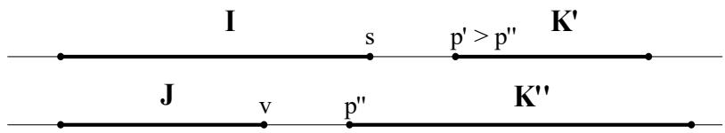

(Note that we used neither consistency nor fineness in this proof, so the proposition actually holds for arbitrary families.）■

PROPOSITION 1.5.20 $C < \operatorname* { m a x } ( A , B ) \Longleftrightarrow C < A$ or $C < B$

Proof. Straightforward.

The next proposition is useful in converting a proof about max into one about min,and vice versa.

PROPOSITION 1.5.21 $\operatorname* { m i n } ( A , B ) = - \operatorname* { m a x } ( - A , - B ) .$

PROPOSITION 1.5.22

1. $C < \operatorname* { m i n } ( A , B )$ if and only if $C < A$ and $C < B$   
2. $C > \operatorname* { m i n } ( A , B )$ if and only if $C > A$ or $C > B$   
3. $\operatorname* { m i n } ( A , B ) \leq A \leq \operatorname* { m a x } ( A , B )$

PROPOSITION $1 . 5 . 2 3 \operatorname* { m a x } ( A , B ) = B$ if and only if $A \le B$

Proof. ( $\Rightarrow$ ） By part (3) of the preceding proposition, if $\operatorname* { m a x } ( A , B ) \ = \ B$ ，then $A \le B$

（ $\Leftarrow$ ）Suppose that $A \le B$ .Since $B \leq \operatorname* { m a x } ( A , B )$ ，we only have to show that $B \geq \operatorname* { m a x } ( A , B )$ .This follows from proposition 1.5.20 because $B \not \prec B$ and we are assuming that $B \not \prec A$ (i.e. $A \le B$ )■

COROLLARY 1.5.24 m $\mathrm { i n } ( A , B ) = A$ if and only if $A \le B$ (This is a good example of the use of Proposition 1.5.21 in converting min's to max's.)

Now we turn to absolute value. Its properties are quite important for what follows in later chapters.

PROPOSITION 1.5.25 $| A | = \operatorname* { m a x } ( A , - A )$ (To prove this, recall that $| I | = \operatorname* { m a x } ( I , - I , 0 )$ for intervals.)

PROPOSITION 1.5.26

1. $| A | < B$ if and only if $- B < A < B$ (and similarly for $\leq$ ）   
2. $C < | A |$ if and only if $C < A$ or $C < - A$ (and similarly for $\leq$ ）

Proof.For part(1） notice that $- A < B$ if and only if $- B < A$ ， so we have to show that $\operatorname* { m a x } ( A , - A ) < B$ if and only if $A < B$ and $- A < B$ . This is a direct consequence of Proposition 1.5.19. The proof of (2） is similar，using Proposition 1.5.20 with $B = - A$ ■

COROLLARY 1.5.27 If $A \leq X \leq B$ and $A \leq Y \leq B$ ,then $| X - Y | \leq B - A$

Proof. Add the inequalities $A \leq Y \leq B$ and $- B \leq - X \leq - A$ ■

The following form of part (1) of the previous proposition is most often used in doing limits and other analysis constructions; it will be used many times throughout the remainder of the book.

COROLLARY 1.5.28 $| X - A | < E$ if and only if $A - E < X < A + E$ ， (and similarlyfor $\leq$ ）

COROLLARY 1.5.29

1. $| { \cal A } | > 0$ if and only if $A > 0$ or $A < 0$

2. $| { \cal A } | \geq 0$

3. $| { \cal A } | = 0$ if and only if $A = 0$

PROPOSITION 1.5.30

1.If $A \geq 0$ ，then $| A | = A$ .If $A \leq 0$ ，then $| A | = - A$   
2. $A \leq | A |$ and $- A \leq | A |$ ·

Proof. (1): If $A \geq 0$ ,then $A \geq - A$ .If $A \le 0$ , then $- A \geq A$ . The result now follows from Propositions 1.5.23 and 1.5.25. Part (2) is similar and uses 1.5.22 and 1.5.25.

COROLLARY 1.5.31 If $A < C < B$ then $| C | < \operatorname* { m a x } ( | A | , | B | )$ ； similarly for weak inequality $\leq$

The next result, though not diffcult to prove, is extremely important, so we rate it a“Theorem”.

THEOREM 1.5.32（TRIANGLE INEQUALITY） $| A + B | \leq | A | + | B |$

Proof.From the previous proposition and Corollary 1.5.12, we get both

$$
A + B \leq | A | + | B |
$$

and

$$
- ( A + B ) = - A + ( - B ) \leq | A | + | B | .
$$

Therefore, it follows from Proposition 1.5.20 that

$$
\operatorname* { m a x } \{ ( A + B ) , - ( A + B ) \} \leq | A | + | B | .
$$

But by Proposition 1.5.25,

$$
| A + B | = \operatorname* { m a x } \{ ( A + B ) , - ( A + B ) \} .
$$

So we are done.■

We next turn to the formula $| B - A | = \operatorname* { m a x } ( A , B ) - \operatorname* { m i n } ( A , B )$ .If we knew which was bigger, $A$ or $B$ (or whether they were equal) then the proof would be straightforward. Thus,we would like to separate this into cases. What gives us the right to do this? Although we don't have trichotomy for reals (though we do have a version of it—see Proposition 1.6.9 in the next section)，we do know that $A < B$ ， $A > B$ and $A = B$ can't all be false (see lemma below).Here is an alternate terminology:

DEFINITION 1.5.33(RULING OUT） To say that statements $P _ { 1 } , P _ { 2 } , \dots , P _ { N }$ can't all be ruled out is to say that they can't all be false; in other words, if they are all false it leads to a contradiction.

LEMMA 1.5.34 For real numbers, the statements $A < B$ ， $A > B$ and $A = B$ can't all be ruled out.

Proof.Suppose these statements are all false; then $B \leq A$ (since $A < B$ is false) and $A \le B$ (since $A > B$ is false). But then $A = B$ by Proposition 1.4.3,which contradicts the assumed falsity of $A = B$ ■

Let's see how to apply this in proving that

$$
\underbrace { | B - A | = \operatorname* { m a x } ( A , B ) - \operatorname* { m i n } ( A , B ) } _ { \mathrm { S t a t e m e n t ~ } Q } .
$$

Suppose we know that it is true in each of the cases

$$
\underbrace { A < B } _ { P _ { 1 } } , \underbrace { A > B } _ { P 2 } , \mathrm { a n d } \underbrace { A = B } _ { P _ { 3 } } .
$$

That is, suppose that $P _ { 1 } \implies Q$ ， $P _ { 2 } \implies Q$ ，and $P _ { 3 } \implies Q$ .Suppose now that $| B - A | < \operatorname* { m a x } ( A , B ) - \operatorname* { m i n } ( A , B )$ ； then $Q$ is false, so each of $P _ { 1 }$ ， $P _ { 2 }$ ，and $P _ { 3 }$ is false,which is impossible (since they can not all be ruled out). Thus, $| B - A | <$ $\operatorname* { m a x } ( A , B ) - \operatorname* { m i n } ( A , B )$ is impossible, so $| B - A | \geq \operatorname* { m a x } ( A , B ) - \operatorname* { m i n } ( A , B )$ . In a similar way, $| B - A | > \operatorname* { m a x } ( A , B ) - \operatorname* { m i n } ( A , B )$ is impossible, so $| B - A | \leq \operatorname* { m a x } ( A , B ) -$ $\operatorname* { m i n } ( A , B )$ . Thus, since we have $\leq$ and $\geq$ , we get equality, and we have proved the following.

REMARk 1.5.36 This idea can be extended to proving weak inequalities as well as equalities. For example, suppose we know that $a \leq b \Longrightarrow U \leq V$ and $b \leq a \implies$ $U \leq V$ . Then, if $U > V$ ， we deduce that $a \leq b$ and $b \leq a$ must both be false. But this cannot happen, since $a \leq b$ false means $a \ < \ b$ must be false. Thus, $b \leq a$ Im other words, $a \leq b$ and $b \leq a$ can't both be ruled out. Thus, $U > V$ can't happen, so $U \leq V$

LEMMA 1.5.37 $C + \operatorname* { m a x } ( A , B ) = \operatorname* { m a x } ( C + A , C + B ) .$

Note that it is easy to extend this,by induction, to

$$
C + \operatorname* { m a x } ( A _ { 1 } , \ldots , A _ { n } ) = \operatorname* { m a x } ( C + A _ { 1 } , \ldots , C + A _ { n } ) .
$$

An application of the lemma above provides an alternative proof for Proposition 1.5.35:

$$
\begin{array} { r l } { \operatorname* { m a x } ( A , B ) - \operatorname* { m i n } ( A , B ) = \operatorname* { m a x } ( A , B ) + \operatorname* { m a x } ( - A , - B ) } & { } \\ & { = \operatorname* { m a x } \{ \operatorname* { m a x } ( A , B ) - A , \operatorname* { m a x } ( A , B ) - B \} } \\ & { = \operatorname* { m a x } \{ \operatorname* { m a x } ( 0 , B - A ) , \operatorname* { m a x } ( A - B , 0 ) \} } \\ & { = \operatorname* { m a x } ( 0 , B - A , A - B ) } \\ & { = \operatorname* { m a x } ( 0 , | B - A | ) } \\ & { = | B - A | . } \end{array}
$$

This suggests the following generalization of Proposition 1.5.35.

PROPOSITION 1.5.38 $\operatorname* { m a x } ( A _ { 1 } , \dots , A _ { n } ) - \operatorname* { m i n } ( A _ { 1 } , \dots , A _ { n } ) = \operatorname* { m a x } ( A _ { i } - A _ { j } )$ for $i , j =$ $1 , \ldots , n$

Proof. Exercise. I

We conclude this section with the definition and some results on betweenness. The reason why we take such formal care with this concept is that there are many cases where we want to say that $A$ is between $B$ and $C$ without specifying which of $B$ or $C$ is to the right of $A$ ； in fact, sometimes it is either irrelevent or unknown. In some sense,betweenness is a partial substitute for trichotomy, or at least a way of sidestepping the issue. (By the way, like “bookkeeper,”“betweenness” is one of those rare words with three sets of double letters!)

DEFINITION 1.5.39 （BETWEENNESS） A is between $B$ and $C$ means $\operatorname* { m i n } ( B , C ) \leq$ $A \leq m a x ( B , C )$

PROPOSITION 1.5.40 If $A$ and $B$ are between $C$ and $D$ ,then $| B - A | \leq | D - C |$

PROPOSITION 1.5.41 If $A$ is between $B$ and $C$ ，and $B$ and $C$ are between $D$ and $E$ ， then Ais between $D$ and $E$

PROPOsITiON 1.5.42 Given finitely many real numbers, $A _ { 1 } , \ldots , A _ { n }$ ， such that for any three taken in succession, the third is between the first two, then $A _ { n }$ is between $A _ { 1 }$ and $A _ { 2 }$ .

PROPOSITION 1.5.43 A is between $B$ and $C$ if and only if the following two conditions are satisfied:

1.If $B \leq C$ ，then $B \leq A \leq C$ and  
2.If $C \le B$ ， then $C \le A \le B$

PROPOSITION 1.5.44 A is between $B$ and $C$ if and only if $| C - B | = | C - A | +$ $\left| A - B \right|$

COROLLARY 1.5.45 If $A$ is between $B$ and $C$ ， then for all $D$ ， $D A$ is between $D B$ and $D C$

(Prove this by simply multiplying the equation in the preceding proposition by $| D |$ ）

PROPOSITION 1.5.46 For any $A$ ， $B$ ，and $X$ the following statements can't all be ruled out:

1. $X \leq \operatorname* { m i n } ( A , B )$

2. $\operatorname* { m a x } \left( A , B \right) \leq X$

3. $X$ is between $A$ and $B$ .

Proof. That $X \leq \operatorname* { m i n } ( A , B )$ is false implies $X < \operatorname* { m i n } ( A , B )$ is false,which implies $\operatorname* { m i n } ( A , B ) \leq X$

That $\operatorname* { m a x } ( A , B ) \leq X$ is false implies $\operatorname* { m a x } ( A , B ) \ < \ X$ is false,which implies $X \leq \operatorname* { m a x } ( A , B )$

So both statements being false contradicts the falsity of $\operatorname* { m i n } ( A , B ) \ \leq \ X \ \leq$ $\operatorname* { m a x } ( A , B )$ ■

REMARK 1.5.47 The statements $X \leq \operatorname* { m i n } ( A , B )$ and $\operatorname* { m a x } \left( A , B \right) \leq X$ together can be interpreted as saying “A and $B$ lie on the same side of $X$ .” Thus, the previous proposition says that we can not rule out both of the statements:“ $A$ and $B$ lie on the same side of $X$ ” and"X lies between $A$ and $B$ .”

# Exercises

1.Let us identify the rational numbers 3 and 4 with the families $\{ | 3 , 3 | \}$ and $\{ \left\lfloor 4 , 4 \right\rfloor \}$ Let $F = \{ | 4 - 1 / N , 4 + 1 / N | : N = 1 , 2 , \ldots \}$ .Compute the family $3 + F$ and prove directly that $3 + 4 = 3 + F = \{ \lvert 7 , 7 \rvert \}$ (as real numbers). You’ll have to show that the underlying families are consistent with each other. Give a similar proof that $3 { \cal F } = \{ | 1 2 , 1 2 | \}$ ．Note that Proposition 1.5.2,based on Proposition 1.2.17,proves that these kinds of equalities are true in general.

2.Thinking of 2 as the real number $\{ \vert 2 , 2 \vert \}$ ,3 as $\{ | 3 , 3 | \}$ , etc.,prove directly that $2 + 3 = 5$ and $2 \cdot 3 = 6$ . Now think of $2$ as the real number $2 ^ { * }$ , the family of all $\lfloor r , s \rfloor$ such that $r \leq 2 \leq s$ . Similarly identify 3 with $3 ^ { * }$ etc. Prove the same arithmetic formulas: $2 + 3 = 5$ and $2 \cdot 3 = 6$ . Note that Proposition 1.5.2, based on Proposition 1.2.17 proves that these kinds of equalities are true in general.

3. Prove the following properties of the reals. (You will have to use intervals and consistency.)

(a) $A ( B + C ) = A B + A C$   
(b） $A + 0 = A$   
(c） $A - A = 0$   
(d) $1 \cdot B = B$   
(e)If $A \in \mathbb { R } ^ { * }$ then $A / A = 1$

4.Prove the following properties of the reals. You shouldn't have to go back to intervals and families of intervals,but use the properties already established in the previous exercise.

(a)If $A + C = B + C$ ，then $A = B$ (Cancellation for Addition） (Hint: add $- C$ to both sides,using Proposition 1.5.2.)   
(b） $A = B$ if and only if $0 = B - A$   
(c） $- ( A + B ) = ( - A ) + ( - B )$ (Hint: Cancellation says that you can test whether two real numbers $X$ and $Y$ are equal by seeing if you can find a third number $Z$ such that they become equal when you add $Z$ to them (that is, $X + Z = Y + Z \implies X = Y$ )．Apply this to test whether $X = - ( A + B )$ equals $Y = - A + ( - B )$ ; you'll have to figure out what to chose for $Z$ .）   
(d) $- ( - A ) = A$ (Hint: Similar in idea to the preceding.)   
(e)If $C \in \mathbb { R } ^ { * }$ and $C A = C B$ ,then $A = B$ . (Cancellation for Multiplication)   
(f) For $A \in \mathbb { R } ^ { * }$ ， $A = B$ if and only if $B / A = 1$   
(g）For $A \in \mathbb { R } ^ { * }$ ， $1 / ( 1 / A ) = A$ . (Hint: Similar to the idea of previous hints involving addition,but this is multiplication.)

5. Using intervals, prove the following proposition from the text.

PROPOSITION.For real $A$ and $B$ ， (a) $A < B$ if and only if $0 < B - A$ (b) $A \le B$ if and only if $0 \leq B - A$

(If you argue carefully, you can deduce the $\leq$ part from the $<$ part,but it's probably not worth it unless you see right away how to proceed.)

6.Prove the following corollary from the text. You should not have to use intervals at all: its parts follow from the proposition proved in the previous exercise.

COROLLARY. For reals $A$ ， $B$ ,and $C$ ， (a) $A < 0$ if and only if $0 < - A$ (b） $A > 0$ if and only if $0 > - A$ （c） $A + C < B + C$ if and only if $A < B$ (d) $B < 0$ if and only if $B + C < C$ （e） $B > 0$ if and only if $B + C > C$ (f) $B \leq 0$ if and only if $B + C \leq C$ (g） $B \geq 0$ if and only if $B + C \geq C$

7. Suppose that $A$ and $B$ are real numbers. Prove the following.

(a) $A$ is a unit if and only $A \in \mathbb { R } ^ { * }$ .(Hint:if $A X = 1$ then $A X > 0$ ; show that $A > 0$ or $A < 0$ ）   
(b) $A B$ is a unit if and only if both $A$ and $B$ are units.   
(c） If $A B$ is a unit, then $1 / ( A B ) = ( 1 / A ) ( 1 / B )$ (Hint: Use 1 and 2).   
(d) If $A + B$ is a unit, then $A$ is a unit or $B$ is a unit. (Hint: It was already proved in the text that if the sum of two numbers is positive,one of them must be positive.)

8.Prove the very useful Corollary 1.5.28. which says that $| A - X | < E$ if and only if $X - E < A < X + E$ (and similarly for $\leq$ ）

9. Suppose $A \geq 0$ ， $B \geq 0$ . Prove the following.

(a)If $A B \geq 1$ and $B < 1$ ,then $A > 1$ (b)If $A B > 1$ then $A > 1$ or $B > 1$

10. Here are some further useful inequalities.

(a)If $A _ { 1 } , A _ { 2 } , \ldots A _ { n }$ are non-negative and $A _ { 1 } A _ { 2 } \cdot \cdot \cdot A _ { n } > 1$ , then some $A _ { k } > 1$   
(b)If $\textstyle \sum _ { i = 1 } ^ { n } A _ { i } < n$ where each $A _ { i } > 0$ , then some $A _ { k } < 1$   
(c) Suppose ceed byinduction on $\textstyle \prod _ { i = 1 } ^ { n } A _ { i } = 1$ , where each $_ n$ Ifitstre for sme Then $_ n$ but $\textstyle \sum _ { i = 1 } ^ { n } A _ { i } \geq n$ $\textstyle \sum _ { i = 1 } ^ { n + 1 } A _ { i } < n + 1$ . (Hint: pro- then by part (b) some $A$ ,say $A _ { 1 }$ is $< 1$ . But now the product of the remaining $A$ 's must be bigger than 1, so by part (a) one of these, say $A _ { n + 1 }$ ,is $> 1$ Now use the induction hypothesis, the grouping $( A _ { 2 } ) . . . ( A _ { n } ) ( A _ { 1 } A _ { n + 1 } )$ ， and $- A _ { 1 } A _ { n + 1 } + A _ { 1 } + A _ { n + 1 } = ( A _ { n + 1 } - 1 ) ( 1 - A _ { 1 } ) + 1 > 1$ to get a contradiction.)

11. Suppose $a \leq b \Longrightarrow U = V$ and $b \leq a \Longrightarrow U = V$ . Prove that $U = V$ . (Hint: see Remark 1.5.36.)

12.Use the previous exercise to show that

$$
{ \frac { | A | + A } { 2 } } = \operatorname* { m a x } ( A , 0 )
$$

and

$$
{ \frac { | A | - A } { 2 } } = \operatorname* { m a x } ( - A , 0 ) .
$$

# 1.6Rational Approximations

The rationals,as we have seen, sit inside the reals—mathematicians say they are embedded in the reals. This association is $r  \{ \vert r , r \vert \}$ . Because real numbers are fine families,it is clear that for any real $A$ and any rational $\epsilon > 0$ ，we can find rationals $r$ and $s$ such that $r < A < s$ and $s - r < \epsilon$ : simply take an interval $[ r ^ { \prime } , s ^ { \prime } ]$ from $A$ of length smaller than $\epsilon$ ， say $\epsilon / 2$ ，and choose $r$ slightly smaller than $r ^ { \prime }$ (say $r = r ^ { \prime } - \epsilon / 4$ ）and $s$ slightly larger than $s ^ { \prime }$ (say $s = s ^ { \prime } + \epsilon / 4$ ).(We had to make these adjustments because all we know about $[ r ^ { \prime } , s ^ { \prime } ]$ is that $r ^ { \prime } \leq A \leq s ^ { \prime }$ and we want strict inequality $<$ ）We summarize this in the following proposition.

PROPOSITION 1.6.1 For any real number $A$ and rational $\epsilon > 0$ ， there are rationals $r$ and s such that

$$
r < A < s \ a n d \ s - r < \epsilon .
$$

PROPOSITION 1.6.2 If $A > B$ ， there are rationals c such that $A > c > B$

Proof. If $A > B$ , there are rationals $r$ and $v$ with $A \geq r > v \geq B$ . (We have an interval $\lfloor r , s \rfloor$ in $A$ and an interval $\left\lfloor u , v \right\rfloor$ in $B$ with $r > v$ , and we know by Corollary 1.3.13 that $A \geq r$ and $v \geq B$ .）Any $c$ such that $r > c > v$ has the required property, for example, $c = ( r + v ) / 2$ ■

COROLLARY 1.6.3 If $A > 0$ , there are positive rationals $\epsilon$ such that $A > \epsilon$

COROLLARY 1.6.4 $A < B$ or $A > B$ if and only if $| B - A | > \epsilon$ for some rational $\epsilon > 0$

This follows from the preceding proposition, because we know that $A < B$ or $A > B$ if and only if $| B - A | > 0$ (see Corollary 1.5.29).

REMARK 1.6.5 It also follows that $A < B$ or $A > B$ if and only if $| B - A | > C$ for some $C ~ > ~ 0$ .(Given the latter condition， for example, we can apply either Proposition 1.6.2 to get $| B - A | > \epsilon > C$ with $\epsilon$ rational, or apply Corollary 1.6.3 to get $C > \epsilon > 0$ ， again with $\epsilon$ rational.)

COROLLARY 1.6.6 $A = B$ if and only if $| B - A | \leq \epsilon$ for all positive rationals $\epsilon$ ：

The following tells us we can adjust the family that defines a given real so that the lower and upper bounds fall within certain limits.

PROPOSITION 1.6.7 Let $A$ be an real number such that $r _ { 0 } \le A \le s _ { 0 }$ for rational numbers $r _ { 0 }$ and $s _ { 0 }$ .Let $I _ { 0 } = | r _ { 0 } , s _ { 0 } |$ and let $A \cap I _ { 0 }$ be the family of all $I \cap I _ { 0 }$ with $I \in A$ . Then

1. $A \cap I _ { 0 }$ is consistent and fine.

2. $A \cap I _ { 0 } \sim A$ ， so that $A \cap I _ { 0 } = A$ as real numbers.

3. All lower and upper bounds for $A \cap I _ { 0 }$ lie between $r _ { 0 }$ and $s _ { 0 }$

Recall the Wiggle Lemma for rationals (Lemma 0.2.6), which says that if $r \leq s + \epsilon$ for all $\epsilon > 0$ ,then $r \leq s$ . Here is the version for real numbers.

LEMMA 1.6.8（WIGGLE LEMMA FOR REALS） Let $X$ and $Y$ be real numbers.

1.If $X \leq Y + \epsilon$ for every real $\epsilon > 0$ ，then $X \le Y$

2.If $X \leq Y + \epsilon$ for every rational $\epsilon > 0$ ， then $X \le Y$ (The proof is left as an exercise: it follows from the Wiggle Lemma for rational numbers.)

To conclude this section,we take another look at Trichotomy. For any two rationals $r$ and $s$ ，we can determine exactly which of the relations $r \ < \ s$ ， $r \geq s$ ，and $r = s$ holds.As we have seen,given two reals $A$ and $B$ ,we can not exclude all three conditions: $A < B$ ， $A > B$ ， $A = B$ .Nevertheless it may be impossible,without proving a theorem,to determine which one holds for given $A$ and $B$ (see the appendix on “The Goldbach Number"). The following result expresses what we can say in general.

PROPOSITION 1.6.9（ $\epsilon$ -TRICHOTOMY）If $A$ and $B$ are real numbers, then for each rational $\epsilon > 0$ ，either $A < B$ ， $B < A$ ，or $A$ and $B$ are within E of each other.

Proof. It is important to emphasize that the words “either...or” here mean that one can actually, constructively, determine which of the three alternatives hold. The proof should reflect this. The idea is to choose intervals $I$ and $J$ from $A$ and $B$ Since rationals satisfy trichotomy, one can determine if $I < J$ (so $A < B$ )，or $J < I$ (so $B < A$ ). If neither,than $I$ and $J$ meet.By choosing $I$ and $J$ of sufficiently small length,this third case will imply that $A$ and $B$ are within $\epsilon$ .We leave the details for the exercises.■

Here are several very useful applications of $\epsilon$ -Trichotomy. The proofs are discussed in the exercises.

LEMMA 1.6.10 If $A < B$ then, for any $P$ ，either $P > A$ or $P < B$

LEMMA 1.6.11 Let $I _ { k } = [ a _ { k } , b _ { k } ]$ ， $k = 0 , 1 , \ldots , N$ , be a family of intervals such that

1. $a _ { k } < b _ { k }$ for $k = 0 , 1 , \ldots , N$ and f $x \in [ a _ { 0 } , b _ { N } ]$ , then we can find some $K$ such that $x \in { \cal I } _ { K }$

LEMMA 1.6.12 Let $A = x _ { 0 } < x _ { 1 } < \dots < x _ { N } = B$ be a partition of the interval $[ A , B ]$ such that $x _ { i } - x _ { i - 1 } < \delta$ for $i = 1 , \ldots , N$ . Then for each $x \in [ A , B ]$ ， there is some $j$ such that $| x - x _ { j } | \ < \delta$

LEMMA 1.6.13 Given reals $F _ { 0 }$ ， $F _ { 1 } , \ldots , F _ { N }$ and $\epsilon > 0$ ， there are indices $K$ and $L$ such that, for all $j = 0 , \ldots , N$ ， $F _ { K } < F _ { j } + \epsilon$ and $F _ { L } > F _ { j } - \epsilon$

(What is this last lemma saying? Hint: It might be nicknamed ‘ $\dot { \epsilon } { - } \operatorname* { m a x } \big / \operatorname* { m i n }$ ”)

# Exercises

1. Let $A$ and $B$ be any reals with $A \le B$ .For any $\epsilon > 0$ ， show how to find rationals $r \leq s$ such that

$$
r \leq A \leq B \leq s \quad { \mathrm { ~ a n d ~ } } \quad s - r < ( B - A ) + \epsilon .
$$

2.Use bisection (see exercises on page 38) to find rationals $r$ and $s$ such that $r \leq \sqrt { 2 } \leq s$ and $0 < s - r < 1 / 5 0$

3. Use Divide-and-Average (see exercises on page 39) to make the same estimate as in the previous exercise.

4.Apply $\epsilon$ -Trichotomy to O and the Goldbach number (see the appendix to this chapter).

5.Prove the Wiggle Lemma (Lemma 1.6.8)，which says that if $X \leq Y + \epsilon$ for every rational $\epsilon > 0$ ，then $X \leq Y$

(Hint: Use the fact that we know it is true when $X$ and $Y$ are rationals (0.2.6). Let $\lfloor r , s \rfloor$ and $\lfloor u , v \rfloor$ be arbitrary rational intervals of $X$ and $Y$ respectively. Interpret $X \leq Y + \epsilon$ in terms of intervals and use it to show $r \leq v$ .）

6. Prove $\epsilon$ -Trichotomy (Proposition 1.6.9),which says: If $A$ and $B$ are real numbers, then for each rational $\epsilon > 0$ ,either $A < B$ ， $B < A$ ,or $A$ and $B$ are within $\epsilon$ of each other. The text gives an outline.

7. Prove the following three lemmas,stated in the text (Hint: $\epsilon$ -Trichotomy will come in handy).

LEMMA 1.6.10 If $A < B$ then, for any $P$ ,either $P > A$ or $P < B$

LEMMA 1.6.12 Let $A = x _ { 0 } < x _ { 1 } < \dots < x _ { N } = B$ be a partition of the interval $\lfloor A , B \rfloor$ such that $x _ { i } - x _ { i - 1 } < \delta$ for $i = 1 , \ldots , N$ . Then for each $x \in \left[ A , B \right]$ ,there is some $j$ such that $| x - x _ { j } | < \delta$

LEMMA 1.6.13（ $^ { 6 6 } { \epsilon } { - } \operatorname* { m a x } \mathrm { / \operatorname* { m i n } } ^ { \mathrm { , } }$ ）Given reals $F _ { 0 }$ ， $F _ { 1 } , \ldots , F _ { N }$ and $\epsilon > 0$ , there are indices $K$ and $L$ such that, for all $j = 0 , \ldots , N$ ， $F _ { K } < F _ { j } + \epsilon$ and $F _ { L } > F _ { j } - \epsilon$

8. Prove the following from the text (use Lemma 1.6.10):

LEMMA 1.6.11 Let $I _ { k } = [ a _ { k } , b _ { k } ]$ ， $k = 0 , 1 , \ldots , N$ , be a family of intervals such that

(a) $a _ { k } < b _ { k }$ for $k = 0 , 1 , \ldots , N$ and (b） $a _ { k + 1 } < b _ { k }$ for $k = 0 , 1 , \ldots , N - 1$ f $x \in \left\lfloor a _ { 0 } , b _ { N } \right\rfloor$ , then we can find some $K$ such that $x \in I _ { K }$ (Hint:Here is an algorithm which will produce $K$ ：

(i） We know that $a _ { 0 } \leq x$   
(ii) Since $a _ { 1 } ~ < ~ b _ { 0 }$ ，either $x \textless b _ { 0 }$ or $x \ > \ a _ { 1 }$ If $x \textless b _ { 0 }$ ，then $x \in \lfloor a _ { 0 } , b _ { 0 } \rfloor$ Otherwise, $a _ { 1 } < x$   
(ii) Since $a _ { 2 } ~ < ~ b _ { 1 }$ ，either $x \textless b _ { 1 }$ ，or $x \ > \ a _ { 2 }$ If $x < b _ { 1 }$ ，then $x \in \lfloor a _ { 1 } , b _ { 1 } \rfloor$ Otherwise, $a _ { 2 } < x$   
(iv) Continuing in the way, we have the pattern: $x \in \left\lfloor a _ { k } , b _ { k } \right\rfloor$ or $a _ { k + 1 } < x$

This must terminate either with $_ { x }$ in some $I _ { k }$ for $k < N$ ，or $a _ { N } < x$ .But in this case, $x \in \lfloor a _ { N } , b _ { N } \rfloor$ since $x \leq b _ { N }$ .）

# 1.7Real Intervals and Completeness

Recall that in Example 1.3.16 we looked at the family $\mathit { c 2 }$ of all (rational) $\lfloor a , b \rfloor$ such that $a ^ { 3 } \leq 2 \leq b ^ { 3 }$ . It is not difficult to show, by bisection (see exercise 10 on page

38),that this family is consistent and fine,so that it is a real number—we now call it $\sqrt [ 3 ] { 2 }$ . This notation is justified because it is possible to show that $\left( { \sqrt [ { 3 } ] { 2 } } \right) ^ { 3 } = 2$ ,as real numbers (this is discussed on page 41). Thus,although there is no rational number whose cube is 2, there is a real number with this property. Put another way, the equation $x ^ { 3 } = 2$ had no solution when all we had was the rationals, but we now can construct a solution that is a real number. Thinking of a rational interval, as we have done before,as a measurement,one might be tempted to say that this real number is “the collection of all attempts to measure a cube root of 2 with rationals.” Technically this is circular, since the cube root of 2 was not actually a “thing” that could be “measured,”when all we had was the rationals; nevertheless,it describes the process of construction rather nicely.

As you have probably already realized, this kind of construction can be applied to many other kinds of problems,including,clearly, $_ { n }$ th roots of rationals,and even solutions of more general algebraic equations. The exercises at the end of this chapter give some examples,and we will see others, such as Newton's Method, in later chapters.So let us take a closer look at the method.

We started with a consistent fine family of rational intervals ( $\mathit { c 2 }$ ，or $\sqrt [ 3 ] { 2 }$ ).Since this is already a real number,we didn't have to do anything further to get our answer. It is important to note, however, that the real number $\sqrt [ 3 ] { 2 }$ does not lie in any of the intervals of this family, since it is not itself rational. On the other hand,if $\lfloor r , s \rfloor$ is a rational interval in the family $\sqrt [ 3 ] { 2 }$ then we know that $r \leq \sqrt [ 3 ] { 2 } \leq s$ as families (by Proposition 1.3.12),or as real numbers. If we allowed $\lfloor r , s \rfloor$ to contain real numbers, then we would have $\sqrt [ 3 ] { 2 } \in [ r , s ]$ for any interval in $\sqrt [ 3 ] { 2 }$

To pursue this idea further,we need to look at real intervals.

DEFINITION 1.7.1（REAL INTERVAL） $\lfloor A , B \rfloor$ is a real interval when $A$ and $B$ are real numbers and $A \le B$ .If $X$ is a real number, then $X \in \lfloor A , B \rfloor$ means $A \leq X \leq B$ .

Of course, this definition leads to an obvious problem. Since rationals like $1 / 2$ and $3 / 4$ are real numbers,how do we know whether the interval denoted $\lfloor 1 / 2 , 3 / 4 \rfloor$ is to be considered a real interval (containing non-rational reals as well as rationals) Or a rational interval (containing only rational members)? Well, we could have done something fancy, like notating real intervals with double brackets: $\left\lfloor \left\lfloor 1 / 2 , 3 / 4 \right\rfloor \right\rfloor$ .But instead we will simply assume that from now on, all intervals $[ a , b ]$ are real intervals unless otherwise specifed. In other words,without further comment, $\lfloor 1 / 2 , 3 / 4 \rfloor$ will mean a real interval. Thus, for example, $\textstyle { \frac { \sqrt { 2 } } { 2 } } \in [ 1 / 2 , 3 / 4 ]$

As we did for rational intervals, we define $\vert A , B \vert < \vert C , D \vert$ to mean $B < C$

Now,if you look back over the properties of rational intervals and the proofs of those properties,you'll see that nearly all of them depend only on elementary properties of inequalities and their algebraic manipulation. Since the same rules for manipulating inequalities hold for reals as do for rationals, most of these properties of rational intervals continue to be true for real intervals.Here are two examples.

PROPOSITION 1.7.2 $\lfloor A , B \rfloor$ intersects $| C , D |$ (i.e. there is a real x in both intervals) if and only if $A \leq D$ and $C \le B$

Proof. The argument used for Proposition 1.2.2 works here too. It gives us the result that $_ { x }$ is in the intersection of $\lfloor A , B \rfloor$ and $| C , D |$ if and only if it is in $\left| \operatorname* { m a x } ( A , C ) , \operatorname* { m i n } ( B , D ) \right|$ ■

PROPOSITION 1.7.3 For real numbers $A$ and $B$ and a family of real intervals $s$ ， $A \leq S \leq B$ if and only if $\lfloor A , B \rfloor$ meets every interval of $\boldsymbol { S }$

Of course, $A \leq S \leq B$ really means $\{ | A , A | \} \leq S \leq \{ | B , B | \}$ . The proof of this is exactly the same as the proof of its rational interval version,Proposition 1.3.12.

REMARK 1.7.4 Suppose that $\lfloor a , b \rfloor$ and $\lfloor c , d \rfloor$ are real intervals with rational endpoints $^ { a }$ ， $b$ ， $c$ ，and $^ d$ . Suppose also that they intersect,in other words, have a real number in common.By Proposition 1.7.2 above, this means that $a \leq d$ and $c \leq b$ .But this tells us that there is a rational number common to both, since they now intersect as rational intervals. Thus, if two real intervals with rational endpoints intersect, they contain a common rational. Of course, having rational endpoints is critical here: for example, $[ 1 , { \sqrt { 2 } } ]$ and $[ \sqrt { 2 } , 2 ]$ have a common real but no common rational.

DEFINITiON 1.7.5 For any family of real intervals $\boldsymbol { S }$ ，

1. $\boldsymbol { S }$ is consistent means that every pair of intervals in $s$ intersect.

2. $\boldsymbol { S }$ is fine means that, for each $\epsilon > 0$ there in an interval $I$ in $\boldsymbol { S }$ with $\ell ( I ) < \epsilon$

REMARk 1.7.6 Note that in part (2) of this definition, it suffces to check the existence of intervals of length less than E for all positive rational $\epsilon$

Let's look at our example involving $\sqrt [ 3 ] { 2 }$ more carefully.

Here is the original family of rational intervals:

$$
\mathcal { C } 2 = \mathrm { A l l ~ r a t i o n a l ~ i n t e r v a l s ~ } [ r , s ] \mathrm { ~ w i t h ~ } r ^ { 3 } \le 2 \le s ^ { 3 } .
$$

As we have seen, there can be no single rational number common to all the intervals in this family.

Here is the corresponding family of real intervals:

$$
\mathcal { C } = \mathrm { A l l ~ r e a l ~ i n t e r v a l s ~ } [ A , B ] \mathrm { ~ w i t h ~ } A ^ { 3 } \leq 2 \leq B ^ { 3 }
$$

All intervals inthis family have the real number $\sqrt [ 3 ] { 2 }$ in common.

In the second of these families, the family of real intervals, is there any real other than $\sqrt [ 3 ] { 2 }$ common to all the intervals? Fortunately no, as the following proposition tells us.

PROPOSITION 1.7.7 Suppose $\boldsymbol { S }$ is a fine family of real intervals. If $P$ and $Q$ are real numbers that belong to each interval in $\boldsymbol { S }$ ，then $P = Q$

Proof. Given an arbitrary $\epsilon > 0$ ,let $\lfloor A , B \rfloor$ be an interval in $\boldsymbol { S }$ of length $< \epsilon$ .Then $P$ and $Q$ are in $\lfloor A , B \rfloor$ and $| P - Q | = \operatorname* { m a x } ( P , Q ) - \operatorname* { m i n } ( P , Q ) \leq B - A < \epsilon$ .Since $\epsilon$ was arbitrary, $0 \leq | P - Q | \leq 0$ by the Wiggle Lemma, so $P = Q$ ■

So let us try to generalize the construction of $\sqrt [ 3 ] { 2 }$ to families of real intervals $\boldsymbol { S }$ When will the intersection of all the intervals in $\boldsymbol { S }$ have one and only one element in it? For the uniqueness of this element,we will surely want $\boldsymbol { S }$ to be fine in view of the proposition we just proved. We will also want $\boldsymbol { S }$ to be consistent,since otherwise $\boldsymbol { S }$ might not determine any real number. So,suppose that $\boldsymbol { S }$ is both fine and consistent. Since real numbers are defined by rational measurements,we may ask,“What sort of rational measurements would measure a real number determined by $\boldsymbol { S }$ ？”

Suppose $\lfloor A , B \rfloor$ is an interval in $\boldsymbol { S }$ .Since the reals $A$ and $B$ can，unless they are rational, only be approximated by rationals, the measurement $\lfloor A , B \rfloor$ will be approximated by some rational interval $\lfloor r , s \rfloor$ which, to be conservative, we will assume both underestimates and overestimates, i.e. $r \leq A \leq B \leq s$ . Note that we can't say that the rational interval $\lfloor r , s \rfloor$ contains $\lfloor A , B \rfloor$ since membership in $\lfloor r , s \rfloor$ has been restricted to rationals; of course, if we replace $\lfloor r , s \rfloor$ by a real interval that happens to have rational endpoints $r$ and $s$ ，then this new interval would contain $\lfloor A , B \rfloor$ Instead, let's just be more careful and introduce the following terminology.

DEFINITION 1.7.8 (OvERSPREADs) The rational interval $\lfloor r , s \rfloor$ overspreads the real interval $\lfloor A , B \rfloor$ means $r \leq A \leq B \leq s$

We can't just choose any rational intervals that overspread the intervals in $\boldsymbol { S }$ ， because the family of rational intervals we get may not be fine. Instead, we look at all rational intervals which overspread at least one interval in $\boldsymbol { S }$

DEFINITION 1.7.9 ( $\operatorname* { l i m } \left( S \right) ,$ ）For a consistent and fine family $\boldsymbol { S }$ of real intervals, $\operatorname* { l i m } ( S )$ is the family of all rational intervals that overspread at least one interval of $S$

To paraphrase this definition slightly, the rational interval $\lfloor r , s \rfloor$ is in $\operatorname* { l i m } ( S )$ if and only if we can find some interval $\lfloor A , B \rfloor$ in $\boldsymbol { S }$ such that $r \leq A \leq B \leq s$ . Note that the interval $\lfloor A , B \rfloor$ will depend on $\lfloor r , s \rfloor$ ,and there will, in general, be many intervals in $\boldsymbol { S }$ that are overspread by $\lfloor r , s \rfloor$

For example, suppose that the real interval $R = [ \sqrt { 2 } , \sqrt { 3 } ]$ happens to lie in $\boldsymbol { S }$ Then the rational interval [1,2] overspreads $R$ since $1 \leq { \sqrt { 2 } } \leq { \sqrt { 3 } } \leq 2$ ； hence $\lfloor 1 , 2 \rfloor$ lies in $\operatorname* { l i m } ( S )$ . Similarly,[1.4,1.75] also lies in $\operatorname* { l i m } ( S )$ , since $1 . 4 \le \sqrt { 2 } \le \sqrt { 3 } \le 1 . 7 5$

The family $\operatorname* { l i m } ( S )$ is very large. It is consistent. To see this, suppose $I = \lfloor r , s \rfloor$ and $J = \lfloor u , v \rfloor$ are any two (rational) intervals in $\operatorname* { l i m } ( S )$ . By the definition of $\operatorname* { l i m } ( S )$ ， they overspread intervals of $\boldsymbol { S }$ , so we can write

$$
\begin{array} { r c l } { r } & { \leq } & { A \leq B \leq s } \\ { u } & { \leq } & { C \leq D \leq v } \end{array}
$$

for intervals $\lfloor A , B \rfloor$ and $| C , D |$ in $s$ . Since $\boldsymbol { S }$ is consistent, $A \le D$ and $C \le B$ It follows that $r \leq v$ and $u \leq s$ ； thus, $\lfloor r , s \rfloor$ and $\left\lfloor u , v \right\rfloor$ intersect.

What about fineness? If $\lfloor A , B \rfloor$ is in $\boldsymbol { S }$ ，we can find rationals $r \leq A$ and $s \geq B$ with $A - r$ and $s - B$ as small as we choose. In fact，given any $\epsilon > 0$ ，we can make use of Proposition 1.6.1 to find rationals $r$ and $s ^ { \prime }$ such that $r \ \leq \ A \ \leq \ s ^ { \prime }$ and $A - r \le s ^ { \prime } - r < \epsilon / 3$ .Similarly,we can find rationals $r ^ { \prime }$ and $s$ such that $s - B \le s - r ^ { \prime } < \epsilon / 3$ . Thus, $\ell ( \lfloor r , s \rfloor ) = ( s - B ) + ( B - A ) + A - r < \epsilon / 3 + \ell ( A , B ) + \epsilon / 3$ This is illustrated in the following diagram.

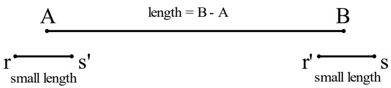

Because there are arbitrarily smallintervals $\lfloor A , B \rfloor$ in $\boldsymbol { S }$ (of length less than $\epsilon / 3$ ）， we also have arbitrarily small intervals $\lfloor r , s \rfloor$ in $\operatorname* { l i m } ( S )$

We now come to the fundamental property of the real number system, expressed by the following theorem, sometimes called “The Completeness of the Reals."

THEOREM 1.7.10（COMPLETENESS） If $s$ is any consistent and fine family of real intervals, then there is a real number, $\operatorname* { l i m } ( S )$ ， that belongs to every interval of $\boldsymbol { S }$ Furthermore, it is the only real number that lies in every interval of $s$

Proof. We have already verified that $\operatorname* { l i m } ( S )$ is consistent and fine,so $\operatorname* { l i m } ( S )$ is a real number. We must prove that it belongs to every interval in $\boldsymbol { S }$ .But every interval in $\boldsymbol { S }$ intersects every interval in $\operatorname* { l i m } ( S )$ (because every interval in $\operatorname* { l i m } ( S )$ overspreads an interval of $\boldsymbol { S }$ and the family $s$ is consistent).It follows immediately from Proposition 1.7.3 that for every $| C , D |$ in $\boldsymbol { S }$ ， we have $C \leq \operatorname* { l i m } ( S ) \leq D$ . Thus, $\operatorname* { l i m } ( S )$ does indeed belong to every interval in $\boldsymbol { S }$

The fact that there are no other real numbers lying in each interval of $\boldsymbol { S }$ isa direct consequence of Proposition 1.7.7.■

The Completeness Theorem may seem somewhat formal and unremarkable. This is due,in part,to the fact that most of the hard work in proving it was done in the propositions preceding it. Nevertheless,as you will soon see,it is a very powerful result because it guarantees (by construction） the existence of a real number with certain properties. It will enable us to prove convergence of sequences and series, and to define derivatives and integrals and show when they exist. It will simply be a matter of choosing the proper family $\boldsymbol { S }$ in each application.

# Exercises

1. Let

$$
{ \begin{array} { r l } & { { \sqrt { 2 } } = \left\{ \left[ r , s \right] \mid r > 0 { \mathrm { ~ a n d ~ } } r ^ { 2 } < 2 < s ^ { 2 } \right\} } \\ & { { \sqrt { 3 } } = \left\{ \left[ r , s \right] \mid r > 0 { \mathrm { ~ a n d ~ } } r ^ { 2 } < 3 < s ^ { 2 } \right\} , } \end{array} }
$$

where these are families of rational intervals. Find any rational interval that overspreads $[ { \sqrt { 2 } } , { \sqrt { 3 } } ]$ . Find one whose length is less than 1.

2.Let ${ \sqrt { 2 } } = \{ [ r , s ] \vert r > 0$ and $r ^ { 2 } < 2 < s ^ { 2 } \}$ (as a family of rational intervals). Find an interval that overspreads $[ \sqrt { 2 } - 1 , \sqrt { 2 } + 1 ]$ and whose length is less than 2.O1. Can you find one whose length is less than 2?

3. Let $\lfloor A , B \rfloor$ be a real interval. Given any $\epsilon > 0$ ，show how to find a rational interval $I$ which overspreads $\lfloor A , B \rfloor$ and whose length is less than $( B - A ) + \epsilon$

4. Let $s$ be the family of real intervals $\left\{ \left[ A , B \right] \mid A ^ { 3 } \leq 2 \leq B ^ { 3 } \right\}$ .Explain why $\boldsymbol { S }$ is fine and consistent.Why is there a single real number contained in each of the intervals of $\boldsymbol { S }$ ? What is this real number?

5.To generalize the previous exercise, suppose $C$ is a real number (so $C$ isa fine and consistent family of rational intervals). Suppose we form the family $\mathcal { C }$ of real intervals,obtained by considering each rational interval of $C$ as a real interval with the same endpoints. What is $\operatorname* { l i m } ( \bar { \mathcal { C } } )$ ？

6.Every real number $A$ is the limit of some fine and consistent family of real intervals. Why?

7. Make sense out of this seemingly paradoxical statement about the real number $A$ and rational numbers $r$ and $s$

$$
[ r , s ] \in A \Longrightarrow A \in [ r , s ] .
$$

Is there any sort of converse to this?

# 1.8 Limits and Limiting Families

The data for taking a limit is a family $\boldsymbol { S }$ of real intervals that is fine and consistent.   
The limit of such a family is a real number contained in every interval of that family.   
Since we willbe taking a lot of limits, we abstract this idea in the following definition.

DEFINITiON 1.8.1 A limiting family $s$ is a fine and consistent family of real intervals. The limit of such a family is the real number $\operatorname* { l i m } ( S )$ contained in each interval of $\boldsymbol { S }$

NOTATION 1.8.2 $S \to X$ means $\boldsymbol { S }$ is a limiting family and $X = \operatorname* { l i m } ( S )$

Note first that the existence and uniqueness of $\operatorname* { l i m } ( S )$ is guaranteed by the Completeness Theorem. Since $\operatorname* { l i m } ( S )$ is in each interval of $s$ ，we must have

$$
A \leq \operatorname* { l i m } ( S ) \leq B \quad { \mathrm { ~ f o r ~ e a c h ~ } } [ A , B ] \in S .
$$

To say this in another way, we extend Definition (1.2.25),originally made for families of rational intervals,to real intervals.

DEFINITION 1.8.3 If $\lfloor A , B \rfloor$ is an interval of the family $\boldsymbol { S }$ ，then $A$ is called a lower bound for $\boldsymbol { S }$ and $B$ is called an upper bound for $\boldsymbol { S }$

It is now very easy to show that the result characterizing inequalities for rational families (Proposition 1.2.26)also holds for real families.In particular, $\boldsymbol { S } \le \boldsymbol { S } ^ { \prime }$ if and only if every lower bound of $\boldsymbol { S }$ is less than or equal to every upper bound of $S ^ { \prime }$

PROPOSITION 1.8.4 Let $s$ be a limiting family，and let $L$ and $U$ be any lower and upper bounds for $\boldsymbol { S }$ . Then

$$
L \leq \operatorname* { l i m } ( S ) \leq U .
$$

The proof is an exercise.

We have seen previously in the The Wiggle Lemma (Lemma 1.6.8) that if $X \leq$ $Y + \epsilon$ for all $\epsilon > 0$ ，then $X \leq Y$ . The first assertion of the following proposition is the version for limiting families.

PROPOSITION 1.8.5 Let $s$ and $\boldsymbol { \tau }$ be limiting families. Then

Proof. First we assume $S \leq \mathcal { T }$ . Suppose that $S  X$ and $\tau \to Y$ Let $\epsilon > 0$ be given; we will show $X < Y + \epsilon$ . Choose intervals $\vert A , B \vert \in { \mathcal { S } }$ and $[ C , D ] \in \mathcal { T }$ each of length less than $\epsilon / 2$ . Since $S \leq \tau$ we must have $A \leq D$ and so $B - A < \epsilon / 2$ and $A - Y \le D - Y \le D - C < \epsilon / 2$ ：Adding these, we get $B - Y < \epsilon$ S0 $X \leq B < Y + \epsilon$ Since $X < Y + \epsilon$ for any $\epsilon > 0$ ， we can invoke Proposition 1.8.4 above to conclude that $X \leq Y$

Conversely, suppose that $X \le Y$ $X$ is in every interval $\lfloor A , B \rfloor$ of $\boldsymbol { S }$ ，and $Y$ is in every interval $| C , D |$ of $\boldsymbol { \mathcal { T } }$ ， so we have $A \leq X \leq Y \leq D$ . Thus $s \leq \tau$

The proof of the second part, for strict inequality, is left as an exercise. I

COROLLARY 1.8.6 If $S \sim T$ (i.e. every interval of $\boldsymbol { S }$ meets every interval of $\boldsymbol { \mathcal { T } }$ ），then $\operatorname* { l i m } ( S ) = \operatorname* { l i m } ( T )$

The following lemma will be used later in establishing a fundamental inequality for exponential functions (see Proposition 2.3.17 in the next chapter). It shows that if we want to test whether $\mathcal { F } \leq \mathcal { G }$ ,we don't have to test all the intervals of $\mathcal { F }$ against all the intervals of $\mathcal { G }$ , but just look at arbitrarily fine ones.

LEMMA 1.8.7 Let $\mathcal { F }$ and $\mathcal { G }$ be fine and consistent families. Suppose that for each rational $\epsilon > 0$ we can find intervals $\lfloor r , s \rfloor$ in $\mathcal { F }$ and $\lfloor u , v \rfloor$ im $\mathcal { G }$ ， each of length $< \epsilon$ ， such that $r \leq v$ . Then $\mathcal { F } \leq \mathcal { G }$

Note that we did not specify whether the families are families of real or rational intervals. The lemma is true in either case,and we leave the proof for the exercises.

COROLLARY 1.8.8（EUDOXUS’METHOD OF EXHAUSTION） Let $\mathcal { F }$ and $\mathcal { G }$ be limiting families. Suppose that for each rational $\epsilon > 0$ we can find intervals $\lfloor r , s \rfloor$ in $\mathcal { F }$ and $\left\lfloor u , v \right\rfloor$ in $\mathcal { G }$ ，each of length $< \epsilon$ ，such that $r \leq v$ . Then $\operatorname* { l i m } { \mathcal { F } } > \operatorname* { l i m } { \mathcal { G } }$ is false.

Eudoxus (408-355 B.C.E） was a contemporary of Euclid,and many of his ideas were incorporated into Euclid's Geometry. The Method of Exhaustion was devised by Eudoxus to cope with relations such as equalities and inequalities between “quantities”whose ratios aren't rational. The Method was later used by Archimedes (287- 212 B.C.E.） to provide elegant and rigorous proofs of various geometric formulas. It seems clear that Eudoxus and Archimedes were among the first to understand clearly the nature of real numbers and their relation to the rationals.

As you probably have suspected for some time, limiting families share many of the properties we have proved for consistent and fine families of rational intervals. In particular, the sum,difference,product and quotient (with denominator $> 0$ or $< 0$ ） of limiting families is once again a limiting family (the same proof as for rational intervals works here as well). We summarize below some of the main algebraic facts.

PROPOSITION 1.8.9 Suppose $S \to X$ and $T  Y$ . Then $S + T  X + Y$ ， $S - T $ $X - Y$ ， $S T  X Y$ and,if $Y$ is a unit, ${ \cal S } / { \cal T }  X / Y$

Proof. We prove the proposition only for products,leaving the other parts as exercises.A typical interval of $s T$ is $U V$ ，where $U$ is an interval of $s$ and $V$ is an interval of $\boldsymbol { \tau }$ . As in the case of rational intervals, $U V$ contains all reals of the form $x y$ ，where $x \in U$ $y \in V$ . Thus, $X Y \in U V$ ,a typical interval of $s T$ , so it lies in all intervals of $s T$ . Thus, $X Y = \operatorname* { l i m } S T$ ■

Suppose we have a real number $A$ , given as a consistent and fine family of rational intervals $\lfloor r , s \rfloor$ . Consider each of these intervals as a real interval,having the same endpoints; let's call it $\lfloor r , s \rfloor _ { \mathbb { R } }$ . The family of all $\scriptstyle { \lfloor r , s \rfloor _ { \mathbb { R } } }$ for $[ r , s ] \in A$ we will be denoted $A _ { \mathbb { R } }$

# PROPOSITION 1.8.10 $A _ { \mathbb { R } } \to A$

Proof. $A _ { \mathbb { R } }$ is consistent and fine because these properties depend only on the endpoints of the intervals,and the family $A$ is consistent and fine. If $[ r , s ] \in A$ , then we have already observed (Proposition 1.3.12) that $r \leq A \leq s$ ，s0 $A \in \lfloor r , s \rfloor _ { \mathbb { R } }$ for each $\lfloor r , s \rfloor$ .Thus $A = \operatorname* { l i m } A _ { \mathbb { R } }$ ■

One way of expressing this last proposition is that any real number is the limit of its own family of rational intervals when viewed as real intervals.

# Exercises

1. Prove the following, stated in the text:

PROPOSITION 1.8.4 Let $S$ be a limiting family， and let $L$ and $U$ be any lower and upper bounds for $S$ . Then $L \leq \operatorname* { l i m } ( S ) \leq U$ . (See Proposition 1.7.2.)

2. Prove COROLLARY 1.8.6 If $S \sim T$ then $\operatorname* { l i m } ( S ) = \operatorname* { l i m } ( T )$

3.Prove the following,stated in the text:

PROPOSITION 1.8.5 If $S$ and $T$ are limiting families, then $S < T \Longleftrightarrow \operatorname { l i m } ( S ) <$ $\operatorname { l i m } ( T )$

(Hint: $\Longrightarrow$ is straightforward. Suppose then that $\operatorname { l i m } ( S ) < \operatorname { l i m } ( T )$ . Use fineness to choose $\vert A , B \vert \in S$ and $| C , D | \in T$ , each with length $< ( Y - X ) / 2$ . Use this to show that $\vert A , B \vert < \vert C , D \vert$ ）

4.Prove the following, stated in the text:

PROPOSITION 1.8.9 Suppose $S  X$ and $T  Y$ . Then $S + T  X + Y$ ， $S - T  X - Y$ ， $S T  X Y$ and,if $Y$ is a unit, $S / T \to X / Y$

# Appendix: The Goldbach Number and Trichotomy

In 1742, in a letter to Euler, Christian Goldbach made the following guess,based on a lot of computations:

THE GOLDBACH CoNJECTURE: Euery even number greater than 2 is the sum of two primes.

Although deep partial results have been obtained since that time, no proof of this conjecture is known at this time. It has been tested by computer over vast stretches of integers and no counterexample has been found.

Several elementary observations can be made about the conjecture itself. The first is that it is verifiable for any particular even number $N$ : simply check the sums, two by two,of the finite number of primes less than $N$ . This may not be the most efficient test，but it is conceptually clear that it works.From this it follows that the Goldbach conjecture cannot be formally undecidable and false.In fact,if $N$ is an even number that is not the sum of two primes, then a search will discover $N$ after (at most) $N$ steps,and the test just mentioned will verify (prove) than $N$ isa counterexample.

Suppose first that $P$ is a computable boolean (true- or false-valued） function, with domain the positive integers. We will use the example

$$
P ( n ) = ( n { \mathrm { ~ i s ~ c o n g r u e n t ~ t o ~ } } 3 { \bmod { 4 } } ) .
$$

Now we define the function $g$ on positive integers by

$$
g ( n ) = { \left\{ \begin{array} { l l l } { 0 } & { { \mathrm { i f } } } & { n = 1 { \mathrm { ~ o r ~ } } 2 n { \mathrm { ~ i s ~ a ~ s u m ~ o f ~ } } 2 { \mathrm { ~ p r i m e s } } } \\ { 1 } & { { \mathrm { i f } } } & { 2 n { \mathrm { ~ i s ~ n o t ~ a ~ s u m ~ o f ~ } } 2 { \mathrm { ~ p r i m e s ~ a n d ~ } } P ( n ) { \mathrm { ~ i s ~ t r u e } } } \\ { - 1 } & { { \mathrm { i f } } } & { 2 n { \mathrm { ~ i s ~ n o t ~ a ~ s u m ~ o f ~ } } 2 { \mathrm { ~ p r i m e s ~ a n d ~ } } P ( n ) { \mathrm { ~ i s ~ f a l s e } } } \end{array} \right. } .
$$

Next, we define

$$
G _ { N } = \sum _ { k = 1 } ^ { N } \frac { g ( k ) } { 2 ^ { k } }
$$

and observe that

$$
\sum _ { k = M } ^ { N } { \frac { g ( k ) } { 2 ^ { k } } } \leq \sum _ { k = M } ^ { N } { \frac { 1 } { 2 ^ { k } } } = { \frac { 1 } { 2 ^ { M - 1 } } } - { \frac { 1 } { 2 ^ { N } } } .
$$

Finally,we define the following family of rational intervals.

DEFINITION 1.8.11

$$
G = \left\{ \left[ G _ { N } - \frac { 1 } { 2 ^ { N - 1 } } , G _ { N } + \frac { 1 } { 2 ^ { N - 1 } } \right] , \ N = 1 , 2 , . . . \right\}
$$

It is not hard to see that this is a fine and consistent family (see exercises below), So $G$ is a real number.We will call it the Goldbach number.(We could also define $\begin{array} { r } { G = \sum _ { k = 1 } ^ { \infty } g ( k ) \cdot 2 ^ { - k } } \end{array}$ ,but we havenot yetstudied infinitesries carefully.We wil return to $G$ in a later chapter-see page 163.)

The idea of constructing $G$ in this way has appeared in various places,and may have originated with von Neumann (cf. his essay “The formalist foundations of mathematics”(1931) reprinted in [Benacerraf-Putnam,1984]). Von Neumann does not use the boolean $P$ (equivalently, he chooses $P ( k )$ to be the statement“ $k = k ^ { \ast }$ ）， which makes his example somewhat less effective.

Since $g ( k )$ is computable for any $k$ , it is clear that the partial sums $G _ { N }$ are computable to any desired degree of accuracy. Thus $G$ is a well defined real number. This in spite of the fact that the Goldbach Conjecture has not been established. On the other hand,because the Goldbach Conjecture has not been established,we cannot tell whether $G$ is zero,positive,or negative.At this point,all we definitely know is that $G$ is very small in absolute value.

It may be that Goldbach's Conjecture will never be resolved! What then will be the truth value of the conjecture? If one takes the (Platonic) viewpoint that truth is independent of our knowledge, then one might assert strong trichotomy to say that the Goldbach number is definitely either zero or positive or negative.On the other hand,the constructivist viewpoint (to which your author subscribes) asserts that a statement has a truth value only when it has been proved or disproved. Thus, from this position, only $\epsilon$ -Trichotomy holds for $G$

Maybe,by the time you read this,Goldbach's Conjecture will have been resolved, either proved or refuted. Then the particular question about whether $G$ is positive, negative or zero will have been settled. But as long as there are unproved theorems in number theory—which is,safe to say, forever—there will be other numbers constructed in a similar way for which these issues apply.

One final note about $G$ ： $| G |$ is computable since $G$ is. Consider the product

$$
( G - | G | ) \cdot ( G + | G | ) = G ^ { 2 } - | G | ^ { 2 } = 0 .
$$

We thus have the product of two numbers equal to $0$ ， yet we can not determine which number is $0$ . (Thanks to John Frampton for this idea.)

# Exercises

1. Prove that the family $G$ is fine and consistent.

2. Prove that the Goldbach Conjecture is true if and only if $G = 0$

3.For any real number $A$ ， $( A - | A | ) \cdot ( A + | A | ) = A ^ { 2 } - | A | ^ { 2 } = 0$ . Is it always true that this leads to a product being $0$ ,but we can't determine which factor is O? Explain.

# 2．AN INVERSEFUNCTION THEOREM AND ITS APPLICATION

# 2.0 Introduction

Suppose $\lfloor A , B \rfloor$ is a real interval and $f$ is a function with $f ( A ) < f ( B )$ .For each number $z \in | f ( A ) , f ( B ) |$ , can we find some $x \in \left[ A , B \right]$ such that $f ( x ) = z$ ？ (We can also ask if there is more than one such $_ { x }$ .）Here's a picture where the answer seems affimative.

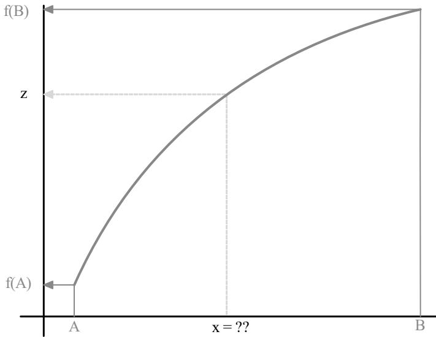

We can put this differently: if $f : \left\lfloor A , B \right\rfloor \longrightarrow \left\lfloor f ( A ) , f ( B ) \right\rfloor$ , can we go backwards to find an inverse function from $| f ( A ) , f ( B ) |$ to $\lfloor A , B \rfloor$ ？

We will show that this is the case when $f$ satisfies left and right Lipschitz conditions, that is,when there exist reals $L$ and $K$ with $0 < L \leq K$ and

$$
L \left( y - x \right) \leq f ( y ) - f ( x ) \leq K \left( y - x \right)
$$

for all $x \le y$ in $\lfloor A , B \rfloor$ .This is our Inverse Function Theorem (IFT). Given $z \in$ $| f ( A ) , B ( A ) |$ ，we will construct a nested (hence consistent） family of subintervals of $\lfloor A , B \rfloor$ using the left-hand inequality. Each of these intervals $\lfloor a , b \rfloor$ will have the property $f ( a ) \leq z \leq f ( b )$ . The right-hand condition guarantees that this family is also fine; hence we can invoke the Completeness Theorem to find some $_ { x }$ which is in all of them. It will turn out that $f ( x ) = z$

After proving the IFT,we will apply it to various elementary functions, the simplest of which are the power functions $x ^ { N }$ . Since these functions all satisfy left and right Lipschitz conditions on finite intervals $0 ~ < ~ \lfloor A , B \rfloor$ (when $N > 0$ )，the IFT guarantees the existence of $N$ th roots on positive finite intervals. This can be extended to intervals $| 0 , B |$ as well.

Next, we can define $A ^ { r } = \left( A ^ { M } \right) ^ { 1 / N } = \left( A ^ { 1 / N } \right) ^ { M }$ for any rational $r = M / N \ge 0$ this can be extended to negative rationals as well. Finally, for a real exponent $_ { x }$ ，we can look at the family of real intervals of the form $\lfloor A ^ { r } , A ^ { s } \rfloor$ ，where $[ r , s ] \in x$ This family turns out to be fine and consistent, so we use completeness again to pick out a real number common to all the intervals in this family. We define this real number to be $A ^ { x }$

The exponential function $A ^ { x }$ constructed in this way satisfies the following Lipschitz condition on $\lfloor c , d \rfloor$ (when $A > 1$ )：

$$
A ^ { c } \left( 1 - { \frac { 1 } { A } } \right) ( y - x ) \leq A ^ { y } - A ^ { x } \leq A ^ { d } ( A - 1 ) ( y - x ) .
$$

This enables us to define the inverse function $\log _ { A } ( x )$

Finally, we will construct the Euler number $^ e$ , and thus obtain the functions $e ^ { x }$ and $\ln ( x )$

Throughout this chapter we will be talking about intervals of various kinds. Here is a catalog.

NOTATION 2.0.1 Types of real intervals:

1. (Closed finite): $x \in \left[ A , B \right] \iff A \leq x \leq B$   
2. (Open finite): $x \in ( A , B ) \iff A < x < B$   
3. (Left open finite): $x \in ( A , B ] \iff A < x \leq B$   
4. (Right open finite): $x \in \lfloor A , B \} \iff A \leq x < B$   
5. (Left infinite closed): $x \in ( \infty , B ] \iff x \leq B$   
6. (Left infinite open): $x \in ( \infty , B ) \iff x < B$   
7. (Right infinite closed): $x \in \left[ A , \infty \right) \iff x \geq A$ .   
8. (Right infinite open): $x \in ( A , \infty ) \iff x > A$

# 2.1 Functions and Inverses

DEFINITION 2.1.1 A real-valued function $f$ is a rule or procedure that defines, for each allowable real number $_ { x }$ ， another real number denoted $f ( x )$ . The collection of allowable numbers $_ { x }$ is called the domain of $f$ .We say that $f$ is defined on the interval $\lfloor A , B \rfloor$ if every number in $\lfloor A , B \rfloor$ is in the domain of $f$

In the general case,a real number $_ x$ will be given as a consistent fine family of rational intervals,and the rule for $f$ must construct from this family a new family defining the real number $f ( x )$ . The most basic functions use algebraic operations, already known to yield real numbers, to construct their values,so we can usually avoid having to work with intervals again. Here are some simple examples.

EXAMPLE 2.1.2(SOME ELEMENTARY FUNCTIONS WE ALREADY KNOW ABOUT)

· Given real numbers $\alpha$ and $\beta$ ， define the affine function $L ( x ) = \alpha x + \beta$ . When $\beta = 0$ and $\alpha = 1$ we have the identity function $f ( x ) = x$ ; when $\alpha = 0$ we have the constant function $L ( x ) = \beta$

. Given real numbers $\alpha , ~ \beta , ~ \gamma , \delta$ , define the fractional-linear function $F$ by

$$
F ( x ) = \frac { \alpha x + \beta } { \gamma x + \delta } .
$$

The (implied) domain here consists of those real numbers $_ x$ for which $\gamma x + \delta$ is a unit (i.e. $\gamma x + \delta > 0$ or $\gamma x + \delta < 0$ ）

· Define the squaring function to be $x ^ { 2 } = x \cdot x$ ; more generally, for $N$ a positive integer, define the Nth power function to be $\scriptstyle x ^ { N } = \underbrace { x \cdot x \cdot \cdot \cdot \cdot \cdot x } _ { N \ f a c t o r s }$

DEFINITION 2.1.3 （INVERSE FUNCTIONS ON INTERVALS） SupPOSe

We say that $g : [ f ( A ) , f ( B ) ] \longrightarrow [ A , B ]$ is an inverse for $f$ if

We say that $f$ and $g$ are inverses of each other if, in addition,

DEFINITION 2.1.4 We write $f : [ A , B ] \longrightarrow I$ if, for each $x \in [ A , B ]$ ， $f \left( x \right) \in I$

1. $f : \lfloor A , B \rfloor \longrightarrow I$ is called surjective (or onto) if, for each $z \in I$ ， there is some $x \in \left[ A , B \right]$ (depending on $z$ ）such that $z = f ( x )$ ·

2. $f : \lfloor A , B \rfloor \longrightarrow I$ is called injective (or 1-to-1） if $f ( x _ { 1 } ) = f ( x _ { 2 } )$ implies that $x _ { 1 } = x _ { 2 }$ ·

The proof of the following facts is a direct consequence of the definitions,and will be left as an exercise.

PROPOSITION 2.1.5 Suppose $f : \left\lfloor A , B \right\rfloor \longrightarrow \mathbb { R }$

1.If $f : [ A , B ] \longrightarrow [ f ( A ) , f ( B ) ]$ and $g$ is an inverse for $f$ ，then $f$ is surjective and $g$ is injective.

2.If $f ( A ) \leq f \left( B \right)$ and $f$ and $g$ are inverses of each other, then $f : [ A , B ] \longrightarrow$ $| f ( A ) , f ( B ) |$ ，and both $f$ and $g$ are injective and surjective (1-to-1 and onto).

A $B$ ExAMPLE 2.1.6 $f ( x ) = 1 - | 1 - x |$ on the interual $\widehat { | \mathrm { ~ 0 ~ , ~ } 3 / 2 | }$ Then $f ( 0 ) = 0 <$ $f ( A ) \quad f ( B )$ $1 / 2 \ = \ f ( 3 / 2 )$ . The function $g ( z ) ~ = ~ z$ on the interval $\widehat { \Gamma ^ { 0 } \mathrm { ~ , ~ } 1 / 2 } ]$ is an inverse for $f$ .Note that $f$ is surjective but not injective, since $f \left( 1 / 2 \right) = f \left( 3 / 2 \right)$ ， while $g : | 0 , 1 / 2 | \longrightarrow | 0 , 3 / 2 |$ is injective but not surjective.

We will be interested in finding some conditions that will guarantee that a function, defined on some interval $\lfloor A , B \rfloor$ , has an inverse.

Some functions can be inverted simply by solving for $_ { x }$ .For example, for the fractional-linear function $\frac { \alpha x + \beta } { \gamma x + \delta }$ ， we can write $\begin{array} { r } { y = \frac { \alpha x + \beta } { \gamma x + \delta } } \end{array}$ and find that $\begin{array} { r } { x = \frac { \delta y - \beta } { - \gamma y + \alpha } } \end{array}$ (with appropriate domains). In general, though,we will have to make some sort of assumptions to guarantee that,for each allowable real number $z$ lying in some interval,we can find an $_ { x }$ in the domain of $f$ such that $f ( x ) = z$ ； furthermore,we want to avoid the possibility that there might be more than one such $_ { x }$ ，since that will complicate our task of finding the right one. So,it will be useful to make sure that $f ( x _ { 1 } ) = f ( x _ { 2 } )$ implies that $x _ { 1 } = x _ { 2 }$ ． Also,for reasons that will become clear when you see how the construction unfolds,we want $f ( x _ { 1 } )$ and $f ( x _ { 2 } )$ to be close when $x _ { 1 }$ and $x _ { 2 }$ are close.

One way to meet these conditions on $f$ is to assume that $f$ satisfies Lipschitz conditions.1

DEFINITION 2.1.7（LIPSCHITZ CONDITIONS） SuPpOse that $f$ is defined on the in-terval $\lfloor A , B \rfloor$

1. The function $f$ satisfies a left Lipschitz condition if there is a real number $L > 0$ such that $L \cdot ( y - x ) \leq f ( y ) - f ( x )$ for all $A \leq x \leq y \leq B$   
2. The function $f$ satisfies a right Lipschitz condition if there is a real number $K > 0$ such that $f ( y ) - f ( x ) \leq K \cdot ( y - x )$ for all $A \leq x \leq y \leq B$   
3. $f$ satisfies a two-sided Lipschitz condition if it satisfies both left and right conditions with $L \leq K$

Please note that Lipschitz conditions aren't unique,and don't have to be the best possible. Consider the function $f ( x ) = x ^ { 3 } + 2 x + 1$ on the interval $\lfloor 0 , 2 \rfloor$ We can write

$$
{ \begin{array} { l l l } { f ( y ) - f ( x ) } & { = } & { \left( y ^ { 3 } + 2 y + 1 \right) - \left( x ^ { 3 } + 2 x + 1 \right) } \\ & { = } & { \left( y ^ { 3 } - x ^ { 3 } \right) + 2 ( y - x ) } \\ & { = } & { ( y - x ) ( y ^ { 2 } + x y + x ^ { 2 } ) + 2 ( y - x ) } \\ & { = } & { ( y ^ { 2 } + x y + x ^ { 2 } + 2 ) ( y - x ) . } \end{array} }
$$

For $_ x$ and $y \mathrm { i n }$ the interval $\lfloor 0 , 2 \rfloor$ ， $y ^ { 2 } + x y + x ^ { 2 } + 2$ is never bigger than 14 nor less than 2,so $f$ satisfies the Lipschitz conditions:

$$
2 ( y - x ) \leq f ( y ) - f ( x ) \leq 1 4 ( y - x ) .
$$

Onthe otherditi ${ \frac { 3 } { 2 } } ( y - x ) \leq f ( y ) - f ( x ) \leq 1 5 ( y - x )$ . In fact,if $0 < L \leq 2$ and $1 4 \leq K$ ,then $f$ also satisfies $L \cdot ( y - x ) \leq f ( y ) - f ( x ) \leq K \cdot ( y - x )$ If $f$ satisfies a two-sided Lipschitz condition we can deduce two important facts:

· $f \left( x \right) \leq f \left( y \right)$ when $x \leq y$ and $f \left( x \right) < f \left( y \right)$ when $x < y$ （ $f$ is strictly increasing). · $f ( y ) - f ( x ) \leq K \cdot \delta$ when $| y - x | \leq \delta$

These are easy exercises.

We are now ready to find inverses.

# Exercises

1. Find Lipschitz conditions for the function $P ( x ) = 2 x ^ { 2 } - 3 x + 4$ on the interval [1,3].

2. Show that the squaring and cubing functions satisfy left and right Lipschitz condition on any interval $\lfloor A , B \rfloor$ with $0 < A \le B$ .To find them,note that $y ^ { 2 } - x ^ { 2 } = ( y + x ) ( y - x )$ and $y ^ { 3 } - x ^ { 3 } = ( y ^ { 2 } + y x + x ^ { 2 } ) ( y - x )$ . Now see how big or small $( y + x )$ and $( y ^ { 2 } + y x + x ^ { 2 } )$ can be on the interval $\lfloor A , B \rfloor$

3.Prove that neither the squaring nor cubing functions can satisfy a left Lipschitz condition on any interval containing O. (Hint: Use the factorizations of the previous exercise; show that $x + y$ (resp. $x ^ { 2 } + x y + y ^ { 2 } )$ can be made arbitrarily small while $y - x > 0$ . You can let $x = 0$ for simplicity.） Can either function satisfy a right Lipschitz condition on such an interval?

4. Show that the function $w ( x ) = \frac { x ^ { 2 } } { 1 + x }$ satisfies a two-sided Lipschitz conditions on every interval $\lfloor A , B \rfloor$ where $A > 0$

5.If $f$ satisfies a left Lipschitz condition, prove that $f \left( x \right) \leq f \left( y \right)$ when $x \le y$ and $f \left( x \right) < f \left( y \right)$ when $x < y$ .(That is, $f$ is strictly increasing). Prove also that $f ( x ) = f ( y )$ implies $x = y$ (so $f$ is 1-to-1). Think of this as a cancellation law: in a certain sense we can cancel $f$ from the equation $f \left( x \right) = f \left( y \right)$

6. The left Lipschitz condition says that a function “can’t grow too slowly"； explain. Suppose the function also satisfies a right Lipschitz condition: then it “can't grow too rapidly.” Explain.

7. Find an interval and Lipschitz conditions for the function $h ( x ) = 7 - 3 0 x +$ $3 3 x ^ { 2 } - 4 x ^ { 3 }$ on that interval.(Hint:This is tricky. It may help to write $y ^ { 2 } + y x + x ^ { 2 }$ as $( y + x ) ^ { 2 } - x y$ and let $u = y + x$ .）

8. Assume $f$ and $g$ satisfy Lipschitz conditions $L _ { f } \cdot ( y - x ) \leq f ( y ) - f ( x ) \leq$ $K _ { f } \mathbf { \nabla } \cdot ( y - x )$ and $L _ { g } \cdot ( y - x ) \leq g ( y ) - g ( x ) \leq K _ { g } \cdot ( y - x )$ on an interval $\lfloor A , B \rfloor$

(a）Find Lipschitz conditions for the functions $f + g$ and $\lambda f$ （ $\lambda > 0$ a constant).   
(b） Find Lipschitz conditions for the composition $f \circ g$ , assuming it is defined.   
(c) Suppose $f$ and $g$ are positively bounded on $\lfloor A , B \rfloor$ ，meaning that there are constants such that $0 < S _ { f } \leq f ( x ) \leq T _ { f }$ ， $0 < S _ { g } \le g ( x ) \le T _ { g }$ .Find Lipschitz conditions for the product $f g$ (Hint: Add and subtract $f ( x ) g ( y )$ when looking at $f ( y ) g ( y ) - f ( x ) g ( x ) )$

9.Suppose that $f$ satisfies a two-sided Lipschitz condition on $\lfloor A , B \rfloor$ . Prove that $| f ( y ) - f ( x ) | \leq K \cdot | y - x |$ for all $x , y \in \left\lfloor A , B \right\rfloor$ (with no assumptions on the relative sizes of $_ { x }$ and $_ y$ ). (Hint: Use the fact that $x \leq y$ and $y \le x$ can't both be ruled out—see Remark 1.5.36.)

# 2.2An Inverse Function Theorem

THEOREM 2.2.1 (INVERSE FUNCTION THEOREM） SuppOse the function $f$ is defined on the interval $\lfloor A , B \rfloor$ ，and that for some constants $K , L$ with $0 < L \le K$ ， we have the two-sided Lipschitz condition

$$
L ( y - x ) \leq f ( y ) - f ( x ) \leq K ( y - x )
$$

whenever $A \leq x \leq y \leq B$ . Then we can define a function $g : \lfloor f ( A ) , \ f ( B ) \rfloor \to \lfloor A , B \rfloor$ such that $f \left( g ( z ) \right) = z$ and the Lipschitz condition

$$
\frac 1 K ( w - z ) \leq g ( w ) - g ( z ) \leq \frac 1 L ( w - z )
$$

is satisfied for all $f ( A ) \leq z \leq w \leq f ( B )$

A naive proof of this theorem,using bisection,would proceed as follows. Start with the interval $\left\lfloor a _ { 0 } , b _ { 0 } \right\rfloor \ = \ \left\lfloor A , B \right\rfloor$ and construct a sequence of nested intervals $\left\lfloor a _ { 0 } , b _ { 0 } \right\rfloor \supset \cdots \supset \left\lfloor a _ { k - 1 } , b _ { k - 1 } \right\rfloor \supset \left\lfloor a _ { k } , b _ { k } \right\rfloor \supset \cdots$ ，with $f ( a _ { k } ) \leq z \leq f ( b _ { k } )$ We would construct these recursively, that is,using the one already found to find the next. So suppose that $\left\lfloor a _ { k } , b _ { k } \right\rfloor$ has been defined with $z$ lying between $f ( a _ { k } )$ and $f ( b _ { k } )$ Let $_ { m }$ be its midpoint (i.e. $m = ( a _ { k } + b _ { k } ) / 2 )$ ，and look at $f ( m )$ If $z \leq f ( m )$ ， then $f ( a _ { k } ) \leq z \leq f ( m )$ ，s0 $f ^ { - 1 } ( z )$ would lie between $a _ { k }$ and $_ { m }$ (we are assuming $f$ is increasing;i.e.if $x \ \leq \ y$ then $f \left( x \right) \leq f \left( y \right) \rangle$ .In this case,we would choose the next interval $[ a _ { k + 1 } , b _ { k + 1 } ]$ to be $\lfloor a _ { k } , m \rfloor$ . On the other hand, if $f ( m ) \leq z$ ，then $f ( m ) \leq z \leq f ( b _ { k } )$ ， so we would choose $\left\lfloor a _ { k + 1 } , b _ { k + 1 } \right\rfloor = \left\lfloor m , b _ { k } \right\rfloor$ . Each of the intervals $\lfloor a _ { k } , m \rfloor$ ， $[ m , b _ { k } ]$ have half the length of $\left[ a _ { k } , b _ { k } \right]$ . Repeating this process yields a nested (hence consistent） family of real intervals,each one-half the length of the previous one. By the Completeness Theorem, this family would have a limit which we call $g ( z )$ , our candidate for $f ^ { - 1 } ( z )$

There is only one thing wrong with this approach: it may not be possible to determine the relative sizes of $f ( m )$ and $z$ because it is not always possible to compare two reals in this way. This is a very“real” problem in implementing a bisection method of this type on a computer. It may turn out that to a thousand binary or decimal places, $f ( m )$ and $z$ are equal—possibly as a result of rounding errors. Even worse,differences in algorithms or rounding errors may produce,in the thousandth place, $f ( m ) < z$ when,in fact, $f ( m ) > z$ . We are careful to avoid this problem in the proof that follows.

We first prove the following useful lemma.

LEMMA 2.2.2 If $x \in I = \lfloor r , s \rfloor$ and $z \in J = \lfloor u , v \rfloor$ where $I$ and $J$ are intersecting real intervals, then

$$
| z - x | \leq \ell ( I ) + \ell ( J ) .
$$

Proof. Intuitively, since $I$ and $J$ intersect, the widest interval they can span occurs when they meet at just one endpoint:

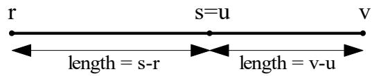

Here's the formal argument. Since $r \leq x \leq s$ and $u \leq z \leq v$ ， $( z - v ) + ( r - x ) \leq 0$ Thus

$$
\begin{array} { l l l } { z - x } & { \le } & { v - r = v - ( u - u ) - r + ( s - s ) } \\ & { = } & { ( v - u ) + ( s - r ) + ( u - s ) } \\ & { \le } & { \ell ( J ) + \ell ( I ) } \end{array}
$$

since $u - s \leq 0$ (because $I$ and $J$ intersect). Starting with $x - z$ instead of $z - x$ ，a similar argument shows that $x - z \leq \ell ( I ) + \ell ( J )$ S0 $- \ell ( I ) - \ell ( J ) \leq z - x$ and we are done (by Proposition 1.5.26).■

Proof of the Inverse Function Theorem.The proof will use a variation of the bisection method. We will want to trap $z$ in the images of smaller and smaller subintervals of $\lfloor A , B \rfloor$ . To do that,we will have to make comparisons of $z$ and $f ( m )$ ， where $_ { m }$ is a midpoint of one of these subintervals. Since the real numbers $z$ and $f ( m )$ are families of rational intervals,we will need to use a comparison scheme that exploits this representation. It turns out that using a kind of “threefold"bisection does the job:we will look at the images of the left half, the right half,and the middle half of subintervals of $\lfloor A , B \rfloor$

Suppose $f ( A ) \leq z \leq f ( B )$ and let $I _ { 0 } ( z ) = \lfloor a _ { 0 } , b _ { 0 } \rfloor = \lfloor A , B \rfloor$ .Suppose that $I _ { 0 } ( z ) \supset I _ { 1 } ( z ) \supset \cdots \supset I _ { n } ( z ) = [ a _ { n } , b _ { n } ]$ have already been defined, with

$$
\begin{array} { r c l } { { f ( a _ { n } ) } } & { { \leq } } & { { z \leq f ( b _ { n } ) } } \\ { { } } & { { } } & { { } } \\ { { \ell \left( I _ { j + 1 } \right) } } & { { = } } & { { { \frac { 1 } { 2 } } \ell \left( I _ { j } \right) . } } \end{array}
$$

We will now construct $I _ { n + 1 }$

For simplicity of notation, let $a = a _ { n }$ and $b = b _ { n }$ .Take $m = ( a + b ) / 2$ ， $p =$ $( 3 a + b ) / 4$ ，and $q = ( a + 3 b ) / 4$ . Consider the intervals $\lfloor a , m \rfloor$ ， $\lfloor m , b \rfloor$ and $[ p , q ]$ ，each with length $\ell ( \lfloor a , b \rfloor ) / 2$ . These are the left, right and middle halves of the interval $[ a , b ]$ We can now look at the images of these intervals under $f$ ， $\left\lfloor f ( a ) , f ( m ) \right\rfloor$ ， $\lfloor f ( m ) , f ( b ) \rfloor$ and $\left\lfloor f ( p ) , f ( q ) \right\rfloor$ , and ask: “In which one does $z$ lie?” Here's a picture:

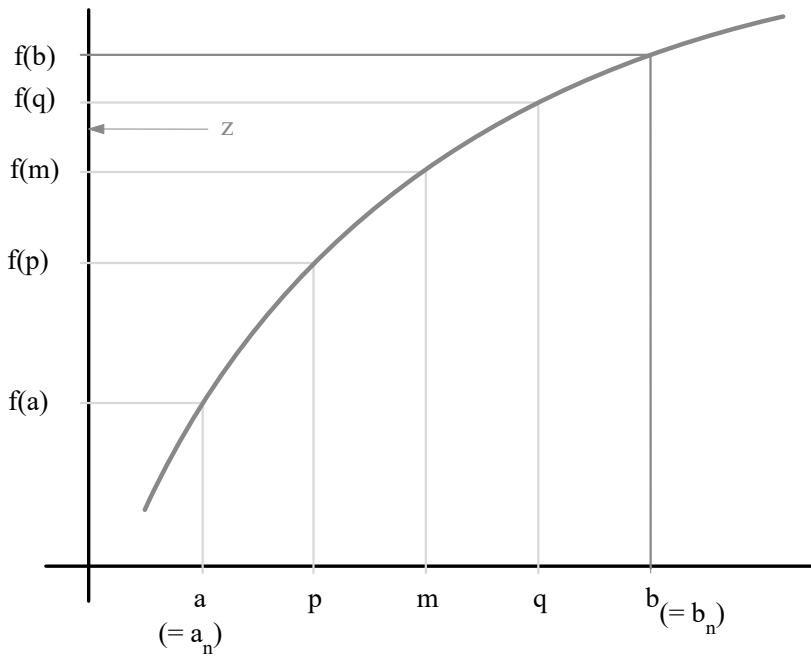

To make this determination,let's suppose that $I$ is a rational interval in the family of the real number $f ( m )$ and $J$ is a rational interval in the real $z$ .For the moment,let these intervals be arbitrary (we'll place some length restrictions on them shortly). Since $I$ and $J$ have rational endpoints,we can compare them,with only three possible results. If $I < J$ ，then $f ( m ) < z$ ；if $I > J$ ,then $f ( m ) > z$ . The third possibility is that $I$ and $J$ intersect. This case leads to the following diagram.

What parts of this diagram can we actually verify? Because of the left Lipschitz condition, $f$ is non-decreasing,so the relative placement of $f ( a )$ ， $f ( \boldsymbol p )$ ， $f ( m )$ ， $f ( q )$ ， and $f ( b )$ is correct.The diagram also correctly reflects the assumptions that $I$ and $J$ intersect and that $I$ is an interval of $f ( m )$ . Since we are looking for a subinterval of $\lfloor a , b \rfloor$ whose image under $f$ contains $z$ , the diagram suggests that $\left\lfloor p , q \right\rfloor$ will work if we can guarantee that $z$ is sufficiently close to $f ( m )$ . Can we make this happen by choosing the lengths of $I$ and $J$ small enough? Here's where the lemma we just proved helps.It tells us that $z$ and $f ( m )$ can't differ by more than $\ell ( I ) + \ell ( J )$ .On the other hand, $f ( \boldsymbol p )$ and $f ( q )$ can't be too close to $f ( m )$ because of the left Lipschitz condition:

$$
f ( m ) - f ( p ) \geq L \cdot { \frac { b - a } { 4 } } > 0
$$

and

$$
f ( q ) - f ( m ) \geq L \cdot \frac { b - a } { 4 } > 0 .
$$

The distance between either $f ( \boldsymbol p )$ or $f ( q )$ and $f \left( m \right)$ is at least $\epsilon = L \cdot { \frac { b - a } { 4 } }$ Since $I$ and $J$ come from fine families,we can assume that they satisfy $\ell ( I ) + \ell ( J ) < \epsilon$ ,S0 we have $| z - f ( m ) | \leq \epsilon$ . Putting our inequalities together, we have

$$
f ( p ) \leq f ( m ) - \epsilon \leq z \leq f ( m ) + \epsilon \leq f ( q ) .
$$

Thus $f ( p ) \leq z \leq f ( q )$

In summary, here is the definition of $I _ { n + 1 }$ ， assuming that $I _ { n } ( z ) ~ = ~ \lfloor a , b \rfloor$ has already been constructed and that we have chosen intervals $I \in f ( m )$ and $J \ \in \ z$

with $\ell ( I ) + \ell ( J ) < \epsilon = L \cdot { \frac { b - a } { 4 } }$ ：

$$
I _ { n + 1 } = { \left\{ \begin{array} { l l } { [ m , b ] } & { { \mathrm { i f ~ } } I < J , } \\ { [ a , m ] } & { { \mathrm { i f ~ } } I > J , } \\ { [ p , q ] } & { { \mathrm { i f ~ } } I { \mathrm { ~ a n d ~ } } J { \mathrm { ~ i n t e r s e c t . } } } \end{array} \right. }
$$

Note that for each $k$ we have $\ell ( I _ { k } ) = ( B - A ) / 2 ^ { k }$

Let $\Sigma ( z , f ) = \{ I _ { k } : k = 0 , 1 , 2 , \ldots \}$ . This is a family of nested intervals containing arbitrarily small ones,so it is consistent and fine.Applying the Completeness Theorem, define $g ( z ) = \operatorname* { l i m } { \Sigma ( z , f ) }$

Then $g ( z )$ is a real number such that for each $k$ ，

$$
a _ { k } \leq g ( z ) \leq b _ { k } .
$$

Hence

$$
f ( a _ { k } ) \leq f ( g ( z ) ) \leq f ( b _ { k } ) .
$$

By construction, we also have

$$
f ( a _ { k } ) \leq z \leq f ( b _ { k } ) .
$$

Thus,both $f ( g ( z ) )$ and $z$ lie in each interval $\lfloor f ( a _ { k } ) , f ( b _ { k } ) \rfloor$ . These intervals are arbitrarily fine because

$$
f ( b _ { k } ) - f ( a _ { k } ) \leq K \cdot ( b _ { k } - a _ { k } ) = K \cdot ( B - A ) / 2 ^ { k } .
$$

(Here is where we finally use the right Lipschitz condition!） By Proposition 1.7.7 on the uniqueness of limits,we can conclude that $f ( g ( z ) ) = z$

Now we will verify that inequalities $( * * )$ hold. We know that $g ( w )$ and $g ( z )$ are both in $\lfloor A , B \rfloor$ . We know that $g ( w ) \geq g ( z )$ because if $g ( w ) < g ( z )$ ， we would have $0 < L \cdot ( g ( z ) - g ( w ) ) \leq f ( g ( z ) ) - f ( g ( w ) ) = z - w$ or $z > w$ ，which contradicts the assumption.Therefore,since $A \leq g ( z ) \leq g ( w ) \leq B$ ，we get

$$
0 \leq L \cdot ( g ( w ) - g ( z ) ) \leq f ( g ( w ) ) - f ( g ( z ) ) = w - z \leq K \cdot ( g ( w ) - g ( z ) ) .
$$

From $L \cdot ( g ( w ) - g ( z ) ) \leq w - z$ we get $g ( w ) - g ( z ) \leq \frac { 1 } { L } ( w - z )$ , and from the last inequality we get $\cfrac 1 K ( w - z ) \leq g ( w ) - g ( z )$ . Thus we have established our Lipschitz conditions for $g$

It is possible to give a somewhat shorter proof of this construction using $\epsilon$ -Trichotomy (Proposition 1.6.9)—see the exercises.

COROLLARY 2.2.3 In the Inverse Function Theorem, it is also true that, for any $x \in \left[ A , B \right]$ ， $g ( f ( x ) ) = x$

Proof. Exercise ■

As we have noted, the left Lipschitz condition implies that the function is nondecreasing. There is a version of the Inverse Function Theorem for decreasing functions. Here the Lipschitz constants are negative,but everything else is pretty much the same.

THEOREM 2.2.4 (INVERSES OF DECREASING FUNCTIONS） SuppOSe the real-valued function $f$ is defined on the interval $\lfloor A , B \rfloor$ and that for some constants $K ^ { \prime } , L ^ { \prime }$ with $L ^ { \prime } \leq K ^ { \prime } < 0$ ， we have the two-sided Lipschitz condition

$$
L ^ { \prime } ( y - x ) \le f ( y ) - f ( x ) \le K ^ { \prime } ( y - x )
$$

whenever $A \leq x \leq y \leq B$ . Then we can define a function $g : | f ( B )$ ， $f ( A ) |  \lfloor A , B \rfloor$ such that $f \left( g ( z ) \right) = z$ and the Lipschitz condition

$$
\frac { 1 } { K ^ { \prime } } ( w - z ) \leq g ( w ) - g ( z ) \leq \frac { 1 } { L ^ { \prime } } ( w - z )
$$

is satisfied for all $f ( B ) \leq z \leq w \leq f ( B )$

Proof. There are two ways to prove this. The most straightforward is to go back through the proof of the usual IFT(Theorem 2.2.1 above） and make the slight changes necessary to make it work under these new Lipschitz conditions. On the other hand, it is annoying to have to do all this work over again. Fortunately, there is a trick.Note that the function $- f$ is increasing,and satisfies the conditions of the usual IFT.Finding an inverse for $- f$ yields an inverse for $f$ . The details are left as one of the exercises at the end of this section.■

When $n > 0$ , we can apply the Inverse Function Theorem to find $_ { n }$ th roots. The following algebraic lemma and corollary,easily proved by induction, establish the necessary Lipschitz conditions.

LEMMA 2.2.5 For all $x , y \in \mathbb { R }$ and $n \in \mathbb N$ ，

$$
y ^ { n } - x ^ { n } = \left( \sum _ { i = 0 } ^ { n - 1 } y ^ { i } x ^ { n - 1 - i } \right) ( y - x )
$$

COROLLARY 2.2.6 If $0 < A \leq x \leq y \leq B$ then

$$
n A ^ { n - 1 } ( y - x ) \leq y ^ { n } - x ^ { n } \leq n B ^ { n - 1 } ( y - x ) .
$$

The role of this lemma and corollary and further details about $_ { n }$ th roots are discussed in the exercises.

Note that $K$ and $L$ are not allowed to be $0$ in Lipschitz conditions.If you look through the proof of the IFT you can see why $K = 0$ ， for example, is not useful. Nevertheless, the squaring function, for example, does have the square root function as an inverse on any interval $| 0 , B |$ . However, the square root does not satisfy any Lipschitz condition of the form ${ \sqrt { y } } - { \sqrt { x } } \leq K ( y - x )$ on any interval containing 0. You can see this easily by letting $x = 0$ in such a relation and noting that ${ \sqrt { y } } / y$ can't be bounded by any $K$ on an interval $| 0 , B |$ ．Thus,we have to modify the statement of the IFT and its proof, slightly, to deal with intervals containing 0. We will state the results here,but leave their proofs as exercises.

THEOREM 2.2.7 (IFT: ONE-SIDED CASE） Suppose that $f$ is defined on the interval $| 0 , B |$ with $f ( 0 ) = 0$ and $f ( B ) = D > 0$ . Suppose also that for each $A$ with $0 < A \leq$ $B$ ， we have a number $L _ { A } > 0$ (depending on $A$ ）such that

$$
L _ { A } \cdot ( y - x ) \leq f ( y ) - f ( x ) \quad f o r \ a l l \ A \leq x \leq y \leq B
$$

and another number $K > 0$ such that

$$
f ( y ) - f ( x ) \leq K \cdot ( y - x ) \quad f o r \ a l l \ 0 \leq x \leq y \leq B .
$$

Then we can define a function $g : [ 0 , D ] \to [ 0 , B ]$ such that for each $z \in \left[ 0 , D \right]$ ， $f ( g ( z ) ) = z$ . Furthermore, $g$ will satisfy Lipschitz conditions on all intervals of the form $\lfloor P , D \rfloor$ where $0 < P \le D$ and $C \leq - Q < 0$

THEOREM 2.2.8 (IFT: TWO-SIDED CASE） Suppose that $A < 0 < B$ and that $f$ is defined on the interval $[ A , B ]$ with $F ( A ) = C$ ， $f ( B ) = D$ and $f ( 0 ) = 0$ . Suppose also that for each $0 < E \le B$ , we have a number $L _ { E } > 0$ (depending on $E$ ）with

$$
L _ { E } \cdot ( y - x ) \leq f ( y ) - f ( x ) \ f o r \ a l l \ E \leq x \leq y \leq B
$$

and, for each $A \leq F < 0$ ， a number $L _ { F } ^ { \prime }$ (depending on $F$ ）with

Finally, suppose that there is a $K > 0$ with

$$
f ( y ) - f ( x ) \leq K \cdot ( y - x ) \ f o r \ a l l \ A \leq x \leq y \leq B .
$$

Then we can define a function $g : [ C , D ] \to [ A , B ]$ such that for each $z \in | C , D |$ ， $f ( g ( z ) ) = z$ . Furthermore, $g$ will satisfy Lipschitz conditions on all interuals of the form $\left\lfloor P , D \right\rfloor$ or $\left[ C , - Q \right]$ where $0 < P \le D$ and $C \leq - Q < 0$

Applying the one-sided case of IFT to evenpower functions,we see that their inverses,even roots,are defined on intervals $| 0 , B |$ . The two-sided case shows that odd roots are defined on anyinterval. The details of these applications of the IFT to general $_ { n }$ th powers we leave for the exercises.

DEFINITION $2 . 2 . 9 _ { \_ } \sqrt { }$ ，or $( ~ ) ^ { \frac { 1 } { n } }$ , is the inverse of the function $( ~ ) ^ { n }$ . When n is odd, this function is defined on any interval; when $_ n$ is even it is defined only on intervals $\lfloor A , B \rfloor$ with $A \geq 0$

# Exercises

1. We know from the last set of exercises that squaring and cubing satisfy Lipschitz conditions on any finite interval $\lfloor A , B \rfloor$ with $A > 0$ ．Use this to show that any number $C > 0$ has a square root and a cube root.To do, this you'll need to show that there are always positive real numbers $A$ and $B$ such that $A ^ { 2 } \le C \le B ^ { 2 }$ . (Hint: $A = \operatorname* { m i n } ( C , 1 )$ and $B = \operatorname* { m a x } ( C , 1 )$ should work. Explain why.)

2. We know from the last set of exercises that squaring and cubing satisfy Lipschitz conditions on any finite interval $\lfloor A , B \rfloor$ with $A > 0$ .What does the Inverse Function Theorem say about the Lipschitz conditions satisfied by √ and on an interval $| C , D |$ with $0 < C \le D$ ? Be careful in answering this question，since the Inverse Function Theorem as stated gives the Lipschitz conditions for the inverse $g$ in terms of $_ { x }$ and $_ y$ , lying in $\lfloor A , B \rfloor$ ,the interval for the original function $f$ . Now you want to express the Lipschitz conditions for the inverse function (here the root function) in terms of variables $w$ and $z$ lying in some $| C , D |$ . Thus,you'll have to find the corresponding $A$ and $B$ in terms of $C$ and $D$ in order to apply the IFT. The preceding exercise should be helpful.

3. More generally, prove that for all $x , y \in \mathbb { R }$ and $n \in \mathbb N$ ，

$$
y ^ { n } - x ^ { n } = \left( \sum _ { i = 0 } ^ { n - 1 } y ^ { i } x ^ { n - 1 - i } \right) ( y - x ) .
$$

(Hint: Induction is a good method). Discuss how this result gives us Lipschitz conditions for general $n$ th power functions on intervals $\lfloor A , B \rfloor$ with $A > 0$

4.Apply exercise 3 above to show that any number $C > 0$ has an $_ { n }$ th root；see the hint in exercise 1 above.

5.Apply the Inverse Function Theorem to deduce the existence of $_ { n }$ th roots on intervals $| C , D |$ ，with $0 < C \le D$ . Give the Lipschitz conditions satisfied by $_ { n }$ th roots on this interval in the form $L \cdot ( w - z ) \leq \sqrt [ n ] { w } - \sqrt [ n ] { z } \leq K \cdot ( w - z )$ ， where $L$ and $K$ are expressed in terms of $C$ and $D$ . The previous exercise will be helpful.

6.Redo the previous two exercises in light of the one- and two-sided cases of the Inverse Function Theorem (see Theorems 2.2.7 and 2.2.8).

7.Let $A _ { 1 } , A _ { 2 } , . . . , A _ { n }$ be positive real numbers,and define the following.

(a) The arithmetic mean: $A = { \frac { A _ { 1 } + A _ { 2 } + \cdots + A _ { n } } { n } }$ (b) The geometric mean: $G = \sqrt [ n ] { A _ { 1 } \cdot A _ { 2 } \cdot \cdot \cdot \cdot \cdot A _ { n } }$

(c) The harmonic mean:

$$
H = { \frac { 1 } { { \frac { 1 } { n } } \left( { \frac { 1 } { A _ { 1 } } } + { \frac { 1 } { A _ { 2 } } } + \cdot \cdot \cdot + { \frac { 1 } { A _ { n } } } \right) } } = { \frac { n } { { \frac { 1 } { A _ { 1 } } } + { \frac { 1 } { A _ { 2 } } } + \cdot \cdot \cdot + { \frac { 1 } { A _ { n } } } } }
$$

Prove that $A \geq G \geq H$ . (Hint: Look at exercise 10 on page 55.)

8.Give a shorter proof of the Inverse Function Theorem by making use of $\epsilon$ Trichotomy (Proposition 1.6.9): compare $z$ with $f ( m )$ , taking $\epsilon = L \cdot ( b - a ) / 4$

9.Prove Theorem 2.2.4, the IFT for decreasing functions,using the trick of replacing the decreasing function $f$ by the increasing function $- f$ .Note the new Lipschitz conditions you get,and figure out how the inverse $g$ for $- f$ can be used to get an inverse for $f$

10.(Technical) Prove the One-sided and Two-sided versions of the Inverse Function Theorem (Theorems 2.2.7 and 2.2.8). Here is a sketch of the more difficult twosided case,using $\epsilon$ -Trichotomy. (Make sure you understand the proof of IFT before trying this variation; doing exercise 8 first is a good idea).

Proof. Suppose $A < 0 < B$ .Let $L ^ { \prime } ( F )$ be the left Lipschitz constant on $\lfloor A , F \rfloor$ and let $L ( E )$ be the left Lipschitz constant on $\lfloor E , B \rfloor$ . Divide $\lfloor A , 0 \rfloor$ into fourths $( A , 3 A / 4 , A / 2 , A / 4 , 0 )$ and divide $| 0 , B |$ into fourths $( 0 , B / 4 , B / 2 , 3 B / 4 , B )$ Use $\epsilon$ -Trichotomy:first let $\epsilon ^ { \prime } = L ^ { \prime } ( A / 4 ) \cdot ( A / 4 )$ If $z ~ < ~ f ( A / 2 )$ ，the next interval is $\lfloor A , A / 2 \rfloor$ .If $z$ is within $\epsilon ^ { \prime }$ of $f ( A / 2 )$ , the next interval is $\lfloor 3 A / 4 , A / 4 \rfloor$ If $z ~ > ~ f ( A / 2 )$ let $e \ = \ L ( B / 4 ) \cdot ( B / 4 )$ ，and apply $\epsilon$ -trichotomy again.If $z > f ( B / 2 )$ ,the next interval is $\lfloor B / 2 , B \rfloor$ ；if $z$ within $\epsilon$ of $f ( B / 2 )$ ，the next interval is $\lfloor B / 4 , 3 B / 4 \rfloor$ .Finally, if $z < f ( B / 2 )$ , the next interval is $\lfloor A / 2 , B / 2 \rfloor$ Note that in all cases save the very last,we are reduced to the standard construction from IFT, since we have Lipschitz conditions on the full interval. In the last case we repeat these steps since $A / 2 < 0 < B / 2$

11. Suppose we know the basic facts from calculus about $\exp ( x ) = e ^ { x }$ and $\ln ( x )$ ， namely that $\textstyle \ln ( x ) = \int _ { 1 } ^ { x } ( 1 / t ) d t$ s0 $\ln ( y ) - \ln ( x ) = \textstyle \int _ { x } ^ { y } ( 1 / t ) d t$ and that $\exp ( x )$ is the inverse of $\ln ( x )$ .Also suppose we know that the integral of a function is bounded below (resp.above） by the product of the length of the interval of integration with the smallest (resp. biggest） value of the function on the interval.(Draw a diagram to see that this makes sense.） Use this to find Lipschitz conditions on the logarithm over a finite interval $\lfloor A , B \rfloor$ ， $0 < A \le B$ ， then find Lipschitz conditions on the exponential function over an interval $| C , D | = \left\lfloor \ln A , \ln B \right\rfloor$ . We will discuss the calculus of these functions in more detail in Section 6.2. Inequalities for ln (and similar ones for $\log _ { A }$ ）will be derived in the next section without using calculus (see page 97).

12. Consider the function $f ( x ) = x ^ { 2 }$

(a) Find a Lipschitz condition for $f$ on the interval $D = [ . 8 3 2 , . 8 3 3 ]$   
(b） Because of this condition, we know that $f$ has an inverse on this interval. It is,of course, the square root function. Now recall the assignment where you worked with the real number called “ $\mathrm { l n } 2 ^ { \circ }$ (see page 42). Verify that $\ln 2 \in f ( D ) = D ^ { 2 } = [ . 8 3 2 ^ { 2 } , . 8 3 3 ^ { 2 } ]$ . Do this by finding a small enough rational interval bracketing $\ln { 2 }$ and contained in $D ^ { 2 }$   
(c） The proof of the Inverse Function Theorem describes how to find a rational subinterval $E \subset D$ having length half that of $D$ such that $\ln 2 \in E ^ { 2 }$ .Go through the details of finding this subinterval and find it.

You will need to compute some very small intervals in $\ln { 2 }$ to do the above, so the following outline of a computer program may be helpful if you haven't done much programming. This will ask you for $K$ and then compute the left and right endpoints of the $K$ th interval of $\ln { 2 }$

<table><tr><td>input K 0-&gt;S</td></tr><tr><td>For N= 1 to K do begin S +1/(2*N-1) -&gt; S S - 1/(2*N) -&gt; S</td></tr><tr><td>end output S REMLeft endpoint output S+1/(2*K+1) REM Right endpoint</td></tr></table>

# 2.3 The Exponential Function

We need to define $A ^ { x }$ for real numbers $_ x$ and $A$ ,with $A > 0$ . We already know how to define $A ^ { n }$ for $n \in \mathbb N$ (the natural numbers), since this is just repeated multiplication, so our next step is to extend this to $n \in \mathbb { Z }$ (the integers).Once we have $A ^ { n }$ for integer exponents,we'll extend the definition to rational exponents, then finally to real exponents (via the Completeness Theorem） by looking at the family of real intervals $\lfloor A ^ { r } , A ^ { s } \rfloor$ ，where $\lfloor r , s \rfloor$ varies over the rational intervals in the real number $_ { x }$

DEFINITION 2.3.1 Let $A$ be a positive real number and n an integer. Then

1. $A ^ { 0 } = 1$   
2.For $n > 0 , \ A ^ { n + 1 } = A \cdot A ^ { n }$   
3.For $n < 0$ ， $A ^ { n } = 1 / \left( A ^ { - n } \right) = 1 / \left( A ^ { | n | } \right)$

PROPOSITION 2.3.2（LAWS OF EXPONENTS FOR INTEGERS） GiUen $A , B \in \mathbb { R }$ andm and n integers,

1. $A ^ { m + n } = A ^ { m } A ^ { n }$   
2. $( A ^ { m } ) ^ { n } = A ^ { m n }$   
3. $( A B ) ^ { n } = A ^ { n } B ^ { n }$

Proof. The case where $_ { m }$ and $_ n$ are both positive can be proved easily by induction.   
The other cases use the previous definition for negative exponents — see exercises.

The next useful fact is a direct consequence of the Inverse Function Theorem and is a type of cancellation theorem (we are cancelling the exponent $_ { n }$

LEMMA 2.3.3 （R0OT LEMMA） Suppose $A , B$ are positive reals and $n \ne ~ 0$ is an integer. Then $A ^ { n } = B ^ { n }$ implies $A = B$

Proof. Exercise.■

Our next step is to define $A ^ { r }$ for rationals $r = m / n$ . Since there are two possibilities, $( A ^ { 1 / n } ) ^ { m }$ and $( A ^ { m } ) ^ { 1 / n }$ , it is nice to know that it doesn't make a difference. This is shown by the following lemma.

LEMMA 2.3.4 Given q real number $A > 0$ and $m , n \in \mathbb { Z } , ( A ^ { 1 / n } ) ^ { m } = ( A ^ { m } ) ^ { 1 / n } .$

Proof. By the definition of inverse function, we have $\left[ ( A ^ { m } ) ^ { 1 / n } \right] ^ { n } = A ^ { m }$ Also $\left[ ( A ^ { 1 / n } ) ^ { m } \right] ^ { n } = ( A ^ { 1 / n } ) ^ { m n } = ( A ^ { 1 / n } ) ^ { n m } = \left[ ( A ^ { 1 / n } ) ^ { n } \right] ^ { m } = A ^ { m }$ .Applying the Root Lemma (2.3.3) above completes the proof. $|$

DEFINITION 2.3.5 For a rational number $r = m / n > 0$ with $m , n \in \mathbb { N }$ and $A > 0$ ， $A ^ { r } = ( A ^ { m } ) ^ { 1 / n }$

DEFINITION 2.3.6 For a rational number $r < 0$ and $A > 0$ ， $A ^ { r } = 1 / ( A ^ { - r } )$

LEMMA 2.3.7 If $A , B > 0$ are real and $_ n$ is a non-zero integer, then $( A B ) ^ { 1 / n } =$ $A ^ { 1 / n } B ^ { 1 / n }$

Proof.Deal with the cases $n > 0$ and $n < 0$ separately. Raise both sides to the $_ { n }$ th power,show that you get the same number, then apply the Root Lemma.

For rationals we now have the fundamental exponent laws.

PROPOSITION 2.3.8 (LAWS OF EXPONENTS FOR RATIONALS） SupPOSe $A , B > 0$ arereals and $r , s$ rationals.Then

1. $r = s \Longrightarrow A ^ { r } = A ^ { s }$   
2. $( A B ) ^ { r } = A ^ { r } B ^ { r }$   
3. $A ^ { r + s } = A ^ { r } A ^ { s }$   
4. $( A ^ { r } ) ^ { s } = A ^ { r s }$

Proof. We prove just the first part. Suppose that $r = m / n$ and $s = m ^ { \prime } / n ^ { \prime }$ with $m , n , m ^ { \prime } , n ^ { \prime } > 0$ . Since $r = s$ , we know that $m n ^ { \prime } = m ^ { \prime } n$ . Then

$$
\begin{array} { r l } & { \quad ( A ^ { r } ) ^ { n n ^ { \prime } } = ( A ^ { m / n } ) ^ { n n ^ { \prime } } = \left[ ( A ^ { m / n } ) ^ { n } \right] ^ { n ^ { \prime } } = ( A ^ { m } ) ^ { n ^ { \prime } } = A ^ { m n ^ { \prime } } } \\ & { \quad ( A ^ { s } ) ^ { n n ^ { \prime } } = ( A ^ { m ^ { \prime } / n ^ { \prime } } ) ^ { n n ^ { \prime } } = \left[ ( A ^ { m ^ { \prime } / n ^ { \prime } } ) ^ { n ^ { \prime } } \right] ^ { n } = ( A ^ { m ^ { \prime } } ) ^ { n } = A ^ { m ^ { \prime } n } . } \end{array}
$$

Thus $( A ^ { r } ) ^ { n n ^ { \prime } } = ( A ^ { s } ) ^ { n n ^ { \prime } }$ ,s0 $A ^ { r } = A ^ { s }$ by the Root Lemma. Suppose that $r$ and $s$ are negative. Then we have $A ^ { r } = ( 1 / A ) ^ { - r } = ( 1 / A ) ^ { | m | / | n | }$ and $A ^ { s } = ( 1 / A ) ^ { \vert m ^ { \prime } \vert / \vert n ^ { \prime } \vert }$ By what we have just proved, these last numbers are equal and we are done. The other parts are proved in a similar fashion.

Having defined $A ^ { r }$ for rational $r$ ,we are now ready to work on $A ^ { x }$ for $_ x$ real. The idea will be to construct a family of intervals of the form $\lfloor A ^ { r } , A ^ { s } \rfloor$ with $\lfloor r , s \rfloor \in x$ and apply the Completeness Theorem.We first deal with the case $A \geq 1$ ，since in this case the function $A ^ { r }$ increases with $r$

PROPOSITION 2.3.9 Suppose $A \in \mathbb R$ ， $A \geq 1$ ，and $r , s \in \mathbb { Q }$ with $r \leq s$ . Then $A ^ { r } \leq A ^ { s }$

Proof. We have $A ^ { r } \leq A ^ { s }$ if and only if $1 \leq A ^ { s - r }$ . Since $s - r$ is non-negative, it suffices to show that $A ^ { u } \geq 1$ for any non-negative rational $_ u$

First note that for $n \in \mathbb N$ ， we have $A ^ { n } \geq A \geq 1$ (this is easily established by induction).

In Corollary 2.2.6,we obtained the inequality $y ^ { n } - x ^ { n } \leq n A ^ { n - 1 } ( y - x )$ on the interval $\lfloor 1 , A \rfloor$ .Let $f ( x ) = x ^ { n }$ ； then $f : \lfloor 1 , A \rfloor \to \lfloor 1 , A ^ { n } \rfloor$ .Using this and applying the IFT to $f$ , we see that $\textstyle { \frac { 1 } { n A ^ { n - 1 } } } ( w - z ) \leq w ^ { 1 / n } - z ^ { 1 / n }$ on the interval $\displaystyle { \lfloor 1 , A ^ { n } \rfloor }$ . Since we have just shown that $1 \leq A \leq A ^ { n }$ , we can let $w = A$ and $z = 1$ ,obtaining

$$
0 \leq { \frac { 1 } { n A ^ { n - 1 } } } ( A - 1 ) \leq A ^ { 1 / n } - 1 .
$$

Thus $A ^ { 1 / n } \geq 1$ for any real $A \geq 1$ . Since $A ^ { m } \geq 1$ ， we can replace the $A$ in $A ^ { 1 / n }$ by $A ^ { m }$ ， giving us $A ^ { u } = A ^ { m / n } = ( A ^ { m } ) ^ { 1 / n } \geq 1$

We now turn to $A ^ { x }$ for $A \geq 1$ and $_ { x }$ real. Recall that $x ^ { * }$ is the family consisting of all rational intervals $\lfloor r , s \rfloor$ where $r \leq x \leq s$ . For any rational interval $\lfloor r , s \rfloor$ in $x ^ { * }$ ， we have already defined $A ^ { r }$ and $A ^ { s }$ ，and by the proposition just proved，we know that $A ^ { r } \leq A ^ { s }$

Let $\Sigma ( A , x ) = \{ \vert A ^ { r } , A ^ { s } \vert : \vert r , s \vert \in x ^ { * } \}$ . To prove that this family is fine, we establish a fundamental inequality for exponentials (here just for rational exponents).

LEMMA 2.3.10 For real $A \geq 1$ and rationals $r \leq s$

$$
A ^ { r } \left( 1 - { \frac { 1 } { A } } \right) ( s - r ) \leq A ^ { s } - A ^ { r } \leq A ^ { s } ( A - 1 ) ( s - r ) .
$$

Proof. Let $s - r = m / n$ with $_ { m }$ and $_ { n }$ non-negative integers. Apply Corollary 2.2.6 to $f ( x ) = x ^ { m }$ on the interval [1, $A ^ { 1 / n } ]$ to get

$$
m ( A ^ { 1 / n } - 1 ) \leq A ^ { m / n } - 1 \leq m ( A ^ { 1 / n } ) ^ { m - 1 } ( A ^ { 1 / n } - 1 ) .
$$

Apply the corollary again to $\phi ( x ) = x ^ { n }$ on the interval [1, $A ^ { 1 / n } ]$ to get

$$
\begin{array} { r } { n ( A ^ { 1 / n } - 1 ) \le A - 1 \le n ( A ^ { 1 / n } ) ^ { n - 1 } ( A ^ { 1 / n } - 1 ) . } \end{array}
$$

For clarity, we label the four separate parts of this inequality as

(1) $m ( A ^ { 1 / n } - 1 ) \leq A ^ { m / n } - 1$ (2) $A ^ { m / n } - 1 \leq m ( A ^ { 1 / n } ) ^ { m - 1 } ( A ^ { 1 / n } - 1 )$

（4) (3） $\begin{array} { l } { { n ( A ^ { 1 / n } - 1 ) \leq A - 1 } } \\ { { A - 1 \leq n ( A ^ { 1 / n } ) ^ { n - 1 } ( A ^ { 1 / n } - 1 ) } } \end{array}$ Inequality (3) gives

$$
A ^ { 1 / n } - 1 \leq { \frac { A - 1 } { n } } ,
$$

while (4) yields:

$$
A ^ { 1 / n } - 1 \geq { \frac { A - 1 } { n } } A ^ { ( 1 - n ) / n } = { \frac { A - 1 } { n } } { \frac { A ^ { 1 / n } } { A } } \geq { \frac { 1 } { n } } \left( 1 - { \frac { 1 } { A } } \right) .
$$

Multiplying this last inequality by $_ { m }$ and combining with (1） gives:

$$
{ \frac { m } { n } } \left( 1 - { \frac { 1 } { A } } \right) \leq m \left( A ^ { 1 / n } - 1 \right) \leq A ^ { m / n } - 1 .
$$

Now note that, since $- 1 / n \leq 0$ , we know that $A ^ { - 1 / n } \leq 1$ so we have

$$
( A ^ { 1 / n } ) ^ { m - 1 } = A ^ { m / n } A ^ { - 1 / n } \leq A ^ { m / n } .
$$

Combining this fact with (2) and (3) gives us

$$
\begin{array} { r c l } { { A ^ { m / n } - 1 } } & { { \le } } & { { m \left( A ^ { m / n } \right) \left( A ^ { 1 / n } - 1 \right) } } \\ { { } } & { { \le } } & { { m \left( A ^ { m / n } \right) \left( \displaystyle \frac { A - 1 } { n } \right) = \displaystyle \frac { m } { n } \left( A ^ { m / n } \right) ( A - 1 ) . } } \end{array}
$$

Putting ( $^ *$ and $( ^ { * * } )$ together yields

$$
{ \frac { m } { n } } \left( 1 - { \frac { 1 } { A } } \right) \leq A ^ { m / n } - 1 \leq { \frac { m } { n } } A ^ { m / n } ( A - 1 ) .
$$

Since $m / n = s - r$ ， we have $A ^ { s } - A ^ { r } = A ^ { r } ( A ^ { m / n } - 1 )$ , and therefore

$$
A ^ { r } \left( 1 - { \frac { 1 } { A } } \right) ( s - r ) \leq A ^ { s } - A ^ { r } \leq A ^ { s } ( A - 1 ) ( s - r ) .
$$

PROPOSITION 2.3.11 $\Sigma ( A , x )$ is a consistent and fine family.

Proof. Given $\lfloor A ^ { r } , A ^ { s } \rfloor$ and $\lfloor A ^ { u } , A ^ { v } \rfloor$ in $\Sigma ( A , x )$ ，we know that $r \ \leq \ x \ \leq \ s$ and $u \leq x \leq v$ . Therefore $u \leq s$ and $r \leq v$ . So,by the Proposition 2.3.9, $A ^ { u } \leq A ^ { s }$ and $A ^ { r } \leq A ^ { v }$ . Thus the two intervals intersect,and we have established consistency.

Now, given $\epsilon > 0$ , we must find an interval in $\Sigma ( A , x )$ of length less than $\epsilon$ Let us fix an interval $\lfloor c , d \rfloor$ in $x ^ { * }$ . For any subinterval $\lfloor r , s \rfloor$ of $\lfloor c , d \rfloor$ , we can apply Lemma (2.3.10) to obtain

$$
\begin{array} { l l l } { \overbrace { A ^ { c } ( 1 - 1 / A ) } ^ { L } ( s - r ) } & { \leq } & { A ^ { r } \left( 1 - 1 / A \right) ( s - r ) } \\ & { \leq } & { A ^ { s } - A ^ { r } \leq A ^ { s } ( A - 1 ) ( s - r ) } \\ & { \leq } & { \underbrace { A ^ { d } ( A - 1 ) } _ { K } ( s - r ) } \end{array}
$$

or

$$
L \cdot ( s - r ) \leq A ^ { s } - A ^ { r } \leq K \cdot ( s - r ) .
$$

Therefore,to get an interval $\lfloor A ^ { r } , A ^ { s } \rfloor$ in $\Sigma ( A , x )$ with length less than $\epsilon$ ，we can simply choose $\lfloor r , s \rfloor$ to be any subinterval of $\lfloor c , d \rfloor$ having length less than $\epsilon / K$ ： $-$

It may be worthwhile to explain here why we had to expand the family $_ { x }$ to the family $x ^ { * }$ .We have to be careful in trying to deduce arbitrary fineness from the inequality $A ^ { s } - A ^ { r } \leq A ^ { s } ( A - 1 ) ( s - r )$ . Making $s - r$ arbitrarily small on the right-hand side may make $A ^ { s }$ unboundedly large at the same time.This is because we know that the family $_ x$ is fine,which only means that we can find some $[ r , s ] \in x$ with $s - r$ small. However, the algorithm for doing so may force $s$ (and hence $r$ ）to be large.But since the intersection of any two intervals in $x ^ { * }$ is also in $x ^ { * }$ ，we can restrict ourselves to subintervals of a fixed constant interval, as we did at the end of the proof.

We now could use the following to define the exponential function:

1. For $A \geq 1$ ,let $A ^ { x } = \operatorname* { l i m } ( \Sigma ( A , x ) )$ ，  
2.For $0 < A \leq 1$ let $A ^ { x } = ( 1 / A ) ^ { - x }$

However,it is much simpler to define $A ^ { x }$ in terms of a single family of intervals for $_ x$ without having to separate into cases.Fortunately, this is not hard to do.

DEFINITION 2.3.12 (LIMITING FAMILY FOR $A ^ { x }$ ）For $A > 0$ ，

$$
S ( A , x ) = \{ [ \operatorname* { m i n } ( A ^ { r } , A ^ { s } ) , \operatorname* { m a x } ( A ^ { r } , A ^ { s } ) ] : [ r , s ] \in x ^ { * } \} .
$$

If we know how big $A$ is,then the definition of this family can be simplified.For $A > 0$ and $r , s \in \mathbb { Q }$ ，

1. When $A \geq 1$ ， $\lfloor \operatorname* { m i n } ( A ^ { r } , A ^ { s } ) , \operatorname* { m a x } ( A ^ { r } , A ^ { s } ) \rfloor = \lfloor A ^ { r } , A ^ { s } \rfloor .$   
2. When $A \leq 1$ ， $[ \operatorname* { m i n } ( A ^ { r } , A ^ { s } ) , \operatorname* { m a x } ( A ^ { r } , A ^ { s } ) ] = [ A ^ { s } , A ^ { r } ] .$

PROPOSITION 2.3.13 $S ( A , x )$ is a consistent and fine family.

Proof. We will deal with the two cases $A \leq 1$ and $A \geq 1$ separately. (We have discussed this method of reasoning in the proof of Proposition 1.5.35.） We have proved the case for $A \geq 1$ .For $A \leq 1$ we have $1 / A \geq 1$ , and for $\lfloor r , s \rfloor$ and $\left\lfloor u , v \right\rfloor$ in $x ^ { * }$

we have $r \leq v$ and $u \leq s$ . This implies that $( 1 / A ) ^ { r } \leq ( 1 / A ) ^ { v }$ and $( 1 / A ) ^ { u } \leq ( 1 / A ) ^ { s }$ and therefore $A ^ { v } \leq A ^ { r }$ and $A ^ { s } \leq A ^ { u }$ ，s0 $\lfloor A ^ { s } , A ^ { r } \rfloor$ and $\lfloor A ^ { v } , A ^ { u } \rfloor$ intersect.So $S ( A , x )$ is consistent for both $A \geq 1$ and $A \leq 1$ ,and therefore is consistent.

Now we will show that $S ( A , x )$ contains arbitrarily smallintervals. Take any $\lfloor r , s \rfloor$ in $x ^ { * }$ .For $A \geq 1$ ，we have

$$
0 \leq A ^ { s } - A ^ { r } \leq A ^ { s } ( A - 1 ) ( s - r ) .
$$

For $A \leq 1$ , replacing $A$ by $1 / A$ in the equation above yields

$$
0 \leq A ^ { r } - A ^ { s } \leq A ^ { r - 1 } ( 1 - A ) ( s - r ) .
$$

So if we fix an interval $\lfloor c , d \rfloor$ in $x ^ { * }$ , the following hold for all subintervals $\lfloor r , s \rfloor$ of that interval.

(1）By relation ( $^ *$ ）， $0 \leq A ^ { s } - A ^ { r } \leq A ^ { d } ( A - 1 ) ( s - r )$ if $A \geq 1$ (2）By relation $( * * )$ ， $0 \leq A ^ { r } - A ^ { s } \leq A ^ { c - 1 } ( 1 - A ) ( s - r )$ if $A \leq 1$

By the relations above, for $A > 0$ we have

$$
| A ^ { s } - A ^ { r } | \leq ( s - r ) \operatorname* { m a x } ( A ^ { d } , A ^ { c - 1 } ) | A - 1 | .
$$

But

$$
\ell ( [ \operatorname* { m i n } ( A ^ { r } , A ^ { s } ) , \operatorname* { m a x } ( A ^ { r } , A ^ { s } ) ] ) = \operatorname* { m a x } ( A ^ { r } , A ^ { s } ) - \operatorname* { m i n } ( A ^ { r } , A ^ { s } ) = | A ^ { s } - A ^ { r } | .
$$

Therefore we can use inequality $( * * * )$ to get arbitrarily small intervals in $S ( A , x )$

We now can give the definition of the exponential function in terms of the single family $S$

DEFINITION 2.3.14（THE EXPONENTIAL FUNCTION） For $A > 0$ ， $A ^ { x } = \operatorname* { l i m } ( S ( A , x ) )$

PROPOSITION 2.3.15(LAWS OF EXPONENTS FOR REALS） Given real numbers $A$ ， $B$ ，$_ { x }$ ，and $_ y$ with $A , B > 0$ ，

1.If $x = y$ (as reals) then $A ^ { x } = A ^ { y }$

2. $A ^ { x + y } = A ^ { x } A ^ { y }$

3. $( A ^ { x } ) ^ { y } = A ^ { x y }$

4 $( A B ) ^ { x } = A ^ { x } B ^ { x }$

Proof. If $x = y$ as reals, then $x ^ { * } \sim y ^ { * }$ , and it is easy to see that every interval in $S ( A , x )$ meets every interval in $S ( A , y )$ . Apply Corollary 1.8.6 to conclude that their limits are equal, so $A ^ { x } = A ^ { y }$

We next show that $( A ^ { x } ) ^ { y } = A ^ { x y }$ in the case where $A \geq 1$ and $x \geq 0$ .First, assume $_ y$ is rational, $y = \{ \vert u , u \vert \}$ .For $[ r , s ] \in x$ ， $A ^ { x } \in [ A ^ { r } , A ^ { s } ]$ and hence

$$
( A ^ { x } ) ^ { y } \in [ \operatorname* { m i n } ( A ^ { r u } , A ^ { s u } ) , \operatorname* { m a x } ( A ^ { r u } , A ^ { s u } ) ] .
$$

On the other hand, $x u \in \left| \operatorname* { m i n } ( r u , s u ) , \operatorname* { m a x } ( r u , s u ) \right|$ ，s0

$$
A ^ { x u } \in [ \operatorname* { m i n } ( A ^ { r u } , A ^ { s u } ) , \operatorname* { m a x } ( A ^ { r u } , A ^ { s u } ) ]
$$

as well. Since the family of intervals $\left| \operatorname* { m i n } ( A ^ { r u } , A ^ { s u } ) , \operatorname* { m a x } ( A ^ { r u } , A ^ { s u } ) \right|$ is fine (by the fundamental inequality of Lemma 2.3.10), $( A ^ { x } ) ^ { u } = A ^ { x u }$ .Now suppose $\lfloor u , v \rfloor \in y$ Then

$$
A ^ { x y } \in [ A ^ { x u } , A ^ { x v } ] = [ ( A ^ { x } ) ^ { u } , ( A ^ { x } ) ^ { v } ] .
$$

But,by the definition of $( A ^ { x } ) ^ { y }$ ， $( A ^ { x } ) ^ { y }$ belongs to $[ ( A ^ { x } ) ^ { u } , ( A ^ { x } ) ^ { v } ]$ as well. Since the family of such intervals is fine, we must have $( A ^ { x } ) ^ { y } = A ^ { x y }$ . The remaining cases and properties are proved similarly.■

COROLLARY 2.3.16 $A ^ { - x } = 1 / ( A ^ { x } )$

PROPOSITION 2.3.17（BOUNDS FOR EXPONENTIAL FUNCTIONS） For $0 \leq c \leq x \leq$ $y \leq d$ ，

$$
A ^ { c } \left( 1 - { \frac { 1 } { A } } \right) ( y - x ) \leq A ^ { y } - A ^ { x } \leq A ^ { d } ( A - 1 ) ( y - x ) .
$$

Proof. We will prove the first inequality; the second is proved similarly. The idea is to find a limiting family $\boldsymbol { S }$ for $A ^ { c } \left( 1 - { \textstyle { \frac { 1 } { A } } } \right) ( y - x )$ and a limiting family $\boldsymbol { \mathcal { T } }$ for $A ^ { y } - A ^ { x }$ ,and to show that $U \leq V$ for every lower bound $U$ of $\boldsymbol { S }$ and upper bound $V$ of $\boldsymbol { \tau }$ . Then $S \le T$ , and we can invoke Proposition 1.8.5 (“weak inequalities are preserved in the limit"）to conclude that $\operatorname* { l i m } ( S ) \leq \operatorname* { l i m } ( T )$

Let $Q$ be any rational upper bound for $d$ . Then we have $0 \leq c \leq x \leq y \leq d \leq Q$ Let $I = \left\lfloor 0 , Q \right\rfloor$ . Replace each rational interval in the families defining the real numbers $c$ ， $_ { x }$ ， $_ y$ ，and $d$ by its intersection with $I$ . By doing so,we can assume that all lower bounds for any of these families are non-negative. We will need this to simplify our construction of product families below.

Let $c _ { R }$ ， $x _ { R }$ ,and $_ { y R }$ be the limiting families obtained by converting every rational interval in $c$ ， $_ { x }$ and $_ y$ into a real interval having the same endpoints. From the section on limiting families (1.8.1),we know that these families of real intervals have limits $c$ ， $_ x$ ，and $_ y$ ,respectively.

Let $\mathcal { F }$ be the family containing the single interval $\lfloor 1 - 1 / A , 1 - 1 / A \rfloor$ Let ${ \boldsymbol { S } } =$ $A ^ { ( c _ { R } ) } \cdot F \cdot ( y _ { R } - x _ { R } )$ and $\mathcal { T } = A ^ { ( y _ { R } ) } - A ^ { ( x _ { R } ) }$ .To find a typical lower bound for $\boldsymbol { S }$ ， pick arbitrary intervals $| r _ { c } , s _ { c } | \in c _ { R }$ ， $| r _ { x } , s _ { x } | \in x _ { R }$ and $[ r _ { y } , s _ { y } ] \in y _ { R }$ ； these are real intervals with rational endpoints. Because we have made all our lower bounds non-negative,all these numbers and intervals are non-negative,so it follows from the definition of intervalmultiplicationand subtraction that $U = A ^ { ( r _ { c } ) } ( 1 - 1 / A ) ( r _ { y } - s _ { x } )$ is a typical lower bound for $\boldsymbol { S }$

In order to prove that $S \leq \mathcal { T }$ ，we only have to show that for each $\epsilon > 0$ there are intervals $I \in S$ and $J \in \mathcal { T }$ ,each with length less than $\epsilon$ ,such that the left-hand endpoint of $I$ is $\leq$ the right-hand endpoint of $J$ . (This is the content of Lemma 1.8.7 and its corollary, Eudoxus’Method of Exhaustion). So,for each pair of intervals $| r _ { c } , s _ { c } | \in x _ { R }$ and $[ r _ { x } , s _ { x } ] \in x _ { R }$ of length $< \epsilon$ ,replace $[ r _ { x } , s _ { x } ]$ by $| \mathrm { m a x } ( r _ { c } , r _ { x } ) , s _ { x } | \in x _ { R }$ This last interval also has length less than $\epsilon$ ，and $\operatorname* { m a x } ( r _ { c } , r _ { x } ) \leq r _ { c }$ . Thus, since the algebraic operations in $\begin{array} { r } { A ^ { c } \left( 1 - \frac { 1 } { A } \right) \left( y - x \right) \le A ^ { y } - A ^ { x } } \end{array}$ all preserve fineness, we need only look at intervals in $c _ { R }$ and $x _ { R }$ with the property $r _ { c } \le r _ { x }$

A typical upper bound for $\boldsymbol { \mathcal { T } }$ from this family is $V = A ^ { \left( s _ { y } ^ { \prime } \right) } - A ^ { \left( r _ { x } ^ { \prime } \right) }$ ，where $[ r _ { x } ^ { \prime } , s _ { x } ^ { \prime } ]$ and $[ r _ { y } ^ { \prime } , s _ { y } ^ { \prime } ]$ areanothersetofitervals in $x _ { R }$ and $_ { y R }$ respectively (and $r _ { c } \leq r _ { x } ^ { \prime }$ ). Since all the $r$ 's and $s$ 's are rational, we can use Lemma 2.3.1O again to see that

$$
\begin{array} { r l } & { U = A ^ { r _ { c } } ( 1 - 1 / A ) ( r _ { y } - s _ { x } ) \le A ^ { r _ { x } ^ { \prime } } ( 1 - 1 / A ) ( r _ { y } - s _ { x } ) } \\ & { \qquad \le A ^ { r _ { x } ^ { \prime } } ( 1 - 1 / A ) ( s _ { y } ^ { \prime } - r _ { x } ^ { \prime } ) } \\ & { \qquad \le A ^ { s _ { y } ^ { \prime } } - A ^ { r _ { x } ^ { \prime } } = V . } \end{array}
$$

We conclude $S \leq \mathcal { T }$ ■

COROLLARY 2.3.18 For the numbers A and c with $A \geq 0$ ，

1. $A \geq 1$ and $c \geq 0$ implies $A ^ { c } \geq 1$   
2. $A \geq 1$ and $c \leq 0$ implies $A ^ { c } \leq 1$   
3. $A \leq 1$ and $c \geq 0$ implies $A ^ { c } \leq 1$   
4. $A \leq 1$ and $c \leq 0$ implies $A ^ { c } \geq 1$

The first of these follows from the Proposition 2.3.17,and the others follow from the first by noting that $A ^ { - c } = 1 / ( A ^ { c } )$

It turns out that the assumption $0 \leq c \leq x \leq y \leq d$ can be weakened: the numbers don't have to be non-negative.In reading the proof below, note that we don't have to use intervals anymore. That part of the work was done in Proposition 2.3.10 above, and now we can proceed by simply dealing with the various cases.

PROPOSITION 2.3.19（LIPSCHITZ CONDITION FOR EXPONENTIAL FUNCTIONS） If$A > 0$ and $c \leq x \leq y \leq d$ ，then

$$
\underbrace { A ^ { c } \left( 1 - { \frac { 1 } { A } } \right) } _ { L } ( y - x ) \leq A ^ { y } - A ^ { x } \leq \underbrace { A ^ { d } ( A - 1 ) } _ { K } ( y - x ) .
$$

Before beginning the proof, we note that,for real numbers $c , \ x , \ y$ ,and $d$ , we can not rule out all of the following cases:

$\begin{array} { l } { 0 \leq c \leq x \leq y \leq d } \\ { c \leq 0 \leq x \leq y \leq d } \\ { c \leq x \leq 0 \leq y \leq d } \\ { c \leq x \leq y \leq 0 \leq d } \\ { c \leq x \leq y \leq d \leq 0 } \end{array}$

Thus,it suffces to prove the inequality in each of these cases. We will give the proof for $c \leq x \leq 0 \leq y \leq d$ and leave the others as exercises. We will need the following small but helpful result.

LEMMA 2.3.20 If $A \geq 0$ ，then $A ^ { c } ( 1 - 1 / A ) \leq ( 1 - 1 / A )$ and $( A - 1 ) \leq A ^ { d } ( A - 1 )$

Proof of the Lemma. We'll only show the first inequality; the proof of the second is similar. If $A > 1$ ,then $A ^ { c } \leq 1$ since $c$ is assumed non-positive. Multiplying by the non-negative quantity $1 - 1 / A$ gives us what we want. If $A = 1$ ,then both sides are equal. Finally, if $A < 1$ ，then $A ^ { c } \geq 1$ ， so multiplying by the non-positive quantity $( 1 - 1 / A )$ also gives us the inequality we want.■

Proof of the Proposition. Now we return to Proposition 2.3.19. Since $0 \leq y \leq d$ we can apply the inequality in a case we already know, with $c = 0 = x$ , to conclude

$$
A ^ { 0 } ( 1 - 1 / A ) y \leq A ^ { y } - A ^ { 0 } \leq A ^ { d } ( A - 1 ) y .
$$

Applying the first inequality of the lemma gives:

$$
A ^ { c } ( 1 - 1 / A ) y \leq A ^ { y } - 1 \leq A ^ { d } ( A - 1 ) y .
$$

Now we also have $0 \leq - x \leq - c$ ， so we can once again apply the inequality we already know, with $1 / A$ in place of $A$ , to obtain

$$
( 1 / A ) ^ { 0 } ( 1 - A ) ( - x ) \leq ( 1 / A ) ^ { - x } - 1 \leq ( 1 / A ) ^ { - c } ( 1 / A - 1 ) ( - x )
$$

or

$$
( 1 - A ) ( - x ) \leq A ^ { x } - 1 \leq A ^ { c } ( 1 / A - 1 ) ( - x ) .
$$

Finally, multiplying by $^ { - 1 }$ and using the lemma, we get the inequalities

$$
A ^ { c } ( 1 - 1 / A ) ( - x ) \leq 1 - A ^ { x } \leq ( A - 1 ) ( - x ) \leq A ^ { d } ( A - 1 ) ( - x ) ,
$$

which we add to $( * )$ to obtain the desired result.■

COROLLARY 2.3.21 For real numbers $A > 0$ and $x < y$ ，

1. $A > 1 \Longrightarrow A ^ { x } < A ^ { y }$   
2. $A \geq 1 \Longrightarrow A ^ { x } \leq A ^ { y }$   
3. $A < 1 \Longrightarrow A ^ { x } > A ^ { y }$   
4. $A \leq 1 \Longrightarrow A ^ { x } \geq A ^ { y } \mathbf { l }$   
5. $A = 1 \Longrightarrow A ^ { x } = A ^ { y } = 1$

COROLLARY 2.3.22 For real numbers $_ { x }$ and $0 < A < B$ ，

1. $x > 0 \Longrightarrow A ^ { x } < B ^ { x }$   
2. $x \geq 0 \Longrightarrow A ^ { x } \leq B ^ { x }$   
3. $x < 0 \Longrightarrow A ^ { x } > B ^ { x }$   
4. $x \leq 0 \Longrightarrow A ^ { x } \geq B ^ { x }$

5. $x = 0 \Longrightarrow A ^ { x } = B ^ { x } = 1$

This follows by applying the previous corollary to $A / B$

# The Logarithm Function

We start with the Lipschitz condition for exponential functions (Proposition 2.3.19). When $c \leq x \leq y \leq d$ and either $0 < A < 1$ or $A > 1$ , we have

$$
\underbrace { A ^ { c } \left( 1 - 1 / A \right) } _ { L } \cdot ( y - x ) \leq A ^ { y } - A ^ { x } \leq \underbrace { A ^ { d } ( A - 1 ) } _ { K } \cdot ( y - x ) .
$$

It is sometimes more convenient to write $A ^ { c } \left( 1 - 1 / A \right)$ as $A ^ { c - 1 } ( A - 1 )$ This is, of course,a two-sided Lipschitz condition，so we can apply the Inverse Function Theorem to the function $A ^ { x }$ to obtain its inverse,which we call $\log _ { A }$ . Note that if $0 < A < 1$ ,we have to use the IFT for decreasing functions (Theorem 2.2.4).

DEFINITION 2.3.23 When $0 < A < 1$ or $A > 1$ ， $\log _ { A } ( x )$ is the inverse of the function $A ^ { x }$ ·

We then have, for $A ^ { c } \leq z \leq w \leq A ^ { d }$ ，

$$
\frac { 1 } { A ^ { d } ( A - 1 ) } \cdot ( w - z ) \leq \log _ { A } ( w ) - \log _ { A } ( z ) \leq \frac { 1 } { A ^ { c } ( 1 - 1 / A ) } \cdot ( w - z ) .
$$

The only problem with this formula is that the Lipschitz conditions on the logarithm are written in terms of the interval $\lfloor c , d \rfloor$ ,which is part of a domain for the exponential function. Supposing that $0 < C \le z \le w \le D$ , can we express this inequality in terms of $C$ and $D$ ? We can if we can write $C = A ^ { c }$ and $D = A ^ { d }$ for some reals $c$ and $d$ . So the question boils down to the following: If $0 < C \le D$ are reals, can we find powers of $A$ such that $A ^ { P } \leq C \leq D \leq A ^ { Q \cdot }$

LEMMA 2.3.24 For any real $\alpha > 0$ and integer $P \geq 0$ ， $( 1 + \alpha ) ^ { P } \geq 1 + P \alpha$

The proof, by induction,is an exercise.

LEMMA 2.3.25 For any $\alpha > 0$ and $C > 0$ there is some $P$ such that $P \alpha > C$

Proof. Choose whole numbers such that $0 < C < m / n$ and $0 < m ^ { \prime } / n ^ { \prime } < \alpha$ .Then all you need is $P ( n m ^ { \prime } ) > m n ^ { \prime }$ (so $P = m n ^ { \prime }$ will work, for example). $\_$

COROLLARY 2.3.26 For any real $0 < A < 1$ or $A > 1$ and reals $0 < C \le D$ ， there exist integers $P$ and $Q$ such that $0 < A ^ { - P } \leq C \leq D \leq A ^ { Q }$ .

Proof. In the case $A > 1$ , choose $P$ such that $A ^ { P } > 1 / C$ ，s0 $A ^ { - P } < C$ , and choose $Q$ such that $A ^ { Q } > D$ . When $0 < A < 1$ consider $1 / A$ ,which is greater than 1.■

PROPOSITiON 2.3.27 The logarithm is defined on any interval $| C , D |$ with $C > 0$

Proof. Choose $P$ and $Q$ such that $0 < A ^ { - P } \leq C \leq D \leq A ^ { Q }$ and apply the IFT to $A ^ { x }$ on the interval $\lfloor - P , Q \rfloor$ ■

PROPOSITION 2.3.28 (LAWS OF THE LOG)

1. $\log _ { A } ( z ^ { w } ) = w \log _ { A } z$   
2. $\log _ { A } ( z w ) = \log _ { A } z + \log _ { A } w$   
3. $\log _ { A } ( z / w ) = \log _ { A } z - \log _ { A } w .$   
4. $\log _ { B } z = ( \log _ { A } z ) / ( \log _ { A } B )$

(These follow from similar properties for exponential functions and the fact that $A ^ { U } = A ^ { V }$ implies $U = V$ . See the exercises.)

# Exercises

1.Prove these properties of integer exponentiation frst when $_ { n }$ and $_ { m }$ are nonnegative (by induction),then when one or both of $n , m$ are negative:

(a) $A ^ { m + n } = A ^ { m } A ^ { n } .$ (b） $( A ^ { m } ) ^ { n } = A ^ { m n }$ （c） $( A B ) ^ { n } = A ^ { n } B ^ { n } .$

(Hint: Use the definition $A ^ { n } = 1 / \left( A ^ { - n } \right)$ when $_ n$ is negative.)

2. Prove the Root Lemma (Lemma 2.3.3): Suppose $A , B$ are positive reals and $n \neq 0$ is an integer. Then $A ^ { n } = B ^ { n }$ implies $A = B$

3. Using the definition $A ^ { m / n } = ( A ^ { m } ) ^ { 1 / n }$ ， prove, that $A ^ { ( - m ) / ( - n ) } = A ^ { m / n }$ when $m , n$ are positive integers.

4. Prove Proposition (2.3.15), the Laws of Exponents (two parts are proved in the text).

5. Prove Lemma 2.3.24 from the text: For any real $\alpha > 0$ and integer $P \geq 0$ ， $( 1 + \alpha ) ^ { P } \geq 1 + P \alpha$

6.Prove that if $0 < C \le D$ and $A > 0$ , then there is an integer $N$ such that $0 < A ^ { - N } < C \le D < A ^ { N }$

7. The function $\log _ { A } ( x )$ is defined on any interval $0 < C \le x \le D$ . Find Lipschitz conditions for $\log _ { A }$ in terms of $C$ and $D$

8. Prove the following properties of the logarithm using the corresponding property,proved in the text for exponentiation.

(a) $\log _ { A } ( z ^ { w } ) = w \log _ { A } z .$

$$
\begin{array} { r l } & { \log _ { A } ( z w ) = \log _ { A } z + \log _ { A } w . } \\ & { \log _ { A } ( z / w ) = \log _ { A } z - \log _ { A } w . } \\ & { \log _ { B } z = ( \log _ { A } z ) / ( \log _ { A } B ) . } \end{array}
$$

(Hint: $A ^ { L } = A ^ { R }$ implies $L = R$ ）

# 2.4Natural Logs and the Euler Number $e$

In order to take the mystery out of what we're about to do in this section,remember the computation from calculus where you look at the derivative of the function $f ( x ) = a ^ { x }$ ：

$$
\begin{array} { r c l } { f ^ { \prime } ( x ) } & { = } & { \displaystyle \operatorname* { l i m } _ { h \to 0 } \frac { a ^ { x + h } - a ^ { x } } { h } = \operatorname* { l i m } _ { h \to 0 } \frac { a ^ { x } \left( a ^ { h } - 1 \right) } { h } } \\ & { = } & { a ^ { x } \operatorname* { l i m } _ { h \to 0 } \frac { a ^ { h } - 1 } { h } . } \end{array}
$$

On the other hand, using the Chain Rule gives the formula $f ^ { \prime } ( x ) = a ^ { x } \ln a$ . So you deduce that $L ( a ) = \operatorname* { l i m } _ { h \to 0 } { \frac { a ^ { h } - 1 } { h } } = \ln a$ . Now we haven't done any calculus yet, but we will use this as motivation to examine the numbers $( a ^ { x } - 1 ) / x$ ，where $a > 1$ and $_ x$ is small and positive.

First note that

$$
{ \frac { 1 } { a ^ { x } } } \cdot { \frac { a ^ { x } - 1 } { x } } = { \frac { a ^ { - x } - 1 } { - x } } .
$$

Now,using the right-hand side of the Lipschitz condition for exponential functions (Proposition 2.3.19),with $a ^ { y }$ in place of $A$ ， $x / y$ in place of $_ y$ and $0$ in place of $_ { x }$ ，we get

$$
\left( a ^ { y } \right) ^ { x / y } - 1 \le \left( a ^ { y } \right) ^ { x / y } \left( a ^ { y } - 1 \right) \left( x / y \right)
$$

or

$$
a ^ { x } - 1 \leq a ^ { x } ( a ^ { y } - 1 ) ( x / y ) .
$$

Therefore

$$
\frac { a ^ { - x } - 1 } { - x } = \frac { 1 } { a ^ { x } } \cdot \frac { a ^ { x } - 1 } { x } \leq \frac { a ^ { y } - 1 } { y } .
$$

DEFINITION 2.4.1 For $a > 1$ let

$$
\Lambda ( a ) = \left\{ \left[ { \frac { a ^ { - x } - 1 } { - x } } , { \frac { a ^ { x } - 1 } { x } } \right] : x > 0 \right\} .
$$

PROPOSITION 2.4.2 $\Lambda ( a )$ is a consistent and fine family.

Proof. The consistency is an immediate consequence of inequality $( * * )$ To show that $\Lambda ( a )$ contains arbitrarily small intervals,note that

$$
\ell \left( \left[ \frac { a ^ { - x } - 1 } { - x } , \frac { a ^ { x } - 1 } { x } \right] \right) = \frac { a ^ { x } - 1 } { x } \left( 1 - \frac { 1 } { a ^ { x } } \right) = \frac { ( a ^ { x } - 1 ) ^ { 2 } } { x a ^ { x } } .
$$

But inequality $( * )$ ，with $y = 1$ , tells us that $a ^ { x } - 1 \leq x a ^ { x } ( a - 1 )$ .Therefore

$$
{ \frac { ( a ^ { x } - 1 ) ^ { 2 } } { x a ^ { x } } } \leq { \frac { x ^ { 2 } ( a ^ { x } ) ^ { 2 } } { x a ^ { x } } } ( a - 1 ) ^ { 2 } = x a ^ { x } ( a - 1 ) ^ { 2 }
$$

and $a ^ { x } \leq a$ for $0 < x \le 1$ . So we get

$$
\ell \left( \left[ \frac { a ^ { - x } - 1 } { - x } , \frac { a ^ { x } - 1 } { x } \right] \right) \leq x a ^ { x } ( a - 1 ) ^ { 2 } \leq x a ( a - 1 ) ^ { 2 } .
$$

Clearly, $x a ( a - 1 ) ^ { 2 }$ will be les han $\epsilon$ when $\begin{array} { r } { x < \frac { \epsilon } { a ( a - 1 ) ^ { 2 } } } \end{array}$

DEFINITION 2.4.3 Let $L ( a ) = \operatorname* { l i m } ( \Lambda ( a ) )$

(Think of $L ( a )$ as $\ln ( a )$ .）

REMARK 2.4.4 Note that, for all $x > 0$ and $a > 1$ ，

$$
{ \frac { a ^ { - x } - 1 } { - x } } \leq L ( a ) \leq { \frac { a ^ { x } - 1 } { x } } .
$$

PROPOSITION 2.4.5 For all $\lambda > 0$ ， $L ( a ^ { \lambda } ) = \lambda L ( a )$

Proof. Let $J$ be any interval in $\Lambda ( { a } ^ { \lambda } )$ .Then

$$
\begin{array} { l } { \displaystyle { J = \left[ \frac { ( a ^ { \lambda } ) ^ { - x } - 1 } { - x } , \frac { ( a ^ { \lambda } ) ^ { x } - 1 } { x } \right] = \left[ \lambda \frac { a ^ { - \lambda x } - 1 } { - \lambda x } , \lambda \frac { a ^ { \lambda x } - 1 } { \lambda x } \right] } } \\ { \displaystyle { \phantom { \frac { J = \lambda x } { J = \lambda x } } } } \\ { \displaystyle { = \lambda \left[ \frac { a ^ { - \lambda x } - 1 } { - \lambda x } , \frac { a ^ { \lambda x } - 1 } { \lambda x } \right] = \lambda \left[ \frac { a ^ { - y } - 1 } { - y } , \frac { a ^ { y } - 1 } { y } \right] } } \end{array}
$$

where $y = \lambda x$

Therefore, any interval in $J$ is of the form $\lambda I$ ，where $I$ is an interval in $\Lambda ( a )$ .So in the limit we have

$$
\operatorname* { l i m } ( \Lambda ( a ^ { \lambda } ) ) = \operatorname* { l i m } ( \lambda \Lambda ( a ) ) = \lambda \operatorname* { l i m } ( \Lambda ( a ) ) ,
$$

which implies that $L ( a ^ { \lambda } ) = \lambda L ( a )$

PROPOSITION 2.4.6 For all $a , b > 1$ ， $a ^ { 1 / L ( a ) } = b ^ { 1 / L ( b ) }$

Proof. Let $\lambda = \log _ { a } b$ . Then $b = a ^ { \lambda }$ , and we have

$$
b ^ { 1 / L ( b ) } = ( a ^ { \lambda } ) ^ { 1 / L ( a ^ { \lambda } ) } = ( a ^ { \lambda } ) ^ { 1 / ( \lambda L ( a ) ) } = a ^ { 1 / L ( a ) } .
$$

$A s i d e$ : Recall the basic property of logs, $\log _ { B } z = \log _ { A } z / \log _ { A } B$ . If we put $A =$ $e = z$ ，we get $\log _ { B } e = 1 / \log _ { e } B$ .Since our motivation for this is the belief—soon to be verified-that $L ( a ) = \log _ { e } a $ , then the result that $a ^ { 1 / L ( a ) }$ is the same for all $a$ just amounts to noting that $a ^ { 1 / L ( a ) } = a ^ { \log _ { a } e } = e$ ）

DEFINITION 2.4.7 The Euler number is given by $e = 2 ^ { 1 / L ( 2 ) }$

COROLLARY 2.4.8 For all $a > 1$ ， $e = a ^ { 1 / L ( a ) }$

REMARK 2.4.9 As we have noted aboe, $\begin{array} { r } { \frac { a ^ { - x } - 1 } { - x } \leq L ( a ) \leq \frac { a ^ { x } - 1 } { x } } \end{array}$ If we let $\begin{array} { r } { x = \frac { 1 } { 2 } } \end{array}$ and $a = 4$ ，we get $\begin{array} { r } { \frac { 1 - \frac { 1 } { 2 } } { \frac { 1 } { 2 } } \le L ( 4 ) \le \frac { 2 - 1 } { \frac { 1 } { 2 } } } \end{array}$ $\begin{array} { r } { s o \ \frac 1 2 \ \leq \ \frac { 1 } { L ( 4 ) } \ \leq \ 1 } \end{array}$ . The previous corollary gives $2 \leq e \leq 4$

PROPOSITION 2.4.10 For all $a > 0$ ， $L ( a ) = \log _ { e } a$

Proof. $e = a ^ { 1 / L ( a ) } \Longrightarrow e ^ { L ( a ) } = a \Longrightarrow L ( a ) = \log _ { e } a$

COROLLARY 2.4.11 $L ( e ) = 1$

COROLLARY 2.4.12 For all $x > 0$ ，

$$
{ \frac { e ^ { - x } - 1 } { - x } } \leq 1 \leq { \frac { e ^ { x } - 1 } { x } } .
$$

In particular, $e ^ { x } \geq 1 + x$

NOTATION 2.4.13 From now on we will use $\ln a$ in place of $\log _ { e } a$

Although the definition of the power function $x ^ { n }$ for $_ n$ an integer preceded our study of exponential functions,we need the latter to give a more general definition of the former when $_ { n }$ is not an integer. We have defined the function $A ^ { u }$ for fixed $A > 0$ and any real $^ u$ . So, for any $x > 0$ and any real $_ u$ we can define the number $x ^ { u }$ to be the value of $A ^ { u }$ when $A = x$ . This allows us to piece together the function $x ^ { u }$ However, it is nicer to give a definition in terms of functions we have alread defined. The key is to note that $e ^ { \ln x } = x$ ，since $e ^ { x }$ and $\ln x$ are inverse functions. Raising both sides to the power $^ u$ ，and using $( A ^ { x } ) ^ { y } = A ^ { x y }$ ，we are lead to the following definition.

DEFINITION 2.4.14（THE POWER FUNCTION） For $x > 0$ and real $_ u$ ，

$$
x ^ { u } = e ^ { u \cdot \ln x } .
$$

# Exercises

1.In a previous set of exercises from chapter 1 we defined a number called “ $\mathrm { I n } 2 ^ { \cdot }$ . In this section we defined, for each $^ { a }$ ,a family $\Lambda ( a )$ , whose limit we proved was equal to $\ln ( 2 )$ (where $\ln ( x )$ is the inverse of the function $e ^ { x }$ ). Given the suggestiveness of the notation,it is reasonable to suppose that these real numbers are equal, i.e. $\ln 2 = \ln ( 2 )$

(a) Examine the families for $\mathrm { I n 2 }$ and $\ln ( 2 )$ ,and write down conditions that would prove $\ln 2 = \ln ( 2 )$

(b） Try to find some numerical evidence that these conditions do hold.Aside from this numerical evidence and the suggestive nature of the notation, is there any apparent reason for believing that these real numbers are equal?

(As far as numerical evidence goes, note the following:

$$
e ^ { \pi { \sqrt { 1 6 3 } } } = 2 6 2 5 3 7 4 1 2 6 4 0 7 6 8 7 4 4 . 0 0 0 0 0 0 0 0 0 0 0
$$

to $_ { 1 1 }$ decimal places! But

# eV163 = 262537412640768743.99999999992507259719818568865

to 32 places!).

(c） Verifying these conditions directly seems to be a daunting task; do you have any ideas on how it might be done?

(d) The strong principle of real trichotomy says that, for reals $_ { x }$ and $_ y$ ，exactly one of the following conditions holds: $x < y$ ， $x = y$ ， $x > y$ .What evidence is there that this is correct? Opposing this principle is the following:“Generally, to prove two reals equal (or unequal) requires a theorem." Discuss these principles in the light of $\mathrm { I n 2 }$ and $\ln ( 2 )$ .We will be able to prove that $\ln { 2 }$ and $\ln ( 2 )$ are actually equal, later,after we discuss power series.

2. We have derived the following Lipschitz conditions for exponential functions:

$$
A ^ { c } \left( 1 - \frac 1 A \right) ( y - x ) \le A ^ { y } - A ^ { x } \le A ^ { d } ( A - 1 ) ( y - x ) ,
$$

where $c \leq x \leq y \leq d$ (see Proposition 2.3.19)

(a） Suppose now that $0 < C \le X \le Y \le D$ . Use the above inequality and the Inverse Function Theorem to find left and right Lipschitz conditions for the $\log _ { A }$ function. (This issue was discussed at the end of Section 2.3.)

(b) When $A = e$ , prove that we can obtain a better bound, namely

$$
{ \frac { Y - X } { D } } \leq \ln ( Y ) - \ln ( X ) \leq { \frac { Y - X } { C } } .
$$

2412. The e n-hand i $\begin{array} { r } { \frac { e ^ { - x } - 1 } { - x } \leq 1 \leq \frac { e ^ { x } - 1 } { x } } \end{array}$ e-1 for all x > 0—see Corollary king Corolaey $e ^ { x } \geq 1 + x$   
$x \geq \ln ( 1 + x )$ . Since $Y \geq X > 0$ ， we can write $Y / X = 1 + ( Y - X ) / X$ Now let $x = ( Y - X ) / X$ so $\ln ( Y / X ) = \ln Y - \ln X \leq { \frac { Y - X } { X } } \leq { \frac { Y - X } { C } }$ since $C \ \leq \ X$ .Prove the other half using $\textstyle { \frac { e ^ { - x } - 1 } { - x } } \leq 1$ and choosing $_ { x }$ carefully.)

(c) Now deal with the general base $A$ by noting that $\begin{array} { r } { \log _ { A } ( U ) = \frac { 1 } { \ln ( A ) } \ln ( U ) } \end{array}$ (obtained from $x = A ^ { \log _ { A } ( x ) }$ by applying ln to both sides).

# 3.1 Sequences and Convergence

In section 1.8 we talked about limiting families and their limits,which are real numbers. In this section we talk about sequences of reals and their limits. This provides a parallel theory which, in a sense to be made precise,is equivalent to that of limiting families.

Intuitively, a sequence is just a list of real numbers; for example,

$$
\begin{array} { l } { { 1 , ~ 2 , ~ 4 , ~ 8 , ~ . ~ . . } } \\ { { 1 , ~ 1 / 2 , ~ 1 / 4 , ~ 1 / 8 , ~ . . . } } \\ { { 2 , ~ \sqrt { 2 } , ~ \sqrt { \sqrt { 2 } } , ~ \sqrt { \sqrt { \sqrt { 2 } } } , ~ . . . } } \end{array}
$$

are all sequences.However,we want to be able to describe the various terms of the sequence precisely. For example,in the last example above, the terms represent a certain number of iterated square-roots of 2. Thus,given some whole number $k$ ，we want a notation for the $k$ th term of the sequence.That is,we want to be able to make an association

$$
k \longrightarrow k \mathrm { t h ~ t e r m ~ o f ~ t h e ~ s e q u e n c e } .
$$

This suggests that a sequence should be a function which associates with each natural number $k$ some real number: the $k$ th term of the sequence.Recall that the the set of non-negative whole numbers is denoted by $\mathbb { N }$ $\mathbb { N } = \{ 0 , 1 , 2 , 3 , \ldots \} )$

DEFINITION 3.1.1 A sequence a of real numbers is a function $a : \mathbb { N } \to \mathbb { R }$

NOTATION 3.1.2 It is customary to denote $a ( k )$ by $a _ { k }$ and the sequence itself by $\left( a _ { k } \right)$ . Also, sometimes $a _ { 0 }$ is omitted, so that the frst term of the sequence is $a _ { 1 }$

DEFINITION 3.1.3 A sequence of real numbers $\left( a _ { k } \right)$ is said to converge to the real number L if, for any $\epsilon > 0$ there is an integer $N _ { a } ( \epsilon ) \ge 0$ such that $| a _ { i } - L | \leq \epsilon$ whenever $i \geq N _ { a } ( \epsilon )$ $L$ is called the limit of the sequence, and we write $( a _ { k } )  L$ ， or $L = \operatorname* { l i m } _ { k \to \infty } ( a _ { k } )$ $N _ { a } ( \epsilon )$ is called a modulus of convergence for $\left( a _ { k } \right)$

REMARK 3.1.4 In the above definition we have used weak inequality: $| a _ { k } - L | \leq \epsilon$ whenever $k \geq N _ { a } ( \epsilon )$ . We might have phrased the definition using strong inequality, that is, $| a _ { k } - L | < \epsilon$ whenever $k \geq N _ { a } ( \epsilon )$ . This would lead to the notion of a strong modulus of convergence. It is harder to be a strong modulus of convergence than a weak one, since

$$
\begin{array} { r } { | a _ { k } - L | < \epsilon \ i m p l i e s \ | a _ { k } - L | \leq \epsilon , } \end{array}
$$

So any strong modulus of convergence is automatically a weak one. On the other hand, suppose $T$ is any real with $0 < r < 1$ .If $N _ { a }$ is a weak modulus of convergence for the sequence $\left( a _ { k } \right)$ ，then $N _ { a } ^ { \prime } ( \epsilon ) = N _ { a } ( r \epsilon )$ is a strong modulus for $\left( a _ { k } \right)$

Here is a simple example. Let $a _ { k } = 1 / k$ ， and suppose $\epsilon = 1 / M$ ，where $M$ is some (large) whole number. Then $( a _ { k } ) \to 0$ ，and $N ( \epsilon ) = M$ is a weak modulus of convergence， since

$$
\vert a _ { M } - 0 \vert = 1 / M = \epsilon .
$$

On the other hand, $\begin{array} { r } { N ^ { \prime } ( \epsilon ) = N \left( \frac { 1 } { 2 } \epsilon \right) = N \left( \frac { 1 } { 2 M } \right) = 2 M } \end{array}$ is a strong modulus of convergence, since

$$
| a _ { 2 M } - 0 | = \frac { 1 } { 2 M } < \frac { 1 } { M } = \epsilon .
$$

Later we will define other moduli of convergence as well as moduli of continuity and differentiability,and this same issue will arise, so keep this remark in mind.

One other point: Often,if we are dealing with just one sequence at a time, we will suppress the subscript $^ { a }$ and simply write $N ( \epsilon )$ for a modulus of convergence. This makes the notation less combersome.

It is important to note, right away, that a sequence may or may not have a limit, or it may be impossble to determine whether it does. Here are some examples.

EXAMPLE 3.1.5 Let $a _ { k } = 1 - 1 / k$ for $k \geq 1$ (we have to start with $k = 1$ here, since $a _ { 0 }$ is undefined). Some terms are $a _ { 1 } = 0$ ， $a _ { 2 } = 1 / 2$ ， $a _ { 3 } = 2 / 3$ ; we might simply write

$$
a = 0 , \ 1 / 2 , \ 2 / 3 , \ 3 / 4 , \ . . . , \ ( k - 1 ) / k , \ . . .
$$

Clearly $( a _ { k } )  1$ and the proof is easy: $| a _ { k } - 1 | = | - 1 / k | = 1 / k$ which can be made less than $\epsilon$ by making $k > 1 / \epsilon$

EXAMPLE 3.1.6 Let $b _ { k } ~ = ~ ( - 1 ) ^ { k }$ ，s0 $b _ { 0 } ~ = ~ 1$ ， $b _ { 1 } ~ = ~ - 1$ ， $b _ { 2 } ~ = ~ 1$ ，etc.Thus $b \ =$ $1 , - 1 , 1 , - 1 , \ldots$ Clearly there can be no limit here, since for any $L$

$$
| b _ { k } - L | = \left\{ \begin{array} { l } { { | 1 - L | \ f o r \ k \ e v e n } } \\ { { | 1 + L | \ f o r \ k \ o d d } } \end{array} \right. ,
$$

and these numbers can't both be arbitrarily small, since $| 1 - L |$ small means that $| 1 + L |$ is close to 2.

EXAMPLE 3.1.7 Let

$$
g _ { k } = \left\{ \begin{array} { l } { { 0 ~ i f ~ 2 k ~ i s ~ a ~ s u m ~ o f ~ t w o ~ p r i m e s } } \\ { { 1 ~ i f ~ 2 k ~ i s ~ n o t ~ a ~ s u m ~ o f ~ t w o ~ p r i m e s } } \end{array} \right. .
$$

For every $k > 1$ that has ever been tested, $g _ { k } = 0$ . Yet we do not know if ( $g _ { k }$ ）hasa limit. If we could show that $\left( g _ { k } \right)$ has a limit, then that limit must be O (why?). The famous Goldbach Conjecture says that $g _ { k } = 0$ for all $k$ (see page 67), but this has never been proved (and maybe never will be).

PROPOSITION 3.1.8 $\operatorname* { l i m } ( a _ { k } )$ , if it exists, is unique.

Proof. Suppose $L$ and $L ^ { \prime }$ are both limits for $s$ ，and let $\epsilon > 0$ be given. Choose $N$ so that $| a _ { k } - L | < \epsilon / 2$ for $k \geq N$ , and choose $N ^ { \prime }$ so that $| a _ { k } - L ^ { \prime } | < \epsilon / 2$ for $k \geq N ^ { \prime }$ Let $M = \operatorname* { m a x } ( N , N ^ { \prime } )$ . Then

$$
| L - L ^ { \prime } | = | L - a _ { M } + a _ { M } - L ^ { \prime } | \leq | L - a _ { M } | + | a _ { M } - L | < \epsilon / 2 + \epsilon / 2 = \epsilon .
$$

Since reals that are arbitrarily close are equal (see Corollary 1.6.6), we have $L = L ^ { \prime }$

As with limiting families, the expected algebraic laws hold for limits of sequences, as stated in the following.

PROPOSITION 3.1.9 Suppose $( a _ { k } )  L$ and $( b _ { k } ) \to M$ . Then $( a _ { k } + b _ { k } )  ( L + M )$ $( a _ { k } - b _ { k } ) \to ( L - M )$ ， $( a _ { k } b _ { k } ) \to L M$ ， $( a _ { k } / b _ { k } ) \to L / M$ (provided $M \in \mathbb { R } ^ { * }$ )，and $| a _ { k } | \to | L |$

Proof. The product is the tricky case, so we prove that. As usual, we add and subtract:

$$
\left| a _ { k } b _ { k } - L M \right| = \left| a _ { k } b _ { k } - L b _ { k } + L b _ { k } - L M \right| \leq \left| b _ { k } \right| \left| a _ { k } - L \right| + \left| L \right| \left| b _ { k } - M \right| .
$$

Clearly, the terms $\vert a _ { k } - L \vert$ and $| b _ { k } - M |$ can be made arbitrarily small; the only part we have to worry about is that the $\left| b _ { k } \right|$ must not get arbitrarily large. But they can't since $b _ { k }$ is eventually within say $^ { 1 }$ of $M$ . Here are the details.

Suppose we are given $\epsilon > 0$ Choose $N$ so that $\begin{array} { r } { | b _ { k } - M | < \operatorname* { m i n } \left( 1 , \frac { \epsilon } { 2 | L | } \right) } \end{array}$ ，and |ak -L丨|<2(1+M） when $k \geq N$ .Note that $\left| b _ { k } \right| = \left| b _ { k } - M + M \right| \leq \left| b _ { k } - M \right| + \left| M \right|$ Then we have

$$
\begin{array} { l l l } { \displaystyle | a _ { k } b _ { k } - L M | } & { \leq } & { \displaystyle | b _ { k } | \big | a _ { k } - L \big | + \big | L \big | \big | b _ { k } - M \big | } \\ & { < } & { \displaystyle ( | b _ { k } - M | + | M | ) \big | a _ { k } - L \big | + \big | L \big | | b _ { k } - M | } \\ & { < } & { \displaystyle ( 1 + | M | ) \bigg ( \displaystyle \frac { \epsilon } { 2 ( 1 + | M | ) } \bigg ) + \big | L \big | ( \displaystyle \frac { \epsilon } { 2 | L | } ) = \displaystyle \frac { \epsilon } { 2 } + \displaystyle \frac { \epsilon } { 2 } = \epsilon } \end{array}
$$

The remaining parts are left as exercises.■

Note that there could be a problem with the sequence $\left( { a } _ { k } / { b } _ { k } \right)$ since some of the $b _ { k }$ might be $0$ ； however, once $k$ is sufficiently large, $b _ { k }$ is very close to $M$ and $M \in \mathbb { R } ^ { * }$ ； thus $b _ { k }$ will be bounded away from O. This is dealt with more carefully in the exercises

Limits also behave reasonably well with respect to inequalities.An important principle is: weak inequalities are preserued in the limit. We show this in the following.

PROPOSITION 3.1.1O（WEAK INEQUALITIES ARE PRESERVED IN THE LIMIT）Suppose $( a _ { k } )  L$ and $( b _ { k } ) \to M$ ，with $a _ { k } \le b _ { k }$ for $k$ sufficiently large. Then $L \leq M$

Proof. Given $\epsilon > 0$ ， choose $N$ large enough that $a _ { k } \ \leq \ b _ { k }$ ， $L  \leq a _ { k } + \epsilon / 2$ ，and $b _ { k } \le M + \epsilon / 2$ when $k > N$ . Then

$$
L \leq a _ { k } + \epsilon / 2 \leq b _ { k } + \epsilon / 2 \leq M + \epsilon .
$$

Since $\epsilon > 0$ was arbitrary, the Wiggle Lemma tells us that $L \leq M$ ■

It is clear that if a sequence converges to a limit, then the terms of the sequence must be getting closer to each other because they are getting closer to the limit. One way of phrasing $L = \operatorname* { l i m } ( a _ { k } )$ is to say that for any $\epsilon > 0$ , the terms of $\left( a _ { k } \right)$ eventually lie in the interval $\left[ L - \epsilon , L + \epsilon \right]$ centered at $L$ ：

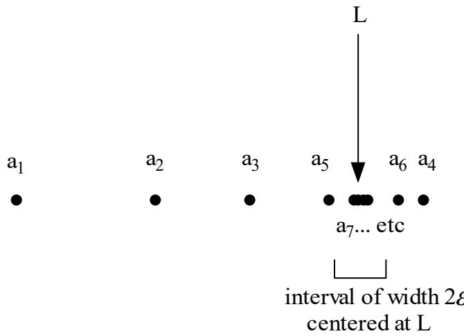

Here we see that all of the terms after $a _ { 6 }$ are within $\epsilon$ of $L$

It is reasonable to ask whether a series converges solely on the basis of the terms getting closer together, even if we don't happen to have the number $L$ on hand—that is,can we construct such an $L$ solely from the fact that the terms are getting closer together? The answer is yes, provided we have a strong enough notion of closeness. This was discovered by Augustin-Louis Cauchy (1789-1857).

DEFINITION 3.1.11 The sequence ( $a _ { k }$ ) is called a Cauchy sequence if, for any $\epsilon > 0$ there is an integer $N _ { a } ( \epsilon ) > 0$ such that $| a _ { i } - a _ { j } | \leq \epsilon$ whenever $i$ and $j \ge N _ { a } ( \epsilon )$ · $N _ { a } ( \epsilon )$ is called a modulus of convergence for the sequence $\left( a _ { k } \right)$

The inequality $| a _ { i } - a _ { j } | < \epsilon$ means $a _ { j } \in \lfloor a _ { i } - \epsilon , a _ { i } + \epsilon \rfloor$ ， so once again we are looking at an interval of width $2 \epsilon$ . This time we have no $L$ to center it around. The Cauchy criterion says that if we slide this interval around, we can eventually cover all but a finite number of terms of the the sequence ( $a _ { k }$ ). The diagram is very much like the previous one for the limit:

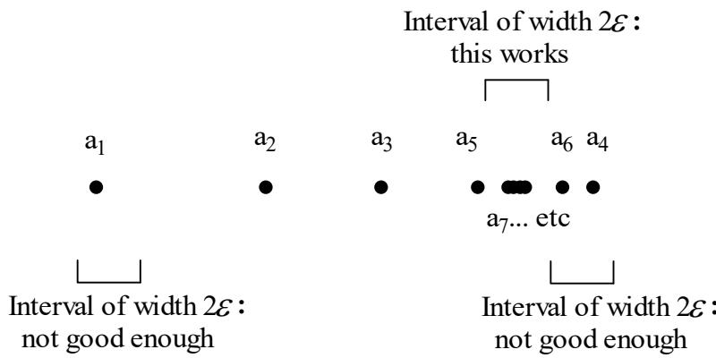

ExAMPLE 3.1.12 Let $s _ { k } = \sum _ { i = 1 } ^ { k } { \frac { 1 } { i ^ { 2 } } }$ $m \geq n > 1$ ,we can write

$$
\begin{array} { r c l } { \displaystyle s _ { m } - s _ { n } = \sum _ { i = n + 1 } ^ { m } \frac { 1 } { i ^ { 2 } } } & { \le } & { \displaystyle \sum _ { i = n + 1 } ^ { m } \frac { 1 } { i ( i - 1 ) } } \\ & { = } & { \displaystyle \sum _ { i = n + 1 } ^ { m } \left( \frac { 1 } { i - 1 } - \frac { 1 } { i } \right) } \\ & { = } & { \displaystyle \frac { 1 } { n } - \frac { 1 } { m } \le \frac { 1 } { n } , } \end{array}
$$

so to make $| s _ { m } - s _ { n } | < \epsilon$ we need only choose $N$ so that $N > 1 / \epsilon$ ； thus ( $s _ { k }$ ）is $a$ Cauchy sequence. I should remark that the limit of this sequence of partial sums has been known since the 18th century: it is $\frac { \pi ^ { 2 } } { 6 }$ (discovered by Euler). The proof is not easy, though (see [Kalman 1993]).

The sequences that have limits are exactly the Cauchy sequences; this is expressed in the following proposition and theorem.

PROPOSITION 3.1.13 If $( a _ { k } )  L$ ，then ( $a _ { k }$ ) is a Cauchy sequence.

The proof is left as an exercise.

The following important result is another way of stating the Completeness Theorem for the reals—perhaps,in fact, the most usual way. For more details,see the exercises. This is one of the most important results in classical real analysis; it is sometimes simply called The Completeness of the Reals.

THEOREM 3.1.14 (CAUCHY COMPLETENESS THEOREM） EUery Cauchy sequence converges to some real number. In other words, if ( $a _ { k }$ ）is a Cauchy sequence, then there exists an L such that $( a _ { k } )  L$

Proof. Using ( $a _ { k }$ ） we will define a consistent and fine family of real intervals and invoke the Completeness Theorem we've already proved to show the existence of $L$

For each integer $k > 0$ , define the interval $I _ { k }$ as follows. Let $N _ { k }$ be an integer such that $| a _ { i } - a _ { j } | < 1 / k$ whenever $i , j \ge N _ { k }$ .(Here we are using the assumption that $\left( a _ { k } \right)$ is a Cauchy sequence.） Let $\begin{array} { r } { I _ { k } \ = \ \left\lfloor a _ { N _ { k } } - \frac { 1 } { k } , a _ { N _ { k } } + \frac { 1 } { k } \right\rfloor } \end{array}$ and $\mathcal { F } = \{ I _ { k } | k =$ $1 , 2 , \ldots \}$ . We note that the length of $I _ { k }$ is $\frac { 2 } { k }$ , so the family $\mathcal { F }$ is clearly fine. To prove consistency, suppose that we have the interval $I _ { k }$ as above and another such interval $\begin{array} { r } { I _ { q } = [ a _ { N _ { q } } - \frac { 1 } { q } , a _ { N _ { q } } + \frac { 1 } { q } ] } \end{array}$ .Either $N _ { k } \le N _ { q }$ or $N _ { q } \le N _ { k }$ ; suppose that $N _ { k } \le N _ { q }$ . Then $\left| a _ { N _ { q } } - a _ { N _ { k } } \right| < 1 / k$ ,or

$$
a _ { N _ { q } } - 1 / k < a _ { N _ { k } } < a _ { N _ { q } } + 1 / k .
$$

The left-hand inequality gives $a _ { N _ { q } } - 1 / q < A _ { N _ { q } } < a _ { N _ { k } } + 1 / k$ ， while the right-hand inequality gives $a _ { N _ { k } } - 1 / k < a _ { N _ { q } } < a _ { N _ { q } } + 1 / q$ . Thus $I _ { k }$ and $I _ { q }$ intersect. The case $N _ { q } \le N _ { k }$ is proved the same way. Since the family $\mathcal { F }$ is fine and consistent, there is a unique real number $L$ common to all of its intervals. This $L$ should work because it is arbitrarily close to each of the $a _ { N _ { k } }$ ,and the $a _ { N _ { k } }$ are arbitrarily close to all $a _ { i }$ for $i$ and $k$ big enough.All that's left is an application of the triangle inequality to formalize this. So, suppose we are given $\epsilon > 0$ . Choose $k$ so large that $1 / k < \epsilon / 2$ ， and suppose that $i \geq N _ { k }$ . Then

$$
\begin{array} { l l l } { \left| a _ { i } - L \right| } & { \leq } & { \left| a _ { i } - a _ { N _ { k } } \right| + \left| a _ { N _ { k } } - L \right| } \\ & { < } & { 1 / k + 1 / k \leq \epsilon . } \end{array}
$$

Not only is Cauchy convergence equivalent to convergence, but any modulus for Cauchy convergence is a modulus of convergence. We give a separate proof of this fact, since it is an instructive example of the use of the Wiggle Lemma and the triangle inequality.

PROPOSITION 3.1.15 Suppose（ $a _ { k }$ ） is Cauchy convergent with modulus $N ( \epsilon )$ . Then $( a _ { k } )$ is convergent with modulus of convergence $N ( \epsilon )$

Proof. We know that $( a _ { k } )  L$ for some $L$ , so suppose $n \geq N$ . Then for any $_ { m }$

$$
\left| a _ { n } - L \right| \leq \left| a _ { n } - a _ { m } \right| + \left| a _ { m } - L \right| \leq \epsilon + \left| a _ { m } - L \right| .
$$

But $( a _ { k } ) \to a$ , so we can make $\left| a _ { m } - L \right|$ arbitrarily small by making $m$ large enough (without changing $_ n$ or $N$ ); thus $| a _ { n } - L | \leq \epsilon$ by the Wiggle Lemma.

A modulus of convergence for $( a _ { n } ) \ \to \ L$ ， however， may not be good enough to establish Cauchy convergence if the sequence oscillates around $L$ .Try to find an example illustrating this.

Finally, we deal with criteria for inequalities of limits. We saw above (Proposition 3.1.10) that if $a _ { k } \le b _ { k }$ for $k$ sufficiently large, then $\operatorname* { l i m } ( a _ { k } ) \leq \operatorname* { l i m } ( b _ { k } )$ . The converse is not true,however: $1 / k$ is never less than or equal to $- 1 / k$ when $k$ is a positive integer， yet $\operatorname* { l i m } ( 1 / k ) \le \operatorname* { l i m } ( - 1 / k )$ . Furthermore,we haven't proved anything yet about strict inequality. We now deal with these issues.

In what follows, $N _ { a } ( \epsilon )$ represents a modulus of convergence for a Cauchy sequence $( a _ { i } )$ . We assume $( a _ { i } ) \to L _ { a }$ and $( b _ { i } ) \to L _ { b }$

PROPOSITiON 3.1.16 The following are equivalent.

1. There exist rationals $\epsilon > 0$ and $\delta > 0$ such that $b _ { j } > a _ { j } + \epsilon + \delta$ for $i \geq N _ { a } ( \epsilon )$ and $j \ge N _ { b } ( \delta )$   
2. $L _ { b } > L _ { a }$

PROPOSITION 3.1.17 Let （ $a _ { i }$ ）and $\left( b _ { i } \right)$ be Cauchy sequences. The following statements are equivalent.

1. For any rationals $\epsilon > 0$ and $\delta > 0$ ， $a _ { i } - b _ { j } \leq \epsilon + \delta$ for $i \geq N _ { a } ( \epsilon )$ and $j \geq N _ { b } ( \delta )$ ·   
2. For any rational $\epsilon > 0$ there is an $M ( \epsilon )$ such that $a _ { i } \leq b _ { i } + \epsilon$ for $i , j \ge M ( \epsilon )$   
3. $L _ { a } \leq L _ { b }$

The proofs are exercises.

# Exercises

1. Discuss the convergence of the following.

(a） The sequence of reciprocals $r _ { N } = 1 / N$ ， $N = 1 , 2 , \ldots$ N+1  
(b） The sequence an = N  
(c)） The sequence UN = 2N  
(d） The sequence $s _ { N } = \sin ( N \pi / 1 0 )$

2. Let $P ( x )$ and $Q ( x )$ be polynomials with $\deg ( P ) < \deg ( Q )$ ,let $d _ { n } = \frac { P ( n ) } { Q ( n ) }$ and letDn $D _ { n } = { \frac { Q ( n ) } { P ( n ) } } $ What can you say about the convergence of the sequences $d _ { n }$ ）and $( D _ { n } )$ ？

3.Prove that for any positive number $^ { a }$ ， $\operatorname* { l i m } _ { n \to \infty } ( a ^ { 1 / n } ) = 1$ . (Hint: One method is to use Lipschitz conditions on $a ^ { x }$ . Another is to separate into cases: $a > 1$ and $a < 1$ . Suppose $a > 1$ ; then $a ^ { 1 / n } > 1$ (why?), so write $a ^ { 1 / n } = 1 + e _ { n }$ and show that $\operatorname* { l i m } _ { n \to \infty } e _ { n } = 0$ by noting that $( 1 + t ) ^ { k } \geq 1 + k t$ . Deal with $a < 1$ by noting that $1 / a > 1$ ）

4. Suppose（ $s _ { N }$ ) is a sequence.Form a new sequence ( $t _ { N }$ ） by throwing away the first 1000 terms of $\left( { { s _ { N } } } \right)$ and renumbering so as to start from O again. Discuss in a paragraph or so the comparative convergence properties of $\left( { { s _ { N } } } \right)$ and $( t _ { N } )$ (See the next exercise for related ideas.)

5.(Subsequences） Let $r : \mathbb { N } \to$ N be an increasing function on the natural numbers; i.e.if $m \ < \ n$ then $f ( m ) \leq f ( n )$ .If( $a _ { k }$ ）is a sequence,then,if we write $b _ { k } = a _ { r ( k ) }$ ，we call ( $b _ { k }$ )a subsequence of ( $a _ { k }$ ). For example, suppose $a _ { k } = 1 / k$ so that $\left( a _ { k } \right)$ consists of the reciprocals of the (positive） integers； let $r ( n ) =$ $2 n - 1$ .Then ( $b _ { k }$ ）consists of the reciprocals of the odd (positive） integers. On the other hand,if $r ( n ) = n + 5$ ，then ( $b _ { k }$ ） consists of the reciprocals of the integers starting at 6. This subsequence is called a shift of $( a _ { k } )$ (see the previous exercise).

(a) Prove that if $( a _ { k } )  L$ and ( $b _ { k }$ ) is a subsequence, then $( b _ { k } )  L$ . Suppose that we know that ( $a _ { k }$ ） converges and that $( b _ { k } ) \to L$ .Does that mean that $( a _ { k } )  L$ ？   
(b） Suppose we know that the subsequence ( $b _ { k }$ )of( $a _ { k }$ ） converges. Does that mean that ( $a _ { k }$ ）converges?(Give a proof or a counterexample.)   
(c） Suppose $( a _ { k } ) \to A$ and the sequence ( $a _ { k } ^ { \prime }$ ）is obtained from ( $a _ { k }$ ） by changing a finite number of terms of ( $a _ { k }$ ). Prove the $( a _ { k } ^ { \prime } ) \to A$   
(d） Suppose that $( a _ { k } ) \to A$ and $A$ is a unit, say with $A > 0$ . Prove that there is some integer $K$ such that $a _ { k } > 0$ whenever $k \geq K$ . Thus, there is a shift of ( $a _ { k }$ ）which converges to $A$ , and all of whose terms are positive.

6. Suppose the sequence ( $a _ { n }$ ） converges to 0. Discuss the convergence of ( $a _ { n } ^ { k }$

7. Prove those parts of Proposition 3.1.9 on the algebra of convergence not proved in the text.

8.In the problems for the section on limiting families you were asked to prove several propositions about limiting families that occur in the text (see page 66). Here are the same propositions rephrased in terms of sequences (assume the limits exist).

(a) PROPOsITION: Suppose that there are constants $S , T$ such that $S \le a _ { k } \le$ $T$ for all $k$ . Then $L \leq \operatorname* { l i m } ( a _ { k } ) \leq U$   
(b) PROPOSITION: SuppOse that $a _ { k } \le b _ { k }$ for all $k$ . Then $\operatorname* { l i m } ( a _ { k } ) \leq \operatorname* { l i m } ( b _ { k } )$ ("weak inequalities are preserved in the limit").   
(c) PROPOSITION: SuppOse that $( a _ { k } ) \to A$ and $( b _ { k } )  B$ . Then · $( a _ { k } + b _ { k } ) \to A + B$ ， $( a _ { k } - b _ { k } )  A - B$ · $( a _ { k } b _ { k } )  A B$ ·if $B$ is a unit, $( a _ { k } / b _ { k } )  A / B$ after suitable renumbering so that $a _ { k } / b _ { k }$ makes sense (see Exercises 4 and 5 above).

Prove these propositions.Note that，in the second proposition，the strict inequality $<$ for the terms of the sequence gets replaced by the weak inequality $\leq$ in the limits. Show by example that even if the terms of one sequence are strictly less than the terms of another sequence, their limits may be equal.

9. Suppose $( a _ { k } ) \to A$ and $a _ { k } > 0$ for all $k$ . Show that $\left( { \sqrt { a _ { k } } } \right) \to { \sqrt { A } }$ . Generalize this.

10.Use the fact that $k ^ { 3 } + 6 k ^ { 2 } + 1 1 k + 5 = ( k + 1 ) ( k + 2 ) ( k + 3 ) - 1$ to find $\operatorname* { l i m } _ { k \to \infty } \left( { \frac { k ^ { 3 } + 6 k ^ { 2 } + 1 1 k + 5 } { ( k + 3 ) ! } } \right)$

11. Prove that if $( a _ { k } )  L$ ，then $\left( a _ { k } \right)$ is a Cauchy sequence. Show by example that a modulus of convergence $N ( \epsilon )$ may not itself work to establish Cauchy convergence (see Proposition 3.1.15).

12.Prove that a Cauchy sequence is always bounded (i.e. there is a number $B$ such that $| a _ { k } | < B$ for all $k$ ).

13. Suppose that $\operatorname* { l i m } _ { n \to \infty } \left| { \frac { a _ { n + 1 } } { a _ { n } } } \right| = r$ for the sequence ( $u _ { n }$ ). Show that

$$
\begin{array} { l } { { \mathrm { I f ~ } r < 1 \mathrm { ~ t h e n ~ } \operatorname* { l i m } _ { n  \infty } ( a _ { n } ) = 0 . } } \\ { { \mathrm { I f ~ } r > 1 \mathrm { ~ t h e n ~ } \operatorname* { l i m } _ { n  \infty } ( a _ { n } ) = \infty . } } \end{array}
$$

14. Guess the limit of this sequence and prove (fairly hard) that it converges:

$$
a _ { n } = { \frac { n + 1 } { 2 ^ { n + 1 } } } \left( { \frac { 2 } { 1 } } + { \frac { 2 ^ { 2 } } { 2 } } + \cdots + { \frac { 2 ^ { n } } { n } } \right) .
$$

15.A Fibonacci-type sequence is defined recursively by $f _ { 1 } = a$ ， $f _ { 2 } = b$ and $f _ { n } =$ $f _ { n - 1 } + f _ { n - 2 }$ for $n > 2$

(a) Show that such a sequence cannot be a Cauchy sequence unless $a = b = 0$ (b） Modify the definition so that $\begin{array} { r } { f _ { n } = \frac { 1 } { 2 } \left( f _ { n - 1 } + f _ { n - 2 } \right) } \end{array}$ . Prove that this new sequence is always a Cauchy sequence.(Hint:Prove that it converges by writing the first few terms as $^ { a }$ ， $a + ( b - a )$ ， ${ \begin{array} { l } { { \frac { 1 } { 2 } } \left( 2 a + ( b - a ) \right) = a + } \end{array} } $ ${ \scriptstyle { \frac { 1 } { 2 } } } ( b - a )$ $\begin{array} { r } { a ) , \ a + \frac { 1 } { 2 } ( b - a ) + \frac { 1 } { 4 } ( b - a ) } \end{array}$ , etc.; you might want to prove this by induction.)

(c) There are a number of variations and generalizations of this averaging idea; for example, prove that if $\operatorname* { l i m } _ { n \to \infty } \left( a _ { n } \right) = a$ ,then

$$
\operatorname* { l i m } _ { n \to \infty } \left( { \frac { a _ { 1 } + a + \cdots + a _ { n } } { n } } \right) = a .
$$

(d) Here's another: Let $a _ { 1 } , a _ { 2 } , \dotsc , a _ { p }$ be positive numbers. Find

$$
\operatorname* { l i m } _ { n \to \infty } \left( { \sqrt [ n ] { \frac { a _ { 1 } ^ { n } + a _ { 2 } ^ { n } + \cdots + a _ { p } ^ { n } } { p } } } \right) .
$$

(Hint: Let $a = \operatorname* { m a x } ( a _ { 1 } , a _ { 2 } , \ldots , a _ { p } )$ and try to find lower and upper bounds for the $n ^ { t h }$ root; also remember that $\operatorname* { l i m } _ { n \to \infty } { \sqrt [ { n } ] { p } } = 1 .$ ）

16.(Project） We have constructed the reals from the rationals by defining a real number to be a fine and consistent family of rational intervals. There are several other ways of constructing the reals; the one that is closest to the approach here is via Cauchy sequences. Here is an outline of some definitions and things to be proved.

(a) Define a real number to be a Cauchy sequence ( $r _ { i }$ ）of rational numbers.   
(b）Define $( a _ { i } )$ to be a null sequence if, for any $\epsilon > 0$ there is an $N$ such that $i > N \Longrightarrow | a _ { i } | < \epsilon$   
(c）Define $( a _ { i } ) = ( b _ { i } )$ (as real numbers） to mean $( a _ { i } - b _ { i } )$ is a null sequence.   
(d) Define addition, subtraction,and multiplication of reals by: $( a _ { i } ) + ( b _ { i } ) =$ $( a _ { i } + b _ { i } )$ ； $( a _ { i } ) - ( b _ { i } ) = ( a _ { i } - b _ { i } )$ ; and $( a _ { i } ) ( b _ { i } ) = ( a _ { i } b _ { i } )$   
(e) Prove that these operations on equal reals yield equal reals.   
(f）Define $( a _ { i } ) < ( b _ { i } )$ to mean that there exist rationals $\epsilon > 0$ and $\delta > 0$ such that $b _ { j } > a _ { i } + \epsilon + \delta$ for $i \geq N _ { a } ( \epsilon )$ and $j \ge N _ { b } ( \delta )$ (see Proposition 3.1.16).   
(g）Define $( a _ { i } ) \leq ( b _ { i } )$ to mean that $\left( b _ { i } \right) < \left( a _ { i } \right)$ is false. Prove that $( a _ { i } ) \leq ( b _ { i } )$ if and only if for any rational $\epsilon > 0$ there is an $M ( \epsilon )$ such that $a _ { i } \leq b _ { i } + \epsilon$ ， for $i , j \ge M ( \epsilon )$ (see Proposition 3.1.10).   
(h） Define division of reals,absolute value,max, min, etc.   
(i) Prove some of the results from the text for real numbers using these new definitions.   
(j） Define what a Cauchy sequence of reals would be using these definitions. Prove a Completeness Theorem which says that any Cauchy sequence of reals (i.e.a Cauchy sequence of Cauchy sequences of rationals) has a limit (a Cauchy sequence of rationals).

# 3.2 Limits of Functions

If a sequence is a function $s : \mathbb { N } \to \mathbb { R }$ and we can define the limit of such a function, we might ask about generalizing this notion for functions $f : \mathbb { R } \to \mathbb { R }$ .In the case of sequences, we are looking at what happens to $s ( k )$ when $k$ gets very large. By analogy,we can make the following definition for $f$

DEFINITION 3.2.1 $\begin{array} { r } { \operatorname* { l i m } _ { x \to \infty } f ( x ) = L } \end{array}$ $L$ a real number) means that, given any $\epsilon > 0$ ， there is an integer $M \geq 0$ such that $| f ( x ) - L | < \epsilon$ for all $x > M$

DEFINITION 3.2.2 $\begin{array} { r } { \operatorname* { l i m } _ { x \to \infty } f ( x ) = \infty } \end{array}$ (respectively, $\quad \operatorname* { l i m } _ { x \to \infty } f ( x ) \ = \ - \infty ,$ means that， given an integer $N ~ > ~ 0$ ， there is an integer $M \ > \ 0$ such that $f ( x ) \ > \ N$ (respectively $f ( x ) < - N )$ for all $x > M$

(We can make similar definitions for $\scriptstyle \operatorname* { l i m } _ { x \to - \infty } f ( x )$ -these are left as exercises.)

EXAMPLE 3.2.3 $\scriptstyle \operatorname* { l i m } _ { x \to \infty } x ^ { 3 } \ = \ \infty$ and $\begin{array} { r } { \operatorname* { l i m } _ { x \to \infty } x ^ { - 3 } = 0 } \end{array}$ . These are easily proved using the Lipschitz condition on nth powers (Corollary 2.2.6).

REMARK 3.2.4 It may happen that for some function $f : \mathbb { R } \to \mathbb { R }$ , the sequence $( f ( n ) )$ may have a limit but $\scriptstyle \operatorname* { l i m } _ { x \to \infty } f ( x )$ may not exist-see the exercises..

Unlike the situation for sequences,however, we have much more flexibility in taking limits of functions from $\mathbb { R }$ to $\mathbb { R }$

DEFINITION 3.2.5 Let a and $L$ be real numbers. We say that the limit of $f ( x )$ as $_ { x }$ approaches a is $L$ if for any $\epsilon > 0$ there is a $\delta > 0$ such that $| f ( x ) - L | < \epsilon$ whenever $0 < | x - a | < \delta$ . In this case we write $\operatorname* { l i m } _ { x \to a } f ( x ) = L$

REMARk 3.2.6 Note that this definition says nothing about what happens when $x =$ $^ { a }$ ; in fact, a may not even be in the domain of $f$ (i.e. $f ( a )$ may not even be defined). The limit of $f$ at a depends only on the values $f ( x )$ for $_ x$ near $a$ (see exercises).

Here is a diagram that shows the conditions for $\operatorname* { l i m } _ { x \to a } f ( x )$ to be $L$ ：

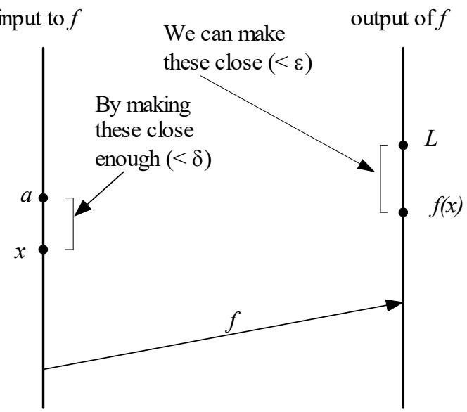

EXAMPLE 3.2.7 $l i m _ { x  2 } x ^ { 3 } = 8$ . To see this, one can manipulate Lipschitz conditions,but it is perhaps simpler to write

$$
\left| x ^ { 3 } - 8 \right| = \left| x - 2 \right| \left| x ^ { 2 } + 2 x + 4 \right| .
$$

Clearly, we can make the $| x - 2 |$ term small by making $_ { x }$ close to 2, but we do have to make sure that the $\left| x ^ { 2 } + 2 x + 4 \right|$ term is bounded. However, if we make $_ { x }$ within say 1 of 2, then $_ x$ won't exceed 3, so $\left| x ^ { 2 } + 2 x + 4 \right| < 1 9$ . Thus， choose $\delta < \mathrm { m i n } ( \epsilon / 1 9 , 1 )$ s0 $\left| x ^ { 3 } - 8 \right| = \left| x - 2 \right| \left| x ^ { 2 } + 2 x + 4 \right| < ( \epsilon / 1 9 ) ( 1 9 ) = \epsilon$

We now can state the usual facts about the algebra of limits; the proofs are straightforward and use ideas we have encountered before.

PROPOSITION 3.2.8 (PROPERTIES OF FINITE LIMITS） SuppOSe that $\operatorname* { l i m } _ { x \to a } f ( x ) =$ $L$ and $\begin{array} { r } { \operatorname* { l i m } _ { x \to a } g ( x ) = M } \end{array}$ . Then $\begin{array} { r } { \operatorname { i m } _ { x  a } ( f ( x ) + g ( x ) ) = L + M } \end{array}$ ， $\begin{array} { r } { \operatorname* { l i m } _ { x \to a } \left( f ( x ) - g ( x ) \right) } \end{array}$ $= L { - } M$ ，and $\begin{array} { r } { \operatorname* { l i m } _ { x \to a } f ( x ) g ( x ) = L M } \end{array}$ .If $M > 0$ or $M < 0$ ,then $\begin{array} { r } { \operatorname* { l i m } _ { x \to a } f ( x ) / g ( x ) = } \end{array}$ $L / M$

(The tricky one is the product; for a model, use the proof given when we were looking at convergence: see Proposition 3.1.9.)

The formulation of similar results for infinite limits is left to the exercises.

Once again, we have the result that weak inequalities are preserved in the limit :

PROPOSITION 3.2.9 （WEAK INEQUALITIES PRESERVED） SuppOSe that $f ( x ) \leq g ( x )$ for $x \in ( a , b )$ ， $c \in ( a , b )$ and $\scriptstyle \operatorname* { l i m } _ { x \to c } f ( x ) = L$ ， $\begin{array} { r } { \operatorname* { l i m } _ { x \to c } g ( x ) = M } \end{array}$ . Then $L \leq M$

Proof. For any $\epsilon > 0$ , choose $\delta$ such that $f ( x )$ and $g \left( x \right)$ are within $\epsilon / 2$ of $L$ and $M$ ， respectively, when $| x - c | < \delta$ . Then L≤. $f ( x ) + \epsilon / 2 \le g ( x ) + \epsilon / 2 \le ( M + \epsilon / 2 ) + \epsilon / 2 =$ $M + \epsilon$ . Since $\epsilon$ was arbitrary, $L \leq M$ ■

This,by the way, is a beautiful example of the usefulness of the Wiggle Lemma. We know that $f ( x ) \leq g ( x )$ ,but $g ( x )$ is merely close to $M$ ; in fact, it may be always larger than $M$ .The Wiggle Lemma gives us the wiggle room to deal with this provided the amount that $g ( x )$ exceeds $M$ is arbitrarily small,which is exactly what we know.

We now state some results about log and exponential functions in the language of limits. The proofs are elementary but a bit technical, so we have placed them in an appendix.

PROPOSITION 3.2.10 If $a > 0$ ，then $a ^ { x } \to 1$ as $x \to 0$ (Equivalently, $a ^ { 1 / x } \to 1$ as$x \to \infty$ ）

(This follows directly from Proposition 2.3.19,the Lipschitz condition for exponential functions.)

PROPOSITION 3.2.11 For $n \in \mathbb N$ $( 1 + 1 / n ) ^ { n } \to e$ as $n \longrightarrow \infty$

PROPOSITION 3.2.12 For all $x > 0$ ， $x / ( 1 + x ) \leq \log ( 1 + x ) \leq x$

PROPOSITION 3.2.13 Given $n \in \mathbb N$ ， $t > 0$ and $\textstyle k \geq 0 , { \frac { ( 1 + t ) ^ { n } } { n ^ { k } } } \to \infty$ ↓8asη→8.

(The case where $k = 1$ can be proved simply using the binomial theorem; here's how it goes: $\begin{array} { r } { ( 1 + t ) ^ { n } \geq 1 + \frac { n ( n - 1 ) } { 2 } t ^ { 2 } } \end{array}$ ,so ${ \frac { ( 1 + t ) ^ { n } } { n } } \geq { \frac { 1 + { \frac { n ( n - 1 ) } { 2 } } t ^ { 2 } } { n } } = { \frac { 1 } { n } } + { \frac { ( n - 1 ) } { 2 } } t ^ { 2 } \to \infty$ $n \longrightarrow \infty$ . This idea can be extended to whole-number powers $k \geq 0$ ，and thence to reals $k \geq 0$ .）

COROLLARY 3.2.14 For x with $| x | < 1$ and any $k \geq 0$ ， $n ^ { k } x ^ { n }  0$

COROLLARY 3.2.15 For any $k \geq 0$ ， $\frac { x ^ { k } } { e ^ { x } }  0$ as $x \to \infty$

COROLLARY 3.2.16 If $n > 0$ then lg→0 asχ→8，x>0.

PROPOSITION 3.2.17 $n ^ { 1 / n } \to 1$ as $n \to \infty$

COROLLARY 3.2.18 For any polynomial $P ( n ) = a _ { 0 } + a _ { 1 } n + \cdot \cdot \cdot + a _ { k } n ^ { k }$ ,with $a _ { k } > 0$ ， $( P ( n ) ) ^ { 1 / n }  1$ as $n \longrightarrow \infty$

For proofs of these last few results,see the appendix at the end of this section.

# Exercises

1. Let $a > 0$ be a real number.

(a) Prove that lim x³ = a3. xa   
(b) Prove that lim x-² = a-². x→a   
(c)Prove that lim x1/2 = a1/2. x→a   
(d) Generalize these by proving that $\operatorname* { l i m } _ { x \to a } x ^ { t } = a ^ { t }$

2.Prove that if $A > 1$ ，then $\begin{array} { r } { \operatorname* { l i m } _ { x \to \infty } A ^ { - x } = 0 } \end{array}$ (Hint:let $A = 1 + t$ and use$( 1 + t ) ^ { k } \geq 1 + k t$ , or use Lipschitz conditions.） Prove $\begin{array} { r } { \operatorname* { l i m } _ { x \to \infty } \log _ { A } x = \infty } \end{array}$

3.Let $\textstyle f ( x ) = { \frac { x ^ { 2 } - 4 } { x - 4 } }$ Find $\operatorname* { l i m } _ { x \to 2 } f ( x )$ (and prove it),even though $f ( 2 )$ is not defined.

4.Find a function $S$ with the property that the sequence $( S ( k ) ) , k = 0 , 1 , \ldots$ has a limit but $\scriptstyle \operatorname* { l i m } _ { x \to \infty } S ( x )$ is undefined. (Hint: Choose, for example, $S$ so that $S \left( 0 \right) = S ( 1 ) = S ( 2 ) = S ( 3 ) = \cdots = k$ ，while $S ( { \textstyle { \frac { 1 } { 2 } } } ) = S ( { \textstyle { \frac { 3 } { 2 } } } ) = S ( { \textstyle { \frac { 5 } { 2 } } } ) = \cdot \cdot \cdot = - k$ ）

$\left( \left( 1 + { \frac { 1 } { k } } \right) ^ { k } \right)$ $e$ (Hint: Start with the inequality $\begin{array} { r } { \frac { e ^ { - x } - 1 } { - x } \leq 1 \leq \frac { e ^ { x } - 1 } { x } } \end{array}$ from Corollary 2.4.12 Deduce that

$$
( 1 + x ) ^ { 1 / x } \leq e \leq \left( 1 + \frac { x } { 1 - x } \right) ^ { 1 / x } ,
$$

using $0 < x < 1$ for the right-hand inequality. Choosing first $x = 1 / n$ and then $x = 1 / ( n + 1 )$ and doing some algebra yields $\begin{array} { r } { e - \frac { e } { n } \le \left( 1 + \frac { 1 } { n } \right) ^ { n } \le e } \end{array}$ ）

6. Suppose $x > 0$ . Prove that $\operatorname* { l i m } _ { n \to \infty } \left( 1 + { \frac { x } { n } } \right) ^ { n } = e ^ { x }$ (see exercise 5). What if we don't know that $x > 0$ ？

7. (Project) The algebra of limits involving forms $\scriptstyle \operatorname* { l i m } _ { x \to \infty } h ( x )$ or $\scriptstyle \operatorname* { l i m } _ { x \to - \infty } h ( x )$ ， or cases where $\operatorname* { l i m } _ { x \to a } h ( x ) = \pm \infty$ needs to be dealt with separately. Formulate and prove results in these cases.

8. Prove that lim_xn = O when $| x | < 1$ (see Corollary 3.2.14).

9. Suppose that $a > 1$ ， $\beta > 0$ ，and $\gamma$ is any real. Prove the following (you may use any results from this section).

$$
\begin{array} { l } { \displaystyle \operatorname* { l i m } _ { x \to \infty } \frac { a ^ { x } } { x ^ { \gamma } } = \infty \ ( \mathrm { e q u i v a l e n t l y , ~ } \underset { x \to \infty } { \operatorname* { l i m } } \frac { x ^ { \gamma } } { a ^ { x } } = 0 ) . } \\ { \displaystyle \operatorname* { l i m } _ { x \to \infty } \frac { \log _ { a } x } { x ^ { \beta } } = 0 . } \\ { \displaystyle \operatorname* { l i m } _ { x \to 0 } \beta ^ { x } = 1 . } \\ { \displaystyle \operatorname* { l i m } _ { x \to 0 } \ln ( 1 + x ) = 0 . } \end{array}
$$

# 3.3Series of Numbers

Perhaps the most common source of sequences in mathematics is the summing of numbers,and this is most interesting when there are infinitely many numbers to sum. One of the earliest examples is Zeno's “Race Course Paradox.” 1. In order for a runner to complete a race,he must run half the prescribed distance, then half the remaining distance, then half of the now remaining distance etc. This amounts to the runner covering the following fractions of the course:

$$
1 / 2 + 1 / 4 + 1 / 8 + 1 / 1 6 + \cdot \cdot \cdot
$$

Zeno (and many who followed him,up through modern times) was concerned about the realization of infinitely many tasks—in this case performance of the infinitely many legs of the journey.

Since we can't literally add infinitely many numbers,we look at the sequence of partial sums obtained when we add increasingly large but finite numbers of terms. In this section,we will try to find criteria for the convergence of this type of sequence. We begin by making our notion of series—an infinite sum—mathematically precise.

Let ( $s _ { k }$ ） be a sequence of numbers for, say, $k = 0 , 1 , 2 , \ldots$

DEFINITION 3.3.1 The partial sums $S _ { n }$ of this sequence are defined by

$$
\begin{array} { r c l } { { S _ { 0 } } } & { { = } } & { { s _ { 0 } , } } \\ { { S _ { k + 1 } } } & { { = } } & { { S _ { k } + s _ { k + 1 } . } } \end{array}
$$

We also write $S _ { n } = \sum _ { k = 0 } ^ { n } s _ { k } = s _ { 0 } + s _ { 1 } + \cdot \cdot \cdot + s _ { n }$

$S _ { n }$ $( S _ { n } ) \to L$ $\scriptstyle \sum _ { k = 0 } ^ { \infty } s _ { k }$ $L$

$$
\sum _ { k = 0 } ^ { \infty } s _ { k } = \operatorname* { l i m } _ { n \to \infty } S _ { n } = L .
$$

If there is no limit we say the series fails to converge; if the series fails to converge because $\operatorname* { l i m } _ { n \to \infty } S _ { n } = \infty$ or $- \infty$ , then we say the series diverges.

As you might expect，simple combinations of convergent series converge. We state this and leave its proof, a straightforward application of the defnition,as an exercise.

PROPOSITION 3.3.3 Suppose that $\textstyle \sum _ { k = 0 } ^ { \infty } s _ { k } = S$ and $\scriptstyle \sum _ { k = 0 } ^ { \infty } t _ { k } = T$ Then

$$
\sum _ { k = 0 } ^ { \infty } \left( \lambda s _ { k } + \mu t _ { k } \right) = \lambda S + \mu T
$$

for any constants $\lambda$ and $\mu$

(The situation for the product: $\textstyle \left( \sum _ { k = 0 } ^ { \infty } s _ { k } \right) \left( \sum _ { k = 0 } ^ { \infty } t _ { k } \right)$ is more complicated: see the second appendix to this chapter.)

The use of the word “diverge” implies that the partial sums are becoming unboundedly positive or unboundedly negative. This may or may not account for the failure to converge. For example,consider the series

$$
1 - 1 + 1 - \cdot \cdot \cdot \pm 1 \mp \cdot \cdot \cdot = \sum _ { k = 0 } ^ { \infty } ( - 1 ) ^ { k } .
$$

The partial sums here are $1 , 0 , 1 , 0 , \cdots$ so there is no limit,yet they are not unbounded. Some texts call this divergence but that seems misleading; we will say, simply, that this sequence fails to converge. Here are some more examples.

EXAMPLE 3.3.4 $\begin{array} { r } { \sum _ { k = 1 } ^ { \infty } ( - 1 ) ^ { k } i = 1 - 2 + 3 - 4 + \cdot \cdot \cdot } \end{array}$ . The partial sums are

$$
1 , - 1 , 2 , - 2 , 3 , - 3 , 4 , - 4 , . . .
$$

They alternate between $N$ and $- N$ ， so they don't approach either $\infty$ 0r $- \infty$ ;we should say that this series fails to converge.

ExAMPLE 3.3.5 $\begin{array} { r } { S = \sum _ { k = 1 } ^ { \infty } k = 1 + 2 + 3 + \cdots } \end{array}$ and $\begin{array} { r } { T = \sum _ { k = 1 } ^ { \infty } \ln ( 1 / e ^ { k } ) = - 1 - 2 - } \end{array}$ $3 - \cdot \cdot \cdot$ . These series diverge.

ExAMPlE 3.3.6 (ZEN0’s SERIES) $\begin{array} { r } { \sum _ { k = 1 } ^ { \infty } \frac { 1 } { 2 ^ { k } } = \frac { 1 } { 2 } + \frac { 1 } { 4 } + \frac { 1 } { 8 } + \cdot \cdot \cdot } \end{array}$ ， where the partialsums are

$$
{ \begin{array} { l } { { \frac { 1 } { 2 } } , { \frac { 3 } { 4 } } , { \frac { 7 } { 8 } } , \dots , { \frac { 2 ^ { n } - 1 } { 2 ^ { n } } } , \dots . } \end{array} }
$$

This is an example of a geometric series, which we will soon discuss at length. It clearly converges to1. To proe itformall, first proe inductiely that $\begin{array} { r } { S _ { n } = \frac { 2 ^ { n } - 1 } { 2 ^ { n } } = } \end{array}$ $1 - { \textstyle { \frac { 1 } { 2 ^ { n } } } }$ ，so that $\textstyle | S _ { n } - 1 | = { \frac { 1 } { 2 ^ { n } } }$ . We can clearly make this less than $\epsilon$ by making $_ { n }$ large enough.

ExAMPLB 37 $\begin{array} { r } { \sum _ { i = 1 } ^ { \infty } { \frac { 1 } { i ( i + 1 ) } } = \frac { 1 } { 2 } + \frac { 1 } { 6 } + \frac { 1 } { 1 2 } + \frac { 1 } { 2 0 } + \cdots } \end{array}$ is to note that $\begin{array} { r } { \frac { 1 } { i ( i + 1 ) } = \frac { 1 } { i } - \frac { 1 } { i + 1 } } \end{array}$ 1,so that

$$
\begin{array} { r c l } { \displaystyle \sum _ { i = 1 } ^ { n } \frac { 1 } { i ( i + 1 ) } } & { = } & { \displaystyle \sum _ { i = 1 } ^ { n } \frac { 1 } { i } - \frac { 1 } { i + 1 } = \left( 1 - \frac { 1 } { 2 } \right) + \left( \frac { 1 } { 2 } - \frac { 1 } { 3 } \right) + \left( \frac { 1 } { 3 } - \frac { 1 } { 4 } \right) + \dots + \left( \frac { 1 } { n } - \frac { 1 } { n + 1 } \right) } \\ & & { = } & { 1 + \left( - \frac { 1 } { 2 } + \frac { 1 } { 2 } \right) + \left( - \frac { 1 } { 3 } + \frac { 1 } { 3 } \right) + \left( - \frac { 1 } { 4 } + \frac { 1 } { 4 } \right) + \dots + \left( - \frac { 1 } { n } + \frac { 1 } { n } \right) - \frac { 1 } { n + 1 } } \\ & { = } & { 1 - \frac { 1 } { n + 1 } \to 1 , } \end{array}
$$

which approaches $^ { 1 }$ as $n \longrightarrow \infty$ ·

As the last example shows, you may need a trick or some other algebraic manipulation to get at the convergence of a series. Sometimes there is no simple expression for the limit ofa convergent series; in Example 3.1.12 we saw that $\scriptstyle \sum _ { k = 1 } ^ { \infty } { \frac { 1 } { k ^ { 2 } } }$ converges (we'll prove it again later in this section),but it is not at all easy to see that its limit is $\frac { \pi ^ { 2 } } { 6 }$ No one knows a similar expresson for the limit of the related convergent series $\scriptstyle \sum _ { k = 1 } ^ { \infty } { \frac { 1 } { k ^ { 3 } } }$ .General formulasforthesums oflarge classsof seriesarefew,but here is the most basic of them all.

PROPOSITIoN 3.3.8 The nth partial sum of the geometric series $\begin{array} { r } { S _ { n } = \sum _ { k = 0 } ^ { n } a r ^ { k } = } \end{array}$ $a + a r + a r ^ { 2 } + \cdot \cdot \cdot + a r ^ { n }$ is given by

$$
a + a r + a r ^ { 2 } + \cdots + a r ^ { n } = \frac { a ( 1 - r ^ { n + 1 } ) } { 1 - r } .
$$

Proof. By induction on $_ { n }$ , or compute $S _ { n } - r S _ { n }$ and note the cancellations.■

CORLARY39Tfiee $\textstyle \sum _ { k = 0 } ^ { \infty } a r ^ { k } = a + a r + a r ^ { 2 } + \cdots +$ $a r ^ { n } + \cdots$ converges to 1-r， provided |rl <1.

Proof. $\left| { \frac { a ( 1 - r ^ { n + 1 } ) } { 1 - r } } - { \frac { a } { 1 - r } } \right| = \left| { \frac { a r ^ { n + 1 } } { 1 - r } } \right| = \left| { \frac { a } { 1 - r } } \right| \cdot \left| r \right| ^ { n + 1 } \to 0$ as $n \to \infty$ when $| r | < 1$ (see Corollary 3.2.14).

EXAMPLE 3.3.10The feries $\begin{array} { r } { \sum _ { k = 0 } ^ { \infty } { \frac { ( - 1 ) ^ { k } } { 2 ^ { k } } } = 1 - { \frac { 1 } { 2 } } + { \frac { 1 } { 4 } } - { \frac { 1 } { 8 } } + \cdot \cdot \cdot } \end{array}$ converges to $\begin{array} { r } { \frac { 1 } { 1 + \frac { 1 } { 2 } } = \frac { 2 } { 3 } } \end{array}$

The convergence or non-convergence of a series does not depend on what happens over any finite stretch-it's the adding of infinitely many terms that matter. To make this precise, we note that for any $n \geq 0$ an infinite series $\scriptstyle \sum _ { k = 0 } ^ { \infty } s _ { k }$ can be split into a partial sum $S _ { n }$ and a tail:

$$
\begin{array} { l l l } { \displaystyle \sum _ { k = 0 } ^ { \infty } s _ { k } } & { = } & { \displaystyle \sum _ { k = 0 } ^ { n } s _ { k } + \sum _ { k = n + 1 } ^ { \infty } s _ { k } } \\ & { = } & { \displaystyle \sum _ { k = 0 } ^ { n } s _ { k } + \sum _ { k = 0 } ^ { \infty } s _ { n + 1 + k } } \end{array}
$$

The convergence of the original series depends only on the convergence of the tail, as we now see.

PROPOSITION 3.3.11（TAIL CONVERGENCE） For any $n \geq 0$ ，

1. $\scriptstyle \sum _ { k = 0 } ^ { \infty } s _ { k }$ converges if and only f $\scriptstyle \sum _ { k = 0 } ^ { \infty } s _ { n + 1 + k }$ comverges.   
2. When $\scriptstyle \sum _ { k = 0 } ^ { \infty } s _ { k }$ comuerges, $\begin{array} { r } { \sum _ { k = 0 } ^ { \infty } s _ { k } = S _ { n } + \sum _ { k = 0 } ^ { \infty } s _ { n + 1 + k } . } \end{array}$ 18

The proof is a straightforward application of the definition of series convergence and will be left as an exercise.

For a general series, one often verifies convergence by applying the Cauchy criterion (3.1.11) to the partial sums. It is useful to note, then, that for $m \leq n$ ，

$$
S _ { n } - S _ { m } = \sum _ { k = 0 } ^ { n } s _ { k } - \sum _ { k = 0 } ^ { m } s _ { k } = \sum _ { k = m + 1 } ^ { n } s _ { k } ,
$$

where the right-hand sum is taken to be $0$ when $m = n$ . In particular, $S _ { n + 1 } - S _ { n } =$ $s _ { n + 1 }$

PROPOSITION 3.3.12 $\scriptstyle \sum _ { k = 0 } ^ { \infty } s _ { k }$ converges f andonly f, ien $\epsilon > 0$ ,there eaists sn $M = M ( \epsilon )$

$$
\left| \sum _ { k = m + 1 } ^ { n } s _ { i } \right| < \epsilon ~ w h e n e v e r ~ n > m > M .
$$

Proof. This is simply a rephrasing of the Cauchy convergence criterion.

The next result gives us a necessary condition for convergence—namely that the terms of a convergent series must approach O. It is logically equivalent to the statement that if the terms of a series don't go to O, the series can't converge.

PROPOSTION3.3.13ftheies $\scriptstyle \sum _ { k = 0 } ^ { \infty } s _ { k }$ conerges,thententh term $s _ { n } \to 0$ qs $n \longrightarrow \infty$ ； in particular, the terms of a convergent series are bounded.

Proof. If the series converges, the partial sums ( $S _ { n }$ ) form a Cauchy sequence. Given $\epsilon > 0$ , choose $M$ so large that $| S _ { n } - S _ { k } | < \epsilon$ when $n , k \geq M$ .In particular, if $n > M$ then $n - 1 \geq M$ and $| s _ { n } | = | S _ { n } - S _ { n - 1 } | < \epsilon$ ■

COROLLARY 3.3.14 (DIVERGENCE TEST) If the terms of a series don't approach 0, the series can't converge.

ExAMPLE 3.3.15 ∑k=0 3k2+2k+1 diverges. To see this, we compute the limit of the kth term:

$$
\begin{array} { l c l } { \displaystyle \operatorname* { l i m } _ { k \to \infty } \frac { k ^ { 2 } } { 3 k ^ { 2 } + 2 k + 1 } } & { = } & { \displaystyle \operatorname* { l i m } _ { k \to \infty } \frac { k ^ { 2 } / k ^ { 2 } } { 3 k ^ { 2 } / k ^ { 2 } + 2 k / k ^ { 2 } + 1 / k ^ { 2 } } } \\ & { = } & { \displaystyle \operatorname* { l i m } _ { k \to \infty } \frac { 1 } { 3 + 2 / k + 1 / k ^ { 2 } } } \\ & { = } & { \displaystyle \frac { 1 } { 3 } . } \end{array}
$$

Since this limit is not O, the series diverges.

What is crucial to realize is that even if the terms of a series do approach $0$ ,the series still may not converge! Here is the oldest and simplest example; the proof is also a classic.

PROPOSITION 3.3.16 The harmonic series $H = 1 + { \frac { 1 } { 2 } } + { \frac { 1 } { 3 } } + { \frac { 1 } { 4 } } + \cdots = \sum _ { k = 1 } ^ { \infty } { \frac { 1 } { k } }$ diverges to $\infty$ ·

Proof.There are a number of different and interesting proofs that the harmonic series diverges. The most intuitive is based on the simple observation that for any integer $n > 1$ ，

$$
\underbrace { { \frac { 1 } { n + 1 } } + { \frac { 1 } { n + 2 } } + { \frac { 1 } { n + 3 } } + \cdots + { \frac { 1 } { 2 n } } } _ { n { \mathrm { ~ t e r m s } } } > \underbrace { { \frac { 1 } { 2 n } } + \cdots + { \frac { 1 } { 2 n } } } _ { n { \mathrm { ~ t e r m s } } } = { \frac { 1 } { 2 } } .
$$

Thus, for example, we can write the 16th partial sum, $H _ { 1 6 }$ ,as

$$
\begin{array} { r } { H _ { 1 6 } = 1 + \underbrace { \left[ \frac { 1 } { 2 } \right] } _ { = \frac { 1 } { 2 } } + \underbrace { \left[ \frac { 1 } { 3 } + \frac { 1 } { 4 } \right] } _ { > \frac { 1 } { 2 } } + \underbrace { \left[ \frac { 1 } { 5 } + \frac { 1 } { 6 } + \frac { 1 } { 7 } + \frac { 1 } { 8 } \right] } _ { > \frac { 1 } { 2 } } + \underbrace { \left[ \frac { 1 } { 9 } + \frac { 1 } { 1 0 } + \cdots + \frac { 1 } { 1 5 } + \frac { 1 } { 1 6 } \right] } _ { > \frac { 1 } { 2 } } , } \end{array}
$$

s0 $H _ { 1 6 } > 1 + 4 \left( \frac { 1 } { 2 } \right)$ . And, in general, $H _ { 2 ^ { k } } > 1 + k \left( \frac { 1 } { 2 } \right)$ ， so that the partial sums become infinite. $\lfloor$

Thus,although the terms of the harmonic series approach O, their sum (the infinite harmonic series) does not converge.

So how can we tellif a series does converge? This is a topic of such importance and subtlety that mathematicians have developed many tests,some of them quite complicated.We will state and prove a few of the most basic in this section.

We start by assuming that the terms of our series are all positive. In some sense it is harder for such a series to converge, since there can't be any cancellation of positive and negative terms. On the other hand, this also narrows down the problem of divergence to the issue of the terms getting too big. If we already have a series that converges, its terms can’t be getting too big, so any series whose terms are roughly the same in size or smaller should converge. That is the idea of a comparison test; here's the simplest one.

THEOREM 3.3.17 (COMPARISON TEST FOR SERIES） SuppOSe that hot $\scriptstyle \sum _ { k = 0 } ^ { \infty } t _ { k }$ $\textstyle \sum _ { k = 0 } ^ { \infty } s _ { k }$ $| s _ { k } | \le t _ { k }$ for $k$ $s _ { k } \geq | t _ { k } |$ $k$ $\scriptstyle \sum _ { k = 0 } ^ { \infty } t _ { k }$ $\scriptstyle \sum _ { k = 0 } ^ { \infty } s _ { k }$ diverges.

Proof. $\begin{array} { r } { \left| S _ { n } - S _ { m } \right| = \left| \sum _ { k = m + 1 } ^ { n } s _ { k } \right| \leq \sum _ { k = m + 1 } ^ { n } \left| s _ { k } \right| \leq \sum _ { k = m + 1 } ^ { n } t _ { k } } \end{array}$ sayfor $n \geq m > L$ $_ { m }$ ， $_ { n }$ “suficiently large"). Since the series with terms $t _ { k }$ converges (and the $t _ { k }$ are non-negative), there is an $M$ such that this last sum is $< \epsilon$ when $n > m > M$ . Thus, $| S _ { n } - S _ { m } | < \epsilon$ when $n \geq m > \operatorname* { m a x } ( L , M )$ . The divergence is equally straightforward.

As a quick application of the comparison test, we establish again the convergence f $\begin{array} { r } { \sum _ { k = 0 } ^ { \infty } \frac { 1 } { ( k + 1 ) ^ { 2 } } = 1 + \frac { 1 } { 4 } + \frac { 1 } { 9 } + \frac { 1 } { 1 6 } + \cdot \cdot \cdot } \end{array}$ We note that $\begin{array} { r } { \frac { 1 } { ( k + 1 ) ^ { 2 } } < \frac { 1 } { k ( k + 1 ) } } \end{array}$ k(k+1), and we saw above ∑=1 k(k+1) converges. It follows that $\scriptstyle \sum _ { k = 1 } ^ { \infty } { \frac { 1 } { k ^ { p } } }$ converges when $p \geq 2$ It is,in fact, true that this last series converges for all $p > 1$ . This fact is most easily proved using the integral test (see Theorem 5.3.27),but here's a very simple proof illustrating both a comparison with a geometric series and an idea borrowed from the proof of the divergence of the harmonic series.

PROPOSITION 3.3.18（ $p$ -SERIES TEST) $\sum _ { k = 1 } ^ { \infty } { \frac { 1 } { k ^ { p } } }$ converges for $p > 1$ and diverges for $p \leq 1$ ·

Proof.

$$
{ \begin{array} { l c l } { \displaystyle \sum _ { k = 1 } ^ { \infty } { \frac { 1 } { k ^ { p } } } } & { = } & { \displaystyle 1 + { \frac { 1 } { 2 ^ { p } } } + { \frac { 1 } { 3 ^ { p } } } + { \frac { 1 } { 4 ^ { p } } } + \cdots } \\ & { = } & { \displaystyle 1 + \underbrace { \left( { \frac { 1 } { 2 ^ { p } } } + { \frac { 1 } { 3 ^ { p } } } \right) } _ { \mathrm { \normalfont ~ 2 \ n e m s } } + \underbrace { \left( { \frac { 1 } { 4 ^ { p } } } + { \frac { 1 } { 5 ^ { p } } } + { \frac { 1 } { 6 ^ { p } } } + { \frac { 1 } { 7 ^ { p } } } \right) } _ { \mathrm { \normalfont ~ 4 \ n e m s } } + \cdots } \\ & { < } & { \displaystyle 1 + 2 \left( { \frac { 1 } { 2 ^ { p } } } \right) + 4 \left( { \frac { 1 } { 4 ^ { p } } } \right) + 8 \left( { \frac { 1 } { 8 ^ { p } } } \right) + \cdots } \\ & { = } & { \displaystyle 1 + { \frac { 1 } { 2 ^ { p - 1 } } } + \left( { \frac { 1 } { 2 ^ { p - 1 } } } \right) ^ { 2 } + \left( { \frac { 1 } { 2 ^ { p - 1 } } } \right) ^ { 3 } + \cdots } \end{array} }
$$

This last is a geometric series which converges when $2 ^ { p - 1 } > 1$ , i.e. when $p - 1 > 0$ The divergence for $p \leq 1$ follows from comparison with the harmonic series.■

THEOREM 3.3.19（LIMIT COMPARISON TEST） Suppose（ $s _ { k }$ ）and $\left( t _ { k } \right)$ are sequences which are both non-negative for $k$ sufficiently large; also suppose that $\begin{array} { r } { \frac { s _ { k } } { t _ { k } } \longrightarrow L > 0 } \end{array}$ as $k \to \infty$ . Then $\scriptstyle \sum _ { k = 0 } ^ { \infty } s _ { k }$ converges if and ony if $\scriptstyle \sum _ { k = 0 } ^ { \infty } t _ { k }$ comverges. tk

Proof. For $k$ sufficiently large, $s _ { k }$ and $t _ { k }$ are non-negative and $\frac { s _ { k } } { t _ { k } } \le L + \epsilon$ So $s _ { k } \ \leq \ t _ { k } ( L + \epsilon )$ ，and the comparison test shows that convergence of the $t$ series implies convergence of the $s$ series. To prove theconverse,notethat $\frac { t _ { k } } { s _ { k } } \longrightarrow 1 / L$

REMARK 3.3.2Tis proidesaotrht $et { } { _ { k = 1 } ^ { \infty } } \frac { 1 } { k ^ { 2 } }$ comverges, since

$$
\frac { 1 / k ^ { 2 } } { 1 / ( k ( k + 1 ) ) } = \frac { k ^ { 2 } + k } { k ^ { 2 } }  1
$$

as $k  \infty$ . It also shows that if $a > 0$ ，then $et { } { ' } \sum _ { k = 1 } ^ { \infty } \frac { 1 } { a k + b }$ diverges, since we can compare it with the harmonic series.

Since we know exactly when geometric series converge, our next move is to compcvewite $\scriptstyle \sum _ { k = 1 } ^ { \infty } s _ { k }$ with $s _ { k } > 0$ . Define $r _ { k }$ for $k = 1 , 2 , \ldots$ by

$$
r _ { k + 1 } = { \frac { s _ { k + 1 } } { s _ { k } } } ,
$$

s0 $s _ { k + 1 } = r _ { k + 1 } s _ { k }$ .If all the $r _ { k }$ were equal, we would, of course, have a geometric series; nevertheless we can make a comparison.

PROPOSITION 3.3.21 Suppose the terms $s _ { k }$ are eventually non-negative and Sk+1 ≤ Sk $r$ for some $0 \leq r < 1$ and all sufficiently large $k$ . Then

1. $s _ { k } \to 0$ as $k \to \infty$

$\scriptstyle \sum _ { k = 0 } ^ { \infty } s _ { k }$ converges and

$$
\sum _ { k = 0 } ^ { m } s _ { k } \leq \sum _ { k = 0 } ^ { \infty } s _ { k } \leq \left( \sum _ { k = 0 } ^ { m } s _ { k } \right) + \left( { \frac { 1 } { 1 - r } } \right) s _ { m + 1 }
$$

for $m \geq M$

Proof. First we prove claim (1). Let's suppose that for $k \geq M$ ,the terms $s _ { k }$ are non-negative and $\frac { s _ { k + 1 } } { s _ { k } } \leq r < 1$ For $n > m \ge M$ ，

$$
\begin{array} { l c l } { s _ { n } } & { = } & { r _ { n } s _ { n - 1 } } \\ & { = } & { r _ { n } r _ { n - 1 } s _ { n - 2 } } \\ & { = } & { r _ { n } r _ { n - 1 } r _ { n - 2 } s _ { n - 3 } } \\ & { = } & { r _ { n } r _ { n - 1 } \cdot \cdot \cdot r _ { m + 2 } s _ { m } , } \end{array}
$$

or

$$
s _ { n } = s _ { m } \prod _ { k = 1 } ^ { n - m } r _ { m + k } \leq s _ { m } r ^ { n - m } = r ^ { n } \left( { \frac { s _ { m } } { r ^ { m } } } \right) .
$$

So let's fix some $_ { m }$ ，say $m = M$ ，and set $C = { \frac { s _ { M } } { r ^ { M } } }$ Then $0 < s _ { n } \leq C r ^ { n }  0$ as $n \longrightarrow \infty$ since $r < 1$ . This establishes the first claim.

To prove the second, we assume that $n > m \ge M - 1$ and examine the Cauchy condition:

$$
\begin{array} { r l } { 0 < S _ { n } - S _ { m } = } & { \displaystyle \sum _ { k = m + 1 } ^ { n } s _ { k } } \\ & { \leq s _ { m + 1 } \left( \displaystyle \sum _ { k = m + 1 } ^ { n } r ^ { k - ( m + 1 ) } \right) } \\ & { - s _ { m + 1 } \left( \displaystyle \sum _ { k = 0 } ^ { n } r ^ { k } \right) } \\ & { \leq s _ { m + 1 } \left( \displaystyle \sum _ { k = 0 } ^ { \infty } r ^ { k } \right) } \\ & { = \displaystyle \frac { s _ { m + 1 } } { 1 - r } + \sum _ { k = 0 } ^ { n } . } \end{array}
$$

since we know $s _ { m + 1 } \to 0$ .Also,the inequality above shows that for all $n > m \geq$ $M - 1$ ， $\begin{array} { r } { S _ { m } < S _ { n } < S _ { m } + \frac { s _ { m + 1 } } { 1 - r } } \end{array}$ (where $S _ { n }$ and $S _ { m }$ are partial sums). We now hold $_ { m }$ fixed and let $n \longrightarrow \infty$ . Since weak inequalities are preserved in the limit (Corollary 3.1.10),we get the rest of the claim.■

Thus,if our series is (eventually) dominated by a geometric one, then it not only converges, but we get a nice upper error bound when we truncate it at some finite partial sum. If, in addition, our series eventually dominates a geometric one, then we also get a lower error bound, using a similar argument. Combining lower and upper bounds gives us a nice estimate for the difference between the infinite sum and the large partial sums. This difference is sometimes called the truncation error-what you get when you chop off a series after a finite number of terms.

THEOREM 3.3.22(TRUNCATION ESTIMATE） Suppose the same hypotheses as the previous proposition, but also assume that $0 \leq t \leq r _ { k + 1 } \leq r$ for all $k > M$ . Then ∑i=1 Si converges and

$$
\left( \frac { 1 } { 1 - t } \right) s _ { m + 1 } \leq \sum _ { k = 0 } ^ { \infty } s _ { k } - \left( \sum _ { k = 0 } ^ { m } s _ { k } \right) \leq \left( \frac { 1 } { 1 - r } \right) s _ { m + 1 } .
$$

ExAMPLE33.23 s $- \ln ( 1 - x ) = \sum _ { k = 0 } ^ { \infty } { \frac { x ^ { k } } { k } }$ Here ${ \frac { s _ { k + 1 } } { s _ { k } } } = \left( { \frac { k } { k + 1 } } \right) x .$ Supposing that $0 \leq x < 1$ ， we can take $m = 2 0$ ， and we have $\begin{array} { r } { 0 < \frac { 2 0 } { 2 1 } x < \frac { s _ { k + 1 } } { s _ { k } } \le x } \end{array}$

If we want to estimate $\mathrm { I n 4 }$ ， we can take $x = 3 / 4$ and truncate after the 20th term. This gives us $\begin{array} { r } { 0 < \frac { 5 } { 7 } < \frac { s _ { k + 1 } } { s _ { k } } \le \frac { 3 } { 4 } } \end{array}$ ，80

$$
{ \frac { 7 } { 2 } } \left( { \frac { 3 } { 4 } } \right) ^ { 2 1 } { \frac { 1 } { 2 1 } } \leq \ln ( 4 ) - \sum _ { k = 0 } ^ { 2 0 } { \frac { x ^ { k } } { k } } \leq 4 \left( { \frac { 3 } { 4 } } \right) ^ { 2 1 } { \frac { 1 } { 2 1 } }
$$

or

$$
0 . 0 0 0 3 9 6 \leq \ln ( 4 ) - \sum _ { k = 0 } ^ { 2 0 } \frac { x ^ { k } } { k } \leq 0 . 0 0 0 4 5 3 .
$$

In fact, the actual value of the error is about O.000403, so this is a pretty good estimate.

COROLLARY 3.3.24(RATIO TEST) Suppose $s _ { k } \geq 0$ for $k$ suffciently large,and   
$\operatorname* { l i m } _ { k \to \infty } { \frac { s _ { k + 1 } } { s _ { k } } } = r$ = r. Then $\sum _ { k = 0 } ^ { \infty } s _ { k }$ converges if $r < 1$ and $\sum _ { k = 0 } ^ { \infty } s _ { k }$ diverges if $r > 1$ We   
can draw no conclusion if $r = 1$

Note that the ratio test fails to detect the divergence of the harmonic series $\scriptstyle \sum _ { k = 1 } ^ { \infty } 1 / k$ Oor the convergence of $\textstyle \sum _ { k = 1 } ^ { \infty } 1 / k ^ { 2 }$ , which we have established using ad hoc methods. Later,we will be able to use the integral test (Theorem 5.3.27) to deal with series of this type.

PROPOSITION 3.3.25 (RATIO COMPARISON TEST） Suppose for suffciently large $k$ the numbers $s _ { k }$ and $b _ { k }$ are non-negatiueg ad $\frac { s _ { k + 1 } } { s _ { k } } \leq \frac { b _ { k + 1 } } { b _ { k } }$ If the serics $\sum _ { k = 0 } ^ { \infty } b _ { k }$ converges, so does $\sum _ { k = 0 } ^ { \infty } s _ { k } .$

Proof. For $k \geq$ some $N$ ， $\frac { s _ { k + 1 } } { b _ { k + 1 } } \leq \frac { s _ { k } } { b _ { k } }$ so the sequence of ratios $\frac { s _ { k } } { b _ { k } }$ is decreasing. If $\alpha = \frac { s _ { N } } { b _ { N } }$ sN,then $s _ { k } \le \alpha b _ { k }$ for $k > N$ ; s0 $\sum _ { k = 0 } ^ { \infty } s _ { k }$ converges by the Comparison Test.■

So far we have been dealing with series whose terms are either all positive or at least eventually positive. Now we turn our attention to more general series whose terms don't satisfy these conditions.

DEFINITION 3.3.26 $\scriptstyle \sum _ { k = 0 } ^ { \infty } s _ { k }$ is said to be absolutely convergent if $\textstyle \sum _ { k = 0 } ^ { \infty } \left| s _ { k } \right|$ converges. If a series converges but is not absolutely convergent, it is called conditionally convergent.

PROPOSITiON 3.3.27 Euery absolutely convergent series is convergent.

Proof. Let $\begin{array} { r } { S _ { n } = \sum _ { k = 0 } ^ { n } s _ { k } } \end{array}$ and $\begin{array} { r } { T _ { n } = \sum _ { k = 0 } ^ { n } \left| s _ { k } \right| } \end{array}$ Since $T _ { n }$ ） converges, it satisfies the Cauchy criterion; we must show that ( $S _ { n }$ ) does as well.

$$
\begin{array} { r c l } { \displaystyle \left| S _ { n } - S _ { m } \right| } & { = } & { \displaystyle \left| \sum _ { k = m + 1 } ^ { n } s _ { k } \right| } \\ & { \le } & { \displaystyle \sum _ { k = m + 1 } ^ { n } \left| s _ { k } \right| \ : \mathrm { ( b y ~ t h e ~ t r i a n g l e ~ i n e q u a l i t y ) } } \\ & { = } & { \displaystyle \left| T _ { m } - T _ { n } \right| } \end{array}
$$

Since ( $T _ { n }$ ） is a Cauchy sequence, there is an $N ( \epsilon )$ that makes $| T _ { m } - T _ { n } | < \epsilon$ for all $m , n > N ( \epsilon )$ , so the same $N ( \epsilon )$ works for $| S _ { m } - S _ { n } |$ ■

COROLLARY 3.3.28（ABSOLUTE RATIO TEST） SuppOse $\operatorname* { l i m } _ { k \to \infty } \left| { \frac { s _ { k + 1 } } { s _ { k } } } \right| = r < 1$ . Then   
$\sum _ { k = 0 } ^ { \infty } s _ { k }$ is absolutely convergent, so it converges.

EXAMPLE 3.3.29 For the series $\sum _ { k = 0 } ^ { \infty } ( - 1 ) ^ { k } { \frac { 2 ^ { k } x ^ { k } } { k } }$ ，we have

$$
\operatorname* { l i m } _ { k \to \infty } \left| { \frac { s _ { k + 1 } } { s _ { k } } } \right| = \operatorname* { l i m } _ { k \to 0 } { \frac { k } { k + 1 } } \left| 2 x \right| = \left| 2 x \right| .
$$

When $- 1 / 2 < x < 1 / 2$ ， the series converges absolutely. When $x = - 1 / 2$ ，we get the harmonic series, which diverges. When $x = 1 / 2$ we get the alternating harmonic series which converges, as we shall see below. When $| x | > 1 / 2$ ， the series diverges.

PROPOSITION 3.3.30 (NTH ROOT TEST） Suppose $\operatorname* { l i m } _ { k  \infty } | s _ { k } | ^ { 1 / k } = L .$

1.1f $L < 1$ , the series $\scriptstyle \sum _ { k = 0 } ^ { \infty } s _ { k }$ converges absolutely.   
2.If $L > 1$ ， the series diverges.   
3.If $L = 1$ , the test gives no convergence information.

The proof is by comparison with a geometric series and is left as an exercise.

We now return to the general case of a series whose terms may be positive or negative.The simplest such series are called alternating because their terms alternate in sign.Here is the formal definition.

DEFINITION 3.3.31 The sequence $s _ { k }$ alternates in sign if $s _ { k } s _ { k + 1 } \leq 0$ for all $k \geq 0$ ； in other words, the product of any two consecutive terms is non-positive. In this case, $\scriptstyle \sum _ { k = 0 } ^ { \infty } s _ { k }$ sscalledas

An alternating series looks like $a _ { 0 } - a _ { 1 } + a _ { 2 } - a _ { 3 } + \cdots$ ，where the $a _ { k }$ are nonnegative. It turns out that these converge when the terms $a _ { k }$ eventually decrease to 0—i.e.when $a _ { k } \geq a _ { k + 1 }$ for all sufficiently large $k$ and $\mathrm { l i m } ( a _ { k } ) = 0$ .Here is a diagram of what this looks like ( $S _ { n }$ as usual denotes the $n$ th partial sum):

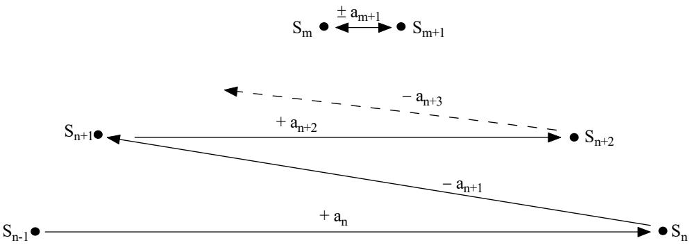

You can see that any partial sum $S _ { m }$ lies between any two consecutive previous partial sums. It follows that the distance between any two partial sums is less than the distance between any two consecutive previous partial sums, but this last distance is always $\left| S _ { n - 1 } - S _ { n } \right| = \left| a _ { n } \right|$ . These observations are enough to establish that the partial sums form a Cauchy sequence, so we get convergence.

We now turn to a more precise formulation of these results,one that doesn't depend on a picture. Also,it is annoying to have to deal with the various special cases in alternating series that arise by having to know whether $S _ { n + 1 } = S _ { n } + a _ { n + 1 }$ ， or $S _ { n + 1 } = S _ { n } - a _ { n + 1 }$ (that is,whether $_ { n }$ is even or odd).Fortunately,we have the notion of betweenness introduced in Chapter 1 (Definition 1.5.39) that enables us to deal with both cases at once. However, if you skipped the material on betweenness, Or would rather have a more concrete proof (maybe using the diagram above for guidance),see exercise 8 on page 128.

In what follows, we will assume that we have an alternating series $\scriptstyle \sum _ { k = 0 } ^ { \infty } s _ { k }$ whose terms eventually weakly decrease (that is,do not increase) in size.All these conditions can be summarized as follows.

For some $N$ ， $s _ { k + 1 } = r _ { k + 1 } \cdot s _ { k }$ with $- 1 \leq r _ { k + 1 } \leq 0$ for $k \geq N$

PROPOSITION 3.3.32 Suppose the sequence ( $s _ { k }$ ） weakly decreases for $k \geq N$ . Then, for $m > n \geq N$ ， the partial sum $S _ { m }$ lies between the sums $S _ { n }$ and $S _ { n + 1 }$

Proof. By a previous result on betweenness (Proposition 1.5.42),it suffices to show that if we take any $k > N$ and consider three consecutive terms $S _ { k }$ ， $S _ { k + 1 }$ and $S _ { k + 2 }$ ， then the third term is between the first two.To prove this,it suffces to show that $| S _ { k + 1 } - S _ { k } | = | S _ { k + 1 } - S _ { k + 2 } | + | S _ { k + 2 } - S _ { k } |$ (by Proposition 1.5.44). Here is the

computation:

$$
\begin{array} { r l } & { | S _ { k + 1 } - S _ { k + 2 } | + | S _ { k + 2 } - S _ { k } | = | - s _ { k + 2 } | + | s _ { k + 2 } + s _ { k + 1 } | } \\ & { \qquad = | r _ { k + 2 } | | s _ { k + 1 } | + | r _ { k + 2 } s _ { k + 1 } + s _ { k + 1 } | } \\ & { \qquad = - r _ { k + 2 } | s _ { k + 1 } | + | r _ { k + 2 } + 1 | | s _ { k + 1 } | } \\ & { \qquad = - r _ { k + 2 } | s _ { k + 1 } | + ( r _ { k + 2 } + 1 ) | s _ { k + 1 } | } \\ & { \qquad = | s _ { k + 1 } | } \\ & { \qquad = | S _ { k + 1 } - S _ { k } | . } \end{array}
$$

(Note that we have used the fact that $- 1 \leq r _ { k + 1 } \leq 0$ several times.）■

COROLLARY 3.3.33（ALTERNATING SERIES TEST） $I f ( s _ { k } )$ is alternating, weakly decreasing for $k > N$ ，and $s _ { k } \to 0$ ，then

1. ( $S _ { k }$ ） converges to a limit $S$ , and for each $n \geq N$ ， $S$ is between $S _ { n }$ and $S _ { n + 1 }$

Proof. We want to show that ( $S _ { n }$ ） is a Cauchy sequence. The betweenness result from the previous proposition tells us that

$$
\left| \sum _ { k = 0 } ^ { n + 1 } s _ { k } - \sum _ { k = 0 } ^ { n } s _ { k } \right| = \left| \sum _ { k = 0 } ^ { n + 1 } s _ { k } - \sum _ { k = 0 } ^ { m } s _ { k } \right| + \left| \sum _ { k = 0 } ^ { m } s _ { k } - \sum _ { k = 0 } ^ { n } s _ { k } \right|
$$

or, performing the subtractions,

$$
\left| s _ { n + 1 } \right| = \left| \sum _ { k = n + 2 } ^ { m } s _ { k } \right| + \left| \sum _ { k = n + 1 } ^ { m } s _ { k } \right| .
$$

The at eqationtl sat $\begin{array} { r } { \left| \sum _ { k = n + 1 } ^ { m } s _ { k } \right| \leq | s _ { n + 1 } | \to 0 } \end{array}$ , independent of $_ { m }$ This makes ( $S _ { n }$ ）a Cauchy sequence, so $( S _ { n } ) \to L$ for some $L$

On the other hand, we can choose $N$ so that for $m > N$ ， $| S _ { m } - L | < \epsilon / 2$ (for any $\epsilon > 0$ ). Then by the triangle inequality we have

$$
\begin{array} { r c l } { | S _ { n + 1 } - L | } & { \leq } & { \left| S _ { n + 1 } - S _ { m } \right| + \left| S _ { m } - L \right| } \\ { \left| L - S _ { n } \right| } & { \leq } & { \left| L - S _ { m } \right| + \left| S _ { m } - S _ { n } \right| , } \end{array}
$$

and adding yields

$$
| S _ { n + 1 } - L | + | L - S _ { n } | \leq | S _ { n + 1 } - S _ { n } | + \epsilon .
$$

Since $\epsilon$ was arbitrary, $| S _ { n + 1 } - L | + | L - S _ { n } | \leq | S _ { n + 1 } - S _ { n } |$ .One can show the reverse inequality similarly, so $| S _ { n + 1 } - L | + | L - S _ { n } | = | S _ { n + 1 } - S _ { n } |$ . This completes the proof.■

Since alternating series are so common, we summarize the results of Corollry 3.3.33 as follows.

SUMMARY 3.3.34 An alternating series whose terms decrease in absolute value to 0 converges, and

1. The limit lies between any two consecutive partial sums.

2. The truncation error is less than the absolute value of the first term dropped.

DEFINITION 3.3.35 The alternating harmonic series $A$ is given by

$$
\sum _ { k = 0 } ^ { \infty } { \frac { ( - 1 ) ^ { k } } { k + 1 } } = 1 - { \frac { 1 } { 2 } } + { \frac { 1 } { 3 } } - { \frac { 1 } { 4 } } + \cdots
$$

COROLLARY 3.3.36 The alternating harmonic series converges but does not converge absolutely (i.e. it is conditionally convergent).

(In fact, the limit of the alternating harmonic series is the number we called $\ln { 2 }$ in exercise 2 on page 42 of Chapter 1. Proving this is an exercise at the end of this section.)

Here are some examples related to the Euler number $^ e$ ,although we don't have the machinery yet to prove this connection (we will when we do power series； see Example 7.3.33).

EXAMPLE 3.3.37 First we look at a series of positive terms, defined as follows:

$$
\begin{array} { r c l } { { e _ { 0 } } } & { { = } } & { { 1 , e _ { k + 1 } = { \cfrac { e _ { k } } { k + 1 } } } } \\ { { } } & { { } } & { { } } \\ { { E _ { n } } } & { { = } } & { { \displaystyle \sum _ { k = 0 } ^ { n } e _ { k } = \sum _ { k = 0 } ^ { n } { \cfrac { 1 } { k ! } } } } \\ { { } } & { { } } & { { } } \\ { { \displaystyle \sum _ { k = 0 } ^ { \infty } e _ { k } } } & { { = } } & { { \displaystyle 1 + { \cfrac { 1 } { 1 ! } } + { \cfrac { 1 } { 2 ! } } + \dots + { \cfrac { 1 } { n ! } } + \dots . } } \end{array}
$$

Note that the quotients $r _ { k + 1 } = { \frac { e _ { k + 1 } } { e _ { k } } } = { \frac { 1 } { k + 1 } } \to 0$ as $k  \infty$ . Thus, the series converges by the ratio test; let the limit be $E$ . In fact, as we will see in section 7.3 on power series, $E$ is actually the Euler numbere already defined (Definition 2.4.7). Since the partial sums are increasing, we have $E _ { n + 1 } \leq E$ for any $_ { n }$ . By the second part of Proposition 3.3.21 we have

$$
{ \begin{array} { l c l } { E _ { n + 1 } } & { \leq } & { E \leq E _ { n } + { \cfrac { 1 } { 1 - r _ { k + 2 } } } e _ { k + 1 } } \\ & { = } & { E _ { n } + { \cfrac { 1 } { 1 - { \cfrac { 1 } { n + 2 } } } } { \cfrac { 1 } { ( n + 1 ) ! } } } \\ & { = } & { E _ { n } + { \cfrac { 1 } { n ! } } { \cfrac { 1 } { \left( n + 1 - { \frac { n + 1 } { n + 2 } } \right) } } } \\ & { \leq } & { E _ { n } + { \cfrac { 1 } { n ! n } } } \end{array} }
$$

Letting $n = 1 , 2 , 3$ gives us the estimates

$$
\begin{array} { c } { { 1 + 1 + 1 / 2 < E < 1 + 1 + 1 } } \\ { { 1 + 1 + 1 / 2 + 1 / 6 < E < 1 + 1 + 1 / 2 + 1 / 4 } } \\ { { 2 + \displaystyle \frac { 5 1 } { 7 2 } < E < 2 + \displaystyle \frac { 5 2 } { 7 2 } , } } \end{array}
$$

or,roughly, $E \approx 2 . 7 2$

Now let's make the preceding into an alternating series by defining $a _ { 0 } = 1$ and $r _ { k + 1 } = - \frac { a _ { k } } { k + 1 }$ -；thus, ，

$$
\sum _ { k = 0 } ^ { \infty } a _ { k } = \sum _ { k = 0 } ^ { \infty } { \frac { ( - 1 ) ^ { k } } { ( k + 1 ) ! } } = 1 - { \frac { 1 } { 1 ! } } + { \frac { 1 } { 2 ! } } - { \frac { 1 } { 3 ! } } + { \frac { 1 } { 4 ! } } - \cdots
$$

The alternating series test tells us that this converges to some number $A$ .For $n = 3$ ， we have the estimate

$$
A = \sum _ { k = 0 } ^ { 3 } { \frac { ( - 1 ) ^ { k } } { ( k + 1 ) ! } } \pm { \frac { 1 } { 5 ! } } ,
$$

or

$$
A = { \frac { 9 } { 2 4 } } \pm { \frac { 1 } { 1 2 0 } }
$$

This give us $0 . 3 6 6 7 < A < 0 . 3 8 3 3$ . As we shall see later, $A = 1 / e \approx 0 . 3 6 7 9$

Although the comparison and ratio tests only tell us when a series is absolutely convergent, there are also useful tests for conditional convergence,due to Dirichlet and Abel.

THEOREM 3.3.38（DIRICHLET's TEST） Suppose $\left( a _ { k } \right)$ and ( $b _ { k }$ ） are sequences that have the following properties:

2. The partial sums $\textstyle B _ { n } = \sum _ { k = 0 } ^ { n } b _ { k }$ are all bounded by some number $B$ (that is, $\left. B _ { n } \right. \leq B$ for all $_ { n }$ ）

Then the series $\scriptstyle \sum _ { k = 0 } ^ { \infty } a _ { k } b _ { k }$ conuerges.

Proof. An outline of the proof is in the exercises.I

EXAMPLE 3.3.39 The series $\scriptstyle \sum _ { k = 1 } ^ { \infty } \left( \sin k x \right) / k$ and $\scriptstyle \sum _ { k = 1 } ^ { \infty } \left( \cos k x \right) / k$ (with $_ x$ not a multiple of $2 \pi$ ） converge. We show the first of these converges. Here we have $a _ { k } =$ $1 / k$ and $b _ { k } = \sin { k x }$ . A standard formula from trigonometry, derived from the formulas for $\sin ( A + B )$ and $\cos ( A { + } B )$ , gives $\cos ( u ) - \cos ( v ) = - 2 \sin \left( { \frac { u + v } { 2 } } \right) \sin \left( { \frac { u - v } { 2 } } \right) .$

Replacing u by $( k + { \frac { 1 } { 2 } } ) x$ and $v$ by $\ ( k - \textstyle { \frac { 1 } { 2 } } ) x$ ， solving for $\mathrm { s i n } ( k x )$ ， and noticing the telescoping (cancellation of almost all terms)， we see that

$$
\begin{array} { r c l } { { { \cal B } _ { n } } } & { { = } } & { { \displaystyle \sum _ { k = 1 } ^ { n } \sin k x } } \\ { { } } & { { = } } & { { \displaystyle \frac { - 1 } { 2 \sin \displaystyle \frac { x } { 2 } } \left[ \cos \left( \displaystyle \frac { 2 n + 1 } { 2 } \right) x - \cos \displaystyle \frac { 1 } { 2 } x \right] } } \\ { { } } & { { = } } & { { \displaystyle \frac { 1 } { \sin \displaystyle \frac { x } { 2 } } \left( \sin \displaystyle \frac { ( n + 1 ) x } { 2 } \sin \displaystyle \frac { n x } { 2 } \right) . } } \end{array}
$$

Thus, $\left| B _ { n } \right| \leq \left| { \frac { 1 } { \sin { \frac { x } { 2 } } } } \right|$ so the $B _ { n }$ when $\sin ( x / 2 ) = 0$ the series is identically O, so converges anyway.)

Note,however， that both of these series converge conditionally - in fact, the series $\sum _ { k = 1 } ^ { \infty } { \left| \frac { \sin k x } { k } \right| } ~ a n d \sum _ { k = 1 } ^ { \infty } { \left| \frac { \cos k x } { k } \right| }$ diverge (see erercises).

COROLLARY 3.3.40 （ABEL's TEST） If $( a _ { k } )$ is a decreasing (or increasing) sequence of non-negativenumbers which conuerges and $\scriptstyle \sum _ { k = 0 } ^ { \infty } b _ { k }$ converges, then $\scriptstyle \sum _ { k = 0 } ^ { \infty } a _ { k } b _ { k }$ converges.

Proof. The partial sums of $\scriptstyle \sum _ { k = 0 } ^ { \infty } b _ { k }$ are bounded. Suppose $( a _ { k } ) \to a$ and apply Dirichlet’s test using the sequence $( a _ { k } - a )$ (or $\left( a - a _ { k } \right)$ when $\left( a _ { k } \right)$ is increasing). $\lfloor$

We conclude by returning to a result we have already proved: if a series converges, its terms go to $0$ . The following proposition shows the equivalence between a sequence going to O and the divergence of a related series. We will use this result later to study binomial series.

PROPOSITION 3.3.41 Let ( ) be a decreasing sequence of positive numbers and define $b _ { k } = 1 - \frac { a _ { k + 1 } } { a _ { k } }$ +1;supposethatb→ask→o.Tenak→ifand onlyif $\scriptstyle \sum _ { k = 0 } ^ { \infty } b _ { k }$ diverges.

of both sides, we have Proof. For ， $a _ { n } = a _ { 1 } ( 1 - b _ { 1 } ) ( 1 - b _ { 2 } ) \cdots ( 1 - b _ { n - 1 } )$ $\begin{array} { r } { \ln a _ { n } \ = \ \sum _ { k = 1 } ^ { n - 1 } \ln ( 1 - b _ { k } ) } \end{array}$ Thus $a _ { n } \ \to \ 0$ .Therefore, taking ln if and only if $\operatorname* { l i m } _ { n  \infty } \sum _ { k = 0 } ^ { n - 1 } - \ln ( 1 - b _ { k } ) = \infty$ Since $b _ { k } \to 0$ $\operatorname* { l i m } _ { k \to \infty } { \frac { - \ln ( 1 - b _ { k } ) } { b _ { k } } } = 1$ -ln(1-6k）=1(say byTHopital's nile,wichwellrveate $\scriptstyle \sum _ { k = 0 } ^ { n - 1 } - \ln ( 1 - b _ { k } )$ divegesif and gnl f $\scriptstyle \sum _ { k = 0 } ^ { \infty } b _ { k }$ diverges,by the limit comparison test (Theorem 3.3.19)，so $a _ { n } \to 0$ if and only if $\scriptstyle \sum _ { k = 0 } ^ { \infty } b _ { k }$ diverges.

# Exercises

1. Prove the following, which was left unproved in the text.

PROPOSITION 3.3.11. For any $n \geq 0$ ，(a) $\scriptstyle \sum _ { k = 0 } ^ { \infty } s _ { k }$ converges fad only f $\scriptstyle \sum _ { k = 0 } ^ { \infty } s _ { n + 1 + k }$ converges.(b） When $\scriptstyle \sum _ { k = 0 } ^ { \infty } s _ { k }$ converges, $\textstyle \sum _ { k = 0 } ^ { \infty } s _ { k } = S _ { n } + \sum _ { k = 0 } ^ { \infty } s _ { n + 1 + k }$

2. We have se at $\sum _ { k = 1 } ^ { \infty } { \frac { 1 } { k ^ { p } } }$ converge for $p > 1$ harmonieseiess $\sum _ { k = 1 } ^ { \infty } { \frac { 1 } { k } }$

(a) Prove that $\scriptstyle \sum _ { k = 1 } ^ { \infty } { \frac { 1 } { k ^ { p } } }$ diverges for $p \leq 1$ (b) Prove that ∑κ=1 s converges absolutely for $p > 1$ and all $_ x$ (c) Does $\scriptstyle \sum _ { k = 1 } ^ { \infty } { \frac { k ^ { 2 } - 1 } { k ^ { 3 } + k + 1 } }$ conerge? Whataboat $\scriptstyle \sum _ { k = 1 } ^ { \infty } { \frac { k ^ { 2 } - 1 } { k ^ { 4 } + k + 1 } } .$ (d) Do either of $\scriptstyle \sum _ { k = 1 } ^ { \infty } \cos ( 1 / k )$ or $\scriptstyle \sum _ { k = 1 } ^ { \infty } \sin ( 1 / k )$ converge?

3.(Ratio test） Discuss the convergence or divergence of

$$
\begin{array} { r l } & { \sum _ { k = 1 } ^ { \infty } \frac { k ! } { k ^ { k } } } \\ & { \sum _ { k = 1 } ^ { \infty } \frac { 2 ^ { k } k ! } { k ^ { k } } } \\ & { \sum _ { k = 1 } ^ { \infty } \frac { 3 ^ { k } k ! } { k ^ { k } } } \\ & { \sum _ { k = 1 } ^ { \infty } \frac { 3 ^ { k } k ! } { k ^ { k } } } \\ & { \sum _ { k = 1 } ^ { \infty } \frac { a ^ { k } k ! } { k ^ { k } } \mathrm { ~ ( W h a t ' s ~ t h e ~ c u t - o f f ~ f o r ~ } a ? ) } \end{array}
$$

4.The harmonic seriesint theonlyone:showthat $\scriptstyle \sum _ { k = 1 } ^ { \infty } \left( { \sqrt { k + 1 } } - { \sqrt { k } } \right)$ diverges even though $\operatorname* { l i m } _ { k  \infty } { ( { \sqrt { k + 1 } } - { \sqrt { k } } ) } = 0$ It wll behelpfhl ise

$$
\left( { \sqrt { k + 1 } } - { \sqrt { k } } \right) \left( { \sqrt { k + 1 } } + { \sqrt { k } } \right) = 1 .
$$

5.Prove thtif $\textstyle \sum _ { k = 1 } ^ { \infty } a _ { k } \to L$ and $\textstyle \sum _ { k = 1 } ^ { \infty } b _ { k } \to M$ ,then $\textstyle \sum _ { k = 1 } ^ { \infty } \left( a _ { k } + b _ { k } \right) \to L + M$ Prove that $\scriptstyle \sum _ { k = 1 } ^ { \infty } a _ { k } b _ { k }$ converges also. Does it converge to $L M$ ？Explain.

6.One of the consequences of the divergence of the harmonic series is that there are infinitely many primes. Here is an outline of a proof from Ivan Niven; rewrite,it filling in all the reasoning.

(a) Let ∑k<n denote the sum of the reciprocals of those numbers $k < n$ which are square-free (i.e. not divisible by the square of a whole number other than 1). Since every number is uniquely a product of a square and a square-free number

$$
\left( \sum _ { k < n } ^ { \prime } { \frac { 1 } { k } } \right) \left( \sum _ { j < n } { \frac { 1 } { j ^ { 2 } } } \right) \geq \sum _ { m < n } { \frac { 1 } { m } } .
$$

This shows that ∑k<n is unbounded (why?).

(b) $e ^ { x } > 1 + x$ (Corollary 2.4.12).

(c） Suppose that $\sum _ { p < n } { \frac { 1 } { p } }$ is bounded by $B$ ，where $p$ runs over primes less than $_ n$ . Then

$$
e ^ { B } > \exp \left( \sum _ { p < n } \frac { 1 } { p } \right) = \prod _ { p < n } \exp ( 1 / p ) > \prod _ { p < n } ( 1 + 1 / p ) \geq \sum _ { k < n } ^ { \prime } \frac { 1 } { k } .
$$

(d) There must be infinitely many primes.

7. The hyperbolic Bessel function $I _ { o } ( x )$ is given by the series

$$
I _ { 0 } ( x ) = \sum _ { k = 0 } ^ { \infty } \frac { x ^ { 2 k } } { 4 ^ { k } ( k ! ) ^ { 2 } } .
$$

(a) Discuss the convergence of this series for particular values of $_ { x }$ (b) Use the truncation estimate of Theorem 3.3.22 to approximate the error when the series for $I _ { 0 } ( 2 )$ is chopped off after 20 terms.

8. (Alternating series without betweenness theory). Let us write an alternating series as

$$
\sum _ { k = 0 } ^ { \infty } ( - 1 ) ^ { k } a _ { k } = a _ { 0 } - a _ { 1 } + a _ { 2 } - a _ { 3 } + \cdots ,
$$

sum where the $\scriptstyle \sum _ { k = 0 } ^ { m } ( - 1 ) ^ { k } a _ { k }$ $a _ { k }$ are non-negative and decreasing to $0$ . Denote by $S _ { n }$ the partial

(a) Prove that $S _ { n - 1 } \leq S _ { n } \leq S _ { n - 2 }$ if $_ { n }$ is even, and $S _ { n - 2 } \leq S _ { n } \leq S _ { n - 1 }$ if $_ n$ is odd.

(b） Use the previous part to show that

$$
| S _ { n } - S _ { m } | + | S _ { m } - S _ { n - 1 } | = | S _ { n } - S _ { n - 1 } |
$$

for $n < m$ . Explain why this gives us Cauchy convergence.

(c) Prove the two parts of the alternating series test (Corollary 3.3.33).

9. Show that the terms of this alternating series are eventually decreasing to $0$ for any $A$ ：

$$
1 - { \frac { A ^ { 2 } } { 2 ! } } + { \frac { A ^ { 4 } } { 4 ! } } - { \frac { A ^ { 6 } } { 6 ! } } + \cdot \cdot \cdot \pm { \frac { A ^ { 2 k } } { ( 2 k ) ! } } \mp \cdot \cdot \cdot
$$

(As far as convergence goes, however, it is actually absolutely convergent.) What will the truncation error be after $_ n$ terms?

10.In Exercise 2 on page 42 the numbers $\ln { 2 }$ and $\pi / 4$ were defined. Using these definitions, prove that

$$
\begin{array} { r l } & { \ln 2 = 1 - \frac { 1 } { 2 } + \frac { 1 } { 3 } - \frac { 1 } { 4 } + \cdot \cdot \cdot = \sum _ { k = 1 } ^ { \infty } ( - 1 ) ^ { k + 1 } \frac { 1 } { k } . } \\ & { \pi / 4 = 1 - \frac { 1 } { 3 } + \frac { 1 } { 5 } - \frac { 1 } { 7 } \cdot \cdot \cdot = \sum _ { k = 1 } ^ { \infty } ( - 1 ) ^ { k + 1 } \frac { 1 } { 2 k - 1 } . } \end{array}
$$

(Prove these statements by showing that the partial sums of these series lie in every one of the intervals defining the numbers $\ln 2$ and $\pi / 4$

11. The following sequence of ideas is borrowed from [Spivak, 1994]. We suppose that $f$ is a function on $\mathbb { R }$ with the property that $| f ( y ) - f ( x ) | \leq c | y - x |$ for all $x , y$ in some interval $I$ ，with $c < 1$ . Such a function is called a contraction map.

(a) Suppose that $\left( a _ { n } \right)$ is a sequence such that $| a _ { n } - a _ { n + 1 } | < c ^ { n }$ where $c < 1$ Prove that ( $u _ { n }$ ) is a Cauchy sequence. (Hint: Sum the series $c ^ { m } + c ^ { m + 1 } +$ $\cdots + c ^ { n }$ .）   
(b) Prove that for any $_ x$ ， the sequence $x , f ( x ) , f ( f ( x ) ) , f ( f ( f ( x ) ) ) , \ldots$ isa Cauchy sequence.   
(c) Use the previous part to show that $f$ has a fixed point (i.e. a number $_ u$ such that $f ( u ) = u$ ）   
(d) Prove that $f$ has only one fixed point.

12.Here is an outline of the proof of Dirichlet's test for conditional convergence (Theorem 3.3.38).

(a) Since $b _ { n } = B _ { n } - B _ { n - 1 }$ we have $\begin{array} { r } { \sum _ { k = 1 } ^ { n } a _ { k } b _ { k } = \sum _ { k = 1 } ^ { n - 1 } B _ { k } ( a _ { k } - a _ { k + 1 } ) + a _ { n } B _ { n } } \end{array}$ (this formula is sometimes called partial or Abel summation.)   
(b) $\begin{array} { r } { \sum _ { k = 1 } ^ { n - 1 } | B _ { k } ( a _ { k } - a _ { k + 1 } ) | \leq \sum _ { k = 1 } ^ { n - 1 } B ( a _ { k } - a _ { k + 1 } ) = \ ? } \end{array}$ S0 $\begin{array} { r } { \sum _ { k = 1 } ^ { n - 1 } B _ { k } ( { a } _ { k } - { a } _ { k + 1 } ) } \end{array}$ is absolutely convergent.   
(c） $a _ { n } B _ { n } \to 0$ ; why?   
(d） $\scriptstyle \sum _ { k = 1 } ^ { \infty } a _ { k } b _ { k }$ converges.

13. Prove that ∑=1 $\sum _ { k = 1 } ^ { \infty } \left( { \frac { k } { k + 1 } } \right) ^ { k ( k + 1 ) } { \mathrm { c o n v e r g e s } } .$

14. Basically, the alternating series test says that if ( to $0$ ，then the series $\scriptstyle \sum _ { k = 0 } ^ { \infty } ( - 1 ) ^ { k } a _ { k }$ converges. $a _ { k }$ ) is a sequence that decreases Show thatthis follows from Dirichlet's test (Theorem 3.3.38).

15. Prove that $\scriptstyle \sum _ { k = 1 } ^ { \infty } \left( \cos k x \right) / k$ converges provided $_ { x }$ is not a multiple of $2 \pi$ (see a similar proof for $\scriptstyle \sum _ { k = 1 } ^ { \infty } \left( \sin k x \right) / k$ in Example 3.3.39).

16. Prove that $\scriptstyle \sum _ { k = 1 } ^ { \infty } | ( \sin k x ) / k |$ diverges when $_ { x }$ is not a multiple of $\pi$ (we already know that it converges without the absolute value signs—see the previous exercise and Example 3.3.39).

(Hint: Use the formula:

$$
{ \frac { 1 } { k } } = { \frac { \cos ^ { 2 } k x - \sin ^ { 2 } k x } { k } } + { \frac { 2 \sin ^ { 2 } k x } { k } } = { \frac { \cos 2 k x } { k } } + { \frac { 2 \sin ^ { 2 } k x } { k } }
$$

and the fact that $\sum _ { k = 1 } ^ { \infty } { \frac { \cos 2 k x } { k } }$ converges to deduce that $\sum _ { k = 1 } ^ { \infty } { \frac { \sin ^ { 2 } k x } { k } }$ diverges.   
But $0 \leq \sin ^ { 2 } k x \leq | \sin k x |$ ）

17. Prove that $\sum _ { k = 1 } ^ { \infty } \left| { \frac { \cos k x } { k } } \right|$ diverges,using the ideas of the previous exercise.

18.Prove that $\sum _ { k = 1 } ^ { \infty } { \frac { \sin k } { k } } \left( 1 + { \frac { 1 } { 2 } } + \cdots + { \frac { 1 } { k } } \right)$ converges. (Hint: See Example 3.3.39 and look at $a _ { k } = { \frac { 1 } { k } } \left( 1 + { \frac { 1 } { 2 } } + \cdots + { \frac { 1 } { k } } \right)$

# Appendix I: Some Properties of Exp and Log

We prove here some properties of the exponential and logarithm function that were stated in Section 3.2.

PROPOSITION 3.2.11 For $n \in \mathbb N$ $( 1 + 1 / n ) ^ { n } \to e$ as $n \to \infty$

Proof. Put $\textit { a } = \textit { e }$ into the inequalities for $L ( a )$ in Remark 2.4.4. Noting that $L ( a ) = \log _ { e } ( a )$ (so $L ( e ) = 1$ ),we get the inequalities (for $0 < x < 1$ ）

$$
\frac { 1 } { e ^ { x } } - 1 \geq - x
$$

or

$$
e ^ { x } \leq { \frac { 1 } { 1 - x } } = 1 + { \frac { x } { 1 - x } }
$$

and

$$
x \leq e ^ { x } - 1
$$

or

$$
1 + x \leq e ^ { x } .
$$

Putting these together and taking $_ { x }$ th roots gives

$$
( 1 + x ) ^ { 1 / x } \leq e \leq \left( 1 + { \frac { x } { 1 - x } } \right) ^ { 1 / x } .
$$

(Note that the restriction $x < 1$ applies only to the right inequality.)

Let $_ { n }$ be an integer greater than 1. Taking $x = 1 / n$ ，we get $( 1 + 1 / n ) ^ { n } \leq e$ Taking $x = 1 / ( n + 1 )$ ， we get $e \leq ( 1 + 1 / n ) ^ { n + 1 }$ .But

$$
\left( 1 + { \frac { 1 } { n } } \right) ^ { n + 1 } = \left( 1 + { \frac { 1 } { n } } \right) ^ { n } + { \frac { 1 } { n } } \left( 1 + { \frac { 1 } { n } } \right) ^ { n } \leq \left( 1 + { \frac { 1 } { n } } \right) ^ { n } + { \frac { e } { n } } .
$$

Therefore

$$
e - { \frac { e } { n } } \leq \left( 1 + { \frac { 1 } { n } } \right) ^ { n } \leq e ,
$$

which shows that $| ( 1 + 1 / n ) ^ { n } - e | \leq e / n < 4 / n$ ■

PROPOSITION 3.2.12 For al $x > 0$ ， $x / ( 1 + x ) \leq \log ( 1 + x ) \leq x$

Proof. Taking logarithms of the two sides of the left inequality in $( * )$ ，we get $( 1 / x ) \log ( 1 + x ) \leq 1$ or $\log ( 1 + x ) \leq x$

By the right inequality in $( * )$ ，we have

$$
e \leq \left( 1 + \frac { t } { 1 - t } \right) ^ { 1 / t }
$$

for $0 < t < 1$ . Now let $x = t / ( 1 - t )$ in the inequality above to get

$$
e \leq ( 1 + x ) ^ { 1 + 1 / x } .
$$

Note that we have $x \in ( 0 , \infty )$ . Taking logarithms of both sides of the inequality above shows that

$$
1 \leq \left( 1 + { \frac { 1 } { x } } \right) \log ( 1 + x )
$$

or

$$
{ \frac { x } { 1 + x } } \leq \log ( 1 + x ) .
$$

As long as $a > 0$ , the exponential function $a ^ { x }$ dominates any power function $x ^ { k }$ That is the content of the following.

PROPOSITION 3.2.13 Giuen $n \in N$ ， $t > 0$ ，and $k \geq 0$ ，

$$
{ \frac { ( 1 + t ) ^ { n } } { n ^ { k } } } \to \infty { \mathrm { ~ a s ~ } } n \to \infty .
$$

Proof. Let $\lambda = \ln ( 1 + t )$ . Then $1 + t = e ^ { \lambda }$ , and therefore

$$
{ \frac { ( 1 + t ) ^ { n } } { n ^ { k } } } = e ^ { \lambda n - k \ln n } .
$$

Let $m = { \sqrt { n } }$ Then $\lambda n - k \ln n = \lambda m ^ { 2 } - 2 k \ln m$ ,and by Proposition 3.2.12, $\ln m \leq$ $m - 1 < m$ . So

$$
\lambda n - k \ln n \geq \lambda m ^ { 2 } - 2 k m = \sqrt { n } ( \lambda \sqrt { n } - 2 k ) .
$$

But

$$
\lambda \sqrt { n } - 2 k \geq 1 \iff n \geq \left( \frac { 1 + 2 k } { \lambda } \right) ^ { 2 } .
$$

Soif $\begin{array} { r } { n \ge \left( \frac { 1 + 2 k } { \lambda } \right) ^ { 2 } = \left( \frac { 1 + 2 k } { \ln ( 1 + t ) } \right) ^ { 2 } } \end{array}$ we hare:

$$
\begin{array} { l c l } { \frac { ( 1 + t ) ^ { n } } { n ^ { k } } } & { = } & { e ^ { \lambda n - k \ln n } } \\ & { \geq } & { e ^ { \sqrt { n } ( \lambda \sqrt { n } - 2 k ) } } \\ & { \geq } & { e ^ { \sqrt { n } } } \\ & { \geq } & { 1 + \sqrt { n } > \sqrt { n }  \infty } \end{array}
$$

COROLLARY 3.2.14 For $_ { x }$ with $| x | < 1$ and any $k \geq 0$ ， $n ^ { k } x ^ { n }  0$

Proof. By $\epsilon$ -trichotomy, we can separate into the cases $| x | > 0$ and $| x |$ within, say, $1 / 2$ of $0$ .For $| x | > 0$ ,let $1 / \left| x \right| = 1 + t$ .Then $t > 0$ ，and

$$
{ \frac { ( 1 + t ) ^ { n } } { n ^ { k } } } \to \infty \quad { \mathrm { i m p l i e s } } \quad { \frac { n ^ { k } } { ( 1 + t ) ^ { n } } } \to 0 ,
$$

so $n ^ { k } x ^ { n }  0$

For $| x |$ near $0$ ,take $\delta = ( 1 - | x | ) / 2$ and let $1 + t = 1 / ( | x | + \delta )$ . Now use the same proof. $\lfloor$

Just as exponential functions dominate powers of $_ x$ , log functions are dominated by powers of $_ { x }$ . More precisely, we have the following.

COROLLARY 3.2.16 If $n > 0$ then,for $x > 0$ ， $\textstyle { \frac { \ln x } { x ^ { n } } } \to 0$ as $x \to \infty$

Proof. Let $y = n \ln x$ ，s0 $x = e ^ { y / n }$ . Then

$$
{ \frac { \ln x } { x ^ { n } } } = { \frac { y / x } { e ^ { y } } } = ( 1 / x ) { \frac { y } { e ^ { y } } } \to 0
$$

by Proposition 3.2.13 above.■

PROPOSITION 3.2.17 $n ^ { 1 / n } \to 1$ as $n \longrightarrow \infty$

Proof. For all $n \in \mathbb N$ ， $n ^ { 1 / n } > 1$ . Therefore,to prove the proposition, we have to show that for each $\epsilon > 0$ ， $n ^ { 1 / n } \leq 1 + \epsilon$ for $n \geq$ some $N ( \epsilon )$ But

$$
n ^ { 1 / n } \leq 1 + \epsilon \iff n \leq ( 1 + \epsilon ) ^ { n } \iff \sqrt { n } \leq \frac { ( 1 + \epsilon ) ^ { n } } { \sqrt { n } } .
$$

From the proof of Proposition 3.2.13 above (taking $k = 1 / 2$ ),this last inequality will hold providing $\begin{array} { r } { n \ge \left( \frac { 2 } { \ln ( 1 + \epsilon ) } \right) ^ { 2 } } \end{array}$

COROLLARY 3.2.18 For any polynomial $P ( n ) = a _ { 0 } + a _ { 1 } n + \cdot \cdot \cdot + a _ { k } n ^ { k }$ with $a _ { k } > 0$ ， $( P ( n ) ) ^ { 1 / n } \to 1$ as $n \longrightarrow \infty$

# Appendix Il: Rearrangements of Series

DEFINITION 3.3.42 A rearrangementof q series $\scriptstyle \sum _ { k = 0 } ^ { \infty } s _ { k }$ is q series $\scriptstyle \sum _ { k = 0 } ^ { \infty } t _ { k }$ where each term of the first series appears exactly once in the second, and each term of the second appears exactly once in the first.

A more technical way of saying this is to define a permutation of the natural ience $\sigma : \mathbb { N }  \mathbb { N }$ $o$ $\scriptstyle \sum _ { k = 0 } ^ { \infty } s _ { k }$ $\scriptstyle \sum _ { k = 0 } ^ { \infty } s _ { \sigma ( k ) }$ $O$

EXAMPLE 3.3.43 Starting with $s _ { 0 } + s _ { 1 } + s _ { 2 } + s _ { 3 } + \cdot \cdot \cdot$ ， we group consecutive even and odd terms:

$$
\underbrace { s _ { 0 } } _ { t _ { 0 } } + \underbrace { s _ { 2 } } _ { t _ { 1 } } + \underbrace { s _ { 1 } } _ { t _ { 2 } } + \underbrace { s _ { 3 } } _ { t _ { 3 } } + \underbrace { s _ { 4 } } _ { t _ { 4 } } + \underbrace { s _ { 6 } } _ { t _ { 5 } } + \underbrace { s _ { 5 } } _ { t _ { 6 } } + \underbrace { s _ { 7 } } _ { t _ { 7 } } + \underbrace { s _ { 7 } } _ { t _ { 7 } } + \cdot \cdot \cdot
$$

This corresponds to the permutation $o$ where

$$
\sigma ( 4 k + r ) = \left\{ \begin{array} { l l } { 4 k + r } & { i f r = 0 \ o r \ 3 } \\ { 4 k + r + 1 } & { i f r = 1 } \\ { 4 k + r - 1 } & { i f r = 2 } \end{array} \right. .
$$

(Note that any natural number $_ { n }$ can be written uniquely at $4 k + r$ where $0 \leq r < 4$ is the remainder when $_ { n }$ is divided by 4).

What happens to convergence when we rearrange? Answer: it's unpredictable. Here's a classic example.

EXAMPLE 3.3.44 We have seen that the alternating harmonic series $1 - \frac { 1 } { 2 } + \frac { 1 } { 3 } -$ ${ \frac { 1 } { 4 } } + \cdots$ converges to some number $L$ . (We will see in a later chapter that $L = \ln 2$ ） Now consider the rearrangement formed when we pair one positive term with two negative ones and add them.

$$
{ \begin{array} { r l } & { \left( 1 - { \frac { 1 } { 2 } } - { \frac { 1 } { 4 } } \right) + \left( { \frac { 1 } { 3 } } - { \frac { 1 } { 6 } } - { \frac { 1 } { 8 } } \right) + \left( { \frac { 1 } { 5 } } - { \frac { 1 } { 1 0 } } - { \frac { 1 } { 1 2 } } \right) + \cdots } \\ { = } & { \left( 1 - { \frac { 1 } { 2 } } \right) - { \frac { 1 } { 4 } } + \left( { \frac { 1 } { 3 } } - { \frac { 1 } { 6 } } \right) - { \frac { 1 } { 8 } } + \left( { \frac { 1 } { 5 } } - { \frac { 1 } { 1 0 } } \right) - { \frac { 1 } { 1 2 } } + \cdots } \\ { = } & { { \frac { 1 } { 2 } } - { \frac { 1 } { 4 } } + { \frac { 1 } { 6 } } - { \frac { 1 } { 8 } } + { \frac { 1 } { 1 0 } } - { \frac { 1 } { 1 2 } } + \cdots } \\ { = } & { { \frac { 1 } { 2 } } \left( 1 - { \frac { 1 } { 2 } } + { \frac { 1 } { 3 } } - { \frac { 1 } { 4 } } + { \frac { 1 } { 5 } } - { \frac { 1 } { 6 } } + \cdots \right) } \\ { = } & { { \frac { 1 } { 2 } } L } \end{array} }
$$

Thus, the rearranged series converges to half the sum of the original (i.e. to $\scriptstyle { \frac { 1 } { 2 } } \ln 2$ ）

This may seem unfair-we are going through negative terms twice as fast as positive one-until you realize the we eventually account for every positive term (the curious nature of infinity).

So we see that a rearrangement of a series may not converge to the same thing as the original. This means that one must be very careful in trying to compute limits of series. The issue arises, for example, in defining the product of two series $\begin{array} { r } { \left( \sum _ { k = 0 } ^ { \infty } s _ { k } \right) \left( \sum _ { k = 0 } ^ { \infty } t _ { k } \right) } \end{array}$ Frttelytrot absolutely.

PROPOSITION 3.3.45 If $\scriptstyle \sum _ { k = 0 } ^ { \infty } s _ { k }$ converges absolutely to $L$ , then any rearrangement $\scriptstyle \sum _ { k = 0 } ^ { \infty } t _ { k }$ also converges absolutely to $L$

Proof. Since $\scriptstyle \sum _ { k = 0 } ^ { \infty } | s _ { k } |$ converges, given any $\epsilon > 0$ , we can find an $M ^ { \prime }$ such that

$$
\sum _ { k = m + 1 } ^ { \infty } \left| s _ { k } \right| = \sum _ { k = 0 } ^ { \infty } \left| s _ { k } \right| - \sum _ { k = 0 } ^ { m } \left| s _ { k } \right| < \epsilon / 2
$$

whenever $m \geq M ^ { \prime }$ . This is a restatement of tail convergence (Proposition 3.3.11).

$\scriptstyle \sum _ { k = 0 } ^ { \infty } s _ { k } = L$ $\epsilon$ $M ^ { \prime \prime }$

$$
\left| \left( \sum _ { k = 0 } ^ { m } s _ { k } \right) - L \right| < \epsilon / 2
$$

whenever $m \geq M ^ { \prime \prime }$ . Now let $M = \operatorname* { m a x } ( M ^ { \prime } , M ^ { \prime \prime } )$

Finally, choose $N$ so large that the terms $s _ { 0 } , \ldots , s _ { M }$ are among the $t _ { 0 } , \ldots , t _ { N }$ (this can be done since $M$ is just a finite number). Suppose $n \geq N$ . If we subtract $\sum _ { k = 0 } ^ { M } s _ { k }$ from $\scriptstyle \sum _ { k = 0 } ^ { \pi } t _ { k }$ , we are left with terms $s _ { i }$ whose subscripts are bigger than $M$ . Thus

$$
\left| \sum _ { k = 0 } ^ { n } t _ { k } - \sum _ { k = 0 } ^ { M } s _ { k } \right| \leq \left| \sum _ { k = M + 1 } ^ { \infty } s _ { k } \right| \leq \sum _ { k = M + 1 } ^ { \infty } \left| s _ { k } \right| < \epsilon / 2 .
$$

Now we have

$$
\left| \left( \sum _ { k = 0 } ^ { n } t _ { k } \right) - L \right| \leq \left| \sum _ { k = 0 } ^ { n } t _ { k } - \sum _ { k = 0 } ^ { M } s _ { k } \right| + \left| \left( \sum _ { k = 0 } ^ { M } s _ { k } \right) - L \right|
$$

Having proved that the rearrangement converges,we deduce that the rearrangement $\scriptstyle \sum _ { k = 0 } ^ { \infty } t _ { k }$ convergesabsolutely bcause $\scriptstyle \sum _ { k = 0 } ^ { \infty } | t _ { k } |$ is a rearrangement of $\scriptstyle \sum _ { k = 0 } ^ { \infty } | s _ { k } |$

In view of this result, there are a number of possibilities for defining the product $\begin{array} { r } { \left( \sum _ { k = 0 } ^ { \infty } s _ { k } \right) \left( \sum _ { k = 0 } ^ { \infty } t _ { k } \right) } \end{array}$ as a series when cach of $\scriptstyle \sum _ { k = 0 } ^ { \infty } s _ { k }$ and $\scriptstyle \sum _ { k = 0 } ^ { \infty } t _ { k }$ converge

absolutely. We just have to find a systematic way of adding allof the products $s _ { i } t _ { j }$ One of the standard ways is to add them on diagonals:

$$
\begin{array} { c c c c c c c c c c c c c c c c c c c c c c } { { } } & { { } } & { { } } & { { } } & { { } } & { { } } & { { } } & { { } } & { { } } & { { } } & { { } } & { { } } & { { } } & { { } } & { { } } & { { } } & { { } } & { { } } & { { } } & { { } } & { { } } & { { } } & { { } } & { { } } & { { } } & { { } } & { { } } & { { } } & { { } } & { { } } & { { } } & { { } } & { { } } & { { } } & { { } } & { { } } & { { } } & { { } } & { { } } & { { } } & { { } } & { { } } & { { } } & { { } } & { { } } & { { } } & { { } } & { { } } & { { } } & { { } } & { { } } & { { } } & { { } } & { { } } & { { } } & { { } } & { { } } & { { } } & { { } } & { { } } & { { } } & { { } } & { { } } & { { } } & { { } } & { { } } & { { } } & { { } } & { { } } & { { } } & { { } } & { { } } & { { } } & { { } } & { { } } & { { } } & { { } } & { { } } & { { } } & { { } } & { { } } & { { } } & { { } } & { { } } & { { } } & { { } } & { { } } & { { } } & { { } } & { { } } & { { } } & { { } } & { { } } & { { } } & { { } } & { { } } & { { } } & { { } } & { { } } & { { } } & { { } } & { { } } & { { } } & { { } } & { { } } & { { } } & { { } } & { { } } & { { } } & { { } } & { { } } & { { } } & \end{array}
$$

If w define $\begin{array} { r } { c _ { n } = \sum _ { i = 0 } ^ { n } s _ { i } t _ { n - i } } \end{array}$ ,then $\textstyle \sum _ { n = 0 } ^ { \infty } c _ { n }$ is a candidate for $\begin{array} { r } { \left( \sum _ { k = 0 } ^ { \infty } s _ { k } \right) \left( \sum _ { k = 0 } ^ { \infty } t _ { k } \right) } \end{array}$ it is called the Cauchy product of the series. When either one or both of the series fails to converge absolutely, the Cauchy product may also fail to converge (see below). On the other hand, we have the following general result.

PROPOSITION 3.3.46 Suppose $\scriptstyle \sum _ { k = 0 } ^ { \infty } s _ { k }$ and $\scriptstyle \sum _ { k = 0 } ^ { \infty } t _ { k }$ converge absolutely to $S$ and $T$ respectively, and suppose the sequence $s _ { i } t _ { j }$ in some order. Then $\scriptstyle \sum _ { k = 0 } ^ { \infty } u _ { k }$ Co $u _ { 0 } , u _ { 1 } , \ldots , u _ { n } , \ldots .$ contains exactly the products to $S T$

Proof. We sketch the proof found in [Spivak, 1994]. If we define

$$
P _ { L } = \sum _ { k = 0 } ^ { L } \left| s _ { k } \right| \sum _ { k = 0 } ^ { L } \left| t _ { k } \right| ,
$$

then the sequence $( P _ { L } )$ converges to $S T$ . This makes ( $P _ { L }$ ） a Cauchy sequence so, for any $\epsilon > 0$ and $L$ and $L ^ { \prime }$ large enough,

$$
\left| \sum _ { k = 0 } ^ { L ^ { \prime } } \left| s _ { k } \right| \sum _ { k = 0 } ^ { L ^ { \prime } } \left| t _ { k } \right| - \sum _ { k = 0 } ^ { L } \left| s _ { k } \right| \sum _ { k = 0 } ^ { L } \left| t _ { k } \right| \right| < \epsilon / 2 .
$$

It follows that.∑_ |sil·Itjl ≤∈/2. Now suppose that $N$ is an integer large $_ i$ or   
enough that the terms $u _ { 0 } , \ u _ { 1 }$ ，..， $u _ { N }$ contain every product $s _ { i } t _ { j }$ for $i , j ~ \leq ~ L$   
Then $\begin{array} { r } { \sum _ { k = 0 } ^ { N } u _ { k } - \sum _ { i = 0 } ^ { L } s _ { i } \sum _ { j = 0 } ^ { L } t _ { j } } \end{array}$ contains only terms $s _ { i } t _ { j }$ where $i > L$ 0r $j > L$   
consequently

$$
\left| \sum _ { k = 0 } ^ { N } u _ { k } - \sum _ { i = 0 } ^ { L } s _ { i } \sum _ { j = 0 } ^ { L } t _ { j } \right| \leq \sum _ { \textit { i } \mathrm { o r } \textit { j } > L } | s _ { i } | \cdot | t _ { j } | \leq \epsilon / 2 .
$$

Also, for $L$ big enough, we have

$$
\left| \sum _ { i = 0 } ^ { \infty } s _ { i } \sum _ { j = 0 } ^ { \infty } t _ { j } - \sum _ { i = 0 } ^ { L } s _ { i } \sum _ { j = 0 } ^ { L } t _ { j } \right| < \epsilon / 2 .
$$

$\begin{array} { r } { \mathrm { W e ~ n o w ~ m a k e } \Big | \sum _ { i = 0 } ^ { \infty } s _ { i } \sum _ { j = 0 } ^ { \infty } t _ { j } - \sum _ { k = 0 } ^ { N } u _ { k } \Big | } \end{array}$ smal y the triage nquality

For more on this, see Exercise 10 on page 252.

# Exercises

1. Let $\begin{array} { r } { \sum _ { k = 0 } ^ { \infty } s _ { k } = \sum _ { k = 0 } ^ { \infty } t _ { k } = \sum _ { k = 0 } ^ { \infty } ( - 1 ) ^ { k } / \sqrt { k } } \end{array}$ Thesetoeriescoee butnot absolutely; show that their Cauchy product does not converge.

2tf $\scriptstyle \sum _ { k = 0 } ^ { \infty } s _ { k }$ terms $s _ { k }$ are rational numbers. If the original series converges conditionally, prove that the sums of the non-negative and non-positive terms each diverge.

3. Suppose that $\scriptstyle \sum _ { k = 0 } ^ { \infty } s _ { k }$ coeel $s _ { k }$ are ratio\~ nal numbers (see the previous exercise). Show that, for any rational number $P$ ,there is somerearrangementof theterms, $\scriptstyle \sum _ { k = 0 } ^ { \infty } t _ { k }$ ,such that

$$
\sum _ { k = 0 } ^ { \infty } t _ { k } = P .
$$

(Hint: Suppose for the sake of argument that $P > 0$ . Since the non-negative terms of ( $s _ { k }$ ） diverge,add them until their sum is greater than $P$ . Now start adding non-positive terms until the sum is $<  { P }$ .Keep doing this. Since $\operatorname* { l i m } _ { k \to \infty } { s _ { k } = 0 }$ , these sums approach $P$ as a limit.)

The reason we have to work with rational numbers here is that we have to make comparisons in size,and that is not always possible with arbitrary reals.

# 4.1 Definitions and Elementary Properties

A function $f$ is continuous if $f ( x )$ is close to $f \left( y \right)$ when $_ { x }$ is close to $_ y$ .We will soon state this precisely. The functions one generally encounters in mathematics are continuous where they are well-defined. This is particularly clear for those functions that are defined by extending the arithmetic operations of the rationals to the reals.

EXAMPLE 4.1.1 Let $f ( x ) = x ^ { 3 }$ . Here $f$ is defined on rationals from the start. To extend $f$ to reals,we need to know that $f$ sends fine and consistent families of rational intervals into fine and consistent families of rational intervals via $f \left( \left[ r , s \right] \right) = \left[ r ^ { 3 } , s ^ { 3 } \right]$ Since consistency is trivial, the real issue is that $f$ sends short interuals into short intervals, that is, $f ( r ) = r ^ { 3 }$ is close to $f \left( s \right) = s ^ { 3 }$ when $r$ is close to $s$ . The fact that this is true makes $f$ continuous as a function of rationals or reals, as we shall see.

ExAMPLE 4.1.2 Let $f \left( x \right) = A ^ { x }$ . Here we used the formulo ${ \mathit { \Omega } } _ { ^ { \prime } } ( A ^ { m } ) ^ { 1 / n } = { \bigl ( } A ^ { 1 / n } { \bigr ) } ^ { n }$ and the Inverse Function Theorem to show that $f$ can be defined when $x = m / n$ is rational. Then we defined $f$ on reals $_ { x }$ by showing that the family of intervals $f \left( \left. r , s \right. \right) = \left. A ^ { r } , A ^ { s } \right.$ is fine and consistent. Once again, the issue becomes whether $f ( r ) = A ^ { r }$ is close to $f ( s ) = A ^ { s }$ when $r$ is close to $s$

In both of the above examples,Lipschitz conditions are available to guarantee that $f$ sends nearby inputs into nearby values:

$$
L \cdot ( y - x ) \leq f ( y ) - f ( x ) \leq K \cdot ( y - x ) .
$$

However, there are many examples of non-Lipschitz functions that are nonetheless continuous. In this chapter we separate the idea of close inputs implying close outputs from Lipschitz conditions and study it on its own. This is uniform continuity.

DEFINITION 4.1.3 The function $f$ is uniformly continuous (UC) on $S \subset \mathbb { R }$ if for each $\epsilon > 0$ we can find a $\delta > 0$ (depending on $\epsilon$ and $f$ ）such that

$$
| f ( y ) - f ( x ) | \leq \epsilon \quad w h e n e v e r { x , y } \in S { \ a n d } \ | y - x | < \delta
$$

REMARK 4.1.4 We will call the number $\delta$ a modulus of continuity for E. Of course, a modulus of continuity for $\epsilon$ is not unique: if $\delta$ is a modulus of continuity for $\epsilon$ ， then so is $\delta / 2$ for example. Nevertheless,we may sometimes denote a modulus of continuity for $\epsilon$ by $\delta ( \epsilon )$ or $\delta _ { f } ( \epsilon )$ (or even $\delta _ { f , S } ( \epsilon )$ , if necessary).

REMARK 4.1.5 The δ that is chosen depends on $f$ ， $\epsilon$ ，and $S$ ， but it doesn't depend on the particular values $_ { x }$ and $_ y$ other than that they lie in $S$ .There is another notion of continuity，continuity at a point, in which the $\delta$ depends on a particular point. We will not be using this notion, but see exercise 13 on page 147 for a brief discussion.

PROPOSITION 4.1.6 If $f$ satisfies an absolute-value Lipschitz condition of the type $| f ( y ) - f ( x ) | < K | y - x |$ （ $K > 0$ ）on $S$ ，then $f$ is uniformly continuous on $S$

We know from Corollary 1.5.31 that $L \cdot ( y - x ) \leq f ( y ) - f ( x ) \leq K \cdot ( y - x )$ implies that

$$
| f ( y ) - f ( x ) | \leq \operatorname* { m a x } ( | L | \cdot | y - x | , | K | \cdot | y - x | ) = K | y - x | .
$$

Therefore,a two-sided Lipschitz condition implies an absolute-value one. This means that all the functions for which we have established these conditions are UC.

EXAMPLE 4.1.7 Let $f ( x ) = x ^ { 2 }$ and $S = \left\lfloor A , B \right\rfloor$ . Then $| f ( y ) - f ( x ) | = \left| y ^ { 2 } - x ^ { 2 } \right| =$ $| y - x | | y + x | < K \cdot | y - x |$ where $K$ is any number bounding both $2 | A |$ and $2 | B |$ Given $\epsilon > 0$ ，choose $\delta > 0$ to be any number less than $\epsilon / K$ ; then

$$
| f ( y ) - f ( x ) | = \left| y ^ { 2 } - x ^ { 2 } \right| \leq | y - x | \cdot K < ( \epsilon / K ) \cdot K = \epsilon .
$$

PROPOSITION 4.1.8 (LOG AND EXPONENTIAL FUNCTIONS)

1. For $A > 0$ ， $A ^ { x }$ is uniformly continuous on any finite interval.

2. For any $A > 0$ ， $c > 0$ ， $\log _ { A } ( x )$ is uniformly continuous on any interval $\lfloor c , \infty )$

Proof. Both of these functions satisfy Lipschitz conditions. The details are left for the exercises.

EXAMPLE 4.1.9 You can prove that a function is not uniformly continuous by producing a sequence of numbers $x _ { 1 } , x _ { 2 } , \ldots , x _ { n } , \ldots .$ that get arbitrarily close but whose function values $f ( x _ { 1 } ) , f ( x _ { 2 } ) , \dots$ ， don't get arbitrarily close. For example， let $x _ { k } =$ $e ^ { - k } \ = \ 1 / e ^ { k }$ ； then $\begin{array} { r } { x _ { k } \ - \ x _ { k + 1 } \ = \ \frac { e - 1 } { e ^ { k + 1 } } } \end{array}$ e can be made as smallas we please, but $\ln ( x _ { k } ) - \ln ( x _ { k + 1 } ) = ( - k ) - ( - k - 1 ) = 1$ . Thus, the function In is not continuous in any interual containing all these $x _ { k }$ ; for example, ln is not continuous on any interval $( 0 , c ]$ ， $c > 0$ . (Also, see the exercises.)

EXAMPLE 4.1.10 $I t$ is easy to see that the function $f ( x ) = x$ is $U C$ on all of $\mathbb { R }$ However, $g ( x ) = x ^ { 2 }$ is not UC on all of $\mathbb { R }$ . To see this, we compute

$$
\left| g ( y ) - g ( x ) \right| = \left| y ^ { 2 } - x ^ { 2 } \right| = \left| y + x \right| \left| y - x \right| .
$$

No matter how small the $| y - x |$ term is, we can always make the $| y + x |$ term much bigger. For example， no matter what $\delta$ we choose, we can always make $| y + x | | y - x | > 1$ .To see this, work backwards. Suppose $| y - x | < \delta$ ，say $y =$ $x + \delta / 2$ . Then

$$
( y + x ) ( y - x ) > 1
$$

gives

$$
\left( 2 x + \delta / 2 \right) \left( \delta / 2 \right) > 1
$$

which we can solve for $_ x$ to obtain

$$
x > \frac { 2 } { 2 \delta } - \frac { \delta } { 4 } .
$$

$S o$ , no matter what $\delta > 0$ we try to use for a modulus of continuity, we can't ensure that $\left| y ^ { 2 } - x ^ { 2 } \right| < 1$ : we simply make $_ y$ and $_ { x }$ close together but bigger than $\frac { 2 } { 2 \delta } - \frac { \delta } { 4 }$

So far the examples of UC functions have all satisfied Lipschitz conditions. But UC was advertised as a generalization of Lipschitz: Can it be that every UC function must satisfy Lipschitz conditions? The answer is no. The functions $x ^ { 1 / N }$ with $N > 1$ ， for example, do not satisfy Lipschitz conditions on any interval containing $0$ ,but are UC wherever they are defined. Showing this for the function $x ^ { 1 / 3 }$ is in the exercises. To see what's going on, let’s consider the square-root function on an interval $( 0 , c ]$ If it satisfied an absolute-value Lipschitz condition, we'd have:

$$
\left| { \sqrt { y } } - { \sqrt { x } } \right| = \left| { \frac { y - x } { { \sqrt { y } } + { \sqrt { x } } } } \right| \leq K \left| y - x \right| ,
$$

SO

$$
\left| { \frac { 1 } { { \sqrt { y } } + { \sqrt { x } } } } \right| \leq K .
$$

But $\frac { 1 } { { \sqrt { y } } + { \sqrt { x } } }$ can't be bounded on $( 0 , c ]$ , since we can certainly make it as big as   
we please by making $_ y$ and $_ { x }$ close to $0$ .For example, take $x , y < \frac { 1 } { 2 ^ { 2 M + 2 } }$ ； then   
$\frac { 1 } { \sqrt { y } + \sqrt { x } } > 2 ^ { M }$

Now we go through the standard verification that a property-in this case uniform continuity—behaves reasonably well under the usual arithmetic operations.

PROPOSITION 4.1.11 Suppose $f$ and $g$ are uniformly continuous on $S$ ，and $k$ is any number. Then

1. $f + g$ is uniformly continuous on $S$

2. $k f$ is uniformly continuous on $S$ for any constant $k$

Proof. We'll just prove part (1). This turns out to be an “ $\epsilon$ -over- $2$ ”proof,and provides a good illustration of how the triangle inequality is often used in analysis. Please study it carefully since there will be lots more like it.

We begin by writing out what we must prove. Given $\epsilon > 0$ ， we must make $| ( f + g ) ( y ) - ( f + g ) ( x ) |$ smaller than $\epsilon$ by making $| y - x |$ sufficiently small. Then

$$
\left| ( f + g ) ( y ) - ( f + g ) ( x ) \right| = \left| f ( y ) + g ( y ) - f ( x ) - g ( x ) \right| .
$$

Since we know about $f$ and $g$ separately, we rearrange and use the triangle inequality to obtain

$$
\begin{array} { r l r } { | ( f + g ) ( y ) - ( f + g ) ( x ) | } & { = } & { | [ f ( y ) - f ( x ) ] + [ g ( y ) - g ( x ) ] | } \\ & { \leq } & { \underbrace { | f ( y ) - f ( x ) | } _ { \mathrm { f i r s t ~ p i e c e } } + \underbrace { | g ( y ) - g ( x ) | } _ { \mathrm { s e c o n d ~ p i e c e } } } \end{array}
$$

Since we want this to be less than $\epsilon$ ，we make each piece of the last expression less than $\epsilon / 2$ . Since $f$ is UC,there is a modulus of continuity for $f$ , call it $\delta _ { f } ( \epsilon / 2 )$ ,which makes the frst piece $\leq \epsilon / 2$ when $| y - x | < \delta _ { f } ( \epsilon / 2 )$ . We can also find a modulus of continuity $\delta _ { g } ( \epsilon / 2 )$ for $g$ so that the second piece $\leq \epsilon / 2$ when $| y - x | < \delta _ { g } ( \epsilon / 2 )$ However, we want both pieces to be $\leq \epsilon / 2$ ，s0 $| y - x |$ must be less than both $\delta _ { f } ( \epsilon / 2 )$ and $\delta _ { g } ( \epsilon / 2 )$ .Let $\delta = \operatorname* { m i n } ( \delta _ { f } ( \epsilon / 2 ) , \delta _ { g } ( \epsilon / 2 ) )$ .If $| y - x | < \delta$ then both pieces of the above inequality will be less than $\epsilon / 2$ ,so their sum will be less than $\epsilon$ . Thus

$$
\begin{array} { r c l } { { | ( f + g ) ( y ) - ( f + g ) ( x ) | } } & { { \le } } & { { | f ( y ) - f ( x ) | + | g ( y ) - g ( x ) | } } \\ { { } } & { { } } & { { \le } } & { { \epsilon / 2 + \epsilon / 2 = \epsilon . } } \end{array}
$$

The composition of UC functions is also UC.

PROPOSITION 4.1.12 Suppose $f$ is UC on a set $S$ and $_ { g }$ is UC on a set $T$ ， and that $g ( x ) \in S$ for any $x \in T$ . Then the composition $f \circ g$ ， defined by $( f \circ g ) ( x ) = f ( g ( x ) )$ ， is $U C$ on $S$ . Furthermore, a modulus of continuity for the composition is given by

$$
\delta _ { f \circ g } ( \epsilon ) = \delta _ { g } ( \delta _ { f } ( \epsilon ) ) .
$$

Proof. All we have to do is unravel the definitions. $| f ( g ( y ) ) - f ( g ( x ) ) |$ will be less than $\epsilon$ when $| g ( y ) - g ( x ) |$ is less than $\delta _ { f } ( \epsilon )$ ,which will happen when $| y - x | <$ $\delta _ { g } ( \delta _ { f } ( \epsilon ) )$ ■

The situation for products and quotients is a bit more complicated. As we saw in Example 4.1.10 above, $_ x$ is UC on all of $\mathbb { R }$ ，but $x ^ { 2 } = x \cdot x$ isn't．The problem stems from the unboundedness of the factors in the product $( x ) ( x )$

DEFINITION 4.1.13 $f$ is bounded on $S$ if there is α constant such that $| f ( x ) | < K$ for all $x \in S$

DEFINITION 4.1.14 $g$ is bounded away from $\boldsymbol { \mathit { 0 } }$ on $S$ if there is a constant $L > 0$ such that $| g \left( x \right) | > L$ for all $x \in S$

PROPOSITION 4.1.15 Suppose $f$ and $g$ are uniformly continuous on $S \subset \mathbb { R }$

1.If $f$ and $g$ are bounded on $S$ , then fg is uniformly continuous on $S$

2.If $g$ is bounded away from O on $S$ ，then $1 / g$ is uniformly continuous on $S$

Proof. We will prove just the quotient part. By the hypothesis,we may suppose that there is a number $L > 0$ such that $| g ( x ) | > L$ for all $x \in S$ . Then

$$
\begin{array} { r } { \displaystyle \left. \frac { 1 } { g ( y ) } - \frac { 1 } { g ( x ) } \right. = \displaystyle \left. \frac { g ( x ) - g ( y ) } { g ( x ) g ( y ) } \right. } \\ { \displaystyle \leq \frac { \lvert g ( x ) - g ( y ) \rvert } { L ^ { 2 } } . } \end{array}
$$

f $\epsilon > 0$ is given, let $\delta = \delta _ { g } ( L ^ { 2 } \epsilon )$ , so that $| g ( y ) - g ( x ) | \leq L ^ { 2 } \epsilon$ when $| y - x | < \delta$ . Then

$$
\begin{array} { l l l } { \displaystyle \left. \frac { 1 } { g ( y ) } - \frac { 1 } { g ( x ) } \right. } & { \le } & { \displaystyle \frac { | g ( x ) - g ( y ) | } { L ^ { 2 } } } \\ & { \le } & { \displaystyle \frac { L ^ { 2 } \epsilon } { L ^ { 2 } } = \epsilon . } \end{array}
$$

The proof for the product is left as an exercise.

The boundedness and bounded away from O conditions of the previous proposition are sufficient but not necessary. In other words, they ensure the continuity of the product or reciprocal, but the product or reciprocal might be continuous even without them. Here are some examples.

1. Since the function $_ { x }$ is UC on all of $R$ ，but $x ^ { 2 } = x x$ is not UC on all of $R$ ，we see that the product of uniformly continuous functions need not be uniformly continuous without further assumptions. On the other hand, if $S$ is the (infinite) interval $\lfloor 1 , \infty )$ ,then $_ { x }$ and $1 / x$ are both UC on $S$ ， $_ { x }$ is unbounded, yet their product is UC.Thus,we don't always need the boundedness condition.   
2. Similarly, while $_ { x }$ is UC on all of $R$ , it is not bounded away from O on any interval $( 0 , q ]$ （ $q > 0$ )，and $1 / x$ is not uniformly continuous on any of these intervals. So,without further assumptions,the reciprocal of a UC function need not be UC.On the other hand, the function $1 / x$ is uniformly continuous but not bounded away from O on $\lfloor 1 , \infty )$ ，yet its reciprocal is UC.Thus,the reciprocal of a UC function may be UC,even though the original function is not bounded away from 0.

An important part of real analysis—indeed, of mathematics in general—is the use of examples that show the extent to which theorems hold and the extent that their hypotheses are really needed. (Reading the first part of the example above, you may suspect that in order for the product of two UC functions to be UC, it's enough that one of them be bounded. Show by example that this is not true.)

COROLLARY 4.1.16 Since x is uniformly continuous, so is any polynomial on a finite interval. Rational functions are uniformly continuous on any finite interval where their denominators are bounded away from 0.

On finite, closed intervals,uniformly continuous functions must be bounded. We will now prove a strong version of this fact.

PROPOSITION 4.1.17 If $f$ is uniformly continuous on the finite interval $[ a , b ]$ ，then for each $\epsilon > 0$ we can find numbers $u , v \in \lfloor a , b \rfloor$ such that $f ( u ) - \epsilon \le f ( x ) \le f ( v ) + \epsilon$ for all $x \in \left[ a , b \right]$

We prove this by means of two lemmas (1.6.12 and 1.6.13) already stated. We now give the proofs that were originally left as exercises.

LEMMA 4.1.18 Suppose $a = x _ { 0 } < x _ { 1 } < \dots < x _ { N } = b$ ，with $x _ { i } - x _ { i - 1 } < \delta$ for $1 \leq i \leq N$ . Then, for each $_ x$ in $\lfloor a , b \rfloor$ ， we can find an $x _ { k }$ such that $| x - x _ { k } | < \delta$

Proof. We apply $\epsilon$ -trichotomy (Proposition 1.6.9),with $\epsilon = \delta$ ，to $_ x$ and $x _ { 0 }$ . Since $x < x _ { 0 }$ is false, $_ { x }$ is either within $\delta$ of $x _ { 0 }$ (so $k = 0$ ，or $x > x _ { 0 }$ .We continue to apply $\epsilon$ -trichotomy successively to $_ x$ and $x _ { i }$ until we find some biggest $_ { m }$ such that $\boldsymbol { x } \prec \boldsymbol { x } _ { m }$ or $_ { x }$ lies within $\delta$ of $x _ { m }$ .(we know there has to be one since $_ { x }$ can't be greater than $x _ { N }$ ). Then we have $x _ { m - 1 } < x < x _ { m }$ so we can take $k$ to be either $_ { m }$ or $m - 1$

LEMMA 4.1.19 Given numbers $F _ { 0 } , F _ { 1 } \ldots , F _ { N }$ ，and $\epsilon > 0$ ， there are indices $L$ and $K$ such that, for all $j$ ， $F _ { K } < F _ { j } + \epsilon$ and $F _ { j } - \epsilon < F _ { L }$

Proof. We can use induction on $N$ .The case $N = 0$ is obvious. Suppose that $N > 0$ and the lemma is true for $N - 1$ ; then we can find $T$ with $F _ { T } < F _ { j } + \epsilon$ for $j = 0 , \ldots , N - 1$ .If $F _ { T } < F _ { N }$ or is within $\epsilon$ of $F _ { N }$ ，let $K = T$ If $F _ { N } < F _ { T }$ ，let $K = N$ . A similar idea is used to select $F _ { L }$ . Note that we have used $\epsilon$ -trichotomy again.■

Proof of Proposition 4.1.17. Let $\delta = \delta ( \epsilon / 2 )$ be a modulus of continuity for $f$ Choose $N$ so large that $\begin{array} { r } { \frac { b - a } { N } < \delta } \end{array}$ and let $\begin{array} { r } { x _ { i } = a + i \left( \frac { b - a } { N } \right) } \end{array}$ By Lemma 4.1.18, given $_ { x }$ in $\lfloor a , b \rfloor$ ， $_ { x }$ is within $\delta$ of some $x _ { k }$ ，S0 $f ( x _ { k } ) < f ( x ) + \epsilon / 2$ . By the Lemma 4.1.19 applied to $F _ { j } = f ( x _ { j } )$ ， there is some $K$ with $f ( x _ { K } ) < f ( x _ { j } ) + \epsilon / 2$ for all $j$ . Thus, $f ( x _ { K } ) - \epsilon < f ( x _ { k } ) - \epsilon / 2 < f ( x )$ ， so we can take $u = x _ { K }$ . The construction of $v$ is similar, but uses the other half of Lemma 4.1.19 (with $F _ { L }$ ）■

COROLLARY 4.1.20 If $f$ is uniformly continuous on the finite interval $\lfloor a , b \rfloor$ ，then there is a constant $K$ such that $| f ( x ) | \leq K$ for all $x \in \left[ a , b \right]$

PROPOSITION 4.1.21 Suppose $f$ is uniformly continuous on an interval $I = \lfloor a , b \rfloor$ ( $a < b$ ). If there is an $x _ { 0 } \in I$ such that $f ( x _ { 0 } ) > 0$ then $f$ is bounded away from $0$ in some subinterval $\lfloor c , d \rfloor$ $c < d$ ）of $I$ containing $x _ { 0 }$

The proof is left as an exercise.

Proposition 4.1.17 is also as close as we can come, in general, to constructing the max and min of a function on a finite closed interval. When we discuss differentiability, we will see another approach which, in special cases,will yield these extreme values exactly.

To demonstrate how continuity can be verified, we show that the nth-root function is uniformly continuous wherever it is defined on the real line. We begin with a simple lemma,easily proved by induction.

LEMMA 4.1.22 For any integer $n \geq 1$ and real number u with $0 \leq u \leq 1$ ，

$$
( 1 - u ) ^ { n } \leq 1 - u ^ { n } .
$$

In fact, this lemma is true even when $n \geq 1$ is any real number. Since the proof of this more general fact is best accomplished using derivatives, we postpone it until later. We can now apply this lemma to $u = x / y$ ，where $x = a ^ { 1 / n }$ and $y = b ^ { 1 / n }$ .

COROLLARY 4.1.23 For reals $0 \leq a \leq b$ ，

$$
b ^ { 1 / n } - a ^ { 1 / n } \leq ( b - a ) ^ { 1 / n } .
$$

This shows easily that the $_ { n }$ th-root function, for positive integers $_ { n }$ , is uniformly continuous on the non-negative real axis. In fact, $| b ^ { 1 / n } - a ^ { 1 / n } |$ will be less than $\epsilon$ provided $| b - a | < \epsilon ^ { n }$ . In the case of $_ n$ odd, the $_ n$ th-root function is defined on the whole real line,and some simple algebraic inequalities show that for these functions, $| b - a | < ( \epsilon / 2 ) ^ { n }$ works to establish uniform continuity (see the exercises).

# Exercises

1. Suppose you draw the graph of $y = f ( x )$ over the interval $a \leq x \leq b$ ，and imagine a rectangle of width $\delta$ and height $\epsilon$ with sides parallel to the axes. Express the statement that $\delta$ is a modulus of continuity for $\epsilon$ in terms of what happens as you move this box around the graph. Here is a picture showing a $\delta$ （ $= 1 / 2$ ）which works in some intervals but not in others,with $\epsilon = 1 / 2$

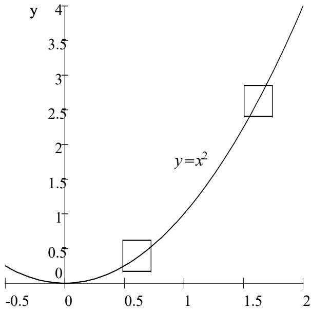

2.Prove (from the text) that a constant multiple of a uniformly continuous function on $S$ is also uniformly continuous.Also prove that the difference of UC functions is UC.

3. Show that the following functions are not uniformly continuous on $( 0 , 1 )$ (you may assume the usual properties of the trigonometric functions). For a proof that a function is not UC,see Example 4.1.9 in the text.

$\begin{array} { r l r l r l } { a . ~ e ^ { 1 / x } } & { { } ~ b . ~ \sin ( 1 / x ) } & { ~ c . ~ e ^ { x } \cos ( 1 / x ) } & { ~ d . ~ \cos ( x ) \cos ( \pi / x ) } \end{array}$

4. Prove that if $f$ satisfies a Lipschitz condition of the type $| f ( y ) - f ( x ) | \leq K | y -$ $x |$ （ $K > 0$ ）on $S$ ,then $f$ is uniformly continuous on $S$

5.Prove that if $f$ satisfies a Lipschitz condition of the type $A ( y - x ) \leq f ( y ) -$ $f ( x ) \leq B ( y - x )$ where $A , B > 0$ ，then $f$ is uniformly continuous (see the previous exercise as well as Corollary 1.5.31).

6. Give detailed proofs that the logarithm and exponential functions are uniformly continuous on appropriate intervals.

7.Prove that if $f$ and $g$ are uniformly continuous and bounded functions, then their product $f g$ is also uniformly continuous.(Hint:Add and subtract $f \left( x \right) g \left( y \right)$ in $| f ( y ) g ( y ) - f ( x ) g ( x ) |$ .）Deduce that,on a finite interval $\lfloor A , B \rfloor$ ， the product of uniformly continuous intervals must be uniformly continuous.

8.Just for practice,prove that the polynomial $x ^ { 3 } - x + 1$ is uniformly continuous ontheteral5il $\scriptstyle { \frac { 1 } { 2 x + 3 } }$ and $\sqrt { 2 x + 3 }$ are uniformly continuous on this interval.

9.Suppose the functions $f$ and $g$ are UC on the finite interval $\lfloor a , b \rfloor$ . Define the functions $h ( x ) = \operatorname* { m i n } ( f ( x ) , g ( x ) )$ and $H ( x ) = \operatorname* { m a x } ( f ( x ) , g ( x ) )$ .Show that $h$ and $H$ are UC on $\lfloor a , b \rfloor$ . Deduce that the absolute value function is UC.

10. Suppose $f$ is UC on $\lfloor a , \infty )$ and lim f(x) is finite. Prove that $f$ is bounded on $\lfloor a , \infty )$ . What if we just assume that $f$ is UC on every finite subinterval of $\lfloor a , \infty )$ ？Will $f$ be UC on $\lfloor a , \infty )$ ？

11.Prove the following from the text.

PROPOSITION 4.1.21 Suppose $f$ is uniformly continuous on an interval $I =$ $[ a , b ]$ $a < b$ ). If there is an $x _ { 0 } \in I$ such that $f ( x _ { 0 } ) > 0$ then $f$ is bounded away from O in some subinterval $\lfloor c , d \rfloor$ $c < d$ ）of $I$ containing $x _ { 0 }$

12. Here we look at functions satisfying certain simple identities (called functional equations). We assume in each case that the function $f$ is UC on every finite interval $\lfloor a , b \rfloor$ ．Prove the following statements. (It is recommended that you follow the order listed.)

(a)If $f$ satisfies $f ( x + y ) = f ( x ) + f ( y )$ , then there is a real number $_ { \alpha }$ such that $f ( x ) = \alpha x$ for all $_ { x }$ .(Hint: What does $\alpha$ have to be?) (b) Find all $f$ which satisfy the conditions $f ( 1 ) > 0$ and $f ( x + y ) = f ( x ) f ( y )$

(c) (Here $f$ is UC on every finite interval $\lfloor a , b \rfloor$ with $a > 0$ .）Show that if $f$ is not identically O and satisfies $f ( x y ) = f ( x ) + f ( y )$ then $f$ is a log function. (Hint: Think of a trick so that you can use part (a).)   
(d) (Here $f$ is UC on every finite interval $\lfloor a , b \rfloor$ with $a > 0$ .）Show that if $f$ is not identically $0$ and satisfies $f ( x y ) = f ( x ) f ( y )$ ，then $f$ is a power function $f ( x ) = x ^ { \alpha }$

13.That a function $f$ is continuous at the point $x _ { 0 }$ （ $x _ { 0 }$ in the domain of $f$ ）means that，given $\epsilon > 0$ ， there exists a $\delta > 0$ (possibly depending on $x _ { 0 }$ ）such that $| f ( x ) - f ( x _ { 0 } ) | < \epsilon$ whenever $| x - x _ { 0 } | < \delta$

(a) Prove that $f$ is continuous at $x _ { 0 }$ if and only if f(xo)= lim f(x). x→x0   
(b）Prove that $f$ UC on $S$ implies that $f$ is continuous at each point of $S$   
(c） The converse of the above is not true. Show that the function $f ( x ) = 1 / x$ is continuous at each point of $( 0 , 1 ]$ ，for example,but is not uniformly continuous on $( 0 , 1 ]$ . Also, the function $x ^ { 2 }$ is continuous at every point of $\mathbb { R }$ but is not UC on all of $\mathbb { R }$ (though it is UC on every finite subinterval.)

14. Give a detailed proof that the function $x ^ { 1 / 3 }$ is uniformly continuous on all of $\mathbb { R }$ when we define

$$
( - x ) ^ { 1 / 3 } = - ( x ^ { 1 / 3 } )
$$

for $x \le 0$ . This function cannot satisfy a Lipschitz condition $| f \left( y \right) - f \left( x \right) | \leq$ $K \cdot | y - x |$ on any interval containing O. Why?

15.The two-sided Inverse Function Theorem，Two-sided Case (Theorem 2.2.8) tells us that the function $x ^ { \pi }$ has an inverse on all of $\mathbb { R }$ when $_ { n }$ is odd. In fact, for $_ n$ odd and $x \le 0$ ， $x ^ { 1 / n } = - ( - x ) ^ { 1 / n }$ . Use Corollary 4.1.23 to show that $x ^ { 1 / n }$ is UC in this case on all of $\mathbb { R }$ , with modulus of continuity $( \epsilon / 2 ) ^ { \pi }$ (Hint: Separate out into the cases $_ { x }$ and $_ y$ both non-negative,both non-positive,and one non-negative and the other non-positive. This is legal since these three cases can't all be excluded, and you are trying to prove that $\left| y ^ { 1 / n } - x ^ { 1 / n } \right|$ is not greater than $\epsilon$ ）

# 4.2 Limits and Extensions

The main idea in this section is that uniformly continuous functions preserve limits and hence can be extended to take on their limiting values. The following proposition expresses the phrase “preserves limits” more carefully.

PROPOSITION 4.2.1 Suppose $f$ is uniformly continuous on $S$ and $( a _ { k } ) \to a$ where each $a _ { k } \in S$ . Then

1. $\left( f ( a _ { k } ) \right)$ is a Cauchy sequence.

2. The limits $\operatorname* { l i m } _ { x \to a \atop x \in S } f ( x )$ and $L = \operatorname* { l i m } _ { k \to \infty } ( f ( a _ { k } ) )$ erist and are equal.

3.1f $a \in S$ then $L = f ( a )$

Proof. (1) Given $\epsilon > 0$ ,let $\delta = \delta _ { f } ( \epsilon )$ be a modulus of continuity for $\epsilon$ on $S$ . Since $\left( a _ { k } \right)$ is a Cauchy sequence, choose $N$ so that $| a _ { m } - a _ { n } | < \delta$ when $m , n > N$ ； then $| f ( a _ { m } ) - f ( a _ { n } ) | < \epsilon$

(2) $L = \operatorname* { l i m } ( f ( a _ { k } ) )$ exists by part (1) and the fact that Cauchy sequences converge (by completeness). We must show that given $\epsilon > 0$ ， we can make $| f ( x ) - L | \leq \epsilon$ by making $| x - a |$ small enough.Once again, let $\delta$ be a modulus of continuity for $\epsilon$ on $S$ ,and suppose that $| x - a | < \delta / 2$

Since $( a _ { k } ) \to a$ , choose an $_ { n }$ such with $| a - a _ { n } | < \delta / 2$ (we will refine $_ n$ soon). We now have $| x - a _ { n } | \leq | x - a | + | a - a _ { n } | < \delta / 2 + \delta / 2 = \delta$ ,so $| f ( x ) - f ( a _ { n } ) | < \epsilon$ and

$$
\begin{array} { r c l } { | f ( x ) - L | } & { \leq } & { | f ( x ) - f ( a _ { n } ) | + | f ( a _ { n } ) - L | } \\ & { < } & { \epsilon + | f ( a _ { n } ) - L | . } \end{array}
$$

By making $_ { n }$ large enough, $| f ( a _ { n } ) - L |$ can be made arbitrarily small (since $L = \operatorname* { l i m } ( f ( a _ { k } ) ) )$ ，s0 $| f ( x ) - L | \leq \epsilon$ (by the Wiggle Lemma).

(3)This is left as an exercise.■

COROLLARY 4.2.2 If $f$ is uniformly continuous on $S$ and $a \in S$ ，then $f ( a ) =$ lim f(x). $\operatorname* { l i m } _ { x \to a \atop x \in S } f ( x )$

EXAMPLE 4.2.3 Consider the sequence $( 1 / k ^ { 3 } ) \to 0$ If $f ( x ) = \sqrt [ 3 ] { x }$ ,then $f \left( 1 / k ^ { 3 } \right) =$   
$1 / k \to 0$ . Therefore $\operatorname* { l i m } _ { x \to 0 } \vartheta ^ { \ast } = 0$

$$
\begin{array} { l l } { { \mathrm { E x A M P L E ~ 4 . 2 . 4 ~ C o n s i d e r ~ } f ( x ) = \displaystyle \frac { x ^ { 2 } - 4 } { x - 2 } ~ a n d ~ ( a _ { k } ) = ( 2 + 1 / k )  2 . } } \\ { { \mathrm { } } } \\ { { \mathrm { } ( 4 + 4 / k )  4 , ~ s o \displaystyle \operatorname* { l i m } _ { x  2 } ( \displaystyle \frac { x ^ { 2 } - 4 } { x - 2 } ) = 4 . } } \end{array}
$$

Note that in the second example, $f ( x )$ is not defined at $x = 2$ , but it is defined everywhere else (i.e.at those $_ x$ such that $| x - 2 | > 0$ ). The domain (allowable inputs for $f$ ） has a“hole”at $x = 2$ . We would be tempted to fill that hole by defning $f ( 2 )$ to be 4.However,this leads to the rather awkward definition

$$
f ( x ) = \left\{ \begin{array} { l l l } { \displaystyle \frac { x ^ { 2 } - 4 } { x - 2 } } & { \mathrm { i f } } & { x \neq 2 } \\ { \quad 4 } & { \mathrm { i f } } & { x = 2 } \end{array} \right. .
$$

But this is worse than being merely awkward. What happens if $_ { x }$ is a real number say given as a family of intervals, or as a limit of a Cauchy sequence, or as an infinite series—but we can't determine whether $_ { x }$ is actually equal to 2? We know that the strong trichotomy property doesn't hold for all real numbers, so how can we apply this definition?

Of course, the solution in this simple case is easy: just define $f ( x )$ to be $x + 2$ for any $_ { x }$

Here are some examples of extending functions,already taken care of by other means (namely IFT).

EXAMPLE 4.2.5 Let $f ( x )$ be the nth-root of $_ x$ .For $x \geq 0$ and rational, this is defined by the family $\{ | r , s | : 0 \leq r$ and $r ^ { n } \leq x \leq s ^ { n } \}$ .When $_ { x }$ is not necessarily rational, verifying the $\leq$ inequalities in bisection can create problems in determining fineness; thus the more careful approach taken in the IFT is necessary.

ExAMPLE 4.2.6 $f \left( x \right) = x ^ { A }$ ， defined for $A = r / s$ rational to be $\sqrt [ s ] { x ^ { r } }$

In all of these examples, the numbers we want to be in the domain of the function (e.g. all the reals) can be approximated to arbitrary closeness by numbers on which the function is already defined—namely the rationals.Basically, to add the number $_ x$ to the domain of $f$ ，we try to write $x = \operatorname* { l i m } \left( x _ { n } \right)$ where $f \left( x _ { n } \right)$ exists and then define $f \left( x \right) = \operatorname* { l i m } \left( f \left( x _ { n } \right) \right)$ . We now make precise this important idea.

DEFINITION 4.2.7 Let $S \subset T$ be sets of real numbers. $S$ is dense in $T$ means that every open interval of $\mathbb { R }$ which intersects $T$ also intersects $S$

PROPOSITION 4.2.8 For $S \subset T$ , the following are equivalent.

1. $S$ is dense in $T$   
2. For each $x \in T$ , there is a convergent sequence $( s _ { k } ) \to x$ with each $s _ { k } \in S$   
3. For each $x \in T$ and $\epsilon > 0$ , there is some $s \in S$ such that $| x - s | < \epsilon$

Proof. Suppose first that $S$ is dense in $T$ For $k = 1 , 2 , \ldots$ let $\begin{array} { r } { J = \left( x - \frac { 1 } { k } , x + \frac { 1 } { k } \right) } \end{array}$ By density, $J$ contains some $s _ { k }$ which is clearly within $1 / k$ of $_ { x }$ .Thus, $( s _ { k } ) \to x$

Now suppose that $x \in T$ ，and ( $s _ { k }$ ） converges to $_ { x }$ .For $\epsilon > 0$ find $s _ { k }$ closer to $_ { x }$ than $\epsilon$ and let $s = s _ { k }$

Finally, suppose that $\boldsymbol { J } ~ = ~ ( u , v )$ is an open interval containing $x \in T$ Let $\epsilon = \operatorname* { m i n } ( x - u , v - x )$ . By hypothesis,there is an $s \in S$ lying within $\epsilon$ of $_ { x }$ ; clearly $s$ must lie in $J$ ■

REMARK 4.2.9 In the above proposition, if $x \in T$ happens to lie in $S$ , we can choose the sequence so that $s _ { k } = x$ for all $k$

EXAMPLE 4.2.10 The rationals $\mathbb { Q }$ are dense in the reals $\mathbb { R }$ . The rational interval $\lfloor r , s \rfloor$ is dense in the real interval $\lfloor r , s \rfloor$ . The open and half-open intervals $( a , b )$ ， $( a , b ]$ ， and $[ a , b )$ are dense in the closed interval $[ a , b ]$

And here is the fundamental result.

THEOREM 4.2.11（EXTENSION THEOREM FOR UC FUNCTIONS） Supp0se that $f$ is uniformly continuous on $S$ and $S$ is dense in $T$ . Then there is one and only one function $F$ ， uniformly continuous on $T$ ，such that $F ( x ) = f ( x )$ for each $x \in S$ · Furthermore, any modulus of continuity for $f$ is a modulus of continuity for $F$

Proof. Suppose that $\delta ( \epsilon )$ is a modulus of continuity for $f$ on $S$ .Then, for $p$ in $T$ ， define the family

$$
{ \mathcal F } ( p ) = \left\{ [ f ( x ) - \epsilon , ~ f ( x ) + \epsilon ] : \epsilon > 0 , ~ x \in S , ~ | x - p | < \delta ( \epsilon ) \right\} .
$$

Since $S$ is dense in $T$ ,for each $\epsilon > 0$ there is an $x \in S$ with $| x - p | < \delta ( \epsilon )$ ；thus, $\mathcal { F } ( \boldsymbol { p } )$ is fine.

To prove consistency, suppose that $I _ { 1 } = | f ( x _ { 1 } ) - \epsilon _ { 1 } , f ( x _ { 1 } ) + \epsilon _ { 1 } |$ and $I _ { 2 } = | f ( x _ { 2 } ) - \rrangle$ $\epsilon _ { 2 } , f ( x _ { 2 } ) + \epsilon _ { 2 } ]$ are any two intervals in ${ \mathcal { F } } ( { \boldsymbol { p } } )$ . Choose $_ y$ so close to $p$ that $| x _ { i } - p | +$ $| p - y | < \delta ( \epsilon _ { i } )$ ，for $i = 1 , 2$ . (We can do this because $\delta ( \epsilon _ { i } ) - | x _ { i } - p | > 0$ and $S$ is dense.） This gives

$$
\begin{array} { l l l } { | x _ { i } - y | } & { = } & { | y - p + p - x _ { i } | } \\ & { \leq } & { | y - p | + | p - x _ { i } | } \\ & { < } & { \delta ( \epsilon _ { i } ) } \end{array}
$$

for $i = 1 , 2$ . Then $f ( x _ { i } )$ is within $\epsilon _ { i }$ of $f ( y )$ ，s0 $f ( y )$ is in both $I _ { 1 }$ and $I _ { 2 }$

We now can define $F ( p ) = \operatorname* { l i m } { \mathcal { F } } ( p )$ , for each $p \in T$

When $p \in S$ ， $f ( \boldsymbol p )$ belongs to each interval in ${ \mathcal { F } } ( { \boldsymbol { p } } )$ (by the continuity of $f$ )， so$F ( p ) = f ( p )$

Next we show that a modulus of continuity for $f$ on $S$ also works for $F$ on $T$ Given $\epsilon > 0$ ， suppose $\delta = \delta _ { f } ( \epsilon )$ , and suppose that $| q - p | < \delta$ . We will show that for any $\mu > 0$ ， $| F ( q ) - F ( p ) | \leq \epsilon + \mu$ for any $\mu > 0$ ; applying the Wiggle Lemma then will give $| F ( q ) - F ( p ) | \leq \epsilon$ Let $\sigma = \operatorname* { m i n } ( \delta - | q - p | , \mu / 2 )$ Since $F ( p ) = \operatorname* { l i m } { \mathcal { F } } ( p )$ and $F ( q ) = \operatorname* { l i m } { \mathcal { F } } ( q )$ ，

$$
\begin{array} { r l r } { F ( p ) } & { \in } & { [ f ( x ) - \sigma / 2 , f ( x ) + \sigma / 2 ] \mathrm { \quad ~ f o r ~ s o m e ~ } x \in S \mathrm { ~ w i t h ~ } | x - p | < \sigma / 2 } \\ { F ( q ) } & { \in } & { [ f ( y ) - \sigma / 2 , f ( y ) + \sigma / 2 ] \mathrm { \quad ~ f o r ~ s o m e ~ } y \in S \mathrm { ~ w i t h ~ } | y - p | < \sigma / 2 . } \end{array}
$$

Therefore

$$
\begin{array} { r } { \begin{array} { l r } { | F ( p ) - f ( x ) | } & { < \sigma \leq \mu / 2 , } \\ { | F ( q ) - f ( y ) | } & { < \sigma \leq \mu / 2 , } \end{array} } \end{array}
$$

and

$$
\begin{array} { l l l } { | x - y | } & { \leq } & { | x - p | + | p - q | + | q - y | } \\ & { \leq } & { \sigma / 2 + | p - q | + \sigma / 2 } \\ & { = } & { \sigma + | p - q | } \\ & { \leq } & { \delta . } \end{array}
$$

Now we put these pieces together to obtain

$$
\begin{array} { l l l } { | F ( q ) - F ( p ) | } & { \leq } & { | F ( p ) - f ( x ) | + | f ( x ) - f ( y ) | + | f ( y ) - F ( q ) | } \\ & { \leq } & { \mu / 2 + \epsilon + \mu / 2 = \epsilon + \mu . } \end{array}
$$

As we said, the Wiggle Lemma gives $| F ( q ) - F ( p ) | \leq \epsilon$

Finally, uniqueness: Suppose that $G$ is another uniformly continuous extension of $f$ to $T$ ，S0 $G ( s ) = F ( s ) = f ( s )$ for $s \in S$ . Given $\epsilon > 0$ and $p \in T$ ， choose $s \in S$ with $| p - s | < \operatorname * { m i n } ( \delta _ { F } ( \epsilon / 2 ) , \delta _ { G } ( \epsilon / 2 ) )$ . Then

$$
\begin{array} { r c l } { | G ( p ) - F ( p ) | } & { = } & { | G ( p ) - \overbrace { G ( s ) + F ( s ) } ^ { G ( s ) = F ( s ) } - F ( p ) | } \\ & { \leq } & { | G ( p ) - G ( s ) | + | F ( s ) - F ( p ) | } \\ & { \leq } & { \epsilon / 2 + \epsilon / 2 = \epsilon . } \end{array}
$$

Since $\epsilon$ was arbitrary, $G ( p ) = F ( p )$

Note that in this proof we used property 3 of Proposition 4.2.8 to construct $f$ via the Completeness Theorem. In view of the equivalence of this property with property 2 of the same proposition — the existence of a Cauchy sequence $( s _ { k } ) \to x$ —we could have defined $F \left( x \right) = \operatorname* { l i m } f ( s _ { k } )$ . This variation is left as an exercise.

COROLLARY 4.2.12 Any function UC on the rational interval $\lfloor r , s \rfloor$ can be extended in a unique way to a function UC on the real interval $\lfloor r , s \rfloor$

COROLLARY 4.2.13 Any function UC on the open or half-open intervals $( a , b )$ ， $( a , b ]$ ， $[ a , b )$ can be extended in a unique way to a function UC on the closed interval $\lfloor a , b \rfloor$

In this last corollary, we obtained the open and half open intervals by removing one or both endpoints from a closed interval $\lfloor a , b \rfloor$ .However,we needn't restrict outselves to endpoints,but can puncture an interval any finite number of times.

DEFINITION 4.2.14 If $x _ { 1 } , \ldots , x _ { n } \in \left\lfloor a , b \right\rfloor$ ， then $P = \left\lfloor a , b \right\rfloor - \left\{ x _ { 1 } , . . . , x _ { n } \right\}$ consists of those $x \in \lfloor a , b \rfloor$ such that $\left| x - x _ { i } \right| > 0$ for $i = 1 , \ldots , n$ ： $P$ is called a (finitely) punctured interval.

The following tells us that a finitely punctured interval $P$ is dense in $\lfloor a , b \rfloor$

PROPOSITION 4.2.15 Suppose $x , c _ { 1 } , \ldots , c _ { n } \in [ a , b ]$ and $\epsilon > 0$ . Then there is an ${ \bar { x } } \in \left\lfloor a , b \right\rfloor$ with $| x - \bar { x } | < \epsilon$ and $\left| \bar { x } - c _ { i } \right| > 0$ for each $i = 1 , \ldots , n$

The proof, by induction, is left as an exercise.

COROLLARY 4.2.16 Any function uniformly continuous on $\left\lfloor a , b \right\rfloor - \left\{ x _ { 1 } , \ldots , x _ { n } \right\}$ can be extended uniquely to a uniformly continuous function on all of $\lfloor a , b \rfloor$

Next we turn to another way of extending functions: amalgamation, or the piecing together of UC functions that agree on overlaps.

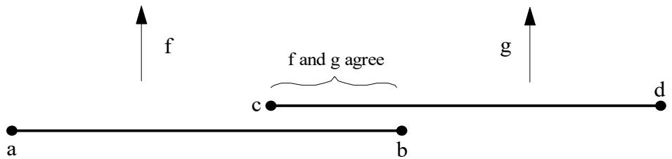

We will apply the Extension Theorem to a union of intervals,so first we define what this means for us.

DEFINITION 4.2.17 $A \cup B$ ， the union of two sets (for us they will be intervals), consists of those x for which it can be determined that x lies in $A$ or $_ { x }$ lies in $B$

REMARK 4.2.18 As the erample of the Goldbach number $g$ shows (see page 67), $g$ lies in $\lfloor - 1 , 1 \rfloor$ but we don't know if $g \in \left[ - 1 , 0 \right]$ or $g \in \left[ 0 , 1 \right]$ ; thus, at this time, $g \not \in \lfloor - 1 , 0 \rfloor \cup \lfloor 0 , 1 \rfloor$

As in the diagram above,we have functions $f$ and $g$ defined on $\lfloor a , b \rfloor$ and $\lfloor c , d \rfloor$ respectively,and would like to define an extension $h$ by setting $h ( x ) \ = \ f ( x )$ if $x \in \lfloor a , b \rfloor$ ，and $h ( x ) = g \left( x \right)$ if $x \in \lfloor c , d \rfloor$ .But this only makes sense when we can tell which interval $_ x$ belongs to,i.e.only when $x \in \lfloor a , b \rfloor \cup \lfloor c , d \rfloor$ . Fortunately, this union is dense in the obvious interval determined by $\lfloor a , b \rfloor$ and $\lfloor c , d \rfloor$ , as the following lemma verifies.

LEMMA 4.2.19 Suppose the intervals $\lfloor a , b \rfloor$ and $\lfloor c , d \rfloor$ intersect. Then $U = \lfloor a , b \rfloor \cup \lfloor c , d \rfloor$ is dense in the interval $V = \left\lfloor \operatorname* { m i n } ( a , c ) , \operatorname* { m a x } ( b , d ) \right\rfloor$

Proof. We must show that any open interval $( s , t )$ that meets $V$ also meets $U$ .Here is what we know:

1. $a \leq d$ and $c \leq b$ (since the intervals meet).   
2. There is a $p$ with $\operatorname* { m i n } ( a , c ) \leq p \leq \operatorname* { m a x } ( b , d )$ and $s < p < t$ ， since $( s , t )$ meets $V$   
3. We must show that $( s , t )$ meets $\lfloor a , b \rfloor$ or $\lfloor c , d \rfloor$

Because it is diffcult to write conditions describing the intersection of an open and a closed interval, we choose a subinterval $[ s ^ { \prime } , t ^ { \prime } ]$ containing $p$ ,with $s < s ^ { \prime } < p < t ^ { \prime } < t$ ， and show $[ s ^ { \prime } , t ^ { \prime } ]$ meets $\lfloor a , b \rfloor$ or $\lfloor c , d \rfloor$ . It clearly suffices to show that if $[ s ^ { \prime } , t ^ { \prime } ]$ does not meet $\lfloor a , b \rfloor$ then it meets $\lfloor c , d \rfloor$

The assumption that $[ s ^ { \prime } , t ^ { \prime } ]$ and $[ a , b ]$ don't meet is equivalent to assuming that $a > t ^ { \prime }$ and $b < s ^ { \prime }$ can't both be false,so we need to show that each of these strict inequalities implies that $[ s ^ { \prime } , t ^ { \prime } ]$ meets $\lfloor c , d \rfloor$ . Let's do the case $b < s ^ { \prime }$ ; the other one is similar.

If $d < s ^ { \prime }$ then $p > s ^ { \prime } \geq \operatorname* { m a x } ( b , d )$ , contradicting (2） above. so $s ^ { \prime } \leq d$ If $t ^ { \prime } < c$ then $b < s ^ { \prime } < t ^ { \prime } < c$ , contradicting (1) above, so $c \leq t ^ { \prime }$ .Thus, $[ s ^ { \prime } , t ^ { \prime } ]$ meets $\lfloor c , d \rfloor$ $\mid$

REMARK 4.2.20 Lemma 4.2.19 above holds even when $\lfloor a , b \rfloor$ is replaced by $( - \infty , b ]$ ， or $\lfloor c , d \rfloor$ is replaced by $\lfloor c , \infty )$

PROPOSITION 4.2.21（AMALGAMATION OF FUNCTIONS） SuppOSe $a \leq b \leq c$ ， $f$ is uniformly continuous on $[ a , b ]$ ， $g$ is uniformly continuous on $\lfloor b , c \rfloor$ ，and $f \left( b \right) = g ( b )$ Then there is a unique function h such that

1. h is uniformly continuous on $[ a , c ]$ ，

2. $h ( x ) = f \left( x \right)$ for $x \in [ a , b ]$ ，and

3. $h ( x ) = g ( x )$ for $x \in \lfloor b , c \rfloor$

(Note that this proposition is easily extended to the case of finitely many subintervals and functions.)

Proof. We first construct $h$ on the union $U = \left\lfloor a , b \right\rfloor \cup \left\lfloor b , c \right\rfloor$ and prove $h$ is uniformly continuous, then apply Lemma 4.2.19 above and the Extension Theorem to extend $h$ to $\lfloor a , c \rfloor$

By definition of union, $x \in U$ means that $x \in \lfloor a , b \rfloor$ or $x \in \lfloor b , c \rfloor$ ， so we define $h \left( x \right) = f ( x )$ or $h ( x ) = g ( x )$ in these cases respectively. Now we must make $| h ( x ) - h ( y ) | < \epsilon$ . We cannot exclude all three cases $x , y \leq b$ ； $b \leq x , y$ ; and $b$ lies between $_ x$ and $_ y$ (we have proved this earlier; see Proposition 1.5.46). In the first case $h = f$ , and we can use the modulus of continuity $\delta _ { f } ( \epsilon )$ on $[ a , b ]$ ; in the second case, we use the modulus of continuity $\delta _ { g } ( \epsilon )$ on $\lfloor b , c \rfloor$ . Now let $\delta ( \epsilon ) = \operatorname* { m i n } ( \delta _ { f } ( \epsilon / 2 ) , \delta _ { g } ( \epsilon / 2 )$ and suppose $| x - y | < \delta ( \epsilon )$ . We write $| h ( x ) - h ( y ) | \leq | h ( x ) - h ( b ) | + | h ( b ) - h ( y ) |$ Since $b$ lies between $_ { x }$ and $_ y$ ， $| x - b | + | b - y | = | x - y | < \delta ( \epsilon )$ ，s0 $| x - b |$ and $| b - y |$ are each less than $\delta ( \epsilon )$ .Hence $| h ( x ) - h ( b ) | + | h ( b ) - h ( y ) | < \epsilon$ . This proves continuity.

REMARK 4.2.22 This proposition remains true when $f$ is $U C$ om $( - \infty , b ]$ and $g$ is $U C$ on $\lfloor b , \infty )$

In the case where the two intervals $\lfloor a , b \rfloor$ and $\lfloor c , d \rfloor$ don't intersect at just a single endpoint $b = c$ ，but rather $b \in \lfloor c , d \rfloor$ and $c \in \lfloor a , b \rfloor$ ，we note that $\lfloor a , \operatorname* { m i n } ( b , c ) \rfloor \cup$ $\left\lfloor \operatorname* { m i n } ( b , c ) , \operatorname* { m a x } ( b , c ) \right\rfloor \cup \left\lfloor \operatorname* { m a x } ( b , c ) , d \right\rfloor$ is dense in $[ a , d ]$ and we can apply Proposition 4.2.21 in this case as well (we assume $f$ and $g$ agree on $\left| \operatorname* { m i n } ( b , c ) , \operatorname* { m a x } ( b , c ) \right| )$

One of the most important applications of the amalgamation or piecing together of functions, described in this last corollary, is the case of piecewise linear functions. Recall that a linear function $\mathbb { R } \to \mathbb { R }$ is one of the form $L \left( x \right) = a x + b$ . Given points $( x _ { 1 } , y _ { 1 } )$ and $( x _ { 2 } , y _ { 2 } )$ with $| x _ { 1 } - x _ { 2 } | > 0$ , it is aways possible to find a linear function for which $L ( x _ { i } ) = y _ { i }$ ， $i = 1 , 2$ . Applying this idea several times yields the following.

COROLLARY 4.2.23 Giuen $a = x _ { 0 } < x _ { 1 } < \cdot \cdot \cdot < x _ { n } = b$ , and numbers $y _ { 0 } , y _ { 1 } , \dotsc , y _ { n }$ thereisa function $L$ such that

1. $L$ is linear on each interval $\left[ x _ { i } , x _ { i - 1 } \right]$ separately， and

2. $L ( x _ { i } ) = y _ { i }$

Finally,we can weaken the condition that a function be uniformly continuous on all of a punctured interval in order to be extended: it just has to be uniformly continuous on closed subintervals. This is made precise below.

LEMMA 4.2.24 Suppose that $f$ is uniformly continuous on every subinterval $\left\lfloor u , v \right\rfloor$ of $[ a , b )$ . Furthermore, suppose $\operatorname* { l i m } _ { x \to b \atop x < b } f ( x )$ exists. Then $f$ is uniformly continuous on $[ a , b )$ ， and hence it has a unique uniformly continuous extension to all of $[ a , b ]$

Proof. Given $\epsilon > 0$ ， choose $\delta > 0$ such that $| f ( x ) - L | < \epsilon / 2$ when $b - x < \delta$ ，where $\operatorname* { l i m } _ { x \to b \atop x < b } f ( x ) = L$ . Since $f$ is UC on the interval $I = \lfloor a , b - \delta / 4 \rfloor$ , we can find a modulus of continuity $\delta _ { I } = \delta ( \epsilon , I )$ for $\epsilon$ on it. Now let $\delta ^ { \prime } = \operatorname* { m i n } ( \delta _ { I } , \delta / 4 )$ . Here is a picture of what we have.

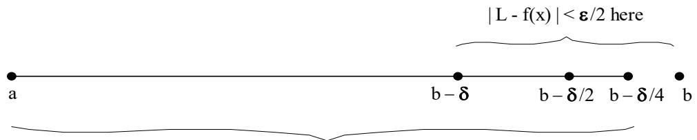

Suppose that $| y - x | < \delta ^ { \prime }$ . We deal with the two cases $x \ge b - \delta / 2$ and $x \le b - \delta / 2$ In the former, $b - x \leq \delta / 2 < \delta$ and so

$$
y \ge x - \delta / 4 \ge b - 3 \delta / 4 \ge b - \delta ,
$$

and $b - y \leq \delta$ also.Thus,by definition of $\delta$ ：

$$
\begin{array} { r c l } { | f ( y ) - f ( x ) | } & { \leq } & { | f ( y ) - L | + | L - f ( x ) | } \\ & { \leq } & { \epsilon / 2 + \epsilon / 2 = \epsilon . } \end{array}
$$

Now we deal with $x \le b - \delta / 2$ ,which tells us that $x \in I$ . Also, $y \le x + \delta / 4 \le b - \delta / 4$ S0 $y \in I$ as well. Since $\vert y - x \vert < \delta _ { I }$ ， $| f ( y ) - f ( x ) | \leq \epsilon$ in this case as well.

Note that this result is also true for intervals of the form $( a , b ]$ when the function has a limit as $x \ \longrightarrow \ a$ ，and $x \ > \ a$ .It is also true when $b = \infty$ ，using a similar argument:see the exercises.

This lemma is very useful in its own right, since it is often hard to prove that functions are UC on open or half-open intervals when they are not defined at one or more endpoints. Two well-known examples are $( \sin x ) / x$ and $x \sin ( 1 / x )$ on the interval $( 0 , b ]$ (see exercises.） Here is another.

EXAMPLE 4.2.25 The function $f ( x ) = \left( e ^ { x } - 1 \right) / x$ is $U C$ on $( 0 , 1 ]$ ， hence has an extension to [0,1]. To see this,we note that on any interval $[ a , 1 ]$ where $a > 0$ ， $e ^ { x } - 1$ is UC and $_ x$ is bounded away from $0$ ; thus, $f ( x )$ is $U C$ on $[ a , 1 ]$ . Furthermore, we know from Section 2.4 that $\operatorname* { l i m } _ { x \to 0 } f ( x ) = 1$ ， so we can apply a variation of Lemma 4.2.24 for intervals open on the left.

Perhaps the most important application of Lemma 4.2.24, however, is to the power function $x ^ { q }$

PROPOSITION 4.2.26 If $q > 0$ the function $x ^ { q }$ is $U C$ on the interval $( 0 , b ]$ and can be extended to the interval $[ 0 , b ]$ with value O at $x = 0$ .

Proof. By virtue of Lemma 4.2.24, we only have to show that lim eqlnx = 0. Given $\operatorname* { l i m } _ { x \to 0 \atop x > 0 } e ^ { q \ln x } = 0$ $\epsilon > 0$ , choose $N > - { \frac { \ln \epsilon } { q } }$ If $x < e ^ { - N }$ , then it is easy to see that $x ^ { q } < \epsilon$

# Exercises

1. Give an alternative proof of the Extension Theorem (4.2.11),using a Cauchy sequence $( s _ { k } ) \to x$ instead of a family of intervals, to define $F ( x ) = \operatorname* { l i m } f ( s _ { k } )$ After defining $F$ , prove the following.

(a) $F ( x )$ is independent of the sequence $( s _ { k } ) \to x$ and so $F ( x ) = f ( x )$ for $x \in S$   
(b） $F$ is uniformly continuous on $T$ .(In fact,it has the same modulus of continuity as $f$ ）   
(c） If $G$ is also uniformly continuous on $T$ and $G \left( x \right) = f ( x )$ for all $x \in S$ ， then $G \left( x \right) = F \left( x \right)$ for all $x \in T$

2.Prove that the punctured interval

$$
[ a , b ] - \{ x _ { 1 } , . . . x _ { n } \} = \{ x \in [ a , b ] : | \ x - x _ { i } \mid > 0 , \ i = 1 , . . . n \}
$$

is dense in $[ a , b ]$ .(Hint: Use induction on $_ { n }$ . Prove that every open interval which intersects $[ a , b ]$ also intersects the punctured interval. Lemma 1.6.10 will be useful in the inductive step.)

3. Reprove Proposition 4.2.21, which says that UC functions defined on $[ a , b ]$ and $\lfloor b , c \rfloor$ and agreeing at $b$ can be amalgamated into a single UC function defined on all of $\lfloor a , c \rfloor$ . This time,use Cauchy sequences instead of intervals.

4. We have proved:

LEMMA 4.2.24 Suppose that $f$ is uniformly continuous on every subinterval $\left\lfloor u , v \right\rfloor$ of $\lfloor a , b \rfloor$ such that $v < b$ . Furthermore, suppose $\operatorname* { l i m } _ { x \to b \atop x < b } f ( x )$ exists. Then $f$ is uniformly continuous on $[ a , b )$ ， hence has $a$ unique extension to all of $\lfloor a , b \rfloor$ Modify the proof given in the text to deal with the case $b = \infty$

5.Suppose that $C _ { 1 }$ and $C _ { 2 }$ are two conditions.Mathematicians often say that $C _ { 1 }$ is stronger than $C _ { 2 }$ if $C _ { 1 } \Longrightarrow C _ { 2 }$ . For example, the condition“ $N$ is divisible by $4 ^ { \dag \dag }$ is stronger than the condition“ $N$ is divisible by 2.” So consider the conditions:

$$
\begin{array} { r l } { C _ { 1 } } & { = \mathrm {  ~ \Psi ~ } ^ { \mathrm { { \sc * } } } f \mathrm { ~ i s ~ } { \bf U } { \bf C } \mathrm { ~ o n ~ e v e r y ~ s u b i n t e r v a l ~ } [ u , v ] \mathrm { ~ o f ~ } [ a , b ] . ^ { , } } \\ { C _ { 2 } } & { = \mathrm {  ~ \Psi ~ } ^ { \mathrm { { \sc * } } } f \mathrm { ~ i s ~ } { \bf U } { \bf C } \mathrm { ~ o n ~ e v e r y ~ s u b i n t e r v a l ~ } [ u , v ] \mathrm { ~ o f ~ } [ a , b ] \mathrm { ~ w i t h ~ } v < b . ^ { , } } \\ { C _ { 3 } } & { = \mathrm {  ~ \Psi ~ } ^ { \mathrm { { \sc * } } } f \mathrm { ~ i s ~ } { \bf U } { \bf C } \mathrm { ~ o n ~ e v e r y ~ s u b i n t e r v a l ~ } [ u , v ] \mathrm { ~ o f ~ } [ a , b ] . ^ { , } } \\ { C _ { 4 } } & { = \mathrm {  ~ \Psi ~ } ^ { \mathrm { { \sc * } } } f \mathrm { ~ i s ~ } { \bf U } { \bf C } \mathrm { ~ o n ~ e v e r y ~ s u b i n t e r v a l ~ } [ u , v ] \mathrm { ~ o f ~ } [ a , b ] . ^ { , } } \\ { C _ { 5 } } & { = \mathrm {  ~ \Psi ~ } ^ { \mathrm { { \sc * } } } f \mathrm { ~ i s ~ } { \bf U } { \bf C } \mathrm { ~ o n ~ } [ a , b ] . ^ { , } } \end{array}
$$

(a）Which of these conditions are stronger than which others? (b） Do any of these conditions imply that $f$ must be UC on all of $\lfloor a , b \rfloor$ ？ (c） For each condition, what additional hypothesis on $f$ can be used to ensure that $f$ is UC on $\lfloor a , b \rfloor$ ？

6. (a) Prove that $e ^ { - x }$ is UC on $\lfloor a , \infty )$ . (b) Prove that $e ^ { - 1 / x }$ is UC on $( 0 , \infty )$

7. Let $f ( x ) = { \frac { \sin x } { x } }$ . Assume the following two facts about this function (we wil prove them later when we examine the sine function more carefully):

(a) $\sin x$ is uniformly continuous on all of $\mathbb { R }$ (b) $\operatorname* { l i m } _ { x \to 0 } { \frac { \sin x } { x } } = 1 .$

Prove that $f ( x )$ is UC on any punctured interval $I - \{ 0 \}$ （ $I$ need not be finite), so that it has an extension to all of $\mathbb { R }$ . (Hint: It suffices to prove this result for a bounded interval $\lfloor - B , B \rfloor$ ， $B > 0$ , since this function is very well-behaved for $_ { x }$ not near 0.)

8. Prove that, for $\alpha > 0$ , the function $x ^ { \alpha } \sin { \frac { 1 } { x } }$ is UC on any punctured interval $I - \{ 0 \}$ （ $I$ need not be finite),so that it has an extension $F$ to all of $\mathbb { R }$ .(You may assume $| \sin x | \le 1$ and $\sin x$ is UC on all of $\mathbb { R }$ .）What will $F ( 0 )$ be？It suffices to prove this result for a bounded interval $\lfloor - B , B \rfloor$ ， $B > 0$ ，since this function is very well-behaved for $_ { x }$ not near 0.

9.Prove the following version of amalgamation (only minor adjustments should be necessary):

PROPOSITION Suppose $- \infty < b < \infty$ ， $f$ is uniformly continuous on $( - \infty , b ]$ ， $g$ is uniformly continuous on $[ b , \infty )$ ，and $f \left( b \right) = g ( b )$ . Then there is a unique function h such that

(a) $h$ is uniformly continuous on $( - \infty , \infty )$ (b) $h ( x ) = f \left( x \right)$ for $x \in ( - \infty , b ]$ (c） $h ( x ) = g ( x )$ for $x \in [ b , \infty )$ ·

# Appendix I: Are There Non-Continuous Functions?

Before proceding further, let's deal with an obvious non-continuous function.

REMARK 4.2.27 The function $1 / x$ is not uniformly continuous on any interval containing O, or any interval of the form $( 0 , B ]$ or $\lfloor A , 0 \rfloor$ . The problem, in the case of an interval containing O,is that $1 / x$ is not defined at $x = 0$ .The problem with the other two types of intervals is that $1 / x$ grows too fast near O to be UC.

So let us rephrase the question more carefully so as to avoid this trivial case.

Are there non-continuous functions on closed intervals?

By closed interval we'll mean an interval of the type $\lfloor a , b \rfloor$ ； by half-infinite we'll mean those of type $\lfloor a , \infty )$ or $( \infty , b ]$

· Constant functions: UC on all of $\mathbb { R }$   
· Sine and cosine functions (as we'll see later): UC on all of $\mathbb { R }$   
· $_ { n }$ th root functions ( $n \geq 1$ ):UC on all of $\mathbb { R }$ when $_ { n }$ is odd integer; UC on the half-infinite interval $\lbrack 0 , \infty )$ when $_ { n }$ is an even integer.   
· $\ln x$ (on $\lfloor a , \infty )$ for $a > 0$ ）， $e ^ { x }$ (on $( - \infty , a ]$ for $a > 0$ ）， $1 / x$ (on $\lfloor a , \infty )$ or $( - \infty , - a ]$ for $a > 0$ ):UC on half-infinite intervals.   
· Quotients $\frac { f ( x ) } { g ( x ) }$ where $f$ is bounded and $g$ is bounded away from O; examples: 0 $\frac { 1 } { 1 + x ^ { 2 } }$ and $\frac { x } { 1 + x ^ { 2 } }$ x UC on all of $\mathbb { R }$ . 0 $\frac { x ^ { 2 } - 2 } { x ( x - 1 ) }$ and $\frac { x ^ { 2 } - 2 } { x ^ { 2 } ( x - 1 ) }$ : UC on closed or half-infinite intervals not containing $0$ or $1$ $\frac { x ^ { 3 } - 2 } { x ( x - 1 ) }$ UC on closed intervals not containing O or 1. - $\tan x$ ， $\mathrm { s e c } x$ ， $\operatorname { c o t } x$ ， $\mathrm { c s c } x$ : UC on closed intervals not containing numbers where the functions are undefined.

· Polynomials: UC on closed intervals.

On the basis of these examples, it would seem that a function can fail to be UC for two reasons:

1. The interval is infinite and the function, while defined, grows too quickly when $_ { x }$ gets large (e.g. polynomials).

2.The interval is closed and finite, but the function becomes undefined at some point in the interval (e.g. $1 / x$ or $\ln x$ on $\lfloor 0 , 1 \rfloor$ )

If we accept the fact that functions which grow even moderately (e.g. $x ^ { 2 }$ ） can't be expected to be UC on non-finite intervals, then we might reasonably be content with functions being UC on closed intervals where they are defined. Are there any other possibilities?

Classically there is a group of functions called step functions that are usually put forward as examples of non-continuous functions on (finite) closed intervals. The most basic is called the Heaviside functionl :

EXAMPLE 4.2.28 (THE HEAVISIDE FUNCTION)

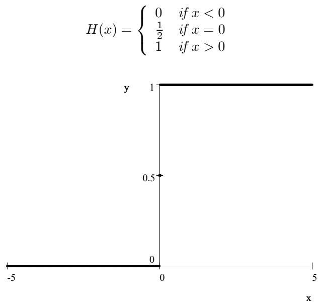  
The Heaviside function

For any $\delta > 0$ ， $| x - 0 | < \delta$ can not guarantee that $\begin{array} { r } { | H ( x ) - H ( 0 ) | < \frac { 1 } { 2 } } \end{array}$ ，s0 $H$ cannot be continuous on any interval $\lfloor a , b \rfloor$ ， $b > a$ , containing $0$

Is the Heaviside function an example of a function defined on a closed interval but not continuous on that interval?

The answer,as disappointing as it may be to lovers of pathology, is no. The Heaviside function on the interval $\lfloor - 1 , 1 \rfloor$ , for example, is not defined on all of that interval but only on those numbers $_ x$ for which we can make the decision of whether $x \ < \ 0$ ， $x \ = \ 0$ ，or $x \ > \ 0$ .For example,what is the value of $H ( G )$ where $G$ is the Goldbach number defined on page 67? Since we can't,at this time (or maybe ever?),determine whether $G$ is $0$ or not, $H ( G )$ is undefined,although we do know that $G \in \lfloor - 1 , 1 \rfloor$ ). Here is another example of a piecewise defined function that shares the same problems as the Heaviside function.

EXAMPLE 4.2.29

$$
\operatorname { J u m p } ( x ) = { \left\{ \begin{array} { l l } { 0 } & { { \mathrm { i f ~ } } - 5 \leq x < - 4 } \\ { \cos ( \pi x ) } & { { \mathrm { i f ~ } } - 4 \leq x < - 1 } \\ { x / 3 } & { { \mathrm { i f ~ } } - 1 \leq x < 1 } \\ { 0 } & { { \mathrm { i f ~ } } 1 \leq x < 2 } \\ { { \frac { 1 } { 2 } } ( x - 3 ) ^ { 2 } + { \frac { 1 } { 2 } } } & { { \mathrm { i f ~ } } 2 \leq x < 4 } \\ { 1 . 3 } & { { \mathrm { i f ~ } } 4 \leq x \leq 5 } \end{array} \right. }
$$

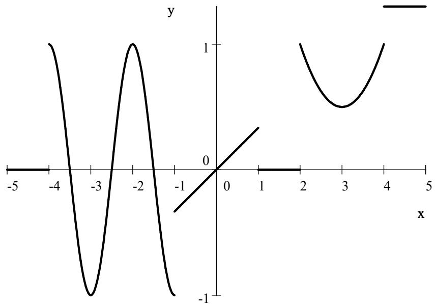  
The function ${ \mathrm { J u m p } } ( x )$

Another famous function² has the following definition on any interval $\lfloor a , b \rfloor$ ， $a > 0$ ：

$$
R ( x ) = { \left\{ \begin{array} { l l } { 0 } & { { \mathrm { i f ~ } } x { \mathrm { ~ i s ~ n o t ~ r a t i o n a l } } } \\ { { \frac { 1 } { q } } } & { { \mathrm { i f ~ } } x { \mathrm { ~ i s ~ r a t i o n a l ~ w i t h ~ } } x = { \frac { p } { q } } { \mathrm { ~ i n ~ l o w e s t ~ t e r m s } } } \end{array} \right. }
$$

This is often given as an example of a function which is continuous at every nonrational number and discontinuous at every rational (see Exercise 13 on page 147 for the definition of continuous at a point).Unfortunately, it is only defined for those numbers where we can make the determination of rational vs. non-rational. For example,what is the value of $R ( \pi + e )$ ？

Now, there are many mathematicians-most in fact—who believe that statements whose truth value we currently do not know (e.g. $G = 0$ ）nevertheless do have a truth value. In other words, they are either true of false—we just don't happen to know which． That is fine.Different mathematicians can play by different rules as long as we're up front about what we are assuming. This book takes a rather minimalist or constructive view: statements are only true (or false) when we can prove (or disprove) them. At least you won't have to unlearn anything you see here.

The upshot of all this is that,from a constructive point of view,there don't seem to be any functions,well-defined on a finite closed interval $[ a , b ]$ ，which fail to be uniformly continuous. All of the functions you'll see in classical mathematics are either

· defined on the rationals, proved UC,and extended to the reals (e.g.addition, multiplication of reals,and our construction of $A ^ { x }$ )，or   
· derived from existing UC functions via algebraic operations (e.g. adding, dividing, composing functions,and applying the Inverse Function Theorem), or   
· derived using integration or differentiation (e.g. $\textstyle F ( x ) = \int _ { 0 } ^ { x } e ^ { - t ^ { 2 } } d t )$ ,or   
· constructed as limits of sequences of functions (e.g. our construction, in a later chapter, of the trig functions).

As we have seen,or will see later, these operations always produce functions which, on a finite closed interval, either are UC or fail to be UC because they are not well-defined on all points of that interval. On the other hand, no one has been able to prove that every well-defined function on a closed finite interval is continuous. We will leave this issue,then,as unsettled but certainly debatable.

# Exercises

1. Prove carefully that the Heaviside function can't be continuous on $\lfloor - 1 , 1 \rfloor$

2.What is the domain of the function $\operatorname { J u m p } ( x )$ defined above?

3. Define $_ x$ to be strongly irrational if $| x - r | > 0$ for every rational number $r$

(a） Suppose we know that $r ^ { n } = s$ is impossible,where $r$ and $s$ are positive rational numbers. Prove that $\sqrt [ n ] { s }$ is strongly irrational. (Hint: Using strong trichotomy for rationals, suppose $r ^ { \pi } > s$ ； show $r > \sqrt [ n ] { s }$ ）Thus, $\sqrt { 2 }$ and $\sqrt { 3 }$ , for example,are strongly irrational.   
(b）Let $S ^ { \prime }$ consist of those numbers $a \in \mathsf { \Gamma } ( 0 , \infty )$ for which we know that $a$ must be either rational or strongly irrational. Prove that $\operatorname* { l i m } _ { x  a } R ( x ) = 0$ for all $a \in S ^ { \prime }$ where $R$ is Riemann's function, defined above.(Hint: For any $N > 0$ , there are only a finite number of rationals $m _ { i } / n _ { i }$ (in lowest terms）such that $0 < | m _ { i } / n _ { i } - a | < 1$ and $0 < n _ { i } \leq N$ . Choose $N > 1 / \epsilon$ and then a $\delta > 0$ ， which forces $n > N$ when $0 < | m / n - a | < \delta$ ）   
(c） Deduce that $R$ ，defined on the set $S ^ { \prime }$ , is continuous at the (strongly) irrational numbers,and discontinuous at the rational ones.

# Appendix Il: Continuity of Double-Sided Inverses

Although we don't have a general proof that the inverse of a UC function is UC, we can prove that inverses of functions obtained via our Inverse Function Theorem (IFT)—or its variations—are UC.

In the case of IFT itself (Theorem 2.2.1)，we know that the inverse satisfies Lipschitz conditions, so is UC.We leave the one-sided case (Theorem 2.2.7） as an exercise and deal with the more difficult two-sided case.

THEOREM 4.2.30 (IFT: TWO-SIDED CASE） Suppose that $A ~ < ~ 0 ~ < ~ B$ and $f$ is defined on the interval $\lfloor A , B \rfloor$ with $F ( A ) = C$ ， $f ( B ) = D$ and $f ( 0 ) = 0$ . Suppose also that for each $0 < E \le B$ we have a number $L _ { E } > 0$ (depending on $E$ ）with

$$
L _ { E } \cdot ( y - x ) \leq f ( y ) - f ( x ) \ f o r \ a l l \ E \leq x \leq y \leq B
$$

and, for each $A \leq F < 0$ ， another number $L _ { F } ^ { \prime }$ (depending on $F$ ）with

$$
L _ { F } ^ { \prime } \cdot ( y - x ) \leq f ( y ) - f ( x ) \ f o r \ a l l \ A \leq x \leq y \leq F .
$$

Finally， suppose that there is a $K > 0$ with

$$
f ( y ) - f ( x ) \leq K \cdot ( y - x ) \ f o r \ a l l \ A \leq x \leq y \leq B
$$

Then we can define a function $g : [ C , D ] \to [ A , B ]$ such that for each $z \in | C , D |$ ， $f ( g ( z ) ) = z$ . Furthermore, $g$ is uniformly continuous on $| C , D |$

The proof of the existence of $g$ has already been sketched in exercise 10 on page 82, so we'll just deal with the continuity.

Proof (Continuity of Inverse). The idea is to separate the continuity issues of $g$ into two parts: the places where $g$ is UC because it's Lipschitz,and the place where $| f ( y ) - f ( x ) |$ is small because both $f ( x )$ and $f ( y )$ are small ( $_ x$ ， $_ y$ near 0).

Given $\epsilon > 0$ , subdivide the interval $\lfloor - \epsilon / 2 , \epsilon / 2 \rfloor \subset \lfloor A , B \rfloor$ using the interior division points

$$
- \epsilon / 3 < - \epsilon / 6 < 0 < \epsilon / 6 < \epsilon / 3 .
$$

By assumption, we have the following Lipschitz conditions:

$$
\begin{array} { l l l } { { f ( y ) - f ( x ) } } & { { \geq } } & { { L _ { - \epsilon / 6 } ^ { \prime } \cdot ( y - x ) \mathrm { ~ o n ~ } [ A , - \epsilon / 6 ] } } \\ { { f ( y ) - f ( x ) } } & { { \geq } } & { { L _ { \epsilon / 6 } \cdot ( y - x ) \mathrm { ~ o n ~ } [ \epsilon / 6 , B ] . } } \end{array}
$$

In particular

$$
f ( - \epsilon / 6 ) - f ( - \epsilon / 3 ) , f ( - \epsilon / 3 ) - f ( - \epsilon / 2 ) \ge \underbrace { L _ { - \epsilon / 6 } ^ { \prime } \cdot \frac { \epsilon } { 6 } } _ { h _ { 1 } } ,
$$

and

$$
f ( \epsilon / 2 ) - f ( \epsilon / 3 ) , f ( \epsilon / 3 ) - f ( \epsilon / 6 ) \ge \underbrace { L _ { \epsilon / 6 } \cdot \frac { \epsilon } { 6 } } _ { h _ { 2 } } .
$$

Let $h = \operatorname* { m i n } ( h _ { 1 } , h _ { 2 } )$ . Also note that the inverse function $g$ is uniformly continuous on the intervals $\left| f ( A ) , f ( - \epsilon / 6 ) \right|$ and $\left| f ( \epsilon / 6 ) , f ( B ) \right|$ , since $g$ is Lipschitz there by the standard Inverse Function Theorem. Let $\delta ^ { \prime } = \delta ^ { \prime } ( \epsilon )$ be a modulus of continuity on these intervals (the min of the moduli for $g$ on each of these intervals)． This information is shown in the following diagram:

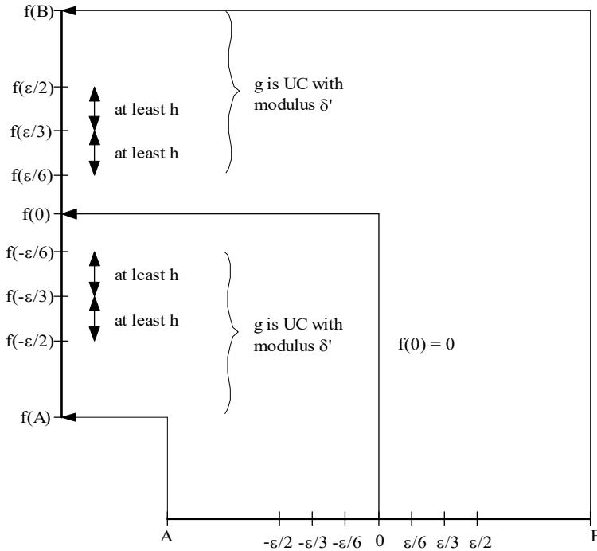

Let $\delta = \operatorname* { m i n } ( \delta ^ { \prime } , h / 2 )$ and suppose $| z - w | < \delta$ .We will now apply $\epsilon$ -Trichotomy several times,with $\epsilon$ equal to $h / 2$ . First,compare $z$ with $f ( \epsilon / 3 )$ .If $z > f ( \epsilon / 3 )$ ,then $w > f ( \epsilon / 6 )$ since $z$ and $w$ differ by less than $h / 2 < h$ . Thus,they are in the range where $g$ is uniformly continuous with modulus $\delta ^ { \prime } \leq \delta$ ，and so $| g ( z ) - g ( w ) | < \epsilon$ If $z$ and $f ( \epsilon / 3 )$ differ by less than $h / 2$ ，then $z$ and $w$ both lie in $| f ( - \epsilon / 2 ) , f ( \epsilon / 2 ) |$ ， so their images under $g$ lie in $\lfloor - \epsilon / 2 , \epsilon / 2 \rfloor$ ，and we are ok here too. If it turns out that $z < f ( \epsilon / 3 )$ , then compare $z$ with $f ( - \epsilon / 3 )$ If $z < f ( - \epsilon / 3 )$ then $w < f ( - \epsilon / 6 )$ since $z$ and $w$ differ by less than $h / 2$ ； thus we are again in the range of uniform continuity of $g$ .If $z$ is within $h / 2$ of $f ( - \epsilon / 3 )$ or $z > f ( - \epsilon / 3 )$ ,then $z$ and $w$ both lie in $[ f ( - \epsilon / 2 ) , f ( \epsilon / 2 ) ]$ , so we are ok (as above). Thus, in all cases, $| g ( z ) - g ( w ) | \leq \epsilon$ (If we needed strict inequality here,we could have replaced the given $\epsilon$ by a slightly smaller number or made the interval $\lfloor - \epsilon / 2 , \epsilon / 2 \rfloor$ slightly smaller from both ends). $\vert$

Exercise: Prove the continuity of the inverse in both the one- and two-sided cases using Lemma 4.2.24, Corollary 4.2.13,and Proposition 4.2.21.

# Appendix Il: The Goldbach Function

In the appendix to chapter 1 (see page 67) we defined the Goldbach number $G$ as follows:

$$
\begin{array} { r c l } { P ( n ) } & { = } & { \displaystyle ( n \mathrm { i s ~ c o n g r u e n t ~ t o ~ 3 ~ m o d ~ 4 ) } } \\ { g ( n ) } & { = } & { \displaystyle \left\{ \begin{array} { l l } { { 0 } } & { { \mathrm { i f } n = 1 \mathrm { ~ o r ~ 2 { \it ~ n } ~ i s ~ a ~ s u m ~ o f ~ 2 ~ p r i m e s } } } \\ { { 1 } } & { { \mathrm { i f } 2 n \mathrm { i s ~ n o t ~ a ~ s u m ~ o f ~ 2 ~ p r i m e s ~ a n d ~ } P } } \\ { { - 1 } } & { { \mathrm { i f } 2 n \mathrm { i s ~ n o t ~ a ~ s u m ~ o f ~ 2 ~ p r i m e s ~ a n d ~ } P } } \end{array} \right. } \\ { G _ { N } } & { = } & { \displaystyle \sum _ { k = 1 } ^ { N } \frac { g ( k ) } { 2 ^ { k } } } \\ { G } & { = } & { \displaystyle \left\{ \left[ G _ { N } - \frac { 1 } { 2 ^ { N - 1 } } , G _ { N } + \frac { 1 } { 2 ^ { N - 1 } } \right] , N = 1 , 2 , . . . \right\} } \end{array}
$$

We also saw (exercise) that the Goldbach Conjecture (every even number is a sum of 2 primes)is true if and only if $G = 0$

We can use $G$ and an idea of Von Neumann to construct a function $\mathcal { G }$ that calls into question the general applicability of the bisection method in finding roots of functions. $\mathcal { G }$ is defined on the interval $[ 0 , 1 ]$ ； its graph on [0,1/3] is the line joining $( 0 , - 1 )$ with $( 1 / 3 , G )$ ； on [1/3,2/3] it's the horizontal line joining $( 1 / 3 , G )$ with $( 2 / 3 , G )$ .Finally, on $\lfloor 2 / 3 , 1 \rfloor$ its graph is the line joining $( 2 / 3 , G )$ with $( 1 , 1 )$ Formally,

$$
\mathcal { G } ( x ) = \left\{ \begin{array} { c c l } { 3 x ( G + 1 ) - 1 } & { \mathrm { i f } } & { x \in [ 0 , 1 / 3 ] } \\ { G } & { \mathrm { i f } } & { x \in [ 1 / 3 , 2 / 3 ] } \\ { 3 G - 2 - 3 x ( G - 1 ) } & { \mathrm { i f } } & { x \in [ 2 / 3 , 1 ] } \end{array} \right.
$$

The existence of $\mathcal { G }$ is guaranteed by the existence of amalgamated piecewise functions (see Example 4.2.23).Here are three possibilities for the graph of $\mathcal { G }$ ：

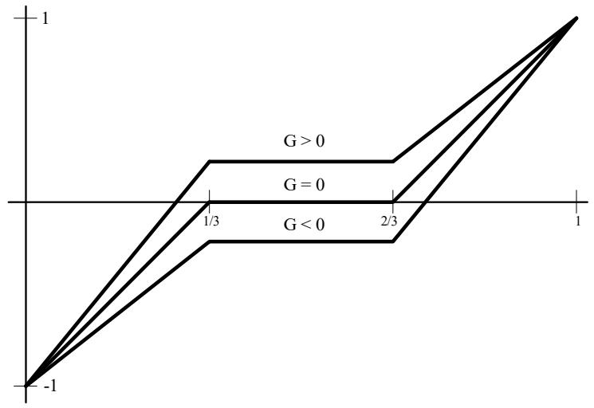

It is clear that $\mathcal { G }$ is a function computable to any desired degree of accuracy, much like the square root or trigonometric or exponential functions. A computer program to do this is easily designed. The fact that the Goldbach Conjecture is (as yet） unsolved has no bearing on this computability. Furthermore,it is clear (by amalgamation） that $\mathcal { G }$ is uniformly continuous on the interval [0,1]；note that $\mathcal { G } ( 0 ) = - 1 < 0$ and $\mathcal { G } ( 1 ) = 1 > 0$

Can we specify a zero of $\mathcal { G }$ ? The answer is clearly no. If the Goldbach Conjecture is true, the entire middle third of this interval is a zero.If the Goldbach Conjecture is false, then the zero lies either in the first or last thirds;however,we don't know which unless and until a counter-example is produced. It is instructive to see how badly bisection fails: $\mathcal { G } ( 1 / 2 ) = G$ ，and we don't know whether this is positive or negative or zero,so we have no way to choose the left or right half in order to proceed.

# Exercises

1. Prove that $G = \sum _ { k = 1 } ^ { \infty } { \frac { g ( k ) } { 2 ^ { k } } }$

2. Prove explicitly, using Corollary 4.2.23, that the Goldbach function $\mathcal { G }$ is actually well-defined.

# 5.1 Definition and Existence

We will take the approach here of specifying what we want an integral to be, and then show that the description we give determines how it must be defined. We then construct it. Of course,our motivation for the conditions imposed on the integral come from our intuitive idea of area,which is exploited when the integral is introduced in the usual calculus course. In keeping with our idea of doing a careful and abstract analysis,we'll try to avoid drawing pictures,at least for a while.

Let us fix some interval $I$ of reals. Throughout this section $I$ will be a finite interval. An integral on $I$ is a rule that associates with each subinterval $\lfloor u , v \rfloor \subset I$ and each uniformly continuous function $f$ on $\left\lfloor u , v \right\rfloor$ ,a well-defined real number denoted $\textstyle \int _ { u } ^ { v } f$ . We will assume that this association satisfies the following fundamental conditions,where $A \leq g \leq B$ on $\left\lfloor u , v \right\rfloor$ means that $A \leq g ( t ) \leq B$ for each $t \in \left\lfloor u , v \right\rfloor$

<table><tr><td>Basic Properties of Integrals CONDITION 5.1.1 For each [u,u] C I and each A≤ g ≤ B on</td></tr><tr><td>[u,u],we have A·(v- u)≤ Ju g≤B.(u-u).</td></tr><tr><td>CoNDITION 5.1.2 For each [a,b] C I with a ≤ c ≤ b and each g, we have</td></tr><tr><td>rc cb cb g+ g. Ja C a</td></tr></table>

REMARK 5.1.3 $\textstyle \int _ { x } ^ { x } g = 0$ . In fact, on $\lfloor x , x \rfloor$ we have $g ( x ) \leq g \leq g ( x )$ , so by Condition 5.1.1: $\begin{array} { r } { 0 = g ( x ) ( x - x ) \leq \int _ { x } ^ { x } g \leq g ( x ) ( x - x ) = 0 } \end{array}$

Suppose that such an integral exists. The numbers $_ u$ and $v$ in $\textstyle \int _ { u } ^ { v } g$ are sometimes called the limits of the integral and are assumed to satisfy $u \leq v$ in the first property above.We can extend the notation somewhat by eliminating this condition.

DEFINITION 5.1.4 For any $u , v \in I$ ，

$$
\int _ { u } ^ { v } g = \int _ { \operatorname* { m i n } ( u , v ) } ^ { v } g - \int _ { \operatorname* { m i n } ( u , v ) } ^ { u } g .
$$

REMARK 5.1.5 If we know that $u \leq v$ ， then Definition 5.1.4 reduces to our usual notation, because $\operatorname* { m i n } ( u , v ) = u$ and $\begin{array} { r } { \int _ { \operatorname* { m i n } ( u , v ) } ^ { v } g - \int _ { \operatorname* { m i n } ( u , v ) } ^ { u } g } \end{array}$ becomes $\begin{array} { r } { \int _ { u } ^ { v } g - \int _ { u } ^ { u } g = } \end{array}$

$\textstyle \int _ { u } ^ { v } g$ . On the other hand,if we know that $\textit { v } \leq \textit { u }$ ，then $\operatorname* { m i n } ( u , v ) = v$ ，and the definition and previous remark give

$$
\int _ { u } ^ { v } g = - \int _ { v } ^ { u } g .
$$

DEFINITION 5.1.6 A sequence of points $a = p _ { 0 } \leq p _ { 1 } \leq \dots \leq p _ { n } = b$ is called a partition of the interval $[ a , b ]$

Suppose, then, that we have $a = p _ { 0 } \leq p _ { 1 } \leq \cdot \cdot \cdot \leq p _ { n } = b$ in $I$ . A simple induction argument using Condition 5.1.2 of the integral shows that

$$
\int _ { a } ^ { b } g = \sum _ { i = 1 } ^ { n } \int _ { p _ { i - 1 } } ^ { p _ { i } } g
$$

If we also know that $L _ { i } \leq g \leq U _ { i }$ on each $\left\lfloor p _ { i - 1 } , p _ { i } \right\rfloor$ and we set $\Delta _ { i } = p _ { i } - p _ { i - 1 }$ ,then by using this equation and Condition 5.1.1, we can conclude that

$$
\sum _ { i = 1 } ^ { n } L _ { i } \Delta _ { i } \leq \int _ { a } ^ { b } g \leq \sum _ { i = 1 } ^ { n } U _ { i } \Delta _ { i } .
$$

Since our function is uniformly continuous,its values on intervals of small length cannot vary very much. This enables us to find bounds on partition intervals,which we now combine with inequality $( ^ { * } )$

PROPOSITION 5.1.7 Suppose $_ { g }$ is uniformly continuous on $\lfloor a , b \rfloor$ and $\delta = \delta ( \epsilon )$ is $a$ modulus of continuity for $g$ on $\lfloor a , b \rfloor$ (i.e. $| g ( y ) - g ( x ) | ~ < \epsilon$ when $| y - x | \ < \delta$ and $x , y \in \left\lfloor a , b \right\rfloor ,$ . Suppose also that we choose our partition so fine that $\Delta _ { i } = p _ { i } - p _ { i - 1 } <$ $\delta$ . Then for any choice of points $x _ { i } \in \lfloor p _ { i - 1 } , p _ { i } \rfloor$ , we have

$$
\begin{array} { c } { { \displaystyle \sum _ { i = 1 } ^ { n } g ( x _ { i } ) \Delta _ { i } - \epsilon ( b - a ) \le \int _ { a } ^ { b } g \le \sum _ { i = 1 } ^ { n } g ( x _ { i } ) \Delta _ { i } + \epsilon ( b - a ) , ~ i . e . } } \\ { { \displaystyle \left| \int _ { a } ^ { b } g - \sum _ { i = 1 } ^ { n } g ( x _ { i } ) \Delta _ { i } \right| \le \epsilon ( b - a ) . } } \end{array}
$$

Proof. To verify this, first note we have $g ( x _ { i } ) - \epsilon \leq g ( t ) \leq g ( x _ { i } ) + \epsilon$ for any $t \in \mathsf { \Gamma } | p _ { i - 1 } , p _ { i } |$ ， since $| x _ { i } - t | \leq \Delta _ { i } \leq \delta$ .Therefore, we can set $L _ { i } = g ( x _ { i } ) - \epsilon$ and $U _ { i } = g ( x _ { i } ) + \epsilon$ in the inequality ( $^ *$ )above (also note that $\begin{array} { r } { \sum _ { i = 1 } ^ { n } \Delta _ { i } = b - a ) } \end{array}$ ：

DEFINITION 5.1.8 Assume $g$ is defined on $[ a , b ]$ . For any partition $a = p _ { o } \leq p _ { 1 } \leq$   
$\cdots \leq p _ { n } = b$ and points $x _ { i } \in \lfloor p _ { i - 1 } , p _ { i } \rfloor$ ， a number of the form $\sum _ { i = 1 } ^ { n } g ( x _ { i } ) ( p _ { i } - p _ { i - 1 } )$ is   
called a Riemann sum.

So,if the integral exists,we know two important facts about it. First of all, Proposition 5.1.7 tells us that Riemann sums approximate it. Even better, it tells us that they approximate the integral within $\epsilon ( b - a )$ if the intervals in the partition have length less than the modulus of continuity $\delta ( \epsilon )$ . This gives us a method for calculating integrals if we can evaluate the limit of these sums: see the exercises.

Secondly, we know that if the integral exists, then it must be trapped between contained in the interval between the lower and upper sums $\begin{array} { r } { \left[ \sum _ { i = 1 } ^ { n } L _ { i } \Delta _ { i } , \sum _ { i = 1 } ^ { n } U _ { i } \Delta _ { i } \right] ) } \end{array}$ $\textstyle \sum _ { i = 1 } ^ { n } L _ { i } \Delta _ { i }$ and Thissugeststhattocostuct $\textstyle \sum _ { i = 1 } ^ { n } U _ { i } \Delta _ { i }$ (i.e.it must be the integral—in other words,show that it exists—we should look at the following family.

DEFINITioN 5.1.9 Given a uniformly continuous function $g$ on $\lfloor a , b \rfloor$ , define the family

$$
I ( g ; [ a , b ] ) = \left\{ \left[ \sum _ { i = 1 } ^ { n } L _ { i } \Delta _ { i } , \sum _ { i = 1 } ^ { n } U _ { i } \Delta _ { i } \right] \right\} ,
$$

where $\alpha = p _ { 0 } \leq p _ { 1 } \leq \cdots \leq p _ { n } = b$ is any partition of $\lfloor a , b \rfloor$ ，and $L _ { i } \leq g \leq U _ { i }$ on $\left\lfloor p _ { i - 1 } , p _ { i } \right\rfloor$ and $\Delta _ { i } = p _ { i } - p _ { i - 1 }$ for $i = 1 , \ldots , n$

PROPOSITION 5.1.10 $I ( \boldsymbol { g } ; \left\lfloor \boldsymbol { a } , \boldsymbol { b } \right\rfloor )$ is a consistent and fine family of real intervals.

Proof. First we prove fineness,which turns out to be easy. Given $\epsilon > 0$ ，let $\begin{array} { r } { \alpha = \frac { \epsilon } { 2 ( b - a ) } } \end{array}$ . (If necessary,to avoid dividing by $0$ , replace $b - a$ by a slightly larger number.)

Take $_ n$ so large that $( b - a ) / n$ is less than a modulus of continuity $\delta ( \alpha )$ We divide $[ a , b ]$ into $_ n$ equal pieces by setting $\begin{array} { r } { p _ { i } = a + \frac { i } { n } ( b - a ) } \end{array}$ for $i = 1 \dots n$

We now can let $L _ { i } = g ( p _ { i - 1 } ) - \alpha$ and $U _ { i } = g ( p _ { i - 1 } ) + \alpha$ . Note that we could have used, in place of $g ( p _ { i - 1 } )$ ,any $g ( t )$ for $t \in [ p _ { i - 1 } , p _ { i } ]$ . We now have

$$
\ell \left( \left[ \sum _ { i = 1 } ^ { n } L _ { i } \Delta _ { i } , \sum _ { i = 1 } ^ { n } U _ { i } \Delta _ { i } \right] \right) = 2 \alpha ( b - a ) < \epsilon ,
$$

so the family is fine.

Now let's turn to consistency. We must show that the left endpoint of any interval in $I ( \boldsymbol { g } ; \left\lfloor \boldsymbol { a } , \boldsymbol { b } \right\rfloor )$ does not exceed the right endpoint of any other. So we have to consider two partitions of $[ a , b ]$ ：

$$
\begin{array} { c } { { a = x _ { 0 } \leq x _ { 1 } \leq \cdots \leq x _ { m } = b \mathrm { ~ w i t h ~ } L _ { i } \leq g \leq U _ { i } \mathrm { ~ o n ~ } [ x _ { i - 1 } , x _ { i } ] } } \\ { { a = y _ { 0 } \leq y _ { 1 } \leq \cdots \leq y _ { n } = b \mathrm { ~ w i t h ~ } L _ { j } ^ { * } \leq g \leq U _ { j } ^ { * } \mathrm { ~ o n ~ } [ y _ { j - 1 } , y _ { j } ] . } } \end{array}
$$

Also, let $\Delta _ { i } = x _ { i } - x _ { i - 1 }$ and ${ \Delta } _ { j } ^ { \ast } = y _ { j } - y _ { j - 1 }$

Let $P ( m , n )$ denote the following statement, which expresses consistency for the sizes $_ { m }$ ， $_ { n }$ ：

$$
\left\{ \begin{array} { c } { \mathrm { F o r ~ a n y ~ i n t e r v a l ~ } [ a , b ] , \mathrm { ~ f u n c t i o n ~ } g \mathrm { ~ u n i f o r m l y ~ c o n t i n u o u s ~ o n ~ } [ a , b ] , } \\ { \mathrm { p o s i t i v e ~ i n t e g e r s ~ } m , n , { \mathrm { a n d ~ p a r t i t i o n s ~ a s ~ a b o v e } } , } \\ { \sum _ { i = 1 } ^ { m } L _ { i } \Delta _ { i } = L \leq U ^ { * } = \sum _ { i = 1 } ^ { n } U _ { i } ^ { * } \Delta i . } \end{array} \right\}
$$

Call $m + n$ the degree of $P ( m , n )$ . We establish the truth of $P ( m , n )$ by induction on the degree: the truth of $P ( m , n )$ always follows from the truth of $P ( p , q )$ of smaller degree. (Actually, it will always follow from the truth of $P ( m - 1 , n )$ or $P ( m , n - 1 )$ ）

The smallest possible values for $_ { m }$ and $_ { n }$ are both 1,so the smallest possible degree is 2. Since $P ( 1 , 1 )$ is clearly true (because the partitions both reduce to just endpoints),we can start our induction on degree 2. So let us suppose we have proved $P ( m , n )$ for all degrees up to (but not including) $m + n$ , and consider $P ( m , n )$

We cannot exclude both $x _ { 1 } \leq y _ { 1 }$ and $y _ { 1 } \leq x _ { 1 }$ ， so it suffices to prove $P ( m , n )$ in both of these cases. Suppose, then, that $x _ { 1 } \leq y _ { 1 }$ . We will show that $P ( m - 1 , n )$ implies that $L \leq U ^ { * }$ . First,note that

$$
a = x _ { 0 } = y _ { 0 } \leq x _ { 1 } \leq y _ { 1 } .
$$

Choose $t \in \left[ a , x _ { 1 } \right] \subset \left[ a , y _ { 1 } \right]$ . By assumption, $L _ { 1 } \leq g ( t )$ and $g ( t ) \leq U _ { 1 } ^ { * }$ , so we conclude that

$$
L _ { 1 } \Delta _ { 1 } = L _ { 1 } ( x _ { 1 } - x _ { 0 } ) \leq U _ { 1 } ^ { * } ( x _ { 1 } - x _ { 0 } ) .
$$

Let $c = x _ { 1 }$ and consider the following partitions of the interval $\displaystyle \left\lfloor c , b \right\rfloor$ ：

$$
\begin{array} { l } { c = x _ { 1 } \leq x _ { 2 } \leq \cdot \cdot \cdot \leq x _ { m } = b } \\ { c = x _ { 1 } \leq y _ { 1 } \leq \cdot \cdot \cdot \leq y _ { n } = b . } \end{array}
$$

Note that the first of these has only $m - 1$ intervals. The degree of $P ( m - 1 , n )$ is $m - 1 + n < m + n$ , so it is true by induction hypothesis. Leting $y _ { 0 } = x _ { 1 }$ , this tells us that

$$
\underbrace { \sum _ { i = 2 } ^ { m } L _ { i } \Delta _ { i } } _ { m - 1 { \mathrm { ~ t e r m s } } } \le \left( \underbrace { \sum _ { j = 2 } ^ { n } U _ { j } ^ { * } \Delta _ { j } ^ { * } } _ { n { \mathrm { ~ t e r m s } } } \right) + U _ { 1 } ^ { * } ( y _ { 1 } - x _ { 1 } ) .
$$

Now just add $L _ { 1 } \Delta _ { 1 } \leq U _ { 1 } ^ { * } ( x _ { 1 } - x _ { 0 } )$ to both sides to show that $L \leq U ^ { * }$

Thus, if $x _ { 1 } \leq y _ { 1 }$ ,then $L \leq U ^ { * }$ . In a symmetrical way, if $y _ { 1 } \leq x _ { 1 }$ ,then $P ( m , n - 1 )$ implies $L \leq U ^ { * }$ . So, in either case, $P ( m , n )$ can be established if we know it for either of the statements $P ( m - 1 , n )$ or $P ( m , n - 1 )$ of smaller degrees. Thus it is true for all degrees and we are done.■

Since the family $I ( \boldsymbol { g } ; \left\lfloor \boldsymbol { a } , \boldsymbol { b } \right\rfloor )$ is consistent and fine,the Completeness Theorem tells usthatitsliitistsAseavalreadyseen $\begin{array} { r } { \sum _ { i = 1 } ^ { n } L _ { i } \Delta _ { i } \leq \int _ { a } ^ { b } g \leq \sum _ { i = 1 } ^ { n } U _ { i } \Delta _ { i } } \end{array}$ so the integral must lie in every interval of the family. This leaves us no choice in how to define it.

DEFINITION 5.1.11 $\begin{array} { r } { \int _ { a } ^ { b } g = \operatorname* { l i m } \left( I ( g ; [ a , b ] ) \right) } \end{array}$

For historical reasons,we often write

$$
\int _ { a } ^ { b } g = \int _ { a } ^ { b } g ( x ) d x .
$$

The“variable” $_ { x }$ has no intrinsic significance; in fact,we can use any letter in this expression. If $x _ { i } ^ { * } \in [ x _ { i - 1 } , x _ { i } ]$ is chosen arbitrarily, then $L _ { i } \leq g ( x _ { i } ^ { * } ) \leq U _ { i }$ for each $i$ ， and we have

$$
\sum _ { i = 1 } ^ { n } L _ { i } \Delta _ { i } \leq \sum _ { i = 1 } ^ { n } g ( x _ { i } ^ { * } ) \Delta _ { i } \leq \sum _ { i = 1 } ^ { n } U _ { i } \Delta _ { i } .
$$

Thus, sums of the form $\textstyle \sum _ { i = 1 } ^ { n } g ( x _ { i } ^ { * } ) \Delta _ { i }$ lie in the intervals of $I ( \boldsymbol { g } ; \left\lfloor \boldsymbol { a } , \boldsymbol { b } \right\rfloor )$ ， and hence approximate the integral. The Greek $\sum$ was metamorphosed by Leibniz into $\boldsymbol { \int }$ ,the elongated S, in taking the limit over finer partitions,while the $g ( x _ { i } ^ { * } )$ became simply $g ( x )$ . When $_ x$ is the chosen variable, $\Delta _ { i } = x _ { i } - x _ { i - 1 } = \Delta x$ is written in the limit as $d x$ ,especially when all the subintervals $\lfloor x _ { i - 1 } , x _ { i } \rfloor$ have the same length.

Of course, we must formally check that $\textstyle \int _ { a } ^ { b } g$ defined in this way satisfies the two basic conditions for being an integral.

PROPOSITION 5.1.12 $\begin{array} { r } { \int _ { a } ^ { b } g = \operatorname* { l i m } ( I ( g ; [ a , b ] ) ) } \end{array}$ satisfies Conditions 5.1.1 and 5.1.2.

Proof. Suppose $A \leq g \leq B$ on $\lfloor u , v \rfloor$ . Then $\left[ A \cdot ( v - u ) , B \cdot ( v - u ) \right]$ is an interval in $I ( g ; \left\lfloor u , v \right\rfloor )$ . Since the limit of a family lies in each interval of the family, we see that $\begin{array} { r } { A \cdot ( v - u ) \leq \int _ { u } ^ { v } g \leq B \cdot ( v - u ) } \end{array}$ ,which establishes the first condition.

To prove the second, suppose that $a \leq c \leq b$ , and choose intervals $J \in I ( g ; \lfloor a , c \rfloor )$ and $K \in I ( g ; \lfloor c , b \rfloor )$ ：

$$
\begin{array} { r c l } { { J } } & { { = } } & { { \displaystyle \left[ \sum _ { i = 1 } ^ { n } { { L } _ { i } \cdot ( { x } _ { i } - { x } _ { i - 1 } ) } , \sum _ { i = 1 } ^ { n } { { U } _ { i } \cdot ( { x } _ { i } - { x } _ { i - 1 } ) } \right] } } \\ { { K } } & { { = } } & { { \displaystyle \left[ \sum _ { i = 1 } ^ { m } { { L } _ { i } ^ { \prime } \cdot ( { y } _ { i } - { y } _ { i - 1 } ) } , \sum _ { i = 1 } ^ { m } { { U } _ { i } ^ { \prime } \cdot ( { y } _ { i } - { y } _ { i - 1 } ) } \right] , } } \end{array}
$$

where the $_ { x }$ 's partition $\lfloor a , c \rfloor$ and the $_ y$ 's partition $\displaystyle \left\lfloor c , b \right\rfloor$

We can rewrite $K$ as

$$
K = \left[ \sum _ { i = n + 1 } ^ { n + m } L _ { i } \cdot ( x _ { i } - x _ { i - 1 } ) , \sum _ { i = n + 1 } ^ { n + m } U _ { i } \cdot ( x _ { i } - x _ { i - 1 } ) \right] ,
$$

where $x _ { n } = c$ ， $x _ { m + n } = b$ and $L _ { n + j } = L _ { j } ^ { \prime }$ ， $U _ { n + j } = U _ { j } ^ { \prime }$ for $j = 1 , \ldots , m$ Also,

$$
J + K = \left[ \sum _ { i = 1 } ^ { n + m } L _ { i } \cdot ( x _ { i } - x _ { i - 1 } ) , \sum _ { i = 1 } ^ { n + m } U _ { i } \cdot ( x _ { i } - x _ { i - 1 } ) \right] .
$$

Thus, $J + K \in I ( g ; \lfloor a , b \rfloor )$ ， and we have proved that the sum $J + K$ of any $I ( g ; \left\lfloor a , c \right\rfloor )$ -interval $J$ with any $I ( \boldsymbol { g } ; \left\lfloor c , b \right\rfloor )$ -interval $K$ is an $I ( \boldsymbol { g } ; \left\lfloor \boldsymbol { a } , \boldsymbol { b } \right\rfloor )$ -interval, so ${ \textstyle \int _ { a } ^ { b } } g \in$ $J + K$ . Of course, $\textstyle \int _ { a } ^ { c } g + \int _ { c } ^ { b } g \in J + K$ also. Given any $\epsilon > 0$ , we can always choose these intervals so that allof $J$ ， $K$ ,and $J + K$ have length less than $\epsilon$ Since $\textstyle { \int _ { a } ^ { c } g + \int _ { c } ^ { b } g }$ and $\textstyle \int _ { a } ^ { b } g$ both lie in a (consistent) family of intervals of arbitrarily smallength, they are equal.

SUMMARY 5.1.13 For functions $f$ uniformly continuous on $I$ and $[ u , v ] \subset I$ ，the Riemann integral $\textstyle \int _ { u } ^ { v } f$ exists and is determined by these properties.

1.If $A \leq f \leq B$ om $[ u , v ]$ ，then $\begin{array} { r } { A \cdot ( v - u ) \leq \int _ { u } ^ { v } f \leq B \cdot ( v - u ) . } \end{array}$

2.For $c \in \lfloor u , v \rfloor$ ， $\textstyle { \int _ { u } ^ { c } f + \int _ { c } ^ { v } f = \int _ { u } ^ { v } f }$

3. Given $\epsilon > 0$ and $u = p _ { 0 } \leq p _ { 1 } \leq \dots \leq p _ { n - 1 } \leq p _ { n } = v$ a partition of $\left\lfloor u , v \right\rfloor$ with $| p _ { k } - p _ { k - 1 } | < \delta ( \epsilon )$ (a modulus of continuity for $f$ ), then for any numbers $x _ { k } \in \lfloor p _ { k - 1 } , p _ { k } \rfloor$ ， the integral can be approximated by a Riemann sum with the following accuracy:

$$
\left| \int _ { u } ^ { v } f \ - \ \overbrace { \sum _ { k = 1 } ^ { n } f ( x _ { k } ) ( \underbrace { p _ { k } - p _ { k - 1 } } _ { \Delta _ { k } } ) } ^ { R i e m a n \ s u m } \right| \leq \epsilon \cdot { ( v - u ) } .
$$

# Exercises

1.Write down approximating sums $\sum _ { i = 1 } ^ { n } L _ { i } \Delta _ { i } , \sum _ { i = 1 } ^ { n } U _ { i } \Delta _ { i }$ for $\textstyle \int _ { a } ^ { b } g$ in each of the following cases. Use equal size partitions with $n = 4$ (i.e.each subinterval has length $\Delta = ( b - a ) / 4$ ).

(a) $g ( x ) = 3 x$ ， $\lfloor a , b \rfloor = \lfloor 0 , 2 \rfloor$ (b) $g ( x ) = x ^ { 2 }$ ， $\lfloor a , b \rfloor = \lfloor 0 , 1 \rfloor$ (c） $g ( x ) = x ^ { 2 }$ ， $\lfloor a , b \rfloor = \lfloor - 1 , 1 \rfloor$

2.For each of the functions and intervals in the previous question, let $x _ { i }$ be the midpoint of the partition interval $\left\lfloor p _ { i - 1 } , p _ { i } \right\rfloor$

$$
\begin{array} { l l } { { \mathrm { E s t i m a t e ~ t h e ~ i n t e g r a l ~ u s i n g ~ t h e ~ R i e m a n n ~ s u m } \displaystyle \sum _ { i = 1 } ^ { 4 } g ( x _ { i } ) \Delta . } } \\ { { \mathrm { E s t i m a t e ~ t h e ~ e r r o r } \displaystyle \int _ { a } ^ { b } g - \displaystyle \sum _ { i = 1 } ^ { 4 } g ( x _ { i } ) \Delta . ~ ( \mathrm { S e e ~ P r o p o s i t i o n ~ 5 . 1 . 7 . } ) } } \end{array}
$$

3. A function is called increasing on an interval $I$ if $f ( x ) \leq f ( y )$ for all $x \le y$ in $I$ .Suppose $f$ is increasing on $\lfloor a , b \rfloor$ .Partition $[ a , b ]$ into $_ { n }$ equal pieces, each of width $\Delta = ( b - a ) / n$ . Find simple upper and lower bounds for $\textstyle \int _ { a } ^ { b } f -$ n $\begin{array} { l } { \displaystyle \sum _ { i = 1 } f ( x _ { i } ) \Delta . \mathrm { ~ ( H i n t : ~ I n ~ e a c h ~ } [ p _ { i - 1 } - p _ { i } ] , \mathrm { ~ } f ( p _ { i - 1 } ) \le f ( x ) \le f ( p _ { i } ) ; \mathrm { ~ a ~ } } \\ { \displaystyle \sum _ { i = 1 } ^ { n } f ( p _ { i } ) - f ( p _ { i - 1 } ) = f ( b ) - f ( a ) . \mathrm { ~ } } \end{array}$ lso note that

Apply this idea to estimating the error in the previous problem.

4. The functions $^ { 1 }$ ， $_ { x }$ and $x ^ { 2 }$ are uniformly continuous on any finite $\lfloor a , b \rfloor$ . Compute $\textstyle \int _ { a } ^ { b } 1$ $\textstyle \int _ { a } ^ { b } x$ and $\textstyle \int _ { a } ^ { b } x ^ { 2 }$ (Hint:Youcanuse anypartitionsyou want,so divide $\lfloor a , b \rfloor$ into $_ { n }$ equal pieces, so your partition wil be $p _ { k } = a + k ( b - a ) / n$ ， $k = 0 , \ldots , n$ . It is also useful to know the formulas

$$
\begin{array} { l } { { \displaystyle \sum _ { k = 1 } ^ { n } k = n ( n + 1 ) / 2 } } \\ { { \displaystyle \sum _ { k = 1 } ^ { n } k ^ { 2 } = n ( n + 1 ) ( 2 n + 1 ) / 6 . } } \end{array}
$$

5. Suppose we have two partitions of the interval $\lfloor a , b \rfloor$

$$
\begin{array} { c c l } { { a } } & { { = } } & { { x _ { 0 } \leq x _ { 1 } \leq x _ { 2 } = b } } \\ { { a } } & { { = } } & { { y _ { 0 } \leq y _ { 1 } \leq y _ { 2 } = b . } } \end{array}
$$

Suppose also that $a = x _ { 0 } = y _ { 0 } \leq x _ { 1 } \leq y _ { 1 } \leq x _ { 2 } = y _ { 2 } = b$ . Use the idea and notation of the proof of Proposition 5.1.10 to show that $L _ { 1 } ( x _ { 1 } - x _ { 0 } ) + L _ { 2 } ( x _ { 2 } -$ $x _ { 1 } ) \leq U _ { 1 } ^ { * } ( y _ { 1 } - y _ { 0 } ) + U _ { 2 } ^ { * } ( y _ { 2 } - y _ { 1 } )$ . If you feel ambitious, try this exercise again with $a = x _ { 0 } \leq x _ { 1 } \leq x _ { 2 } \leq x _ { 3 } = b$ and $x _ { 2 } \leq x _ { 3 } = y _ { 2 } = b$

6.We have shown that Riemann sums approximate the integral $\textstyle \int _ { a } ^ { b } f$ . Instead of partitioning the interval $\lfloor a , b \rfloor$ into equal-size pieces,Pierre de Fermat (1601- 1665）used the following partition in computing $\textstyle \int _ { a } ^ { b } x ^ { S }$

$$
\begin{array} { r c l } { \beta } & { = } & { ( b / a ) ^ { 1 / n } = \sqrt [ n ] { b / a } } \\ { x _ { 0 } } & { = } & { a < \underbrace { a \beta } _ { x _ { 1 } } < \underbrace { a \beta } _ { x _ { 2 } } ^ { 2 } < \underbrace { a \beta } _ { x _ { 3 } } ^ { 3 } < \dots < \underbrace { a \beta } _ { x _ { n - 1 } } ^ { n - 1 } < a \beta ^ { n } = b = x _ { n } } \end{array}
$$

and the Riemann sum

$$
\sum _ { k = 1 } ^ { n } f ( x _ { k } ) ( x _ { k } - x _ { k - 1 } ) = \sum _ { k = 1 } ^ { n } \left( a \beta ^ { k } \right) ^ { S } ( a \beta ^ { k } - a \beta ^ { k - 1 } ) .
$$

Assume $S$ is an integer (positive or negative) not equal to $^ { - 1 }$ ,and show that this method works， producing $\begin{array} { r } { \int _ { a } ^ { b } x ^ { S } = \frac { b ^ { S + 1 } - a ^ { S + 1 } } { S + 1 } } \end{array}$ bs+1-as+1Youll have todothe following:

(a） Show that the lengths of the intervals become arbitrarily smal as $n \longrightarrow \infty$ ， i.e. $\beta \to 1$ as $n \longrightarrow \infty$ (this is exercise 3 on page 105).   
(b) Calculate the Riemann sums (they are geometric series).   
(c) Find the limit of the Riemann sums as $n \to \infty$ (recalling $( x ^ { K } - y ^ { K } ) =$ $( x - y ) ( x ^ { K - 1 } + x ^ { K - 2 } y + \cdot \cdot \cdot + y ^ { K - 1 }$ will be useful).

7. Prove these useful estimates (see [Mercer, 2005]).

(a)(Mercer's Lemma） Let $f$ and $g$ be uniformly continuous on $[ a , b ]$ ，with $m \leq f \leq M$ on this interval. Suppose that $\int _ { a } ^ { b } g ( x ) \ d x = 0$ . Then

$$
\left| { \begin{array} { l } { b } \\ { \displaystyle \int _ { a } f ( x ) g ( x ) \ d x } \\ { a } \end{array} } \right| \leq { \frac { 1 } { 2 } } ( M - m ) \int _ { a } ^ { b } | g ( x ) | \ d x .
$$

$$
( { \mathrm { H i n t } } \colon \int _ { a } ^ { b } f ( x ) g ( x ) \ d x = { \frac { 1 } { 2 } } \int _ { a } ^ { b } ( 2 f ( x ) - M - m ) g ( x ) \ d x . )
$$

(b） PROPOSITION Let $f$ and $g$ be uniformly continuous on $\lfloor a , b \rfloor$ with $m \leq$ $f \leq M$ and $n \leq g \leq N$ .Let

$$
F = { \frac { 1 } { b - a } } \int _ { a } ^ { b } f ( x ) \ d x { \mathrm { ~ a n d ~ } } G = { \frac { 1 } { b - a } } \int _ { a } ^ { b } g ( x ) \ d x .
$$

Then

$$
\begin{array} { r l } & { \left| \displaystyle \frac { 1 } { b - a } \int _ { a } ^ { b } f ( x ) g ( x ) ~ d x - F G \right| } \\ { \le } & { \displaystyle \frac { 1 } { 2 } \operatorname* { m i n } \left[ ( M - m ) \int _ { a } ^ { b } \left| g ( x ) - G \right| ~ d x , ~ ( N - n ) \int _ { a } ^ { b } \left| f ( x ) - F \right| ~ d x \right] . } \end{array}
$$

(Hint: Set $h = g - G$ so that $\int _ { a } ^ { b } h ( x ) \ d x = 0$ ； apply Mercer's Lemma to $f$ and $h$ . Now do the same thing with the roles of $f$ and $g$ reversed.)

# 5.2 Elementary Properties

We now deduce some of the properties of the definite integral from the definition and construction of the previous section.

PROPOSITION 5.2.1 Given $g$ continuous on $I$ and $a , b , c \in I$ ，

$$
\int _ { a } ^ { c } g + \int _ { c } ^ { b } g = \int _ { a } ^ { b } g .
$$

Proof. Using Definition 5.1.4 we can write

$$
\begin{array} { l l l } { \displaystyle \int _ { r } ^ { s } g = \int _ { \operatorname* { m i n } ( r , s ) } ^ { s } g - \int _ { \operatorname* { m i n } ( r , s ) } ^ { r } } \\ { \displaystyle \quad = \int _ { \operatorname* { m i n } ( r , s ) } ^ { s } g + \underbrace { \int _ { \operatorname* { m i n } ( r , s , t ) } ^ { \operatorname* { m i n } ( r , s ) } g - \int _ { \operatorname* { m i n } ( r , s , t ) } ^ { \operatorname* { m i n } ( r , s ) } g } _ { \displaystyle = \mathrm { ~ 0 ~ } } - \int _ { \operatorname* { m i n } ( r , s ) } ^ { r } g } \end{array}
$$

for any $r , s , t \in I$ . But we have verified that the integral satisfies Condition 5.1.2 in the previous section, and $\operatorname* { m i n } ( r , s , t ) \leq \operatorname* { m i n } ( r , s ) \leq r , s$ ,S0 $\begin{array} { r } { \int _ { \operatorname* { m i n } ( r , s ) } ^ { s } g + \int _ { \operatorname* { m i n } ( r , s , t ) } ^ { \operatorname* { m i n } ( r , s ) } g = } \end{array}$ $\int _ { \operatorname* { m i n } ( r , s , t ) } ^ { s }$ and $\begin{array} { r } { \int _ { \operatorname* { m i n } ( r , s ) } ^ { r } g + \int _ { \operatorname* { m i n } ( r , s , t ) } ^ { \operatorname* { m i n } ( r , s ) } g = \int _ { \operatorname* { m i n } ( r , s , t ) } ^ { r } } \end{array}$ We conclde that

$$
\int _ { r } ^ { s } = \int _ { \operatorname* { m i n } ( r , s , t ) } ^ { s } g - \int _ { \operatorname* { m i n } ( r , s , t ) } ^ { r } g .
$$

By applying this twice we get

$$
\begin{array} { l } { \displaystyle \int _ { a } ^ { c } g + \int _ { c } ^ { b } g = \int _ { \operatorname* { m i n } ( a , b , c ) } ^ { c } - \int _ { \operatorname* { m i n } ( a , b , c ) } ^ { a } g + \int _ { \operatorname* { m i n } ( a , b , c ) } ^ { b } g - \int _ { \operatorname* { m i n } ( a , b , c ) } ^ { c } g } \\ { \displaystyle = \int _ { \operatorname* { m i n } ( a , b , c ) } ^ { b } g - \int _ { \operatorname* { m i n } ( a , b , c ) } ^ { a } g } \\ { \displaystyle = \int _ { a } ^ { b } g . } \end{array}
$$

COROLLARY 5.2.2 If $g$ is uniformly continuous on $I$ and $p _ { 0 } , \ldots , p _ { n } \in I$ then

$$
\int _ { p _ { 0 } } ^ { p _ { n } } g = \sum _ { i = 1 } ^ { n } \int _ { p _ { i - 1 } } ^ { p _ { i } } g .
$$

(Prove this by induction on $_ { n }$ .）

COROLLARY 5.2.3 If $g$ is uniformly continuous on $I$ and $p , x , y \in I$ ，then

$$
\int _ { p } ^ { y } g - \int _ { p } ^ { x } g = \int _ { x } ^ { y } g .
$$

PROPOSITION 5.2.4 If $f$ is non-negative and continuous on $[ a , b ]$ and $f ( c ) > 0$ for some $c \in \left\lfloor a , b \right\rfloor$ ，then $\textstyle \int _ { a } ^ { b } f ( x ) d x > 0$

COROLLARY 5.2.5 If $f$ is non-negative and continuous on $[ a , b ]$ and $\textstyle \int _ { a } ^ { b } f ( x ) d x = 0$ ， then $f$ is identically $\boldsymbol { \mathit { 0 } }$ on $\lfloor a , b \rfloor$

COROLLARY 5.2.6 Suppose that $g \leq f \leq h$ on the interval $\lfloor a , b \rfloor$ and all three functions are continuous on $\lfloor a , b \rfloor$ . Then

$$
\int _ { a } ^ { b } g \leq \int _ { a } ^ { b } f \leq \int _ { a } ^ { b } h .
$$

Proof. These are all exercises.

DEFINITION 5.2.7 That $g$ and $h$ don't cross on $\lfloor a , b \rfloor$ means that either $g \geq h$ on all of $\lfloor a , b \rfloor$ or $h \geq g$ on all of $\lfloor a , b \rfloor$

We can now generalize our previous result without committing ourselves to a given ordering of $^ { a }$ and $b$ ,and $g$ and $h$ . This will be useful later in our discussion of Taylor series.

LEMMA 5.2.8 Suppose $f \geq 0$ is continuous on $\left| \operatorname* { m i n } ( a , b ) , \operatorname* { m a x } ( a , b ) \right|$ . Then

$$
\left| \int _ { a } ^ { b } f \right| = \int _ { \displaystyle \operatorname* { m i n } ( a , b ) } ^ { \displaystyle \operatorname* { m a x } ( a , b ) } f .
$$

Proof.Exercise.■

PROPOsITiON 5.2.9 Suppose that the continuous functions $_ { g }$ and $h$ don't cross on the interval $\left| \operatorname* { m i n } ( a , b ) , \operatorname* { m a x } ( a , b ) \right|$ .If $f ( x )$ is between $g ( x )$ and $h ( x )$ for all $_ { x }$ in this interoual, then $\textstyle \int _ { a } ^ { b } f$ is between $\textstyle \int _ { a } ^ { b } g$ and $\textstyle \int _ { a } ^ { b } h$

Proof. Because $g$ and $h$ don't cross,we only have to check the result for the two cases $g \leq h$ and $h \leq g$ . So suppose $g \leq h$ . Since $f ( x )$ is between $g ( x )$ and $h ( x )$ ，we have $g ( x ) \leq f ( x ) \leq h ( x )$ for all $_ { x }$ in the interval. Now we have

$$
\begin{array} { r l } {  { \int _ { a } ^ { b } h - \int _ { a } ^ { b } \varrho \bigg \vert - \bigg \vert \int _ { a } ^ { b } h - g \bigg \vert } } \\ & { - \bigg \vert \int _ { a \in \{ a , b \} } ^ { b } \mathrm { d } a - g \bigg \vert } \\ & { = \int _ { a \in \{ a , b \} } ^ { a \in \{ a , b \} } ( h - f ) + ( f - g ) } \\ & { = \int _ { a \in \{ a , b \} } ^ { a \in \{ a , b \} } h - f + \int _ { a \in \{ a , b \} } ^ { a \in \{ a , b \} } f - g } \\ & { -  \int _ { a } ^ { b } h - f  +  \int _ { a } ^ { b } f - g  } \\ & { -  \int _ { a } ^ { b } \mathrm { d } a - \int _ { a } ^ { b } f  +  \int _ { a } ^ { b } f - \int _ { a } ^ { b } g  } \end{array}
$$

Thus,we get our result in this case by Proposition 1.5.44. The case $h \leq g$ is,of course,similar.

PROPOSITION 5.2.10（LINEARITY OF THE INTEGRAL） GiUen $f$ and $_ { g }$ continuous on $\lfloor a , b \rfloor$ and $r , s \in \mathbb { R }$ ， we have

$$
\int _ { a } ^ { b } ( r f + s g ) = r \int _ { a } ^ { b } f + s \int _ { a } ^ { b } g .
$$

Proof. We will show that for any $\epsilon > 0$ , the left and right sides differ by less than $\epsilon$ For the moment, let $\epsilon _ { 1 } > 0$ be arbitrary. Since $f$ and $g$ are continuous, so is $r f + s g$ Let $\delta _ { f } ( \epsilon _ { 1 } )$ ， $\delta _ { g } ( \epsilon _ { 1 } )$ and $\delta _ { r f + s g } ( \epsilon _ { 1 } )$ be moduli of continuity for these functions,and let $\delta$ be the minimum of these three moduli. Let $p _ { 0 } , \ldots , p _ { n }$ be a partition of $\lfloor a , b \rfloor$ with $p _ { i } - p _ { i - 1 } < \delta$ for each $i = 1 , \dots n$

Let $\begin{array} { r } { A _ { f } = \sum _ { i = 1 } ^ { n } f ( p _ { i } ) \Delta _ { i } } \end{array}$ and $\begin{array} { r } { A _ { g } = \sum _ { i = 1 } ^ { n } g ( p _ { i } ) \Delta _ { i } } \end{array}$ be Riemann sums for $\textstyle \int _ { a } ^ { b } f$ and $\textstyle \int _ { a } ^ { b } g$ Then $r A _ { f } + s A _ { g }$ is a Riemann sum for $r f + s g$ We know fromProposition5.1.7 that these Riemann sums differ from the integral they approximate by an amount less than $\epsilon _ { 1 } ( b - a )$

$$
\begin{array} { r l } & { \displaystyle \int _ { a } ^ { b } ( r f + s g ) - r \int _ { a } ^ { b } f - s \int _ { a } ^ { b } g \Bigg | } \\ & { = \displaystyle  ( \int _ { a } ^ { b } r f + s g ) - ( r A _ { f } + s A _ { g } ) + r A _ { f } - r ( \int _ { a } ^ { b } f ) + s A _ { g } - s ( \int _ { a } ^ { b } g )  } \\ & { \le \displaystyle  ( \int _ { a } ^ { b } r f + s g ) - ( r A _ { f } + s A _ { g } )  + \displaystyle  r A _ { f } - r ( \int _ { a } ^ { b } f )  +  s A _ { g } - s ( \int _ { a } ^ { b } g )  } \\ & { \le \epsilon _ { 1 } ( b - a ) + \displaystyle  r \rvert \epsilon _ { 1 } ( b - a ) + \displaystyle  s  \epsilon _ { 1 } ( b - a ) } \\ & { = \epsilon _ { 1 } ( b - a ) ( 1 + \displaystyle  r  + \displaystyle  s  ) . } \end{array}
$$

By choosing $\begin{array} { r } { \epsilon _ { 1 } < \frac { \epsilon } { ( b - a ) ( 1 + | r | + | s | ) } } \end{array}$ we will have $\textstyle \int _ { a } ^ { b } r f + s g$ and $\textstyle r \int _ { a } ^ { b } f + s \int _ { a } ^ { b } g$ within $\epsilon$ . Since they are arbitrarily close,they are equal. $|$

# Exercises

1. Suppose $h$ is formed by amalgamating the UC functions $f$ on $\lfloor a , b \rfloor$ and $g$ on $\lfloor b , c \rfloor$ (see Proposition 4.2.21)； so $h ( x ) = f ( x )$ for $x \in \left[ a , b \right]$ and $h ( x ) = g ( x )$ for $x \in \lfloor b , c \rfloor$ (with $f ( b ) = g ( b )$ ). What can you say about the integral $\textstyle \int _ { a } ^ { c } h$ ？

2. Suppose $f \geq 0$ is UC on $\left| \operatorname* { m i n } ( a , b ) , \operatorname* { m a x } ( a , b ) \right|$ . Prove that

$$
\left| \int _ { a } ^ { b } f \right| = \int _ { \operatorname* { m i n } ( a , b ) } ^ { \operatorname* { m a x } ( a , b ) } f .
$$

(Hint: You may separate into cases $a \leq b$ and $b \leq a$ : see Remark1.5.36 .)

3. Suppose $f$ is UC on $[ a , b ]$ Prove that $\textstyle \left| \int _ { a } ^ { b } f \right| \leq \int _ { a } ^ { b } | f |$ . (One way is to use Proposition 5.1.7.)

4. Suppose $g \leq f \leq h$ on the interval $\lfloor a , b \rfloor$ ， and all three functions are UC on $[ a , b ]$ . Then

$$
\int _ { a } ^ { b } g \leq \int _ { a } ^ { b } f \leq \int _ { a } ^ { b } h .
$$

5. Suppose $f$ is UC on $\lfloor a , b \rfloor$ . For each positive integer $_ { n }$ ,let $\Delta = \left( b - a \right) / n$ and $x _ { k } = a + k \Delta$ ， $k = 0 , \ldots , n$ . Define

$$
A _ { n } = { \frac { 1 } { n } } \left( f \left( x _ { 1 } \right) + f ( x _ { 2 } ) + \cdots + f ( x _ { n } ) \right) .
$$

(a) Express $A = \operatorname* { l i m } _ { n \to \infty } A _ { n }$ in terms of an integral. (Hint: $A _ { n }$ is a Riemann sum.) $A$ is called the average value of $f$ on the interval $\lfloor a , b \rfloor$ (b）If $L \leq f \leq U$ on $\lfloor a , b \rfloor$ ， prove that $L \leq A \leq U$ as well.

# 5.3Extensions and Improper Integrals

In this section, we show how the integral of a function can sometimes be extended, even to an interval on which the function may not be uniformly continuous.

Suppose $f$ is uniformly continuous on an interval $I$ . If we fix some $c \in I$ ，then we can define, for all $x \in I$ ，

$$
\phi ( x ) = \int _ { c } ^ { x } f .
$$

PROPOSITION 5.3.1 $\phi$ is a uniformly continuous function on $I$

Proof. Since $f$ is continuous on $I$ ， $f$ is bounded on $I$ . Thus, $- B \leq f ( x ) \leq B$ for some $B \geq 0$ ，and

$$
\begin{array} { l } { | \phi ( y ) - \phi ( x ) | = \displaystyle \left| \int _ { c } ^ { y } f - \int _ { c } ^ { x } f \right| = \displaystyle \left| \int _ { x } ^ { y } f \right| } \\ { \displaystyle \leq B | y - x | . } \end{array}
$$

Hence, $\phi$ is uniformly continuous with modulus of continuity $\delta ( \epsilon ) = \epsilon / B$

Suppose now that $I$ is an open finite interval $( a , b )$ and $f$ is uniformly continuous on $I$ . Then we know (see Theorem 4.2.11) that $f$ has a unique, uniformly continuous extension $\overline { { f } }$ to the closed interval $\lfloor a , b \rfloor$ . We can now define a new function on $\lfloor a , b \rfloor$ by $\begin{array} { r } { \widetilde { \phi } ( x ) = \int _ { c } ^ { x } \overline { { f } } } \end{array}$ . Clearly $\phi ( x )$ and $\overset { \sim } { \phi } ( x )$ are equal for $x \in ( a , b )$ Since $\overline { { f } }$ is uniformly continuous on $[ a , b ]$ ,so is $\widecheck { \phi }$ , by Proposition 5.3.1. Of course, $\phi$ is uniformly continuous on $( a , b )$ by the same proposition，so it has its own unique uniformly continuous extension to $[ a , b ]$ ; call it $\overline { { \phi } }$ . Because of this uniqueness,we have

PROPOSITION 5.3.2 $\overset { \sim } { \phi } = \overline { { \phi } }$ is the unique extension of $\begin{array} { r } { \phi ( x ) = \int _ { c } ^ { x } f } \end{array}$ t0 $[ a , b ]$

ExAMPLE 5.3.3 Let $f ( t ) = { \frac { t ^ { 2 } - 4 } { t - 4 } }$ on the interval $\left[ 0 , 2 \right)$ Clearly ${ \overline { { f } } } ( t ) = t + 2$ ertends $f$ to all of $\mathbb { R }$ . For any $0 \leq a \leq x < 2$ , we have

$$
\begin{array} { r c l } { { \displaystyle \int _ { a } ^ { x } \frac { t ^ { 2 } - 4 } { t - 4 } d t } } & { { = } } & { { \displaystyle \left( x ^ { 2 } / 2 + 2 x \right) - \left( a ^ { 2 } / 2 + 2 a \right) } } \\ { { } } & { { } } & { { } } \\ { { } } & { { \longrightarrow } } & { { 6 - \displaystyle \left( a ^ { 2 } / 2 + 2 a \right) } } \\ { { } } & { { = } } & { { \displaystyle \int _ { a } ^ { 2 } t + 2 \ d t . } } \end{array}
$$

(We have used the Fundamental Theorem of Calculus here-we'll prove it in the nert chapter!)

EXAMPLE 5.3.4 Let $f ( t ) = { \frac { \sin t } { t } }$ on the interval $( 0 , 1 ]$ : see the exercises.

$\textstyle \int _ { 2 } ^ { 1 0 } { \frac { 1 } { x ^ { 2 } } } d x \ )$ $\int _ { 2 } ^ { \infty } { \frac { 1 } { x ^ { 2 } } } d x )$   
interval that includesapoint wherethefunctionisnotdfied (e.g. $\textstyle \int _ { 0 } ^ { 1 } { \frac { 1 } { \sqrt { x } } } d x )$ The   
idea in both cases is to integrate almost up to the place in question ( $\infty$ in the first   
example,O in the second),and then try to take a limit as we get closer and closer.

DEFINITION 5.3.5 The symbol $\textstyle \int _ { a } ^ { b } f$ (where either one of a or b or both may be $\infty$ ） is called an improper integral if $f$ is not UC on $\lfloor a , b \rfloor$ (half open or open when an endpoint is $\infty$ ）

DEFINITiON 5.3.6 Suppose that c is either a finite number or $\infty$ ，and that $f$ is uniformly continuous on every finite subinterval of $I = \lfloor a , c \ )$

1. When $c = \infty$ ， we say that $\int _ { a } ^ { M \to \infty } f$ converges if, for every $\epsilon > 0$ there is a number $A ( \epsilon )$ such that

$$
\left| \int _ { a } ^ { u } f - \int _ { a } ^ { v } f \right| < \epsilon
$$

for any $u , v > A ( \epsilon )$ ， $u , v \in I$

2. For c finite, we say that $\int _ { a } ^ { M  c - } f$ converges if, for every $\epsilon > 0$ there is a $\delta > 0$ such that

$$
\left| \int _ { a } ^ { u } f - \int _ { a } ^ { v } f \right| < \epsilon
$$

for any $u , v \in ( c - \delta , c )$ ， $u , v \in I$

3. When $c = \infty$ ，say that sM→∞ f converges to L if, for each ∈> O there is a number $B ( \epsilon )$ such that

$$
\displaystyle \left| \int _ { a } ^ { u } f - L \right| < \epsilon
$$

4. For c finite, we say that $\int _ { a } ^ { M  c - } f$ converges to $L$ if, for each $\epsilon > 0$ there is a $\delta > 0$ such that

$$
\displaystyle \left| \int _ { a } ^ { u } f - L \right| < \epsilon
$$

for $u \in ( c - \delta , c )$ ， $u \in I$

REMARk 5.3.7 You can easily reword the above definitions to deal with the case $\textstyle \int _ { M \to - \infty } ^ { b } f$ $\textstyle \int _ { M \to c + } ^ { b } f$ With straightforward modifications, the proofs below apply to these integrals as well.

PROPOSITION 5.3.8 Forcfinite or $\infty$ ，f $\int _ { a } ^ { M  c - } f$ converges, then there is a number L such that $\int _ { a } ^ { M  c } f$ conuerges to $L$

Proof. Let $\begin{array} { r } { F ( u ) = \int _ { a } ^ { u } f } \end{array}$ . We give the proof for $c = \infty$ ; the other proof is similar. As you will notice, the argument is almost exactly the same as the one we gave for Cauchy Completeness (Theorem 3.1.14). For each $\epsilon > 0$ and $u > A ( \epsilon )$ ,we form the real interval $\lvert F ( u ) - \epsilon , F ( u ) + \epsilon \rvert$ .Let $\mathcal { F }$ be the family of all such intervals for all $\epsilon > 0$ Since, for any $\epsilon > 0$ we can find an $A ( \epsilon )$ ， $\mathcal { F }$ is fine. To prove consistancy, we must show that $F ( u ) - \epsilon _ { 1 } \leq F ( v ) + \epsilon _ { 2 }$ and $F ( v ) - \epsilon _ { 2 } \leq F ( u ) + \epsilon _ { 1 }$ ，where $u > A ( \epsilon _ { 1 } )$ and $v > A ( \epsilon _ { 2 } )$ . As usual by our ruling out argument (see 1.5.33),it suffices to assume $A ( \epsilon _ { 1 } ) \leq A ( \epsilon _ { 2 } )$ .Then $u , v > A ( \epsilon _ { 1 } )$ s0 $F ( u )$ and $F \left( v \right)$ are within $\epsilon _ { 1 }$ ； consequently $F ( v ) - \epsilon _ { 1 } \leq F ( u ) \leq F ( v ) + \epsilon _ { 1 }$ . The left-hand inequality gives $F ( v ) - \epsilon _ { 2 } < F ( v ) \leq$ $F ( u ) + \epsilon _ { 1 }$ , while the right-hand inequality gives $F ( u ) - \epsilon _ { 1 } \le F ( v ) < F ( v ) + \epsilon _ { 2 }$ .We let $L$ be the limit of this family. For similar details, see the proof that Cauchy sequences converge (Theorem 3.1.14).

NOTATION 5.3.9 When an improper integral converges, we say that it erists， and write $\textstyle \int _ { a } ^ { \infty } f$ r $\textstyle \int _ { a } ^ { c } f$ (respectively: $\textstyle \int _ { - \infty } ^ { b } f$ or $\textstyle \int _ { c } ^ { b } f )$ for the number $L$ it converges to.

DEFINITION 5.3.10 If sM-∞ f=-or+,we say that the integraldiverges (similarly for $\textstyle \int _ { M \to - \infty } ^ { b } f )$

EXAMPLE 5.3.11 When we've proved the Fundamental Theorem of Calculus, we'll know that $\begin{array} { r } { \int _ { a } ^ { b } \frac { 1 } { x ^ { 2 } } = \frac { 1 } { a } - \frac { 1 } { b } } \end{array}$ (with $0 < a < b$ ). It followus that $\textstyle \int _ { a } ^ { \infty } { \frac { 1 } { x ^ { 2 } } } = 1 / a$ (One can prove that this integral converges directly-without computing it—using the convergence of the sequence $\sum _ { i = 1 } ^ { k } { \frac { \ d H _ { 1 } } { \ d i ^ { 2 } } }$ . See the exercises at the end of this section.)

Now we turn to defining doubly infnite improper integrals, $\textstyle \int _ { - \infty } ^ { \infty } f$ . We first prove a result which is the analogue of Tail Convergence for series (Proposition 3.3.11), namely that the convergence of an integral on an infinite interval $\lfloor a , \infty )$ depends only on the infinite segment, not on the value of the integral over a finite subinterval:

LEMMA 5.3.12（TAIL CONVERGENCE FOR INTEGRALS） Suppose $f$ is uniformly continuous on every finite subinterval of $\lfloor a , \infty )$ ， and that $a \leq b$ ; then $\textstyle \int _ { b } ^ { \infty } f$ exists if and only if $\textstyle \int _ { a } ^ { \infty } f$ erists, and $\textstyle \int _ { a } ^ { \infty } f = \int _ { a } ^ { b } f + \int _ { b } ^ { \infty } f$

Proof. Suppose $\textstyle \int _ { b } ^ { \infty } f$ exists， and let $A ( \epsilon )$ be given as in the definition. Suppose $u , v > A ( \epsilon )$ . Then

$$
\left| \int _ { a } ^ { u } f - \int _ { a } ^ { v } f \right| = \left| \int _ { a } ^ { b } f + \int _ { b } ^ { u } f - \int _ { a } ^ { b } f - \int _ { b } ^ { v } \right| = \left| \int _ { b } ^ { u } f - \int _ { b } ^ { v } f \right| < \epsilon .
$$

The addition formula is a straightforward consequence.■

A similar proof shows that the same tail convergence holds for infinite lower limits.

LEMMA 5.3.13 Suppose $f$ is uniformly continuous on every finite subinterval of $( - \infty , b ]$ ， and that $a \leq b$ ; then $\textstyle \int _ { - \infty } ^ { a } f$ erists if and only if $\textstyle \int _ { - \infty } ^ { b } f$ exists, and $\textstyle \int _ { - \infty } ^ { b } f =$ $\textstyle \int _ { - \infty } ^ { a } f + \int _ { a } ^ { b } f$

PROPOSITION 5.3.14 Suppose $f$ is uniformly continuous on every finite subinterval of $( - \infty , \infty )$ . If, for some a and $b$ , both integrals $\textstyle \int _ { - \infty } ^ { u } f$ and $\textstyle \int _ { b } ^ { \infty } f$ erist, then this is true for any a and b. Furthermore, $\textstyle { \int _ { - \infty } ^ { a } f + \int _ { a } ^ { b } f + \int _ { b } ^ { \infty } f }$ is independent of a and $b$

Proof. Use Lemmas 5.3.12 and 5.3.13.

DEFINITION 5.3.15 When $f$ is uniformly continuous on every finite subinterval of $( - \infty , \infty )$ , the integral $\textstyle \int _ { - \infty } ^ { \infty } f$ exists if both integrals $\textstyle \int _ { - \infty } ^ { u } f$ and $\textstyle \int _ { a } ^ { \infty } f$ erist; we write $\textstyle \int _ { - \infty } ^ { \infty } f = \int _ { - \infty } ^ { u } f + \int _ { a } ^ { \infty } f$

(The previous proposition shows that this is independent of $^ { a }$ ）

In a similar way we can deal with improper integrals over a finite interval $\lfloor a , b \rfloor$ ， where $f$ may behave badly at some $c$ between $^ { a }$ and $b$

DEFINITION 5.3.16 Suppose $f$ is uniformly continuous on all closed subintervals of $[ a , c )$ and of $( c , b ]$ If thelimuts $\textstyle \int _ { a } ^ { c } f = \int _ { a } ^ { M \to c - } f$ and $\textstyle \int _ { M \to c + } ^ { b } f$ both erist, then we define $\textstyle \int _ { a } ^ { b } f = \operatorname* { l i m } \int _ { a } ^ { M \to c - } f + \operatorname* { l i m } \int _ { M \to c + } f$

PROPOSITION 5.3.17 Let $\int ^ { I m p r o p e r }$ denote one of the integrals $\textstyle \int _ { a } ^ { \infty }$ ， $\int _ { - \infty } ^ { b }$ $\int _ { - \infty } ^ { \infty }$ 0r $\textstyle \int _ { a } ^ { b }$ .If $\int ^ { I m p r o p e r } f$ and $\int ^ { I m p r o p e r } g$ erist,then for any constants $\alpha$ and $\beta$ ,the integral of $\alpha f + \beta g$ exists,and

$$
\int ^ { I m p r o p e r } \alpha f + \beta g = \alpha \int ^ { I m p r o p e r } f + \beta \int ^ { I m p r o p e r } g .
$$

Proof. Exercise.

One of the most useful ways of showing that the improper integral of a function converges is by comparing it with the integral of a function known to converge. The simplest test is the following.

PROPOSITION 5.3.18 (INTEGRAL COMPARISON TEST） SuppOSe that both $f$ and $g$ are UC on every finite subinterval of $\lfloor a , \infty )$ ，and $0 \leq f \leq g$

1.1f $\textstyle \int _ { a } ^ { \infty } g$ exists, then $\textstyle \int _ { a } ^ { \infty } f$ exists as well.   
2.If $\textstyle \int _ { a } ^ { \infty } f$ diverges, then $\textstyle \int _ { a } ^ { \infty } g$ diverges as well.

Proof. For the first part, $\begin{array} { r } { \left| \int _ { a } ^ { u } f - \int _ { a } ^ { v } f \right| = \left| \int _ { u } ^ { v } f \right| \le \left| \int _ { u } ^ { v } g \right| = \left| \int _ { a } ^ { u } g - \int _ { a } ^ { v } g \right| < \epsilon } \end{array}$ (for $_ u$ and $v$ sufficiently large). The divergence part is left as an exercise. $|$

Just as for series,there is a limit form of this test.

PROPOSITION 5.3.19 （LIMIT COMPARISON） Suppose that both $f$ and $g$ are nonnegative and UC on every finite subinterval of $[ a , \infty )$ and $\operatorname* { l i m } _ { x \to \infty } { \frac { f ( x ) } { g ( x ) } } = L$ with $0 < L < \infty$ . Then $\textstyle \int _ { a } ^ { \infty } f$ converges if and only if $\textstyle \int _ { a } ^ { \infty } g$ converges.

DEFINITION 5.3.20 A function $f$ ， $U C$ on every finite subinterval of $( - \infty , \infty )$ ，is said to be absolutely integrable if $\textstyle \int _ { - \infty } ^ { \infty } | f |$ converges.

EXAMPLE 5.3.21 The functions $\textstyle { \frac { x } { 1 + x ^ { 3 } } }$ and xe-x² are both uniformly continuous on all of $\mathbb { R }$ ， and for $| x |$ sufficiently large, each is smaller than $\textstyle { \frac { 1 } { x ^ { 2 } } }$ . It follows that both of these functions are absolutely integrable. Also, the function $\frac { \sin x } { 1 + x ^ { 2 } }$ has absolute value less than $\textstyle { \frac { 1 } { x ^ { 2 } } }$ when $x > 0$ ， so it too is absolutely integrable.

We can now use the comparison test to show that absolute integrability implies convergence of the integral (what you would expect). The trick is to write $f$ as the sum

$$
f = f ^ { + } - f ^ { - } ,
$$

where

$$
f ^ { + } ( x ) = { \frac { | f ( x ) | + f ( x ) } { 2 } }
$$

and

$$
f ^ { - } ( x ) = { \frac { | f ( x ) | - f ( x ) } { 2 } } .
$$

One can prove directly that $0 \leq f ^ { + } ( x ) \leq | f ( x ) |$ and $0 \leq f ^ { \mathrm { ~ - ~ } } ( x ) \leq | f ( x ) |$ ; this also follows from the following lemma.

LEMMA 5.3. ${ \mathrm { 2 2 ~ } } { \frac { | A | + A } { 2 } } = \operatorname* { m a x } ( A , 0 ) { \mathrm { ~ } } a n d { \frac { | A | - A } { 2 } } = \operatorname* { m a x } ( - A , 0 ) .$

Proof. It suffices to prove these in the cases $0 \leq A$ and $A \leq 0$ , where they are clear.

So we see that $0 \leq f ^ { + } ( x ) \leq | f ( x ) |$ and $0 \leq f ^ { \ - } ( x ) \leq | f ( x ) |$ . Clearly, $f ^ { + }$ and $f ^ { - }$ are UC wherever $f$ is, so we can apply the Comparison Test to each of them to prove the following (absolute integrability implies integrability).

COROLLARY 5.3.23 Suppose $f$ is UC on every finite subinterval of $( a , \infty )$

1.f $\int _ { a } ^ { \infty } { | f | }$ exists, then $\textstyle \int _ { a } ^ { \infty } f$ exists.   
2.If $\textstyle \int _ { - \infty } ^ { \infty } | f |$ exists, then $\textstyle \int _ { - \infty } ^ { \infty } f$ exists.

EXAMPLE 5.3.24 $\int _ { - \infty } ^ { \infty } { \frac { \sin { x } } { 1 + x ^ { 2 } } } d x$ exists.

A number of very important mathematical functions are defned in terms of improper integrals. Below are two of them; see the exercises for further discussion. Computing these and other improper integrals or finding their special properties usually requires the Fundamental Theorem of Calculus or techniques such as integration by substitution or by parts. We will return to improper integrals when we have developed these tools.

DEFINITION 5.3.25 For $x > 0$ , the Gamma function is defined by

$$
\Gamma ( x ) = \int _ { 0 } ^ { \infty } t ^ { x - 1 } e ^ { - t } d t .
$$

DEFINITION 5.3.26 For certain functions $h ( t )$ ， the Laplace transform $H$ of $h$ is defined by

$$
H ( x ) = \int _ { 0 } ^ { \infty } e ^ { - x t } h ( t ) \ d t .
$$

Finally, we can use improper integrals to test for convergence of series whose terms are given by evaluating continuous functions on integers.

subinteroal of THEOREM 5.3.27（INTEGRAL TEST） Suppose $\mathbb { R }$ and is weakly decresing.Then $f \geq 0$ $\scriptstyle \sum _ { k = 0 } ^ { \infty } f ( k )$ is continuous on every finite converges if and only f $\textstyle \int _ { 0 } ^ { \infty } f ( x ) d x$ converges.

Proof. Since $\begin{array} { r } { \int _ { k } ^ { k + 1 } f ( x ) \leq f ( k ) } \end{array}$ $f$ is decreasing, When $n \geq m$ $f ( k + 1 ) \leq f ( x ) \leq f ( k )$ we can sum t get for $x \in \left\lfloor k , k + 1 \right\rfloor$ ,s0 $f ( k + 1 ) \leq$

$$
\sum _ { k = m } ^ { n } f ( k + 1 ) \leq \int _ { m } ^ { n + 1 } f ( x ) d x \leq \sum _ { k = m } ^ { n } f ( k ) .
$$

Thus, if either the sum or the integral satisfies the Cauchy convergence criterion, so does the other.■

Note that the convergence of neither sum nor the integral depends on the lower limit being 0: $\scriptstyle \sum _ { k = K } ^ { \infty } f ( k )$ converges if and only if $\textstyle \int _ { K } ^ { \infty } f ( x ) d x$ converges.

(See exercises for applications.)

In conclusion,we note that although the Riemann integral was initially defined only for functions uniformly continuous on a finite interval, we were able to extend it by defining improper integrals for certain functions. We make this formal in the following extension of our original definition.

DEFINITION 5.3.28（RIEMANN INTEGRABILITY） $f$ is said to be Riemann integrable over an interval $\lfloor a , b \rfloor$ if there is a partition $a = p _ { 0 } \leq p _ { 1 } \leq \cdots \leq p _ { n - 1 } \leq p _ { n } = b$ such that the integrals (proper or improper)

$$
V _ { k } = \int _ { p _ { k - 1 } } ^ { p _ { k } } f
$$

for $k = 1 , \dots , n$ exist. When this is the case, we define

$$
\int _ { a } ^ { b } f = V _ { 1 } + V _ { 2 } + . . . + V _ { n } .
$$

REMARk 5.3.29 Definition 5.3.28 assumes a partition by a finite number of points. $\sum _ { k = 1 } ^ { N } V _ { k }$ $N  \infty$ $a = - \infty$ $b = \infty$

# Exercises

1. Suppose hat $f$ isUCoeveryledsuimtral f $( c , b ]$ Discuss $\textstyle \int _ { M \to c + } ^ { b } f$ and define the improper integral $\textstyle \int _ { c } ^ { b } f$ (when $f$ is not UC on $\displaystyle \left\lfloor c , b \right\rfloor$ itself).   
2. Suppose that $0 \leq f \leq g$ and both functions are UC on every finite subinterval of $\lfloor a , \infty )$ . Prove that $\textstyle \int _ { a } ^ { \infty } f$ diverges implies that $\textstyle \int _ { a } ^ { \infty } g$ diverges.   
3.Complete the divergence part of the integral comparison test，Proposition 5.3.18.   
4. Prove the limit comparison test for integrals,Proposition 5.3.19..   
5. Prove that $\textstyle \int _ { 1 } ^ { \infty } { \frac { 1 } { x ^ { 2 } } }$ converges (see page 103).   
6. Prove that $\int _ { - c } ^ { \infty } e ^ { - x }$ exists. (Hint: $e ^ { - x }$ is eventually smaller than $\textstyle { \frac { 1 } { x ^ { 2 } } }$ : see Corollary 3.2.15 and the previous exercise.)   
7. Prove that if $f$ is UC on every finite subinterval of $| k , \infty )$ and $a , b \in \lfloor a , \infty \rfloor$ ， then $\textstyle \int _ { a } ^ { \infty } f$ exists if and only if $\textstyle \int _ { b } ^ { \infty } f$ exists.   
8. Suppose that $f \geq 0$ is UC on $\lfloor 1 , \infty )$ and $\textstyle { \int _ { 1 } ^ { \infty } f = B }$ ,a finite number.

(a) Give an example to show that lim f(x) need not exist. (b)Prove that if lim f(x) exists,it must be $0$

9. Prove the following part of Proposition 5.3.17: If $\textstyle \int _ { c } ^ { \infty } f$ and $\int _ { c } ^ { \infty } g$ exist, then for any constants $_ { \alpha }$ and $\beta$ ， the integral of $\alpha f + \beta g$ exists,and

$$
\int _ { c } ^ { \infty } \alpha f + \beta g = \alpha \int _ { c } ^ { \infty } f + \beta \int _ { c } ^ { \infty } g .
$$

10.Usetheintegalcmparisontesttoproetat cosdx exists.

11. Prove that if $f$ is UC on every finite interval and $\operatorname* { l i m } _ { x \to \infty } f ( x ) = L$ , then

$$
\operatorname* { l i m } _ { x \to \infty } { \frac { 1 } { x } } \int _ { 0 } ^ { x } f ( t ) d t = L .
$$

(In other words,“If $f$ is eventually close to $L$ , then its average value is eventually close to $L$ .")

12. Prove that the Gamma function $\textstyle \Gamma ( x ) ~ = ~ \int _ { 0 } ^ { \infty } t ^ { x - 1 } e ^ { - t } d t$ (for $x \ > \ 0$ ）exists. (Hint:For $t$ big enough, $t ^ { x - 1 } < e ^ { t / 2 }$ because of Corollary 3.2.15； use the integral comparison test.)

13.For certain functions $h ( t )$ , the Laplace transform $H$ of $h$ is defined by

$$
H ( x ) = \int _ { 0 } ^ { \infty } e ^ { - x t } h ( t ) \ d t .
$$

A function $h ( t )$ is exponentially bounded if, for some $k > 0$ , there is a constant $K > 0$ ， such that $| h ( t ) | \leq e ^ { k t }$ for $t > K$

(a) Prove that exponentially bounded functions have Laplace transforms. (b） Give the values of $_ { x }$ for which $H ( x )$ is defined. (c) Give some examples of such functions. (Computing Laplace transforms usually requires integration by parts,which we'll deal with later.)

14. Let $\textstyle f ( x ) = { \frac { \sin x } { x } }$ . Assume the following two facts about this function (we will prove them later when we examine the sine function more carefully):

· $f ( x )$ is UC on any finite closed interval not containing 0. $\operatorname* { l i m } _ { x \to 0 } { \frac { \sin x } { x } } = 1$

Prove the following (Lemma 4.2.24 will be helpful).

(a) $f ( x )$ is uniformly continuous on any punctured interval $I - \{ 0 \}$ (b) $f ( x )$ has a uniformly continuous extension to all of $\mathbb { R }$

(c） The integrals $\textstyle \int _ { 0 } ^ { b } f$ ， $\int _ { - b } ^ { 0 } f$ exist for any $b \geq 0$

15.Prove that the functions $\frac { \sin x } { 1 + x ^ { 2 } }$ and ${ x ^ { | \alpha | } } { e ^ { - | x | } }$ are absolutely integrable.

16. $\textstyle \int _ { 1 } ^ { \infty } { \frac { \sin x } { x } } d x$ is alassic eaplefanimpror integaltatovgstot absolutely.

(a) The easiest way to see that this integral converges is to use integration by parts. Although we haven't proved this technique yet,we will in the next chapter (see Proposition 6.5.3), so you are allowed to use it.

$$
\int _ { 1 } ^ { M } \frac { \sin x } { x } d x = \left. \frac { - \cos x } { x } \right| _ { 1 } ^ { M } - \int _ { 1 } ^ { M } \frac { \cos x } { x ^ { 2 } } d x .
$$

(b) To see that the integral $\int _ { 1 } ^ { M } \Big | \frac { \sin x } { x } \Big | d x$ goes to $\infty$ with $M$ ，look at the numbers $\begin{array} { r } { I _ { n } = \int _ { n \pi } ^ { ( n + 1 ) \pi } \left| \frac { \sin x } { x } \right| d x } \end{array}$ |dx,and show each one is greater than 2n+1: (Hint:Look at one arch of $| \sin x |$ and note that the function is at least $\textstyle { \frac { 1 } { 2 } }$ on a pretty big subinterval.)

17. (In this exercise you are allowed to use formulas from calculus,including the Fundamental Theorem (see Corollary 6.3.6) and integration by substitution (see Proposition 6.5.1). Use the integral test (Theorem 5.3.27)—or any simpler test—to analyze the convergence/divergence of these series.

(a) $\scriptstyle \sum _ { k = 1 } ^ { \infty } 1 / k$ (harmonic series)   
(b) 1 $\textstyle \sum _ { k = 1 } ^ { \infty } 1 / k ^ { 2 }$   
(c） 18 $\scriptstyle \sum _ { k = 1 } ^ { \infty } 1 / k ^ { p }$   
(d) $\sum _ { k = 1 } ^ { \infty } { \frac { \ln k } { k } }$   
(e) M=2   
(f) =2(n

18.(Project） The definition of the Riemann integral can be extended to functions which are piecewise uniformly continuous,even if their pieces do not agree enough to be amalgamated.For example,consider ${ \mathrm { J u m p } } ( x )$ defined in Example 4.2.29 on page 159:

$$
\operatorname { J u m p } ( x ) = { \left\{ \begin{array} { l l } { 0 } & { { \mathrm { i f ~ } } - 5 \leq x < - 4 } \\ { \cos ( \pi x ) } & { { \mathrm { i f ~ } } - 4 \leq x < - 1 } \\ { x / 3 } & { { \mathrm { i f ~ } } - 1 \leq x < 1 } \\ { 0 } & { { \mathrm { i f ~ } } 1 \leq x < 2 } \\ { { \frac { 1 } { 2 } } ( x - 3 ) ^ { 2 } + { \frac { 1 } { 2 } } } & { { \mathrm { i f ~ } } 2 \leq x < 4 } \\ { 1 . 3 } & { { \mathrm { i f ~ } } 4 \leq x \leq 5 } \end{array} \right. } .
$$

This function is UC on each of the open intervals $( - 5 , - 4 )$ ， $( - 4 , - 1 )$ ， $( - 1 , 1 )$ ， $( 1 , 2 )$ ， $( 2 , 4 )$ and $( 4 , 5 )$ , so its restriction to each extends to six separate functions which are UC on the corresponding closed intervals. Explain how to define ${ \textstyle \int _ { a } ^ { b } } \mathrm { J u m p } ( x )$ where $- 5 \leq a \leq b \leq 5$ and generalize this. If $a \ \in \ \left[ - 5 , 5 \right]$ is $\textstyle \int _ { a } ^ { u } \operatorname { J u m p } ( x )$ uniformly continuous as a function of $_ u$ for $u \in \left[ - 5 , 5 \right]$ ？

# 6.1 Definitions and Basic Properties

Although the classical definition, found in most calculus books,of the derivative of $f$ at the point $^ { a }$ ，

$$
f ^ { \prime } ( a ) = \operatorname* { l i m } _ { h \to 0 } { \frac { f ( a + h ) - f ( a ) } { h } } ,
$$

has some interest,the derivative function, $f ^ { \prime } ( x )$ , is of far more significance in the broad field of analysis—for example, in the Fundamental Theorem of Calculus or Taylor series etc. Consequently,we will sidestep the definition of the derivative at a single point,and make our central concept the derivative function.

What would it mean for a function $g ( x )$ to be the derivative of the function $f ( x )$ ？ We would have to have the quotient $\frac { f ( x + h ) - f ( x ) } { h }$ very close to $g \left( x \right)$ when $h$ is small.More precisely,given $\epsilon > 0$ we can find a $\delta > 0$ such that, for any $_ { x }$ ，this quotient will be within $\epsilon$ of $g ( x )$ whenever $0 < | h | < \delta$ . We could take this as our definition of derivative, but since the idea of derivative is so important and we will have to verify that one function is the derivative of another for so many diferent kinds of functions, we will try to express this notion in two other equivalent ways.

The first thing we can do is change notation slightly. Let's write $y = x + h$ s0 that $h = y - x$ . With this substitution

$$
\frac { f ( x + h ) - f ( x ) } { h }
$$

becomes

$$
{ \frac { f ( y ) - f ( x ) } { y - x } } .
$$

DEFINITION 6.1.1 The change in the values of a function $f$ divided by the change in its imputs, $\frac { f ( y ) - f ( x ) } { y - x }$ is called the difference quotient of $f$ .

We can now say that $g \left( x \right)$ is the derivative of $f ( x )$ if the difference quotient can be made as close to $g ( x )$ as we want by making $| y - x |$ sufficiently small-all expressed, of course, in $\delta , \epsilon$ language.

Finally, since the difference quotient must be close to $g ( x )$ , let's look at their difference and call it $r ( x , y )$ (since it depends on both $_ { x }$ and $_ y$ ）：

$$
{ \frac { f ( y ) - f ( x ) } { y - x } } - g ( x ) = r ( x , y ) .
$$

Now multiply through by $y - x$ to get rid of the quotient and rearrange things to obtain

$$
f ( y ) - f ( x ) = g ( x ) \cdot ( y - x ) + r ( x , y ) \cdot ( y - x ) .
$$

With this formulation, $g ( x )$ will be the derivative of $f \left( x \right)$ when $r \left( x , y \right)$ can be made small by making $y - x$ small (but not $0$ ). The following definition helps to express this precisely. Note that we are also introducing the idea of things happening when we have several variables ( $_ x$ and $_ y$ ）belonging to a set $E$

DEFINITION 6.1.2 $r ( x , y ) \to 0$ as $y \longrightarrow x$ on $E \subset \mathbb { R }$ means that for each $\epsilon > 0$ there isa $\delta > 0$ (depending on $\epsilon$ ）such that $| r ( x , y ) | \leq \epsilon$ whenever $_ { x }$ and $_ y$ are in $E$ and $0 < | y - x | < \delta$

Please note that $r \left( x , y \right)$ does not even have to exist when $x = y$

We now show that the three formulations of $g$ being the derivative of $f$ are logically equivalent. We also take into account that a function may not have a derivative everywhere,but only on some set of reals $E$

PROPOSITION 6.1.3 For a function $f$ on the set $E \subset \mathbb { R }$ ， the following statements are equivalent.

1. There is a function $g ( x )$ ， defined for $x \in E$ ， with the property that for each $\epsilon > 0$ we can find a $\delta > 0$ (depending on $\epsilon$ ）such that

$$
\left| { \frac { f ( x + h ) - f ( x ) } { h } } - g ( x ) \right| \leq \epsilon
$$

whenever $x , x + h \in E$ and $0 < | h | < \delta$

2. There is a function $g ( x )$ ， defined for $x \in E$ ， with the property that for each $\epsilon > 0$ we can find a $\delta > 0$ (depending on $\epsilon$ ）such that

$$
\left| { \frac { f ( y ) - f ( x ) } { y - x } } - g ( x ) \right| \leq \epsilon
$$

whenever $x , y \in E$ and $0 < | y - x | < \delta$

3. There are functions $g ( x )$ and $r ( x , y )$ ， defined for $x , y \in E$ and $| y - x | > 0$ ，such that

$$
f ( y ) - f ( x ) = g ( x ) \cdot ( y - x ) + r ( x , y ) \cdot ( y - x )
$$

where $r ( x , y ) \to 0$ as $y  x$

Proof. ( $1 \Longrightarrow 2$ ):Let $h = y - x$ $2 { \Longrightarrow } 3$ ): Let $r ( x , y ) = \frac { f ( y ) - f ( x ) } { y - x } - g ( x )$ $3 \Longrightarrow 1$ ):Let $y = x + h$ , then f（x+h）-f（2）-g（）|=lr(xy).

DEFINITION 6.1.4（UNIFORMLY DIFFERENTIABLE） If the aboUe equivalent conditions hold, we say that $f$ is uniformly differentiable on $E$ ， with derivative $g ( x )$ (Uniformly differentiable will often be abbreviated as UD.)The derivative will usually be denoted $f ^ { \prime } ( x )$

EXAMPLE 6.1.5 Because ${ \frac { ( x + h ) ^ { 2 } - x ^ { 2 } } { h } } - 2 x = { \frac { 2 x h + h ^ { 2 } } { h } } - 2 x = 2 x + h - 2 x = h ,$ we see that $x ^ { 2 }$ is uniformly differentiable on all of $\mathbb { R }$ with derivative $2 x$

EXAMPLE 6.1.6 We can do a similar trick for $n > 2$ ， starting with the factorization

$$
\begin{array} { r c l } { y ^ { n } - x ^ { n } } & { = } & { \displaystyle \left( \sum _ { i = 1 } ^ { n } y ^ { n - i } x ^ { i - 1 } \right) ( y - x ) } \\ & { = } & { \displaystyle \underbrace { \left( \sum _ { i = 1 } ^ { n } \left( y ^ { n - i } x ^ { i - 1 } - x ^ { n - 1 } \right) \right) } _ { = \ : r ( x , y ) } ( y - x ) + n x ^ { n - 1 } ( y - x ) . } \end{array}
$$

On any finite interval, $( y ^ { n - i } x ^ { i - 1 } - x ^ { n - 1 }  0 )$ as $y \longrightarrow x$ (hence $r ( x , y ) \to 0 .$ ），s0 $x ^ { n }$ is uniformly differentiable with derivative $n x ^ { n - 1 }$ on each finite subinterual of $\mathbb { R }$ (byCondition 3).

ExAMPLE 6.1.7 ${ \frac { { \sqrt { y } } - { \sqrt { x } } } { y - x } } - { \frac { 1 } { 2 { \sqrt { x } } } } = { \frac { 1 } { { \sqrt { y } } + { \sqrt { x } } } } - { \frac { 1 } { 2 { \sqrt { x } } } } = { \frac { { \sqrt { x } } - { \sqrt { y } } } { \left( { \sqrt { y } } + { \sqrt { x } } \right) 2 { \sqrt { x } } } }$ Since we have already proved that the square-root function is continuous, the numerator of the last fraction can be made small by making $\lvert y - x \rvert$ small. If we are in some interval $\lfloor c , \infty )$ ，with $c > 0$ ， then the denominator of this fraction is bounded away from zero, so the whole fraction can be made small. Thus, $\sqrt { x }$ is UD on $\lfloor c , \infty )$ ，with derivative $\frac { 1 } { 2 { \sqrt { x } } }$ (by Condition 2).

REMARK 6.1.8 There is another condition, equivalent to the three that constitute the definition of UD: There is a function $F ( x , y )$ such that

$$
f ( y ) - f ( x ) = F ( x , y ) ( y - x )
$$

and $F ( x , y ) \to F ( x , x )$ as $y \longrightarrow x$ （ $\boldsymbol { F } ( \boldsymbol { x } , \boldsymbol { x } )$ will be $f ^ { \prime } ( x )$ ). Details of this approach are presented in [Bridger and Stolzenberg， 1999]. One of its advantages is that it has generalizations to higher dimensional spaces.

DEFINITION 6.1.9 For $\epsilon > 0$ in the definition of $U D$ ，the $\delta > 0$ ， mentioned in the first two equivalent conditions and implied by $r ( x , y ) \to 0$ in the third,is called a modulus of differentiability. It depends on the function $f$ ， the set $E$ ，and $\epsilon$ ， so may be denoted $\delta _ { f } ( \epsilon , E )$

Like a modulus of continuity, a modulus of differentiability $\delta _ { f } ( \epsilon , E )$ is not unique;   
if you have one,any positive smaller number is also a modulus of differentiability.

Furthermore, there may not be any way of telling whether the one you have is best possible (i.e. largest).

Before going further, it is reasonable to ask if a function can have two different derivatives on a set $E$ . Suppose that $g _ { 1 }$ and $g _ { 2 }$ both satisfy the definition of being the derivative of $f$ . Then we have

$$
\begin{array} { l } { \displaystyle | g _ { 1 } ( x ) - g _ { 2 } ( x ) | = \left| g _ { 1 } ( x ) - \frac { f ( y ) - f ( x ) } { y - x } + \frac { f ( y ) - f ( x ) } { y - x } - g _ { 2 } ( x ) \right| } \\ { \displaystyle \leq \left| \frac { f ( y ) - f ( x ) } { y - x } - g _ { 1 } ( x ) \right| + \left| \frac { f ( y ) - f ( x ) } { y - x } - g _ { 2 } ( x ) \right| . } \end{array}
$$

Both of these last quantities can be made arbitrarily smallif $0 < | y - x |$ is sufficiently small.The only problem is whether the set $E$ contains numbers $_ y$ arbitrarily close to $_ x$

PROPOSITION 6.1.10 （UNIQUENESS OF THE DERIVATIVE） SuppOSe $E$ is a subset of $\mathbb { R }$ with the property that for each each $x \in E$ and $\delta > 0$ ， there exists at least one $y \in E$ such that $0 < | y - x | < \delta$ . Then if $f$ is differentiable on $E$ , it has exactly one derivative.

PROPOSITION 6.1.11 If $f$ is uniformly differentiable, then $f ^ { \prime }$ is uniformly continuous.

Proof. Because the difference quotient $D ( x , y ) = { \frac { f ( y ) - f ( x ) } { y - x } }$ is symmetric in $_ { x }$ and $_ y$ ,if $_ { x }$ and $_ y$ are within $\delta ( \epsilon / 2 )$ of each other,both $f ^ { \prime } ( x )$ and $f ^ { \prime } ( y )$ are within $\epsilon / 2$ of $D ( x , y ) = D ( y , x )$ ,and hence within $\epsilon$ of each other. $\mid$

Since uniformly continuous functions on finite closed intervals are bounded, Proposition 6.1.11 gives us the following.

COROLLARY 6.1.12 On finite closed intervals, $f ^ { \prime }$ is bounded.

PROPOSITION 6.1.13 If $f ^ { \prime }$ is bounded, then $f$ is uniformly continuous.

Proof. By making $| y - x | < \delta ( 1 )$ ，we can make the difference quotient within 1 of $f ^ { \prime } ( x )$ (by definition of UD)； so if $\left| f ^ { \prime } ( x ) \right|$ is bounded by $B$ ，then $\left| { \frac { f ( y ) - f ( x ) } { y - x } } \right| <$ $B + 1$ .Thus $| f ( y ) - f ( x ) | \leq ( B + 1 ) | y - x |$ ，which can be made less than $\epsilon$ by making $\vert y - x \vert < \mathrm { m i n } ( \delta , \epsilon / ( B + 1 ) )$ . Note that we could also have observed that $| f ( y ) - f ( x ) | \leq \left( B + 1 \right) | y - x |$ is the kind of Lipschitz condition that we have seen implies continuity (see Example 4.1.7).■

We already know enough to calculate the derivative of the basic exponential and logarithm functions, $e ^ { x }$ and $\log _ { e } ( x )$ . Later we will deal with the more general $a ^ { x }$ and $\log _ { a } ( x )$

PROPOSITION 6.1.14 For all $c \in \mathbb R$ ， $e ^ { x }$ is uniformly differentiable on $( - \infty , c ]$ with derivative $e ^ { x }$ .

Proof. For $h > 0$ , from Corollary 2.4.12 we have

$$
\frac { 1 } { e ^ { h } } \frac { e ^ { h } - 1 } { h } \leq 1 \leq \frac { e ^ { h } - 1 } { h } .
$$

Setting $h = y - x$ for $x < y$ ， we get

$$
e ^ { x } ( y - x ) \leq e ^ { y } - e ^ { x } \leq e ^ { y } ( y - x ) .
$$

In fact,it is easy to check that these last inequalities hold for $y < x$ as well. Let us now define $r ( x , y )$ by the equation

$$
r ( x , y ) ( y - x ) = e ^ { y } - e ^ { x } - e ^ { x } ( y - x ) .
$$

The function $r$ is certainly defined for all $x \ < y$ and $x > y$ .By inequality $( * )$ we have

$$
0 \leq r ( x , y ) ( y - x ) \leq ( e ^ { y } - e ^ { x } ) ( y - x ) .
$$

and

$$
| r ( x , y ) | \leq | e ^ { y } - e ^ { x } | \leq \operatorname* { m a x } ( e ^ { x } , e ^ { y } ) | y - x | \leq e ^ { c } | y - x | \to 0
$$

as $\left| y - x \right| \to 0$ on each interval $( - \infty , c ]$ $|$

PROPOSITION 6.1.15 For all $R ~ > ~ 0$ ， $f ( x ) \ = \ \ln { x }$ is uniformly differentiable on $| R , \infty )$ with derivative $1 / x$

Proof. Use inequality ( $^ *$ ）above with the substitutions $y  \ln y$ (so $e ^ { y }  y$ ）and $x \to \ln x$ (so $e ^ { x } \to x$ ）：

$$
{ \frac { 1 } { y } } ( y - x ) \leq \ln y - \ln x \leq { \frac { 1 } { x } } ( y - x ) .
$$

This gives

$$
{ \frac { 1 } { y } } \leq { \frac { \ln y - \ln x } { y - x } } \leq { \frac { 1 } { x } } .
$$

By reasoning similar to that in the proof of Proposition 6.1.14, we can show that if we define $s ( x , y )$ by the equation

$$
( y - x ) \cdot s ( x , y ) = \ln y - \ln x - { \frac { 1 } { x } } ( y - x ) ,
$$

then (by the previous inequality):

$$
\begin{array} { r c l } { | s ( x , y ) | } & { \leq } & { \displaystyle \frac { | y - x | } { | x y | } } \\ & { \leq } & { \displaystyle \left( \operatorname* { m a x } \frac { 1 } { x } , \frac { 1 } { y } \right) | y - x | } \\ & { \leq } & { \displaystyle \frac { 1 } { R } | y - x | \to 0 \mathrm { ~ a s ~ } | y - x | \to 0 \mathrm { ~ o n ~ } [ R , \infty ) . } \end{array}
$$

# Exercises

1. Prove the following directly and in detail from the definition,and give intervals on which they hold.

(a) $k$ is UD with derivative 0 ( $k$ a number). (b) $k x$ is UD,with derivative $k$ （ $k$ a number). (c） $x ^ { 3 }$ is UD with derivative $3 x ^ { 2 }$ (d) $1 / x$ is UD with derivative $- 1 / x ^ { 2 }$ (e) $\sqrt { x }$ is UD with derivative $\frac { 1 } { 2 { \sqrt { x } } }$ (see Example 6.1.7).

2.Prove that $\sqrt { x }$ is not UD on the half open interval $( 0 , a ]$ for any $a > 0$ . (Hint: For any $\epsilon , \delta > 0$ show that if $y = x - \delta / 2$ you can choose $x \ > \ 0$ so that $\left| \frac { \sqrt { y } - \sqrt { x } } { y - x } - \frac { 1 } { 2 \sqrt { x } } \right| > \epsilon$ while clearly $| y - x | = \delta / 2 < \delta$ .）

3. Write out in detail the proof of Proposition 6.1.3 showing the equivalence of the three conditions for differentiability.

4. Suppose $f$ is UD on $( a , b )$ and $x \in ( a , b )$ Prove that lim f(x +h)- f(x) $f ^ { \prime } ( x )$

5. Suppose $f$ is UD on $( a , b )$ and $f ^ { \prime } ( c ) = 0$ for some $c \in ( a , b )$ .Prove that $f$ cannot satisfy a left Lipschitz condition $L ( y - x ) \leq f ( y ) - f ( x )$ on $( a , b )$ with $L > 0$

6. Suppose we have two functions $s \left( x \right)$ and $c \left( x \right)$ defined and UC on all of $\mathbb { R }$ ，with the following properties.

(a) $s ^ { 2 } + c ^ { 2 } = 1$   
(b） $s ( x + y ) = s ( x ) c ( y ) + c ( x ) s ( y )$   
(c） $c ( 0 ) = 1$ (so $s ( 0 ) = 0$ by property (a))   
(d) $s ( h ) / h \to 1$ as $h  0$

Prove that $s \left( x \right)$ is UD on all of $\mathbb { R }$ with derivative $c ( x )$ . Note that both functions are bounded. You'llneed to use parts (a) and (d) to show that ${ \frac { c ( h ) - 1 } { h } } \to 1$ as $h  0$ . Later,we will define the sine and cosine functions rigorously using power series,and show that they have these properties. We will also be able to prove other familiar properties of the sine and cosine using facts (a) through (d).

7. Prove that $| x |$ is not uniformly differentiable on any interval $[ a , b ]$ such that $a < 0 < b$

8. Suppose $f$ is UD on $\lfloor a , b \rfloor$ . Make a conjecture about when $| f |$ will be UD as well (see the previous exercise). Try to prove your conjecture.

9.Suppose that $D$ is dense in $S$ and $f$ is uniformly continuous and differentiable on $D$ with derivative $g$ .Prove that both $f$ and $g$ can be extended to $S$ ，on which $f ^ { \prime } = g$ as well. (Hint: You can approximate the difference quotients and derivatives with variables in $S$ arbitrarily closely by quotients and derivatives with variables in $D$ .Prove that $\left| { \frac { f ( x + h ) - f ( x ) } { h } } - g ( x ) \right| ~ < ~ \epsilon + \epsilon _ { 1 }$ where $\epsilon _ { 1 } > 0$ is arbitrary.） In special cases,a similar result can be obtained using the Fundamental Theorem of Calculus,as we will see later.

10.Suppose that $f$ is UD on an interval $I$ .We know that $f ^ { \prime }$ is then UC on $I$ For and $\epsilon > 0$ ， prove that any modulus of continuity $\delta ( \epsilon )$ for $f ^ { \prime }$ on $I$ is also a modulus of differentiability for $f$ on $I$ . What about the other way around: can you get a modulus of continuity for $f ^ { \prime }$ from a modulus of differentiability for $f$ ？

# 6.2 The Arithmetic of Differentiability

In proving that sums, products and reciprocals of differentiable functions are differentiable, the following two lemmas will be useful. By stating them here,we can give the proofs of the rules for differentiation in a more natural and streamlined way, without getting bogged down in details that are clearly true but obscure the ideas and logic of the argument.

LEMMA 6.2.1 Suppose $r ( x , y ) \to 0$ and $s \left( x , y \right) \to 0$ as $y - x  0$ on $E$ . Then

1. $r ( x , y ) + s ( x , y )  0$ as $y - x \to 0$ om $E$

2.1f $Q \left( x , y \right)$ is bounded on $E$ ， $Q ( x , y ) r ( x , y )  0$ as $y - x  0$ on $E$

The proof of this lemma is straightforward and is left as an exercise. Note that the condition that $Q ( x , y )$ be bounded is important. To see why, let $r ( x , y ) = y - x$ and $Q ( x , y ) = { \frac { 1 } { y - x } }$ Even though $r ( x , y ) \to 0$ on the interval [1,2], $Q ( x , y ) r ( x , y ) = 1$ on this interval, so it cannot go to $0$

LEMMA 6.2.2 Suppose we have functions $F$ and $G$ such that

Then $G$ is the derivative of $F$ on $E$

Proof. Let $H ( x , y ) = W ( x , y ) - G ( x )$ ，s0 $h ( x , y )  0$ as $y - x  0$ .Then

$$
\begin{array} { r l r } { F ( y ) - F ( x ) } & { = } & { [ H ( x , y ) + G ( x ) ] ( y - x ) + R ( x , y ) ( y - x ) } \\ & { = } & { G ( x ) ( y - x ) + [ H ( x , y ) + R ( x , y ) ] ( y - x ) . } \end{array}
$$

Since $[ H ( x , y ) + R ( x , y ) ]  0$ as $y - x  0$ ， $G ( x )$ is the derivative of $F ( x )$

THEOREM 6.2.3(ARITHMETIC OF DIFFERENTIATION)

Sums: If $f$ and $g$ are uniformly differentiable on $E$ ，then $f + g$ is uniformly differentiable on $E$ with $( f + g ) ^ { \prime } = f ^ { \prime } + g ^ { \prime }$

Products: If $f$ ， $g$ and their derivatives are bounded on $E$ (e.g. $E$ is a finite interval $\lfloor a , b \rfloor _ { \cdot }$ ),then $f g$ is uniformly differentiable on $E$ with $( f g ) ^ { \prime } = f ^ { \prime } g + f g ^ { \prime }$

Reciprocals: If $1 / f$ is defined and bounded on $E$ and $f ^ { \prime }$ is bounded, then $1 / f$ is uniformly differentiable on $E$ with $( { 1 } / { f } ) ^ { \prime } = - f ^ { \prime } / f ^ { 2 }$

Proof. We will use the version of differentiation involving the “error” function $r ( x , y )$ (see Proposition 6.1.3).

Sums $\begin{array} { r l } & { [ f ( y ) + g ( y ) ] - [ f ( x ) + g ( x ) = [ f ( y ) - f ( x ) ] + [ g ( y ) - g ( x ) ] = } \\ & { ( x ) + r f ] ( y - x ) + [ g ^ { \prime } ( x ) + r g ] ( y - x ) = [ f ^ { \prime } ( x ) + g ^ { \prime } ( x ) ] ( y - x ) + [ r _ { x } ( x , y ) + \ell g ^ { \prime } ( x ) ] ( y - y ) , } \end{array}$ $r _ { y } ( x , y ) ] ( y - x )$

By Lemma 6.2.1, $r _ { x } ( x , y ) + r _ { y } ( x , y )  0$ as $y - x  0$

Products: We compute (using the usual trick of adding and subtracting):

$$
\begin{array} { l l l } { { f ( y ) g ( y ) - f ( x ) g ( x ) } } & { { = } } & { { f ( y ) g ( y ) - f ( y ) g ( x ) + f ( y ) g ( x ) - f ( x ) g ( x ) } } \\ { { } } & { { = } } & { { f ( y ) [ g ( y ) - g ( x ) ] + g ( x ) [ f ( y ) - f ( x ) ] } } \\ { { } } & { { = } } & { { f ( y ) [ g ^ { \prime } ( x ) + r _ { g } ( x , y ) ] ( y - x ) } } \\ { { } } & { { } } & { { + g ( x ) [ f ^ { \prime } ( x ) + r _ { f } ( x , y ) ] ( y - x ) } } \\ { { } } & { { = } } & { { \underbrace { [ f ( y ) g ^ { \prime } ( x ) + g ( x ) f ^ { \prime } ( x ) ] } _ { W ( x , y ) } ( y - x ) } } \\ { { } } & { { } } & { { + \underbrace { [ f ( y ) r _ { g } ( x , y ) + g ( x ) r _ { f } ( x , y ) ] } _ { R ( x , y ) } ( y - x ) . } } \end{array}
$$

Now $f ^ { \prime }$ is bounded so $f$ is UC, s0 $f ( y ) - f ( x )  0$ as $y - x  0$ Also, $g ^ { \prime }$ is bounded, so again by Lemma 6.2.1 we see that

$$
\begin{array} { l l l } { \underbrace { \left[ f ( y ) g ^ { \prime } ( x ) + g ( x ) f ^ { \prime } ( x ) \right] } _ { W ( x , y ) } - \underbrace { \left[ f ( x ) g ^ { \prime } ( x ) + g ( x ) f ^ { \prime } ( x ) \right] } _ { G ( x ) } } & { = } & { \left[ f ( y ) - f ( x ) \right] g ^ { \prime } ( x ) } \\ & { \qquad \quad \hfill } \\ { \longrightarrow } & { 0 } \end{array}
$$

as $y - x  0$ . We can now apply Lemma 6.2.2 to conclude that $G ( x ) = F ^ { \prime } ( x )$ ,where $F ( x ) = f ( x ) g ( x )$

Reciprocals:

$$
\begin{array} { r } { \begin{array} { r c l } { \displaystyle \frac { 1 } { f ( y ) } - \frac { 1 } { f ( x ) } } & { = } & { \displaystyle \frac { f ( x ) - f ( y ) } { f ( y ) f ( x ) } } \\ & { = } & { \displaystyle \frac { - f ^ { \prime } ( x ) \left( y - x \right) - r ( x , y ) \left( y - x \right) } { f ( y ) - f ( x ) } } \\ & { = } & { \displaystyle \underbrace { \left[ \frac { - f ^ { \prime } ( x ) } { f ( y ) f ( x ) } \right] } _ { W ( x , y ) } ( y - x ) + \underbrace { \left[ \frac { - r ( x , y ) } { f ( y ) f ( x ) } \right] } _ { R ( x , y ) } ( y - x ) . } \end{array} } \end{array}
$$

Since $1 / f$ and $f ^ { \prime }$ are both bounded and $1 / f$ is continuous, we see that

$$
\left[ \underbrace { \frac { - f ^ { \prime } ( x ) } { f ( y ) f ( x ) } } _ { W ( x , y ) } - \underbrace { \frac { - f ^ { \prime } ( x ) } { f ( x ) f ( x ) } } _ { G ( x ) } \right] = \frac { - f ^ { \prime } ( x ) } { f ( x ) } \left[ \frac { 1 } { f ( y ) } - \frac { 1 } { f ( x ) } \right] \to 0
$$

as $y - x  0$ . We can now apply Lemma 6.2.2 as we did for products.

COROLLARY 6.2.4(QUOTIENT RULE） Suppose that $f$ is differentiable and bounded, and has bounded derivative on $E$ . Suppose g is differentiable, bounded away from 0, and has bounded derivative on $E$ . Then $f / g$ is uniformly differentiable on $E$ with derivative $\frac { g f ^ { \prime } - f g ^ { \prime } } { g ^ { 2 } }$ -

We now turn to the derivatives of compositions and inverse functions.

PROPOSITION 6.2.5（CHAIN RULE） If $f$ and $g$ are uniformly differentiable， with $f ^ { \prime }$ and $g ^ { \prime }$ bounded, then the composition $f ( g ( x ) )$ is uniformly differentiable with derivative $f ^ { \prime } ( g ( x ) ) g ^ { \prime } ( x )$

Proof. Since $f$ is differentiable,

$$
f ( g ( y ) ) - f ( g ( x ) ) = f ^ { \prime } ( g ( x ) ) ( g ( y ) - g ( x ) ) + r _ { f } ( g ( x ) , g ( y ) ) ( g ( y ) - g ( x ) ) .
$$

Since $g$ is differentiable, $g ( y ) - g ( x ) = g ^ { \prime } ( x ) ( y - x ) + r ( x , y ) ( y - x )$ . Substituting this in the previous equation and simplifying gives the following for $f ( g ( y ) ) - f ( g ( x ) )$ ：

$$
\begin{array} { r l } & { f ^ { \prime } ( g ( x ) ) g ^ { \prime } ( x ) ( y - x ) } \\ & { + [ f ^ { \prime } ( g ( x ) ) r _ { g } ( x , y ) + g ^ { \prime } ( x ) r _ { f } ( g ( x ) , g ( y ) ) + r _ { f } ( g ( x ) , g ( y ) ) r _ { g } ( x , y ) ] ( y - x ) } \end{array}
$$

Since $g$ is continuous, $g ( y ) - g ( x ) \to 0$ ，S0 $r _ { f } ( g ( x ) , g ( y ) ) \to 0$ and $r _ { g } ( g ( x ) , g ( y ) )$ $ 0$ . Since $f ^ { \prime }$ and $g ^ { \prime }$ are bounded,each of the three terms in the brackets goes to $0$ as $y - x  0$ ■

COROLLARY 6.2.6 For $a > 0$ , the function $a ^ { x }$ is uniformly differentiable on $( - \infty , c ]$ with derivative $a ^ { x } \ln a$

Proof. $a ^ { x } = \left( e ^ { \ln a } \right) ^ { x }$ and we know how todifferentiate $e ^ { x }$ by Proposition 6.1.14.■

Next we consider, for any $p \in \mathbb R$ ,the power function $f ( x ) = x ^ { p }$ on $( 0 , \infty )$ We recall (Definition 2.4.14) that

$$
x ^ { p } = \left( e ^ { \ln x } \right) ^ { p } = e ^ { p \ln ( x ) } .
$$

COROLLARY 6.2.7(GENERAL POWER RULE） On any (finite) interual $\vert R , S \vert$ with $R > 0$ ， $x ^ { p }$ isuniformly differentiable with derivative $p x ^ { p - 1 }$ .

Proof. Both functions $\exp u = e ^ { u }$ and $\ln v$ are uniformly differentiable on $\lfloor R , S \rfloor$ By the Chain Rule, then, so is $x ^ { p } = \exp ( p \log x )$ ，and

$$
( x ^ { p } ) ^ { \prime } = [ e ^ { p \ln ( x ) } ] ^ { \prime } = ( e ^ { p \ln x } ) \frac { p } { x } = p x ^ { p - 1 } .
$$

REMARK 6.2.8 Later (Corollary 6.3.22), we willsee that some power functions (e.g.   
$\sqrt { x }$ ）are actually differentiable on half-infinite intervals.

PROPOSITION 6.2.9 (INVERSE FUNCTIONs) If h is a uniformly continuous inverse for $f$ and $f$ is differentiable on $E$ with $f ^ { \prime }$ bounded away from O on $E$ ，then h is uniformly differentiable with $h ^ { \prime } ( x ) = 1 / f ^ { \prime } ( h ( x ) )$

Proof.First, we write

$$
\begin{array} { r c l } { h ( y ) - h ( x ) } & { = } & { \displaystyle \frac { h ( y ) - h ( x ) } { y - x } ( y - x ) - \frac { y - x } { f ^ { \prime } ( h ( x ) ) } + \frac { y - x } { f ^ { \prime } ( h ( x ) ) } } \\ & { = } & { \displaystyle \frac { 1 } { f ^ { \prime } ( h ( x ) ) } ( y - x ) + \underbrace { \bigg [ \frac { h ( y ) - h ( x ) } { y - x } - \frac { 1 } { f ^ { \prime } ( h ( x ) ) } \bigg ] } _ { s ( x , y ) } ( y - x ) . } \end{array}
$$

We now calculate $s ( x , y )$ .Writing $y - x = f ( h ( y ) ) - f ( h ( x ) )$ and applying the differentiability of $f$ yields

$$
y - x = [ f ^ { \prime } \left( h \left( x \right) \right) + r ( h ( x ) , h ( y ) ) ] ( h ( y ) - h ( x ) ) .
$$

Substituting this into $s ( x , y )$ gives

$$
\begin{array} { r c l } { s ( x , y ) } & { = } & { \displaystyle \frac { 1 } { f ^ { \prime } ( h ( x ) ) + r ( h ( x ) , h ( y ) ) } - \frac { 1 } { f ^ { \prime } ( h ( x ) ) } } \\ & { = } & { \displaystyle \frac { - r ( h ( x ) , h ( y ) ) } { [ f ^ { \prime } ( h ( x ) ) + r ( h ( x ) , h ( y ) ) ] [ f ^ { \prime } ( h ( x ) ) ] } . } \end{array}
$$

The numerator approaches $0$ as $y - x  0$ (since $h$ is uniformly continuous), but what about the denominator? We know that $f ^ { \prime }$ is bounded away from $0$ ， so we can write $| f ^ { \prime } h \left( x \right) | > c > 0$ But $| r ( h ( x ) , h ( y ) ) |$ can be made arbitrarily small-say less than $c / 2$ —when $| y - x |$ is small. Thus,adding $r ( h ( x ) , h ( y ) )$ to $f ^ { \prime } h \left( x \right)$ can't make it less than $c - c / 2 = c / 2$ ，and so $| f ^ { \prime } ( h ( x ) + r ( h ( x ) , h ( y ) ) |$ is also bounded away from $0$ . Therefore $s ( x , y ) \to 0$ as $y - x  0$ , and we are done.

COROLLARY 6.2.10 For $c > 0$ ， $\log _ { a } ( x )$ is uniformly differentiable on $\lfloor c , \infty )$ with derivative $\frac { 1 } { x \ln ( a ) }$

Finally,we turn to the trigonometric functions. We will define them later as power series and derive their properties independently by using the differential equations they satisfy. So, for now, we will assume their usual properties and simply state how they are differentiated.

SUMMARY 6.2.11 (TRIG FUNCTIONs) (For details, see Section 7.5.)

1. $\sin ( x )$ is uniformly differentiable on all of $\mathbb { R }$ with derivative $\cos ( x )$ 2. $\cos ( x )$ is uniformly differentiable on all of $\mathbb { R }$ with derivative $- \sin ( x )$ . 3. $\tan ( x ) = { \frac { \sin ( x ) } { \cos ( x ) } }$ is uniformly differentiable on any subset of $\mathbb { R }$ bounded away from the zeros of $\cos ( x )$ ; it has derivative $\left( 1 / \cos ( x ) \right) ^ { 2 } = \sec ^ { 2 } ( x )$

REMARK 6.2.12 The number $\pi$ will also be defined when we deal, formally,with the trig functions. We will see that the zeros of $\sin ( x )$ are precisely the numbers $k \pi$ where $k$ is any integer,and the zeros of $\cos ( x )$ are precisely the numbers $\pi / 2 + k \pi$ $( s o \ t a n ( x )$ is UD on any set bounded away from these numbers).

# Exercises

1. Prove Lemma 6.2.1 on page 191.

2. The derivative of $_ x$ is 1.Knowing this fact and just the product rule $( f g ) ^ { \prime } =$ $f g ^ { \prime } + f ^ { \prime } g$ ，which functions can you differentiate? If you also know the rules $( f + g ) ^ { \prime } = f ^ { \prime } + g ^ { \prime }$ and $( k f ) ^ { \prime } = k f ^ { \prime }$ （ $k$ a constant)，which functions can now be differentiated? Finally, which functions can be differentiated if you add the rule $( 1 / f ) ^ { \prime } = - f ^ { \prime } / f ^ { 2 }$ ？

3. Under reasonable hypotheses,what will be the derivative of the product fgh of three functions?

4. For each of the following functions,find its derivative and a region where it is uniformly differentiable.

(a）x1/3(b） $x e ^ { x }$ （c） $x e ^ { - x }$ (d） $x ^ { 2 }$ ， $x ^ { 3 }$

5.In Proposition 6.2.9 we proved that,under suitable hypotheses, the inverse of a differentiable function is itself differentiable,and we gave a formula for its derivative.

(a) Assuming that $f$ has a differentiable inverse $g$ , derive the formula for $g ^ { \prime }$ by using $f ( g ( x ) ) = x$   
(b)Assuming that the sine,cosine and tangent functions have inverses on appropriate intervals, calculate the derivatives of these inverses.

6. On an interval $I = \left\lfloor - a , a \right\rfloor$ $a > 0$ ）， $f$ is called an odd function if $f ( - x ) = - f ( x )$ for all $x \in I$ , and is called even if $f ( - x ) = f ( x )$ for all $x \in I$ . Assume that $f$ is UD on $I$

(a)If $f$ is even, prove that $f ^ { \prime } ( 0 ) = 0$   
(b） More generally, prove that $f \mathrm { \ e v e n } \implies f ^ { \prime }$ odd,and $f { \mathrm { ~ o d d } } \Longrightarrow f ^ { \prime }$ even. (Why is this “more generally"?)

7. Suppose that $f$ is UD on $( a , b )$ ,and $f ( c ) > 0$ for some $c \in ( a , b )$ , and calculate

$$
\operatorname* { l i m } _ { n \to \infty } \left( { \frac { f ( c + 1 / n ) } { f ( c ) } } \right) ^ { 1 / n } .
$$

(Hint: Look at $\ln ( f ( x ) )$ .）

8.Prove that $x ^ { n } e ^ { - x }$ is UD on intervals of the type $\lfloor c , \infty )$ . (The values $c$ may take depend on $_ { n }$ ； discuss this). This requires some real work: look at the proof of the product rule—in particular,what happens to the terms that look like $x ^ { n } r ( x , y )$ . Also,remember that $\operatorname* { l i m } _ { x \to \infty } { \frac { x ^ { n } } { e ^ { x } } } = 0$

9r $\frac { P ( x ) } { Q ( x ) }$ where $P$ and $P$ are polynomials-whose derivative is $\frac { 1 } { x }$ . (Hint:This is tricky. One possibility is to imitate the proof that $\sqrt { 2 }$ can't be rational. Note that any polynomial $P ( x )$ can be written $P ( x ) = x ^ { K } P _ { 1 } ( x )$ where $_ { x }$ doesn't divide $P _ { 1 } ( x )$ ）

# 6.3 Two lmportant Theorems

The two theorems referred to are The Fundamental Theorem of Calculus, (FTC) relating derivatives and integrals, and the Mean Value Inequality (which we call The Law of Bounded Change or LBC),relating bounds for the derivative with bounds for the change of a function. These theorems are the backbone for most of the other theoretical results of elementary calculus. We state and prove them without further digression.

THEOREM 6.3.1（FUNDAMENTAL THEOREM OF CALCULUS,PART I） SuppOse $f$ is uniformly continuous on an interval $I$ and $p \in I$ . Define $\begin{array} { r } { F ( x ) = \int _ { p } ^ { x } f ( t ) } \end{array}$ dt for $x \in I$ . Then $F$ is uniformly differentiable on $I$ with $F ^ { \prime } = f$

Proof. First, a word about notation: the expression $\textstyle \int _ { p } ^ { x } f ( t ) d t$ is simply the integral $\int _ { p _ { . } } ^ { x } f$ . We have put in the dummy variable $t$ to emphasize that we are to treat the value of the integral as a function of $_ { x }$ , the upper limit of integration. We have done this before-see page 150, where we showed that the function defined in this way is UC when $f$ is. On the other hand,the expression $\textstyle \int _ { u } ^ { v } f ( x ) d t$ stands for the integral of the constant $f ( x )$ (at least as far as $t$ is concerned） over the interval $\left\lfloor u , v \right\rfloor$ So $\textstyle \int _ { u } ^ { v } f ( x ) \ d t$ is equal to $f ( x ) ( v - u )$ . Since this can be confusing,we will put in the dummy variable $t$ throughout this argument.

We note that $F \left( y \right) - F ( x ) = \textstyle \int _ { x } ^ { y } f ( t )$ dt (see Corollary 5.2.3). We must show that

$$
{ \vec { \cdot } } ( y ) - F ( x ) - f ( x ) ( y - x ) = r ( x , y ) ( y - x
$$

where $r ( x , y ) \to 0$ as $y - x \to 0 \mathrm { o n } \ I$ . As we have just noted, $\textstyle f ( x ) ( y - x ) = \int _ { x } ^ { y } f ( x ) d t$ ， since $f ( x )$ is a constant in this integral. Thus,we can write

$$
{ \begin{array} { r l l } { F ( y ) - F ( x ) - f ( x ) ( y - x ) } & { = } & { \int _ { x } ^ { y } f ( t ) - f ( x ) d t } \\ & { = } & { \underbrace { \left[ { \frac { \int _ { x } ^ { y } f ( t ) - f ( x ) d t } { y - x } } \right] } _ { r ( x , y ) } ( y - x ) } \end{array} }
$$

We now use the estimate: $\begin{array} { r } { | r ( x , y ) | = \frac { \left| \int _ { x } ^ { y } f ( t ) - f ( x ) \right| } { | y - x | } \le \frac { M \cdot | y - x | } { | y - x | } = M } \end{array}$ ，where $M$ is any bound for $| f ( t ) - f ( x ) |$ ， $t \in \left\lfloor x , y \right\rfloor$ . Since $f$ is uniformly continuous, given $\epsilon > 0$ ， there is a $\delta$ such that $| y - x | < \delta$ makes $| f ( t ) - f ( x ) | < \epsilon$ . Thus we can take $M = \epsilon$ ， an arbitrarily small number. So $r ( x , y ) \to 0$ as $y - x  0$

THEOREM 6.3.2（LAW OF BOUNDED CHANGE） Let $f$ be a uniformly differentiablefunction on $\lfloor a , b \rfloor$ ·

1.If $f ^ { \prime } ( x ) \leq B$ om $[ a , b ]$ , then $f ( y ) - f ( x ) \leq B \cdot ( y - x )$ for all $a \leq x \leq y \leq b$   
2.If $A \leq f ^ { \prime } \left( x \right)$ on $[ a , b ]$ ，then $A \cdot ( y - x ) \leq f ( y ) - f ( x )$ for all $a \leq x \leq y \leq b$

The Law of Bounded Change, sometimes called the Mean Value Inequality, is probably the most useful theoretical tool in elementary calculus； furthermore,its practical or physical meaning is crystal clear: The distance (or better: displacement) of a trip can't exceed the elapsed time of the trip times a maximum bound for the velocity. In fact，the very simple proof we now give is based on the idea of estimating this distance or displacement by a sum of small displacements over short time intervals. Each one of these is roughly the rate of change —a bounded numbertimes the interval. Taking the sum corresponds to integrating the derivative.

Proof. We will prove (1); the other part is proved similarly.

In the definition of $f$ being differentiable, we have the function $r ( x , y ) \to 0$ . Thus, given $\epsilon > 0$ , we can find a $\delta > 0$ such that $r ( x , y ) \leq | r ( x , y ) | < \epsilon$ when $| y - x | \ < \delta$ So we choose $N$ so large that $( b - a ) / N < \delta$ and construct the partition of $\left\lfloor x , y \right\rfloor$ with $\begin{array} { r } { x _ { i } = x + i \left( \frac { y - x } { N } \right) } \end{array}$ . On each interval $\lfloor x _ { i - 1 } , x _ { i } \rfloor$ we have

$$
\begin{array} { r l } & { f ( x _ { i } ) - f ( x _ { i - 1 } ) = f ^ { \prime } ( x _ { i - 1 } ) ( x _ { i } - x _ { i - 1 } ) + r ( x _ { i - 1 } , x _ { i } ) ( x _ { i } - x _ { i - 1 } ) } \\ & { \qquad \leq B \cdot ( x _ { i } - x _ { i - 1 } ) + \epsilon ( y - x ) / N . } \end{array}
$$

To estimate the total change in $f$ , we simply add up all $N$ of these inequalities, noting that， because of additive cancellation (telescoping), $\sum ( x _ { i } - x _ { i - 1 } ) = y - x$ and $\sum f ( x _ { i } ) - f ( x _ { i - 1 } ) = f ( y ) - f ( x )$ So

$$
f ( y ) - f ( x ) \leq B \cdot ( y - x ) + \epsilon ( y - x ) .
$$

Since this last inequality holds for all $\epsilon > 0$ , we conclude from the Wiggle Lemma (Lemma 1.6.8) that $f ( y ) - f ( x ) \leq B ( y - x )$ ：

Note that for $_ y$ different from $_ x$ , LBC says that

$$
A \leq { \frac { f ( y ) - f ( x ) } { y - x } } \leq B ,
$$

which can be phrased bounds for the derivative are bounds for the difference quotient.

We will look at some of the consequences of LBC before returning to the Fundamental Theorem of Calculus. The first of these is that a function with derivative identically O is constant. This deceptively simple statement has many applications in calculus—for example,in differential equations—yet there seems to be no easier proof than via LBC.

COROLLARY 6.3.3 $f$ is constant on any interval on which $f ^ { \prime } = 0$

Proof. This is just LBC with $A$ and $B$ equal to $0$ ■

DEFINITION 6.3.4 $F$ is an antiderivative of $f$ on $E$ means $F$ is uniformly differentiable on $E$ and $F ^ { \prime } = f$ on $E$

COROLLARY 6.3.5 On an interval， any two antiderivatives of the same function differ by a constant.

COROLLARY 6.3.6（FUNDAMENTAL THEOREM OF CALCULUS,PART II） If $F$ is an anti-derivative of $f$ on $[ a , b ]$ , then for $x \in \left[ a , b \right]$ ， $\begin{array} { r } { \int _ { a } ^ { x } f ( t ) d t = F ( x ) - F ( a ) } \end{array}$

Proof. By the Fundamental Theorem of Calculus,Part I, both sides have the same derivative and thus they differ by a constant. Since they agree at $x = a$ , they are equal.■

DEFINITION 6.3.7 Let $f$ be defined on a set $E$

1. $f$ is strictly increasing on $E$ means for all $x < y$ in $E$ ， $f \left( x \right) < f \left( y \right)$

2. $f$ is strictly decreasing on $E$ means for all $x < y$ in $E$ ， $f \left( x \right) > f \left( y \right)$

3. $f$ is weakly increasing (non-decreasing) on $E$ means for all $x \leq y$ in $E$ ， $f \left( x \right) \leq$ $f ( y )$

4 $f$ is weakly decreasing (non-increasing) on $E$ means for all $x \leq y$ in $E$ ， $f \left( x \right) \geq$ $f ( y )$

COROLLARY 6.3.8 Suppose $A$ is a constant and $A \leq f ^ { \prime }$ on an interval $I$

A≥

COROLLARY 6.3.9 Suppose $B$ is a constant and $f ^ { \prime } \leq B$ on an interval $I$

Note that in the strict cases of these corollaries,we are assuming that $f ^ { \prime } ( x )$ is bounded away from O (e.g. $f ^ { \prime } \geq A > 0$ ).We don't really need this to conclude that $f$ is strictly increasing or decreasing, just that $f ^ { \prime }$ is positive (or negative)； however, this result, stated below, requires a bit more work. We leave its proof as an exercise.

COROLLARY 6.3.10 If $f ^ { \prime } > 0$ on an interval $I$ then $f$ is strictly increasing on $I$ ；f $f ^ { \prime } < 0$ on $I$ then $f$ is strictly decreasing on $I$

Proof. See exercises.■

COROLLARY 6.3.11（GENERALIZED LAW OF BOUNDED CHANGE） SuppOSe $f$ and $g$ are uniformly differentiable on an interval $\lfloor a , b \rfloor$ and $A \cdot g ^ { \prime } \leq f ^ { \prime } \leq B \cdot g ^ { \prime }$ for reals $A$ and $B$ . Then for all $a \leq x \leq y \leq b$

$$
A [ g ( y ) - g ( x ) ] \leq f ( y ) - f ( x ) \leq B [ g ( y ) - g ( x ) ] .
$$

Proof.Again,we just show the right-hand inequality; the other is proved similarly. Since $f ^ { \prime } \leq B \cdot g ^ { \prime }$ we have $B g ^ { \prime } - f ^ { \prime } = ( B g - f ) ^ { \prime } \geq 0$ . By the Law of Bounded Change, $B g ( x ) - f ( x ) \leq B g ( y ) - f ( y )$ . Rearranging gives the desired inequality. (We will use this in the next section to prove “T'Hopital's rule.")

COROLLARY 6.3.12 If $f ^ { \prime }$ is bounded on an interval $I$ then $f$ is uniformly continuous on $I$

Proof. Suppose $| f ^ { \prime } | \le K$ on $I$ ，and $x , y \in I$ .By the Law of Bounded Change: $| f ( y ) - f ( x ) | \leq K | y - x |$ so $| y - x | < \epsilon / K$ will make $| f ( y ) - f ( x ) | < \epsilon$ ■

REMARK 6.3.13 Although we've already proved that a bounded derivative implies uniform continuity, this corollary shows the stronger result that we actually have $U C$ via a Lipschitz condition.

COROLLARY 6.3.14 If $f$ is uniformly differentiable on $\lfloor a , b \rfloor$ ， then it is uniformly continuous on $[ a , b ]$ ; furthermore, a modulus of continuity of $f$ is $\delta ( \epsilon ) = \epsilon / K$ ,where $K$ is a bound for $\vert f ^ { \prime } \vert$ on $\lfloor a , b \rfloor$

Proof. Since $f ^ { \prime }$ is uniformly continuous on a finite interval we know that it is bounded.

Since the Law of Bounded Change gives us Lipschitz conditions on a function, it provides a good source of inverse functions.

COROLLARY 6.3.15 Suppose $f$ is uniformly differentiable on the interval $\lfloor a , b \rfloor$ with derivative $f ^ { \prime }$ .Suppose also that $0 < L \le f ^ { \prime }$ on $\lfloor a , b \rfloor$ . Then $f$ has an inverse $h$ defined on $\lfloor f ( a ) , f ( b ) \rfloor ,$ furthermore, $h$ is uniformly continuous and differentiable on this interval.

Proof. Since $f ^ { \prime }$ is uniformly continuous on $[ a , b ]$ , it is bounded above by some $B$ on $\lfloor a , b \rfloor$ . From the Law of Bounded Change, it follows that $f$ has both upper and lower positive Lipschitz bounds. The Inverse Function Theorem now tells us that $h$ has upper and lower positive Lipschitz bounds as well, so $h$ is uniformly continuous. By Proposition 6.2.9,we know that $h$ is differentiable.■

COROLLARY 6.3.16 Assume $m \leq f ^ { \prime } \leq M$ on an interval $I$ . Then for $x , y , u \in I$ ，

$$
\left| { \frac { f ( y ) - f ( x ) } { ( y - x ) } } - f ^ { \prime } ( u ) \right| \leq M - m .
$$

Proof. By the Law of Bounded Change, the difference quotient and the derivative both lie in the interval $\lfloor m , M \rfloor$ , so they can’t differ by more than $M - m$

COROLLARY 6.3.17 Suppose we have an interval $D$ (not necessarily finite) and two functions $f , g : D \to \mathbb { R }$ . Assume $f$ is uniformly differentiable on all sufficiently small subintervals of $D$ with derivative $g$ and that $g$ is uniformly continuous on $D$ . Then $f$ is uniformly differentiable on all of $D$

Proof.“Differentiable for all sufficiently small subintervals” means that there is some $r > 0$ such that $f$ is uniformly differentiable on each subinterval of $D$ of length at most $r$ . Also, for each $\epsilon > 0$ , there is a $0 < \delta < r$ such that,on each $\vert x , y \vert \subset D$ of length at most $\delta$ , the values of $g$ lie between $g ( x ) - \epsilon / 2$ ，and $g ( x ) + \epsilon / 2$ . Therefore, if we write $r ( x , y ) = \frac { f ( y ) - f ( x ) } { y - x } - g ( x )$ , we can apply Corollary 6.3.16 to see that $| r ( x , y ) | < \epsilon ;$ .This makes $g$ the uniform derivative of $f$ ■

Now we turn to some uses of the Fundamental Theorem of Calculus.

COROLLARY 6.3.18 If $f$ is UD on $E$ and $a \in E$ ， then $\begin{array} { r } { f ( x ) = \int _ { a } ^ { x } f ^ { \prime } d x + f ( a ) } \end{array}$

Proof. This is simply a restatement of FTC Part II (Corollary 6.3.6).

The Fundamental Theorem turns out to be a useful tool for extending or piecing together functions. This is because derivatives are always UC,and we know how to extend or amalgamate uniformly continuous functions. We then recover the original function by integrating the derivative. The idea is captured in the proofs of the following two propositions.

PROPOSITION 6.3.19 Suppose $f ^ { \prime } = g$ on $[ a , b )$ . Then $f$ and $g$ have unique extensions to $[ a , b ]$ where they have the same relation.

Proof. Since the derivative $g$ is UC,it has an extension $g$ to $[ a , b ]$ Let $F ( x ) =$ $\int _ { a } ^ { x } { \bar { g } } + f ( a )$ .By FTC, Part I, $F ^ { \prime } = { \bar { g } }$ on $\lfloor a , b \rfloor$ ，S0 $F ^ { \prime } = f ^ { \prime } = g$ on $[ a , b )$ Also by FTC, part $\mathrm { I I }$ ， $F = f$ on any $[ a , p ]$ for $p < b$ .Thus $F = f$ on $[ a , b )$ ■

(Note that a somewhat more general theorem is suggested in exercise 9 on page 191.)

PROPOSITION 6.3.20 Suppose $f$ is UD on $\lfloor a , b \rfloor$ ， $g$ is UD on $\lfloor b , c \rfloor$ ，and $f ( b ) = g ( b )$ ， $f ^ { \prime } ( b ) = g ^ { \prime } ( b )$ . Then there is a UD function $H$ on $\lfloor a , c \rfloor$ such that $H = f$ and $H ^ { \prime } = f ^ { \prime }$ on $\lfloor a , b \rfloor$ and $H = g$ and $H ^ { \prime } = g ^ { \prime }$ on $\lfloor b , c \rfloor$

Proof. The derivatives $f ^ { \prime }$ and $g ^ { \prime }$ are UC, so can be amalgamated (see Proposition 4.2.21) to produce a UC function $J$ on $\lfloor a , c \rfloor$ . Now let $\begin{array} { r } { H ( x ) = \int _ { b } ^ { x } J + f ( b ) } \end{array}$ . (Further details left to the exercises.）■

We conclude this section with another application of LBC.We have already seen that $x ^ { p }$ is differentiable on finite positive intervals $\vert R , S \vert$ ， $R > 0$ .When $0 \leq p \leq 1$ (so, for example, for cube roots) we can do better.

PROPOSITION 6.3.21 For $0 \leq p \leq 1$ ， $f ( x ) = x ^ { p }$ is uniformly continuous on $( 0 , \infty )$

Proof. Note that we have already proved this in the case $p = 1 / n$ where $_ n$ is an integer $\geq 1$ :see Corollary 4.1.23. The proof used the inequality (established by induction on $_ { n }$ ）

$$
( 1 - u ) ^ { n } \leq 1 - u ^ { n }
$$

where $0 \leq u \leq 1$ . By generalizing this inequality to real numbers $n \leq 1$ ， we can get the continuity of $x ^ { p }$ using the same ideas as in the proof of Corollary 4.1.23.The details are left for the exercises.■

COROLLARY 6.3.22 For $1 < p \leq 2$ ， $f ( x ) = x ^ { p }$ is uniformly differentiable on $( 0 , \infty )$

Proof. Exercise; this folows from the previous proposition and a nice application of Corollary 6.3.17,a consequence of LBC.■

REMARK 6.3.23(DIFFERENTIATION VS. INTEGRATION）The Fundamental Theorem shows that differentiation and integration can be described as inverse processes: they essentially undo each other. However， their effects on a function are quite different.

In general, an indefinite integral $\begin{array} { r } { F ( x ) \ = \ \int _ { a } ^ { x } f ( t ) } \end{array}$ dt of a function $f$ tends to “smooth out” the original function $f$ . The reason for this is that integrating is like averaging. In fact, for $f$ UC on $[ a , b ]$ ， if you divide $[ a , b ]$ into $_ n$ equal parts, average the values of $f$ at the $_ n$ division points, and take the limit as $u \longrightarrow \infty$ of these averages, you get ${ \textstyle { \frac { 1 } { b - a } } } \int _ { a } ^ { b } f ( x )$ dx (seeercise5onpage76).(Thisisonsequentlycaledthe average value of $f$ .）In this sense, integrating a function produces a function whose values are averages of the values of $f$ . Possibly erratic behavior of $f$ gets averaged out.

The derivative, on the other hand, is very local. Its value at x depends on the behavior of $f$ arbitrarily close to $_ x$ : the limit of the average rate of change of $f$ near that $_ { x }$ . So instead of being an average, which would smooth things, taking this limit “unaverages the function,” magnifying variations in its change near $_ { x }$ because of the division by $y - x$

Consider the function $f ( x ) = | x |$ ， which is uniformly continuous on all of $\mathbb { R }$ Its problem is that its rate of change to the left of $0$ is $^ { - 1 }$ and to the right of Ois $+ 1$ . On any positive closed interval, $f ^ { \prime } ( x ) = 1$ and on any negative closed interval, $f ^ { \prime } ( x ) = - 1$ ，but these derivatives cannot be amagamated: its derivative cannot be defined on any interval containing O. On the other hand, $f$ has a very nice antiderivative given by the amalgamated function

$$
F ( x ) = \left\{ \begin{array} { l l } { { x ^ { 2 } } } & { { i f x \geq 0 } } \\ { { - x ^ { 2 } } } & { { i f x \leq 0 } } \end{array} \right. .
$$

So the integral $F$ of $f$ , is smooth; $F ^ { \prime } = f$ is uniformly continuous but has a “corner" (not smooth); and $F ^ { \prime \prime } = f ^ { \prime }$ cannot be defined at the origin.

Another erample of this phenomenon is obtained by taking $f ( x ) = x ^ { 1 / 3 }$ ， another UC function. Its integral, $( 3 / 4 ) x ^ { 4 / 3 }$ , is at least as nice, but its derivative $( 1 / 3 ) x ^ { - 2 / 3 }$ goes bad near $0$ .

It is even possible to construct a function $f$ which is UC on an interval $I$ (so has an anti-derivative or integral on $I$ ),but has no derivative on any subinterval of $I$ In fact, $\operatorname* { l i m } _ { h \to 0 } { \frac { f ( x + h ) } { h } }$ doesn't erist for any $x \in I$

Finally， a continuous function may not be differentiable， but the Fundamental Theorem tells us that its integral always is.

# Exercises

1. Prove that if $f$ is uniformly differentiable on the finite interval $\lfloor a , b \rfloor$ ，then $f$ satisfies a Lipschitz condition on $\lfloor a , b \rfloor$ of the form: $| f \left( y \right) - f \left( x \right) | \leq K \cdot | y - x |$

2. Prove the following part of Corollary 6.3.8: If $f ^ { \prime } \geq A > 0$ on $E = \lfloor a , b \rfloor$ ，then $f ( y ) \geq f ( x ) + A ( y - x )$ ，S0 $f$ is strictly increasing on $E$

3.Prove the following stronger result from the text.

PROPOSITION 6.3.10 If $f ^ { \prime } > 0$ on an interval $I$ then $f$ is strictly increasing on $I$ ；if $f ^ { \prime } < 0$ on $I$ ，then $f$ is strictly decreasing on $I$

(Hint: This can be proved either from LBC or from the Fundamental Theorem. In either case the idea is first to observe that $f$ is weakly increasing. Now recall that if $f ^ { \prime } ( c ) > 0$ ,then $f ^ { \prime } ( x )$ is bounded away from O in some neighborhood of $c$ : see Proposition 4.1.21.)

4.Fill in the details of the proof of the following from the text.

PROPOSITION 6.3.20 Suppose $f$ is UD on $\lfloor a , b \rfloor$ ， $g$ is UD on $\lfloor b , c \rfloor$ ，and $f ( b ) =$ $g ( b )$ ， $f ^ { \prime } ( b ) = g ^ { \prime } ( b )$ . Then there is a UD function $H$ on $\lfloor a , c \rfloor$ such that $H = f$ and $H ^ { \prime } = f ^ { \prime }$ on $\lfloor a , b \rfloor$ and $H = g$ and $H ^ { \prime } = g ^ { \prime }$ on $\lfloor b , c \rfloor$

5.Prove the following from the text.

COROLLARY 6.3.22. For $1 < p \le 2$ ， $f ( x ) = x ^ { p }$ is uniformly differentiable on $( 0 , \infty )$ . (This also holds for $p = 1$ ）

6. Prove that if $\alpha > 2$ , then the function $x ^ { \alpha } \sin ( 1 / x )$ has a uniformly differentiable extension to any interval $\lfloor - A , A \rfloor$

7. Describe the function whose derivative is $| x |$

8. Prove the Riemann-Lebesgue Lemma, which says that when $f$ is UC on $[ a , b ]$ ， $\begin{array} { r } { \operatorname* { l i m } _ { \lambda \to \infty } \int _ { a } ^ { b } f ( t ) \sin ( \lambda t ) \ d t = 0 } \end{array}$ . (Hint: FirstuseFTC todeal withthespecial case $f$ a constant； you may assume $( \cos t ) ^ { \prime } = - \sin t$ .Next，partition $\lfloor a , b \rfloor$ into subintervals in which $f ( x _ { k } ) - \epsilon \le f ( x ) \le f ( x _ { k } ) + \epsilon$ and look at a Riemann sum.）There are many generalizations of this result,because it is of importance in the theory of Fourier series—see the last chapter of this book.

9. Here is an outline of the proof of Proposition 6.3.21, the continuity of $x ^ { p }$ on $( 0 , \infty )$ when $0 < p \le 1$

(a) LEMMA For any $q \geq 1$ and $0 \leq u \leq 1$ ， $( 1 - u ) ^ { q } \leq 1 - u ^ { q } .$

To prove this,consider the function $\phi ( u ) = ( 1 - u ) ^ { q } + u ^ { q }$ . The idea is to show that $\phi ( u ) \leq 1$ when $0 \leq u \leq 1$ . Compute $\phi ^ { \prime } ( u )$ and show that for $x \le 1 / 2$ ， $\phi$ is decreasing; thus, if $0 < s \leq u \leq 1 / 2$ then $\phi ( u ) \leq \phi ( s ) \leq$ $\operatorname* { l i m } _ { s \to 0 } \phi ( s )$ (weak inequalities are preserved in the limit).Prove that this last limit is 1 (check the proof of Proposition 4.2.26). This shows that $\phi ( u ) \leq 1$ when $0 \leq u \leq 1 / 2$ . The case $u \geq 1 / 2$ is similar.

(b） Look at the proof of Corollary 4.1.23 to see how this lemma can be used to show

$$
| b ^ { p } - a ^ { p } | \leq | b - a | ^ { p }
$$

when $0 < p \le 1$

(c） Deduce the continuity of $x ^ { p }$ on $( 0 , \infty )$ and use this to prove Corollary 6.3.22: $x ^ { p }$ is UD on $( 0 , \infty )$ when $1 < p \leq 2$

# 6.4 Derivative Tools

Part 1:Derivative Tests

REMARK 6.4.1 In the hypotheses of the Law of Bounded Change, in place of $\lfloor a , b \rfloor$ ， we can have any $E \subset \mathbb { R }$ with the following property: for any $p \leq q$ in $E$ and $\gamma > 0$ ， there are $p \ = \ p _ { 0 } \ \leq \ p _ { 1 } \ \leq \ \cdot \cdot \ \leq \ p _ { n } \ = \ q$ in $E$ such that for each $i = 1 , \ldots , n$ ， $p _ { i } - p _ { i - 1 } < \gamma$ ·

Note that if $E$ satisfies this property, then for all $p \leq q$ in $E$ ， every $x \in \left\lfloor p , q \right\rfloor$ can be approximated arbitrarily closely by points in $E$

PROPOSITION 6.4.2 Suppose $f$ is uniformly differentiable on $E \subset \mathbb { R }$ satisfying the conditions in Remark 6.4.1， and suppose we are given $p \in E$ with $f ^ { \prime } ( p ) > 0$ . Then for some $\delta > 0$ ， $f$ is strictly increasing on $E \cap ( p - \delta , p + \delta )$

Proof. Take $r$ with $0 < r < f ^ { \prime } ( p )$ .Since $f ^ { \prime }$ is uniformly continuous, we know by proposition 4.1.21 that there is a $\delta > 0$ such that on $E \cap ( p - \delta , p + \delta )$ ， $0 < r < f ^ { \prime }$

Therefore by the Law of Bounded Change, $f$ is strictly increasing on $E \cap ( p -$ $\delta , p + \delta )$ ■

# DEFINITION 6.4.3 (MAX AND MIN)

1.p is a local max (maximum) for $f$ means we can find a $\delta > 0$ such that for all $_ { x }$ in $( p - \delta , p + \delta )$ ， $f ( x ) \leq f ( p )$   
2.p is a local min (minimum) for $f$ means we can find a $\delta > 0$ such that for all $_ { x }$ in $( p - \delta , p + \delta )$ ， $f ( x ) \geq f ( p )$   
3. p is a strict local max or min when the weak inequalities $\leq o r \geq$ ） can be replaced by strong ones $( < o r > )$ .

PROPOSITION 6.4.4 Suppose $E = ( a , b )$ ， $a < b$ ， $p \in E$ ，and $f$ is uniformly differentiable on $E$ If $p$ is a local max or a local min for $f$ ，then $f ^ { \prime } ( p ) = 0$

Proof. Since the proof in the cases of local max and local min is similar,we only prove the local max case.

We have to show that $f ^ { \prime } ( p ) \leq 0$ and $f ^ { \prime } ( p ) \geq 0$ .But if $f ^ { \prime } ( p ) > 0$ , then $f$ is strictly increasing on $( p - \delta ^ { \prime } , p + \delta ^ { \prime } )$ for some $\delta ^ { \prime } > 0$ Let $\delta ^ { \prime \prime } = \operatorname* { m i n } ( \delta , \delta ^ { \prime } )$ .Then for any $p < x < p + \delta ^ { \prime \prime }$ ， $f \left( p \right) < f \left( x \right)$ .But by assumption $f ( x ) \leq f ( p )$ . Therefore $f ^ { \prime } ( p ) \ne 0$

By a similar reasoning, we have $f ^ { \prime } ( p ) \not \prec 0$ .Therefore $f ^ { \prime } ( p ) = 0$ ■

DEFINITION 6.4.5 For an integer $n > 0$ ， the function $f$ is $_ { n }$ -times differentiable, with nth derivative $f ^ { ( n ) }$ if $f$ is uniformly differentiable and $f ^ { \prime }$ is $( n - 1 )$ -times differentiable with $( f ^ { \prime } ) ^ { ( n - 1 ) } = f ^ { ( n ) }$

This is an example of a recursive definition: we know what $_ n$ -times differentiable (resp. nth derivative) means when we know what $( n - 1 )$ -times differentiable (resp. $( n - 1 ) \mathrm { s t }$ derivative） means. Since we know what these terms mean for $n = 1$ ，we can interpret them for $n > 1$ . You might also call this an inductive definition.

As a matter of notation,the first few derivatives of $f$ are usually written $f ^ { \prime }$ ， $f ^ { \prime \prime }$ ， and $f ^ { \prime \prime \prime }$ ; after the third derivative we start using $f ^ { ( 4 ) }$ ， $f ^ { ( 5 ) }$ ,etc.

As we saw in Corollary 6.3.16, the error in replacing a function by its best affine approximation $f ^ { \prime } ( x ) ( y - x ) + f ( x )$ depends on the variation of its derivative. This in turn can be estimated using the second derivative,as the following result makes precise.

PROPOSITION 6.4.6 Suppose $f$ is twice differentiable on an interval $E$ . Then for all $_ { x }$ and $p$ in $E$ ，

1.If $f ^ { \prime \prime } \leq c$ on $E$ ， then $\begin{array} { r } { f ( x ) - f ( p ) - f ^ { \prime } ( p ) ( x - p ) \leq \frac { c } { 2 } ( x - p ) ^ { 2 } . } \end{array}$   
2.If $d \leq f ^ { \prime \prime }$ om $E$ ，then $\begin{array} { r } { \frac { d } { 2 } ( x - p ) ^ { 2 } \leq f ( x ) - f ( p ) - f ^ { \prime } ( p ) ( x - p ) . } \end{array}$

Proof. Suppose first that $p \leq x$ . Starting with $f ^ { \prime \prime } ( x ) \leq c$ ,integrate both sides from $x = p$ to $x = t$ ,obtaining $f ^ { \prime } ( t ) - f ^ { \prime } ( p ) \leq c ( t - p )$ . Now integrate both sides (with respect to $t$ ）from $t = p$ to $t = x$ , obtaining $\begin{array} { r } { f ( x ) - f ( p ) - f ^ { \prime } ( p ) ( x - p ) \leq \frac { c } { 2 } ( x - p ) ^ { 2 } } \end{array}$

f $x \leq p$ ,do the exact same thing,but reverse the limits of integration, so that $p$ is always at the top. You obtain $f ^ { \prime } ( p ) ( p - x ) - ( f ( p ) - f ( x ) ) \leq { \textstyle { \frac { c } { 2 } } } ( p - x ) ^ { 2 }$ which is, of course, the exact same inequality.

The second inequality is proved in a similar fashion.

COROLLARY 6.4.7 If $f ^ { \prime \prime } < c < 0$ on an interval $E$ , then for $x > p$ or $x < p$ in $E$ ，

$$
f ( x ) < f ( p ) + f ^ { \prime } ( p ) ( x - p ) .
$$

(This means that the “graph of the function is always under its tangent line.) Similarly for $0 < d < f ^ { \prime \prime }$ ，

$$
f ( x ) > f ( p ) + f ^ { \prime } ( p ) ( x - p ) .
$$

The exercises suggest a direct proof using LBC.

COROLLARY 6.4.8 （SECOND DERIVATIVE TEST） Let $f$ be twice uniformly diffrentiable on an open interval $I$ ， and suppose $f ^ { \prime } ( p ) = 0$ for some $p \in { I }$ . Then

1. $f ^ { \prime \prime } ( p ) > 0 \implies f$ has a strict local max at $p$   
2. $f ^ { \prime \prime } ( p ) < 0 \implies f$ has a strict local min at $p$

COROLLARY 6.4.9 For $0 < \alpha < 1$ and $t \geq 0$ ，

$$
t ^ { \alpha } \leq \alpha t + ( 1 - \alpha ) .
$$

Proof. See the exercises.

We conclude this section with I'Hopital's rulel，a popular method for calculating certain kinds of limits. Since we know that $f \left( x \right)$ is close to $f ^ { \prime } ( p ) ( x - p ) + f ( p )$ when $_ x$ is close to $p$ ,we expect that this can be used in calculating limits.This is indeed the case if we can strip off the $f ( \boldsymbol p )$ and $( x - p )$ . This will happen if $f ( p ) = 0$ and we take a quotient of two functions, so that the $x - p$ factors will cancel to obtain

$$
{ \frac { f ( x ) } { g ( x ) } } \approx { \frac { f ^ { \prime } ( p ) ( x - p ) + f ( p ) } { g ^ { \prime } ( p ) ( x - p ) + g ( p ) } } = { \frac { f ^ { \prime } ( p ) } { g ^ { \prime } ( p ) } }
$$

when $f ( p ) = g ( p ) = 0$ and $x \neq p$ . This is the idea behind lHopital's rule. We begin with the simpler“ $0 / 0 ^ { \dag }$ case.

PROPOSITION 6.4.10 (L'HOPITAL: $0 / 0$ CASE）Suppose $f$ and $g$ are differentiable on $( 0 , A ]$ with $f ( x )  0$ and $g ( x )  0$ as $x \to 0$ on $( 0 , A ]$ . Suppose also that $g ^ { \prime }$ is bounded away from $0$ on each $\lfloor r , A \rfloor$ $r > 0$ ).If $f ^ { \prime } ( x ) / g ^ { \prime } ( x ) \to L$ as $x \to 0$ in $( 0 , A ]$ ， then $f ( x ) / g ( x ) \to L$ as well.

Proof. Since $f ^ { \prime } / g ^ { \prime } \to L$ ， given $\epsilon > 0$ we can find $\delta > 0$ small enough so that $L - \epsilon$ and $L + \epsilon$ are bounds for $\frac { f ^ { \prime } } { g ^ { \prime } }$ on $( 0 , \delta )$ .For any $_ y$ with $0 < y < x < \delta$ we have, by the Generalized Law of Bounded Change (Proposition 6.3.11) on $\left\lfloor y , x \right\rfloor$ ，

$$
L - \epsilon \leq { \frac { f ( x ) - f ( y ) } { g ( x ) - g ( y ) } } \leq L + \epsilon .
$$

But $f ( \boldsymbol { y } ) \to 0$ and $g ( y ) \to 0$ as $y  0$ ， and weak inequalities are preserved in the limit (Proposition 3.2.9). So, for $0 < x \le \delta$ ，

$$
L - \epsilon \leq \frac { f ( x ) } { g ( x ) } \leq L + \epsilon .
$$

COROLLARY 6.4.11 We can replace $( 0 , A ]$ in Proposition 6.4.10 by $( p , B ]$ ， $\textstyle | C , q )$ ， $\lfloor D , \infty )$ ，or $( - \infty , E ]$ ，where $D ~ > ~ 0$ and $E ~ < ~ 0$ ， and get the same result having $f ( x )  0$ and $g ( x )  0$ ，as $x  p$ ， $x  q$ ， $x \longrightarrow \infty$ or $x \to - \infty$ in the respective intervals.

We will give the proof for the cases $\textstyle | C , q )$ and $\lfloor D , \infty )$ .The other cases will be similar. The idea is to reduce to Proposition 6.4.10 by changing the functions slightly.

Proof. On $\textstyle { \left\lfloor { \boldsymbol { C } } , { \boldsymbol { q } } \right\rfloor }$ ,define $f _ { 1 } ( u ) = f ( - u + q )$ and $g _ { 1 } ( u ) = g ( - u + q )$ for $u \in ( 0 , q - C ]$ Then

$$
\frac { f _ { 1 } ^ { \prime } ( u ) } { g _ { 1 } ^ { \prime } ( u ) } = \frac { - f ^ { \prime } ( - u + q ) } { - g ^ { \prime } ( - u + q ) } = \frac { f ^ { \prime } ( - u + q ) } { g ^ { \prime } ( - u + q ) } .
$$

Letting $u = - x + q$ ，we get $u \to 0$ in $( 0 , q - C ]$ as $x \longrightarrow q$ in $\textstyle | C , q )$ ， so Proposition6.4.10 yields the result.

On $\lfloor D , \infty )$ , define $f _ { 1 } ( u ) = f ( 1 / u )$ and $g _ { 1 } ( u ) = g ( 1 / u )$ for $u \in ( 0 , 1 / D ]$ . Then

$$
\frac { f _ { 1 } ^ { \prime } ( u ) } { g _ { 1 } ^ { \prime } ( u ) } = \frac { f ^ { \prime } ( 1 / u ) \left( \frac { - 1 } { u ^ { 2 } } \right) } { g ^ { \prime } ( 1 / u ) \left( \frac { - 1 } { u ^ { 2 } } \right) } = \frac { f ^ { \prime } ( 1 / u ) } { g ^ { \prime } ( 1 / u ) } .
$$

Letting $u = 1 / x$ ，we get $u \to 0$ in $( 0 , 1 / D |$ as $x \to \infty$ in $\lfloor D , \infty )$ and we can apply Proposition 6.4.10.

Now we turn to the more difficult $\infty / \infty$ case.The problem here is that in the fraction $\frac { f ( x ) - f ( y ) } { g ( x ) - g ( y ) }$ we don't have $f ( y ) , g ( y ) \to 0$ , so we have to use a few algebraic tricks.

PROPOSITION 6.4.12 (L'HOPITAL: $\infty / \infty$ CASE） Suppose $f$ and $g$ are differentiable on $\lfloor A , \infty )$ with $f ( x )  \infty$ and $g ( x )  \infty$ as $x \to \infty$ ， $g > 0$ ，and $g ^ { \prime } ( x )$ bounded away from O for x sufficiently large. If $f ^ { \prime } ( x ) / g ^ { \prime } ( x )  L$ as $x \to \infty$ ，then $f ( x ) / g ( x ) \to L$ as $x \longrightarrow \infty$ as well.

Proof. Let $\epsilon > 0$ be given, and choose any $_ { \alpha }$ with $0 < \alpha < \epsilon$ . Since $f ^ { \prime } ( x ) / g ^ { \prime } ( x ) \to L$ ， there is an $N ( \epsilon )$ such that

$$
L - \alpha \leq { \frac { f ^ { \prime } ( x ) } { g ^ { \prime } ( x ) } } \leq L + \alpha
$$

for $x \geq N$ . By the Generalized Law of Bounded Change (Proposition 6.3.11） we have, for $x > y > N$ ，

$$
f ( y ) + \left( L - \alpha \right) \left[ g ( x ) - g ( y ) \right] \leq f ( x ) \leq f ( y ) + \left( L + \alpha \right) \left[ g ( x ) - g ( y ) \right] .
$$

As usual, we deal with the right-hand inequality first; the other one is similar. Since $g ( y )  \infty$ we can, if necessary, make $_ y$ (hence $_ { x }$ ）larger，so that both $g \left( x \right)$ and $g ( y )$ are positive. This being the case,divide through the above inequality by $g \left( x \right)$ to obtain

$$
{ \frac { f ( y ) } { g ( x ) } } + ( L - \alpha ) \left[ 1 - { \frac { g ( y ) } { g ( x ) } } \right] \leq { \frac { f ( x ) } { g ( x ) } } \leq { \frac { f ( y ) } { g ( x ) } } + ( L + \alpha ) \left[ 1 - { \frac { g ( y ) } { g ( x ) } } \right] .
$$

Now we note the we can make $_ { x }$ as big as we like while holding $_ y$ fixed,so $f ( y )$ and $g ( y )$ can be held fixed while $g ( x )$ is made as big as we want. Thus, for $_ { x }$ sufficiently large we can make $| f ( \boldsymbol { y } ) / g ( \boldsymbol { x } ) |$ arbitrarily small and $\left\lfloor 1 - g ( y ) / g ( x ) \right\rfloor$ between $0$ and $^ { 1 }$ but arbitrarily close to $^ { 1 }$ . Since $( L + \alpha ) < ( L + \epsilon )$ ，we can ensure that $( L + \alpha ) \left. 1 - g ( y ) / g ( x ) \right. < ( L + \epsilon )$ as well. Making $g ( x )$ even bigger if necessary, we can have $f ( y ) / g ( x ) + \left( L + \alpha \right) \left[ 1 - g ( y ) / g ( x ) \right] \leq ( L + \epsilon )$ .Working in a similar way with the left-hand side and using $( L - \epsilon ) < ( L - \alpha )$ , we can make $\left( L - \epsilon \right) \leq$ $f ( y ) / g ( x ) + ( L - \alpha ) \lfloor 1 - g ( y ) / g ( x ) \rfloor$ . Putting the two sides together gives us

$$
L - \epsilon \leq \frac { f ( x ) } { g ( x ) } \leq L + \epsilon .
$$

Since $\epsilon$ was arbitrary, we are done.

Note that nearly the same proof works when $x \longrightarrow p$ instead of $x \longrightarrow \infty$

# Exercises

1. Suppose that $f$ is twice differentiable on $( a , b )$ and $f ^ { \prime \prime }$ is bounded ( $| f ^ { \prime \prime } | < M$ for some constant $M$ ).Prove that $f$ is uniformly continuous on $( a , b )$ . Generalize this.

2. Suppose that $f$ is twice differentiable on $( a , \infty )$ ，and $| f ^ { \prime \prime } ( x ) | < M$ on $( a , \infty )$ If $\operatorname* { l i m } _ { x \to \infty } f ( x ) = 0$ ， prove that $\operatorname* { l i m } _ { x \to \infty } f ^ { \prime } ( x ) = 0$ as well.

3. Suppose that $f$ is differentiable on $( a , b )$ ，and for some $c \in ( a , b )$ there is a $\delta > 0$ such that

· $f ^ { \prime } ( x ) > 0$ in $( c - \delta , c )$ and · $f ^ { \prime } ( x ) < 0$ in $( c , c + \delta )$

Prove that $f$ has a relative maximum at $c$ . This result is sometimes called the “first derivative test.”

4.The converse of the previous exercise need not be true. Find a function $f ( x )$ which is uniformly differentiable on,say, $\lfloor - 1 , 1 \rfloor$ , has a maximum at $0$ ，but there is no $\delta > 0$ such that

· $f ^ { \prime } ( x ) > 0$ in $( c - \delta , c )$ and · $f ^ { \prime } ( x ) < 0$ in $( c , c + \delta )$

5.Suppose that $f$ in twice differentiable on $[ a , b ]$ and $f ^ { \prime \prime } ( t ) \leq 0$ (the graph is “concave down"） for $t \in \left\lfloor a , b \right\rfloor$

(a) Prove that the graph of $f$ lies below its tangent lines. This means that for any $x , p \in \left\lfloor a , b \right\rfloor$

$$
f ( x ) \leq \underbrace { f ( p ) + f ^ { \prime } ( p ) \cdot ( x - p ) } _ { \mathrm { t a n g e n t ~ l i n e ~ a t ~ } ( p , f ( p ) ) } .
$$

(Draw a picture to see what this is saying). (Hint: $f ^ { \prime \prime } \leq 0$ says that $f ^ { \prime } ( t )$ is a decreasing function of $t$ ; separate into the two cases $x \leq u$ and $u \leq x$ and use LBC in each case. Note that if $f ^ { \prime \prime } \leq c < 0$ we can replace $\leq$ with $<$ ）

(b) Prove that the graph of $f$ lies above its secant line. This means that $g ( x ) \leq 0$ ，where

$$
g ( x ) = f ( x ) - \left[ \underbrace { f ( a ) + { \frac { f ( b ) - f ( a ) } { b - a } } \cdot ( x - a ) } _ { \mathrm { l i n e ~ j o i n i n g ~ } ( a , f ( a ) ) { \mathrm { ~ a n d ~ } } ( b , f ( b ) ) } \right] .
$$

(Hint:First prove that $g ^ { \prime } ( a ) \ge 0 \ge g ^ { \prime } ( b )$ by integrating the inequality $f ^ { \prime } ( a ) \geq f ^ { \prime } ( t ) \geq f ^ { \prime } ( b )$ .Next,deal with the two cases $g ^ { \prime } ( x ) \geq 0$ and $g ^ { \prime } ( x ) \leq 0$ separately, in each case using FTC to integrate inequalities involving $g ^ { \prime } ( t )$ and $g ^ { \prime } ( x )$ either from $^ { a }$ to $_ { x }$ or from $_ { x }$ to $b$ . Once again, if $f ^ { \prime \prime } \leq c < 0$ , then the weak inequality becomes a strong one: $g ( x ) > 0$ ）

Analogous results hold when we assume $f ^ { \prime \prime } \geq 0$ (the graph is “concave up").

6.(PROPOSITION 6.3.11) Use Proposition 6.4.6 to show that if $0 \textless \alpha \textless 1$ and $t \geq 0$ then: $t ^ { \alpha } \leq \alpha t + ( 1 - \alpha )$

7. The following result, is of great importance in studying Lebesgue integration and the $\mathcal { L } ^ { p }$ spaces.

HoLDER's INEQUALITY Suppose that $f$ and $g$ are uniformly continuous on $[ a , b ]$ and that $p > 1$ $q > 1$ satisfy $\frac { 1 } { p } + \frac { 1 } { q } = 1$ Then $\begin{array} { r } { \left| \int _ { a } ^ { b } f ( x ) g ( x ) d x \right| \le } \end{array}$ $\begin{array} { r } { \Big [ \int _ { a } ^ { b } | f ( x ) | ^ { p } d x \Big ] ^ { 1 / p } \Big [ \int _ { a } ^ { b } | g ( x ) | ^ { q } d x \Big ] ^ { 1 / q } . } \end{array}$

We outline the proof.

(a) We can assume $f$ and $g$ are non-negative (why?).

(b) If $\begin{array} { r } { I _ { f } = \int _ { a } ^ { b } f ^ { \alpha } ( x ) d x = 0 } \end{array}$ then $f ^ { \alpha } = 0$ on $\lfloor a , b \rfloor$ ,s0 $f = 0$ on $\lfloor a , b \rfloor$ ； similarly for $\begin{array} { r } { I _ { g } = \int _ { a } ^ { b } g ^ { \beta } ( x ) d x } \end{array}$ . Thus we can assume that both integrals $I _ { f }$ and $I _ { g }$ are positive.

(c) Let $F ( x ) = f ^ { \alpha } ( x ) / I _ { f }$ and $G ( x ) = g ^ { \beta } ( x ) / I _ { g }$ . Then the integrals of $F$ and $G$ over $\lfloor a , b \rfloor$ are both 1.

(d) Let $\alpha = 1 / p$ and $\beta = 1 / q = 1 - \alpha$ .By exercise $_ 6$ ， $t ^ { a } \leq \alpha t + \beta$ . If we let $t = T / U$ , then we have $T ^ { \alpha } U ^ { \beta } \leq \alpha T + \beta U$

(e） Now let $T = F ( x )$ and $U = G ( { \boldsymbol { x } } )$ and integrate the last inequality to get

$$
\int _ { a } ^ { b } F ^ { \alpha } ( x ) G ^ { \beta } ( x ) d x \leq \alpha + \beta = 1 .
$$

(When $p = q = 1 / 2$ , Holder's inequality is sometimes called the CauchySchwartz inequality-see Theorem 8.2.19 on page 282 for another version.)

8.The following continuous version of the triangle inequality follows from the previous exercise.

MINKOWSKI's INEQUALITY. Suppose that $f$ and $g$ are uniformly continuous on $\lfloor a , b \rfloor$ and $p \geq 1$ . Then

$$
\left[ \int _ { a } ^ { b } | f + g | ^ { p } ~ d x \right] ^ { 1 / p } \leq \left[ \int _ { a } ^ { b } | f | ^ { p } ~ d x \right] ^ { 1 / p } + \left[ \int _ { a } ^ { b } | g | ^ { p } ~ d x \right] ^ { 1 / p } .
$$

We outline the proof.

(a) $| f + g | \leq | f | + | g |$ ，so that the inequality clearly holds for $p = 1$ ；we will therefore assume that $p > 1$ . We may also assume that $f$ and $g$ are non-negative (why?).   
(b）Write $( f + g ) ^ { p } = f ( f + g ) ^ { p - 1 } + g ( f + g ) ^ { p - 1 }$ . Now apply Holder's Inequality (see exercise 7) to $_ { p }$ and $\begin{array} { r } { q = { \frac { 1 } { 1 - { \frac { 1 } { p } } } } = { \frac { p } { p - 1 } } } \end{array}$   
(c）We now get the result by dividing through by $\textstyle \left[ \int _ { a } ^ { b } ( f + g ) ^ { p } d x \right] ^ { \frac { p - 1 } { p } }$

9. Suppose that $f$ and $g$ are three-times differentiable on $( a , b )$ with $f \left( c \right) =$ $g ( c ) = 0$ ，but $g ^ { \prime } ( c ) > 0$ （ $c \in ( a , b )$ ). Calculate $\left( { \frac { f } { g } } \right) ^ { \prime } ( c )$ . Now, suppose that $f ^ { \prime } ( c ) = g ^ { \prime } ( c ) = 0$ as wl but $g ^ { \prime \prime } ( c ) > 0$ ouce gi cacatele $\left( { \frac { f } { g } } \right) ^ { \prime } ( c )$

10.In each of the two cases $0 < a < 1$ and $1 < a$ , evaluate

$$
\operatorname* { l i m } _ { x \to \infty } \left( \frac { a ^ { x } - 1 } { x ( a - 1 ) } \right) ^ { 1 / x } .
$$

11. Suppose $f$ is differentiable on $( 0 , \infty )$ and let $a > 0$ .Use the $\infty / \infty$ case of PHopital's rule (Proposition 6.4.12) to prove

$$
\begin{array} { l } { { \mathrm { I f } \displaystyle \operatorname* { l i m } _ { x \to \infty } \left( a f ( x ) + f ^ { \prime } ( x ) \right) = L \mathrm { , t h e n } \displaystyle \operatorname* { l i m } _ { x \to \infty } \left( f ( x ) \right) = L / a . } } \\ { { \displaystyle \operatorname* { l i m } _ { x \to \infty } \left( a f ( x ) + 2 \sqrt { x } f ^ { \prime } ( x ) \right) = L \mathrm { , t h e n } \displaystyle \operatorname* { l i m } _ { x \to \infty } \left( f ( x ) \right) = L / a . } } \end{array}
$$

(Hint: For thefist part, write $f ( x ) = { \frac { e ^ { a x } f ( x ) } { e ^ { a x } } }$ . A similar trick isused for the second part.)

$$
1 2 . { \mathrm { ~ S h o w ~ t h a t ~ } } \operatorname* { l i m } _ { x \to \infty } x \left( 1 - { \frac { ( x - 1 ) ^ { q } } { x ^ { q } } } \right) = q .
$$

# 6.5 Integral Tools

We begin by proving two fundamental techniques of integration from calculus. The first is the change of variables formula for integrals,popularly known as integration by substitution or more simply as“ $\boldsymbol { u }$ -substitution."

PROPOSITION 6.5.1（CHANGE OF VARIABLES IN INTEGRATION） SupPOSe we havefunctions

$$
[ a , b ] \stackrel { u } { \longrightarrow } I \stackrel { f } { \longrightarrow } \mathbb { R }
$$

with $f$ UC on the finite interval $I$ and u UC and UD on $\lfloor a , b \rfloor$ . Then

$$
\int _ { a } ^ { b } f ( u ( t ) ) u ^ { \prime } ( t ) d t = \int _ { u ( a ) } ^ { u ( b ) } f ( u ) d u .
$$

Proof. Let $\begin{array} { r } { \phi ( x ) = \int _ { u ( a ) } ^ { x } f } \end{array}$ ， s0 $\phi ^ { \prime } = f$ on $I$ . By the chain rule, $( \phi \circ u ) ^ { \prime } = \phi ^ { \prime } ( u ) \cdot u ^ { \prime } =$ $f ( u ) \cdot u ^ { \prime }$ on $[ a , b ]$ , so we can write:

$$
\begin{array} { l l l } { \displaystyle \int _ { a } ^ { b } f ( u ( t ) ) u ^ { \prime } ( t ) d t = \int _ { a } ^ { b } ( \phi \circ u ) ^ { \prime } = \phi ( u ( b ) ) - \phi ( u ( a ) ) } \\ { \displaystyle \qquad = \int _ { u ( a ) } ^ { u ( b ) } \phi ^ { \prime } } \\ { \displaystyle \qquad = \int _ { u ( a ) } ^ { u ( b ) } f ( u ) d u . } \end{array}
$$

EXAMPLE 6.5.2 Here's a standard example from calculus ( $u = \ln x$ )：

$$
\int _ { 2 } ^ { 3 } { \frac { ( \ln x ) ^ { 3 } } { x } } d x = \int _ { \ln 2 } ^ { \ln 3 } u ^ { 3 } d u = { \frac { ( \ln 3 ) ^ { 3 } - ( \ln 2 ) ^ { 3 } } { 3 } } .
$$

Just as we obtained the integration by substitution formula by integrating the chain rule,we get the integration by parts formula by integrating the product rule.

PROPOSITION 6.5.3 （INTEGRATION BY PARTS） For $f$ and $g$ differentiable on $\lfloor a , b \rfloor$ ，we have

$$
\int _ { a } ^ { b } f g ^ { \prime } = f ( b ) g ( b ) - f ( a ) g ( a ) - \int _ { a } ^ { b } f ^ { \prime } g .
$$

Proof. By the Product Rule, $f g ^ { \prime } = ( f g ) ^ { \prime } - f ^ { \prime } g$ ,s0

$$
\begin{array} { r c l } { { \displaystyle \int _ { a } ^ { b } f g ^ { \prime } } } & { { = } } & { { \displaystyle \int _ { a } ^ { b } ( f g ) ^ { \prime } - \int _ { a } ^ { b } f ^ { \prime } g } } \\ { { } } & { { = } } & { { f ( b ) g ( b ) - f ( a ) g ( a ) - \displaystyle \int _ { a } ^ { b } f ^ { \prime } g . } } \end{array}
$$

COROLLARY 6.5.4 For any $f$ and $g$ differentiable on $[ a , b ]$ with $f ( a ) = f ( b ) = 0$ ， $\textstyle \int _ { a } ^ { b } f g ^ { \prime } = - \int _ { a } ^ { b } f ^ { \prime } g$

# Functions Defined As Integrals

EXAMPLE 6.5.5 $\textstyle \ln ( x ) = \int _ { 1 } ^ { x } { \frac { d t } { t } }$ Although we took the approach of defining the exponential function first, and then the logarithm as its inverse, it is possible to start with the definition of the natural log as an integral, and then define the exponential function from it. The advantage of this approach is that you easily get Lipschitz conditions and differentiability from the the Law of Bounded Change and the Fundamental Theorem. One also gets the properties of log and exponential functions by a clever interplay of the properties of this particular integral and the fact that any two antiderivatives of the same function differ by a constant. These ideas can be found in many calculus and analysis books; we outline them as a project in exercise 10 at the end of this section.

EXAMPLE 6.5.6 $A ( x ) = \underbrace { \frac { x \sqrt { 1 - x ^ { 2 } } } { 2 } } _ { A _ { 1 } } + \underbrace { \int _ { x } ^ { 1 } \sqrt { 1 - t ^ { 2 } } d t } _ { A _ { 2 } }$ for $- 1 \leq x \leq 1$ . Intuitively, this function represents the area within a sector measured counterclockwise from the positive x-axis, inside the unit circle.

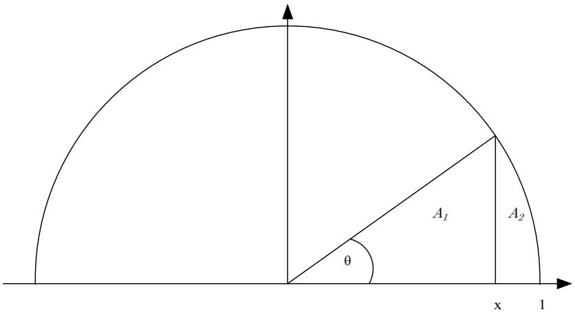

One then defines $\boldsymbol { \pi }$ by $\pi = 2 A ( - 1 )$ . The function $A$ is strictly increasing,so it has an inverse. Since the area of a sector is half its angle $\theta$ and the $_ x$ -coordinate on the unit circle is the cosine of the angle, we define $\underline { { \cos ( \theta ) } } = A ^ { - 1 } ( \theta / 2 )$ for any real $0 \leq$ $\theta \leq \pi$ (s0 $\cos ( \pi ) = - 1$ )，and $\sin ( \theta ) = { \sqrt { 1 - ( \cos \theta ) ^ { 2 } } }$ . All the remaining properties of the trigonometric functions can be derived from this. $A$ complete account can be found in [Spivak 1994].

ExAMPLE 6.5.7 $\textstyle \operatorname {\ u r c t a n } ( x ) ~ = ~ \int _ { 0 } ^ { x } { \frac { d t } { 1 + t ^ { 2 } } }$ for $- \infty < x < \infty$ $\begin{array} { r } { \arcsin ( x ) \ = \ \int _ { 0 } ^ { x } { \frac { d t } { \sqrt { 1 - t ^ { 2 } } } } } \end{array}$ for $- 1 < x < 1$ ．Either of these functions can also be used to define all of the trigonometric functions in a way similar to the previous example. See the exercises for further exploration.

EXAMPLE 6.5.8 $\begin{array} { r } { P ( x ) = \frac { 1 } { \sqrt { 2 \pi } } \int _ { - \infty } ^ { x } e ^ { - t ^ { 2 } / 2 } d t } \end{array}$ for $- \infty < x < \infty$ . This function represents a cumulative probability for a normal (Gaussian) distribution. $P ( x )$ and its inverse have been studied extensively because of their importance in statistics.

For functions defined in this way,where the variable is in the actual limit of the integral, the Fundamental Theorem applies,and we see that they are continuous and differentiable. So we turn our attention to a different kind of integral,where the limits are constant,but the functions being integrated also depend on a second variable or parameter.We have seen two examples of these already:the Gamma function $\textstyle \Gamma ( x ) = \int _ { 0 } ^ { \infty } t ^ { x - 1 } e ^ { - t } d t$ (Definition 5.3.25)and the Laplace transform $H ( x ) =$ $\int _ { 0 } ^ { \infty } e ^ { - x t } h ( t )$ dt (Definition 5.3.26)—see the exercises on page 183. Note that in each case the variable $t$ , being the variable of integration，gets “integrated out,” leaving just a function of the remaining variable $_ { x }$ ．The general case for these kinds of functions looks like the following

$$
F ( x ) = \int _ { a } ^ { b } f ( x , t ) d t .
$$

In the examples of Gamma function and Laplace transform, the integral is improper $b = \infty$ ),but we will begin by looking at the simpler, finite case.We need to be able to integrate the function $f$ , so we will need a reasonable condition that allows this.

DEFINITION 6.5.9 The function $f ( x , t )$ is said to be uniformly continuous on the set $Q = E \times T = \{ ( x , t ) \mid x \in E$ and $t \in S \}$ if for each $\epsilon > 0$ there is a $\delta > 0$ (depending on $\epsilon$ and $f$ and the set $Q$ ）such that

It is important to note that this definition of uniform continuity is not the same as saying the $f \left( x , t \right)$ is uniformly continuous in each variable separately (holding the other fixed). We are saying that the same $\delta$ works for both variables,and doesn't depend on the particular value of either.

PROPOSITION 6.5.10 Suppose that $f$ is uniformly continuous on $Q \ : = \ : E \times \lfloor a , b \rfloor$ Then the function $\textstyle F ( x ) = \int _ { a } ^ { b } f ( x , t ) d t$ is uniformly continuous on $E$

Proof. Suppose that $| f ( y , s ) - f ( x , t ) | < \epsilon / ( b - a )$ when $| y - x | < \delta$ . Then

$$
{ \begin{array} { l l l } { F ( y ) - F ( x ) } & { \leq } & { \displaystyle \int _ { a } ^ { b } | f ( y , t ) - f ( x , t ) | \ d t } \\ & { \leq } & { ( b - a ) \left( \epsilon / ( b - a ) \right) = \epsilon . } \end{array} }
$$

Since that was easy,we'll move directly to differentiation. It turns out that the nicest possible formulation is the one that's correct, namely that the derivative of an integral is the integral of the derivative. We want to differentiate $\textstyle F ( x ) = \int _ { a } ^ { b } f ( x , t ) d t$ with respect to $_ { x }$ , so we first have to define the derivative of $f$ with respect to $_ x$

DEFINITION 6.5.11 If the function $f ( \cdot , t )$ (for $t$ fixed) is uniformly differentiable on $E$ ， then we denote its derivative by $f _ { x } \left( x , t \right)$ :This is usually called the partial derivative with respect to $_ { x }$ and is also denoted $\frac { \partial f } { \partial x }$

THEOREM 6.5.12（DIFFERENTIATION UNDER THE INTEGRAL SIGN） Let $f \left( x , t \right)$ be uniformly continuous on $Q = \lfloor c , d \rfloor \times \lfloor a , b \rfloor$ and uniformly differentiable as a function of $_ { x }$ for each $t \in \left[ a , b \right]$ . Suppose also that its derivative $f _ { x } ( x , t )$ is uniformly continuous on $Q$ . Then $\textstyle F ( x ) = \int _ { a } ^ { b } f ( x , t ) d t$ is uniformly differentiable on $\lfloor c , d \rfloor$ and

$$
F ^ { \prime } ( x ) = \int _ { a } ^ { b } f _ { x } ( x , t ) \ d t .
$$

Proof. Since $f \left( \cdot \mathrm { ~ } , t \right)$ is differentiable for each $t$ ， $f \left( y , t \right) - f ( x , t ) = f _ { x } ( x , t ) ( y - x ) +$ $r ( x , y , t ) ( y - x )$ ，where $r ( x , y , t ) \to 0$ as $y - x  0$ (for each $t$ ). Integrating this equation from $^ { a }$ to $b$ gives

$$
{ \begin{array} { r l l } { F ( y ) - F ( x ) } & { = } & { \displaystyle \int _ { a } ^ { b } f _ { x } ( x , t ) ( y - x ) \ d t + \int _ { a } ^ { b } r ( x , y , t ) ( y - x ) \ d t } \\ & { = } & { \displaystyle \left( \int _ { a } ^ { b } f _ { x } ( x , t ) \ d t \right) ( y - x ) + \left( \int _ { a } ^ { b } r ( x , y , t ) \ d t \right) ( y - x ) . } \end{array} }
$$

We must show that the last integral goes to $0$ as $y - x  0$ . Since the interval $\lfloor a , b \rfloor$ is finite, it suffices to show that $r ( x , y , t ) \to 0$ as $y - x  0$ , independent of $t$ ; i.e.， given $\epsilon > 0$ ， there is a $\delta > 0$ (not depending on $t$ ）such that $| r \left( x , y , t \right) | < \epsilon$ when $| y - x | < \delta$ . However, we know that $| r ( x , y ) | = \left| \frac { f ( y , t ) - f ( x , t ) } { y - x } - f _ { x } ( x , t ) \right|$ is less than any bound for $| f _ { x } ( v , t ) - f _ { x } ( u , t ) |$ on $E$ ; this is a consequence of LBC—see Corollary 6.3.16.Furthermore, since we have assumed $f _ { x }$ is uniformly continuous in the sense of Definition 6.5.9, we can find a $\delta > 0$ that makes $| f _ { x } ( v , t ) - f _ { x } ( u , t ) | < \epsilon$ when $| y - x | < \delta$ ■

COROLLARY 6.5.13 (FUBINI'S THEOREM FOR RECTANGLES) Suppose $g ( x , y )$ is uniformly continuous on the rectangle $Q = \lfloor a , b \rfloor \times \lfloor c , d \rfloor$ . Then

$$
\int _ { c } ^ { d } \left( \int _ { a } ^ { b } f ( x , y ) d x \right) d y = \int _ { a } ^ { b } \left( \int _ { c } ^ { d } f ( x , y ) d y \right) d x .
$$

Proof. See exercises.

So we now know that, under reasonable hypotheses, $\textstyle F ( x ) = \int _ { a } ^ { b } f ( x , t ) d t$ is uniformly continuous and differentiable for the finite interval $\lfloor a , b \rfloor$ ； however, many important examples involve improper integrals, so we now have to see what happens

when (for example) $b = \infty$ . As usual the continuity case is easiest, so we deal with that first.

We assume that $f \left( x , t \right)$ is uniformly continuous on $\lfloor \alpha , \beta \rfloor \times \lfloor a , \infty \rfloor$ and that $\int _ { a } ^ { \infty } f ( x , t ) \ d t$ exists for all $x \in \left\lfloor \alpha , \beta \right\rfloor$ .Let

$$
F ( x ) = \int _ { a } ^ { \infty } f ( x , t ) d t .
$$

DEFINITION 6.5.14 The integral $\textstyle \int _ { a } ^ { \infty } f ( x , t )$ dt is said to converge uniformly if for any $\epsilon > 0$ ， we can find $R ( \epsilon )$ (independent of $_ x$ ）such that

$$
\left| F ( x ) - \int _ { a } ^ { M } f ( x , t ) \ d t \right| \leq \epsilon \ w h e n \ M > R ( \epsilon ) .
$$

THEOREM 6.5.15 If the integral $\textstyle \int _ { a } ^ { \infty } f ( x , t )$ dt converges uniformly， then $F ( x ) =$ $\textstyle \int _ { a } ^ { \infty } f ( x , t )$ dt is uniformly continuous.

Proof. Given $\epsilon > 0$ ， choose $M > R ( \epsilon / 3 )$ . Then

$$
\begin{array} { r c l } { | F ( y ) - F ( x ) | } & { \le } & { \displaystyle \left| F ( y ) - \int _ { a } ^ { M } f ( y , t ) ~ d t \right| + \left| F ( x ) - \int _ { a } ^ { M } f ( x , t ) ~ d t \right| } \\ & & { \displaystyle + \left| \int _ { a } ^ { M } f ( y , t ) - \int _ { a } ^ { M } f ( x , t ) ~ d t \right| } \\ & { \le } & { \displaystyle \epsilon / 3 + \epsilon / 3 + \left| \int _ { a } ^ { M } f ( y , t ) - \int _ { a } ^ { M } f ( x , t ) ~ d t \right| . } \end{array}
$$

However, $M$ is finite, so Proposition 6.5.10 tels us that there is a $\delta > 0$ such that $| y - x | < \delta$ makes $\begin{array} { r } { \left| \int _ { a } ^ { M } f ( y , t ) - \int _ { a } ^ { M } f ( x , t ) ~ d t \right| \le \epsilon / 3 } \end{array}$ as well. Note that while $\delta$ depends on $M$ , the number $M$ depends only on $\epsilon$ ，s0 $\delta$ depends only on $\epsilon$ ■

So when will $\textstyle \int _ { a } ^ { \infty } f ( x , t )$ dt converge uniformly? Even though we're assuming $f \left( x , t \right)$ is uniformly continuous, we're not working over a finite interval, so we don't automatically get boundedness of $f ( x , t )$ . So,we will have to make a boundedness condition on $f$ . When we do this,we get what is called a “dominated convergence” type theorem.Here is one version.

THEOREM 6.5.16 （DOMINATED CONVERGENCE I） Suppose that $f ( x , t )$ is uniformly continuous on $Q = [ \alpha , \beta ] \times [ a , \infty )$ and that there is a function $B ( x )$ such that

1. $| f ( x , t ) | \leq B ( t )$ for all $( x , t ) \in Q$ and   
2. $\textstyle \int _ { a } ^ { \infty } B ( t )$ dt converges.

Then $\textstyle \int _ { a } ^ { \infty } f ( x , t )$ dt converges uniformly (hence is a UC function of $_ { x }$ ）

Proof. Exercise■

(There isadiscrete versionofthis—forseriesoffunctions $\textstyle \sum _ { k = 0 } ^ { \infty } f _ { k }$ called the Weierstrass M Test; see Proposition 7.1.19 in the next chapter.)

We turn now to the differentiability case,and see that the situation for improper integrals is more delicate than for finite ones.As before, $r ( x , y , t ) \to 0$ independently of $t$ ,but we still have to prove that $\begin{array} { r } { \int _ { a } ^ { \infty } r ( x , y , t ) \ d t \to 0 } \end{array}$ as $y - x  0$ . Once again a dominated convergence theorem gives us what we need.

THEOREM 6.5.17 （DOMINATED CONVERGENCE II） SuppOse that for $x , y \in \lfloor c , d \rfloor$ ， $r \left( x , y , t \right)$ is a uniformly continuous function of $t \in [ a , \infty )$ that satisfies the following conditions.

1. $r ( x , y , t ) \to 0$ as $y - x  0$

2. $| r ( x , y , t ) | \leq B ( t )$ for some function $B$ having the property that $\textstyle \int _ { a } ^ { \infty } B ( t )$ exists.

Then $\textstyle \int _ { a } ^ { \infty } r ( x , y , t )$ dt erists $a n d \to 0$ as $y - x  0$

Proof.By the integral comparison test (Proposition 5.3.18) and the fact that abSolute integrability implies integrability (Corollary 5.3.23), $\textstyle \int _ { a } ^ { \infty } r ( x , y , t ) \ d t$ lt exists for each $_ { x }$ ， $_ y$ . Now we have:

$$
\begin{array} { r c l } { \displaystyle \left| \int _ { a } ^ { \infty } r ( x , y , t ) ~ d t \right| } & { \le } & { \displaystyle \int _ { a } ^ { \infty } | r ( x , y , t ) | ~ d t } \\ & { = } & { \displaystyle \int _ { a } ^ { M } | r ( x , y , t ) | ~ d t + \int _ { M } ^ { \infty } | r ( x , y , t ) | ~ d t } \\ & { \le } & { \displaystyle \int _ { a } ^ { M } | r ( x , y , t ) | ~ d t + \int _ { M } ^ { \infty } { B ( t ) ~ d t } . } \end{array}
$$

Since $\textstyle \int _ { a } ^ { \infty } B ( t )$ dt exists, we can find $M > a$ so large that $\textstyle \int _ { M } ^ { \infty } B ( t ) \ d t < \epsilon / 2$ when $\epsilon > 0$ is given. Note that this $M$ depends only on $B$ ,not on $_ x$ or $_ y$ or $r$ . Once $M$ is fixed in this way,dealing with $\int _ { a } ^ { M } | r ( x , y , t ) |$ dt is easy: since $r  0$ , there is a $\delta > 0$ such that $| r ( x , y , t ) | < ( \epsilon / 2 ) / ( M - a )$ when $| y - x | < \delta$ ■

PROPOSITION 6.5.18（DIFFERENTIATION INSIDE IMPROPER INTEGRALS） SuPPOSe $f \left( x , t \right)$ is uniformly continuous on $Q = \lfloor c , d \rfloor \times I$ for every finite subinterval $I$ of $\lfloor a , \infty )$ and uniformly differentiable for each $t \in [ a , \infty )$ . Suppose also that

1. $f _ { x } ( x , t )$ is uniformly continuous on $Q$ and

Then $\textstyle F ( x ) = \int _ { a } ^ { \infty } f ( x , t ) d t$ is uniformly differentiable on $[ c , d ]$ and

$$
F ^ { \prime } ( x ) = \int _ { a } ^ { \infty } f _ { x } ( x , t ) \ d t .
$$

Proof. As we have seen before (Corollary 6.3.16)，bounds for the derivative are bounds for $r$ , so we can apply the dominated convergence theorem.

See the exercises at the end of this section for applications of these ideas to the continuity and differentiability of the Gamma function and Laplace transform.

Finally, Dirichlet's test for convergence of series (Theorem 3.3.38) has an analogue that applies to improper integrals. The proof of the version stated here is not difficult, using just integration by parts, so we leave it as exercise 1l on page 220.

PROPOSITION 6.5.19 (DIRICHLET's TEST FOR INTEGRALS） SuppOse that the functions $f$ and $g$ satisfy the following conditions.

1. $f$ is non-negative and uniformly differentiable on every subinterval $\lfloor a , b \rfloor$ of $\lfloor a , \infty )$

2. $f$ is decreasing, and lim f(x)= 0.

3. $g$ is uniformly continuous on every subinterval $[ a , b ]$ of $\lfloor a , \infty )$

$\begin{array} { r } { \left| \int _ { a } ^ { b } g \right| < M } \end{array}$ for every $a \leq b < \infty$

Then the improper integral $\textstyle \int _ { a } ^ { \infty } f g$ converges.

This proposition can be proved without the differentiability assumption on $f$ Suggestions for doing this harder variation can be found in exercise 12.

Note that the Dirichlet Test immediately gives theconvergence of $\int _ { 1 } ^ { \infty } { \frac { \sin { x } } { x } } \ d x$ The integral S1 $\textstyle \int _ { 0 } ^ { 1 } { \frac { \sin x } { x } } d x$ $\textstyle { \frac { \sin x } { x } }$ $( 0 , 1 ]$ $[ 0 , 1 ]$ $\int _ { 0 } ^ { \infty } { \frac { \sin { x } } { x } }$ sinx dx converges (its value is $\scriptstyle { \frac { \scriptscriptstyle \mathit { n } } { \mathrm { 2 } } }$ but this is not easy to provesee [Spivak, 1994], exercise 19-42 for an outline).

# Exercises

1. Use integration by parts to show that the improper integral $\int _ { 1 } ^ { \infty } { \frac { \sin { x } } { x } } d x$ exists. SeeSpiva $\textstyle { \int _ { 0 } ^ { \infty } { \frac { \sin x } { x } } } d x = { \frac { \pi } { 2 } }$ ）   
2. Find functions $f$ ， $g$ such that $\int _ { a } ^ { \infty } f g ^ { \prime }$ exists but $\int _ { a } ^ { \infty } f ^ { \prime } g$ does not (Hint: See previous exercise.） Thus,the integration by parts formula for improper integrals does not apply in this case; what goes wrong?   
3.Let $\begin{array} { r } { R _ { n } = ( 1 / n ! ) \int _ { x _ { 0 } } ^ { x } ( x - t ) ^ { n } f ^ { ( n + 1 ) } ( t ) d t } \end{array}$ where $\vert x _ { 0 } , x \vert \subset \vert a , b \vert$ and the derivatives $f ^ { ( k ) } ( t )$ ， $k = 0 , \ldots , n { + } 1$ , exist and are UC in $\lfloor a , b \rfloor$ . Find a recursion formula for $R _ { n }$ in terms of $R _ { n - 1 }$ . This result can be used to derive the Taylor polynomial expansion with remainder for $f ( x )$ . (We will discuss this in more detail in the next chapter.)   
4.Prove Fubini's Theorem (Corollary 6.5.13).

5. Prove Theorem 6.5.16 (Dominated Convergence I).

6. The following relate to the Gamma function: $\textstyle \Gamma ( x ) = \int _ { 0 } ^ { \infty } t ^ { x - 1 } e ^ { - t } d t$

(a) $\Gamma ( x )$ is defined for $x > 0$   
(b) $\operatorname* { l i m } _ { x \to 0 \atop x > 0 } \Gamma ( x ) = \infty = \operatorname* { l i m } _ { x \to \infty } \Gamma ( x ) .$   
(c) Use integration by parts to show that $\Gamma ( x + 1 ) = x \Gamma ( x )$   
(d） Show $\Gamma ( 1 ) = 1$ so that, for $_ n$ a positive integer, $\Gamma ( n ) = ( n - 1 ) !$   
(e) Use the previous property to show that for $_ n$ a positive integer, $\Gamma ( n + x ) =$ $( n - 1 + x ) ( n - 2 + x ) \cdot \cdot \cdot ( 1 + x ) ( x ) \Gamma ( x )$   
(f) $\Gamma ( x )$ is not defined for $x < 0$ , but we can extend it to intervals $- ( n + 1 ) <$ $x < - n$ by using the formula

$$
\Gamma ( n + x ) = ( n - 1 + x ) ( n - 2 + x ) \cdot \cdot \cdot ( 1 + x ) ( x ) \Gamma ( x ) .
$$

(g) Use thewell-knowcthat $\textstyle \int _ { 0 } ^ { \infty } e ^ { - x ^ { 2 } } d x = { \frac { \sqrt { \pi } } { 2 } }$ to compute $\Gamma ( 1 / 2 )$

(h） For $_ { n }$ a non-negative integer, $\Gamma \left( n + \frac { 1 } { 2 } \right) = \frac { ( 2 n - 1 ) ! \sqrt { \pi } } { 2 ^ { 2 n } ( n - 1 ) ! } .$

(i) $\Gamma ( x )$ is uniformly continuous on any closed interval $[ a , b ]$ with $a > 0$ (use Dominated Convergence I).

(j） $\Gamma ( x )$ is uniformly differentiable on any closed interval $\lfloor a , b \rfloor$ with $a > 0$ (use Dominated Convergence II).

7.(Project） (Parts of this exercise repeat exercise 13 on page 183.） For certain functions $h ( t )$ , the Laplace transform $H$ of $h$ is defined by

$$
H ( x ) = \int _ { 0 } ^ { \infty } e ^ { - x t } h ( t ) \ d t .
$$

The function $h ( t )$ is exponentially bounded if, for some $k > 0$ ，there is a constant $K > 0$ ， such that $| h ( t ) | \leq e ^ { k t }$ for $t > K$

(a) Prove that exponentially bounded functions have Laplace transforms.   
(b) Give the values of $_ { x }$ for which $H ( x )$ is defined.   
(c) Discuss the continuity and differentiability of Laplace transforms of exponentially bounded functions,using the dominated convergence theorems.   
(d) Here is a table of some functions and their Laplace transforms. Verify that the functions are exponentially bounded and that their transforms are as given.

<table><tr><td>h(t)</td><td>H(x)</td><td></td><td>Domain of HTechnique of proof</td></tr><tr><td>1</td><td>1 X</td><td>x&gt;0</td><td>Straightforward</td></tr><tr><td>t</td><td>1 x</td><td>x&gt;0</td><td>See next formula or integrate by parts</td></tr><tr><td>ta</td><td>Γ(α+1) xa+1</td><td>x&gt;0</td><td>Let u= xt and see previous exercise on I(x)</td></tr><tr><td>eat</td><td>1 x-α</td><td>x&gt;α</td><td>Straightforward</td></tr><tr><td>sin(kt)</td><td>k x²+k²</td><td>x&gt;0</td><td>Integration by parts (twice)</td></tr><tr><td>cos(kt)</td><td>x x²+k²</td><td>x&gt;0</td><td>Integration by parts (twice)</td></tr><tr><td>sinh(kt)</td><td>k x²-k2</td><td>x&gt;</td><td>sinh(kt) 1 (ekt-e-kt) 三 2</td></tr><tr><td>cosh(kt)</td><td>x x²-k²</td><td>x&gt;|k</td><td>1 cosh(kt) (ekt+e-kt) 2</td></tr></table>

8. State and prove a version of the Dominated Convergence Theorem that applies to improper integrals of the type $\textstyle \int _ { a } ^ { M \to b } r ( x , y , t ) \ d t$ ，where $r \left( x , y , t \right)$ is uniformly continuous for $x , y \in \left\lfloor c , d \right\rfloor$ ， $t \in \left[ a , b \right)$

9.Use a revised version of the Dominated Convergence Theorem (see above） to prove a version of the theorem about differentiating under the integral sign that applies to improper integrals of the type $\textstyle \int _ { a } ^ { M \to b } f ( x , t ) \ d t$ ，where $f \left( x , t \right)$ is uniformly continuous on $[ c , d ] \times [ a , b ^ { \prime } ]$ ,for any $b ^ { \prime } < b$

10. (Project)

Forget about what we have done with $A ^ { x }$ and logs,and define, for any $x > 0$ ， a“new” function

$$
\ln ( x ) = \int _ { 1 } ^ { x } { \frac { 1 } { t } } d t .
$$

Prove each of the following. If you can't do some part,you may still use it to do other parts.

(a) $\ln ( 1 ) = 0$ and the derivative of $\ln ( x )$ is $1 / x$   
(b） Show that the derivative of $\ln ( a x ) - \ln ( a ) - \ln ( x )$ is zero.Thus,this function is constant. Find the constant by letting $x = 1$ . We now know $\ln ( a b ) = \ln ( a ) + \ln ( b )$ (explain).

(c） Use the previous part to show, for $_ { n }$ an integer, that $\ln ( x ^ { n } ) = n \ln ( x )$ (treat $n > 0$ and $n < 0$ separately).

(d) For $0 < A \leq x \leq y \leq B$ , prove that ln satisfies the Lipschitz condition

$$
( 1 / B ) ( y - x ) \leq \ln ( y ) - \ln ( x ) \leq ( 1 / A ) ( y - x ) .
$$

(Hint: Use $\textstyle \ln ( y ) - \ln ( x ) = \int _ { x } ^ { y } { \frac { 1 } { t } } d t$ or use the Law of Bounded Change.)

(e) Since $B > 0$ this means that ln is one-to-one, so

$$
\ln ( u ) = \ln ( v ) \Rightarrow u = v .
$$

(f） Prove that $\ln ( 4 ) > 1$ . (Hint:subdivide the interval [1,4] into three equal parts and show that $\begin{array} { r } { \int _ { 1 } ^ { 4 } \frac 1 t d t \geq 1 / 2 + 1 / 3 + 1 / 4 . } \end{array}$ ）

(g) Using the Inverse Function Theorem, deduce that there is a number, call it $^ e$ ,between 1 and 4 such that $\ln ( e ) = 1$ . (Actually, if you feel ambitious, you can improve on this by proving $\ln ( 2 ) < 1 < \ln ( 3 )$ ，so that $2 < e < 3$ (you'll need a finer partition in the previous part).

(h） Denote by $\exp ( x )$ the inverse of $\ln ( x )$ ， so that $\ln ( \exp ( x ) ) = x$ Apply the chain rule to deduce that $\exp ( x )$ is its own derivative.Note that $\exp ( 1 ) = e$

(i) Prove that $\exp ( a + b ) = \exp ( a ) \cdot \exp ( b )$ . The easiest way is to show that ln applied to each side gives the same number, then use that fact that ln is one-to-one.

(j） Use the previous part and $\exp ( 1 ) = e$ to show that $\exp ( m ) = e ^ { m }$ for all integers $m \geq 0$ (you can simply explain why it's true or use induction on $_ { m }$

(k） Similarly, for integers $n > 0$ $( \exp ( 1 / n ) ) ^ { n } = e$ s0 $\exp ( 1 / n ) = e ^ { 1 / n } .$ (1) Is $\exp ( r ) = e ^ { r }$ for $r > 0$ and rational? (Hint: ${ \frac { a } { b } } = \underbrace { { \frac { 1 } { b } } + \cdots + { \frac { 1 } { b } } } _ { b }$ ） What

$^ a$ copies of $1 / b$

if $r$ is real? Explain. (This is tricky to say rigorously: try to explain it using the approximation of reals by rationals. A good proof would probably invoke the continuity of exp and the triangle inequality. You can extend $e ^ { \prime }$ to reals using Corollary 4.2.12.)

11.Prove Proposition 6.5.19, Dirichlet's Integral Test,as stated in the text. The trick is to let $\begin{array} { r } { G ( x ) \ = \ \int _ { a } ^ { x } g ( t ) } \end{array}$ dt and use integration by parts: $\begin{array} { r } { \int _ { a } ^ { b } f g = } \end{array}$ $\begin{array} { r } { f ( b ) G ( b ) - f ( a ) G ( a ) - \int _ { a } ^ { b } f ^ { \prime } G } \end{array}$ .Let $b \to \infty$

12.It turns out that Dirichlet's Integral Test also holds even when $f$ is not differentiable; however, the proof is much harder in this case.First,prove Dirichlet's Test as in the previous exercise (assuming $f$ is differentiable).Now, the idea is to replace the last integra, $\textstyle \int _ { a } ^ { b } f ^ { \prime } G$ by

$$
\operatorname* { l i m } _ { K \to \infty \atop \delta \to 0 } \sum _ { k = 1 } ^ { K } G ( x _ { k } ) ( f ( x _ { k } ) - f ( x _ { k - 1 } ) )
$$

and the quantity $f ( b ) G ( b ) - f ( a ) G ( a )$ by a certain telescoping sum. Here less than $\lbrace x _ { k } \rbrace _ { k = 0 \ldots N }$ $\delta$ Sums of the type is a partition of the interval $\begin{array} { r } { \sum _ { k = 1 } ^ { K } h ( x _ { k } ) ( f ( x _ { k } ) - f ( x _ { k - 1 } ) ) } \end{array}$ $\lfloor a , b \rfloor$ where the widths look like Riemamn $x _ { k } - x _ { k - 1 }$ are all sums,except that $\Delta _ { k } = x _ { k } - x _ { k - 1 }$ is replaced by $\Delta f _ { k } = f ( x _ { k } ) - f ( x _ { k - 1 } )$ Limits of such sums are called Riemann-Stieltjes integrals and are denoted $\textstyle \int _ { a } ^ { b } h \ d f$ . You will get a formula that amounts to

$$
\int _ { a } ^ { b } f g = f ( b ) G ( b ) - f ( a ) G ( a ) - \int _ { a } ^ { b } G \ d f
$$

which looks a lot like the integration by parts from the simpler proof. Now applytheCauchycriteriontoget convergenceof $\int _ { a } ^ { b  \infty } f g$

13.Let $\mathrm { S P i L } ( x ) = { \frac { \sin \pi x } { \ln x } }$ ("SinePiLog").

(a) Discuss the continuity of $\operatorname { S P i L } ( x )$ on the interval $( 0 , 1 )$ and its possible extension to $[ 0 , 1 ]$ ； in particular,what are its limits at $0$ and 1?   
(b）Is $\textstyle \int _ { 0 } ^ { 1 } { \mathrm { S P i L } } ( x ) \ d x { \mathrm { ~ i m p r o p e r ? } }$   
(c） Discuss the convergence or divergence of $\begin{array} { l } { \bullet \ \int _ { 0 } ^ { \infty } \mathrm { S P i L } ( x ) \ d x } \\ { \bullet \ \int _ { 0 } ^ { \infty } \vert \mathrm { S P i L } ( x ) \vert \ d x . } \end{array}$

# 7.1 Sequences of Functions

A sequence of functions ( $f _ { n }$ ) is a generalization of the notion of a sequence of numbers $\left( a _ { n } \right)$ . Thus, instead of numbers $a _ { n }$ ， for each $n \in \mathbb N$ we will be given some function $f _ { n } : S \to \mathbb { R }$ ,where $S \subset \mathbb { R }$ . Here is a somewhat more formal definition,though none is really needed.

DEFINITiON 7.1.1 A sequence of functions on a set $S \subset \mathbb { R }$ is a rule or procedure which associates with each whole number $n \in \mathbb N$ a function $f _ { n } : S \to \mathbb { R }$ .The sequence is usually denoted ( $f _ { n }$ )or even ( $f _ { n } ( x ) )$ (as long as this is not confused with the sequence of numbers ( $f _ { n } ( x )$ ）.

As with sequences of numbers, we are interested in convergence and what properties of the functions are preserved in the limit function when the sequence does converge. The simplest kind of convergence is called pointwise convergence.

DEFINITION 7.1.2 A sequence of functions ( $f _ { n }$ ）on $S$ is said to converge pointwise to the function $f$ (defined on $S$ ）if,for each $s \in S$ , the sequence of numbers $( f _ { n } ( s ) )$ converges to the number $f ( s )$

EXAMPLE 7.1.3 For $n = 1 , 2 , \ldots$ ，let $f _ { n } ( x ) = x ^ { n }$ . Then $f _ { n } ( s ) \to 0$ for each $s \in S =$ $\lfloor 0 , 1 )$ . The reason that we stick to the half-open interval $[ 0 , 1 )$ is that $f _ { n } ( 1 ) = 1$ (not $0$ )for all $_ n$

EXAMPLE 7.1.4 For $n = 1 , 2 , \ldots$ let $Q _ { n } ( x ) = \left( 1 + { \frac { x } { n } } \right) ^ { n }$ Then $( f _ { n } ( s ) ) \to e ^ { s }$ for any s (see exercise $\boldsymbol { \it 6 }$ on page 112).

ExAMPLE 7.1.5 For $n = 0 , 1 , \ldots$ ，let $\begin{array} { r } { S _ { n } ( x ) = \sum _ { k = 0 } ^ { n } x ^ { k } = 1 + x + x ^ { 2 } + \cdot \cdot \cdot + x ^ { n } . } \end{array}$ Then $( f _ { n } ( s ) ) \to { \frac { 1 } { 1 - s } }$ for each $s \in S = ( - 1 , 1 )$ ;the $S _ { n } ( x )$ are the partial sums of $a$ geometric series.

As we shall see, pointwise convergence is not enough to ensure that the limit of uniformly continuous functions be uniformly continuous. We need a stronger condition,and here it is.

DEFINITION 7.1.6 That a sequence of functions ( $f _ { n }$ ）on $S$ converges to a function $f : S  \mathbb { R }$ uniformly on $S$ means that for each $\epsilon > 0$ ， there is some number $N ( \epsilon )$ such that $| f _ { n } ( s ) - f ( s ) | \leq \epsilon$ for all $s \in S$ when $n \geq N ( \epsilon )$ .When this is the case, $N ( \epsilon )$ is called a modulus of convergence.

The key point here is that the number $N ( \epsilon )$ such that $| f _ { n } ( s ) - f ( s ) | \leq \epsilon$ depends only on $\epsilon$ and not on any particular value of $s$ . This is similar to the situation for uniform continuity,where a modulus of continuity $\delta ( \epsilon )$ (such that $| f ( x ) - f ( y ) | \leq \epsilon$ when $| x - y | < \delta ( \epsilon )$ ） depends only on $\epsilon$ and not on (say) $_ { x }$ or $_ y$

To say that $f _ { n } ( x )$ lies within $\epsilon$ of $f ( x )$ means that the graph of $y = f _ { n } ( x )$ lies within a strip of vertical width $2 \epsilon$ centered around the graph of $y = f ( x )$ . The diagram below shows such a strip and one function $f _ { 1 } ( x )$ that does not quite lie within this strip and another, $f _ { 2 } ( x )$ that does.

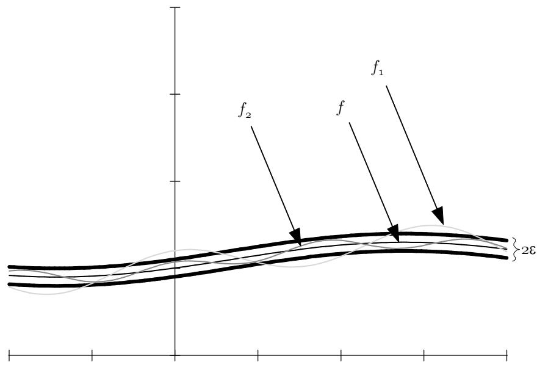  
ExAMPLE 7.1.7 Let $S$ be any closed subinterual of $( - 1 , 1 )$ , and let $\textstyle f _ { n } ( x ) = \sum _ { k = 0 } ^ { n } x ^ { k }$ Then $f _ { n } ( x )  f ( x ) = { \frac { 1 } { 1 - x } }$ uniformly on $S$ te prffe that the convergence is not uniform on all of $S = ( - 1 , 1 )$ ，as we will see later.

DEFINITION 7.1.8 A sequence offunctions ( $f _ { n } )$ is uniformly Cauchy on $S$ if for each $\epsilon > 0$ there is a whole number $N ( \epsilon )$ such that $| f _ { n } ( s ) - f _ { m } ( s ) | \leq \epsilon$ for all $s \in S$ when $m , n > N ( \epsilon )$

It is clear that if $\left( f _ { n } \right)$ is uniformly Cauchy on $S$ , then the sequence of numbers $\left( f _ { n } ( s ) \right)$ is a Cauchy sequence,so it has a limit (Theorem 3.1.14),which we denote $f ( s )$ . This definition makes $f$ into a function $S \to \mathbb { R }$ . We will soon see that even if ( $f _ { n }$ ) is not uniformly Cauchy, the sequence of numbers ( $f _ { n } ( s ) )$ may form a Cauchy sequence. So, in this case also, we can define $f \left( s \right) = \operatorname* { l i m } \left( f _ { n } ( s ) \right)$ . This function is called the pointwise limit of the sequence ( $f _ { n }$ ）

PROPOSITION 7.1.9 If $( f _ { n } ) \to f$ uniformly on $S$ ，then ( $f _ { n }$ ） is uniformly Cauchy on$S$

Proof.Exercise.

PROPOSITION 7.1.10 If( $f _ { n _ { \mathrm { ~ , ~ } } }$ ） is uniformly Cauchy on $S$ ， it converges uniformly on$S$ to the pointwise limit function f(s)= lim fn(s).

Proof. Since ( $f _ { n }$ ) is uniformly Cauchy there is a modulus of convergence $N ( \epsilon )$ .Let $_ n$ be any number $> N \left( \epsilon \right)$ ; the claim is that $| f _ { n } ( s ) - f ( s ) | \leq \epsilon$ for any $s \in S$ .Let's hold $_ { n }$ fixed and suppose that $m > n$ . The triangle inequality gives

$$
| f _ { n } ( s ) - f ( s ) | \leq \underbrace { | f _ { n } ( s ) - f _ { m } ( s ) | } _ { A } + \underbrace { | f _ { m } ( s ) - f ( s ) | } _ { B } .
$$

Since $m , n \geq N ( \epsilon )$ ，we know that $A \leq \epsilon$ . But we are free to make $_ { m }$ as big as we want without changing $_ n$ ， so we can use the fact that, for any particular $s \in S$ ， the sequence of numbers $f _ { m } ( s ) \to f ( s )$ .Given any $\epsilon ^ { \prime } > 0$ ， choose $_ { m }$ so big that the quantity $B \ < \ \epsilon ^ { \prime }$ .So,without changing $| f _ { n } ( s ) - f ( s ) |$ or $_ n$ or $\epsilon$ ，we see that $| f _ { n } ( s ) - f ( s ) | \leq \epsilon + \epsilon ^ { \prime }$ for any $\epsilon ^ { \prime } > 0$ . The Wiggle Lemma now applies to tell us that $| f _ { n } ( s ) - f ( s ) | \leq \epsilon$ $|$

This proof seems like magic, so read over the logic carefully! We have actually used this reasoning before: see Lemma 3.1.15 on page 1O4，which says that the same modulus establishing that a sequence is Cauchy can be used as a modulus of convergence.

As promised, we now show that the uniform limit of uniformly continuous functions is itself UC. The main part of the argument is contained in the following lemmas (see Definition 6.1.2 to review the meaning of $r ( x , y ) \to 0$ as $y - x  0$ ） Also, $r _ { n } ( x , y )  r ( x , y )$ uniformly means what you'd expect: give $\epsilon > 0$ ，there is a modulus $N ( \epsilon )$ — depending only on $r$ and $\epsilon$ — such that $| r _ { n } ( x , y ) - r ( x , y ) | < \epsilon$ when $n > N ( \epsilon )$ (for all $x , y \in S$ ）

LEMMA 7.1.11 Suppose we have a sequence of functions $r _ { n } ( x , y )$ ， and another function $r ( x , y )$ ， all defined for $x , y \in S$ ， and satisfying

1. $r _ { n } ( x , y ) \to 0$ as $y - x  0$ on $S$

2. $r _ { n } ( x , y )  r ( x , y )$ uniformly on $S$

Then $r ( x , y ) \to 0$ as $y - x \to 0$ on $S$

Proof. Basically, $r _ { n } ( x , y )$ can be made close to $r ( x , y )$ and $r \left( x , y \right)$ close to $0$ , so it's the usual adding and subtracting, triangle inequality gambit:

$$
\left| r ( x , y ) \right| \leq \left| r ( x , y ) - r _ { n } ( x , y ) \right| + \left| r _ { n } ( x , y ) \right| .
$$

The first term on the right can be made small by making $_ n$ sufficiently large, independent of $_ x$ and $_ y$ ，say $n = N ( \epsilon / 2 )$ . But since $r _ { n } ( x , y ) \to 0$ for this particular $_ n$ ， there is a $\delta = \delta ( r _ { n } , \epsilon / 2 )$ which makes the second term also less than $\epsilon / 2$ as long as $| y - x | < \delta$ ■

LEMMA 7.1.12 If $( f _ { n } ) \to f$ uniformly on $S$ ，then $f _ { n } ( y ) - f _ { n } ( x ) \to f ( y ) - f ( x )$ uniformly on $S$

Proof. We just have to make

$$
| ( f _ { n } ( y ) - f _ { n } ( x ) ) - ( f ( y ) - f ( x ) ) | = | ( f _ { n } ( y ) - f ( y ) ) + ( f ( x ) - f _ { n } ( x ) ) |
$$

smaller than $\epsilon$ by making $_ n$ sufficiently large.But this is a simple ( $\epsilon / 2$ ） triangle inequality argument.

THEOREM 7.1.13 If $f _ { n }  f$ uniformly on $S$ ，and each $f _ { n }$ is uniformly continuous on $S$ ，then $f$ is uniformly continuous on $S$ as well.

Proof. Use the previous two lemmas, taking $r _ { n } ( x , y ) = f _ { n } ( y ) - f _ { n } ( x )$ and $r ( x , y ) =$ $f ( y ) - f ( x )$ ■

We also have a partial converse to this theorem.

PROPOSITION 7.1.14 Suppose $( f _ { n } ( x ) ) \to f ( x )$ pointwise on $\lfloor a , b \rfloor$ . Suppose also that each $f _ { n }$ is (weakly) increasing and $f$ is uniformly continuous on $\lfloor a , b \rfloor$ . Then

1. $f$ is weakly increasing on $\lfloor a , b \rfloor$ ，and

2. $( f _ { n } ) \to f$ uniformly on $[ a , b ]$

Proof. See exercises■

REMARk 7.1.15 This proposition also holds with the same hypotheses except each function $f _ { n }$ is weakly decreasing.

Recall that uniformly continuous functions extend to a set $S$ from a dense subset $D$ (see Theorem 4.2.11)；we can combine this fact with Theorem 7.1.13 to obtain the following result.

PROPOSITION 7.1.16 Suppose $D$ is dense in $S$ ，each $f _ { n }$ is uniformly continuous on $D$ ，and $( f _ { n } ) \to f$ uniformly on $D$ Let $\overline { { f _ { n } } }$ and $\overline { { f } }$ be the (uniformly continuous) extensions of these functions to $S$ . Then ${ \overline { { f _ { n } } } } \to { \overline { { f } } }$ uniformly on $S$

Proof. Suppose $_ { x }$ isin $S$ ； since $D$ is dense in $S$ ， we_can find a $_ y$ in $D$ which is arbitrarily close to $_ { x }$ . Noting that ${ \overline { { f } } } ( y ) = f ( y )$ since $\overline { { f } }$ extends $f$ , and (similarly) ${ \overline { { f _ { n } } } } ( y ) = f _ { n } ( y )$ ，we have

$$
\begin{array} { r l r } { \left| \overline { { f } } ( x ) - \overline { { f _ { n } } } ( x ) \right| } & { \leq } & { \left| \overline { { f } } ( x ) - \overline { { f } } ( y ) \right| + \left| \overline { { f } } ( y ) - \overline { { f _ { n } } } ( x ) \right| } \\ & { \leq } & { \underbrace { \left| \overline { { f } } ( x ) - \overline { { f } } ( y ) \right| } _ { \overline { { f } } \mathrm { ~ i s ~ U C ~ } } + \underbrace { \left| f ( y ) - f _ { n } ( y ) \right| } _ { f _ { n } \to f \mathrm { ~ u n i f o r m l y } } + \underbrace { \left| \overline { { f _ { n } } } ( y ) - \overline { { f _ { n } } } ( x ) \right| } _ { \overline { { f _ { n } } } \mathrm { ~ i s ~ U C ~ } } . } \end{array}
$$

Given $\epsilon > 0$ ， suppose $n > N ( \epsilon / 3 )$ where $N ( \epsilon / 3 )$ is a modulus of convergence for ${ \overline { { f _ { n } } } } \to f$ on $D$ . That makes the middle term above $\leq \epsilon / 3$ . By choosing $_ y$ sufficiently close to $_ { x }$ , uniform continuity of $\overline { { f } }$ and $\overline { { f _ { n } } }$ makes the other two terms $\leq \epsilon / 3$ as well.

Not only are Theorem 7.1.13 and Proposition 7.1.16 useful in proving that certain limit functions are uniformly continuous, their contrapositives can be used to show that certain sequences of functions do not converge uniformly; in other words,if the functions are UC,but their limit is not, then the convergence can not have been uniform. Here are some examples.

EXAMPLE 7.1.17 For $n = 1 , 2 , \ldots$ ，let $f _ { n } ( x ) \ = \ x ^ { n }$ . Consider these functions on $S \ = \ \lfloor 0 , 1 \rfloor$ ，and let $D = \lfloor 0 , 1 \rfloor$ ，a dense subset of $S$ .On $D$ ， $f _ { n } ( x )  0$ If the convergence on $D$ were uniform, $\left( f _ { n } \right)$ would converge to a function $f$ identically 0 on $D$ ．Proposition 7.1.16 guarantees that they converge to O on $S$ as well.But clearly $f _ { n } ( 1 ) = 1$ for all $_ n$ ， so this can't happen. There is no continuous function on $S = \lfloor 0 , 1 \rfloor$ which is $0$ on $\lfloor 0 , 1 )$ but takes the value 1 at 1. So ( $f _ { n }$ ）converges pointwise but not uniformly. Here is a picture of some of these functions. Note that for large $_ n$ ， the functions stay close to the $_ { x }$ -axis more and more.

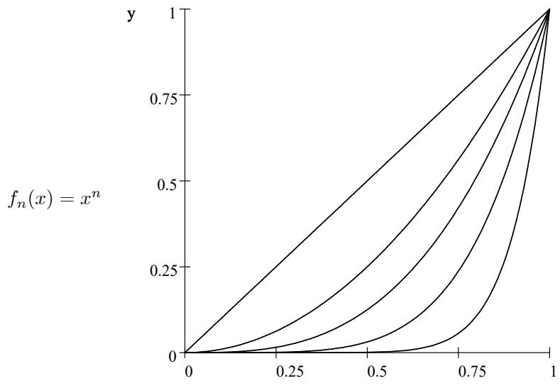  
$f _ { 1 } , f _ { 2 } , f _ { 3 } , f _ { 5 }$ ，and $f _ { 1 0 }$

EXAMPLE 7.1.18 Here is another example similar to the one above.

$$
g _ { n } ( x ) = \left\{ \begin{array} { c c c } { { - 1 } } & { { i f } } & { { x \leq - \displaystyle \frac { 1 } { n } } } \\ { { \sin \left( \displaystyle \frac { n \pi x } { 2 } \right) } } & { { i f } } & { { - \displaystyle \frac { 1 } { n } \leq x \leq \displaystyle \frac { 1 } { n } } } \\ { { 1 } } & { { i f } } & { { \displaystyle \frac { 1 } { n } \leq x } } \end{array} \right.
$$

As n gets larger, the graph of $g _ { n }$ gets closer and closer to the $_ y$ -axis, while the strip where it is not equal to $^ { 1 }$ or $^ { - 1 }$ gets narrower and narrower. Denote by $g ( x )$ the pointwise limit of $g _ { n } ( x )$ .If $x < 1$ ,then $g ( x ) = - 1$ ； $i f x > 1$ ,then $g ( x ) = 1$ ,while $g ( 0 ) = 0$ . Please note that for a given $_ { x }$ , we may not be able to determine which of these three conditions hold; nevertheless, it is not hard to show that the function $g$ cannot be continuous,even though each $g _ { n }$ is,in fact,differentiable.

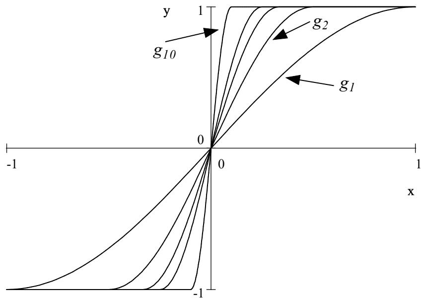  
$g _ { 1 }$ ， $g _ { 2 }$ ， $g _ { 3 }$ ， $g _ { 4 }$ ，and $g _ { 1 0 }$

We conclude with two useful tests for proving convergence of sequences obtained by taking sums of functions. We'll see more of this in section 7.3 on power series.

THEOREM 7.1.19（WEIERSTRASS M-TEST） Suppose $f _ { n }$ is a sequence of functions all on a set $n = 0 , 1 , \ldots$ $S \subset \mathbb { R }$ and and all $M _ { n }$ a sequence of non-negative numbers, with $x \in S$ If $\textstyle \sum _ { n = 0 } ^ { \infty } M _ { n }$ converges then $\scriptstyle \sum _ { n = 0 } ^ { \infty } f _ { n } ( x )$ $| f _ { n } ( x ) | \leq M _ { n }$ conuerges for uniformly(and absolutely） on $S$

Proof. Exercise—use the Cauchy criterion for convergence.

$\mathrm { E x A M P L E ~ 7 . 1 . 2 0 ~ } \sum _ { n = 1 } ^ { \infty } { \frac { \cos n x } { n ^ { 2 } } }$ converges uniformly and absolutely on all of $\mathbb { R }$

The following is an easy generalization of Dirichlet's convergence test for series of numbers—see Theorem 3.3.38.

THEOREM 7.1.21（DIRICHLET's TEST FOR UNIFORM CONVERGENCE) SuppOSe the sequences of functions $( f _ { k } ( x ) )$ and $( g _ { k } ( x ) )$ satisfy the following conditions on an interval $I$ ：

1. The partial sums $\scriptstyle \sum _ { k = 0 } ^ { n } f _ { k } ( x )$ are bounded by some number $B$

2. $( g _ { k } ) \longrightarrow 0$ uniformly on $I$

3. $g _ { k } ( x ) \geq g _ { k + 1 } ( x )$ for all $k$ and all $x \in I$

Then $\scriptstyle \sum _ { k = 0 } ^ { n } f _ { n } g _ { n }$ converges uniformly on $I$

Proof. See the outline of the proof of the Dirichlet Test for numbers in exercise 12 on page 129.■

ExAMPLE 7.1.22 ∑=1 $\scriptstyle \sum _ { k = 1 } ^ { \infty } { \frac { \sin ( k x ) } { k } }$ converges uniformly on the interval $\lfloor \pi / 2 , 3 \pi / 2 \rfloor$ It does not converge uniformly on $[ - \pi / 2 , \pi / 2 ]$ however. See the exercises at the end of this section.

# Exercises

1. Let $S$ be any cosed subinterval of $( - 1 , 1 )$ and let $\textstyle f _ { n } ( x ) = \sum _ { k = 0 } ^ { n } x ^ { k }$ Prove that $f _ { n } ( x )  f ( x ) = { \frac { 1 } { 1 - x } }$ uniformly on $S$ (see example 3.3.9).

2. Prove that if $f _ { n }  f$ uniformly on $S$ , then $f _ { n }$ is uniformly Cauchy on $S$

3.The uniform limit of uniformly continuous functions must be uniformly continuous. What does this tell us about the sequence of functions $f _ { n } ( x ) \ =$ $\frac { 1 } { 1 + ( n x - 1 ) ^ { 2 } }$ on the interval $[ 0 , 1 ]$ ? (Hint:What is the limit function $f ( x )$ on $[ 0 , 1 ] ~ ?$ ）

4. Prove that $f _ { n }  f$ uniformly on $S$ if and only if there is a sequence $\left( a _ { n } \right)$ of positive numbers with $a _ { n } \to 0$ such that, for $_ { n }$ sufficiently large, $| f _ { n } ( x ) - f ( x ) | \leq$ $a _ { n }$ for all $x \in S$

Prove that the sequence of functions $\left( f _ { n } \right)$ is Cauchy convergent on $S$ if and only if there is a convergent sequence of numbers $\left( a _ { n } \right)$ such that, for all $_ { n }$ sufficiently large, $| f _ { n } ( x ) - f _ { m } ( x ) | \leq | a _ { n } - a _ { m } |$ for all $x \in S$

5.Discuss the convergence on $\lfloor 0 , 1 \rfloor$ of the following sequences of functions. (Hint: Use calculus to find the max of the functions on $\lfloor 0 , 1 \rfloor$ and apply the previous exercise.)

$f _ { n } ( x ) = { \frac { x ^ { 2 } } { x ^ { 2 } + ( n x - 1 ) ^ { 2 } } }$ (b) $f _ { n } ( x ) = x ^ { n } ( 1 - x )$ （c） $f _ { n } ( x ) = n x ^ { n } ( 1 { - } x )$ (Hint: show that the max of $f _ { n } ( x )$ on $\lfloor 0 , 1 \rfloor$ approaches$1 / e$ ）(d) $f _ { n } ( x ) = n ^ { 3 } x ^ { n } ( 1 - x ) ^ { 4 }$ (e） $\begin{array} { l c r } { f _ { n } ( x ) = \displaystyle \frac { n x ^ { 2 } } { 1 + n x } } \\ { f _ { n } ( x ) = \displaystyle \frac { 1 } { 1 + x ^ { n } } } \end{array}$

(These are from [Kaczor&Nowak, 200].)

6.Discuss the convergence of $f _ { n } ( x ) = \cos ^ { n } x ( 1 - \cos ^ { n } x )$ on the interval $\lfloor 0 , \pi / 2 \rfloor$ and on $\lfloor \pi / 4 , \pi / 2 \rfloor$ . Use the same ideas as the previous exercise.

7. Prove that $\scriptstyle \sum _ { n = 1 } ^ { \infty } { \frac { \sin n x } { n ^ { \alpha } } }$ converges uniformly and absolutely on all of $\mathbb { R }$ when $\alpha \geq 2$

8.Prove the Weierstrass M-Test (Theorem 7.1.19).

9. Prove Dirichlet's test for uniform convergence (Theorem 7.1.21) using the ideas outlined in exercise 12 on page 129.

10. (Project）The series sin(kx) is an example of a Fourier series: a representation of a function in terms of the family of trig functions $\mathrm { s i n } ( k x )$ and $\cos ( k x )$ ， $k = 0 , 1 , 2 , . . .$ Here is a plot of the partial sum $\scriptstyle \sum _ { k = 1 } ^ { 1 0 } { \frac { \sin ( k x ) } { k } }$ 0sin(kx) (Note that this has period $2 \pi$ ）

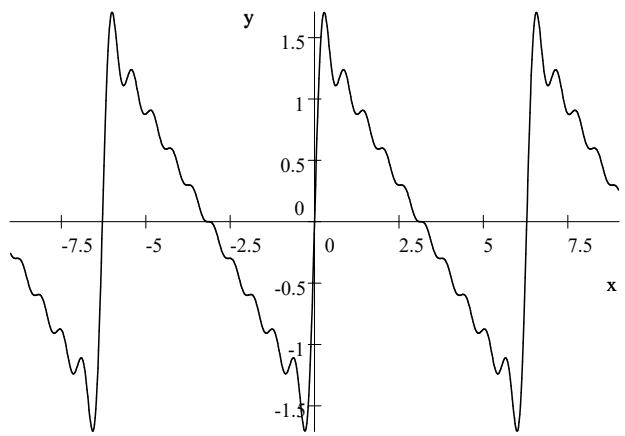

(a) $\scriptstyle \sum _ { k = 1 } ^ { \infty } { \frac { \sin ( k x ) } { k } }$ converges uniformly on any interval that doesn't contain an integral multuple of $2 \pi$ . This is a consequence of Dirichlet’s test for uniform convergence-see Example 3.3.39 for details.

(b) On the interval $( 0 , 2 \pi )$ ， the series converges to $\begin{array} { r } { f ( x ) = \frac { 1 } { 2 } ( \pi - x ) } \end{array}$ It is, in fact,the Fourier series for ${ \frac { 1 } { 2 } } ( \pi - x )$ .(The function $f$ is defined on $( 0 , 2 \pi )$ .We make it periodic by defining $f ( x \pm 2 k \pi ) = f ( x )$ for $_ { x }$ not in $( 0 , 2 \pi )$ .） But the Fourier series for a function doesn't always converge uniformly to that function. However,it does if the function is uniformly differentiable,which $\scriptstyle { \frac { 1 } { 2 } } ( \pi - x )$ certainly is； see Theorem 8.3.1. There are similar examples discussed at the end of Section 8.3.

(c) This series does not converge uniformly on any interval containing O (or any other integral multiple of $\boldsymbol { \pi }$ ):see the plot above.Here is an outline of a proof from [Spivak, 1994].

$$
{ \mathrm { i . ~ } } \left| \sum _ { k = N } ^ { 2 N } \sin k x \right| = \left| \sum _ { k = 0 } ^ { N } \sin k x \right|
$$

$\left| \sum _ { k = 0 } ^ { N } \sin k x \right| \geq { \frac { N } { \pi } }$ ii. Use the calculation in Example 3.3.39 to show when $N$ is lare (When $N$ is large, $\sin \left( { \frac { ( N + 1 ) \pi } { 2 N } } \right)$ is close to $1$ , so is $\geq \frac { 1 } { 2 }$ .） iii. For large $N$ ， $\left| \sum _ { k = N } ^ { 2 N } { \frac { \sin k x } { k } } \right| \geq { \frac { 1 } { 2 \pi } }$ 2N , so the series can't converge uniformly on $\lfloor 0 , 2 \pi \rfloor$ , for example.

(d） The term-by-term derivatives of this series don't converge at all (use exercise 23 below） so their sum can't converge either.

11.Prove tat if $\scriptstyle \sum _ { k = 0 } ^ { \infty } a _ { k }$ is absolutely couvergent, then $\scriptstyle \sum _ { k = 0 } ^ { n } a _ { n } \sin ( n x )$ is uniformly convergent on all of $\mathbb { R }$

12. Discuss the convergence of $\sum _ { k = 1 } ^ { \infty } ( - 1 ) ^ { k - 1 } { \frac { x ^ { 2 } + k } { k ^ { 2 } } }$ on the interval $[ 0 , 1 ]$ . Is it uniform? Absolute?

13.What can you say about the values of the function below(from [Spivak,1994l)?

$$
f ( x ) = \operatorname* { l i m } _ { n \to \infty } ( \operatorname* { l i m } _ { k \to \infty } ( \cos n ! \pi x ) ^ { 2 k } )
$$

14. The sequence $s _ { n } = \sum _ { k = 1 } ^ { n } { \frac { ( - 1 ) ^ { k + 1 } { x ^ { k } } } { k } }$ converges pointwise on $( - 1 , 1 ]$ . Show that this convergence is actually uniform on $\lfloor 0 , 1 \rfloor$

15. Let $S$ be any closed subinterval of $( - 1 , 1 )$ , and let $\textstyle f _ { n } ( x ) = \sum _ { k = 0 } ^ { n } x ^ { k }$

(a) Prove that $f _ { n } ( x )  f ( x ) = { \frac { 1 } { 1 - x } }$ uniformly on $S$

(b） This sequence does not converge at the endpoints $x = 1 , - 1$ . Suppose we replace the partial sums $f _ { n } \left( x \right)$ by their averages,

$$
s _ { M } ( x ) = { \textstyle { \frac { 1 } { M + 1 } } } \sum _ { n = 0 } ^ { M } \underbrace { \left( \sum _ { k = 0 } ^ { n } x ^ { k } \right) } _ { f _ { n } ( x ) } .
$$

Now

$$
\begin{array} { r c l } { { s _ { 2 K - 1 } ( - 1 ) } } & { { = } } & { { { \frac { K } { 2 K + 1 } } } } \\ { { s _ { 2 K } ( - 1 ) } } & { { = } } & { { { \frac { 1 } { 2 } } } } \end{array}
$$

Show that $s _ { M } ( x ) \to f ( x )$ at least pointwise on $\lfloor - 1 , 1 \rfloor$ (c） Is the convergence $s _ { M } ( x ) \to f ( x )$ uniform on $\lfloor - 1 , 1 \rfloor$ ？

16. Suppose that $( P _ { n } ) \to P$ uniformly on all of $\mathbb { R }$ ，where the $P _ { n }$ are polynomials. Prove that $P$ is also a polynomial.

17.Suppose that $f _ { n }  f$ and $g _ { n }  g$ ,both uniformly on $S$ ，and let $_ { \alpha }$ and $\beta$ be constants. Show that $\alpha f _ { n } + \beta g _ { n }  \alpha f + \beta g$ uniformly on $S$

18. Suppose that $f _ { n }  f$ and $g _ { n } \\to g$ ，both uniformly on $S$ .Show by example that $f _ { n } g _ { n }$ need not converge uniformly to $f g$ . Does it converge pointwise?

19.(See previous exercise.） Suppose $f _ { n }  f$ and $g _ { n }  g$ ， both uniformly on $S$ ， and $| f _ { n } ( x ) | , | g _ { n } ( x ) | < M$ for all $_ { n }$ and $x \in S$ . Then $f _ { n } g _ { n } \to f g$ uniformly on $S$

20.Suppose $f _ { n }  f$ and $g _ { n } \\to g$ ，both uniformly on $S$ .Find conditions under which $f _ { n } / g _ { n }$ will converge uniformly to $f / g$ on $S$

21.Prove the following result from the text.

PROPOSITION 7.1.14 Suppose $( f _ { n } ( x ) ) \to f ( x )$ pointwise on $\lfloor a , b \rfloor$ . Suppose also that each $f _ { n }$ is (weakly） increasing and $f$ is uniformly continuous on $\lfloor a , b \rfloor$ Then

(a) $f$ is weakly increasing on $\lfloor a , b \rfloor$ ， (b) $( f _ { n } ) \to f$ uniformly on $[ a , b ]$

(Hint: $f$ is (weakly) increasing since weak inequalities are preserved in the limit (see Proposition 3.1.10). Since $f$ is UC, given $\epsilon > 0$ ,le $\mathrm { ~ t ~ } \delta = \delta ( \epsilon / 2 )$ be a modulus of continuity for $\epsilon / 2$ .Partition $\lfloor a , b \rfloor$ by points $a = x _ { 0 } < x _ { 1 } < \dots < x _ { k } = b$ ， where $x _ { j } - x _ { j - 1 } < \delta / 2$ .Also,choose $N$ such that $| f _ { n } ( x _ { i } ) - f ( x _ { i } ) | < \epsilon / 2$ for all $i = 0 , \ldots k$ ，when $n > N$ . For any $x \in \left\lfloor a , b \right\rfloor$ ， we can find some $j$ such that $| x - x _ { j } | < \delta / 2$ ，s0 $x \in \lfloor x _ { j - 1 } , x _ { j + 1 } \rfloor$ , and we have

$$
f ( x _ { j - 1 } ) - \epsilon / 2 \le f _ { n } ( x _ { j - 1 } ) \le f _ { n } ( x ) \le f _ { n } ( x _ { j + 1 } ) \le f ( x _ { j + 1 } ) + \epsilon / 2 .
$$

Combine this with the uniform continuity of $f$ to show $- \epsilon \le f _ { n } ( x ) - f ( x ) \le \epsilon .$ ）

22.The sequence $( { \sqrt { n } } \cos ( n x ) )$ does not converge. To see this, first note that

$$
\textstyle \left| { \frac { \cos n x } { n } } \right| = { \frac { 1 } { n ^ { 3 / 2 } } } \left| { \sqrt { n } } \cos n x \right| .
$$

Since $\scriptstyle \sum _ { n = 1 } ^ { \infty } \left| \cos n x \right| / n$ diverges, $| { \sqrt { n } } \cos n x |$ is unbounded. Why?

(Incidentally, the oscillations of ${ \sqrt { n } } \cos ( n x )$ as $n  \infty$ must be unbounded, since $\scriptstyle \sum _ { n = 1 } ^ { \infty } ( \cos n x ) / n$ converges.)

23.If $_ x$ is not a multiple of $2 \pi$ ， the sequence $( \cos n x )$ does not converge,even pointwise. Here is an outline of a proof from A. Zelevinsky.

LEMMA. If the sequence $\cos ( n x )$ converges, then $\cos x = 1$

Proof. First,use the familiar identity $\cos ( x \pm y ) = \cos x \cos y \mp \sin x \sin y$ to prove that

$$
\cos \left( 2 n x \right) = 2 \cos ^ { 2 } \left( n x \right) - 1
$$

and

$$
\cos \left( ( n + 1 ) x \right) + \cos \left( ( n - 1 ) x \right) = 2 \cos \left( n x \right) \cos x .
$$

Assume $\cos \pi x = z$ .Passing to the limit in the first formula above gives $n { \longrightarrow } \infty$   
$z = 2 z ^ { 2 } - 1$ ，s0 $| z | > 0$ .Passing to the limit in the second formula gives   
$z = z \cos x$ ，hence $\cos x = 1$ as desired. (Note that $\sin ( n x )$ doesn't converge   
either unless $\sin x = 0$ .） $\vartriangle$

The formula $\cos ( x \pm y ) = \cos x \cos y \mp \sin x \sin y$ and other properties of the trig functions are derived in the Section 7.5.

# 7.2Integrals and Derivatives of Sequences

In this section we ask,“What happens to a convergent sequence of functions( $f _ { n }$ ） when we integrate or differentiate it?” This will have important applications in the next section when the sequence consists of partial sums of power series. You will probably notice that there is a strong resemblance between the results and proofs here and those of Section 6.5 when we were looking at integrals and derivatives of a family of functions $f ( x , t )$ parametrized by $_ { x }$ . Here we can think of $_ n$ as a discrete parameter for the functions $f _ { n } ( t )$

The case of integration is the most easily settled.

PROPOSITION 7.2.1 Suppose $f _ { n } \ \to \ f$ uniformly on $[ a , b ]$ ， with each $f _ { n }$ uniformly continuous on $\lfloor a , b \rfloor$ . Then for any $p , x \in \lfloor a , b \rfloor$ ，

1. $\textstyle { \int _ { p } ^ { x } f _ { n } \to \int _ { p } ^ { x } f }$

2.1f $N ( \epsilon )$ is a modulus of convergence for $f _ { n } \to f$ ,then $\begin{array} { r } { N \left( \frac { \epsilon } { b - a } \right) } \end{array}$ is a modulus of convergence for $\begin{array} { r } { \int _ { p } ^ { x } f _ { n } \to \int _ { p } ^ { x } f } \end{array}$ ， so this convergence is uniform as convergence of functions on $\lfloor a , b \rfloor$ ·

Proof. Exercise; use $\begin{array} { r } { g \leq M \Longrightarrow \int _ { a } ^ { b } g \leq M ( b - a ) } \end{array}$

It is important, of course, that $f _ { n }  f$ uniformly, as the next example shows.

EXAMPLE 7.2.2 Let $h _ { n } ( x ) = \left\{ \begin{array} { c c c } { { 2 n ^ { 2 } x } } & { { i f } } & { { 0 \leq x \leq 1 / ( 2 n ) } } \\ { { 2 n - 2 n ^ { 2 } x } } & { { i f } } & { { 1 / ( 2 n ) \leq x \leq 1 / n } } \\ { { 0 } } & { { i f } } & { { 1 / n \leq x } } \end{array} \right. .$

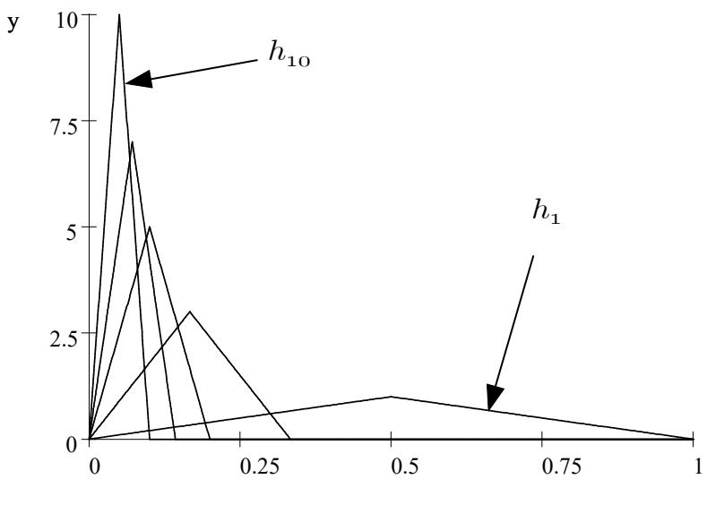  
$h _ { 1 }$ ， $h _ { 3 }$ ， $h _ { 5 }$ ， $h _ { 7 }$ ，and $h _ { 1 0 }$

Here we have a sequence of continuous, piecewise linear functions $h _ { n }$ . For each $_ n$ ， $\begin{array} { r } { \int _ { 0 } ^ { 1 } h _ { n } = \frac { 1 } { 2 } } \end{array}$ . The sequence $h _ { n } ( x ) \to 0$ for $x = 0$ and for each $x > 0$ ; for these $_ x$ ， $h _ { n } \to h$ where $h$ is the O. function. However, we have $\begin{array} { r } { \int _ { 0 } ^ { 1 } h _ { n } \to \frac { 1 } { 2 } \ne 0 = \int _ { 0 } ^ { 1 } h } \end{array}$ . Thus, the convergence can not be uniform in view of the result we have just proved.

This example is even more interesting. Each $h _ { n } ( x )$ is uniformly continuous on $[ 0 , 1 ]$ ， the limit function $h = 0$ is, of course, uniformly continuous on $[ 0 , 1 ]$ ，and the convergence is uniform on any interval $\lfloor a , b \rfloor \subset ( 0 , 1 ]$ ，and $h _ { n } ( 0 )  h ( 0 ) = 0$ ； nevertheless, the convergence is not uniform on all of $[ 0 , 1 ]$

Even improper integrals can behave well with respect to convergence.

PROPOsITiON 7.2.3 Suppose that the sequence of uniformly continuous functions $f _ { n }$ converges uniformly to $f$ on every finite closed subinterval of $\lfloor a , \infty )$ .Suppose that $\int _ { a } ^ { b \to \infty } f _ { n }$ go $C ( \epsilon )$ $_ { n }$ $\begin{array} { r } { \left| \int _ { M } ^ { N } f _ { n } \right| \le \epsilon } \end{array}$ $M , N > C ( \epsilon )$ $\textstyle \int _ { a } ^ { \infty } f$

$$
\int _ { a } ^ { \infty } f _ { n } \longrightarrow \int _ { a } ^ { \infty } f .
$$

Proof. To prove that $\textstyle \int _ { a } ^ { \infty } f$ exists, we must show that $\textstyle \int _ { a } ^ { M } f$ is Cauchy. Given $\epsilon > 0$ choose $M , N > C ( \epsilon )$ . Then

$$
\begin{array} { r c l } { \left| \displaystyle \int _ { M } ^ { N } f \right| } & { \le } & { \displaystyle \left| \displaystyle \int _ { M } ^ { N } f - f _ { n } \right| + \left| \displaystyle \int _ { M } ^ { N } f _ { n } \right| } \\ & { \le } & { \displaystyle \left| \displaystyle \int _ { M } ^ { N } f - f _ { n } \right| + \epsilon . } \end{array}
$$

Holding $M , ~ N$ fixed, we can make $_ { n }$ so large that $\begin{array} { r } { \left| \int _ { M } ^ { N } f - f _ { n } \right| } \end{array}$ is arbitrarily small this because $\lfloor M , N \rfloor$ is a finite interval and $f _ { n }  f$ converges uniformly. The Wiggle Lemma now tells us that $\begin{array} { r } { \left| \int _ { M } ^ { N } f \right| \leq \epsilon } \end{array}$ Thus $\textstyle \int _ { a } ^ { \infty } f$ exists，so we compare it with $\int _ { a } ^ { \infty } f _ { n }$

$$
\left| \int _ { a } ^ { \infty } f _ { n } - \int _ { a } ^ { \infty } f \right| \leq \underbrace { \left| \int _ { a } ^ { \infty } f _ { n } - \int _ { a } ^ { N } f _ { n } \right| } _ { \mathbf { A } } + \underbrace { \left| \int _ { a } ^ { N } f _ { n } - f \right| } _ { \mathbf { B } } + \underbrace { \left| \int _ { a } ^ { N } f - \int _ { a } ^ { \infty } f \right| } _ { \mathbf { C } } .
$$

Supoose we are given $\epsilon > 0$ . By choosing $N$ large enough,we can make $A$ smaller than $\epsilon / 3$ independent of $_ { n }$ ,because of our assumption about the uniform convergence of $\int _ { a } ^ { \infty } f _ { n }$ Making $N$ even larger if necessary will ensure that $C$ is smaller than $\epsilon / 3$ because we have just shown that $\textstyle \int _ { a } ^ { \infty } f$ converges. Thus，we choose some $N$ ， depending only on $\epsilon$ , which makes both of these two parts $\leq \epsilon / 3$ . Now we can make $B$ smaller than $\epsilon / 3$ by making $_ n$ sufficiently large since the interval $\lfloor a , N \rfloor$ is finite and $f _ { n }  f$ uniformly (Proposition 7.2.1). Thus, $\textstyle \left| \int _ { a } ^ { \infty } f _ { n } - \int _ { a } ^ { \infty } f \right|$ can be made $\leq \epsilon$ by making $_ n$ sufficiently large.

As was the case for improper integrals of functions of the type $f ( x , t )$ (see Proposition 6.5.16) the uniform convergence assumption about the improper integral $\int _ { a } ^ { \infty } f _ { n }$ will be satisfied when we have a “dominated convergence” assumption; here's how it goes.

COROLLARY 7.2.4 （DOMINATED CONVERGENCE III） Suppose that the sequence of uniformly continuous functions $f _ { n }$ converges uniformly to $f$ on every finite closed subinterval of $\lfloor a , \infty )$ . Suppose that there is a UC function $g$ such that $| f _ { n } | \le g$ for all $_ { n }$ and $\textstyle \int _ { a } ^ { \infty } g$ exists. Then $\textstyle \int _ { a } ^ { \infty } f$ exists and

$$
\int _ { a } ^ { \infty } f _ { n } \longrightarrow \int _ { a } ^ { \infty } f .
$$

The situation for differentiability is more complicated. Consider the sequences: $f _ { n } ( x ) = { \frac { 1 } { n } } \sin ( n x )$ and $g _ { n } ( x ) = { \frac { 1 } { \sqrt { n } } } \sin ( n x )$ .In both cases,the functions are niformly differentiable on, say, the finite interval $\lfloor - \pi , \pi \rfloor$ and each sequence converges uniformly to $0$ on $\lfloor - \pi , \pi \rfloor$ as $n \to \infty$ ，.However, it can be shown (see exercises on page 233) that the derivatives in each case don't even converge (except at $x = 0$ ） It is clear what is happening here. The functions $f _ { n }$ and $g _ { n }$ oscillate more and more frequently for large $_ n$ because of the $\sin ( n x )$ ; however, the $_ n$ or $\sqrt { n }$ in the denominator makes them approach $0$ as $n \longrightarrow \infty$ , so it doesn't matter. On the other hand, this rapid oscillation makes the derivatives oscillate just as fast (they include a $\cos n x$ ）， but without the redeeming value of going to $0$ in amplitude.

This last example shows that there is not much hope of deducing differentiability from mere convergence of a sequence of functions—even from uniform convergence. As we have remarked before, differentiation tends to make functions worse in terms of behavior while integration has the opposite effect (see Remark 6.3.23). So,we take a different tack,and assume the derivatives converge instead of the original functions. Is that good enough? Well, not quite: suppose $f _ { n } ( x ) = n$ . Then all the derivatives are $0$ ， so they certainly converge,but the $f _ { n }$ certainly don't. We need one more little piece: convergence of $f _ { n } ( x )$ for at least one value of $_ { x }$ .Here is the standard result.

THEOREM 7.2.5 Suppose each $f _ { n }$ is uniformly differentiable on a finite interval $I$ and $f _ { n } ^ { \prime } \to g$ uniformly on $I$ . If we can find some $p \in { I }$ with $f _ { n } ( p ) \to L$ (for some $L$ ),then $f _ { n }$ converges uniformly on $I$ to a function $f$ that is uniformly differentiable on $I$ with $f ^ { \prime } = g$

Proof. One might be tempted to look at the limit of the difference quotients $\frac { f _ { n } ( y ) - f _ { n } ( x ) } { y - x }$ but this quickly leads to complications; it is much easier to use the Fundamental Theorem.Define

$$
\begin{array} { r c l } { { F _ { n } ( x ) } } & { { = } } & { { f _ { n } ( p ) + \displaystyle \int _ { p } ^ { x } f _ { n } ^ { \prime } } } \\ { { } } & { { } } & { { } } \\ { { f ( x ) } } & { { = } } & { { L + \displaystyle \int _ { p } ^ { x } g } } \end{array}
$$

By the Fundamental Theorem, $F _ { n }$ and $f _ { n }$ differ by a constant; since $F _ { n } ( p ) = f _ { n } ( p )$ ， $F _ { n } = f _ { n } \mathrm { o n } I$ . Because we have shown that integration preserves uniform convergence (Proposition 7.2.1)，we know that $\textstyle { \int _ { p } ^ { x } f _ { n } ^ { \prime } \to \int _ { p } ^ { x } g }$ uniformly. Since $f _ { n } ( p ) \to L$ as a sequence of constants, it is easy to see that $\begin{array} { r } { f _ { n } = f _ { n } ( p ) + \int _ { p } ^ { x } f _ { n } ^ { \prime } \to f } \end{array}$ uniformly on $I$ Clearly $f ^ { \prime } = g$ ■

COROLLARY 7.2.6 If $f _ { n }$ is uniformly differentiable on the finite interval $I$ ， $f _ { n }  f$ ， and $f _ { n } ^ { \prime }  g$ ， both uniformly on $I$ ，then $f$ is also $U D$ on $I$ ，with $f ^ { \prime } = g$

Proof.Exercise.

# Exercises

1. Prove the following from the text.

PROPOSITION 7.2.1 Suppose $f _ { n }  f$ uniformly on $\lfloor a , b \rfloor$ with each $f _ { n }$ uniformly continuous on $[ a , b ]$ . Then for any $p , x \in \lfloor a , b \rfloor$ ，

(a) $\begin{array} { r } { \int _ { p } ^ { x } f _ { n } \to \int _ { p } ^ { x } f } \end{array}$   
(b)1 $N ( \epsilon )$ is a modulus of concergence for $f _ { n } \ \to \ f$ hen $\begin{array} { r } { N \left( \frac { \epsilon } { b - a } \right) } \end{array}$ is $a$ modulus of convergence for $\begin{array} { r } { \int _ { p } ^ { x } f _ { n } \to \int _ { p } ^ { x } f } \end{array}$ , so this convergence is uniform as convergence of functions on $[ a , b ]$

2. Examine the convergence of the sequence of functions $f _ { n } ( x ) = { \frac { x } { 1 + n ^ { 2 } x ^ { 2 } } }$ x and their derivatives, on $I = \left\lfloor - 1 , 1 \right\rfloor$

3. The sequence of partial sums $\textstyle S _ { n } = \sum _ { k = 0 } ^ { n } x ^ { k }$ converges uniformly to $\frac { 1 } { 1 - x }$ on every closed subinterval of $( - 1 , 1 )$

(a) On closed subintervals of $( - 1 , 1 )$ ， show that the partial sums $\scriptstyle \sum _ { k = 1 } ^ { n } { \frac { x ^ { k } } { k } }$ converge to $- \ln ( 1 - x )$ uniformly.   
(b） Show that this convergence is uniform on closed subintervals of $\lfloor - 1 , 1 \rfloor$ as well. (Hint:on the left half of this interval you have an alternating series.)   
(c） Deduce that $\ln 2 = 1 - { \frac { 1 } { 2 } } + { \frac { 1 } { 3 } } - { \frac { 1 } { 4 } } + { \frac { 1 } { 5 } } - \cdot \cdot \cdot$   
(d) $\sum _ { k = 1 } ^ { n } { \frac { x ^ { k } } { k } } \to - \ln ( 1 - x )$ pointwise on $\lfloor - 1 , 1 \rfloor$ . Why can't this e nform convergence on all of $\lfloor - 1 , 1 \rfloor$ ？

4. Analyze the partial sums $\begin{array} { r } { S _ { n } = \sum _ { k = 0 } ^ { n } ( - 1 ) ^ { k } x ^ { k } } \end{array}$ in a similar way (see previous exercise).

5.Let $E _ { n } ( x ) = \sum _ { k = 0 } ^ { n } { \frac { x ^ { k } } { k ! } } .$

(a) Show that ( $E _ { n }$ ） converges uniformly on every finite subinterval of $\mathbb { R }$ (b） Show that $E _ { n } ^ { \prime } ( x ) = E _ { n - 1 } ( x )$ ， so the derivatives converge as well. (c) Let $E ( x ) = \operatorname* { l i m } ( E _ { n } ( x ) )$ and show that $E$ is uniformly differentiable on every finite subinterval of $\mathbb { R }$ ,with $E ^ { \prime } ( x ) = E ( x )$

(d) Deduce that $E ( x ) = e ^ { x }$ (Hint: Look at $Q ( x ) = { \frac { E ( x ) } { e ^ { x } } }$ and show that $Q ^ { \prime } ( x ) = 0$ for all $_ { x }$ ）

This is an example of a power series expansion. We will study these in more detail in the next section.

6. Prove the following corollary to Theorem 7.2.5.

COROLLARY 7.2.6 If $f _ { n }$ is uniformly differentiable on the finite interval $I$ ，and $f _ { n }  f$ ，and $f _ { n } ^ { \prime }  g$ ， both uniformly on $I$ ，then $f$ is also UD on $I$ with $f ^ { \prime } = g$

7. Prove Corollary 7.2.4(Dominated Convergence III).

$\zeta ( x ) = \sum _ { n = 1 } ^ { \infty } { \frac { 1 } { n ^ { x } } } .$

(a） Prove this converges pointwise for $x > 1$   
(b) Prove this converges uniformly on closed finite subintervals of $( 1 , \infty )$   
(c） Calculate $\zeta ^ { \prime } ( x )$ . Where is it defined?

The Zeta function $\zeta ( z )$ can also be defined for complex numbers $z$ and plays a very important role in number theory and the distribution of primes; it is the subject of the famous-and unsolved at the time of this writing —Riemann Hypothesis.

9. The length of the diagonal of the unit square is $\sqrt { 2 }$ . On the other hand, you can “approximate” this diagonal by a sequence of staircase-like approximationssee diagram (a) below. If you lay the lower triangle down on the $x$ -axis, you get diagram (b） below.

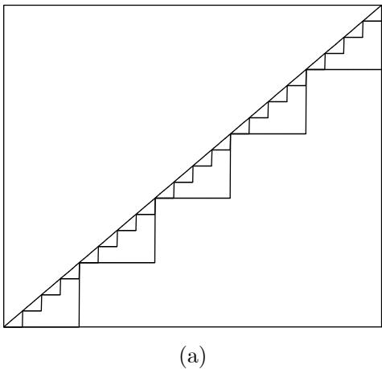

It is clear that the length of any of these staircase approximations is exactly 2. However, as functions whose graphs are shown in diagram (b),they converge uniformly to a function whose graph has length $\sqrt { 2 }$ . Since arc length is given by an integral, why don't the integrals of the staircase approximations approach $\sqrt { 2 }$ ？

# 7.3Power Series

In this section we look at series that are formally like polynomials having infinite degree. Their limits are called power series. Typically,a power series looks like

$$
S ( x ) = s _ { 0 } + s _ { 1 } x + s _ { 2 } x ^ { 2 } + \cdot \cdot \cdot + s _ { n } x ^ { n } + \cdot \cdot \cdot
$$

Before studying the specifics of power series, we can make some general statements about series of functions.

DEFINITION 7.3.1 Let $\left( f _ { k } ( x ) \right)$ be a sequence of functions all defined on $S \subset \mathbb { R }$ .Let n be their nth partial sum.If, for , the sequence $\begin{array} { r } { F _ { n } ( x ) = \sum _ { k = 0 } ^ { n } f _ { k } ( x ) } \end{array}$ $x \in S$ $( F _ { n } ( x ) )$ convergestodnumber(whichwellcll )we say that converges pointuiseand write $\textstyle \sum _ { k = 0 } ^ { \infty } f _ { k } ( x ) = F ( x )$ If the sequence $F _ { n }$ ）conuerges uniformty on $S$ ， we say that $\textstyle \sum _ { k = 0 } ^ { \infty } f _ { k }$ converges uniformly to $F$ on $S$

Note that $\textstyle \sum _ { k = 0 } ^ { \infty } f _ { k }$ converges uniformly on $S$ to $F$ means that given $\epsilon > 0$ , there is a number $N ( \epsilon )$ such that, for all $x \in S$ ，

$$
\boxed { F ( x ) - \sum _ { k = 0 } ^ { n } f _ { k } ( x ) } \Bigg | \leq \epsilon \quad \mathrm { ~ w h e n ~ } n > N ( \epsilon ) .
$$

（ $N ( \epsilon )$ depends only on $\epsilon$ , not on any $x \in S$ .）

PROPOSITION 7.3.2 For a sequence of functions $\left( f _ { k } \right)$ om $S \subset \mathbb { R }$ ，

1. $\scriptstyle \sum _ { k = 0 } ^ { \infty } f _ { k } ( x )$ converges pointwiseifand onlyifgiven $x \in S$ and $\epsilon > 0$ ，there is an integer $N ( x , \epsilon )$ such that $\textstyle | \sum _ { k = m } ^ { n } f _ { k } ( x ) | < \epsilon$ for all $n \geq m \geq N ( x , \epsilon )$

$\scriptstyle \sum _ { k = 0 } ^ { \infty } f _ { k } ( x )$ forad $\epsilon > 0$ tger $N ( \epsilon )$ $\textstyle | \sum _ { k = m } ^ { n } f _ { k } ( x ) | < \epsilon$ $x \in S$ $n \ge m \ge N ( \epsilon )$

Proof. These are simply restatements of the Cauchy criterion for convergence. ■

THEOREM 7.3.3(COMPARISON TEST FOR FUNCTION SERIES） SuppOSe that for all$x \in S$ and $k = 0 , 1 , \ldots$ ， we have $| f _ { k } ( x ) | \leq g _ { k } ( x )$ . Then

1 $\scriptstyle \sum _ { k = 0 } ^ { \infty } g _ { k } ( x )$ converges pointwise $\textstyle \implies \sum _ { k = 0 } ^ { \infty } f _ { k } ( x )$ converges pointwise.   
2. $\scriptstyle \sum _ { k = 0 } ^ { \infty } g _ { k } ( x )$ converges uniformly $\begin{array} { r } { \implies \sum _ { k = 0 } ^ { \infty } f _ { k } ( x ) } \end{array}$ converges uniformly.

Proof. $\begin{array} { r } { | \sum _ { k = m } ^ { n } f _ { k } ( x ) | \leq \sum _ { k = m } ^ { n } | f _ { k } ( x ) | \leq \sum _ { k = m } ^ { n } g _ { k } ( x ) } \end{array}$ ; now use the preceding proposition.

We now turn to the special case of power series. The preceding comparison test will be used to compare power series with geometric series; the latter converge uniformly when they converge.

DEFINITION 7.3.4（POWER SERIES） Let （ $s _ { n }$ ） be a sequence of numbers. The power series with coeffcients ( $s _ { n }$ ） is the sequence of polynomials $\left( S _ { n } ( x ) \right)$ given by

$$
S _ { n } ( x ) = \sum _ { k = 0 } ^ { n } s _ { k } x ^ { k } .
$$

We could have defined the power series in the more usual and less abstract way as an “infinite”polynomial

$$
\sum _ { k = 0 } ^ { \infty } s _ { k } x ^ { k } .
$$

The problem is,what sense is to be made of such an infinite sum? However, we will not actually push this abstraction; in fact,we immediately move away from it when the sequence of partial sums $S _ { n } ( x )$ converges.

DEFINITION 7.3.5 If for some number $_ { x }$ , the sequence of partial sums ( $\textstyle | S _ { n } ( x ) )$ converges to a number $S ( x )$ , then we write

$$
S ( x ) = \operatorname* { l i m } _ { n \to \infty } S _ { n } ( x ) = \sum _ { k = 0 } ^ { \infty } { s _ { k } x ^ { k } } .
$$

EXAMPLE 7.3.6 The power series $\begin{array} { r } { ( G _ { n } ( x ) ) = \left( \sum _ { k = 0 } ^ { n } a x ^ { k } \right) } \end{array}$ is q geometric series and converges uniformly to $\frac { a } { 1 - x }$ for any $_ x$ in $[ - r , r ]$ ，with $0 \leq r < 1$ . In this case we write ∑=0 $\textstyle \sum _ { k = 0 } ^ { \infty } a x ^ { k } = { \frac { a } { 1 - r } }$ ·

Proof. We know the series converges, and the convergence is uniform since

$$
\begin{array} { l l l } { \displaystyle \left. G _ { n } ( x ) - \frac { 1 } { 1 - x } \right. } & { = } & { \displaystyle \left. \frac { a ( 1 - x ^ { n + 1 } ) } { 1 - x } - \frac { a } { 1 - x } \right. } \\ & { = } & { \displaystyle \left. \frac { x ^ { n } } { 1 - x } \right. } \\ & { \leq } & { \displaystyle \left( \frac { 1 } { 1 - r } \right) r ^ { n } \to 0 } \end{array}
$$

Geometric power series converge absolutely and uniformly within their interval of convergence. We will exploit this fact to demonstrate a similar property for power series in general,using the comparison test for series of functions. Thus, the advantage of power series over series of arbitrary functions is that convergence for a particular $_ { x }$ give convergence for smaller $_ { x }$ ; this is the substance of the following central result. (It is called“Convergence in a Disk”because it also holds in the complex plane—the space of complex numbers $z$ —where $| z | < r$ describes a disk. This is discussed in Chapter 8.)

THEOREM 7.3.7 (CONVERGENCE IN A DISK)

1.If $\begin{array} { r } { S _ { n } ( a ) = \sum _ { k = 0 } ^ { n } s _ { k } a ^ { k } } \end{array}$ converges and $0 \leq r < | a |$ ，then $S _ { n } ( x )$ converges uniformly and absolutely for all $_ { x }$ with $| x | \le r$

2.1f $S _ { n } ( a )$ does not converge, then neither does $S _ { n } ( x )$ for any $_ { x }$ with $| x | > | a |$

Proof. To prove the first part, suppose $S _ { n } ( a )$ converges. The key to this whole proof is to note that the terms of $\scriptstyle \sum _ { k = 0 } ^ { n } s _ { k } a ^ { k }$ are bounded since the terms of a convergent series must approach $0$ . Let's write $\left| s _ { k } a ^ { k } \right| \leq M$ for all $k$ ，so that $| s _ { k } | \leq M | a | ^ { - k }$ .If $| x | \leq r < | a |$ ，then $\left| { \frac { r } { a } } \right| < 1$ and $\left| x \right| ^ { k } \leq r ^ { k } < \left| a \right| ^ { k }$ . Therefore

$$
\left| a _ { k } x ^ { k } \right| \leq M \left| a ^ { - k } \right| \left| r ^ { k } \right| = M \left| { \frac { r } { a } } \right| ^ { k } .
$$

Thus,the series of absolute values is dominated by a convergent geometric series (independent of $_ x$ )，so converges uniformly and absolutely by the comparison test stated above.

To prove the second part， suppose that $| x | > | a |$ .By the first part, $S _ { n } ( x )$ converges implies $S _ { n } ( a )$ converges. But $S _ { n } ( a )$ doesn't, so neither does $S _ { n } ( x )$ $\mid$

THEOREM 7.3.8 （MAIN CONVERGENCE THEOREM） Let（ $s _ { n }$ ） be a sequence of coef-ficients and $R$ a positive number. For convenience, let $B = 1 / R$ . The following fourconditions are equivalent.

1. For all $x \in ( - R , R )$ ， $s _ { k } x ^ { k } \to 0$ as $k \to \infty$

2. For each $\epsilon > 0$ ， there is an integer $N ( \epsilon )$ such that $| s _ { k } | \le ( B + \epsilon ) ^ { k }$ when $k > N ( \epsilon )$

3. The series $\scriptstyle \sum _ { k = 0 } ^ { \infty } s _ { k } x ^ { k }$ comverges for all $| x | < R$

4.For all $x \in ( - R , R )$ ， $k s _ { k } x ^ { k - 1 } \to 0$ as $k \to \infty$

Proof. We will show that $( 1 ) \implies ( 2 ) \implies ( 3 ) \implies ( 4 ) \implies ( 1 ) .$ $( 1 ) \implies ( 2 )$ : Given $\epsilon > 0$ ,let $x = { \frac { 1 } { B + \epsilon } }$ s0 $x < { \frac { 1 } { B } } = R$ . Since $s _ { k } x ^ { k } \to 0$ ， we know that there is some $N ( \epsilon )$ such that $\begin{array} { r } { \left| s _ { k } x ^ { k } \right| = \left| s _ { k } \frac { 1 } { ( B + \epsilon ) ^ { k } } \right| \leq 1 } \end{array}$ whenever $k > N ( \epsilon )$ . This implies that $| s _ { k } | \le ( B + \epsilon ) ^ { k }$

$( 2 ) \implies ( 3 )$ Suppose $0 \leq | x | < R$ We can find $\epsilon$ so small that $\begin{array} { r } { | x | < \frac { 1 } { B + \epsilon } < R } \end{array}$ which we write as $\left( B + \epsilon \right) \left| x \right| < 1$ . Combining this with our assumption about $\left| { s _ { k } } \right|$ ， withaconvergenteetrcris we see that $\left| s _ { k } x ^ { k } \right| \leq [ ( B + \epsilon ) | x | ] ^ { k }$ for all $\scriptstyle \sum _ { k = 0 } ^ { \infty } s _ { k } x ^ { k }$ $k > N ( \epsilon )$ . But this is a termwise comparison Converges bythcomparisontest (Theorem 3.3.17).

$( 3 ) \implies ( 4 )$ If $\scriptstyle \sum _ { k = 1 } ^ { n } s _ { k } x ^ { k }$ converges for $| x | < R$ , then $\left| s _ { k } x ^ { k } \right| \to 0$ as $k \to \infty$ .As in the $( 2 ) \implies$ (3)argument, chose $\epsilon$ so that $\begin{array} { r } { | x | < \frac { 1 } { B + \epsilon } < R } \end{array}$ . This makes $\begin{array} { r } { 1 < \frac { 1 } { ( B + \epsilon ) | x | } } \end{array}$ so let $\begin{array} { r } { \frac { 1 } { ( B + \epsilon ) | x | } = 1 + t } \end{array}$ with $t > 0$ Since $\scriptstyle \sum _ { k = 0 } ^ { \infty } s _ { k } \left( { \frac { 1 } { B + \epsilon } } \right) ^ { k }$ converges, chose $N$ large enough so that $\begin{array} { r } { s _ { k } \left( \frac { 1 } { B + \epsilon } \right) ^ { k } < 1 } \end{array}$ when $k > N$ . Putting these pieces together, we have

$$
\begin{array} { c } { { k s _ { k } x ^ { k - 1 } \leq k ( B + \epsilon ) ^ { k } | x | ^ { k - 1 } = \displaystyle \frac { 1 } { | x | } k \left[ ( B + \epsilon ) | x | \right] ^ { k } } } \\ { { = \displaystyle \frac { 1 } { | x | } \frac { k } { ( 1 + t ) ^ { k } } . } } \end{array}
$$

However, $\begin{array} { r } { \frac { k } { ( 1 + t ) ^ { k } } \to 0 } \end{array}$ as $k \to \infty$ since exponentialfunctions dominate powerfunctions (Proposition 3.2.13).

$( 4 ) \implies ( 1 )$ ： $\begin{array} { r } { s _ { k } x ^ { k } = \frac { x } { k } ( k s _ { k } x ^ { k - 1 } )  0 } \end{array}$ ■

COROLLARY 7.3.9 If the sequence $\left( { \boldsymbol { s } } _ { k } p ^ { k } \right)$ is bounded for some $_ { p }$ ，then $R = | p |$ satisfies the equivalent conditions (1)-(4).

Proof. Say $\left| s _ { k } p ^ { k } \right| \leq M$ for all $k \geq$ some $N$ . Then for all $| x | < | p |$ and $k \geq N$ ，we have $\left| s _ { k } x ^ { k } \right| \leq M \cdot | x / p | ^ { k } \to 0$ , since $| x / p | < 1$ ■

$p > 0$ $\textstyle \sum _ { k = 0 } ^ { N } \left| s _ { k } \right| p ^ { k } \leq M$ for ll $N$ then $R = p$

REMARk 7.3.11 If the equivalent conditions (1)-(4) of the Main Convergence Theorem above hold for all $R > 0$ , then we usually write $R = \infty$ . In this case, $B = 0$ and the series converges for all numbers $_ { x }$ . On the other hand, if the series converges only for $x = 0$ ， we write $R = 0$

DEFINITION 7.3.12 When $\scriptstyle \sum _ { k = 0 } ^ { n } s _ { k } x ^ { k }$ converges for $_ { x }$ in some interual $I$ ,it defines a function

$$
S ( x ) = \sum _ { k = 0 } ^ { \infty } s _ { k } x ^ { k } : I \longrightarrow \mathbb { R } .
$$

COROLLARY 7.3.13 Suppose $\begin{array} { r } { S ( x ) = \sum _ { k = 0 } ^ { \infty } s _ { k } x ^ { k } } \end{array}$ on $( - R , R )$ Then $S$ is uniformly differentiable on all closed subintervals $\lfloor a , b \rfloor$ of $( - R , R )$ with derivative $S ^ { \prime } ( x ) \ =$ $\scriptstyle \sum _ { k = 0 } ^ { \infty } k s _ { k } x ^ { k - 1 }$

Proof. We know that the last sum converges by the Main Convergence Theorem. The rest follows Corollary 7.2.6 about uniform convergence of derivatives, proved in the last section. Note also that by the Convergence-in-a-Disk Theorem (7.3.7),all convergence is uniform on any $\lfloor - r , r \rfloor$ with $0 \leq r < R$ ■

COROLLARY 7.3.14 Suppose $\begin{array} { r } { S ( x ) = \sum _ { k = 0 } ^ { \infty } s _ { k } x ^ { k } } \end{array}$ on $( - R , R )$ Then $S$ is uniformly continuous on any subinterval of $( - R , R )$ on which $S ^ { \prime }$ is bounded; in particular,it is uniformly continuous on any finite closed subinterval $\lfloor a , b \rfloor \subset ( - R , R )$

EXAMPLE 7.3.15 The functions

$$
\begin{array} { r l r } { 1 / ( 1 - x ) } & { = } & { 1 + x + x ^ { 2 } + \dots } \\ { 1 / ( 1 + x ) } & { = } & { 1 - x + x ^ { 2 } - \dots . . . } \end{array}
$$

are defined on $( - 1 , 1 )$ .Neither can be $U C$ on this interval since neither has an extension to all of $\lfloor - 1 , 1 \rfloor$ ， but they are both UC on closed subintervals. A similar statement (and argument) holds for uniform differentiability. For more on these series, see Abel's Summation Theorem below.

COROLLARY 7.3.16 Suppose $\begin{array} { r } { f ( x ) = \sum _ { k = 0 } ^ { \infty } s _ { k } x ^ { k } } \end{array}$ on $( - R , R )$ .Then

$$
F ( x ) = \sum _ { k = 0 } ^ { \infty } { \frac { s _ { k } x ^ { k + 1 } } { k + 1 } }
$$

is an anti-derivative for $f$ (i.e. $F ^ { \prime } = f$ ）on any closed subinterval of $( - R , R )$

DEFINITION 7.3.17 Given any sequence $\left( t _ { k } \right)$ ， and an increasing sequence of nonnegative integers $( n ( k ) )$ ， the sequence $\left( u _ { k } \right) = \left( t _ { n ( k ) } \right)$ is said to be a subsequence of the original sequence $t _ { n }$

EXAMPLE 7.3.18 Suppose $\begin{array} { r } { ( t _ { k } ) = \left( \frac { 1 } { k } \right) = \frac { 1 } { 1 } , \frac { 1 } { 2 } , \frac { 1 } { 3 } , . . . , \frac { 1 } { k } , . . . } \end{array}$

1.If $n ( k ) = k ^ { 2 }$ ， then $\begin{array} { r } { \left( t _ { n ( k ) } \right) = \frac { 1 } { 1 } , \frac { 1 } { 4 } , \frac { 1 } { 9 } , \dots , \frac { 1 } { k ^ { 2 } } , \dots . } \end{array}$ is q subsequence of $\left( t _ { k } \right)$

2.1f $n ( k ) = 2 k - 1$ then $\begin{array} { r } { \left( t _ { n ( k ) } \right) = \frac { 1 } { 1 } , \frac { 1 } { 3 } , \frac { 1 } { 5 } , \dots , \frac { 1 } { 2 k - 1 } , \dots } \end{array}$ is q subsequence of $\left( t _ { k } \right)$

3.If $n ( k ) = k ^ { 2 } - 6 k + 1$ ， then $\left( t _ { n \left( k \right) } \right)$ is not a subsequence, since $n ( k )$ is not increasing:

$$
\begin{array} { r } { \big ( t _ { n ( k ) } \big ) = \frac { 1 } { 5 } , \frac { 1 } { 2 } , \frac { 1 } { 1 } , \frac { 1 } { 1 } , \frac { 1 } { 2 } , \frac { 1 } { 5 } , \dots . } \end{array}
$$

On the other hand, if we restrict to $k > 3$ , then we are $O k$

4 Ifn(k）={1ks edn is edn , then $\left( t _ { n \left( k \right) } \right)$ is again not a subsequence:

$$
\begin{array} { r } { \left( t _ { n ( k ) } \right) = \frac { 1 } { 1 } , \frac { 1 } { 2 } , \frac { 1 } { 1 } , \frac { 1 } { 4 } , \frac { 1 } { 1 } , \frac { 1 } { 6 } , \dots . } \end{array}
$$

REMARK 7.3.19 It is easily seen that if a sequence converges to a limit $L$ ，then so does any subsequence. By looking at the last example above you can see why restricting the subscripts $n ( k )$ to an increasing sequence of numbers is important for this to hold.

PROPOS7.e $\scriptstyle \sum _ { k = 0 } ^ { \infty } s _ { k } x ^ { k }$ comverges on $( - R , R )$ If any subsequence of $\left( \left| s _ { k } \right| ^ { 1 / k } \right)$ converges to a limit $L$ ,then $L \leq B$ （ $= 1 / R$

Proof. Suppose a subsequence of $| s _ { n } | ^ { 1 / n }$ converges to $L > B$ .Let $\begin{array} { r } { \epsilon = \frac { L - B } { 2 } } \end{array}$ so that $L - \epsilon = B + \epsilon$ . Then for each $_ { n }$ there is an $m > n$ such that $| s _ { m } | ^ { 1 / m } > L - \epsilon$ In other words, $| s _ { m } | > ( B + \epsilon ) ^ { m }$ . But this violates part (2) of the Main Convergence Theorem 7.3.8. Thus, $L > B$ is false, so $L \leq B$

COROLLARY 7.3.21 If any subsequence of $| s _ { n } | ^ { 1 / n }$ converges to $L$ ， then any $R$ that satisfies equivalent conditions $( 1 ) - ( 4 )$ of the Main Convergence Theorem also satisfies $R \leq 1 / L$

COROLLARY 7.3.22 If $| s _ { n } | ^ { 1 / n } \to L$ ,then $R = 1 / L$ satisfies the equivalent conditions of the Main Convergence Theorem.

Proof. Part (2) of the theorem is satisfied by $1 / R = B = L$

DEFINITiON 7.3.23 Whenever we have a largest value of R for which the equivalent conditions of the Main Convergence Theorem hold, we call it the radius of convergence of the power series.

REMARk 7.3.24 It is important to be very clear on the role of the radius of convergence. If $R > 0$ is the radius of convergence of a power series, then

1. For any $0 \leq a < R$ , the power series converges absolutely and uniformly when $| x | \le a$ (i.e. in $[ - a , a ] .$ ).

2. The power series diverges for $| x | > R$

3. When $| x | = R$ (i.e. $x = R$ or $x = - R$ ), the power series may or may not converge at $_ { x }$ : see exercises.

concergence of the series COROLLARY 7.3.25 If $| s _ { k } | ^ { 1 / k } \to L$ $\scriptstyle \sum _ { k = 0 } ^ { \infty } s _ { k } x ^ { k }$ as $k  \infty$ ，then $R = 1 / L$ is the radius of (This follows from the previous two corollaries.)

ExAMPLE 7.3.26 Since $\scriptstyle \operatorname* { l i m } _ { k \to \infty } k ^ { 1 / k } = 1$ (Proposition 3.2.17), thesies $\scriptstyle \sum _ { k = 0 } ^ { \infty } k x ^ { k }$ converges on $( - 1 , 1 )$ . Of course this is nothing new. In fact, you can calculate what this converges to. (What is it?)

(For another calculation of $\scriptstyle \operatorname* { l i m } _ { k \to \infty } k ^ { 1 / k }$ , look at the function $x ^ { 1 / x } = e ^ { { \frac { 1 } { x } } \ln x }$ Its derivative is $\begin{array} { r } { \frac { 1 } { x ^ { 2 } } ( 1 - \ln x ) x ^ { 1 / x } } \end{array}$ , which is negative for $x > e$ Thus, $x ^ { 1 / x }$ is decreasing for $x > e$ Also， $\begin{array} { r } { \operatorname* { l i m } _ { x  \infty } \frac { \ln x } { x } = 0 } \end{array}$ since powers dominate logs (Corollry 3.2.16). We conclude that $k ^ { 1 / k }$ decreases to $1$ as $k \to \infty$ ）

The ratio test (Corollary 3.3.24) is probably the most widely-used test to check for convergence of a power series.

E $\scriptstyle \sum _ { k = 1 } ^ { \infty } { \frac { x ^ { k } } { 2 ^ { k } k ^ { 2 } } } ?$ The ratio of

$$
{ \frac { x ^ { k + 1 } } { 2 ^ { k + 1 } ( k + 1 ) ^ { 2 } } } \cdot { \frac { 2 ^ { k } k ^ { 2 } } { x ^ { k } } } = { \frac { k ^ { 2 } } { ( k + 1 ) ^ { 2 } } } \cdot { \frac { 1 } { 2 } } \cdot x ,
$$

whose limit as $k  \infty$ is simply $\frac x 2$ - Thus， the cut-off for convergence is $| x | = 2$ ， so the radius of convergence is 2. The series converges when $x = 2$ or $x = - 2$ ，S0 its interval of convergence is actually $\lfloor - 2 , 2 \rfloor$ ，in which it converges absolutely and uniformly.

Once we know that a function has a power series representation on a non-trivial interval, then that representation is unique; in fact,the coefficients $s _ { k }$ are determined by evaluation of the derivatives of the function at $0$

TH 7.3.28(U & ERIEs SupTose $\begin{array} { r } { S ( x ) \ = \ \sum _ { k = 0 } ^ { \infty } s _ { k } x ^ { k } } \end{array}$ $( - R , R )$ $R > 0$ $k$

$$
s _ { k } = \frac { S ^ { ( k ) } ( 0 ) } { k ! } ,
$$

where $S ^ { ( k ) }$ denotes the kth derivative of $S$

Proof. Induction shows that the $i$ th derivative of $x ^ { k }$ is $k ( k - 1 ) \dots ( k - i + 1 ) x ^ { k - i }$ (When $i = 0$ this is interpreted, as usual, to mean simply $x ^ { k }$ ,and when $i > k$ this becomes simply $0$ .） Thus, we have (by Corollary 7.3.13)

$$
S ^ { ( i ) } ( x ) = \sum _ { k = 0 } ^ { \infty } k ( k - 1 ) \ldots ( k - i + 1 ) s _ { k } x ^ { k - i } .
$$

All terms with $i > k$ are $0$ ， and all terms with $i < k$ have a positive power of $_ { x }$ ， so they all become $0$ if we let $x = 0$ . Thus $S ^ { ( k ) } ( 0 ) = ( k ! ) s _ { k }$ ，which establishes the theorem.■

COROLLARY 7.3.29 If the function $S$ is given by a power series on some interval $( - R , R )$ with $R > 0$ ，and if all derivatives of $S$ vanish at $0$ ，then $S$ is constant on $( - R , R )$

There are non-zero functions which have derivatives of all orders,all of which vanish at $x = 0$ . Such a function cannot be given by a power series in any interval containing zero, since such a power series would then have to be identically zero (see Example 7.4.10 in the next section).

If we have two functions given by converging power series, we could reasonably ask if their sum, difference, product and quotient are also given by converging power series.If yes,then the coefficients of these series are determined,as we have just seen.Here is the answer to the convergence question.

THEOREM7.3.30 Suppose $\begin{array} { r } { S ( x ) = \sum _ { k = 0 } ^ { \infty } s _ { k } x ^ { k } } \end{array}$ with radius of conwergence $R _ { S }$ and $\textstyle T ( x ) = \sum _ { k = 0 } ^ { \infty } t _ { k } x ^ { k }$ with radius of convergence $R _ { T }$

1. $\begin{array} { r } { ( S \pm T ) \left( x \right) = \sum ( s _ { k } \pm t _ { k } ) x ^ { k } } \end{array}$ with radius of convergence $\ge \operatorname* { m i n } ( R _ { S } , R _ { T } )$

2. $\begin{array} { r } { S T ( x ) = \sum _ { k = 0 } ^ { \infty } u _ { k } x ^ { k } } \end{array}$ with radius of convergence $\ge \operatorname* { m i n } ( R _ { S } , R _ { T } )$ where $u _ { k } =$ $\scriptstyle \sum _ { j = 0 } ^ { k } s _ { j } t _ { k - j }$

3.1f $| T ( 0 ) | > 0$ $( i . e . | t _ { 0 } | > 0 ,$ ), then $1 / T$ has a power series erpansion converging in some interval $[ - \alpha , \alpha ]$ with $0 < \alpha \leq R _ { T }$

Proof. Part $^ { 1 }$ is straightforward. For part 2, note that

$$
\begin{array} { r c l } { \displaystyle \left( \sum _ { k = 0 } ^ { N } s _ { k } x ^ { k } \right) \left( \sum _ { \lambda = 0 } ^ { M } t _ { \lambda } x ^ { \lambda } \right) } & { = } & { \displaystyle \sum _ { k = 0 } ^ { N } \sum _ { \lambda = 0 } ^ { M } s _ { k } t _ { \lambda } x ^ { k + \lambda } } \\ { \displaystyle \sum _ { k = 0 } ^ { N } \sum _ { \lambda = 0 } ^ { M } \left| s _ { k } t _ { \lambda } x ^ { k + \lambda } \right| } & { = } & { \displaystyle \left( \sum _ { k = 0 } ^ { N } \left| s _ { k } \right| \left| x \right| ^ { k } \right) \left( \sum _ { \lambda = 0 } ^ { M } \left| t _ { \lambda } \right| \left| x \right| ^ { \lambda } \right) } \\ & { \leq } & { \displaystyle \left( \sum _ { k = 0 } ^ { \infty } \left| s _ { k } \right| \left| x \right| ^ { k } \right) \left( \sum _ { \lambda = 0 } ^ { \infty } \left| t _ { \lambda } \right| \left| x \right| ^ { \lambda } \right) . } \end{array}
$$

If $| x | < \operatorname* { m i n } ( R _ { S } , R _ { T } )$ , then both infinite sums in the last expression are finite. Thus, the product series,and hence its terms,must be bounded, so it converges absolutely by Corollary 7.3.10 of the Main Convergence Theorem. Since the product series converges absolutely, its terms can be rearranged or collected to put it in the form $\scriptstyle \sum _ { k = 0 } ^ { \infty } u _ { k } x ^ { k }$ (see Proposition 3.3.45).

The uniqueness of power series expansions for a given function tells us that the power series given by this theorem are the only ones that converge to the given sum, difference and product functions.

The situation for the reciprocal is a bit more complicated since it is diffcult to write down, explicitly, the formulas for the coefficients of $1 / T ( x )$ . Suppose we write

$$
1 / T ( x ) = v _ { 0 } + v _ { 1 } x + v _ { 2 } x ^ { 2 } + v _ { 3 } x ^ { 3 } + \cdots .
$$

Then we must have

$$
\left( \sum _ { k = 0 } ^ { \infty } t _ { k } x ^ { k } \right) \cdot \left( \sum _ { \lambda = 0 } ^ { \infty } v _ { \lambda } x ^ { \lambda } \right) = 1 + 0 \cdot x + 0 \cdot x ^ { 2 } + 0 \cdot x ^ { 3 } + \cdots .
$$

From the second part of this theorem,we know what the coefficients of the left-hand product are,so we get the equations

$$
\begin{array} { r c l } { { t _ { 0 } v _ { 0 } } } & { { = } } & { { 1 } } \\ { { } } & { { } } & { { } } \\ { { t _ { 0 } v _ { 1 } + t _ { 1 } v _ { 0 } } } & { { = } } & { { 0 } } \\ { { } } & { { } } & { { } } \\ { { t _ { 0 } v _ { 2 } + t _ { 1 } v _ { 1 } + t _ { 2 } v _ { 0 } } } & { { = } } & { { 0 } } \\ { { } } & { { } } & { { } } \\ { { } } & { { } } & { { \mathrm { e t c . } } } \end{array}
$$

Since $| t _ { 0 } | > 0$ we can solve the first equation for $v _ { 0 }$ . Putting this into the second equation,we can solve for $v _ { 1 }$ . We can continue in this way, solving successively for each new $v _ { \lambda }$ in terms of the $t _ { k }$ s and the previous values of $v _ { i }$ . The question is: does this new power series have a positive radius of convergence? Here is an outline of a proof that it does (adapted from [Spivak 1994]).

1. Suppose $\begin{array} { r } { T ( x ) = \sum _ { k = 0 } ^ { \infty } t _ { k } x ^ { k } } \end{array}$ converges for $_ { x }$ equal to some positive $r \leq R _ { T }$ ： note that $v _ { 0 } = 1 / t _ { 0 }$ and $v _ { \lambda } = - \frac { 1 } { t _ { 0 } } \sum _ { j = 0 } ^ { \lambda - 1 } v _ { j } t _ { \lambda - j }$ (from equations above） for $\lambda > 0$

2. All terms $\left| t _ { k } r ^ { k } \right|$ are bounded by some number $M$ , and we have

$$
\left| v _ { \lambda } x ^ { \lambda } \right| \leq { \frac { M } { \left| t _ { 0 } \right| } } \sum _ { j = 0 } ^ { \lambda - 1 } \left| v _ { \lambda } x ^ { \lambda } \right| .
$$

3. Let $N = \operatorname* { m a x } ( M , { \sqrt { 2 } } )$ ; then $\left| v _ { \lambda } r ^ { \lambda } \right| \le \frac { 1 } { t _ { 0 } } N ^ { 2 \lambda }$ (induction on $\lambda$ ）

4. Deduce that $\scriptstyle \sum _ { \lambda = 0 } ^ { \infty } v _ { \lambda } x ^ { \lambda }$ when $\left| { \frac { x } { r } } \right|$ is small enough (and positive).

(Anotherprofofthisteomfooregeralore $\textstyle \sum _ { k = 0 } ^ { \infty } s _ { k } ( x - a ) ^ { k }$ can be found in [Strichartz,1995],p. 288.）

COROLLARY 7.3.31 Supp08e $\textstyle f \left( x \right) = \sum _ { k = 0 } ^ { \infty } s _ { k } x ^ { k }$ on the closed interoal $\lfloor a , b \rfloor$ Then for any $\alpha , \beta \in \lfloor a , b \rfloor$ ，

$$
\int _ { \alpha } ^ { \beta } f ( x ) = \sum _ { k = 0 } ^ { \infty } \int _ { \alpha } ^ { \beta } ( s _ { k } x ^ { k } ) = \sum _ { k = 0 } ^ { \infty } { \frac { s _ { k } } { k + 1 } } \left( \beta ^ { k + 1 } - \alpha ^ { k + 1 } \right) .
$$

Proof.Let $\begin{array} { r } { G ( x ) = \sum _ { k = 0 } ^ { \infty } \frac { s _ { k } } { k + 1 } \left( x ^ { k + 1 } - \alpha ^ { k + 1 } \right) = \sum _ { k = 0 } ^ { \infty } \frac { s _ { k } } { k + 1 } x ^ { k + 1 } - \sum _ { k = 0 } ^ { \infty } \frac { s _ { k } } { k + 1 } \alpha ^ { k + 1 } } \end{array}$ (All of these converge by what we have already proved about power series.) Then $G ( x )$ and $\textstyle \int _ { \alpha } ^ { x } f ( x )$ have the same derivative and agree at $x = \alpha$ ，s0 $\begin{array} { r } { G ( x ) = \int _ { \alpha } ^ { x } f ( x ) } \end{array}$

EXAMPLE 7.3.32 (GEOMETRIC SERIEs) We start with the two series

$$
{ \begin{array} { l } { \displaystyle { \frac { 1 } { 1 - x } } = 1 + x + x ^ { 2 } + x ^ { 3 } + \cdots } \\ { \displaystyle { \frac { 1 } { 1 + x } } = 1 - x + x ^ { 2 } - x ^ { 3 } + \cdots . } \end{array} }
$$

These both have a radius of convergence of 1 and thus converge in $( - 1 , 1 )$ . Integrating term by term gives us

$$
\begin{array} { r } { - \ln ( 1 - x ) = x + x ^ { 2 } / 2 + x ^ { 3 } / 3 + x ^ { 4 } / 4 + \cdot \cdot \cdot } \\ { \ln ( 1 + x ) = x - x ^ { 2 } / 2 + x ^ { 3 } / 3 - x ^ { 4 } / 4 + \cdot \cdot \cdot } \end{array}
$$

and by adding, we obtain

$$
\ln \left( { \frac { 1 + x } { 1 - x } } \right) = 2 x + 2 x ^ { 3 } / 3 + 2 x ^ { 5 } / 5 + \cdot \cdot \cdot .
$$

The first of these converges on $\lfloor - 1 , 1 \rfloor$ ， the second on $( - 1 , 1 ]$ ， and the last on $( - 1 , 1 )$

Let's look at the second. $I t$ is not difficult to show that it converges uniformly and absolutely on $\lfloor - r , 1 \rfloor$ for any $0 \leq r < 1$ (it's an alternating series). It follows that its limit as $x \to 1$ equals its value at $x = 1$ ， the sum of the alternating harmonic series.But its value for $x \ : < \ : 1$ is $\ln ( 1 + x )$ ，a function uniformly continuous on (at least) [O,1]. It follows that the sum of the alternating harmonic series is simply $\ln ( 2 )$ . (This was also proved in an exercise to the last section.)

We can also obtain a series for $\ln ( 2 )$ by letting $\begin{array} { r } { x = \frac { 1 } { 2 } } \end{array}$ in the first series.

Note that the first of these series converges much more slowly than the second. (See the exercises at the end of this section for a more detailed discussion.） The advantage of the third series is that is can be used to calculate values of $\ln ( y )$ for all $y > 0$ by letting $\begin{array} { r } { x = \frac { y - 1 } { y + 1 } } \end{array}$

If we substitute $x ^ { 2 }$ for $_ { x }$ in the second series, we get

$$
\begin{array} { c } { { \displaystyle \frac { 1 } { 1 + x ^ { 2 } } = 1 - x ^ { 2 } + x ^ { 4 } - x ^ { 6 } + \cdot \cdot \cdot } } \\ { { = \displaystyle \sum _ { i = 0 } ^ { \infty } ( - 1 ) ^ { i } x ^ { 2 i } . } } \end{array}
$$

This converges on $( - 1 , 1 )$ ; once again, we integrate both sides to obtain

$$
\begin{array} { l } { \arctan ( x ) = x - x ^ { 3 } / 3 + x ^ { 5 } / 5 - x ^ { 7 } / 7 + \cdot \cdot \cdot } \\ { = \displaystyle \sum _ { i = 0 } ^ { \infty } ( - 1 ) ^ { i } \frac { x ^ { 2 i + 1 } } { 2 i + 1 } . } \end{array}
$$

This now converges on $( - 1 , 1 ]$ . When $x = 1$ , we get the famous but slowly converging series:

$$
\arctan ( 1 ) = 1 - 1 / 3 + 1 / 5 - 1 / 7 + 1 / 9 - 1 / 1 1 + \cdots .
$$

In Section 7.5, where we define $\boldsymbol { \mathcal { U } }$ and the periodic functions, we will prove that this value is $\pi / 4$ (see page 266).

EXAMPLE 7.3.33(THE EXPONENTIAL FUNCTION AS A POWER SERIES)

$$
\exp ( x ) = \sum _ { k = 0 } ^ { \infty } { \frac { x ^ { k } } { k ! } } = 1 + { \frac { x } { 1 ! } } + { \frac { x ^ { 2 } } { 2 ! } } + \cdot \cdot \cdot + { \frac { x ^ { n } } { n ! } } + \cdot \cdot \cdot
$$

This power series converges uniformly and absolutely on any interval $\lfloor - R , R \rfloor$ ， and it is easily checked (term-by-term differentiation) that $\exp ( x )$ is its own derivative. We already know that $e ^ { x }$ has this property, so form the quotient $Q ( x ) = { \frac { \exp ( x ) } { e ^ { x } } }$ $Q ^ { \prime } ( x ) = 0$ ，s0 $Q$ is constant; $Q ( 0 ) = 1$ ， so we conclude that $\exp ( x ) = e ^ { x }$ . (This was the subject of an exercise in the last section).

In general,we know that if a power series converges for $x = R > 0$ ，then it converges uniformly on closed subintervals of $( - R , R )$ .On the other hand, it may or may not converge at $x = R$ or $x = - R$ . For example, $x - x ^ { 2 } / 2 + x ^ { 3 } / 3 - x ^ { 4 } / 4 + \cdot \cdot \cdot$ converges at $x = 1$ but not at $x = - 1$ and is, in fact,uniformly convergent throughout $\lfloor - a , 1 \rfloor$ for $0 \leq a < 1$ .Is this always the case that if a power series converges at $x = R > 0$ , then it is uniformly convergent in $[ - a , R ]$ for $0 \leq a < R$ ?The answer is yes,as shown in a famous theorem proved more than two centuries ago by Niels Abel.We establish first a preliminary result that is useful in itself.

LEMMA 7.3.34（ABEL's LEMMA） Suppose $b _ { 1 } \geq b _ { 2 } \geq \cdots$ , with each $b _ { i } \geq 0$ . Suppose also that the partial sums $\begin{array} { r } { A _ { n } = \sum _ { j = 1 } ^ { n } a _ { j } } \end{array}$ all lie in $\lfloor m , M \rfloor$ . Then the partial sums $\textstyle \sum _ { j = k } ^ { n } a _ { j } b _ { j }$ all lie in $\left[ m b _ { k } , M b _ { k } \right]$

Proof. We use the same trick (sometimes called “Abel summation"） that we used in proving Dirichlet's Test (3.3.38):

$$
{ \begin{array} { l l l } { a _ { k } b _ { k } + \cdot \cdot \cdot + a _ { n } b _ { n } } & { = } & { A _ { k } b _ { k } + \left( A _ { k + 1 } - A _ { k } \right) b _ { k + 1 } + \cdot \cdot \cdot } \\ & & { + ( A _ { n - 1 } - A _ { n } ) b _ { n - 1 } + ( A _ { n } - A _ { n - 1 } ) b _ { n } } \\ & { = } & { A _ { k } { \big ( } b _ { k } - b _ { k + 1 } { \big ) } + A _ { k + 1 } { \big ( } b _ { k + 1 } - b _ { k + 2 } { \big ) } + \cdot \cdot \cdot } \\ & & { + A _ { n - 1 } { \big ( } b _ { n - 1 } - b _ { n } { \big ) } + A _ { n } b _ { n } } \end{array} }
$$

For each $j$ ， $m \leq A _ { j } \leq M$ ，

$$
\begin{array} { l c l } { m b _ { k } } & { = } & { m ( b _ { k } - b _ { k + 1 } ) + m ( b _ { k + 1 } - b _ { k + 2 } ) + \cdot \cdot \cdot + m ( b _ { n - 1 } - b _ { n } ) + m b _ { n } } \\ & { \leq } & { A _ { k } ( b _ { k } - b _ { k + 1 } ) + A _ { k + 1 } ( b _ { k + 1 } - b _ { k + 2 } ) + \cdot \cdot \cdot + A _ { n - 1 } ( b _ { n - 1 } - b _ { n } ) + A _ { n } b _ { n } } \\ & { \leq } & { M ( b _ { k } - b _ { k + 1 } ) + M ( b _ { k + 1 } - b _ { k + 2 } ) + \cdot \cdot \cdot + M ( b _ { n - 1 } - b _ { n } ) + M b _ { n } } \\ & { = } & { M b _ { k } , } \end{array}
$$

since the first and third sums telescope. Thus, $a _ { k } b _ { k } + \cdot \cdot \cdot + a _ { n } b _ { n } \in \left\lfloor m b _ { k } , M b _ { k } \right\rfloor$ as required.

THEOREM 7.3.35 （ABEL's SUMMATION THEOREM） Suppose that the power series $\scriptstyle \sum _ { k = 0 } ^ { \infty } a _ { k } x ^ { k }$ $\textstyle f ( x ) = \sum _ { k = 0 } ^ { \infty } a _ { k } x ^ { k }$ converges when $x = 1$ Then it converges uniformly on $\lfloor 0 , 1 \rfloor$ $[ 0 , 1 ]$ $\operatorname* { l i m } _ { x \to 1 ^ { - } } f ( x ) \ =$ ，so that $\begin{array} { r } { f ( 1 ) = \sum _ { k = 0 } ^ { \infty } a _ { k } } \end{array}$

Proof. Exercise (apply Abel's Lemma with $b _ { j } = x ^ { j }$ ）

COROLLARY7336ose $\scriptstyle \sum _ { k = 0 } ^ { \infty } a _ { k } x ^ { k }$ comwerges when $x = R$ for some $R > 0$ . Then it converges uniformly on $[ - a , R ]$ for $0 \leq a < R$

Proof. Exercise. ■

REMARK7.337isroidesotheroftattheei $\scriptstyle \sum _ { k = 1 } ^ { \infty } { \frac { ( - 1 ) ^ { k + 1 } } { k } }$ converges to $\ln { 2 }$ .

But there's more to Abel's Theorem. Suppose we don't know whether a numerical   
series $\scriptstyle \sum _ { k = 0 } ^ { \infty } a _ { k }$ converges. We can make this series into the power series $P ( x ) =$   
$\scriptstyle \sum _ { k = 0 } ^ { \infty } a _ { k } x ^ { k }$ .If our original series did converge， say $\textstyle \sum _ { k = 0 } ^ { \infty } a _ { k } \ = \ A$ ，then Abel’s   
Theorem tells us that lim P(x) = A as well. So we turn this around into a definition.   
DEmImITIONO DEINTION7.3.38（ABELSUMMABILY)eseries $L$ $\scriptstyle \sum _ { k = 0 } ^ { \infty } a _ { k } x ^ { k }$ UMABILIT Il $x \in \left[ 0 , 1 \right)$ $\scriptstyle \sum _ { k = 0 } ^ { \infty } a _ { k }$ $\operatorname* { l i m } _ { x \to 1 ^ { - } } \sum _ { k = 0 } ^ { \infty } a _ { k } x ^ { k } = L$ is said to be Abel   
(Note that $x \to 1 ^ { - }$ means we restrict $_ x$ to $x < 1$ ）

We can now interpret Abel's Theorem as saying that if a series converges to $A$ ，then it is Abel summable to $A$ .So Abel summability is most interesting for series that don't converge,or whose convergence properties are unknown. The nonconverging series $1 - 1 + 1 - 1 + \cdot \cdot .$ is actually Abel summable-see the exercises. We will use Abel summability in Chapter 8 to discuss the convergence of Fourier series (see page 286).

Of course,it is reasonable to ask,“When does Abel summability imply convergence?” Not always, as $1 - 1 + 1 - 1 + \cdot \cdot .$ shows,but sometimes.Here is Tauber's1 famous partial converse to Abel's Theorem.

THEOREM 7.3.39 (TAUBER’s THEOREM) SupOse $\scriptstyle \sum _ { k = 0 } ^ { \infty } a _ { k }$ is Abel summable to $L$ and the summands satisfy

$$
\operatorname* { l i m } _ { k \to \infty } k \cdot a _ { k } = 0 .
$$

$\scriptstyle \sum _ { k = 0 } ^ { \infty } a _ { k }$ converges to $L$

Proof. Outlined in the exercises.■

There is a famous generalization of Tauber's theorem,due to Hardy and Littlewood. Even though the change in the hypothesis from Tauber's Theorem seems minor,the proof of the Hardy-Littlewood theorem is so diffcult that it is beyond the scope of this book. Here is its deceptively simple statement.

THEOREM7.3.40 (HARDY-LITTLEWOOD TAUBERIAN THEOREMSuppOSe $\scriptstyle \sum _ { k = 0 } ^ { \infty } a _ { k }$ is Abel summable to $L$ and the summands satisfy

$$
k \cdot a _ { k } \leq C ,
$$

where $C$ is a positive constant. Then $\scriptstyle \sum _ { k = 0 } ^ { \infty } a _ { k }$ comverges to $L$

There are other summability methods besides Abel summability,and there are variations for integrals instead of sums. Theorems like Abel's,which assert that convergent series are summable in these other senses,and sum to what they converge to, are now usually called Abelian theorems. Converses (more properly, partial converses)，which state that under certain conditions summability implies convergence,are called Tauberian theorems. For a brief review of some of the literature, see [Borwein, 2005].

# Exercises

1. Suppose ( $f _ { n }$ ） is a sequence of functions on defined on $S$ such that

(a) $f _ { n } ( x ) \geq f _ { n + 1 } ( x )$ for all $_ n$ (b) $f _ { n } \to 0$ uniformly on $S$

Prove that $\textstyle \sum _ { n = 0 } ^ { \infty } ( - 1 ) ^ { n } f ( x )$ converges uniformly on $S$

Is the convergence necessarily absolute? Give some examples.

2. Show how the proposition below folows from a similar result about sequences of functions (Theorem 7.2.5).

PROPOSITION． Suppose（ $f _ { n }$ ） is a sequence of functions differentiable on $\lfloor a , b \rfloor$ such that

（(@) $\textstyle \sum _ { n = 0 } ^ { \infty } f _ { n } ( c )$ converges for some $c \in \lfloor a , b \rfloor$ (b) $\textstyle \sum _ { n = 0 } ^ { \infty } f _ { n } ^ { \prime } ( x )$ converges uniformly on $[ a , b ]$

Then $\textstyle \sum _ { n = 0 } ^ { \infty } f ( x )$ converges uniformly on $\lfloor a , b \rfloor$ to a differentablefunction wose derivative is $\textstyle \sum _ { n = 0 } ^ { \infty } f _ { n } ^ { \prime } ( x )$

3. Suppose $s _ { k } = P ( k )$ is a polynomial in $k$ Prove that $\scriptstyle \sum _ { k = 0 } ^ { \infty } s _ { k } x ^ { k }$ comverges exactly when $| x | < 1$

4. It was pointed Out that $\scriptstyle \sum _ { k = 0 } ^ { \infty } k x ^ { k }$ hasaradiusofovegeeftaig with a geometric series, deduce this radius of convergence and calculate the actual value of this series for $x \in ( - 1 , 1 )$

5.Findtheradiusofoecef $\scriptstyle \sum _ { k = 0 } ^ { \infty } \sin ( k ) x ^ { k }$ and $\scriptstyle \sum _ { k = 0 } ^ { \infty } \cos ( k ) x ^ { k }$ Whatabout convergence at $x = 1 , - 1$ ？

6.A hypergeometric series is one where the coefficients of $x ^ { k }$ are rational functions of $k$ ： $s _ { k } = P ( k ) / Q ( k )$ . Check online references at

$$
\mathrm { h t t p : / / m a t h w o r l d . w o l f r a m . c o m / H y p e r g e o m e t r i c S e r i e s . h t m 1 }
$$

and

http : //en.wikipedia.org/wiki/Hypergeometric_series.

Prove that $R = 1$ is a radius of convergence for a hypergeometric series. (Hint: Prove that it suffces to show that $\operatorname* { l i m } _ { n \to \infty } | p ( n ) | ^ { 1 / n } = 1$ when $p ( n )$ is a polynomial in $_ { n }$ see Corollary 7.3.25.)

7. To see what can happen at the boundary of the interval of convergence, consider the series tEd Each has radius of convergence with $| x | = 1$

8. Finish the proof of Abel's Summation Theorem (7.3.35). As suggested, apply c onvuenice, $b _ { j } = x ^ { j }$ isin $x \in$ $[ 0 , 1 ]$ $\textstyle \sum _ { j = 0 } ^ { \infty } a _ { j }$ $a _ { k } + a _ { k + 1 } + \cdots + a _ { n } $ $\lfloor - \epsilon , \epsilon \rfloor$ $k$ sufficiently large, so the same is true for their limits as $k \to \infty$

9. Use Abel's Summation Theorem (7.3.35) to prove the following.

LLAR $\textstyle f ( x ) = \sum _ { k = 0 } ^ { \infty } a _ { k } x ^ { k }$ co $x = R$ $R > 0$ $[ - a , R ]$ $0 \leq a < R$ (Hint: Show that the series $\begin{array} { r } { g ( y ) = \sum _ { k = 0 } ^ { \infty } \left( a _ { k } R ^ { k } \right) y ^ { k } } \end{array}$ converges at $y = 1$ ; apply Abel's Theorem. Compare $f \left( x \right)$ and $g ( y )$ and their limits.)

10.Suppose $\scriptstyle \sum _ { k = 0 } ^ { \infty } a _ { k }$ and $\scriptstyle \sum _ { k = 0 } ^ { \infty } b _ { k }$ aree product is defined to be $\scriptstyle \sum _ { k = 0 } ^ { \infty } c _ { k }$ ，where

$$
c _ { k } = ( a _ { 0 } b _ { k } + a _ { 1 } b _ { k - 1 } + \cdots + a _ { j } b _ { k - j } + \cdots a _ { k } b _ { 0 } ) = \sum _ { j = 0 } ^ { k } a _ { j } b _ { k - j } .
$$

$\scriptstyle \sum _ { k = 0 } ^ { \infty } c _ { k }$ cxists,sho that $\begin{array} { r } { \left( \sum _ { k = 0 } ^ { \infty } a _ { k } \right) \left( \sum _ { k = 0 } ^ { \infty } b _ { k } \right) = \sum _ { k = 0 } ^ { \infty } c _ { k } } \end{array}$ (Hint: Lok at the associated power series $\sum a _ { k } x ^ { k }$ etc.and use Theorem 7.3.35; remember how polynomials are multiplied; see also the proof of Theorem 7.3.30)

11.Using the ideas in the prof of Theorem_7.3.30,show thatif $\scriptstyle \sum _ { k = 0 } ^ { \infty } b _ { k }$ convergeabsolutelythde $\scriptstyle \sum _ { k = 0 } ^ { \infty } c _ { k }$ where $c _ { k } = ( a _ { 0 } b _ { k } + a _ { 1 } b _ { k - 1 } +$ $\scriptstyle \sum _ { k = 0 } ^ { \infty } a _ { k }$ and $\cdot \cdot \cdot + a _ { j } b _ { k - j } + \cdot \cdot \cdot a _ { k } b _ { 0 } )$ .Thus $\begin{array} { r } { \left( \sum _ { k = 0 } ^ { \infty } a _ { k } \right) \left( \sum _ { k = 0 } ^ { \infty } b _ { k } \right) = \sum _ { k = 0 } ^ { \infty } c _ { k } } \end{array}$ by the previous exercise.

12. (From [Spivak 1994]): Show that the series

$$
\sum _ { k = 0 } ^ { \infty } { \frac { x ^ { 2 n + 1 } } { 2 n + 1 } } - { \frac { x ^ { n + 1 } } { 2 n + 2 } }
$$

converges uniformly to $\textstyle { \frac { 1 } { 2 } } \ln ( x + 1 )$ on $\lfloor - a , a \rfloor$ for $0 < a < 1$ ,but that at $x = 1$ $\mathrm { l n 2 }$ $x = 1$ $\textstyle \sum _ { k = 0 } ^ { \infty } { \frac { 1 } { 2 n + 1 } } - { \frac { 1 } { 2 n + 2 } }$ 2n+2.） Why is this not a violation of Abel's Summation Theorem?

13.Find and prove a generalization of Abel's Summation Theorem (7.3.35） that appiesto seresof the form $\scriptstyle \sum _ { k = 0 } ^ { \infty } a _ { k } f _ { k } ( x )$

14.As was mentioned in the text, the series $1 - 1 + 1 - 1 + \cdot \cdot .$ is Abel summable: show this and find its Abel limit.

15. Here is an outline of the proof of Tauber's Theorem (7.3.39). First, prove the following.

LEMMA.If $u \geq 0$ , then for every positive integer $k$ ， $1 - u ^ { k } \leq k ( 1 - u )$

LEMMA. If the sequence $\left( a _ { n } \right)$ converges to a then so does the sequence of qverages $\textstyle \left( ( 1 / n ) \sum _ { k = 1 } ^ { n } a _ { k } \right)$

(Induction works for the first of these; the second was an exercise on page 107.) Here are the hypotheses (and notation) for Tauber's Theorem.

(@) $\begin{array} { l } { P ( x ) = \sum _ { k = 0 } ^ { \infty } a _ { k } x } \\ { \displaystyle \operatorname* { l i m } _ { x \to 1 ^ { - } } P ( x ) = L . } \\ { \displaystyle \operatorname* { l i m } _ { k \to \infty } k ~ a _ { k } = 0 . } \end{array}$ converges for $| x | < 1$   
(b)  
  
(c）

We want to make $\scriptstyle \sum _ { k = 0 } ^ { \prime \prime } a _ { k }$ within $\epsilon$ of $L$ by making $_ { n }$ larger than some $N$

$$
\left| \sum _ { k = 0 } ^ { n } a _ { k } - L \right| \leq \underbrace { \left| \sum _ { k = 0 } ^ { n } a _ { k } - \sum _ { k = 0 } ^ { n } a _ { k } \ x ^ { k } \right| } _ { S _ { 1 } } + \underbrace { \left| \sum _ { k = 0 } ^ { n } a _ { k } \ x ^ { k } - P ( x ) \right| } _ { S _ { 2 } } + \underbrace { | P ( x ) - L | } _ { S _ { 3 } } .
$$

Note that the last term, $S _ { 3 }$ ， has no $_ { n }$ in it; we remedy this by letting $x =$ $1 - 1 / n$ . The idea now is to show that each of the three terms can be made less than $\epsilon / 3$ by making $_ { n }$ bigger than numbers $N _ { 1 }$ ， $N _ { 2 }$ ， $N _ { 3 }$ ；we then let $N = \operatorname* { m a x } ( N _ { 1 } , N _ { 2 } , N _ { 3 } )$

By the first lemma,

$$
S _ { 1 } \leq \left| \sum _ { k = 0 } ^ { n } a _ { k } ( 1 - ( 1 - 1 / n ) ^ { k } ) \right| \leq ( 1 / n ) \sum _ { k = 1 } ^ { n } k \left| a _ { k } \right| ,
$$

and this last quantity can be made $\leq \epsilon / 3$ by the second lemma.

Fo $S _ { 2 }$ chosc $N _ { 2 }$ So tiat $_ n$ $| a _ { n } | < \epsilon / 3$ for $n > N _ { 2 }$ $\begin{array} { r } { \operatorname { t h e n } S _ { 2 } = \left| \sum _ { k = n + 1 } ^ { \infty } a _ { k } \ x ^ { k } \right| \leq } \end{array}$ $\sum _ { n + 1 } ^ { \infty } { \frac { \epsilon } { 3 n } } ~ x ^ { k }$

This last is a geometric series which is $\leq \epsilon / 3$ when $x = 1 - 1 / n$

Finally, $P ( 1 - 1 / n ) \longrightarrow L$ when $_ { n }$ is sufficiently large, so $S _ { 3 }$ can be made small.

# 7.4 Taylor Series

# Introduction

In this section, we will use a slight generalization of the kind of series we have been discussing. Instead of sums of terms in powers of $_ x$ ， we will consider sums of terms in powers of $( x - c )$ for a fixed number $c$ . Everything we have said up to now has an analogue if we replace $_ { x }$ by $x - c$ , including the notions of convergence and radius of convergence. For example, consider the following corollary to Abel's Summation Theorem.

ORLAY7336oseo $\scriptstyle \sum _ { k = 0 } ^ { \infty } a _ { k } x ^ { k }$ converges when $x = R$ for iome $R > 0$ . Then it converges uniformly on $[ - a , R ]$ for $0 \leq a < R$

We can rewrite it by replacing $_ { x }$ by $x - c$ to obtain the following.

COROLLARY 7.4.1（CENTERED AT $c$ ）Suppose $\scriptstyle \sum _ { k = 0 } ^ { \infty } a _ { k } \left( x - c \right) ^ { k }$ converges when $x =$ $c + R$ for some $R > 0$ . Then it converges uniformly on $\lfloor c - a , c + R \rfloor$ for $0 \leq a < R$

Proof. When $x = c { + } R$ tttt $\scriptstyle \sum _ { k = 0 } ^ { \infty } a _ { k } R ^ { k }$ converges. By the first version of the corollary, $\scriptstyle \sum _ { k = 0 } ^ { \infty } a _ { k } x ^ { k }$ Converges uniformly for $- a \leq x \leq R$ Replacing $_ x$ by $x - c$ we see that $\scriptstyle \sum _ { k = 0 } ^ { \infty } a _ { k } \left( x - c \right) ^ { k }$ convergesfor $- a \leq x - c \leq R$ ,i.e. $c - a \leq x \leq c + R$ ■

This proof is typical of how much of the theory already proved for power series of the form $\scriptstyle \sum _ { k = 0 } ^ { \infty } a _ { k } x ^ { k }$ translateseasilyintothetheoryforseries $\scriptstyle \sum _ { k = 0 } ^ { \infty } a _ { k } \left( x - c \right) ^ { k }$ Here is another simple rewrite of a result stated previously for powers of $_ { x }$ :Theorem 7.3.28 on the uniqueness of power series representations.

THEOREM 7.4.2（UNIQUENESS OF POWER SERIES） SuppOSe

$$
S ( x ) = \sum _ { k = 0 } ^ { \infty } s _ { k } \left( x - c \right) ^ { k }
$$

converges on $( c - R , c + R )$ for some $R > 0$ . Then for all $k$

$$
s _ { k } = \frac { S ^ { ( k ) } ( c ) } { k ! } ,
$$

where $S ^ { ( k ) }$ denotes the kth derivative of $S$

To prove this we could simply redo the proof already given in the case $c = 0$ (see: Theorem 7.3.28),but in order to see the translation from “centered at $0 ^ { \circ }$ to “centered at $_ c$ ,” it would be better to use a method with more general applicability. If we let $( - R , R )$ $y = x - c$ The series ,then as $\begin{array} { r } { S ( x ) = \sum _ { k = 0 } ^ { \infty } s _ { k } \left( x - c \right) ^ { k } } \end{array}$ $_ x$ takes on values in becomes $( c - R , c + R )$ $\begin{array} { r } { \bar { S } ( y ) = \sum _ { k = 0 } ^ { \infty } s _ { k } y ^ { k } } \end{array}$ ， $_ y$ takes on values which then converges uniformly for $y \in ( - R , R )$ .By the uniqueness theorem for series centered at 0 (Theorem 7.3.28), the coefficients of $\check { S } ( y )$ are given by $s _ { k } = \frac { \breve { S } ^ { ( k ) } ( 0 ) } { k ! }$ Since $\tilde { S } ( y ) = \tilde { S } ( x - c ) = S ( x )$ ，

$$
\frac { d ( \widetilde { S } ( y ) ) } { d x } = \frac { d \left( \widetilde { S } ( y ) \right) } { d y } \frac { d y } { d x }
$$

and by the chain rule,

$$
\left. \frac { d ( \widetilde { S } ( y ) ) } { d x } \right| _ { y = x - c } = \frac { d ( S ( x ) ) } { d x } = \frac { d ( \widetilde { S } ( y ) ) } { d y } .
$$

In other words, $S ^ { \prime } { ( x ) } = \widetilde { S } ^ { \prime } { ( y ) }$ (the first as a function of $_ { x }$ , the second as a function of $_ y$ ).Inductively,this holds for the higher derivatives as well: $S ^ { ( k ) } ( x ) = \tilde { S } ^ { ( k ) } ( y )$ When $x = c$ ， $y = 0$ ，s0

$$
s _ { k } = \frac { \widetilde { S } ^ { ( k ) } ( 0 ) } { k ! } = \frac { \widetilde { S } ^ { ( k ) } ( c ) } { k ! } .
$$

Just as we used the chain rule in the previous argument, we can use the change of variable formula for integrals to reformulate Corollary 7.3.31 of the previous section on definite integrals of series.

COROLLARY 7.4.3 Suppose $\begin{array} { r } { f \left( x \right) = \sum _ { k = 0 } ^ { \infty } s _ { k } ( x - c ) ^ { k } } \end{array}$ on the closed interval $\lfloor a , b \rfloor$ Then, for any $\alpha , \beta \in \lfloor a , b \rfloor$ ，

$$
\int _ { \alpha } ^ { \beta } f ( x ) = \sum _ { k = 0 } ^ { \infty } \int _ { \alpha } ^ { \beta } ( s _ { k } ( x - c ) ^ { k } ) = \sum _ { k = 0 } ^ { \infty } { \frac { s _ { k } } { k + 1 } } \left( ( \beta - c ) ^ { k + 1 } - ( \alpha - c ) ^ { k + 1 } \right) .
$$

$y = x - c$ $\begin{array} { r } { \tilde { f } ( y ) = \sum _ { k = 0 } ^ { \infty } s _ { k } y ^ { k } } \end{array}$ $y \in \left[ a - c , b - c \right]$ $\begin{array} { r } { \int _ { \alpha - c } ^ { \beta - c } \tilde { f } ( y ) d y = \sum _ { k = 0 } ^ { \infty } s _ { k } \int _ { \alpha - c } ^ { \beta - c } y ^ { k } d y } \end{array}$ $x = y + c$ to deduce

$$
\int _ { \alpha - c } ^ { \beta - c } { \tilde { f } } ( y ) d y = \int _ { \alpha } ^ { \beta } f ( x ) d x
$$

and

$$
\int _ { \alpha - c } ^ { \beta - c } y ^ { k } d y = \int _ { \alpha } ^ { \beta } ( x - c ) ^ { k } d x .
$$

In the previous discussion, the function $f ( x )$ was defined as a power series. We now turn around the situation and start with a function $f ( x )$ and ask if it can be computed as the limit of a power series. By Theorem 7.4.2，we know what the coefficients of this series must be.

DEFINITION 7.4.4 （TAYLOR POLYNOMIALS） SuppOSe the function $f$ is $_ { n }$ -times differentiable on the interval $( a , b )$ ，and $c \in ( a , b )$ .For $k = 0 \dots n - 1$ ， define the Taylor polynomials for $f$ ， centered at $c$ by

$$
\begin{array} { r c l } { { T _ { 0 } ( f , x , c ) } } & { { = } } & { { f ( c ) } } \\ { { } } & { { } } & { { } } \\ { { T _ { k + 1 } ( f , x , c ) } } & { { = } } & { { T _ { k } ( f , x , c ) + \displaystyle \frac { f ^ { ( k + 1 ) } ( c ) } { ( k + 1 ) ! } \cdot ( x - c ) ^ { k + 1 } . } } \end{array}
$$

In practice,we will be dealing with only one function $f$ and only one real number $c$ at a time, so we will adopt the more compact notation $T _ { n } ( x ) = T _ { n } ( f , x , c )$ We will always assume that $f$ is differentiable enough times so that the particular Taylor polynomials we are working with make sense.

$$
T _ { n } ( x ) = \sum _ { k = 0 } ^ { n } { \frac { f ^ { ( k ) } ( x ) } { k ! } } \cdot ( x - c ) ^ { k }
$$

PROPOSITION 7.4.5 $T _ { n } ( x )$ is the unique polynomial of degree $_ n$ in $( x - c )$ with the property that its kth derivative at $c$ equals the kth derivative of $f$ at $c$ for $k = 0 \dots n$

COROLLARY 7.4.6 Let $R _ { n } ( x ) ~ = ~ f ( x ) - T _ { n } ( x )$ .Then $R _ { n } ( c ) ~ = ~ R _ { n } ^ { \prime } ( c ) ~ = ~ \cdot \cdot ~ = ~$ $R _ { n } ^ { ( n ) } ( c ) = 0$

Recall (Definition 5.2.7) that functions and $h$ don't cross in an interval $I$ when $g$ $g \leq h$ on all of $I$ or $h \leq g$ on all of $I$

LEMMA 7.4.7 If $c , t \in ( a , b )$ ， the functions $g$ and $h$ don't cross in $( a , b )$ ，and $K$ is any constant, then the functions $K g ( t ) \cdot ( t - c )$ and $K h ( t ) \cdot ( t - c )$ don't cross in $\vert \operatorname* { m i n } ( c , x ) , \operatorname* { m a x } ( c , x ) \vert$ ·

The proof is a tedious though straightforward analysis of the several cases.

THEOREM 7.4.8（TAYLOR POLYNOMIALS WITH REMAINDER） SupPOSe the function $f$ is $( n + 1 )$ -times differentiable on the interval $E$ and $x , c \in E$ . Suppose further that $f ^ { ( n + 1 ) } ( t )$ lies between $_ { m }$ and $M$ for all $t \in E$ . Then the remainder, or error term $R _ { n } ( f , x , c ) = f ( x ) - T _ { n } ( f , x , c )$ lies between $m ( x - c ) ^ { n + 1 } / ( n + 1 ) !$ and $M ( x -$ $c ) ^ { n + 1 } / ( n + 1 )$

Proof. Replacing $f$ by $f \mathrm { ~ - ~ } T _ { n }$ ，we preserve our hypotheses，and so we can asSume $f ( c ) = f ^ { \prime } ( c ) = \cdot \cdot \cdot = f ^ { ( n ) } ( c ) = 0$ (the higher derivatives remain the same). We now have to show that $f ( x )$ lies between the stated fractions. Proceed by induction．The function $f ^ { \prime } ( t )$ is $k$ -times differentiable and its $k$ th derivative lies between $_ { m }$ and $M$ .By assumption ( $k = 0$ )，or induction hypothesis, $f ^ { \prime } ( t )$ lies between $\textstyle { \frac { m ( t - c ) ^ { k } } { ( k ) ! } }$ and M(t-e).By the preceding lemma,these last functions don't cross on $\vert \operatorname* { m i n } ( x , c ) , \operatorname* { m a x } ( x , c ) \vert$ , so we can use our result on functions that don't cross (Proposition 5.2.9) to conclude that the integrals preserve betweenness. More precisely, $\begin{array} { r } { \int _ { c } ^ { x } f ^ { \prime } ( t ) d t = f ( x ) - f ( c ) = f ( x ) } \end{array}$ lies between $\begin{array} { r l } { { } } & { { } { \frac { m ( t - c ) ^ { k + 1 } } { ( k + 1 ) ! } } \left( = \int _ { c } ^ { x } { \frac { m ( t - c ) ^ { k } } { ( k ) ! } } d t \right) } \end{array}$ and $\begin{array} { r } { { \frac { M ( t - c ) ^ { k + 1 } } { ( k + 1 ) ! } } \left( = \int _ { c } ^ { x } { \frac { M ( t - c ) ^ { k } } { ( k ) ! } } d t \right) } \end{array}$

DEFINITION 7.4.9 If the sequence of Taylor polynomials $T _ { n } ( f , x , c )$ converges for $- R < x - c < R$ ，then

$$
\sum _ { i = 0 } ^ { \infty } T _ { n } ( f , x , c ) = \sum _ { i = 0 } ^ { \infty } { \frac { f ^ { ( i ) } ( c ) ( x - c ) ^ { i } } { i ! } }
$$

is called the Taylor series for $f$ around $x = c$ ， denoted $T ( f , x , c )$

Even if the Taylor series converges,it may not converge to the function $f$ itself. Here is the classic example.

EXAMPLE 7.4.10 Let $f ( x ) ~ = ~ e ^ { - 1 / x ^ { 2 } }$ .This function is uniformly continuous for $| x | > 0$ ，and $f ( x )  0$ as $x \to 0$ . Thus, $f$ can be extended to all of $\mathbb { R }$ with $f ( 0 ) = 0$ Computing a few derivatives of $f$ reveals that, for $| x | > 0$ ， each derivative is of the form $\begin{array} { r } { \frac { P ( 1 / x ) } { e ^ { 1 / x ^ { 2 } } } = \frac { P ( u ) } { e ^ { u ^ { 2 } } } } \end{array}$ where $P$ is a polynomial and $u = 1 / x$ As $x \to 0 , u \to \infty$ Since exponential functions dominate polynomials (Proposition 3.2.15)， it is easily checked that these derivatives all erist at $0$ and are equal to zero; i.e. $f ^ { ( k ) } ( 0 ) = 0$ for all $k \geq 0$ (see exercises). Thus, the Taylor series for $f$ around $0$ is identically $0$ ，s0 it doesn't converge to $f$

So how do we know when a convergent Taylor series actually converges to the function that it is built on? We have to look at the remainder term $R _ { n } ( f , x , c ) =$ $f ( x ) - T _ { n } ( f , x , c )$ and show that it goes to $0$ as $n \to \infty$ . From the Theorem 7.4.8, we know that $R _ { n } ( f , x , c )$ lies in the interval

$$
\left[ \operatorname* { m i n } \left( \frac { m ( x - c ) ^ { n + 1 } } { ( n + 1 ) ! } , \frac { M ( x - c ) ^ { n + 1 } } { ( n + 1 ) ! } \right) , \operatorname* { m a x } \left( \frac { m ( x - c ) ^ { n + 1 } } { ( n + 1 ) ! } , \frac { M ( x - c ) ^ { n + 1 } } { ( n + 1 ) ! } \right) \right] ,
$$

SO

$$
| R _ { n } ( f , x , c ) | \leq \frac { ( M - m ) \left| x - c \right| ^ { n + 1 } } { ( n + 1 ) ! } .
$$

EXAMPLE 7.4.11（EXPONENTIAL SERIES） $f ( x ) = e ^ { x }$ ， $c = 1$ $f ^ { ( k ) } ( x ) = f ( x ) = e ^ { x }$ On the interval $[ a , b ]$ (containing 1) we can take $m = e ^ { u }$ ， $M = e ^ { b }$ ； also, $- ( b - a ) \leq$ $x - c \leq b - a$ ， so we have

$$
| R _ { n } ( f , x , c ) | \leq { \frac { ( e ^ { b } - e ^ { a } ) ( b - a ) ^ { n + 1 } } { ( n + 1 ) ! } } .
$$

We know fromtheratio test that $et { } { ' } \sum _ { k = 0 } ^ { \infty } \frac { k ^ { n } } { n ! }$ conuerges, $s o \ \frac { k ^ { n } } { n ! } \to 0$ as $n \longrightarrow \infty$ . Thus, $| R _ { n } ( f , x , c ) | \to 0$ ， so the Taylor series for $e ^ { x }$ centered at $1$ (or any other number) converges on any finite interval. Of course, we have already seen this in Example 7.3.33.

EXAMPLE 7.4.12（BINOMIAL SERIES） Let $B ( x ) \ = \ ( 1 + x ) ^ { p }$ ，where $p$ is any real number.Its derivatives are

$$
\begin{array} { l c l } { { B ^ { \prime } ( x ) } } & { { = } } & { { p ( 1 + x ) ^ { p - 1 } } } \\ { { B ^ { \prime \prime } ( x ) } } & { { = } } & { { p ( p - 1 ) ( 1 + x ) ^ { p - 2 } } } \\ { { } } & { { } } & { { \cdot \cdot } } \\ { { B ^ { ( k ) } ( x ) } } & { { = } } & { { p ( p - 1 ) \cdot \cdot \cdot ( p - k + 1 ) ( 1 + x ) ^ { p - k } . } } \end{array}
$$

If we define the hthbinomialcoeffcienttoe (2)p(-1).(p-k1) and ${ \binom { p } { 0 } } = 1$ ，then

$$
T _ { n } ( g , x , 0 ) = { \binom { p } { 0 } } + { \binom { p } { 1 } } x + { \binom { p } { 2 } } x ^ { 2 } + \cdot \cdot \cdot + { \binom { p } { n } } x ^ { n } = \sum _ { k = 0 } ^ { n } { \binom { p } { k } } x ^ { k } .
$$

(Note that if $_ { p }$ is a non-negative whole number, $\binom { p } { k } = 0$ for $k > p$ ， since one of the factors of its numerator will be $( p - p ) = 0$ .）As usual, we check the ratio test first:

$$
{ \frac { \left| { \binom { p } { k + 1 } } x ^ { k + 1 } \right| } { \left| { \binom { p } { k } } x ^ { k } \right| } } = \left| { \frac { p - k } { k + 1 } } x \right| = { \frac { k - p } { k + 1 } } | x | \quad \ w h e n \ k > p .
$$

Thus, letting $k  \infty$ we see that the ratio is $| x |$ ， so the binomial series converges absolutely and uniformly in the interval $( - 1 , 1 )$ . But what does it converge to? First,

$$
\begin{array} { r c l } { { B ^ { \prime } ( x ) } } & { { = } } & { { \binom { p } { 1 } + \binom { p } { 2 } 2 x + \binom { p } { 3 } 3 x ^ { 2 } + \cdots + \binom { p } { k + 1 } ( k + 1 ) x ^ { k } + \cdots } } \\ { { ( 1 + x ) B ^ { \prime } ( x ) } } & { { = } } & { { \binom { p } { 1 } + \binom { p } { 2 } 2 x + \binom { p } { 3 } 3 x ^ { 2 } + \cdots + \binom { p } { k + 1 } ( k + 1 ) x ^ { k } + \cdots } } \\ { { } } & { { } } & { { + \binom { p } { 1 } x + \binom { p } { 2 } 2 x ^ { 2 } + \cdots + \binom { p } { k } ( k ) x ^ { k } + \cdots } } \end{array}
$$

At this point we note that, except for $x ^ { 0 }$ , the coefficient of $x ^ { k }$ in $( 1 + x ) B ^ { \prime } ( x )$ is

$$
{ \binom { p } { k + 1 } } ( k + 1 ) + { \binom { p } { k } } ( k ) = p { \binom { p } { k } } .
$$

Since we can also write ${ \binom { p } { 1 } } = p { \binom { p } { 0 } }$ ， this relation is true for $k = 0$ also, and we have

$$
( 1 + x ) B ^ { \prime } ( x ) = p \sum _ { k = 0 } ^ { \infty } \binom { p } { k } x ^ { k } = p B ( x ) .
$$

Now compute

$$
\begin{array} { r c l } { \displaystyle \left( \frac { B ( x ) } { ( 1 + x ) ^ { p } } \right) ^ { \prime } } & { = } & { \displaystyle \frac { ( 1 + x ) ^ { p } B ^ { \prime } ( x ) - B ( x ) p ( 1 + x ) ^ { p - 1 } } { ( 1 + x ) ^ { 2 p } } } \\ & & { = } & { \displaystyle \frac { ( 1 + x ) ^ { p } B ^ { \prime } ( x ) - ( 1 + x ) B ^ { \prime } ( x ) ( 1 + x ) ^ { p - 1 } } { ( 1 + x ) ^ { p } } } \\ & { = } & { 0 . } \end{array}
$$

Thus, $\frac { B ( x ) } { ( 1 + x ) ^ { p } }$ is constant on $( - 1 , 1 )$ But $\frac { B ( 0 ) } { ( 1 + 0 ) ^ { p } } = 1$ ，80 $( 1 + x ) ^ { p }$ is, in fact, equal to its Taylor erpansion $B ( x )$ on $( - 1 , 1 )$

In the Appendix to this chapter, we show that $B \left( x \right)$ also converges pointwise (though not absolutely） at $x \ = \ - 1$ ，and $x \ = \ 1$ .Thus，by the Abel Summation Theorem (7.3.35),

Note that we didn't use the remainder term in this argument.

The following theorem gives an explicit calculation for the remainder term. This calculation is rarely made,however, since it is generally difficult to estimate the size of the $( n + 1 )$ st derivative.

THEOREM 7.4.13(INTEGRAL FORM OF THE REMAINDER） If the first $n + 1$ deriv-atives of $f$ exist on $\displaystyle \left\lfloor c , x \right\rfloor$ ，then

$$
R _ { n } ( f , x , c ) = \int _ { c } ^ { x } { \frac { f ^ { ( n + 1 ) } ( t ) } { n ! } } ( x - t ) ^ { n } d t .
$$

Proof. Consider the remainder as a function of t: Rn(f,x,t)= f(x)-∑k=0 f（k）(2）. $( x - t ) ^ { k }$ . We will differentiate and then integrate $R _ { n }$ (notice that almost everything cancels,or telescopes).

$$
\begin{array} { r c l } { \displaystyle \frac { d ( R _ { n } ( f , x , t ) } { d t } } & { = } & { \displaystyle \frac { d f ( x ) } { d t } - \left[ \sum _ { k = 0 } ^ { n } \frac { f ^ { ( k ) } ( t ) } { k ! } \cdot ( x - t ) ^ { k } \right] ^ { \prime } } \\ & { = } & { 0 - \displaystyle ( - f ^ { \prime } ( t ) \Big ) } \\ & & { - \left[ - f ^ { \prime } ( t ) + \frac { f ^ { \prime \prime } ( t ) } { 1 ! } ( x - t ) \right] } \\ & & { - \displaystyle \left[ \frac { - f ^ { \prime \prime } ( t ) } { 1 ! } ( x - t ) + \frac { f ^ { \prime \prime } ( t ) } { 2 ! } ( x - t ) ^ { 2 } \right] - \cdots } \\ & & { - \displaystyle \left[ \frac { - f ^ { ( n ) } ( t ) } { ( n - 1 ) ! } ( x - t ) ^ { n - 1 } + \frac { f ^ { ( n + 1 ) } ( t ) } { n ! } ( x - t ) ^ { n } \right] } \\ & { - } & { - \displaystyle \frac { f ^ { ( n + 1 ) } ( t ) } { n ! } ( x - t ) ^ { n } . } \end{array}
$$

Our result now follows from integrating this from $c$ to $_ x$ ， since $R _ { n } ( f , x , x ) = 0$

# Exercises

1. Find the sums and intervals of convergence of the following.

(a) ∑=1kk-1 (b) $\begin{array} { r } { \sum _ { k = 1 } ^ { \infty } k x ^ { k - 1 } } \\ { \sum _ { k = 1 } ^ { \infty } k ^ { 2 } x ^ { k - 1 } } \\ { \sum _ { k = 1 } ^ { \infty } \frac { x ^ { k + 2 } } { k ( k + 2 ) } } \end{array}$

2. This exercise verifies the claims made about the function $e ^ { - 1 / x ^ { 2 } }$

(a) Prove that all of the derivatives of e-1/x² are of the form P(u),where $P$ is a polynomial and $u = 1 / x ^ { 2 }$   
(b） Prove that the derivatives are all uniformly continuous on $\mathbb { R } - \{ 0 \}$ and have limit $0$ as $x \to 0$

(c） Conclude that $e ^ { - 1 / x ^ { 2 } }$ is infinitelydiferentiable and allits derivatives vanish at $0$

$f ( x ) = \sum _ { n = 0 } ^ { \infty } { \frac { \cos ( n ^ { 2 } x ) } { e ^ { n } } }$

(a) Prove that this series converges absolutely and uniformly on all of $\mathbb { R }$ (Hint: Use the Weierstrass MTest (Theorem 7.1.19).   
(b） Prove the same for all derivatives of $f$   
(c） Show that the Taylor series for $f$ around $c = 0$ diverges for all $| x | > 0$

This is another example of an infinitely differentiable function whose Taylor series doesn't converge to it.

4.Find the Taylor series,and its interval of convergence, for the following functions (from [Kaczor&Nowak, 2000]):

$$
\begin{array} { r l } & { f ( x ) = \ln ( 1 + x ) \mathrm { ~ a r o u n d ~ } c = 0 } \\ & { f ( x ) - \frac { 1 } { 2 } \ln \frac { 1 + x } { 1 - x } \mathrm { ~ a r o u n d ~ } c - 0 } \\ & { f ( x ) = \ln ( 1 + x + x ^ { 2 } ) \mathrm { ~ a r o u n d ~ } c = 0 } \\ & { f ( x ) - \frac { 1 } { 1 - 5 x } + 6 x ^ { 2 } \mathrm { , ~ a r o u n d ~ } c = 0 } \\ & { f ( x ) = \frac { e ^ { x } } { 1 - x } \mathrm { ~ a r o u n d ~ } c = 0 } \\ & { f ( x ) = ( x + 1 ) e ^ { z } \mathrm { ~ a r o u n d ~ } c = 1 } \\ & { f ( x ) = \frac { e ^ { x } } { x } \mathrm { ~ a r o u n d ~ } c = 1 . } \end{array}
$$

5. Find the sum of each of the following series. (Hint: These are values of Taylor series.)

$$
\begin{array} { r l } & { \sum _ { n = 0 } ^ { \infty } \frac { 2 ^ { - n } } { n + 3 } \mathrm { ~ a n d } \sum _ { n = 0 } ^ { \infty } \frac { ( n + 3 ) } { 2 ^ { n } } } \\ & { \sum _ { n = 0 } ^ { \infty } \frac { 1 } { ( 2 n ) ! } } \\ & { \sum _ { n = 0 } ^ { \infty } \frac { n } { 2 ^ { n } } } \\ & { \sum _ { n = 1 } ^ { \infty } \frac { ( - 1 ) ^ { n + 1 } } { n ( n + 1 ) } } \\ & { \sum _ { n = 2 } ^ { \infty } \frac { ( - 1 ) ^ { n } } { n ^ { 2 } + n - 2 } } \\ & { \sum _ { n = 0 } ^ { \infty } \frac { 3 ^ { n } ( n + 1 ) } { n ! } } \end{array}
$$

6.Suppose that $y = f ( x )$ satisfies the differential equation $y ^ { \prime } - y = e ^ { x }$ . Find the Taylor expansion for $f$ and its radius of convergence. Find a simple expression for $f$

# 7.5 The Periodic Functions

The goal of this section is to define the trigonometric functions,particularly the sine and cosine,completely rigorously and without the aid of pictures or triangles. Our tools will be power series,estimates,and results from calculus,especially the consequences of $f ^ { \prime } > 0$ and $f ^ { \prime } = 0$ on an interval. We start with the series defined recursively:

$ \begin{array} { l } { { \displaystyle { \boldsymbol { s } } _ { 0 } = 0 , { \boldsymbol { s } } _ { 1 } = 1 , { \boldsymbol { s } } _ { j + 2 } = { \frac { - { \boldsymbol { s } } _ { j } } { ( j + 1 ) ( j + 2 ) } } ; } \\ { { \boldsymbol { S } } _ { n } ( { \boldsymbol { x } } ) = \sum _ { j = 0 } ^ { 2 n + 1 } { \boldsymbol { s } } _ { j } x ^ { j } = \sum _ { k = 0 } ^ { n } { \frac { ( - 1 ) ^ { k } } { ( 2 k + 1 ) ! } } x ^ { 2 k + 1 } = x - { \frac { x ^ { 3 } } { 3 ! } } + { \frac { x ^ { 5 } } { 5 ! } } - { \frac { x ^ { 7 } } { 7 ! } } + \cdot \cdot \cdot } \end{array} }$ 2. c0 = 1,c1 =0,Cj+2 = $C _ { n } ( x ) = \sum _ { j = 0 } ^ { 2 n } c _ { j } x ^ { j } = \sum _ { k = 0 } ^ { n } { \frac { ( - 1 ) ^ { k } } { ( 2 k ) ! } } x ^ { 2 k } = 1 - { \frac { x ^ { 2 } } { 2 ! } } + { \frac { x ^ { 4 } } { 4 ! } } - { \frac { x ^ { 6 } } { 6 ! } } + \cdot \cdot \cdot$ $c _ { j + 2 } = \frac { - c _ { j } } { ( j + 1 ) ( j + 2 ) }$

Of course, these come from the well-known Taylor series, but here we are starting with them instead of deriving them.

Note that our notation here is not the same one that we usually use for power series. The degrees of $S _ { n } ( x )$ and $C _ { n } ( x )$ are $2 n + 1$ and $2 n$ respectively；the $k$ th term of $C _ { n } ( x )$ ， for example, involves $x ^ { 2 k }$ . The reason is that both series have a lot of $0$ terms and writing a formula taking this into account would be very messy. Furthermore,when these O terms are discarded, both series are clearly alternating, so the error in truncating them is no bigger than the first term deleted—at least once the terms start decreasing,which they eventually do when $_ { n }$ is big enough.（Think about how we know this.)

LEMMA 7.5.1 Both $S _ { n } ( x )$ and $C _ { n } ( x )$ converge uniformly and absolutely for $x \in$ $( - R , R )$ , for any $R \geq 0$

This follows directly from the ratio test.

Here are plots of $C _ { 5 } ( x )$ and $S _ { 5 } ( x )$ ：

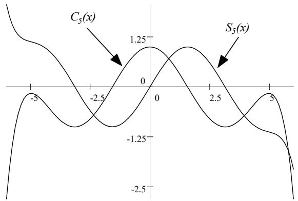

$$
\begin{array} { r l } {  { l . \ \sin ( x ) = \operatorname* { l i m } _ { n \to \infty } S _ { n } ( x ) = \sum _ { k = 0 } ^ { \infty } ( - 1 ) ^ { k } \cdot \frac { x ^ { 2 k + 1 } } { ( 2 k + 1 ) ! } . } } \\ { \quad } \\ { \quad \ell . \ \cos ( x ) = \operatorname* { l i m } _ { n \to \infty } C _ { n } ( x ) = \sum _ { k = 0 } ^ { \infty } ( - 1 ) ^ { k } \cdot \frac { x ^ { 2 k } } { ( 2 k ) ! } . } \end{array}
$$

The following key facts about sine and cosine follow directly from their definitions and our general results about alternating series and power series.

# PROPOSITION 7.5.3 (BASIC PROPERTIES)

1. For any $R > 0$ , there is a positive integer $N ( R )$ such that $\sin ( x )$ (respectively, $\cos ( x ) )$ lies between $S _ { n } ( x )$ and $S _ { n + 1 } ( x )$ (respectively $C _ { n } ( x )$ and $C _ { n + 1 } ( x )$ ）when $n \geq N ( R )$ and $x \in ( - R , R )$ .In fact, $N ( R )$ can be taken to be any integer $N \geq R$

2. $\sin ( 0 ) = 0$ and $\cos ( 0 ) = 1$

3. $\sin ( - x ) = - \sin ( x )$ and $\cos ( - x ) = \cos ( x )$

$$
\frac { d ( \sin ( x ) ) } { d x } = \cos ( x ) \ a n d \ \frac { d ( \cos ( x ) ) } { d x } = - \sin ( x ) .
$$

Proof. The only assertion that is not straightforward is the first.By the alternating series test (Corollary 3.3.33), the limits will lie between consecutive partial sums once the terms of the series begin decreasing in absolute value. This will happen when $n \geq R$ , since ${ \frac { x ^ { k + 1 } } { ( k + 1 ) ! } } = { \frac { x ^ { k } } { k ! } } { \frac { x } { k + 1 } }$ and $\left| { \frac { x } { k + 1 } } \right| < 1$ when $x \in ( - R , R )$ and $k \geq n \geq R$

COROLLARY 7.5.4 For any constants $A$ and $B$ ， the function $\omega ( x ) = A \sin ( x ) +$ $B \cos ( x )$ satisfies the differential equation $\omega ^ { \prime \prime } = - \omega$

The sine and cosine functions are determined by their values at $0$ and the differential equation $\omega ^ { \prime \prime } = - \omega$ which they satisfy. This is a special case of a far more general theorem about solutions of differential equations. In this special case,however,we can use the simple consequence (Corollary 6.3.3) of LBC that a function whose derivative vanishes on an interval must be constant on that interval. Before applying this to the differential equation for sine and cosine, we'll warm up by using it to prove an even more basic fact about the sine and cosine.

PROPOSITION 7.5.5 $\sin ^ { 2 } ( x ) + \cos ^ { 2 } ( x ) = 1$ for all $_ x$ (Note that $\sin ^ { 2 } ( x )$ means simply $( \sin ( x ) ) ^ { 2 }$ ; this time-saving but sometimes confusing notation for powers of trigonometric functions dates back to the l8th century and was used by William Jones (1675-1749).)

Proof. Let $f ( x ) = \sin ^ { 2 } ( x ) + \cos ^ { 2 } ( x )$ .An easy calculation shows that $f ^ { \prime } ( x )$ is identically $0$ ，S0 $f ( x )$ is constant.Since $f ( 0 ) = 1$ ，we are done. (Can you imagine how hard it would be to prove this simple identity directly from the power series?)

Now,as promised, we show that linear combinations of sine and cosine are the only solutions to $\omega ^ { \prime \prime } = - \omega$

PROPOSITION 7.5.6 Suppose $f$ is a function defined and twice uniformly differentiable on an interval $I$ which contains $0$ and may possibly be all of $\mathbb { R }$ . Suppose that $f$ has the property that $f ^ { \prime \prime } = - f$ on $I$ . Then

$$
f ( x ) = f ( 0 ) \cos x + f ^ { \prime } ( 0 ) \sin ( x )
$$

for all $x \in I$

Proof. Let $\omega ( x ) = f ( 0 ) \sin x + f ^ { \prime } ( 0 ) \cos x$ and $g = ( \omega - f ) ^ { 2 } + ( \omega ^ { \prime } - f ^ { \prime } ) ^ { 2 }$ .From Corollary 7.5.4 and the assumptions on $f$ , we easily see that $g ^ { \prime } ( x ) = 0$ on $I$ ，s0 $g$ is constant on $I$ . Since $\omega$ and $f$ agree at $0$ ， $g$ is identically O on $I$ . If a sum of squares is $0$ , each must be $0$ (Propositions 1.5.9 and 1.5.14). Thus, $\omega = f$ on $I$ ■

COROLLARY 7.5.7 （ADDITION FORMULAS） For any $_ { \alpha }$ and $\beta$

1. $\sin ( \alpha + \beta ) = \sin ( \alpha ) \cos ( \beta ) + \cos ( \alpha ) \sin ( \beta ) .$   
2. $\cos ( \alpha + \beta ) = \cos ( \alpha ) \cos ( \beta ) - \sin ( \alpha ) \sin ( \beta ) .$

Proof. Exercise■

We now turn to the definition of $\boldsymbol { \pi }$ . There are a number of routes to take. Had we developed the notion of arclength,we might have defined $\boldsymbol { \pi }$ as the length of some circular arc—but we didn't go down this road. Using our approach,we might have defined $\boldsymbol { \mathcal { U } }$ to be either the first (smallest）positive root of $\sin x$ or twice the first positive root of $\mathrm { c o s } x$ .The problem here is that these roots are both larger than 1. As a result,we may have to take more terms than we'd like of our series to ensure that these terms are decreasing (so that we can locate $\sin x$ or $\mathrm { c o s } x$ between consecutive partial sums). It turns out that the actual arithmetic is simplest if we define $\boldsymbol { \mathcal { U } }$ to be 4 times the first positive number where $\sin ( x ) = \cos ( x )$ . To do that, we have to show that such a number exists. The idea will be to show that the function $\sin ( x ) - \cos ( x )$ is negative at $x = 0$ ，positive at $x = 1$ , and has positive derivative on the interval $[ 0 , 1 ]$ .We can then invoke the derivative version of the Inverse Function Theorem (Corollary 6.3.15).

# LEMMA 7.5.8

1. $\sin ( x ) \geq 0$ on [0,2] $a n d > 0$ on $( 0 , 2 ]$

2. $\begin{array} { r } { \frac { 1 } { 2 } \leq \cos ( x ) \leq 1 } \end{array}$ on $[ 0 , 1 ]$

3. $\begin{array} { r } { \sin ( x ) + \cos ( x ) \geq \frac { 1 } { 2 } } \end{array}$ on the interval $[ 0 , 1 ]$

4 $\sin ( 0 ) - \cos ( 0 ) < 0$ ， $\sin ( 1 ) - \cos ( 1 ) > 0 .$

Proof. When $x \in ( 0 , 2 ]$ , the terms of the sine series are decreasing in size; when $x \in \left[ 0 , 1 \right]$ , the same is true for the cosine series. By Proposition 7.5.3 and what we know about alternating decreasing series,we see that sine and cosine lie between consecutive partial sums of their power series. Thus,we have

$$
\begin{array} { l } { { x - { \displaystyle \frac { x ^ { 3 } } { 6 } } \leq \sin ( x ) \leq x \quad { \mathrm { f o r ~ } } x \in [ 0 , 2 ] } } \\ { { 1 - { \displaystyle \frac { x ^ { 2 } } { 2 } } \leq \cos ( x ) \leq 1 \quad { \mathrm { f o r ~ } } x \in [ 0 , 1 ] . } } \end{array}
$$

As0, $\begin{array} { r } { x - \frac { x ^ { 3 } } { 6 } = x \left( 1 - \frac { x ^ { 2 } } { 6 } \right) } \end{array}$ andtatireti $x \in \ [ 0 , 2 ]$ ， which establishes part (1). $\textstyle 1 - { \frac { x ^ { 2 } } { 2 } } \geq 1 - { \frac { 1 } { 2 } }$ when $x \in \ [ 0 , 1 ]$ ，which establishes part (2). Part (3) now follows by addition of inequalities.

The first inequality of part (4) is clear from the power series themselves. To prove the second part, note that $\cos ( 1 )$ lies between its 3rd and 4th partial sums,i.e.,

$$
1 - { \frac { 1 } { 2 } } + { \frac { 1 } { 2 4 } } - { \frac { 1 } { 7 2 0 } } \leq \cos ( 1 ) \leq 1 - { \frac { 1 } { 2 } } + { \frac { 1 } { 2 4 } } .
$$

Thus $\cos ( 1 ) \leq \frac { 1 3 } { 2 4 }$ Since we alredy know that $\begin{array} { r } { \sin ( 1 ) \geq \frac { 5 } { 6 } } \end{array}$ , we se that $\sin ( x ) -$ $\begin{array} { r } { \cos ( x ) \ge \frac { 5 } { 6 } - \frac { 1 3 } { 2 4 } = \frac { 7 } { 2 4 } > 0 } \end{array}$

Let $\phi ( x ) = \sin ( x ) - \cos ( x )$ . Then $\phi ^ { \prime } ( x ) = \cos ( x ) + \sin ( x ) > \frac { 1 } { 2 }$ on $\lfloor 0 , 1 \rfloor$ ,so it has an inverse on $\lfloor \phi ( 0 ) , \phi ( 1 ) \rfloor$ by the derivative version of the Inverse Function Theorem (Corollary 6.3.15). Since $\phi ( 0 ) < 0$ and $\phi ( 1 ) > 0$ ， $\phi$ has a unique root in $[ 0 , 1 ]$ We will define $\pi$ to be 4 times this root.

DEFINITION 7.5.9 $\textstyle { \frac { \pi } { 4 } }$ is the unique number $_ { x }$ in $[ 0 , 1 ]$ for which $\sin ( x ) = \cos ( x )$

# LEMMA 7.5.10

1. $0 < \pi / 2 < 2$

2. $\cos ( \pi / 2 ) = 0$ and $\pi / 2$ is the smallest positive zero of the cosine.

3. $\sin ( \pi / 2 ) = 1$

4 $\cos ( x )$ decreases from 1 to 0 on $[ 0 , \pi / 2 ]$

Proof. Part (1) follows from $0 < \pi / 4 < 1$ . From the addition formula for the cosine, $\cos ( \pi / 2 ) = \cos ^ { 2 } ( \pi / 4 ) - \sin ^ { 2 } ( \pi / 4 )$ ，which is O by definition of $\boldsymbol { \pi }$ . Suppose $C > 0$ and

$\cos ( C ) = 0$ . We must show that $C \geq \pi / 2$ .If $C \geq 2$ , then this is certainly the case by part (1). Suppose $0 < C \le 2$ . By the addition formula for the cosine again,

$$
\begin{array} { c } { 0 = \cos ( C ) = \cos ^ { 2 } ( C / 2 ) - \sin ^ { 2 } ( C / 2 ) } \\ { = ( \cos ( C / 2 ) - \sin ( C / 2 ) ) ( \cos ( C / 2 ) + \sin ( C / 2 ) ) . } \end{array}
$$

However,we already know that the second factor is greater than $1 / 2$ ，so the first factor must be $0$ . This means that $C / 2$ is a number between O and $^ { 1 }$ with $\sin ( C / 2 ) =$ $\cos ( C / 2 )$ . Thus, $C / 2 = \pi / 4$ $C \geq \pi / 2$

Since $\sin ^ { 2 } ( \pi / 2 ) + \cos ^ { 2 } ( \pi / 2 ) = \sin ^ { 2 } ( \pi / 2 ) = 1$ and $\sin ( \pi / 2 ) \geq 0$ (by Lemma 7.5.8), we must have $\sin ( \pi / 2 ) = 1$

Finally, the derivative of $\cos ( x )$ is $- \sin ( x )$ , which is negative on $( 0 , \pi / 2 ] \subset ( 0 , 2 ]$ ， also by Lemma 7.5.8.

We now can use the addition formulas to prove al of the nice symmetry properties of sine and cosine; for example, $\cos ( x ) = \sin ( \pi / 2 - x )$ and $\cos ( \pi / 2 + x ) = - \sin ( x ) =$ $- \cos ( \pi / 2 - x )$ .This enables us to piece together the sine and cosine functions between $0$ and $2 \pi$ . That's all we need,because of the following results (whose proof we leave as an exercise).

# PROPOSITION 7.5.11

1. The zeros of $\sin ( x )$ are exactly the numbers $k \pi$ for integer $k$   
2. The zeros of $\cos ( x )$ are exactly the numbers $\pi / 2 + k \pi$ for integer $k$   
3. $2 \pi$ is the smallest positive number $P$ for which $\cos ( x + P ) = \cos ( x )$ for all $_ x$   
4 $2 \pi$ is the smallest positive number $P$ for which $\sin ( x + P ) = \sin ( x )$ for all $_ x$

DEFINITION 7.5.12 A function $f$ is periodic if there is a number $P$ such that $f ( x +$ $P ) = f ( x )$ for all $_ x$ in the domain of $f$ with $x + P$ also in the domain of $f$ $P$ is then called a period of $f$ .If $P$ is the smallest positive period for $f$ , then it is called the period of $f$

The derivative of a periodic function is itself periodic,but this is not necessarily true for the antiderivative: see the exercises. On the other hand,we do have a kind of periodicity for definitive integrals,as the following proposition shows.

PROPOSITION 7.5.13 Suppose $f$ is uniformly continuous on an interval $I$ and has period $P$ .If $^ { u }$ ， $b$ ， $a + P$ and $b + P$ are all in $I$ ，then

$$
\int _ { a } ^ { a + P } f = \int _ { b } ^ { b + P } f .
$$

Proof. See the exercises.I

DEFINITION 7.5.14（THE TANGENT） $\tan ( x ) = { \frac { \sin x } { \cos x } }$ where cos(x) ≠ 0.

PROPOSITION 7.5.15 The period of $\sin { b x }$ and $\cos b x$ is $2 \pi / b$ ; the period of $\tan b x$ is $\pi / b$

By the Quotient Rule, the derivative of $\tan ( x )$ is cos2()，which is positive except at the zeros of $\cos ( x )$ ，where tan is undefined; $\tan ( x )$ is negative and unbounded near $- \pi / 2$ and positive and unbounded near $\pi / 2$

$$
\tan : ( - \pi / 2 , \pi / 2 ) \longrightarrow ( - \infty , \infty )
$$

and this function is uniformly continuous and differentiable on every closed subinterval of $( - \pi / 2 , \pi / 2 )$ . Thus, $\tan ( x )$ has an inverse function which we'll call, temporarily, invtan $( x )$

$$
\mathrm { i n v t a n } : ( - \infty , \infty ) \to ( - \pi / 2 , \pi / 2 ) .
$$

$\begin{array} { r } { \arctan ( x ) = \int _ { 0 } ^ { x } \frac { d u } { 1 + u ^ { 2 } } } \end{array}$ $u = \tan ( t )$

$$
\begin{array} { l l l } { \arctan ( x ) = \displaystyle \int _ { 0 } ^ { x } \frac { d u } { 1 + u ^ { 2 } } = \displaystyle \int _ { \mathrm { i n v t a n } ( 0 ) } ^ { \mathrm { i n v t a n } ( x ) } \frac { 1 } { 1 + \tan ^ { 2 } ( t ) } \cdot \frac { 1 } { \cos ^ { 2 } ( t ) } d t } \\ { \displaystyle } & { = \displaystyle \int _ { 0 } ^ { \mathrm { i n v t a n } ( x ) } \frac { 1 } { \sin ^ { 2 } ( t ) + \cos ^ { 2 } ( t ) } d t } \\ { \displaystyle } & { = \mathrm { i n v t a n } ( x ) . } \end{array}
$$

So, at last, we have $\operatorname { i n v t a n } ( x ) = \arctan ( x )$ ； in particular,

$$
\begin{array} { c } { { \mathrm { i n v t a n } ( x ) = \displaystyle \arctan ( x ) = \sum _ { k = 0 } ^ { \infty } ( - 1 ) ^ { i } \frac { x ^ { 2 i + 1 } } { 2 i + 1 } \quad \mathrm { ( o n ~ } ( - 1 , 1 ] ) ; } } \\ { { \mathrm { i n v t a n } ( 1 ) = \pi / 4 = 1 - 1 / 3 + 1 / 5 - 1 / 7 + \cdots } } \end{array}
$$

(see exercises).

# Exercises

1.Prove that the power series used in the definition of the sine and cosinesee Definition 7.5.2—do, in fact, converge uniformly and absolutely on every interval $\lfloor - R , R \rfloor$

2. Prove the addition formulas for $\sin \left( \alpha + \beta \right)$ and $\cos \left( \alpha + \beta \right)$

3.Prove the following from the text.

PROPOSITION 7.5.11

(a) The zeros of $\sin ( x )$ are eractly at the numbers kπ for integer $k$

(b) The zeros of $\cos ( x )$ are exactly at the numbers $\pi / 2 + k \pi$ for integer $k$   
(c） $2 \pi$ is the smallest positive number $P$ for which $\cos ( x + P ) = \cos ( x )$ for all $_ { x }$   
(d) $2 \pi$ is the smallest positive number $P$ for which $\sin ( x + P ) = \sin ( x )$ for all $_ { x }$

4.Prove that $3 < \pi < 4$

5.Use the results from this section to describe or sketch one period of the sine or cosine curve,explaining features such as increasing/decreasing, lying above or below the tangent line (concavity),zeros,and maxima/minima.

6. The unit circle consists of those pairs $( x , y )$ such that $x ^ { 2 } + y ^ { 2 } = 1$

(a） Suppose $( x , y )$ is on the unit circle and $y > 0$ . Prove that there is a unique number $\alpha \in ( 0 , \pi )$ such that $x = \cos \alpha$ and $y = \sin \alpha$ . (Such a point is on the “upper half’ of the unit circle.)   
(b） Suppose $( x , y )$ is on the unit circle and $y < 0$ . Prove that there is a unique number $\alpha \in ( \pi , 2 \pi )$ such that $x = \cos \alpha$ and $y = \sin \alpha$ .(Such a point is on the “lower half” of the unit circle.)   
(c） Show that the unit circle consists of precisely those points $( \cos \alpha , \sin \alpha )$ where $\alpha \in \lfloor 0 , 2 \pi )$ , and this representation is unique.

7. Proposition 7.5.13 says that if $f$ has period $P$ ,then $\textstyle { \int _ { a } ^ { a + P } f = \int _ { b } ^ { b + P } f }$ Prove this by showing that $\begin{array} { r } { G ( x ) = \int _ { x } ^ { x + P } f } \end{array}$ is constant.

8.(From [Kaczor&Nowak, 2000]； The Weierstrass M-test, Theorem 7.1.19, will be useful for these.)

(a） Show that the function

$$
f ( x ) = \sum { \frac { \cos ( n x ) } { 1 + n ^ { 2 } } }
$$

is differentiable on $\left\lfloor \pi / 6 , 1 1 \pi / 6 \right\rfloor$

(b） Show that the function

$$
f ( x ) = \sum _ { n = 1 } ^ { \infty } { \frac { \sin ( n x ^ { 2 } ) } { 1 + n ^ { 3 } } }
$$

is differentiable on all of $\mathbb { R }$

(c） Show that the function

$$
f ( x ) = \sum _ { n = 1 } ^ { \infty } { \sqrt { n } } ( \tan x ) ^ { n }
$$

is differentiable on every closed subinterval of $( - \pi / 4 , \pi / 4 )$

9. Prove in detail that $1 - 1 / 3 + 1 / 5 - 1 / 7 + \cdot \cdot \cdot$ converges to $\pi / 4$ . The problem is that the geometric series for $\frac { 1 } { 1 + x ^ { 2 } }$ only converges for $- 1 < x < 1$ ，while the term-by-term integral of this series converges on $- 1 < x \leq 1$ ，and it's at $x = 1$ that we get our series for $\pi / 4$ . Note that this convergence is very slow, so that this series is a pretty inefficient way to compute $\boldsymbol { \mathcal { U } }$

10.Find the Taylor series,and its interval of convergence, for the following functions (from [Kaczor&Nowak, 2000]):

$$
\begin{array} { r l } & { f ( x ) = \sin ( x ^ { 3 } ) \mathrm { ~ a r o u n d ~ } c = 0 } \\ & { f ( x ) = ( \sin x ) ^ { 3 } \mathrm { ~ a r o u n d ~ } c = 0 } \\ & { f \left( x \right) = \sin x \cos 3 x \mathrm { ~ a r o u n d ~ } c = 0 } \\ & { f \left( x \right) = \sin ^ { 6 } x + \cos ^ { 6 } ( x ) \mathrm { ~ a r o u n d ~ } c = 0 } \\ & { f ( x ) = \displaystyle \frac { \cos x } { x } \mathrm { ~ a r o u n d ~ } c = 1 , | x | > 0 } \\ & { f ( x ) = x \arctan x - \frac { 1 } { 2 } \ln ( 1 + x ^ { 2 } ) . } \end{array}
$$

11. Find the sum of each of the following series (from [Kaczor&Nowak, 2000]). (Hint:These are values of Taylor series.)

@

# Appendix: Raabe's Test and Binomial Series

Applying the ratio tst to $\scriptstyle \sum _ { k = 0 } ^ { \infty } { \binom { p } { k } }$ isiocusieii1) are a whole series of tests that make fine adjustments to the ratio test. Here is the first of this series; others can be found in [Lewin, 2003].

PROPOSITION 7.5.16（RAABE's TEST） Suppose $s _ { n }$ is a sequence of positive numbers.

1. If there is q number $A > 1$ such that $\frac { s _ { n + 1 } } { s _ { n } } \leq 1 - \frac { A } { n }$ for all sufficientlylarge $_ { n }$ then $\scriptstyle \sum _ { n = 0 } ^ { \infty } s _ { n }$ converges.

2. If there is a number $A < 1$ such that ${ \frac { s _ { n + 1 } } { s _ { n } } } \geq 1 - { \frac { A } { n } }$ for all sufficiently large $_ { n }$ then $\scriptstyle \sum _ { n = 0 } ^ { \infty } s _ { n }$ diverges.

3. (Limit form): Suppose $\operatorname* { l i m } _ { n \to \infty } n \left( 1 - { \frac { s _ { n + 1 } } { s _ { n } } } \right) = k$ The series $\textstyle \sum _ { n = 0 } ^ { \infty } s _ { n }$ converges if $k > 1$ ， diverges if $k < 1$ ， and the test gives no information if $k = 1$

Proof. (We acknowledge [Lewin, 2003] for this nice proof.） First,we need a preliminary result which is most easily proved using the $\infty / \infty$ case of 'Hopital's rule (see Proposition 6.4.12).

$\operatorname* { l i m } _ { x \to \infty } x \left( 1 - { \frac { ( x - 1 ) ^ { \alpha } } { x ^ { \alpha } } } \right) = \alpha .$

We prove part (1). Without loss of generality, we can assume $\frac { s _ { n + 1 } } { s _ { n } } \leq 1 - \frac { A } { n }$ for all n and A > 1. Choose any r with 1 < r < A, and let bn = $b _ { n } = \frac { 1 } { \left( n - 1 \right) ^ { r } }$ for $n = 2 , 3 , \ldots$ Then the series $\sum { _ { n = 2 } ^ { \infty } b _ { n } }$ converges (since $r > 1$ ). We also have

$$
\operatorname* { l i m } _ { n \to \infty } n \left( 1 - { \frac { b _ { n + 1 } } { b _ { n } } } \right) = \operatorname* { l i m } _ { n \to \infty } n \left( 1 - { \frac { ( n - 1 ) ^ { r } } { n ^ { r } } } \right) = r .
$$

te ratio co Thus, when $_ n$ is large enough, $n \left( 1 - \frac { b _ { n + 1 } } { b _ { n } } \right) < A$ ，s0 $\frac { s _ { n + 1 } } { s _ { n } } \leq 1 - \frac { A } { n } < \frac { b _ { n + 1 } } { b _ { n } }$ $\scriptstyle \sum _ { n = 0 } ^ { \infty } s _ { n }$ roverge. bn+1.By

The other parts are proved similarly. $|$

Itisnowargdaiofstt $\scriptstyle \sum _ { k = 0 } ^ { \infty } \mid \left( { p \atop k } \right) \mid$ converges when $p > 0$ and diverges when $p < 0$ . So what happens to $\textstyle \sum _ { k = 0 } ^ { \infty } { \binom { p } { k } }$ when $p < 0 \rangle$ If $p \leq - 1$ , it is easy to see that $\big | \left( { \binom { p } { k } } \right| \geq 1$ So the series diverges. The remaining case is $- 1 < p < 0$ ,which we now deal with.

We first note that $\left( { \frac { p } { k } } \right) = ( - 1 ) ^ { k } \left| \left( { \frac { p } { k } } \right) \right|$ , since $- 1 < p < 0$ , so we are dealing with an alternating series,which will converge if the terms go to $0$ ,by the alternating series test.

we lmow thtitstemnsgogto shown(Proposition3.41)that Let $a _ { k } = \left| \left( { p \atop k } \right) \right|$ ， $b _ { k } = 1 - \frac { a _ { k + 1 } } { a _ { k } } = \frac { p + 1 } { k + 1 }$ but $\scriptstyle \sum _ { k = 0 } ^ { \infty } b _ { k }$ $\textstyle \sum _ { k = 0 } ^ { \infty } b _ { k }$ diverges implies Since diergsHoweeei is basically the harmonic series, $a _ { k } \to 0$ . Thus, $\textstyle \sum _ { k = 0 } ^ { \infty } { \binom { p } { k } }$ converges conditionally when $- 1 < p < 0$

Here is thesummarythen,forthebiniomialsies $\textstyle \sum _ { k = 0 } ^ { \infty } { \binom { p } { k } }$

· When $p \leq - 1$ , the series diverges.   
· When $- 1 < p < 0$ , the series converges conditionally.   
· When $p > 0$ , the series converges absolutely.

# 8.THE COMPLEX NUMBERS AND FOURIER SERIES

# 8.0 Introduction

In studying power series we considered the representation of a function as an infinite linear combination of powers of a variable $_ { x }$ , that is,sums of the form

$$
f ( x ) = \sum _ { k = 0 } ^ { \infty } s _ { k } x ^ { k } .
$$

This has some distinct advantages because the building blocks $x ^ { k }$ are easily computed and the convergence properties are relatively easy to establish. Many important functions, especially the exponential and trigonometric ones,have these Taylor series representations.

On the other hand, only functions that are infinitely differentiable-and not even allof such functions,as the example of $e ^ { - 1 / x ^ { 2 } }$ shows—have Taylor series converging to them.This is a major restriction, which excludes even such nice functions as $| x |$

In this section we look at a different approach: representing functions not in terms of powers of $_ { x }$ but in terms of the basic periodic functions $\sin k x$ and $\cos k x$ We are looking for representations of the form

$$
f ( x ) = \sum _ { k = 0 } ^ { \infty } a _ { k } \cos k x + b _ { k } \sin k x ,
$$

which are called Fourier series representations. Any function that has such a representation is periodic (since each of $\sin { k x }$ and $\cos k x$ is $2 \pi$ periodic). Conversely, many periodic functions can be represented by such series in the sense of pointwise convergence. Moreover，many of those periodic functions that have a convergent Fourier series representation do not have a Taylor series representation (because they are not suffciently differentiable). Finally, Fourier representations have many nice properties that make them easy to work with．For all these reasons, Fourier theory has turned out to be very important both in applications and in spurring the development of the field of analysis.

We will prove in this chapter that every periodic uniformly differentiable function has a Fourier series converging to it. This result requires some work. Proving it, however,will provide an opportunity to introduce, if only briefly, a number of ideas and constructions that are important in more advanced courses in functional analysis. These include

· the use of complex numbers and, especially, Euler's formula $e ^ { i \theta } = \cos \theta + i \sin \theta$ ；   
· the idea of general inner products and the important Bessel and CauchySchwartz inequalities;   
· kernel functions and approximate identities;   
· convolutions of functions.

This chapter is a bare introduction to Fourier Analysis. There is a huge literature on this subject; for further reading, see, for example,[Folland,1992],[Pinsky, 2002], [Stade, 2005].

# Some history

Let $y = y ( x , t )$ represent the $_ y$ coordinate at time $t$ of a point $_ { x }$ units from the end of a vibrating string whose endpoints are stationary. An analysis of the forces on such a string leads to the following classical partial differential equation,called the wave equation:

$$
{ \frac { \partial ^ { 2 } y ( x , t ) } { \partial t ^ { 2 } } } = c ^ { 2 } { \frac { \partial ^ { 2 } y ( x , t ) } { \partial x ^ { 2 } } } .
$$

Here are some facts about this motion.

· At any fixed position $x = k$ , the point undergoes a periodic motion $y = y ( k , t )$ · The string has length $L$ and its endpoints are fixed, so $y ( 0 , t ) = y ( L , t ) = 0$ ·At initial time $t = 0$ , the curve takes the form $y = y ( x , 0 ) = f ( x )$ ， $0 \le x \le L$

The great eighteenth century mathematician David Bernoulli (1700-1782) found a whole class of fairly simple solutions to the wave equation:

$$
y _ { k } ( x , t ) = \sin \left( { \frac { k \pi } { L } } x \right) \cos \left( { \frac { c k \pi } { L } } t \right) ,
$$

with initial condition

$$
f _ { k } ( x ) = y _ { k } ( x , 0 ) = \sin \left( \frac { k \pi } { L } x \right) .
$$

Because of the form of the wave equation,if the functions $y _ { k } ( x , t )$ are solutions for $k = 1 , \ldots , N$ , then so is any linear combination

$$
y ( x , t ) = \sum _ { k = 1 } ^ { N } b _ { k } y _ { k } ( x , t ) ,
$$

where the $b _ { k }$ are arbitrary constants. This has the initial condition

$$
\begin{array} { r } { f ( x ) = \displaystyle \sum _ { k = 1 } ^ { N } b _ { k } \sin \left( \frac { k \pi } { L } x \right) . } \end{array}
$$

Bernoulli seems to have been convinced that his functions and their linear combinations represented the general solution to the wave equation—in the sense that every solution took this form. Since the initial shape of the string could be anything, providing the ends were fixed at $( 0 , 0 )$ and $( L , 0 )$ ， $f ( x )$ could be any reasonable function.This led Bernoulli to allow the sum to be infinite and make the claim that any (reasonable) function could be represented by the series

$$
\begin{array} { r } { f ( x ) = \displaystyle \sum _ { k = 1 } ^ { \infty } b _ { k } \sin \left( \frac { k \pi } { L } x \right) . } \end{array}
$$

Now this clearly can't work for any function, since the sines are odd functions (i.e. $\sin ( - x ) = - \sin ( x ) )$ while not every function is odd,and of course you'd have to have $f ( 0 ) = f ( L ) = 0$ . Also, Bernouli didn't have a good method of computing the coefficients $b _ { k }$ , nor the correct formalism to deal with issues of convergence.

A half century later, Jean-Baptiste Fourier (1768-1830) was led to consider similar series when he tried to solve the heat equation

$$
{ \frac { \partial y ( x , t ) } { \partial t } } = c ^ { 2 } { \frac { \partial ^ { 2 } y ( x , t ) } { \partial x ^ { 2 } } } .
$$

Fourier,however,went further bylooking alsoatcosineseries $\begin{array} { r } { \sum _ { k = 1 } ^ { N } a _ { k } \cos \left( k \pi x \right) } \end{array}$ which produce even functions. Fourier conjectured that every function of period $2 \pi$ has a full trigonometric expansion on the interval $\lfloor - \pi , \pi \rfloor$ ; that is,one of the form

$$
f ( x ) = \sum _ { k = 0 } ^ { \infty } a _ { k } \cos \left( k x \right) + b _ { k } \sin \left( k x \right) .
$$

He also found formulas for the coefficients in the following way. Assuming enough convergence,he multiplied both sides of equation $( ^ { * } )$ by $\cos n x$ and integrated from $- \pi$ to $\pi$ to obtain

$$
{ \begin{array} { r c l } { \displaystyle \int _ { - \pi } ^ { \pi } f ( x ) \cos ( n x ) \ d x } & { = } & { \displaystyle \sum _ { k = 0 } ^ { \infty } a _ { k } \int _ { - \pi } ^ { \pi } \cos \left( k x \right) \cos ( n x ) \ d x } \\ & { } & { \displaystyle + \sum _ { k = 0 } ^ { \infty } b _ { k } \int _ { - \pi } ^ { \pi } \sin \left( k x \right) \cos ( n x ) \ d x . } \end{array} }
$$

Fourier then used the following important facts.

LEMMA 8.0.1 For integers $k , n \geq 0$ ，

$$
\begin{array} { r c l } { { \displaystyle \int _ { - \pi } ^ { \pi } \cos ( k x ) \cos ( n x ) } } & { { = } } & { { \left\{ \begin{array} { c c } { { \pi } } & { { i f k = n } } \\ { { 0 } } & { { o t h e r w i s e } } \end{array} \right. } } \\ { { \displaystyle \int _ { - \pi } ^ { \pi } \sin ( k x ) \sin ( n x ) } } & { { = } } & { { \left\{ \begin{array} { c c } { { \pi } } & { { i f k = n } } \\ { { 0 } } & { { o t h e r w i s e } } \end{array} \right. } } \\ { { \displaystyle \int _ { - \pi } ^ { \pi } \sin ( k x ) \cos ( n x ) } } & { { = } } & { { 0 . } } \end{array}
$$

Proof. This follows from the periodicity of the sine and cosine, together with the identities

$$
\begin{array} { r l r } { \sin \left( A \right) \sin \left( B \right) } & { = } & { - \frac { 1 } { 2 } \left[ \cos ( A + B ) - \cos ( A - B ) \right] } \\ { \cos ( A ) \cos ( B ) } & { = } & { \frac { 1 } { 2 } \left[ \cos ( A + B ) + \cos ( A - B ) \right] } \\ { \sin \left( A \right) \cos \left( B \right) } & { = } & { \frac { 1 } { 2 } \left[ \sin ( A + B ) + \sin ( A - B ) \right] . } \end{array}
$$

Details are left as exercises.

Thus, from equation $( * * )$ above, $\begin{array} { r } { a _ { k } = \frac { 1 } { \pi } \int _ { - \pi } ^ { \pi } f ( x ) \cos ( k x ) \ d x } \end{array}$ . Similarly, by multiplying through by $\sin ( n x )$ , Fourier deduced that $\begin{array} { r } { b _ { k } = \frac { 1 } { \pi } \int _ { - \pi } ^ { \pi } f ( x ) \ \sin ( k x ) \ d x } \end{array}$

For the remainder of this section，we will assume that our functions are $2 \pi$ periodic, that is,

$$
f ( x + 2 \pi ) = f ( x ) \quad { \mathrm { ~ f o r ~ a l l ~ } } x { \mathrm { ~ i n ~ t h e ~ d o m a i n ~ o f ~ } } f .
$$

DEFINITioN 8.0.2 The Fourier cosine series for the function $f$ is

$$
\scriptstyle \sum _ { k = 0 } ^ { \infty } a _ { k } \cos ( k \theta )
$$

where

$$
a _ { k } = { \frac { 1 } { \pi } } \int _ { - \pi } ^ { \pi } f ( t ) \cos ( k t ) ~ d t .
$$

Similarly, the Fourier sine series for $f$ is

$$
\scriptstyle \sum _ { k = 1 } ^ { \infty } b _ { k } \sin ( k \theta )
$$

where

$$
b _ { k } = { \frac { 1 } { \pi } } \int _ { - \pi } ^ { \pi } f ( t ) \sin ( k t ) \ d t .
$$

The complete Fourier series for $f$ is

$$
\frac { a _ { 0 } } { 2 } + \sum _ { k = 1 } ^ { \infty } a _ { k } \cos ( k \theta ) + b _ { k } \sin ( k \theta ) .
$$

You may wonder about the term $a _ { 0 } / 2$ . We need this to make the formulas for $a _ { k }$ and $b _ { k }$ all have the same form.If

$$
f ( \theta ) = K + \sum _ { k = 1 } ^ { \infty } a _ { k } \cos ( k \theta ) + b _ { k } \sin ( k \theta ) ,
$$

then $\begin{array} { r } { K = { \frac { 1 } { 2 \pi } } \int _ { - \pi } ^ { \pi } f ( t ) \cos ( 0 ) \ d t = { \frac { 1 } { 2 } } a _ { 0 } } \end{array}$

It turns out that we can write the Fourier series for a function in a much more compact form by using the complex numbers $\mathbb { C }$ ，which is the subject of the next section.

# Exercises

1. Verify that Bernouli's functions are solutions to the wave equation (see page 272).

2. Suppose that $\begin{array} { r } { f ( x ) = \sum _ { k = 0 } ^ { \infty } a _ { k } \cos k x + b _ { k } \sin k x } \end{array}$ converges and that summation can be exchanged with integration (e.g. when this convergence is uniform). Verify that the coefficients $a _ { k }$ and $b _ { k }$ are given by the formulas in Definition 8.0.2; see page 274 for how Fourier did this.

3.The following functions are Riemann integrable (see Definition 5.3.28). Without worrying about convergence or periodicity, find their Fourier series on $\lfloor - \pi , \pi \rfloor$ ：

(a) $f ( \theta ) = 3 + 2 \sin ( 5 \theta ) - 5 \cos ( \theta )$   
(b) $f ( \theta ) = \cos ( \theta / 2 )$ (Hint: Write $\cos ( \theta / 2 )$ in terms of $\sin \theta$ and $\cos \theta$ ）   
（c） $f ( \theta ) = \sin ^ { 2 } ( \theta )$   
(d) $f ( \theta ) = \theta$   
（e） $f ( \theta ) = | \theta |$   
(f) $f ( \theta ) = \pi - | \theta |$

It is interesting to plot the original function $f ( \theta )$ as well as the sum of the first five or so terms of its Fourier series.

4. The seres $\begin{array} { r } { f ( \theta ) = \frac { \pi ^ { 2 } } { 3 } + 4 \sum _ { k = 1 } ^ { \infty } \frac { ( - 1 ) ^ { k } } { k ^ { 2 } } \cos ( k \theta ) } \end{array}$ converges(absolutlry oay $\theta$ What is $f ~ ?$ (Hint:Guess $f$ ,then verify that the series is its Fourier series.)

5.The Riemann-Lebesgue Lemma (Exercise 8 on page 203) says that when $f$ is UC on $\lfloor a , b \rfloor$ $\begin{array} { r } { \operatorname* { l i m } _ { \lambda \to \infty } \int _ { a } ^ { b } f ( t ) \sin ( \lambda t ) \ d t = 0 } \end{array}$ Whatdoesthissabotouriese ries? In advanced courses this lemma is often proved under weaker assumptions than uniform continuity; try it for $f$ a Riemann integrable function (Definition 5.3.28).

# 8.1 The Complex Numbers C

You are probably familiar with complex numbers as expressions of the the form $a + b i$ ， where $i = \sqrt { - 1 }$ . This is a fine working defnition,but we give a formal definition since we are being rather careful about our definitions in this book.

DEFINITION 8.1.1 (CoMPLEX NUMBERs) A complex number is an ordered pair $( a , b )$ of real numbers. Two complex numbers $( a , b )$ and $( c , d )$ are equal exactly when $a = c$ and $b = d$

· $z \in \mathbb { C }$ means $z$ is a complex number.

· The reals $\mathbb { R }$ are embedded in the complex numbers $\mathbb { C }$ by $a \longrightarrow ( a , 0 )$ ; in fact, we usually write the complex number $( a , 0 )$ as simply $^ { a }$

. We define $i = ( 0 , 1 )$

· Complex numbers are added according to the formula

$$
( a , b ) + ( c , d ) = ( a + c , b + d ) .
$$

· Complex numbers are multiplied according to the formula:

$$
( a , b ) \cdot ( c , d ) = ( a c - b d , b c + a d ) ;
$$

in particular,

and so

$$
\begin{array} { l } { a \cdot ( c , d ) = ( a , 0 ) \cdot ( c , d ) = ( a c , a d ) } \\ { \ } \\ { ( c , d ) = ( c , 0 ) + d \cdot ( 0 , 1 ) = c + d i . } \end{array}
$$

·If $z = a + b i$ , then a and b are called, respectively, the real and imaginary parts of $z$ ； $i ^ { 2 } = - 1$

·If $a ^ { 2 } + b ^ { 2 } > 0$ ，then $a + b i$ is called a unit, and

$$
( a + b i ) \cdot \left( { \frac { a } { a ^ { 2 } + b ^ { 2 } } } - { \frac { b i } { a ^ { 2 } + b ^ { 2 } } } \right) = ( 1 , 0 )
$$

or

$$
( a + b i ) \left( { \frac { a - b i } { a ^ { 2 } + b ^ { 2 } } } \right) = 1 .
$$

The complex number $\left( { \frac { a - b i } { a ^ { 2 } + b ^ { 2 } } } \right)$ is called the inverse or reciprocal of $( a , b )$ ，and   
is denoted $\frac { 1 } { a + b i }$ or $( a + b i ) ^ { - 1 }$

· For a complex number $z = a + b i$ , the norm or length of $z$ is given by

$$
| z | = | a + b i | = { \sqrt { a ^ { 2 } + b ^ { 2 } } } .
$$

· For a complex number $z = a + b i$ ， the conjugate of $z$ is given by

$$
{ \overline { { z } } } = { \overline { { a + b i } } } = a - b i .
$$

Here are some facts that follow in a straightforward way from these definitions.

PROPOSITION 8.1.2 (PROPERTIES OF COMPLEX NUMBERS)

· The operations of addition and multiplication are commutative and associative, and multiplication distributes over addition: $z ( w + w ^ { \prime } ) = z w + z w ^ { \prime }$

· $\overline { { z + w } } = \overline { { z } } + \overline { { w } }$ $\overline { { z w } } = \overline { { z } } \overline { { w } }$ $z \ { \overline { { z } } } = \left| z \right| ^ { 2 } ; 1 / z = z ^ { - 1 } = { \overline { { z } } } / \left| z \right|$ · $| z \ w | = | z | \ | w |$ and $| z + w | \leq | z | + | w |$ (triangle inequality for complex numbers).

The following result tells us that a complex number is smallif and only if both its real and imaginary parts are small.

LEMMA 8.1.3 If $| a + b i | < \epsilon$ ，then $| a | < \epsilon$ and $| b | < \epsilon$ . Conversely， if $\alpha + \beta = 1$ where $_ { \alpha }$ and $\beta$ are positive reals, then $| a | < \alpha \epsilon$ and $| b | < \beta \epsilon$ imply that $\lvert a + b i \rvert < \epsilon$

It is now possible to go through all the material in previous chapters on limits and convergence and see that the definitions still make sense for complex numbers instead of reals,with $| \cdot |$ for complex numbers in place of the absolute value for reals. Here is a brief summary of easily proved results.

PROPOSITION 8.1.4 Suppose $( z _ { k } ) = ( a _ { k } + i b _ { k } )$ is a sequence of complex numbers.

1. $\left( z _ { k } \right) \longrightarrow \left( a + b i \right)$ if and only if $( a _ { k } ) \longrightarrow a$ and $( b _ { k } ) \longrightarrow b$   
2.( $\mathcal { L } k$ ） is a Cauchy sequence if and only if $\left( a _ { k } \right)$ and $\left( b _ { k } \right)$ are Cauchy sequences.   
3. $\textstyle \sum _ { k = 0 } ^ { \infty } z _ { k }$ converges(ooegesbsolutelyfdolyf $\textstyle \sum _ { k = 0 } ^ { \infty } a _ { k }$ and $\scriptstyle \sum _ { k = 0 } ^ { \infty } b _ { k }$ converge (or converge absolutely).   
4. If the series $\scriptstyle \sum _ { k = 0 } ^ { \infty } s _ { k } z ^ { k }$ converges for $z = a + b i$ （ $\mathit { \Pi } _ { s _ { k } } ^ { ' }$ are complex numbers), and $0 \leq r < | a + b i |$ , then this series converges for all $z$ with $| z | \leq r$

Note: $\textstyle \sum _ { k = 0 } ^ { \infty } z _ { k }$ converges absolutely means that $\scriptstyle \sum _ { k = 0 } | z _ { k } |$ converges.

Here is an important result to show how this kind of thing works.

THEOREM 8.1.5 The complex exponential series

$$
e ^ { z } = \sum _ { k = 0 } ^ { \infty } { \frac { z ^ { k } } { k ! } }
$$

converges uniformly and absolutely in any disk $| z | \le R$

Proof. For $M < N$ ，

$$
\left| \sum _ { k = 0 } ^ { N } \frac { z ^ { k } } { k ! } - \sum _ { k = 0 } ^ { M } \frac { z ^ { k } } { k ! } \right| \leq \sum _ { k = M + 1 } ^ { N } \left| \frac { z ^ { k } } { k ! } \right| = \sum _ { k = M + 1 } ^ { N } \frac { | z | ^ { k } } { k ! }
$$

The sum on the right is a truncation of the real Taylor series for $e ^ { | z | }$ , which we know converges uniformly for $| z | \leq R$ , for any fixed $R$ . Thus,by making $M$ and $N$ large enough (depending only on $R$ ),this sum on the right can be make as small as we please. If follows that thepartialsums $\scriptstyle \sum _ { k = 0 } ^ { N } \left| { \frac { z ^ { k } } { k ! } } \right|$ form a Cauchy sequence, so the series for $e ^ { z }$ converges absolutely and uniformly.

# Exercises

1. Prove some of the results stated in this section about the algebra of the complex numbers.

2.Prove Proposition 8.1.4 relating convergence of sequences of complex numbers to convergence of their real and imaginary parts.

3 $\textstyle \sum _ { k = 0 } ^ { \infty } u _ { k } ( t ) + i v _ { k } ( t )$ comrt $u ( t ) + i v ( t )$ r $t \in I$ Then $\textstyle \sum _ { k = 0 } ^ { \infty } u _ { k } ( t ) + i v _ { k } ( t )$ $u ( t ) + i v ( t )$ $I$ $\scriptstyle \sum _ { k = 0 } ^ { \infty } u _ { k } ( t )$ and $\scriptstyle \sum _ { k = 0 } ^ { \infty } v _ { k } ( t )$ both converge uniformly to $u ( t )$ and $v ( t )$ ,respectively.

4. For any complex number $a$ ，provethat thegeometric series $\scriptstyle \sum _ { k = 0 } ^ { \infty } a z ^ { k }$ converges uniformly to $\frac { a } { 1 - z }$ when $| z | < 1$ ，and thatthisconvergenceisuniforminany interval $\lfloor - R , R \rfloor$ ，where $0 \leq R < 1$

# 8.2 Complex Functions and Vectors

In this chapter, we are only concerned with complex-valued functions of a real variable. The situation with complex-valued functions of a complex variable is very much different,especially with regards to differentiation and integration; so different, in fact, that there is a separate branch of mathematics called Complex Analysis devoted to it.

We will be looking at functions $f : I \longrightarrow \mathbb { C }$ ，where $I$ is a real interval. Since the conditions for uniform continuity and differentiability involve absolute value, we can substitute the complex norm $\mid \ \mid$ and everything goes through pretty much as before.

PROPOSITION 8.2.1 $f ( t ) = u ( t ) + i v ( t )$ is uniformly continuous if and only if the functions $u ( t )$ and $v ( t )$ are uniformly continuous.

PROPOSITION 8.2.2 $f ( t ) = u ( t ) + i v ( t )$ is uniformly differentiable if and only if the functions $u ( t )$ and $v ( t )$ are uniformly differentiable. When $f$ is $U D$ $f ^ { \prime } ( t ) =$ $u ^ { \prime } ( t ) + i v ^ { \prime } ( t )$ .If $f ^ { \prime } ( t ) = 0$ on $I$ ，then $f$ is constant on $I$

Next we come to the complex exponential function. We will not study $e ^ { z }$ (see Theorem 8.1.5） extensively as a function of $z$ : we won't need that for studying Fourier series. Instead,we fix a value of $z$ ，say $z = z _ { 0 } = a + b i$ ,and look at the two functions:

$$
\begin{array} { l c l } { { G ( t ) } } & { { = } } & { { { \displaystyle e ^ { t z _ { 0 } } = \sum _ { k = 0 } ^ { \infty } { \frac { ( t z _ { 0 } ) ^ { k } } { k ! } } = \sum _ { k = 0 } ^ { \infty } { \frac { t ^ { k } { z _ { 0 } } ^ { k } } { k ! } } } } } \\ { { F ( t ) } } & { { = } } & { { { \displaystyle e ^ { a t } ( \cos b t + i \sin b t ) . } } } \end{array}
$$

PROPOSITION 8.2.3 $G \left( t \right) = F ( t )$ ;i.e. $e ^ { t ( a + b i ) } = e ^ { a t } ( \cos b t + i \sin b t )$

Proof. Theorem 8.1.5 tells us that the series for $e ^ { t z _ { 0 } }$ is uniformly and absolutely convergent; differentiating it term by term gives $G ^ { \prime } ( t ) = z _ { 0 } G ( t )$ . On the other hand, straightforward differentiation of $F$ using the previous proposition gives $F ^ { \prime } ( t ) =$ $z _ { 0 } F ( t )$ as well. These formulas and the complex-valued version of the quotient rule applied to $Q ( t ) = G ( t ) / F ( t )$ shows that $Q ^ { \prime } ( t ) = 0$ .(We note that $F ( t )$ is never 0.）Thus, $Q ( t )$ is constant.Since $G ( 0 ) = F ( 0 ) = 1$ ， this constant is $1$ ， so we get $F \left( t \right) = G ( t )$

COROLLARY 8.2.4 (EULER's FORMULA） For any real number $\theta$ ， $e ^ { i \theta } = \cos \theta + i \sin \theta$

COROLLARY 8.2.5（ADDITION FORMULA FOR COMPLEX EXPONENTS） FOr any cOm-plex numbers z and z': ex+2 = e²e2.

COROLLARY 8.2.6 (DE MOIVRE'S FORMULA） For any integer $_ { n }$ ： $\left( e ^ { i \theta } \right) ^ { n } = \left( \cos { \theta } + \right.$ $i \sin \theta ) ^ { n } = \cos n \theta + i \sin n \theta$

Proof. When $n > 0$ , this is proved by induction,using the sum-of-angles formulas for sine and cosine; also, by definition, $( \cos \theta + i \sin \theta ) ^ { - n } = 1 / \left( \cos \theta + i \sin \theta \right) ^ { n } =$ $( \cos \theta - i \sin \theta ) ^ { n }$ and a similar induction argument works. $\vartriangle$

Note that de Moivre's formula holds for much more general exponents than integers,but to deal with them we would have to make a big detour into defining complex exponentiation,a topic best left for a complex variables course.

COROLLARY 8.2.7 If $z = r e ^ { i \theta }$ , then for any integer $k$

$$
\begin{array} { l c l } { { z ^ { k } } } & { { = } } & { { r ^ { k } e ^ { i k \theta } = r ^ { k } ( \cos ( k \theta ) + i \sin ( k \theta ) ) } } \\ { { \overline { { { z } } } ^ { k } } } & { { = } } & { { r ^ { k } e ^ { - i k \theta } = r ^ { k } ( \cos ( k \theta ) - i \sin ( k \theta ) ) . } } \end{array}
$$

We are almost ready to apply these formulas to express Fourier series in a very compact way; we just need to know how to compute the integral of a complex-valued function. Fortunately, we can just split such a function into real and imaginary parts, and then define the integral in the most straightforward way.

DEFINITION 8.2.8 Suppose $f : I \longrightarrow \mathbb { C }$ ， $f ( t ) = u ( t ) + i v ( t )$ where u and $v$ are Riemann integrable in $I$ . Then

$$
\int _ { a } ^ { b } f ( t ) \ d t = \int _ { a } ^ { b } u ( t ) \ d t + i \int _ { a } ^ { b } v ( t ) \ d t ,
$$

where $[ a , b ] \subset I$

The following will be very useful shortly.

LenMA 8.9 For an irtr $k$ $\begin{array} { r } { \int _ { - \pi } ^ { \pi } e ^ { i k t } ~ d t = \left\{ \begin{array} { l l } { 0 } & { i f ~ k \ne 0 } \\ { 2 \pi } & { i f ~ k = 0 } \end{array} \right. . } \end{array}$

DEFINITIoN 8.2.10 If the real-valued, Riemann integrable function $f$ is $2 \pi$ -periodic, its complex Fourier series is given by

$$
\sum _ { k = - \infty } ^ { \infty } c _ { k } e ^ { i k \theta }
$$

where

$$
c _ { k } = { \frac { 1 } { 2 \pi } } \int _ { - \pi } ^ { \pi } f \left( t \right) e ^ { - i k t } \ d t .
$$

Note that this is a formal definition: we are not asserting that this series either converges or,if it does converge,that it converges to $f$ .We will deal with these difficult questions in the next section. Also, note that the doubly infinite sum ∑=-Ckek means $\begin{array} { r } { c _ { 0 } + \sum _ { k = 1 } ^ { \infty } \left( c _ { k } e ^ { i k \theta } + c _ { - k } e ^ { - i k \theta } \right) } \end{array}$

It turns out that this complex Fourier series is simply our complete Fourier series in disguise, as we see in the following basically computational result.

PROPOSITIoN 8.2.11 As formal series (without regard to convergence),

$$
{ \frac { a _ { 0 } } { 2 } } + \sum _ { k = 1 } ^ { \infty } a _ { k } \cos ( k \theta ) + b _ { k } \sin ( k \theta ) = \sum _ { k = - \infty } ^ { \infty } c _ { k } e ^ { i k \theta } .
$$

Proof. Because of Euler's formula $e ^ { i \theta } = \cos \theta + i \sin \theta$ ， we see that $\cos k t = ( e ^ { i k t } +$ $e ^ { - i k t } ) / 2$ and $\sin ( k t ) = ( e ^ { i k t } - e ^ { - i k t } ) / ( 2 i )$ , which gives us $c _ { k } = ( a _ { k } - i b _ { k } ) / 2$ and $c _ { - k } =$ $( a _ { k } + i b _ { k } ) / 2$ for $k \geq 0$ . It therefore follows that $c _ { k } e ^ { i k \theta } + c _ { - k } e ^ { - i k \theta } = a _ { k } \cos k \theta + b _ { k } \sin k \theta$ for $k = 1 , 2 , \ldots$ ; also, $\begin{array} { r } { \frac { a _ { 0 } } { 2 } = \frac { 1 } { 2 \pi } \int _ { - \pi } ^ { \pi } f ( t ) \ d t = c _ { 0 } } \end{array}$

Looking back at the definition of the Fourier coefficients $a _ { k }$ ， $b _ { k }$ and $c _ { k }$ , as well as the formulas in Lemma 8.0.1, we see integrals of the form $\textstyle \int _ { \alpha } ^ { \beta } f ( t ) \phi ( t ) \ d t$ , where the functions $\phi$ are from the families $\{ \cos k t \}$ ， $\{ \sin k t \}$ ,or $\{ e ^ { \pm i k t } \}$

DEFINITION 8.2.12（INNER PRODUCT） If $f$ and $\phi$ are $2 \pi$ -periodic functions on the interval $\lfloor - \pi , \pi \rfloor$ , their inner product is given by

$$
\langle f , \phi \rangle = \frac { 1 } { 2 \pi } \int _ { - \pi } ^ { \pi } f ( t ) \overline { { { \phi ( t ) } } } \ d t ,
$$

where $\overline { { \phi ( t ) } }$ is the complex conjugate of $\phi ( t )$

The inner product of two functions,as defined above,has the following properties, which form the basis of the definition of the term “inner product” in the much more general setting of vector spaces and linear algebra.

# PROPOSITION 8.2.13

1. $\langle f , f \rangle$ is real and $\langle f , f \rangle \geq 0$ ， with equality if and only if $f = 0$   
2. $\langle \phi , f \rangle = { \overline { { \langle f , \phi \rangle } } }$

If you skip to the end of this section, you'll see that inner products are generalizations of dot products of vectors. Two vectors are perpendicular, or orthogonal if their dot product is $0$ .The length or magnitude of a vector $\mathbf { v }$ is defined to be $\| \mathbf { v } \| = { \sqrt { \mathbf { v } \cdot \mathbf { v } } }$ . A vector has length 1-is a unit vector—if its dot product with itself is 1.These ideas from elementary linear algebra motivate the following definition for functions.

DEFINITION 8.2.14 The norm of a function $\phi$ is given by

$$
\begin{array} { r } { \| \phi \| = \sqrt { \langle \phi , \phi \rangle } = \left( \frac { 1 } { 2 \pi } \int _ { - \pi } ^ { \pi } \left| \phi ( t ) \right| ^ { 2 } \ d t \right) ^ { 1 / 2 } . } \end{array}
$$

$\phi$ and $\psi$ are called orthogonal if $\langle \phi , \psi \rangle = 0$ . A family of functions $\{ \phi _ { k } \}$ ， $k = 0 , 1 , \ldots$ is called orthonormal if

$$
\left. \phi _ { i } , \phi _ { j } \right. = \left\{ \begin{array} { l l } { { 1 } } & { { i f i = j } } \\ { { 0 } } & { { i f i \ne j } } \end{array} \right. .
$$

The next two propositions explain why we make all these definitions.

PROPOSITION 8.2.15 The family of functions $\phi _ { k } ( t ) = e ^ { i k t }$ ， $k = 0 , \pm 1 , \pm 2 , \cdot \cdot \cdot$ is an orthonormal family.

Proof. This follows from computations using Lemma 8.2.9.

PROPOSITION 8.2.16 If $f$ is Riemann integrable then its complex Fourier coefficients are given by

$$
c _ { k } = \langle f , \phi _ { k } \rangle = \langle f , e ^ { i k t } \rangle .
$$

The following theorem is a classical result；we will use it in the next section. If you take more advanced courses in functional analysis,you will see it stated and proved in far more generality for so-called inner product spaces,and, especially, for Hilbert spaces.

THEOREM 8.2.17 (BESSEL's INEQUALITY） Suppose the family $\{ \phi _ { k } \}$ is orthonormal and $f$ and the $\phi _ { k }$ are $2 \pi$ -periodic. If $c _ { k } = \langle f , \phi _ { k } \rangle$ then

$$
\sum _ { k = 0 } ^ { n } | c _ { k } | ^ { 2 } \leq \int _ { - \pi } ^ { \pi } | f | ^ { 2 } = \left\| f \right\| ^ { 2 } .
$$

Proof. Apply the results from Proposition 8.2.13 to the inequality $0 \leq \langle f - \phi , f - \phi \rangle$ where $\begin{array} { r } { \phi = \sum _ { k = 0 } ^ { n } \phi _ { k } } \end{array}$ .Details are left as an exercise.

Let's go back for a moment to vectors, which you probably encountered in secondyear calculus. Consider the following analogy. If we have two $_ n$ -dimensional real

vectors $\mathbf { v } = ( v _ { 1 } , v _ { 2 } , \ldots , v _ { n } )$ and $\mathbf { w } = ( w _ { 1 } , w _ { 2 } , \ldots , w _ { n } )$ , then we can think of each as a function

$$
\begin{array} { r c l } { \mathbf { v } } & { = } & { v : \{ 1 , 2 , \ldots \} \longrightarrow \mathbb { R } \mathrm { ~ w h e r e ~ } v ( k ) = v _ { k } } \\ { \mathbf { w } } & { = } & { w : \{ 1 , 2 , \ldots \} \longrightarrow \mathbb { R } \mathrm { ~ w h e r e ~ } w ( k ) = w _ { k } . } \end{array}
$$

The standard dot product of $\mathbf { v }$ and $\mathbf { w }$ is then given by

$$
\mathbf { v } \cdot \mathbf { w } = \sum _ { k = 1 } ^ { n } v _ { k } w _ { k } = \sum _ { k = 1 } ^ { n } v ( k ) w ( k ) .
$$

If we think of integrals as kinds of sums (actually limits of sums), then this is similar to the inner product ${ \langle v , w \rangle }$ of the coordinate functions $v$ and $w$ .Inner products of functions and dot products of vectors are basically the same idea. We now extend the dot product construction to vectors with complex coordinates.

DEFINITION 8.2.18 (INNER PRODUCTS OF COMPLEX VECTORS) For COmplex veCtors $\mathbf { v } = ( v _ { 1 } , v _ { 2 } , \ldots , v _ { n } )$ and $\mathbf { w } = ( w _ { 1 } , w _ { 2 } , \ldots , w _ { n } )$ , the dot or inner product is given by

$$
\mathbf { v } \cdot \mathbf { w } = \sum _ { k = 1 } ^ { n } v _ { k } { \overline { { w _ { k } } } } .
$$

The length, or norm， of $\mathbf { v }$ is given by

$$
\left\| \mathbf { v } \right\| = { \sqrt { \mathbf { v } \cdot \mathbf { v } } } = { \sqrt { | v | _ { 1 } ^ { 2 } + | v | _ { 2 } ^ { 2 } + \cdots + | v _ { n } | ^ { 2 } } } .
$$

Finally, here is another important classical result that also can be extended to arbitrary inner product spaces.

THEOREM 8.2.19 (CAUCHY-SCHWARTZ INEQUALITY) For complex vectors a and b,

$$
| \mathbf { a } \cdot \mathbf { b } | \leq \left\| \mathbf { a } \right\| \left\| \mathbf { b } \right\|
$$

Proof. Use the properties summarized in Proposition 8.2.13,which apply to all inner products. Applying

$$
0 \leq ( \mathbf { a } - \lambda \mathbf { b } ) \cdot ( \mathbf { a } - \lambda \mathbf { b } )
$$

with γ = $\gamma = { \frac { \mathbf { a } \cdot \mathbf { b } } { \mathbf { b } \cdot \mathbf { b } } }$ and using $\mathbf { b } \cdot \mathbf { a } = { \overline { { \mathbf { a } \cdot \mathbf { b } } } }$ gives ,

$$
{ \begin{array} { l l l } { 0 } & { \leq } & { \mathbf { a } \cdot \mathbf { a } - { \cfrac { \mathbf { a } \cdot \mathbf { b } } { \mathbf { b } \cdot \mathbf { b } } } ( \mathbf { b } \cdot \mathbf { a } ) + { \cfrac { ( \mathbf { a } \cdot \mathbf { b } ) ( \mathbf { b } \cdot \mathbf { a } ) } { \mathbf { b } \cdot \mathbf { b } } } - { \cfrac { \mathbf { a } \cdot \mathbf { b } } { \mathbf { b } \cdot \mathbf { b } } } ( \mathbf { a } \cdot \mathbf { b } ) } \\ & { = } & { \mathbf { a } \cdot \mathbf { a } - { \cfrac { ( \mathbf { a } \cdot \mathbf { b } ) ( \mathbf { a } \cdot \mathbf { b } ) } { \mathbf { b } \cdot \mathbf { b } } } . } \end{array} }
$$

Multiplying by ${ \bf b } \cdot { \bf b }$ and taking square roots completes the proof. ■

REMARK 8.2.20 This proof is such a classic that it's a good idea to remember it. One way to think of it is to multiply out $( { \bf a } - \lambda { \bf b } ) \cdot ( { \bf a } - \lambda { \bf b } )$ as if the vectors were real. You then get

$$
\mathbf { a } \cdot \mathbf { a } - 2 \gamma ( \mathbf { a } \cdot \mathbf { b } ) + \lambda ^ { 2 } \left( \mathbf { b } \cdot \mathbf { b } \right) \geq 0 .
$$

This is a quadratic function of $\gamma$ and has a minimum at $\gamma = { \frac { \mathbf { a } \cdot \mathbf { b } } { \mathbf { b } \cdot \mathbf { b } } }$ ， so that's the substitution you make to get Cauchy-Schwartz. (If you know something about projection of vectors from linear algebra, you can also see that this value of $\mathbf { \chi } ^ { \prime } \mathbf { \chi } )$ minimizes the length of $\mathbf { a } - \lambda \mathbf { b }$ ）

REMARK 8.2.21 There is a version of Cauchy-Schwartz for functions UC on $\lfloor a , b \rfloor$ and the inner product $\langle \phi , \psi \rangle$ ：

$$
| \langle \phi , \psi \rangle | \leq \sqrt { \langle \phi , \phi \rangle } \sqrt { \langle \psi , \psi \rangle } ,
$$

i.e.

$$
\left| \int _ { a } ^ { b } \phi ( t ) \psi ( t ) ~ d t \right| \leq \left( \int _ { a } ^ { b } \left( \phi ( t ) \right) ^ { 2 } ~ d t \right) ^ { 1 / 2 } \left( \int _ { a } ^ { b } \left( \psi ( t ) \right) ^ { 2 } ~ d t \right) ^ { 1 / 2 }
$$

This is a special case of Holder's Inequality, whose proof is outlined in exercise $\gamma$ on page 209.

# Exercises

1. Show that the family of functions $\{ \sin k t \}$ and $\{ \cos k t \}$ ，for $k = 0 , 1 , \ldots$ are pairwise orthogonal. Make them into an orthonormal family.

2. Verify the details in the proof that the functions $\{ e ^ { i k t } \}$ ， $k = 0 , \pm 1 , \pm 2 , . . .$ form an orthonormal family.

3. Prove Bessel's inequality (Theorem 8.2.17).

4. Prove Euler's formula, $e ^ { i \theta } = \cos \theta + i \sin \theta$ , by substituting $i \theta$ into the series for $e ^ { z }$ and collecting real and imaginary parts.

5. Using the result $e ^ { t ( a + b i ) } = e ^ { a t } ( \cos b t + i \sin b t ) , { \mathrm { p r o v e ~ t h a t ~ } } e ^ { z + z ^ { \prime } } = e ^ { z } ~ e ^ { z ^ { \prime } } .$

6.Recall that a function $f$ is even if $f ( - x ) = f ( x )$ for all $_ { x }$ in its domain,and is odd if $f ( - x ) = - f ( x )$

(a) Show that the Fourier series for an even function involves only $\cos k \theta$ terms,while the Fourier series for an odd function has only $\sin k \theta$ terms.   
(b)） For any function $f$ ,let $f _ { e } ( x ) = { \frac { f ( x ) + f ( - x ) } { 2 } }$ and $f _ { o } ( x ) = { \frac { f ( x ) - f ( - x ) } { 2 } }$ Prove that $f = f _ { e } + f _ { o }$ and that $f _ { e }$ is even and $f _ { o }$ is odd.   
(c) Relate the previous parts to the full Fourier series for any function $f$

7. Calculate directly the complex Fourier series for the function $f ( \theta ) = | \theta |$ ， $\theta \in$ $\lfloor - \pi , \pi \rfloor$ . Do the same for the function $f ( \theta ) = \pi - | \theta |$ .These are both even functions.

8. Calculate the Fourier series for the function $f$ described below ( $f$ is odd).

$$
f ( \theta ) = \left\{ \begin{array} { l l } { - \pi - \theta } & { \mathrm { i f ~ } - \pi \leq \theta \leq - \pi / 2 } \\ { \theta } & { \mathrm { i f ~ } - \pi / 2 \leq \theta \leq \pi / 2 } \\ { \pi - \theta } & { \mathrm { i f ~ } \pi / 2 \leq \theta \leq \pi } \end{array} \right.
$$

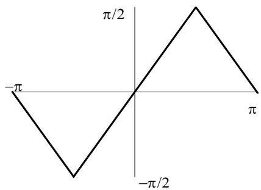

9.(Project） Fourier analysis can be done for functions that are $2 L$ -periodic,i.e. such that $f ( \theta + 2 L ) = f ( \theta )$ for all $_ { x }$ . Discuss how the families of functions $\{ \sin ( k \theta ) , \cos ( k \theta ) \}$ or $\{ e ^ { i k \theta } \}$ have to be adjusted if we take these functions to be defined on $\lfloor - L , L \rfloor$ , and restate some of the results about coefficients. Work out some examples of Fourier series in this more general setting (used by Bernoulli and Fourier).

# 8.3 Fourier Series Theory

We now turn to two important questions about convergence.

· Does the Fourier series for a function $f$ converge? · If the Fourier series for $f$ converges, does it converge to $f$ ？

The answer to the first question is rather complicated. There exist rather complicated examples of periodic continuous functions whose Fourier series don't converge at some points; the first one was constructed by du Bois-Reymond1—see [Pinsky, 2002]. On the other hand, there is a very difficult and famous result of Lennart Carleson(1966) that the Fourier series of continuous functions (actually $\mathcal { L } ^ { 2 }$ functions) must converge at almost every point of their domain,where “almost every” has a precise meaning in measure theory.

The second question is also not trivial: the Fourier series for $f$ may_ converge, but not necessarily to $f$ —see example 8.3.13 at the end of this section.When $f$ is just uniformly continuous,its values can be computed from its Fourier series (we will prove this), even though the series may not actually converge, even pointwise, to $f$

On the other hand,as we shallsee,if the Fourier series for $f$ converges, and $f$ is UC, then the Fourier series converges to $f$

First,note that each of the functions $\sin ( k \theta )$ and $\cos ( k \theta )$ have period $2 \pi / k$ ， $k = 1 , 2 , \dots$ We wouldn't even expect the Fourier series for $f$ to converge to $f$ ,then, unless $f$ is at least $2 \pi$ -periodic, so we will assume this. The following classical result is by no means the best possible general criterion for convergence,but deeper results are beyond the scope of this text. Note how its proof uses the Cauchy Schwartz inequality (Theorem 8.2.19) and Bessel's inequality (Theorem 8.2.17).A lot of classical analysis was created to deal with the kinds of questions the convergence of Fourier series raises.

THEOREM 8.3.1（CONVERGENCE OF FOURIER SERIES） If $f$ has period $2 \pi$ and is uniformly differentiable on $\lfloor - \pi , \pi \rfloor$ , then its Fourier series converges uniformly.

Proof. Let $c _ { k }$ denote the $k$ th Fourier coefficient of $f$ and $c _ { k } ^ { \prime }$ denote the $k$ th Fourier coefficient for $f ^ { \prime }$ . It is easy to see, using integration by parts, that for each $k$ ，

$$
c _ { k } ^ { \prime } = i k c _ { k } .
$$

(This is where we use the periodicity of $f$ .） Since the Fourier coefficients are of the form $\langle f , e ^ { i k t } \rangle$ , we can apply Bessels’ inequality to obtain

$$
\sum _ { k = 1 } ^ { N } k ^ { 2 } \left| c _ { k } \right| ^ { 2 } = \sum _ { k = 1 } ^ { N } \left| c _ { k } ^ { \prime } \right| ^ { 2 } \leq \frac { 1 } { 2 \pi } \int _ { - \pi } ^ { \pi } \left| f ^ { \prime } \right| ^ { 2 } = B < \infty ;
$$

similarly,

$$
\begin{array} { r } { \sum _ { k = 1 } ^ { N } k ^ { 2 } \left| c _ { - k } \right| ^ { 2 } = \sum _ { k = 1 } ^ { N } \left| c _ { - k } ^ { \prime } \right| ^ { 2 } \leq B < \infty . } \end{array}
$$

For integers $M \leq N$ we can also apply the Cauchy-Schwartz inequality to the vectors

$$
\begin{array} { l l l } { { A } } & { { = } } & { { \displaystyle \left( \frac { 1 } { M } , \frac { 1 } { M + 1 } , \cdots , \frac { 1 } { N } \right) } } \\ { { B } } & { { = } } & { { \displaystyle \left( M \left| c _ { M } \right| , \left( M + 1 \right) \left| c _ { M + 1 } \right| , \ldots , N \left| c _ { N } \right| \right) } } \end{array}
$$

which gives us

$$
\begin{array} { r c l } { \sum _ { k = M } ^ { N } | c _ { k } | } & { = } & { \displaystyle \sum _ { k = M } ^ { N } \left( \frac { 1 } { k } \right) \left( k \ | c _ { k } | \right) } \\ & { \leq } & { \displaystyle \left( \sum _ { k = M } ^ { N } \frac { 1 } { k ^ { 2 } } \right) ^ { 1 / 2 } \left( \sum _ { k = M } ^ { N } k ^ { 2 } \ | c _ { k } | ^ { 2 } \right) ^ { 1 / 2 } } \\ & { \leq } & { \displaystyle \left( \sum _ { k = M } ^ { N } \frac { 1 } { k ^ { 2 } } \right) ^ { 1 / 2 } \sqrt { B } . } \end{array}
$$

By the Cauchy test, then, $\scriptstyle \sum _ { k = 1 } ^ { \infty } | c _ { k } |$ converges since $\scriptstyle \sum _ { k = 1 } ^ { \infty } 1 / k ^ { 2 }$ does. Now $| c _ { k } e ^ { i k \theta } | =$ $\left| c _ { k } \right|$ ,SotheWeierrassst(7tellsuatrie $\scriptstyle \sum _ { k = 1 } ^ { \infty } c _ { k } e ^ { i k \theta }$

converges uniformly and absolutely. A similar argument gives convergence of the negative half of the series.

Now we examine the question of what the Fourier series converges to.

Here we will assume only that $f$ is uniformly continuous on $\lfloor - \pi , \pi \rfloor$ and is $2 \pi$ periodic ( $f \left( \theta + 2 \pi \right) = f \left( \theta \right)$ for all $\theta$ ). Since we are interested in what the Fourier series

$$
F ( \theta ) = { et { } { ' } \sum } _ { k = - \infty } ^ { \infty } c _ { k } e ^ { i k \theta }
$$

converges to,we look at the more general power series

$$
U ( x , \theta ) = { \sum } _ { k = - \infty } ^ { \infty } \left( c _ { k } e ^ { i k \theta } \right) x ^ { | k | } .
$$

Note that when $x = 1$ this sum becomes just the Fourier series for $f$ . Although we don't know that the Fourier series converges,Abel's Summation Theorem (Theorem 7.3.35) suggests that we take the limit of this power series as $x \to 1$ . If this limit $L$ exists, then we say that $F$ is Abel summable to $L$ . Our main result will be to show that this limit is just $f ( \theta )$ , so that the Fourier coefficients $c _ { k }$ actually determine $f$

We note first that the coefficients $c _ { k } e ^ { i k \theta }$ of $U ( x , \theta )$ are bounded. This is because

$$
\begin{array} { r c l } { | c _ { k } e ^ { i k \theta } | } & { = } & { | c _ { k } | } \\ & { = } & { \displaystyle \left| \frac { 1 } { 2 \pi } \int _ { - \pi } ^ { \pi } f ( t ) e ^ { - i k t } \ d t \right| } \\ & { \leq } & { \displaystyle \frac { 1 } { 2 \pi } \int _ { - \pi } ^ { \pi } | f ( t ) | \ \left| e ^ { - i k t } \right| \ d t } \\ & { = } & { \displaystyle \frac { 1 } { 2 \pi } \int _ { - \pi } ^ { \pi } | f ( t ) | \ d t = K < \infty } \end{array}
$$

(since $f$ is assumed UC on $\lfloor - \pi , \pi \rfloor$

LEMMA 8.3.2 For each $0 \leq r < 1$ ， $U ( r , \theta )$ converges absolutely and uniformly as a function of $\theta$

Proof. $\sum _ { k = - \infty } ^ { \infty } \left| \left( c _ { k } e ^ { i k \theta } \right) r ^ { | k | } \right| \leq \sum _ { k = - \infty } ^ { \infty } K r ^ { | k | }$ , so this seriesis boudedbyaconvergent geometric series and our result follows from Theorem 7.3.3, the comparison test for series of functions. □

We now replace the coefficients $c _ { k }$ by their values as integrals. Since we have established uniform convergence,we can interchange the order of summation and integration by Proposition 7.2.1; thus, for $0 \leq r < 1$ ，

$$
{ \begin{array} { r c l } { U ( r , \theta ) } & { = } & { \displaystyle \sum _ { k = - \infty } ^ { \infty } c _ { k } e ^ { i k \theta } r ^ { | k | } = \sum _ { k = - \infty } ^ { \infty } \left( { \frac { 1 } { 2 \pi } } \int _ { - \pi } ^ { \pi } f ( t ) e ^ { - i k t } \ d t \right) e ^ { i k \theta } r ^ { | k | } } \\ & { = } & { \displaystyle \int _ { - \pi } ^ { \pi } { \frac { 1 } { 2 \pi } } \left( \sum _ { k = - \infty } ^ { \infty } e ^ { i k ( \theta - t ) } r ^ { | k | } \right) \ f ( t ) \ d t } \\ & { = } & { \displaystyle \int _ { - \pi } ^ { \pi } P ( r , \theta - t ) \ f ( t ) \ d t . } \end{array} }
$$

DEFINITION 8.3.3 (POISSON KERNEL) ${ \cal P } ( r , \phi ) = \frac { 1 } { 2 \pi } \sum _ { k = - \infty } ^ { \infty } e ^ { i k \phi } r ^ { | k | }$ (defined for $0 \leq r < 1$ ） is called the Poisson kernel.

PROPOSITION 8.3.4 Fr0≤r<1,P(r,Φ)=1-2rcoΦ+²’

Proof. This is an exercise; note that $P$ is the sum of two geometric series, one for positive $k$ and the other for negative $k$ ■

DEFINITION 8.3.5（CONVOLUTION） For $f$ and $g$ uniformly continuous $\lfloor - \pi , \pi \rfloor$ ，their convolution $f * g$ is given by

$$
\left( f * g \right) ( x ) = \int _ { - \pi } ^ { \pi } f ( x - t ) g ( t ) \ d t .
$$

PROPOSITION 8.3.6 $f * g = g * f$

Proof. See the exercises.

COROLLARY 8.3.7 For each $0 \leq r < 1$ ， $U ( r , \theta ) = P ( r , \theta ) * f ( \theta ) = f ( \theta ) * P ( r , \theta ) .$

In order to find lim U(r,0), we need to look at the Poisson kernel more carefully. Here are plots of $P ( r , x )$ for a few values of $r$

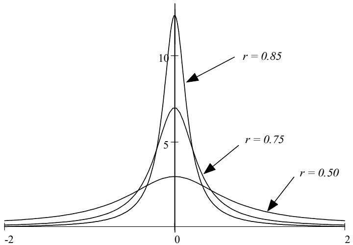  
Poisson kernel

As you can see, values of $r$ approaching 1 give plots more and more concentrated in the middle. Since they also get taller in the middle,one might conjecture that their areas might be constant. This is in fact true；we summarize these crucial properties of $P ( r , \theta )$

LEMMA 8.3.8 The Poisson kernel has the following properties:

1. $P ( r , \theta ) \ge 0$   
2.For all $0 \leq r < 1$ ， $\begin{array} { r } { \frac { 1 } { 2 \pi } \int _ { - \pi } ^ { \pi } P ( r , \theta ) \ d \theta = 1 \ } \end{array}$   
3. For al $\delta > 0$ $\begin{array} { r } { \operatorname* { l i m } _ { r \to 1 } \int _ { \theta = \delta } ^ { \pi } P ( r , \theta ) ~ d \theta = 0 . } \end{array}$

Proof. The explicit formula $\begin{array} { r } { P ( r , \phi ) = \frac { 1 - r ^ { 2 } } { 1 - 2 r \cos \phi + r ^ { 2 } } } \end{array}$ gives thefirstandthird parts, while the second part is proved from the definition of $P ( r , \theta )$ and the basic fact that ${ \frac { 1 } { 2 \pi } } \int _ { - \pi } ^ { \pi } e ^ { i k t } d t = { \left\{ \begin{array} { l l } { 0 } & { { \mathrm { i f ~ } } k \neq 0 } \\ { 1 } & { { \mathrm { i f ~ } } k = 0 } \end{array} \right. }$ . Details are left for the exercises.

Functions that have the three properties enumerated in this last lemma are called approximate identities;see the exercises.

We now come to our fundamental result about limits of Fourier Series.

THEOREM 8.3.9 If $f$ is uniformly continuous, $\operatorname* { l i m } _ { r \to 1 } U ( r , \theta ) = f ( \theta )$

Proof. We compute:

$$
\begin{array} { r l } { \mathbb { E } [ \tau _ { \tau } , \theta , - \tau _ { \theta } ( \theta ) } & { - \left| \int _ { - \infty } ^ { T } P ( \tau _ { \theta } , \theta , - \tau _ { \theta } , f ( \theta ) , \hat { w } - f ( \theta ) \right| } \\ & { - \left| \int _ { - \infty } ^ { T } P ( \tau _ { \theta } , \theta , - \tau _ { \theta } , f ( \theta ) , \hat { w } - f ( \theta ) \right| } \\ & { = \left| \displaystyle \left( \frac { \int _ { - \infty } ^ { T } P ( \tau _ { \theta } , \theta , - \tau _ { \theta } , f ( \theta ) , \hat { w } + \hat { w } - f ( \theta ) , \hat { w } + \hat { w }   } { \mathrm { E } ( \tau _ { \theta } , \theta , - \tau _ { \theta } , \theta ) + \mathrm { E } ( \tau _ { \theta } , \theta ) } \right| } \\ & \right|{ - \ l\right)eft| \displaystyle \left| \int _ { - \infty } ^ { T } P ( \tau _ { \theta } , \theta , f ( \theta ) , \hat { w } - f ( \theta ) , \hat { w } , \theta ) \right| } \\ & { = \left| \displaystyle \left| \frac { \int _ { - \infty } ^ { T } P ( \tau _ { \theta } , \theta , f ( \theta ) , \hat { w } + f ( \theta ) , \hat { w } - f ( \theta ) , \hat { w } , \theta )  } { \mathrm { E } ( \tau _ { \theta } , \theta , - \tau _ { \theta } , \theta ) + \mathrm { E } ( \tau _ { \theta } , \theta ) } \right| } \\ & \right|{ = \left| \displaystyle \int _ { - \infty } ^ { T } P ( \tau _ { \theta } , \theta ) ( f ( \theta - g ) , - f ( \theta ) , \theta ) \right| } \\ & { \leq \int _ { - \infty } ^ { T } P ( \tau _ { \theta } , \theta ) \| f ( \theta - g ) - ( \theta ) \| \mathrm { d } g _ { \infty } \| \mathrm { d } g _ { \infty } } \end{array}
$$

Suppose we are given $\epsilon > 0$ .Since $f$ is UC, we can find a modulus of continuity $\delta = \delta _ { f } ( \epsilon / 2 )$ . We now split the last integral above into two pieces:

$$
\int _ { | t | \leq \delta } P ( r , t ) \mid f ( \theta - t ) - f ( \theta ) | \ d t + \int _ { \delta \leq | t | \leq \pi } P ( r , t ) \mid f ( \theta - t ) - f ( \theta ) | \ d t
$$

By the first two parts of Lemma 8.3.8, $| A | \le \epsilon / 2$ ; on the other hand, by making $r$ close enough to $^ { 1 }$ ， we can make $| B | < \epsilon / 2$ as well, since the continuity of $f$ ensures that $| f ( \theta - t ) - f ( \theta ) |$ is bounded. Thus, $| U ( r , \theta ) - f ( \theta ) |$ can be made less than $\epsilon$ by making $r$ close enough to 1.■

Ok, so let's put together what we now know when $f$ is UC on $\lfloor - \pi , \pi \rfloor$ and the Fourier series for $f$ converges.

1. lim U(r,0)= f(0): this is what we just proved.   
2. Thinking of $U ( r , \theta )$ as a power series in $r$ , we have that $U ( 1 , \theta )$ converges, since $U ( 1 , \theta )$ is the Fourier series for $f$   
3.With minor adjustments,it follows from Abel's Summation Theorem (7.3.35) that $\operatorname* { l i m } _ { r \to 1 } U ( r , \theta ) = U ( 1 , \theta )$

COROLLARY 8.3.1O If the Fourier series for a uniformly continuous, $2 \pi$ -periodic function $f$ converges， it converges to $f$ ; in particular, the Fourier series for any uniformly differentiable function converges to that function.

In working out examples, the following is usually helpful in simplifying computation.

LEMMA 8.3.11 Suppose $f$ is Riemann integrable on $\lfloor - \pi , \pi \rfloor$

1.If $f$ is even (i.e. $f ( - x ) = f ( x ) ,$ , then the Fourier coefficients are given by

$$
\begin{array} { l l l } { { a _ { k } } } & { { = } } & { { \displaystyle \frac { 2 } { \pi } \int _ { 0 } ^ { \pi } f ( t ) \cos ( k t ) ~ d t } } \\ { { b _ { k } } } & { { = } } & { { 0 . } } \end{array}
$$

2.1f $f$ is odd (i.e. $f \left( - x \right) = - f ( x ) )$ , then the Fourier coefficients are given by

$$
\begin{array} { l l l } { { a _ { k } } } & { { = } } & { { 0 } } \\ { { b _ { k } } } & { { = } } & { { { \displaystyle \frac { 2 } { \pi } \int _ { 0 } ^ { \pi } f ( t ) \sin ( k t ) \ d t } . } } \end{array}
$$

The proof of this is left as an exercise.

EXAMPLE 8.3.12 On the interval $\lfloor - \pi , \pi \rfloor$ define the sawtooth function $\Lambda ( \theta ) = \pi - | \theta |$

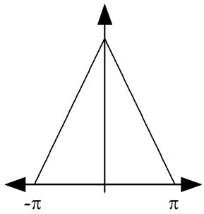

We can extend A to all of $\mathbb { R }$ by requiring $2 \pi$ -periodicity $\Lambda ( \theta + 2 \pi ) = \Lambda ( \theta )$ ：

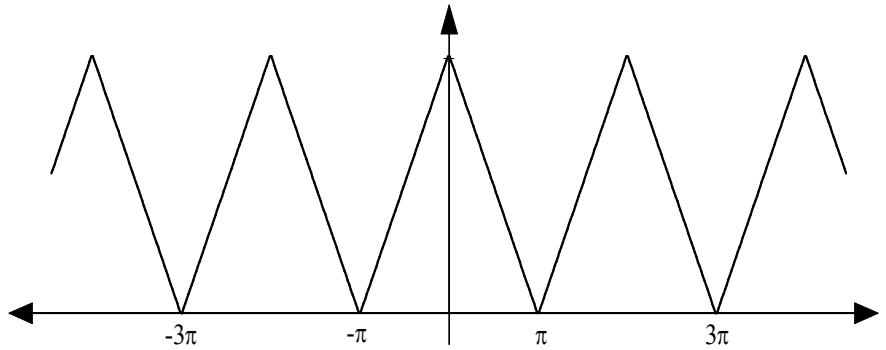  
The sawtooth function $\Lambda ( \theta )$

Since this is an even function, we see from the lemma above that the Fourier coeffcients are given by

$$
\begin{array} { l c l } { { a _ { 0 } } } & { { = } } & { { \pi } } \\ { { } } & { { } } & { { } } \\ { { a _ { k } } } & { { = } } & { { \displaystyle \frac { 2 } { \pi } \left( \frac { \left( - 1 \right) ^ { k } - 1 } { k ^ { 2 } } \right) } } \\ { { } } & { { } } & { { } } \\ { { b _ { k } } } & { { = } } & { { 0 } } \end{array}
$$

Thus, the Fourier series for $\Lambda ( \theta )$ is given by

$$
{ \frac { \pi } { 2 } } + { \frac { 4 } { \pi } } \sum _ { k = 1 } ^ { \infty } { \frac { \cos \left( \left( 2 k - 1 \right) \theta \right) } { ( 2 k - 1 ) ^ { 2 } } } .
$$

Since $\begin{array} { r } { \left| \frac { \cos ( 2 k - 1 ) \theta } { ( 2 k - 1 ) ^ { 2 } } \right| \leq \frac { 1 } { ( 2 k - 1 ) ^ { 2 } } } \end{array}$ ， this series converges absolutely; since $\Lambda$ is continuous, it is equal to its Fourier series. Here is a plot of the Fourier series truncated at $n = 5$ ：

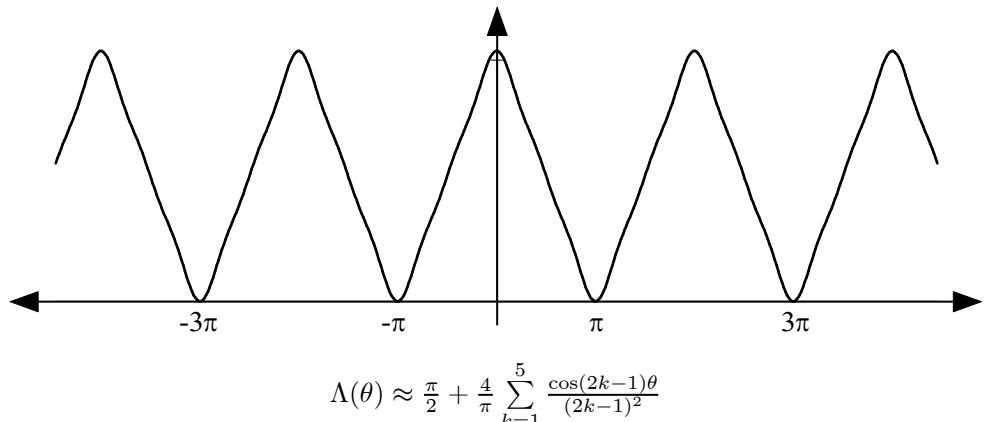

The more terms of the series we take, the sharper the corners on the plot will be.

EXAMPLE 8.3.13 Now we turn to a function that fails to be defined at many points. We start with the interval $( - \pi , \pi )$ and the step function

$$
S ( \theta ) = \left\{ \begin{array} { l l } { 1 } & { i f \pi > \theta > 0 } \\ { - 1 } & { i f - \pi < \theta < 0 } \end{array} \right. .
$$

We note that $S$ is defined only for those $\theta$ for which we can determine either $- \pi <$ $\theta < 0$ or $0 < \theta < \pi$ (see the discussion of these kinds of functions beginning on page 157). We note that $S$ is uniformly continuous on both $( - \pi , 0 )$ and $( 0 , \pi )$ ，so both improper integrals $\textstyle \int _ { - \pi } ^ { \pi } S ( t ) \cos ( k t )$ dt and $\begin{array} { r } { \int _ { - \pi } ^ { \pi } S ( t ) \sin ( k t ) } \end{array}$ dt erist; since $S$ is odd, the first of these is $0$ ， and we have the Fourier coeffcients given by

$$
\begin{array} { l l l } { { a _ { k } } } & { { = } } & { { 0 } } \\ { { b _ { k } } } & { { = } } & { { { \displaystyle \frac { 2 } { \pi } } \left( { \displaystyle \frac { 1 - \cos ( k \pi ) } { k } } \right) = \left\{ \begin{array} { l l } { { 0 } } & { { i f k i s e v e n } } \\ { { { \displaystyle \frac { 4 } { k \pi } } } } & { { i f k i s o d d . } } \end{array} \right. } } \end{array} .
$$

This gives the Fourier series for $S$ ：

$$
{ \frac { 4 } { \pi } } \sum _ { k = 1 } ^ { \infty } { \frac { \sin ( ( 2 k - 1 ) \theta ) } { 2 k - 1 } }
$$

which converges by Dirichlet's test (after a bit of trigonometric manipulation). The convergence is uniform only in closed intervals not containing a multiple of $\boldsymbol { \pi }$ .

We can extend $S$ by periodicity, i.e.by defining $S \left( \theta + 2 \pi \right) = S ( \theta )$ . This defines $S$ on the union of the open intervals $( k \pi , ( k + 1 ) \pi )$ ， $k = 0 , \pm 1 , \pm 2 , . . .$ Here is what it looks like:

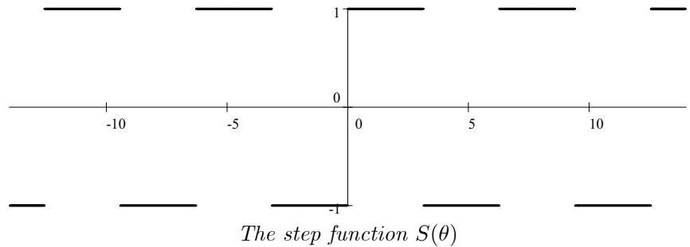

and here is its 5 term Fourier series:

M 1M M $_ 0$ -1 -5 0 5 10 W w W W

$$
\begin{array} { r } { S ( \theta ) \approx \frac { 4 } { \pi } \displaystyle \sum _ { k = 1 } ^ { 5 } \frac { \sin ( ( 2 k - 1 ) \theta ) } { 2 k - 1 } } \end{array}
$$

Because the function $S$ is undefined at multiples of $\boldsymbol { \mathcal { U } }$ ， we cannot conclude automatically that the Fourier series converges at these values of $\theta$ ．In fact,it clearly does (it's O)， but it can't converge uniformly since if it did, the original function $S$ would be uniformly continuous on all of $\mathbb { R }$ ，which it clearly isn't.If you look at the graph of the Fourier series, youll see that it has what appear to be extra high or low “horns” around multiples of $\boldsymbol { \mathcal { U } }$ ； They are examples of what is called the Gibbs phenomenon. When we add on more and more terms of the Fourier series, these horns decrease in width but not in height, which persists in “overshooting” the value of the function near the jump by about $1 8 \%$ . Thus, the Gibbs phenomenon prevents the Fourier series from converging uniformly. Here is a picture with 15 terms of the Fourier series:

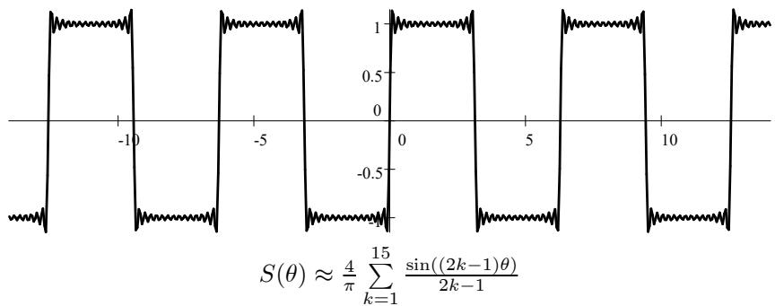

# Some final remarks

The difference between Taylor and Fourier series is often expressed by the statement “Taylor series are local in nature while Fourier series are global.” To understand this,recall that the Taylor series for $f$ is determined by the values of the successive derivatives of $f$ at a single reference point $x = c$ . Functions that have a Taylor series must be infinitely differentiable at $c$ ,and the convergence of the Taylor series (when it converges to $f$ ) is much better the closer $_ { x }$ is to $c$ ,as you can see from the presence of $( x - c ) ^ { n + 1 }$ in the expression for the remainder (see Theorem 7.4.8).

Fourier series,on the other hand,exist when their coefficients can be calculated. These coefficients are defined by integrals (not derivatives)，and the form of these integrals, $\textstyle { \frac { 1 } { 2 \pi } } \int _ { - \pi } ^ { \pi } f ( t ) \ e ^ { - i k t } \ d t$ ， suggests that they are averages, with the function e-ikt acting as a weight. Thus, the Fourier series depends on the values of the function not at a single point,but over an entire interval. From Carleson's very difficult theorem,we know that the Fourier series of a continuous function converges almost everywhere,but even from the more elementary results in this book,we see that the Fourier series determines the function (it is a limit of convolutions) and that we get convergence with just the assumption of uniform differentiability.

When a function is not periodic, it obviously cannot have a Fourier series converging to it everywhere. If the function is defined on all of $\mathbb { R }$ or on an interval where its values don't agree on the endpoints, trying to force periodicity causes inaccuracies in the Fourier series representation (e.g. the Gibbs phenomenon). One way around this is to allow non-integer, even irrational, frequencies in the trigonometric functions $\sin \alpha t$ . When this is the case,it doesn't make sense to expand the function as a series; instead, we think of the assignment of Fourier coefficients itself as a representation of the function. Starting with $f ( t )$ as a function of the“time”variable $t$ , we create the Fourier transform function ${ \widehat { f } } ( s )$ as a function of the frequency $s$ ：

$$
{ \widehat { f } } ( s ) = \int _ { - \infty } ^ { \infty } f ( t ) e ^ { - i s t } \ d t .
$$

If $f$ satisfies certain technical hypotheses,its Fourier transform will exist.Furthermore, $f$ is recoverable from its transform via the inverse transform:

$$
f ( t ) = { \frac { 1 } { 2 \pi } } \int _ { - \infty } ^ { \infty } { \widehat { f } } ( s ) e ^ { i s t } \ d s .
$$

In the theory, the functions $f$ and $\widehat { f }$ are regarded simply as dual ways of describing the same data: one from a temporal or time domain point of view,the other from a frequency domain point of view. This perspective,along with beautiful formulas relating simple functions with their Fourier transforms and multiplication with convolution， provides deep insights into the ways functions can describe physical processes. There are important applications to signal and image-processing. Finally, the (re)discovery of the Fast Fourier Transform (FFT） has enabled computers to calculate transforms of functions represented by data very quickly, thus providing practical techniques for digital filtering and smoothing.

Arguably, the study of Fourier analysis has provided much of the stimulus for the development of modern analysis, starting with the precise definition of convergence (pointwise vs. uniform） and continuing with the creation of abstract notions of function and inner product spaces, convolution and transform theory,and harmonic analysis on more general topological spaces. I hope that the introduction provided by this book will encourage you to look further into these exciting topics.

# Exercises

1. Prove that convolution is commutative, i.e. $f * g = g * f$ (Proposition 7.5.13 will be useful).   
2. As was suggested in the text, integration is a continuous form of addition. With this in mind,what is the analogy between convolution and multiplication of polynomials or series (see Cauchy products of series on page 136 and exercise 10 on page 252).   
3.A function $g ( r , t )$ is called an approximate identity if it has the following properties,enumerated in Lemma 8.3.8:

(a) $g ( r , t ) \geq 0$ (resp. $g _ { k } ( t ) \geq 0$ ）(b) For all $0 \leq r < 1$ , ∫=π g(r,t) dt =1(c) For all $\delta > 0$ ， $\begin{array} { r } { \operatorname* { l i m } _ { r \to 1 } \int _ { t = \delta } ^ { \pi } g ( r , t ) \ d t = 0 . } \end{array}$

Show that if $f$ is $2 \pi$ -periodic and uniformly continuous on $\lfloor - \pi , \pi \rfloor$ ,then

$$
\operatorname* { l i m } _ { r \to 1 } f ( \theta ) * g ( r , \theta ) = f ( \theta ) .
$$

4. We can also define an approximate identity in a different way, as a sequence of functions $g _ { k } ( t )$ such that

$$
{ \begin{array} { r l } & { { \mathrm { ( a ) ~ } } \operatorname { F o r ~ a l l } \ k , \ g _ { k } ( t ) \geq 0 } \\ & { { \mathrm { ( b ) ~ } } \operatorname { F o r ~ a l l } \ k , \int _ { - \pi } ^ { \pi } g _ { k } ( t ) \ d t = 1 } \\ & { { \mathrm { ( c ) ~ } } \operatorname { F o r ~ a l l } \ \delta > 0 , \ \operatorname* { l i m } _ { k \to \infty } \int _ { t = \delta } ^ { \pi } g _ { k } ( t ) \ d t = 0 . } \end{array} }
$$

Show that if $f$ is $2 \pi$ -periodic and uniformly continuous on $\lfloor - \pi , \pi \rfloor$ ,then

$$
\operatorname* { l i m } _ { k \to \infty } f ( \theta ) * g _ { k } ( \theta ) = f ( \theta ) .
$$

5. In exercise 3 on page 275,you were asked to compute the Fourier series for the functions listed below. Now discuss the convergence of these series.

(a) $f ( \theta ) = 3 + 2 \sin ( 5 \theta ) - 5 \cos ( \theta )$   
(b) $f ( \theta ) = \cos ( \theta / 2 )$   
(c） $f ( \theta ) = \sin ^ { 2 } ( \theta )$   
(d) $f ( \theta ) = \theta$   
(e） $f ( \theta ) = | \theta |$   
(f) $f ( \theta ) = \pi - | \theta |$

6.Discussteconvergenceofthesries ${ \frac { 4 } { \pi } } \sum _ { k = 0 } ^ { \infty } { \frac { ( - 1 ) ^ { k } \sin ( 2 k + 1 ) x } { ( 2 k + 1 ) ^ { 2 } } }$ (-1) sin(2k+1)𝑥.What function does it converge to? (Make some plots!)

[Benacerraf-Putnam,1984] P. Benacerraf, H. Putnam,ed., Philosophy of Mathematics, ${ \boldsymbol { \mathit { \omega } } } _ { \mathcal { Z } }$ nd edition, Cambridge Univ. Press, Cambridge 1984

[Borwein, 2Oo5] D.Borwein,review of Tauberian Theory, in Bulletin of the Amer.   
Math.Soc., v. 42, no.3,pp.401-406 (2005).

[Bridger-Stolzenberg,1999] M. Bridger, G. Stolzenberg,“Uniform Calculus and the Law of Bounded Change”，Amer. Math. Monthly. v. 106 no. 7,pp. 628-635 (August-September 1999).

[Folland,1992] G.B. Folland, Fourier Analysis and its Applications, Brooks-Cole, Pacific Grove, 1992.

[Kaczor-Nowak, 20o0] W.J. Kaczor, M.T. Nowak, Problems in Mathematical Analysis I,II, Amer.Math.Soc., Providence, 2000.

[Lewin, 20o3] J.Lewin,An Interactive Introduction to Mathematical Analysis, Cambridge Univ.Press, Cambridge (UK), 2003.

[Mattuck, 1999] A. Mattuck, Introduction to Analysis, Prentice-Hall, Upper Saddle River,1999.

[Mercer, 2005] P.R. Mercer，“Error Estimates For Numerical Integration Rules”, College.Math. J. v. 36 no. 1, pp. 27-34 (January 2005).

[Pinsky, 2Oo2] M.A. Pinsky, Introduction to Fourier Analysis and Wavelets, BrooksCole,Pacific Grove,2002.

[Spivak,1994] M. Spivak,Calculus,3rd Ed.,Publish or Perish,Houston,1994.

[Stade, 20o5] E. Stade, Fourier Analysis, John Wiley and Sons, New Jersey, 2005.

[Strichartz, 1995] R.S. Strichartz, The Way of Analysis, Jones and Bartlett, Boston, 1995.

# Symbols

$A ^ { x }$ ,88   
C,275   
C2,36   
e,96   
${ \mathcal { F } } ^ { * }$ ,35   
$\subset , 1 3$   
$\langle ~ , ~ \rangle$ ， see iner product   
Sg,168   
n,22   
$\Lambda ( a )$ ,94   
$\leq , \ 2 8$   
$< , 2 7$   
$\operatorname { l i m } ( S )$ ,61   
N,1   
$N _ { a } ( \epsilon )$ ,99   
$\mathbb { Q }$ ，4   
$\mathbb { R } , 3 9$   
$\mathbb { R } ^ { * }$ ，41   
$\sim , 2 5$   
$S \to X$ ,64   
$A \cup B$ ，152   
$x ^ { u }$ ，96   
Z,3   
Abel 's Lemma, 249 -'s Summation Theorem, 249 —'s test, 126 summability, 250 summation, 249 summation,129   
absolutely integrable,180   
absolute value of family of intervals, 25 of interval, 18 properties,49 when $| X - A | < E$ ，49   
addition

of families of intervals, 25 of rational intervals,14 alternating series test,123 amalgamation of functions,153 antiderivative,198 approximation of reals by rationals, 55 arcsine, 212 arctangent,212 arithmetic operations on reals,44 averagevalue,176,183

Bessel's inequality, 281   
betweenness,52   
bisection method, 38   
bounded away from O on a set,142 on a set,142 positively, 74   
bounds for families rational, 28 real, 64   
$\mathit { c 2 }$ exercise, 38   
cancellation law for real addition,45 for real multiplication, 45   
can't be ruled out,50   
Cauchy Completeness Theorem,103 product and Abel's Theorem, 252 product of series,136 sequence,102 sequence of functions, 224   
Cauchy-Schwartz inequality, 282   
chain rule, 193   
change of variables in integrals, 210   
comparison test for improper integrals,180 for series, 117 for series of functions, 240   
Completeness Theorem, 62   
complex numbers definitions, 275   
concavity, and the second derivative, 208   
consistent families of intervals, 25 family of intervals, 24 for families of real intervals, 60   
continuity at a point (exercise),147 of inverse functions,161 uniform, function of 1 variable,139 uniform， function of 2 variables, 213   
contraction map,129   
convergence Abel's test,126 alternating series test,123 Cauchy criterion, 102 comparison test,117 of a definite integral, 177 Dirichlet's test for improper integrals, 217 for series of functions, 229 for series of numbers,125 of a series of functions, 239 of Fourier Series for UD functions, 285 $p$ -series test,117 of power series in a disk, 241 of power series: Main Theorem, 241 radius of convergence, 244 ratio test,121 root test,121 of a sequence Cauchy criterion,102 of a sequence of functions pointwise, 223 uniform, 224 of a sequence, 99 of a series, 113 absolute convergence,120 conditional convergence,120 tail convergence for integrals, 179 for series, 115   
convolution, 287   
cosine function, 262   
cross functions don't cross,174   
cube root of 2 (family), 36 exercise, 38   
decreasing, strictly decreasing, 198   
dense,149   
derivative continuity of, 188 definition, 187 $_ { n }$ th,204 partial, 213 uniqueness of, 188   
difference quotient,185   
differentiable,187 modulus of differentiability,187 $_ { n }$ times,204   
differentiation of arithmetic combinations,192 of compositions,193 of $e ^ { x }$ ，188 of inverse functions,194 of $\ln x$ ，189 of power functions,194 of quotients,193 under the integral sign, 214   
Dirichlet's test for improper integrals, 217 for series of functions, 229 for series of numbers,125   
discontinuous functions,157   
divergence of improper integal, 178 of a series, 113   
divide and average (square roots), 39   
division of reals,45   
dominated convergence for parametrized functions, 215, 2 for sequences of functions, 235   
don't cross functions don't cross, 174   
$^ e$ ,96   
$\epsilon$ -trichotomy, 56   
epsilon-trichotomy, 56   
Eudoxus’Method of Exhaustion,65   
Euler number $e$ ，96 $\operatorname* { l i m } ( 1 + 1 / k ) ^ { k }$ ，111   
Euler's formula, 279   
exp power series, 248 inverse to log (exercise), 219   
exponential functions as power series, 248 definition, 88 fundamental inequality for rational exponents, 85 for real exponents, 90 limiting family for, 87   
exponentially bounded, 183   
Extension Theorem for uniformly continuous functions,150   
extrema,approximating, 144   
families arithmetic operations,25 consistent, 24, 25   
fine families of rational intervals, 32 families of real intervals, 60   
fixed point,129   
Fourier complex series,280 sine and cosine series, 274 transform,293   
FTC,see Fundamental Theorem of Calculus   
Fubini's Theorem, 214   
function 1-to-1, 71 affine, 71 definition,70 fractional-linear,71 inverse,71 limit of, 109 non-continuous, 157 Nth power, 71   
functions defined as integrals, 211   
Fundamental Theorem of Calculus Part I, 197 Part II, 198   
Gamma function definition, 181 properties (exercise), 217   
geometric series convergence of, 114   
Gibbs phenomenon, 292   
Goldbach Conjecture, 67 number, 67   
harmonic series alternating,124 diverges, 116   
Heaviside function, 158   
Holder's inequality, 209   
hypergeometric series exercise, 251   
improper integral convergence of, 177 definition, 177 divergence of, 178 doubly infinite,179   
increasing, strictly increasing, 198   
inequalities and arithmetic operations,46   
inequality strict for families of intervals,27 for rational intervals, 16 for rational numbers,4 for real intervals, 59 for reals (as families), 40 weak,5 for families of intervals, 28 for real intervals, 59 for reals (as families), 40   
injective function, 71   
inner product general properties,280 of functions, 280   
integers,3   
integral defining family,167 defining properties, 165 definition, 168 improper, 177 linearity, 175 of piecewise function (exercise),18   
integration by parts, 211 by substitution, 210   
intersect (intervals), 22   
intersection of intervals in terms of endpoints, 22   
interval punctured, 151 rational, 12 real, 59 smallest with property P, 15 types,70   
inverse function,71   
Inverse Function Theorem continuity in two-sided case,161 for decreasing functions, 79 Lipschitz conditions,74 one-sided case,80 two-sided case, 80 with positive derivatives, 200   
P'Hopital's rule, 206   
Laplace transform definition, 181 existence,183 properties (exercise), 218   
Law of Bounded Change, 197 generalized, 199   
laws of exponents for integer exponents, 83 for rational exponents, 84 for real exponents, 88   
LBC, see Law of Bounded Change   
limit of a family of real intervals, 61 of a function, 109 of a limiting family, 63 of a sequence, 99   
limit comparison test for improper integrals,180 for series, 118   
limiting family, 63   
limits algebra of, 101 preserve weak inequalities,101   
linearity of the integral, 175   
Lipschitz condition,72 for exponential functions, 85,89, 90 for power functions,79   
local max or min, 204   
logarithm definition, 92 basic properties, 93 defined as an integral (exercise), 219 domain for, 92   
M-test (Weierstrass), 228   
mathematical induction, 2   
max for a function (approximating),144 for families, 25 for intervals,18 properties of $\operatorname* { m a x } ( A , B )$ ，48   
Method of Exhaustion, 65   
min for a function (approximating),144 for families,25 for intervals, 18 properties of $\operatorname* { m i n } ( A , B )$ ，48   
Minkowski's inequality, 209   
modulus of continuity, 139 of differentiability,187 weak vs. strong, 99   
modulus of convergence for a Cauchy sequence, 102 for a sequence, 99 for a sequence of functions, 224   
multiplication of rational intervals, 14   
natural numbers,1   
negative of a family of intervals, 25 of rational interval, 14

norm of a function, 281 nth root function,80

onto function,71   
orthogonal functions, 281   
orthonormal, 281   
overspreads, 61   
partial derivative, 213   
partial sum,112   
partition (of an interval),166   
period, 265   
periodic,265 $2 \pi$ -periodic, 274   
pi definition, 264 lies between 3 and 4, 267 properties of, 264   
pointwise limit, of a sequence of functions, 225   
Poisson kernel, 287   
power function definition for real exponent, 96 derivative,194 Lipschitz conditions,79   
power series convergence of (definition), 240 definition of, 240 term-by-term differentiation, 243 term-by-term integration, 243 uniqueness centered at 0, 245 centered at c, 254   
powers integer exponent,83 limiting family for, 86 rational exponent, 84   
product of families of intervals, 25 of intervals,14   
product rule,192   
punctured interval,151   
quotient rule,193   
$r ( x , y )$

in derivative definition,185 $r ( x , y ) \to 0$ ，186 Raabe's test,269 radius of convergence definition,244 example,using the ratio test, 245 $\operatorname* { l i m } { \left| s _ { k } \right| } ^ { 1 / k }$ 1/k,244 ratio test,121 rational approximation,55 rational numbers,4 real number arithmetic,45 real numbers definition,39 definition as Cauchy sequences,108 equality, 40 reciprocal of family of intervals,25 of rational interval,17 Riemann integrability, 182 integral, see integral sum,166 Riemann-Lebesgue lemma, 203 root ( $_ n$ th root), 80 root test for convergence,121 ruled out, 50

sawtooth function, Fourier series of, 289   
secant line (exercise), 208   
second derivative test, 205   
sequence Cauchy, 102 convergence to a limit, 99 definition, 99 of functions, 223   
series alternating,121 convergence, see convergence geometric,114 rearrangement of,134   
sine function, 262   
smallest interval,15   
smallest interval with property $P$ ，15   
step function, 158 Fourier series,291   
subsequence,106,243   
subtitution in integrals, 210   
subtraction of families of intervals, 25 of rational intervals,14 of reals, 45   
surjective function, 71   
tail convergence for integrals, 179 for series, 115   
tangent (function), 265   
tangent line, 208   
Tauberian theorems,250 Hardy-Littlewood, 250   
Taylor polynomials,255 remainder,as integral, 259 series,256 for binomial functions, 257 for exponential functions, 257 may not converge to f, 257   
Taylor's Theorem with remainder, 256   
triangle inequality for rationals, 5 for reals, 50   
trichotomy $\epsilon$ -trichotomy, 56 for rational numbers,5 for real numbers,56   
trigonometric functions addition formulas, 263 definition, 262 differential equation for, 262 periodicity, 265   
truncation error estimate, 119   
UC (uniformly continuous), 139   
UD (uniformly differentiable),187   
uniform convergence of a sequence of functions, 224 of an improper integral, 215   
uniform limit of UC functions, 226   
uniformly continuous function of 1 variable, 139 function of 2 variables, 213 functions:Extension Theorem,150   
union of intervals $( A \cup B )$ of intervals,152   
unit definition, 47 properties,47 see also $\mathbb { R } ^ { * }$ ，41   
weak inequality preserved in the limit,101,110   
Weierstrass M-test, 228   
Wiggle Lemma for the rationals, 5 for the reals, 56

# Published Titles in This Series

38Mark Bridger，Real Analysis,2019   
33 Brad G. Osgood, Lectures on the Fourier Transform and Its Applications, 2019   
32John M.Erdman，A Problems Based Course in Advanced Calculus, 2018   
31Benjamin Hutz,An Experimental Introduction to Number Theory,2018   
30 Steven J.Miller,Mathematics of Optimization: How to do Things Faster, 2017   
29 Tom L.Lindstrom，Spaces,2017   
28 Randall Pruim,Foundations and Applications of Statistics:An Introduction Using R, Second Edition,2018   
27 Shahriar Shahriari,Algebra in Action, 2017   
26 Tamara J.Lakins，The Tools of Mathematical Reasoning,2016   
25 Hossein Hosseini Giv,Mathematical Analysis and Its Inherent Nature,2016   
24 Helene Shapiro,Linear Algebra and Matrices,2015   
23 Sergei Ovchinnikov,Number Systems,2015   
22 HughL.Montgomery，Early Fourier Analysis,2014   
21 John M.Lee,Axiomatic Geometry, 2013   
20 Paul J.Sally, Jr.,Fundamentals of Mathematical Analysis, 2013   
19 R.Clark Robinson,An Introduction to Dynamical Systems: Continuous and Discrete, Second Edition, 2012   
18Joseph L.Taylor，Foundations of Analysis,2012   
17 Peter Duren, Invitation to Classical Analysis,2012   
16 Joseph L. Taylor,Complex Variables, 2011   
15Mark A.Pinsky,Partial Differential Equations and Boundary-Value Problems with Applications,Third Edition,1998   
14Michael E.Taylor,Introduction to Differential Equations,2011   
13 Randall Pruim,Foundations and Applications of Statistics,2011   
12John P.D'Angelo,An Introduction to Complex Analysis and Geometry, 2010   
11 Mark R.Sepanski,Algebra,2010   
10 Sue E.Goodman，Beginning Topology, 2005   
9Ronald Solomon，Abstract Algebra,2003 8I.Martin Isaacs,Geometry for College Students, 2001 7Victor Goodman and Joseph Stampfli,The Mathematics of Finance, 2001   
6Michael A.Bean，Probability:The Science of Uncertainty, 2001 5Patrick M.Fitzpatrick,Advanced Calculus,Second Edition, 2006 4Gerald B.Folland,Fourier Analysis and Its Applications,1992 3 Bettina Richmond and Thomas Richmond,A Discrete Transition to Advanced Mathematics,2004   
2David Kincaid and Ward Cheney, Numerical Analysis: Mathematics of Scientific Computing,Third Edition,2002   
1 Edward D.Gaughan,Introduction to Analysis,Fifth Edition,1998

Real Analysis: A Constructive Approach Through Interval Arithmetic presents a careful treatment of calculus and its theoretical underpinnings from the constructivist point of view. This leads to an important and unique feature of this book: All existence proofs are direct, so showing that the numbers or functions in question exist means exactly that they can be explicitly calculated. For example,at the very beginning, the real numbers are shown to exist because they are constructed from the rationals using interval arithmetic. This approach, with its clear analogy to scientific measurement with tolerances,is taken throughout the book and makes the subject especially relevant and appealing to students with an interest in computing, applied mathematics, the sciences, and engineering.

The first part of the book contains all the usual material in a standard onesemester course in analysis of functions of a single real variable: continuity (uniform, not pointwise)，derivatives,integrals,and convergence. The second part contains enough more technical material-including an introduction to complex variables and Fourier series-to fill out a full-year course. Throughout the book the emphasis on rigorous and direct proofs is supported by an abundance of examples，exercises,and projects-many with hints-at the end of every section. The exposition is informal but exceptionally clear and well motivated throughout.